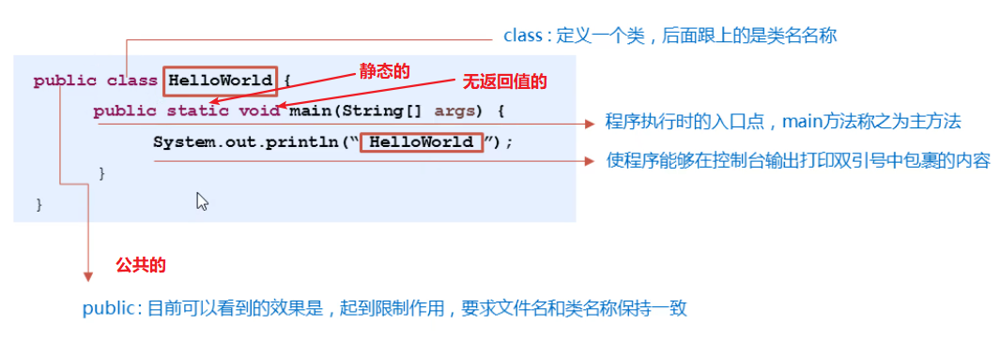

# java概述(了解)

## java是什么

```java
是一种计算机编程语言;
```

## java的分类

### 有3个分类

1. javaSE  基础
2. javaMe  小型嵌入式语言;(桌面应用)
3. javaEE   企业级应用开发;(做网站,为企业提供服务)

## java跨平台原理


> java语言可以跨平台,可以做到一处编写,到处运行;

## JDK-JRE-JVM的关系和作用


## JDK的下载和安装

1. 建议安装jdk11
2. 建议安装目录不带中文和空格

## 打开DOS窗口时指定文件夹(需要掌握)

1. 使用鼠标在图形化界面中直接点入到想打开的文件夹;
2. 在地址栏直接输入cmd然后回车即可;

### 常用dos命令(了解):


## 环境变量配置(能够独立操作)

### 配置环境变量的目的是什么?

答:

```java
为了在任意目录下都能找到java和javac工具;
```

### 如何配

分两种方式,

**第一种方式标准配置:**

分两个步骤:

1. 建议配置标准名称: JAVA_HOME,对应的值是jdk的安装路径,不要包含bin那一级;
2. 在path中将JAVA_HOME添加进去即可;


**第二种配置方式是直接在path中配置:**

只有一个步骤,将jdk的安装路径直接复制到path路径中即可;


### 注意事项

可能会出现电脑重启失效问题;一般是由于系统原因导致,建议使用专业版系统即可;

临时解决: 直接将jdk的安装路径包含bin那一级复制到path变量中即可;

# java入门案例(重点)

## 代码编写通用步骤

1. 编写代码

   1. 创建一个后缀名是.java的文件;

      在文件中写代码的时候,注意文件名和第3个单词保持一致,包括大小写;

      ```java
      public class Hello{
      	public static void main(String[] args){
      		System.out.println("迪丽热巴");
      	}
      }
      ```
      
      **注意事项**: 如果文件中有中文,保存文件的时候,一定要选择编码格式为: ANSI;否则中文乱码;
   
2. 编译代码

   1. 使用dos命令先进入到代码所在的文件夹中;
   2. 敲命令:   javac 文件名.java

3. 运行代码

   1. 敲命令:  java 文件名

## 入门案例代码详解



## java代码格式规范

1. java中的所有括号一定都是成对的;
2. 如果有大括号,则不写分号,如果没有大括号,则一定写分号;

## notepad++软件的安装和使用

### 必要的设置


### 个性化设置


# java语法

## 注释

### 概述

```java
对代码进行解释说明的文字,不会影响代码的运行;
```

### 分类

有3类;

1. 单行注释    //
2. 多行注释   /**/
3. 文档注释  /**  */


### 注意事项

多行注释,或文档注释不能嵌套使用;

## 关键字

### 概述

```java
被java赋予了特殊含义的单词;
```

### 特点

1. 变色
2. 全小写的英文单词

## 常量(需要记忆格式)

### 概述

```java
在程序运行期间,其值不会发生改变的数据就是常量!
```

### 分类

有6类;


null是一个特殊的值,表示什么都没有,所以不能直接打印它;

## 变量(重点)

### 概述

```java
变量就是内存中的存储空间,空间内存储着经常发生改变的数据;(相当于生活中的小盒子)
```

### 定义格式


### 数据类型

#### 概述

```java
java对数据规定的类型的名称(单词);
```

#### 分类


#### 基本数据类型

```java
byte,short,int,long,float,double,char,boolean
```

#### 基本数据类型对应的8个单词


字符串在java中属于引用数据类型,但是字符串又是java中最特殊的引用数据类型,可以当成基本数据类型使用;使用的时候,使用**String**类型表示即可;

### 变量的使用格式


### 变量的注意事项


## 键盘输入(重点)

### 概述

```java
就是在代码运行期间,允许用户通过键盘输入一些数据到程序中;
```

### 使用步骤

分3个步骤;

```java
步骤1: 导包, 需要写在class的上面
	import java.util.Scanner;
步骤2: 创建对象
	Scanner abc = new Scanner(System.in);
步骤3: 使用变量接受数据
	int a = abc.nextInt();
	double b = abc.nextDouble();
	键盘输入字符串:
	String s = abc.next();
```

### 扩展-键盘输入小数和字符串

```java
扩展:
		使用键盘输入整数,小数,字符串
		
		步骤1: 导包, 需要写在class的上面2    
		import java.util.Scanner;
		步骤2: 创建对象    
		Scanner abc = new Scanner(System.in);
		步骤3: 使用变量接受数据    
		int a = abc.nextInt();   
		double b = abc.nextDouble();    
		键盘输入字符串:    
		String s = abc.next();
```

## 标识符(会用即可)

### 硬性规定


### 软性建议


