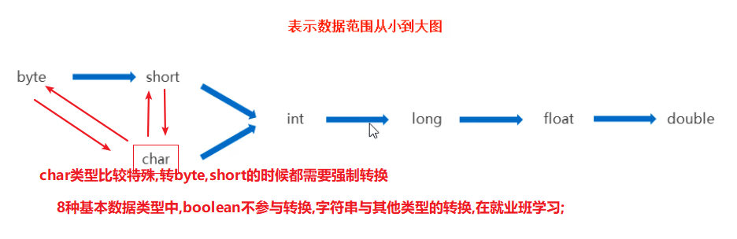
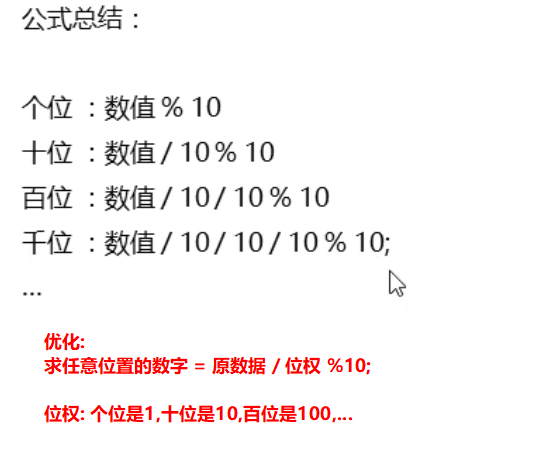
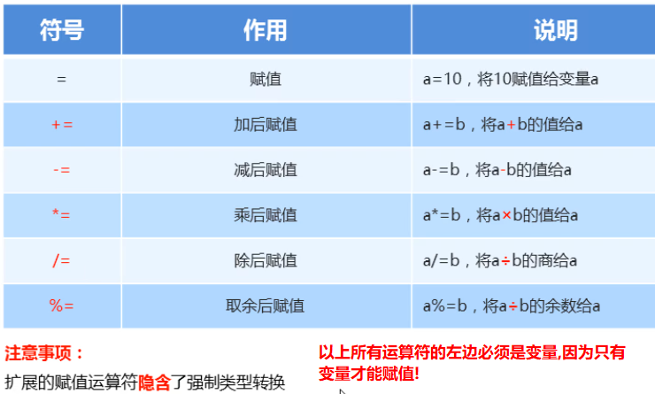
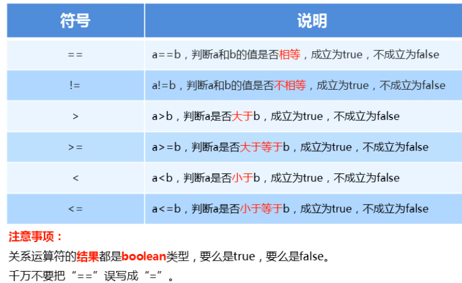
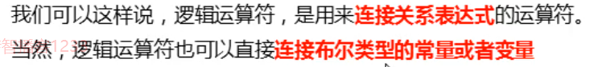
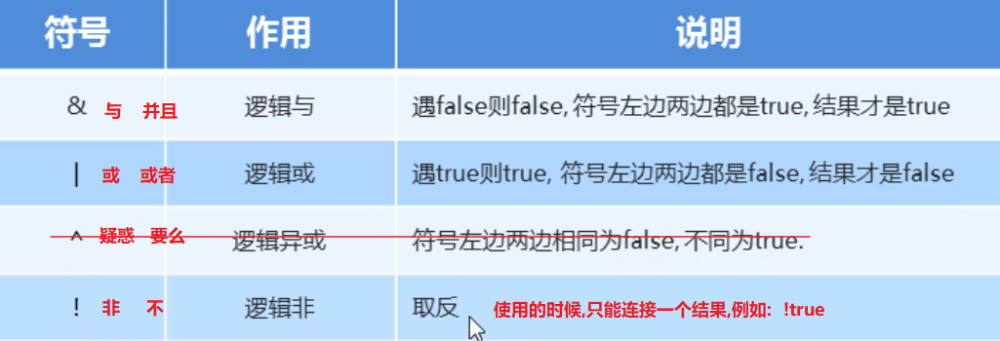
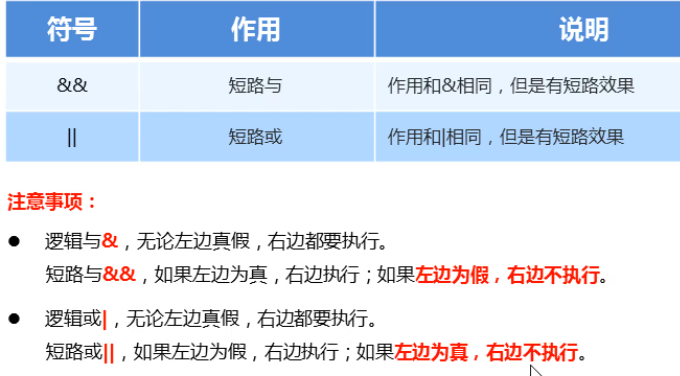
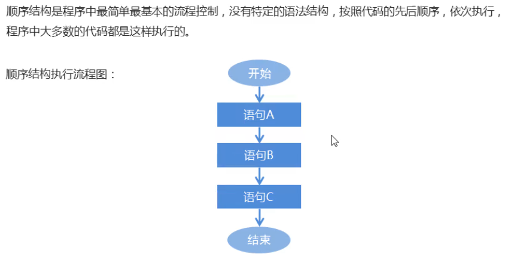
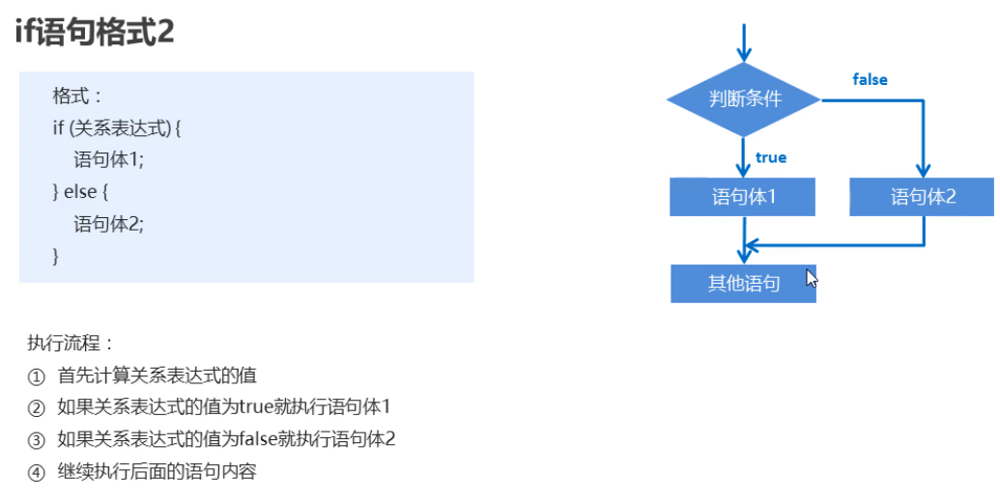
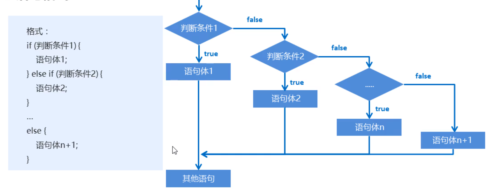

# 类型转换(了解)

## 什么是类型转换?

```java
数据从一种数据类型变成另一种数据类型这就是类型转换;
```

## 为什么要类型转换?

```java
因为java是强类型语言,当参与运算的多个数据类型不一样的时候,必须先将所有的数据类型统一,然后才能进行运算;此时利用类型转换的技术就可以将不同类型的数据类型统一了;
```

## 怎么进行类型转换?

### 有两种转换方式

### 隐式转换

**概述**

```java
小的数据转成大的类型,这个过程就是隐式转换;(自动转换),因为这个过程没有风险;
```

**格式**

```java
大的数据类型 变量名 = 小的数据值;
```

### 强制转换

**格式**

```java
小的数据类型 变量名 = (小的数据类型)大的数据值;
```

### 数据类型的大小顺序



## 注意事项

1. byte,short,char这三种类型参与运算的时候,都会先提升成int类型,然后再参与运算;
2. 整数常量运算的时候,在编译期间会对常量运算进行优化,以提升程序的运行效率;

# 运算符

## 概述

```java
可以对数据进行运算的符号就是运算符;
```

## 分类

### 算术运算符

#### 概述

```java
进行算术运算的符号;
```

#### 运算特点

```java
加减乘都是和数学一样,除法需要注意,整数相除只能得到整数,会自动舍弃余数,如果想得到小数,必须有小数参与运算才可以;
余数使用百分号表示(%),除法使用 斜杠表示(/);
```

### 字符运算

#### 原理

```java
每个字符都有一个对应的数字,当我们使用字符进行算术运算的时候,真正参与运算的是字符所对应的数字;
```

#### 常见字符对应关系

'a' --->  97

'A' --->  65

'0' --->  48

### 字符串的拼接(很常见)

#### 原理

```java
拼接;(直接站在一起)
```

### 求任意位置数字公式总结(记住)




### 自增自减运算符

```java
自身进行加1或减一的操作的运算符;
有两个: ++  -- 

注意有位置上的问题,++--与变量的位置,会影响复合运算的顺序;如果是单独运算,则位置没有影响;

结论:
仔细观察,然后推导;
如果先看到了变量的名字,那么就是先获取变量的值参与其他运算,然后才看到的++--,就意味着自增和自减的行为较慢,
如果先看到了++--运算符,那么就让这个变量先进行自增或自减操作,然后才能参与其他运算;
```

### 赋值运算符



### 比较运算符(关系运算符)



### 逻辑运算符

#### 概述



#### 特点


#### 包含的运算符



### 短路的逻辑运算符



### 三元运算符

#### 概述

```java
有3部分元素参与运算的符号就是三元运算符;
```

#### 三元运算符语法格式

	关系表达式 ? 表达式1 : 表达式2;

#### 执行流程：

​			首先计算关系表达式的值
​			如果值为true，取表达式1的值
​			如果值为false，取表达式2的值

#### 应用场景

只有涉及到**两个数据中找其一**,才考虑使用三元运算符,否则统统使用if语句;

# 流程控制语句

## 概述

```java
使用一些语句对代码执行的顺序进行控制;
```

## 顺序结构



## if语句

### 概述

```java
对某个条件进行判断,并根据判断的结果作出相应的处理;
```

### 分类

有3种格式;

#### 格式1

对单一的一个条件进行判断,满足就做,不满足就不做这个事情;

**代码格式：**

```java
	if(条件){
        条件为true就执行这里,否则就不执行这里的代码;
    }
```

**执行流程：**

			首先计算关系表达式的值
			如果关系表达式的值为true就执行语句体
			如果关系表达式的值为false就不执行语句体
			继续执行后面的语句内容

**注意事项:**

1. 如果if语句所控制的语句体, 是一条语句, 大括可以省略不写
			但是不建议!
2.  if语句的小括后面, 不要写分号	;

#### 格式2

应用场景就是生活中的二选一的情况;



#### 格式3

多选一;可以有多个条件,每个条件都是独立判断,只有当前一个条件是false的时候,下一个条件才有机会开始判断;



# 今日课堂练习

1. 数值拆分案例
2. 三个和尚;(和尚的身高由键盘输入获得)
3. 考试奖励案例;(不套娃写一遍,套娃写一遍)
4. 课后练习题;

