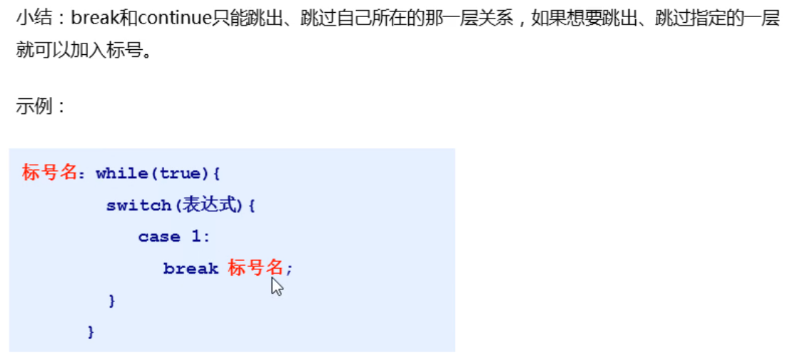

# switch语句(了解)

## 概述

```java
switch语句也是分支语句的一种,可以对某些已经给出的指定值进行比对,根据比对的结果执行相应的操作;
```

## 使用场景

```java
只有对byte,short,int,char,String,枚举类型的数据值进行比对的时候,才可以使用switch语句;其他情况都应该使用if...else if语句;
简单记:所有能使用switch的时候,一定能用if...else  if,反之不行;
```

## 语法格式

```java
switch(数据值){
    case 值1:
        对应执行的代码1;
        break;
    case 值2:
        对应执行的代码2;
        break;
    ....
    default:
        只有当所有的case都没有匹配成功,default才有机会执行;
        break;// 最后一个break可以省略	
}
```

## 执行流程


## 注意事项

1.  最后一个break可以省略	
2. 每个case后面都必须是常量,不能是变量;
3. 每个case的值不能重复;

## 穿透现象


# 循环

## 概述

```java
重复性的执行某一段代码;
```

## 分类

分3类;

### for循环(非常重要,3)

#### 格式

```java
for(1初始化语句;2条件判断语句;4条件控制语句){
    3循环体语句;
}
```

#### 执行顺序

```java
1 2 3 4 2 3 4 2....当2位置变成false的时候,循环就会停止;
```

### whilie循环(重要 1)

#### 格式


#### 执行顺序

```java
1 2 3 4 2 3 4 2 ...... 当2位置变成false的时候,循环就会停止;
```

### dowhile循环(了解)

#### 格式

```java
初始化语句1;
do{
    循环体2;
    步进表达式3;
}while(条件判断语句4);
```

#### 执行顺序

```java
1 2 3 4 2 3 4 当4位置变成false的时候,循环就会停止;
```

#### 特点

先斩后奏;

### 三种循环的区别


## 死循环

### 概述

```java
条件一直为true的循环就是死循环;
```

### 语法格式


## 跳转控制语句

### 概述

```java
对循环的过程进行控制的关键字;
```

### 分类

有俩:


## 标号语句

### 概述

```java
就是通过冒号给循环起个名字,有了名字之后,可以配合break或continue关键字在任意位置,对指定名称的循环进行控制;
```

### 示例



# 随机数(重要 1 )

## 概述

```java
java提供了一个Random类,可以使用这个类生成指定范围的随机数;
```

## 使用步骤

1. 导包   import java.util.Random;  在类的上面;
2. 创建对象   Random  r = new Random();   写在main方法中;
3. 接受数据   int x = r.nextInt(指定最大数字m);  最终x的范围就是:  [0,m);

## 扩展

```java
求任意范围内的随机数通用公式:
int x = r.nextInt(最大值-最小值+1)+最小值;
```

# 今日课堂练习

1. 打印1至5,5至1案例;
2. 求1--100之间的偶数和;
3. 水仙花每两个打印一行;
4. 珠峰案例;
5. 带标号语句的减肥计划;(0基础的可以不练这个)
6. 扩展的-生成33--52之间的随机数;
7. 猜数字游戏;(重要等级 3 )

