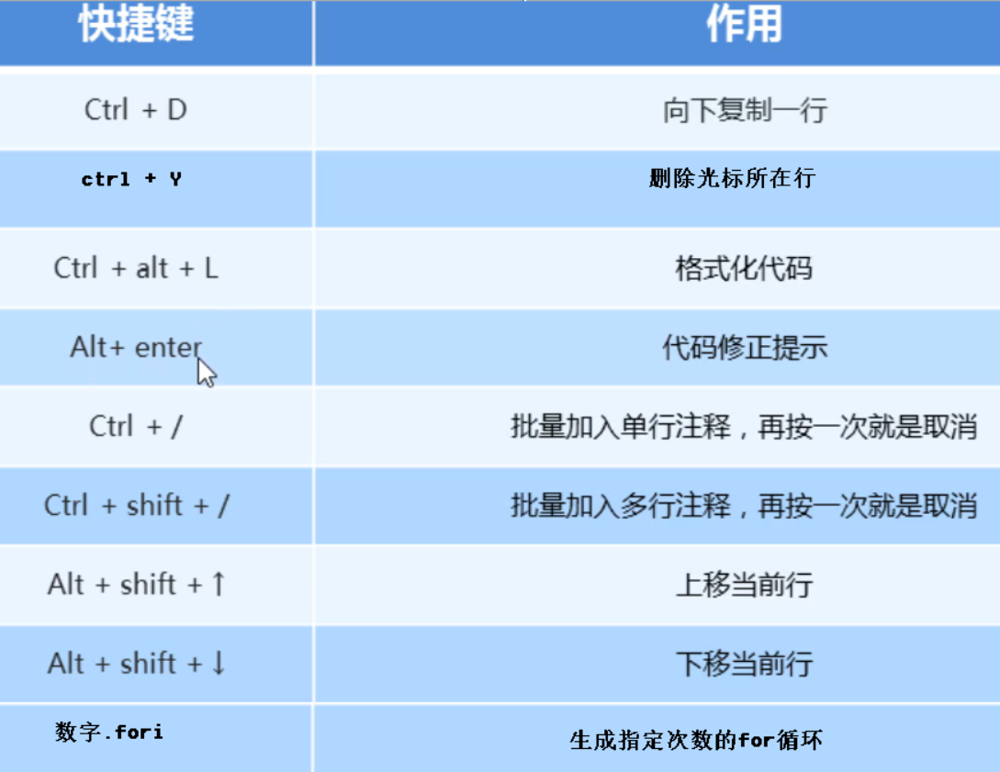
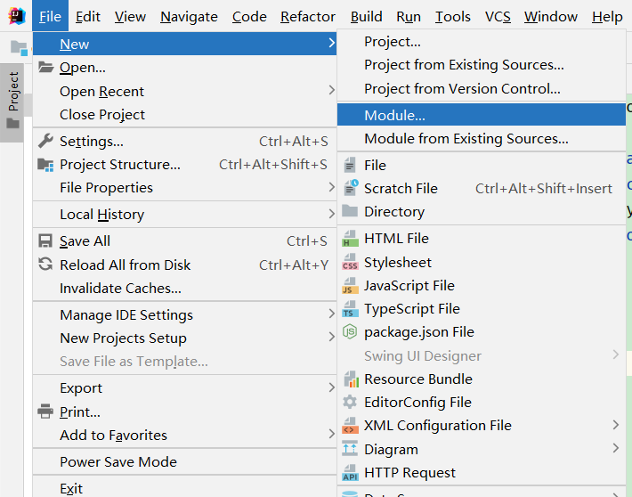
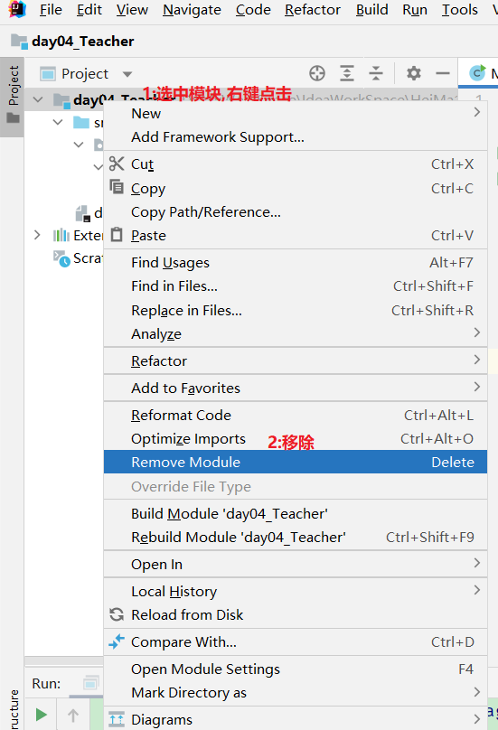
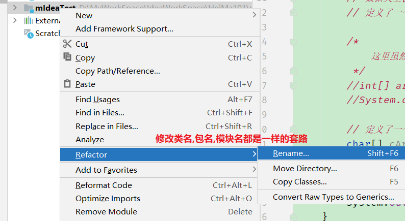
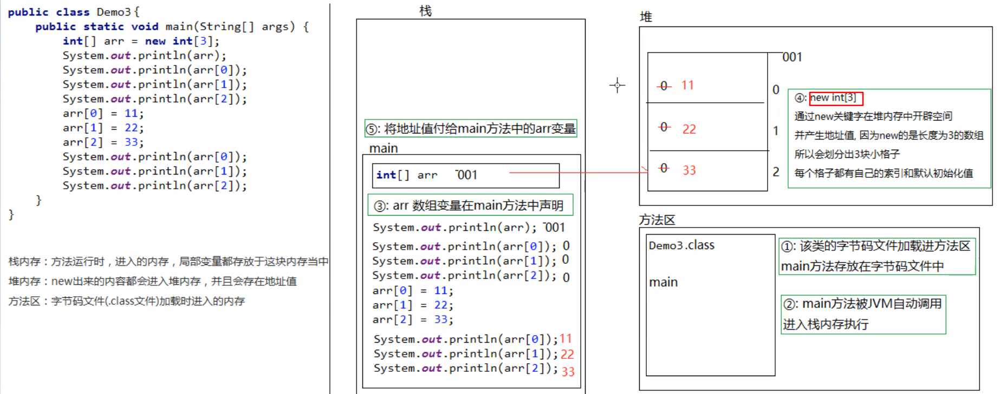
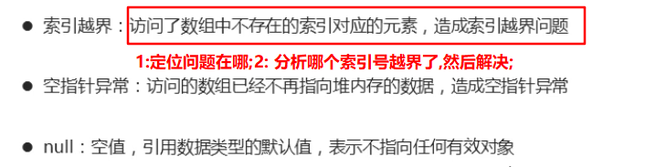

# idea

## 概述

```java
idea是java编写的一个专门用于java开发的强大的开发集成环境工具;
```

## 名词介绍

### 项目(project)

```java
是idea能够识别的最大的文件夹,在这个文件夹内部(包含文件夹本身)idea都可以帮我们管理;
项目文件夹的标识就是文件夹的内部有一个  .idea的子文件夹,  .idea文件夹是我们创建好项目的时候,idea自动创建的;
```

### 模块(module)

```java
模块是项目下的子文件夹,建议每一天创建一个模块,整个基础班创建一个项目;
idea会给每个模块自动创建一个后缀名是 .iml的文件,通过这个文件识别模块;
```

### 包(package)

```java
普通的管理代码的文件夹,必须放在src下即可;没有任何标识;
```

### 类(class)

```java
正常写的代码都在类中;
```

## 使用步骤

(参考idea操作文档,按住键盘上的ctrl加鼠标左键单击下面的ppt名字即可打开参考文档)

 [04_IDEA.ppt](04_IDEA.ppt) 

## 快捷键(建议常用)



调用完成方法后,写 .var回车可以自动生成变量;

shift+回车可以自动下一行;

## 模块操作

1. 创建多个模块;

   

2. 删除模块;

   1. 分两个步骤,第一步先从idea中删除;(硬盘上还会有)

      

      

   2. 手动从硬盘中删除;

3. 导入其他人写好的模块;

   1: 复制别人的模块到我们自己的项目中;(一定要先复制,防止对原始代码修改的面目全非而无法恢复!)
   2: 在idea中操作导入;

## 重命名问题




# 数组

## 概述

```java
可以把数组看成是一个比变量更大的容器,可以保存多个同种数据类型的数据;
```

## 使用场景


## 数组的数据类型

```java
就是前面曾经学过的数据类型加上一个中括号即可,例如:  int[]  ,double[]  ,String[]  ...
```

## 数组的初始化

### 什么是初始化?

```java
初始化就是我们手动的创建出一个可以真正保存多个数据的容器;(此时我们并没有往数组容器中存值和取值)
```

### java中数组初始化的方式

有两种方式

#### 动态初始化(熟练掌握)

```java
创建容器的时候,仅指定数组容器的长度,不指定内容,由系统自动分配默认的内容;
(整数默认0,小数默认0.0,字符默认码值为0的字符,布尔默认是false,所有引用数据类型都是默认null)
```

#### 动态初始化格式

```java
数据类型[] 数组名 = new 数据类型[数组的长度];
```

#### 名词解释(理解-重点1级)

1. 数组名  可以理解就是一个变量名,是我们自己创建数组容器的时候,起的名字,符合标识符规范即可;
2. 索引号/角标  是java规定的专门用于操作数组容器中的内容而设定的整数,范围一定是 [0,长度减1为止];
3. 地址值   就是创建数组容器的时候,java给这个容器分配的内存地址,我们程序员一般不需要操作;如果直接打印数组名,就可以看到这个地址值,但是一般不看这个地址值;(char类型的数组打印名字的时候,可以直接看到内容,而不是地址值)
4. 元素值   数组容器中保存的数据,这个是我们真正想操作的东西;

#### 存取值格式(重点1级)

```java
存:   数组名[索引号] = 数据值;
取:   数组名[索引号]    注意取出来之后,必须有后续的行为,例如:取值后打印: System.out.println(数组名[索引号]);
```


#### 静态初始化(记住格式即可)

```java
创建数组容器的时候,直接指定数组中的每个元素值,而不需要也不能指定数组的长度;由java自动计算出数组的长度;
```

#### 静态初始化的格式

```java
标准格式:  数据类型[] 数组名 = new 数据类型[]{元素1,元素2,...};

简写格式:  数据类型[] 数组名 = {元素1,元素2,...};
```

### 数组初始化的内存示意图(看懂即可)




### 注意事项

1. 数组容器一旦创建成功,长度不可改变;

2. 静态初始化的简写格式,只能在创建数组容器的时候使用,其他地方不能使用;

   ```java
   例如:  double[] arr = {1.1,2.2};  // 这是正确的
   double[] arr2 = {1.1,2.2}; 
   arr2 = {6.6,8.8};// 这一行语法错误,正确的写法是: arr2 = new double[]{6.6,8.8};
   ```

3. 索引一定时0至长度减1;

### 数组常见两个问题



### 数组遍历(重点-3)

```java
遍历就是对数组中的元素逐个操作,可以利用  数组名.length  获取数组的长度,可以利用   数组名.length -1 获取数组的最大索引;
```

### 快捷键

```java
快捷键:  
	数组名.fori  正向遍历   
    数组名.forr  逆向遍历
```

