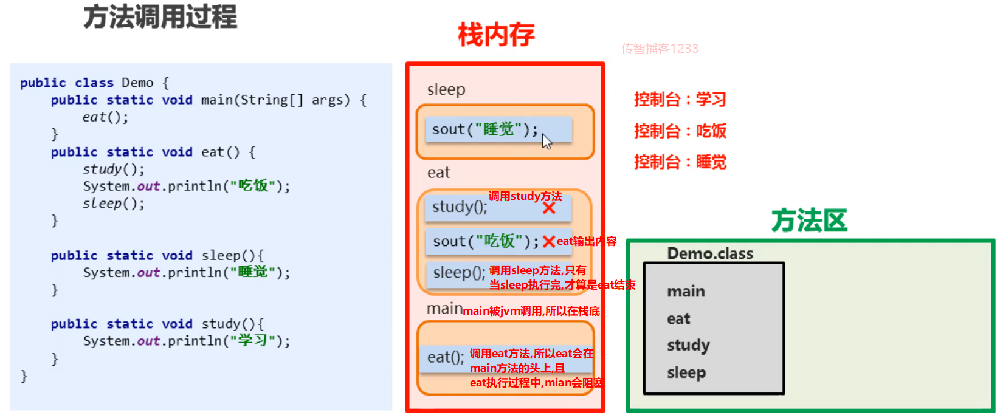
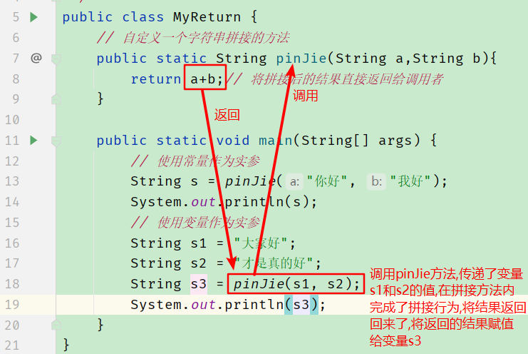

# 方法

## 概述

```java
方法就是具有独立功能的代码块,这个代码块不调用就不执行;
```

## 好处

提升代码的复用性;

## 注意事项

1. 方法必须先定义,且定义后,不会自己主动运行,只有调用才会执行;
2. 方法的定义不能嵌套,所有方法都是平级的关系,不分先后顺序;
3. return关键字有两个作用,1:返回数据值,2:结束方法;

## 语法入门

### 简单定义格式

```java
public static void 方法名(){
    方法要完成的功能写这里;
}
```

### 简单调用格式

```java
方法名();
```

### 方法调用过程分析



## 方法参数(重点)

### 概述

```java
方法参数就是定义方法的时候,在方法的小括号中声明的变量,该变量专门用于接收调用者传递过来的数据,以便于方法的定义者在方法内完成具体的功能;
```

### 带参数的方法定义格式

```java
public static void 方法名(定义不赋值的变量){
    在这里可以直接使用变量,因为将来调用方法的人,一定会给小括号中的变量赋值;(如果没有赋值,会调用失败)
}
```

### 调用带参数的方法调用格式

```java
方法名(真实的数据/可以是提前带值的变量名也可以是常量值);
```

### 参数传递示意图(重点理解)


### 方法参数与键盘输入的区别

方法设计参数的时候,调用者传递的实际数据的来源很宽泛,如果方法设计的时候,不带参数,而使用键盘输入替代,那么数据的来源就固定死了,不够灵活;

结论:

不要使用键盘输入替代方法参数设计;(带参数的方法比键盘输入更通用)

### 形参与实参的区别


## 方法的返回值(重点)

### 概述

```java
定义方法的时候,在方法内,对数据进行运算后,产出的结果,使用return关键字就可以返回结果;
方法的返回值是返回给了方法的调用者;
```

### 为什么要设计返回值

```java
调用者获取到方法的返回值之后,可以做任意操作;如果方法不设计返回值,只能在定义方法的时候,对产出的结果做固定的处理;
```

设计方法的原则:

越单一越好;因为方法的功能越单一就越容易复用;

### 定义带返回值的方法

```java
public static 具体的数据类型 方法名(参数列表){
    完成功能的代码;
    return 数据值;// 这里返回的数据值必须和上面声明的数据类型对号;
}
```

### 带返回值的方法调用格式

```java
最常用的带返回值的方法调用格式:
数据类型  变量名 = 方法名(实际参数);
```

### 代码示例:




## 方法调用的三种格式

1. 直接调用  当方法返回值类型是void的时候,**仅能**使用这个格式;  范例: 方法名(实际参数);
2. 赋值调用  当方法返回值是具体类型的时候,**推荐**使用这个格式;  范例: 数据类型  变量名 =  方法名(实际参数);因为把返回的结果保存之后,可以做任意处理,非常灵活;
3. 输出调用  **当且仅当**方法返回值有具体类型且调用者仅仅只是想看一下方法执行的结果的时候,**才可以**使用这个形式;范例:  System.out.println( 方法名(实际参数) ); 因为这样虽然成功的调用了方法,但是方法返回的结果一旦被打印后,就再也找不到这个结果了,如果想继续使用这个结果,就只能重新调用方法,极其浪费性能;

## 通用格式总结


## 方法设计的套路(重点)

问自己3个问题!!!

1. 设计方法的时候,先问自己,我写这个方法的目的是什么?(我希望这个方法能完成什么功能?)

   答案:直接根据题目提炼题目的关键词汇即可;

2. 我在完成这个功能的过程中,我需要啥?

   答案: 需要的东西就可以设计成方法的形参,如果不需要东西,就可以不设计形参;

3. 我做完这个功能之后,需要给别人啥?

   答案: 如果需要,就设计返回值,否则就不设计返回值(void);

   经验总结: 只要题目中有计算,运算,查找,查询,这些行为,我们都应该设计返回值;

   只要题目中有输出,打印,这些行为,一般都是直接在控制台打印即可,无需设计返回值;

## return与break的区别

1. return直接对方法生效,一旦执行到return,会将return后面的数据直接返回给方法的调用者,同时结束方法;如果return后面没有数据值,那么就仅仅起到了结束方法的效果;
2. break只能写在循环或switch语句中,仅仅是结束循环或结束switch,对方法没有影响;(循环或switch下面的代码会执行)

## 重载(听懂即可)

### 概述


### 好处

方便了方法的调用者;调用者可以通过同一个方法名,完成多种参数的方法调用;

## 参数传递(记结论)

### 基本数据类型参数传递


**结论:**

​	**基本数据类型参数传递的时候,传递的是具体的数据值,在自定义的方法内对变量进行修改,对调用者没有影响!**

### 引用数据类型


**结论:**

​	**引用数据类型参数传递的时候,传递的是地址值,在自定义的方法内,根据地址值找到堆内存的数据进行修改,修改后,调用者会受到影响;**

# 今日练习题

1. 练习数组求和;(配合键盘输入)
2. 练习数组求平均值,最值;
3. 练习数组查询指定元素的索引;
4. 评委打分;
5. 练习课上的带参数带返回值的方法练习;
6. 尝试将上面的前4个练习,改造成方法的形式;

