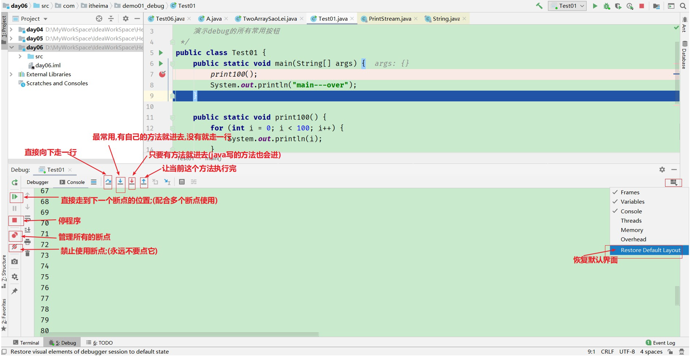
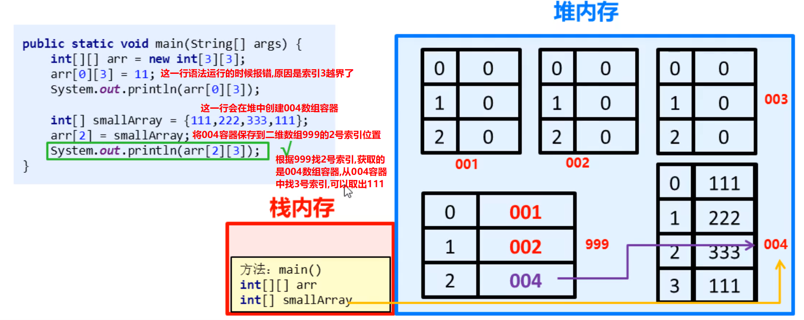
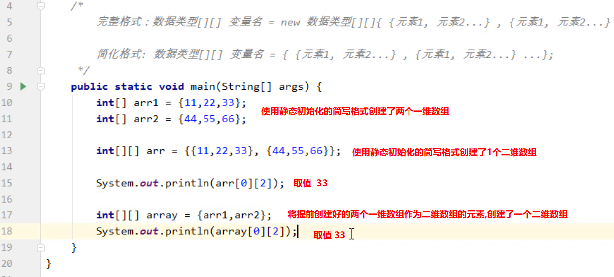
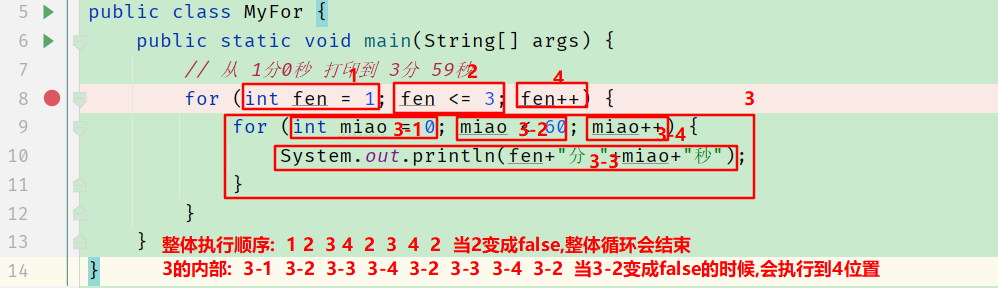

# debug(重点 - 1级)

## 概述

```java
debug是idea的另一种代码运行模式,在这个模式下,程序员可以让代码逐行执行,从而观察每一行代码执行的效果和流程,解决代码中的逻辑问题;
```

## 如何操作

1. 打断点;

   如果不清楚应该打在哪里,建议打在main方法中**有效代码**的第一行;(熟练后可以哪里不会点哪里)(鼠标左键单击行号即可出现小红点)

2. 以debug模式启动代码

   右键 --->  debug  run

3. 控制代码逐行执行;

   详情参考截图;(常用的是F7)



# 二维数组(了解)

## 概述

```java
存储着一维数组的数组就是二维数组;
```

## 动态初始化

```java
数据类型[][]  二维数组的名字 =  new 数据类型[二维数组的长度][一维数组的长度];
```

## 注意事项

```java
1. 二维数组的名字记录的是二维数组容器的地址值;
2. 二维数组容器也是存在堆内存中;
3. 二维数组的数据类型 使用 两个中括号即可,例如: double[][]  二维数组的名字 = 容器初始化;
4. 二维数组的名字配合索引号取出来的是一维数组的地址值,如果我们想操作元素,需要进一步通过获取的一维数组的地址值配合一维数组的索引号才可以操作真正的元素;
```

## 二维数组中修改指定索引位置的一维数组



## 静态初始化



# 循环嵌套(重点- 3级)

## 概述

```java
在一个循环中又写了循环,就是循环嵌套;
```

## 执行特点

```java
循环嵌套代码执行顺序:
        外层循环的变量变化一次.内层循环的变量需要执行一圈!
```

## 执行顺序分析示意图



# 进制(了解)

## 概述


## 进制书写格式


## 任意进制往十进制转换


## 从十进制转其他进制


## 8421码


### 作用

可以让二进制数据为主导,将二进制数据转成其他进制,也可以让其他进制通过8421码转回二进制;

### 转换规则

#### 二进制转十进制


#### 二进制转8进制


#### 二进制转16进制


#### 十进制转二进制

拿8421码中最接近的数字做减法,使用差一直与8421码表中的数据相减,直到为0,将所有减过的数对应1,没减的数对应0即可;

#### 8进制转二进制

把8进制中的每个数字拆分成3个二进制位即可;

#### 16进制转二进制

把16进制中的每个数字拆分成4个二进制位即可;

## 源反补三种状态码


# 今日练习

1. 双色球保证红色球不重复;
2. 自定义方法求数组的最大值和最小值;
3. 数组反转;
4. 循环嵌套;(打印3个小时内的时分秒)