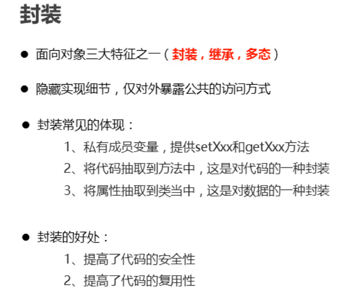

# 面向对象

## 面向对象

```java
就是通过对象完成我们想要的功能,这就是面向对象的思想;(强调的是"对象"拥有某个功能,我们可以通过对象完成功能)
```

## 面向过程

```java
就是我们自己逐步完成功能,强调的是完成功能的每一个步骤;
```

## 类对象的关系(能区分即可)

```java
类: 类是一类事物的"描述",是一个抽象的概念,强调的是一个群体,是一种"描述",相当于生活中的"图纸"或"模版";
对象: 对象就是生活中实实在在存在的事物,能够看得见摸得着的东西;

我们真正想要的是"对象",真正完成功能的也是对象,但是在java的语法中会限制我们,必须通过类才可以制造出对象;
类是对象的模版;
而对象是类的体现;
```

## 类的组成部分

有3部分组成:

1. 成员变量  在类中直接定义的变量就是成员变量;
2. 成员方法   在类中定义的不带static的方法就是成员方法;
3. 构造方法   在类中专门负责创建对象的方法就是构造方法;

## 类定义的语法格式

```java
public class 类名{
    成员变量;
    成员方法;
    构造方法;
}
```


## 创建对象的格式(记住)

```java
类名  对象名 = new 类名();
```

### 可以面向对象使用的内容

```
对象名.成员变量名;
对象名.成员方法名(实际参数);
如果方法有参数和返回值,也可以使用赋值调用的形式调用;
```

### 今日面向对象代码固定套路(熟练)

1. 先写图纸类/模型类
   1. 成员变量
   2. 成员方法
   3. 构造方法
2. 编写测试类
   1. 写main方法
   2. 在main方法中一定是先根据模型类创建出一个具体的对象
   3. 面向对象,指挥对象干活;

### 手机练习


### 内存介绍(了解)

结论:

1. 成员变量随着对象的创建而存在于对内存中;
2. 成员方法随着类的加载而存在于方法区中;
3. 多个对象共享同一份成员方法,但是没有对象都有自己的成员变量;

## 成员变量和局部变量的区别(能区分开即可)


## private关键字(会使用)


## this(知道作用即可)

### 概述

```java
是java提供的一个关键字,表示哪个对象正在调用方法,this表示的就是那个对象
```

### 作用

主要作用是用于区分局部变量和成员变量重名;

## 封装(听懂即可)




## 构造方法(重点)


### 代码格式

```java
public 类名(形式参数){
    对成员变量赋值,或写一些希望在创建对象的过程中想做的事情;
}
```

### 作用


### 注意事项


## javaBean

```java

```

### 快捷键

```java

```
