# API

## api

```java
应用程序编程接口,是理论概念,简单理解就是别人事先写好的一些功能代码;
```

## api文档

```java
对api代码和功能进行解释说明的一个参考手册;
```

# Scanner使用

## 使用细节

```java
键盘输入字符串数据的时候,可以使用next方法也可以使用nextLine方法,但是整数或小数和字符串一起配合输入的时候,只能使用next方法;
```

**建议**

所有键盘输入字符串的时候,直接使用next即可;

# String

## 概述

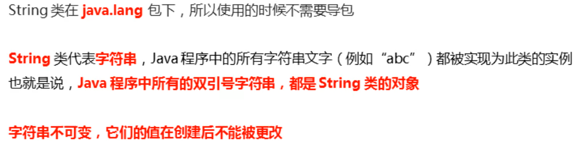

## String类的构造方法介绍

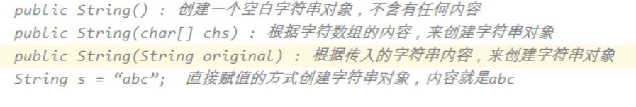

## 创建字符串对象的两种途径

1. 使用双引号创建字符串对象;
2. 使用构造方法创建字符串对象;

## 两种创建途径的区别

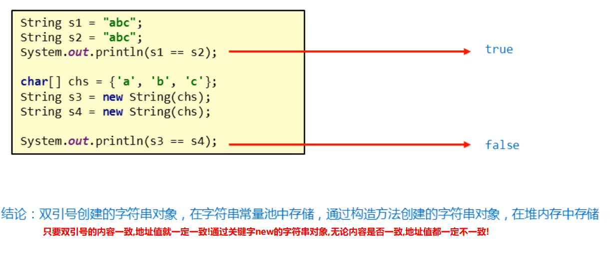

## 面试题总结

字符串常量拼接的时候,会在编译时期完成拼接;(因为字符串常量优化机制)

用字符串的new String("字符串")这种构造方法创建字符串对象.比较浪费内存,会导致创建两个字符串对象;

## 字符串比较内容的方法(重要)

1. equals(被比较的字符串对象)  使用调用该方法的字符串对象与被比较的字符串对象比较内容,一致就返回true,否则返回false;
2. equalsIgnoreCase(被比较的字符串对象)  使用调用该方法的字符串对象与被比较的字符串对象忽略大小写字母比较内容,一致就返回true,否则返回false;

## 字符中其他成员方法(重要)

### 遍历字符串相关方法

```java
 charAr(索引)  根据索引获取对应位置的字符
 length()      获取字符串的长度;
 toCharArray()  将字符串转成字符数组;
```

### 对字符串进行截取的方法

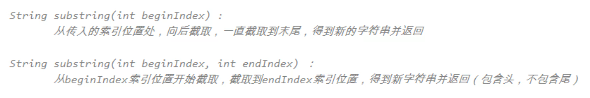

### 对字符串的敏感词替换

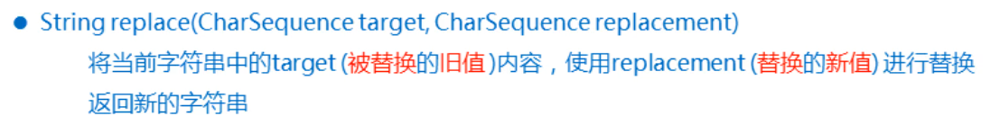

### 对字符串的切分

split("规则")  切分后可以得到一个字符串数组;

1. 如果被切分的字符串的头符合规则,那么切分后,前面会保留一个长度为0的空字符串;
2. 如果被切分的字符串的尾符合规则,那么切分后,后面不会保留长度为0的空字符串(自动舍弃);
3. 如果想以 "." 为规则进行切分,那么必须写成  "  \\\\.  "的形式才可以;

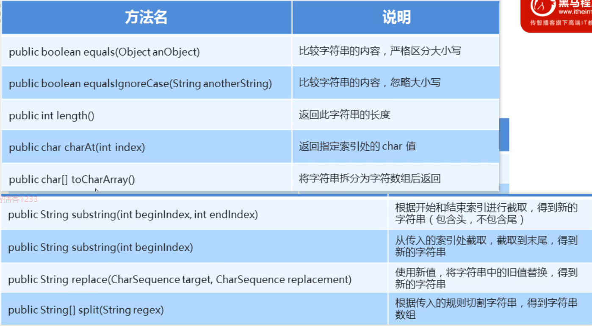

### 注意事项

**字符串中所有的方法都不会改变参与运算的老字符,运算后产生的新字符串必须使用变量接收后才能看到效果;**

# StringBuilder

## 概述

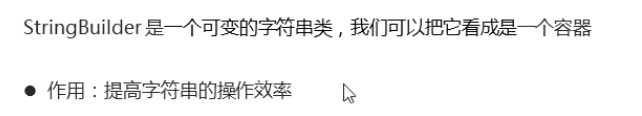

## 构造方法

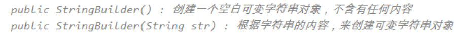

## 常用方法(重点)

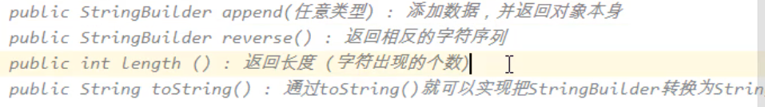

### 链式编程

#### 前提

被调用的方法必须返回的是对象类型的结果;

如果返回的是对象本身,那么链式编程的链子永远不会断;

如果返回的不是对象本身,哪怕是一个新的对象,也可以使用链式编程,只不过链子容易断;

#### 含义

```java
使用方法返回的对象继续调用方法;
```

## String与StringBuilder的区别

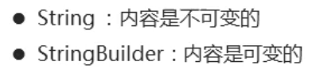

## String与StringBuilder的相互转换

### 什么时候转?

什么时候需要将StringBuilder对象转成String对象?

```java
答:当需要比较两个字符串的内容的时候,需要将StringBuilder对象转成String对象,因为StringBuilder类中虽然也有equals方法,但是它的equals方法不能比较字符串的内容,只能比较地址值;只有String类的equals方法才能比较字符串的内容;
```

什么时候需要将String对象转成StringBuilder对象?

```java
答: 当需要进行字符串拼接或字符串内容反转的时候,需要将String对象转成StringBuilder对象,因为String对象拼接效率低,它还不具备反转的能力,而StringBuilder拼接效率高,且可以对字符串的内容进行反转;
```

### 怎么转?

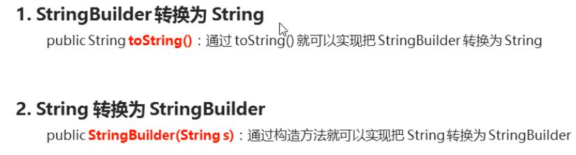
