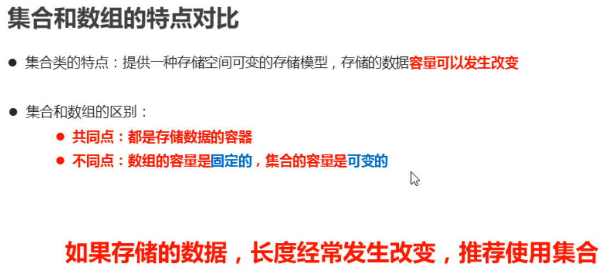
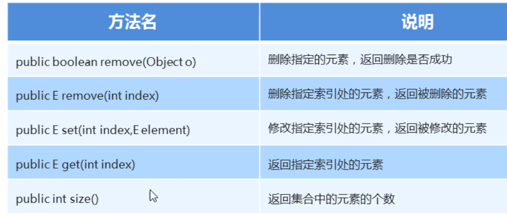
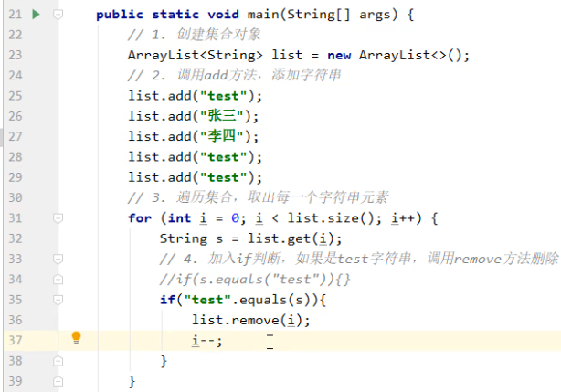
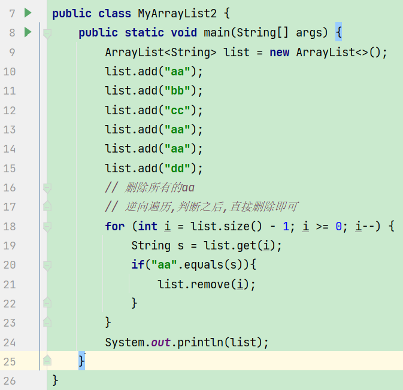
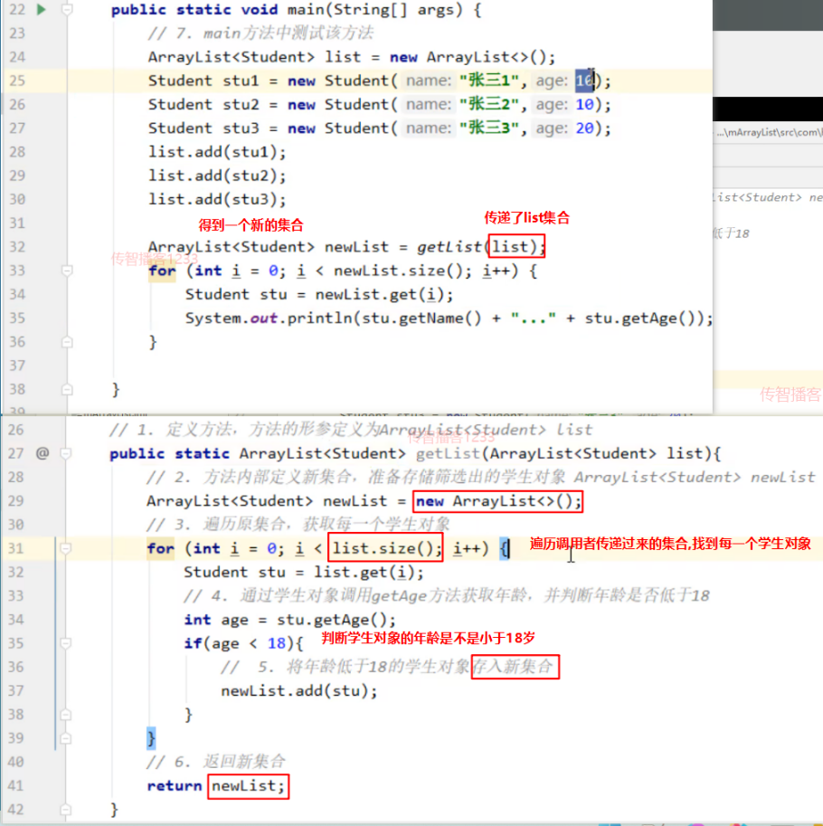
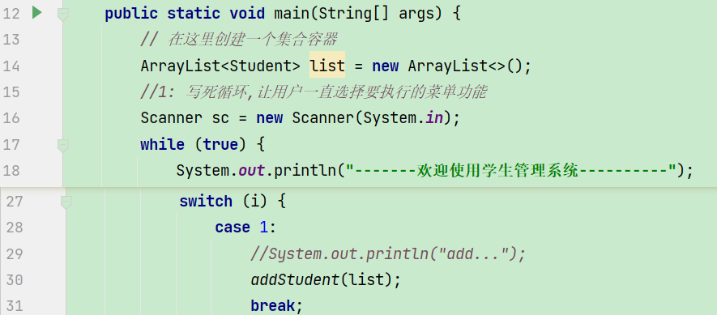
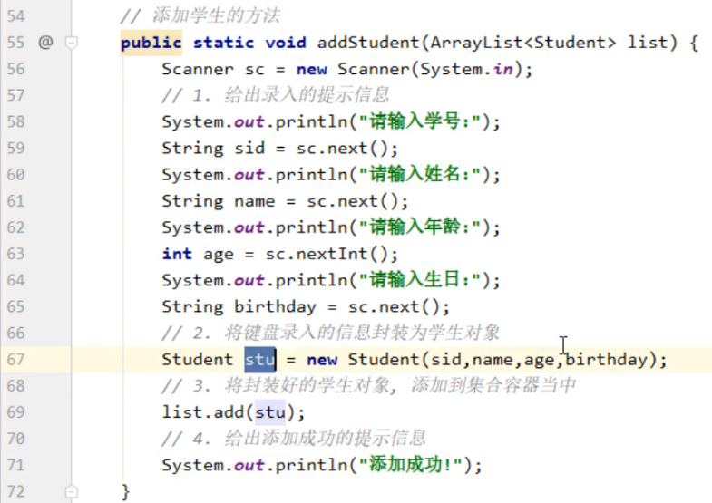

# 数组与集合的区别



# ArrayList

## 概述

```java
集合是java提前写好的一个类(ArrayList),可以简单理解为是数组的升级品,可以存多个同种数据类型的引用数据类型数据,且长度是可以随着添加的元素的数量而自动变化的!
```

## 注意事项

1. 创建集合对象的时候,需要在尖括号中指定元素的数据类型;
2. 尖括号中只能写引用数据类型不能写基本数据类型;
3. 集合的长度是可以自动变化的!

## 构造方法

空参数的构造方法;

## 常用方法(重要)

添加数据   add(索引,元素);



## 遍历(重点)

**正向遍历通用格式**

```java
for(int i=0;i<集合名.size();i++){
    集合名.get(i);// 这种方式即可获取集合中的每一个元素了,获取元素后,可以保存,也可以输出,也可以继续面向每一个元素对象进一步做其他操作...
}
```


**正向遍历快捷键**

```java
集合名.fori
```

**逆向遍历的快捷键**

```java
集合名.forr
```

## 删除集合中重复的元素





## 集合类型作为方法的参数和返回值



# 学生管理系统综合案例

## 主菜单实现

```java
public static void main(String[] args) {
        //1: 写死循环,让用户一直选择要执行的菜单功能
        Scanner sc = new Scanner(System.in);
        while (true){
            System.out.println("-------欢迎使用学生管理系统----------");
            System.out.println("1 添加学生");
            System.out.println("2 删除学生");
            System.out.println("3 修改学生");
            System.out.println("4 查看学生");
            System.out.println("5 退出");
            System.out.println("请输入您的选择:");
            int i = sc.nextInt();
            // 根据用户的选择,执行不同的功能
            switch (i){
                case 1:
                    System.out.println("add...");
                    break;
                case 2:
                    System.out.println("remove...");
                    break;
                case 3:
                    System.out.println("set...");
                    break;
                case 4:
                    System.out.println("get...");
                    break;
                case 5:
                    System.out.println("谢谢使用!");
                    return;
            }
        }
    }
```

## 添加学生的功能实现





## 查看学生功能实现


## 根据学生学号查询学生对象在集合中的索引(重点)

```java
// 这个方法的核心任务就是帮调用者查询sid在集合中对应的学生对象的索引
    public static int getIndex(ArrayList<Student> list, String sid){
        // 1. 假设传入的学号, 在集合中不存在
        // 2. 遍历集合, 获取每一个学生对象, 准备进行查找
        for (int i = 0; i < list.size(); i++) {
            Student stu = list.get(i);
            // 3. 获取每一个学生对象的学号
            String id = stu.getId();
            // 4. 使用获取出的学生学号, 和传入的学号(查找的学号)进行比对
            if(id.equals(sid)){
                // 存在: 直接返回这个索引即可!
                return i;
            }
        }
        // 如果代码执行到了这里,说明集合中有没有sid这个学生的学生对象?  答: 没有,则返回-1
        return -1;
    }
```

## 删除学生

```java
// 删除学生的功能
    private static void delStudent(ArrayList<Student> list) {
        // 1:让用户输入要删除的学生学号
        Scanner sc = new Scanner(System.in);
        System.out.println("请输入学号");
        String id = sc.next();
        //2: 根据id从集合中找这个学生对应的索引
        int index = getIndex(list, id);
        //3: 判断index的值是不是-1
        if(index == -1){
            System.out.println("亲,id为:"+id+"的学生不存在!");
        }else {
            list.remove(index);
            System.out.println("亲,id为:"+id+"的学生已成功删除!");
        }
    }
```


## 修改学生

```java
// 修改学生的方法
    public static void updateStudent(ArrayList<Student> list) {
        System.out.println("请输入您要修改的学生学号:");
        Scanner sc = new Scanner(System.in);
        String updateSid = sc.next();
        // 3. 调用getIndex方法, 查找该学号在集合中出现的索引位置
        int index = getIndex(list,updateSid);
        // 4. 根据索引判断, 学号在集合中是否存在
        if(index == -1){
            // 不存在: 给出提示
            System.out.println("查无信息, 请重新输入");
        }else{
            // 存在: 接收新的学生信息
            System.out.println("请输入新的学生姓名:");
            String name = sc.next();
            System.out.println("请输入新的学生年龄:");
            int age = sc.nextInt();
            System.out.println("请输入新的学生生日:");
            String birthday = sc.next();
            // 封装为新的学生对象
            Student stu = new Student(updateSid, name, age, birthday);
            // 调用集合的set方法, 完成修改
            list.set(index, stu);
            System.out.println("修改成功!");
        }
    }
```


## 添加学生学号重复

```java
// 添加学生的方法
    public static void addStudent(ArrayList<Student> list) {
        //键盘输入学生信息
        Scanner sc = new Scanner(System.in);
        String id;// 定义变量,定义后,没有赋值
        while (true){
            System.out.println("请输入学号:");
             id = sc.next();// 给已经定义过的变量赋值
            // 马上对学号进行校验,如果合法,则继续输入其他信息,如果不合法,则让用户一直输入学号
            int index = getIndex(list, id);
            // 如果index是-1,说明这个学生不存在,当前这个学生可以使用这个学号
            if(index == -1){
                break;
            }else {
                System.out.println(id+"学号已经被占用,请更换!");
            }
        }
        System.out.println("请输入姓名:");
        String name = sc.next();
        System.out.println("请输入年龄:");
        int age = sc.nextInt();
        System.out.println("请输入生日:");
        String bir = sc.next();
        //创建学生对象
        Student s = new Student(id,name,age,bir);
        //添加到集合
        list.add(s);
        System.out.println("添加成功");
    }
```


