# 面向对象高级(1)

**今日目标：**

- 能够知道继承的好处和弊端
- 能够知道继承中成员的访问特点
- 能够知道方法重写及应用
- 能够完成继承案例
- 能够知道权限修饰符访问特点
- 能够知道final关键字修饰内容的特点
- 能够知道static关键字修饰内容的特点

## 1：继承

### 1.1 面向对象高级课程安排

来，继续啊，下面我们继续来学习Java中非常重要的一个知识：面向对象高级部分。

而在讲解面向对象高级内容之前呢，我们先来回顾一下，前面学习过的面向对象基础知识。

在面向对象基础部分，我们学习了：

- 类的定义
- 对象的使用
- private关键字
- this关键字
- 封装
- 构造方法
- JavaBean

当时的要求是能够编写一个标准的JavaBean，也就是成员变量用private修饰，给出对应的get/set方法，以及给出一个无参构造方法。

为了让大家能够快速的编写出这些代码，我们还讲解了如何快速生成构造方法和get/set方法。

学完面向对象的基础知识后，我们就可以自己设计一个类并进行使用了，基于这个基础上，我们接着学习了API相关的知识。

主要学习了：

- Scanner
- Random
- GUI体系的类(JLabel,JButton,JTextField,JTextArea等)
- String
- 基本类型包装类
- Date
- SimpleDateFormat

而在使用GUI体系相关的类的使用，通过查看帮助文档，我们看到了一些当时无法很好理解的知识：

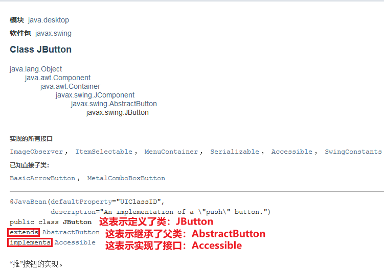

这里涉及到了父类和接口的知识，以及继承关系和实现关系。

再来看按钮的父类：AbstractButton

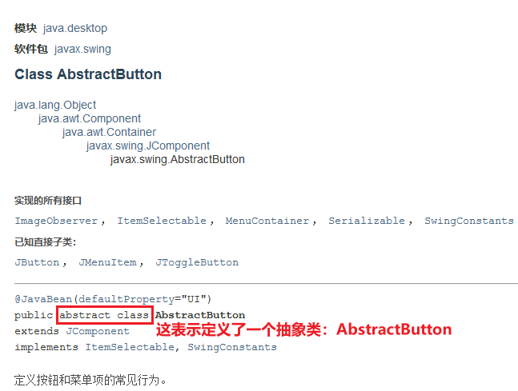

它其实是一个抽象类，这是就涉及到了抽象类的知识。

并且，我们还讲解了对按钮添加事件的代码：

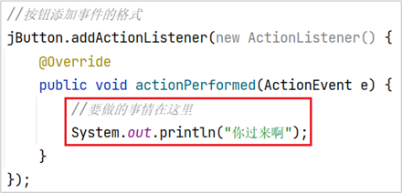

当时是让大家记住这个代码的格式，在方法体中写内容就可以了。为什么当时没有详细讲解呢，因为这个代码中涉及到了多态和匿名内部类相关的知识。

而我们刚才所提到的这些知识，等我们学完了面向对象高级部分的知识后，大家就可以理解了。

最后，我们来说一下面向对象高级这一块的课程安排：


首先，我们会讲解继承，然后讲解几种常见的修饰符，包括权限修饰符，最终态修饰符，静态修饰符。

接着，我们会讲解多态，抽象类，接口等高级知识，讲解完这些内容后，大家就完全可以把刚才回顾过程中哪些不理解的知识搞明白了。

并且还能够看懂帮助文档中任何一个API了。

最后，我们还会讲解一个小知识：内部类，在很多时候，它能够简化我们代码的编写。

好了，到此关于面向对象高级这一块的课程安排我们就先讲到这里

### 1.2 继承概述

来，继续啊，下面我们来学习继承。

在学习什么是继承前呢，我们先看一个类，学生类，这个类大家并不陌生，包含两个属性和对应的get,set方法，另外还有一个学习的方法study。

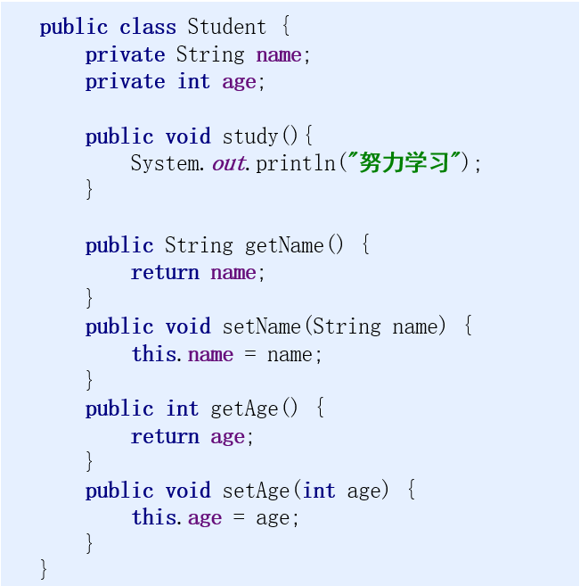

再来看一个类类，Teacher，成员变量是一样的，也给出了对应的get/set方法，只不过学习的方法没有了，改成了教学的方法teach。


看完这两个类之后，我们来看一下它们相同的内容：

首先来说这两个成员变量，而成员变量也可以称为属性，所以我们说这两个类有相同的属性。

接着，我们再来说成员变量对应的get/set方法，它们也是相同的，所以我们这两个类有相同的方法。

而这些相同的内容，我们统称为相同的特征。

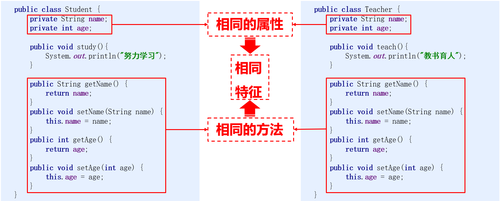

如果我们把相同的特征给提取出来，这两个原始的类就会变成这个样子，来看一下，我们把代码稍微整理一下，就会变成这个样子。

最后呢，我们把相同的特征也用一个类给表示出来，只不过这里我们没有给出类名而已，而在这个不知道名字的类中有两个成员变量和成员变量对应的get/set方法。

我们再来看学生类和老师类，它们和原始的学生类和老师类表示的意思肯定是不相同的。

而在原始学生类和老师类中的成员变量和对应的get/set方法在这个不知道名字的类中是存在的，那么，有没有一种机制，能够让学生类和老师类能够拥有这个不知道名字的类中的内容呢？

答案肯定是有这种机制的。这种机制就是让他们之间产生一个关系，有了这个关系后，学生类和老师类中就可以拥有这个不知道名字的类中的内容了。

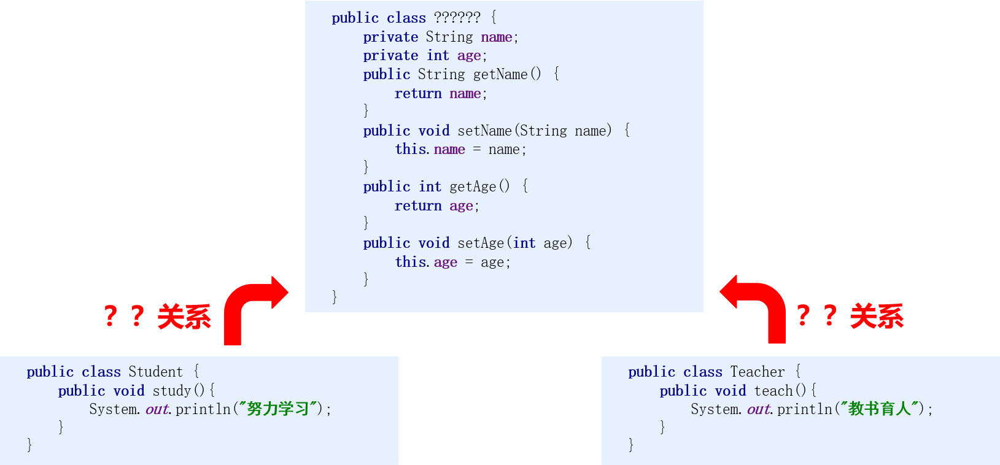

而这个关系就是我们要讲解的继承。来，我们一起说一下：

- 继承是面向对象三大特征之一。(封装，**继承**，多态)
- **可以使得子类具有父类的属性和方法，还可以在子类中重新定义，追加属性和方法。**

知道了，什么是继承后，我们来说一下，继承的格式：

**继承的格式：**

- 格式：public class 子类名 **extends** 父类名 { }
- 范例：public class Zi **extends** Fu { }
- Fu：是父类，也被称为基类、超类
- Zi：是子类，也被称为派生类

知道了继承格式后，我们到IDEA中去体验一下：

```java
public class Fu {
    public void show() {
        System.out.println("show方法被调用");
    }
}
```

```java
public class Zi extends Fu {
    public void method() {
        System.out.println("method方法被调用");
    }
}
```

```java
/*
    测试类
 */
public class Demo {
    public static void main(String[] args) {
        //创建对象，调用方法
        Fu f = new Fu();
        f.show();

        Zi z = new Zi();
        z.method();
        z.show();
    }
}
```

代码演示完毕后，回到资料再总结一下：

**继承中子类的特点：**

- 子类可以有父类的内容
- 子类还可以有自己特有的内容

好了，关于继承相关的基础知识我们就先讲到这里。

讲解完毕后，大家赶快动手练习一下吧。

### 1.3 继承的好处和弊端

来，继续啊，下面我们来学习继承的好处和弊端。

首先，我们来说一下**继承的好处：**

- 提高了代码的<font color='red'>**复用性**</font>(多个类相同的成员可以放到同一个类中)
- 提高了代码的<font color='red'>**维护性**</font>(如果方法的代码需要修改，修改一处即可)

继承的第一个好处是提高了代码的复用性。怎么来理解呢，我们来说一下：

多个类相同的成员可以放到同一个类中，这一个类我们就可以设计为父类，这多个类我们就可以设计为子类。相同的内容放到了父类中，我们就可以简化这多个子类的代码，而相同的代码就可以

被多个子类使用，将来再来一个子类的时候，它也可以通过继承拥有父类的内容。所以，我们说继承提高了代码的复用性。

继承的第二个好处是提高了代码的维护性。我们也来说一下：

如果我们有多个类，它们有相同的方法，在使用继承之前，如果这个相同的方法需要进行修改，那么我们就需要修改多个类中的代码。而在使用继承后，由于我们把相同的代码提取到了父类中，

所以，在需要修改的时候，我们只需要修改一处即可。所以，我们说继承提高了代码的维护性。

这两个就是我们要讲解的继承的好处：提高了代码的复用性，提高了代码的维护性。

讲解完继承的好处后，我们来说一下**继承的弊端：**

- 继承让类与类之间产生了关系，类的耦合性增强了，当父类发生变化时子类实现也不得不跟着变化，削弱了子类的独立性

所以，我们说，在程序设计中，我们要好好的考虑该不该使用继承。

那么，我们什么时候该使用继承呢？这里给大家讲解一个最简单的原则。

来，我们来说一下**什么时候使用继承：**

- 继承体现的关系：<font color='red'>**is a**</font>
- 假设法：我有两个类A和B，如果他们满足A是B的一种，或者B是A的一种，就说明他们存在继承关系，这个时候就可以考虑使用继承来体现，否则就不能滥用继承
- 举例：苹果和水果，猫和动物，<font color='red'>**猫和狗**</font>

要讲解这个内容，我们先要告诉大家的是：继承体现的是is a的关系，也就是什么是什么的一种，我们采用假设法就可以用来判断两个类是否存在继承关系。

来，我们举例说明一下：苹果和水果，由于苹果是水果的一种，所以，我们可以把水果设计为父类，苹果设计为子类。

我们再来说，猫和动物，由于猫是动物的一种，所以，我们可以把动物设计为父类，猫设计为子类。

最后，我们再来说猫和狗，猫是狗的一种，或者狗是猫的一种，这都说不通，所以，它们之间不存在继承关系，就不应该采用继承关系来设计猫类和狗类。

好了，关于继承的好处和弊端，以及什么时候使用继承我们就先讲到这里。

### 1.4 继承中成员访问特点

#### 1.4.1 成员变量访问特点

来，继续啊，下面我们来学习继承中成员变量的访问特点。

而关于这个特点呢，我们先到IDEA中去演示，然后再回来总结。

```java
public class Fu {
    //年龄
    public int age = 40;
}
```

```java
public class Zi extends Fu {
    //身高
    public int height = 175;

    //年龄
    public int age = 20;

    public void show() {
        int age = 30;
        System.out.println(age);
        System.out.println(height);
        //报错
//        System.out.println(weight);
    }
}
```

```java
/*
    测试类
 */
public class Demo {
    public static void main(String[] args) {
        //创建对象，调用方法
        Zi z = new Zi();
        z.show();
    }
}
```

这里为了访问方便，年龄我们用public进行了修饰。

演示完毕后，回到资料我们来总结一下：

**在子类方法中访问一个变量：**

- 子类局部范围找
- 子类成员范围找
- 父类成员范围找
- 如果都没有就报错(不考虑父亲的父亲…)

好了，关于继承中成员变量的访问特点我们就先讲到这里

#### 1.4.2 super关键字

来，继续啊，下面我们来学习super关键字。

而关于super关键字的学习，我们先到IDEA中去演示，然后再回来总结。

```java
public class Fu {
    public int age = 40;
}
```

```java
public class Zi extends Fu {
    public int age = 20;

    public void show() {
        int age = 30;
        System.out.println(age);
        //我要访问本类的成员变量age，怎么办呢？
        System.out.println(this.age);
        //我要访问父类的成员变量age，怎么办呢？
        System.out.println(super.age);
    }
}
```

```java
/*
    测试类
 */
public class Demo {
    public static void main(String[] args) {
        //创建对象，调用方法
        Zi z = new Zi();
        z.show();
    }
}
```

演示完毕后，回到资料我们来总结一下：

**super** 关键字的用法和 **this** 关键字的用法相似

- **this：**代表调用该方法的对象(一般我们是在当前类中使用this，所以我们常说this代表本类对象的引用)
- **super**：代表父类存储空间的标识(可以理解为父类对象引用)

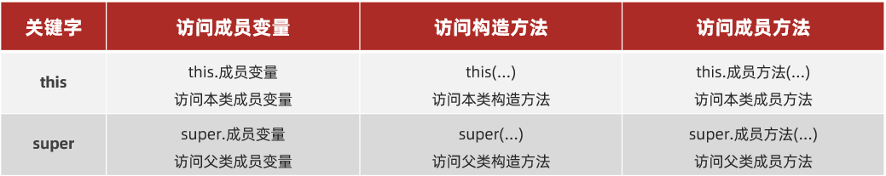

这里的访问成员变量我们刚才已经演示过了，至于访问构造方法和访问成员方法，我们先了解格式，接下来我们就会使用到。

好了，关于super关键字我们就先讲到这里

讲解完毕后，大家赶快动手练习一下吧。

#### 1.4.3 构造方法访问特点

来，继续啊，下面我们来学习继承中构造方法的访问特点。

而关于这个特点呢，我们先到IDEA中去演示，然后再回来总结。

```java
public class Fu {
    
    public Fu() {
        System.out.println("Fu中无参构造方法被调用");
    }

    public Fu(int age) {
        System.out.println("Fu中带参构造方法被调用");
    }

}
```

```java
public class Zi extends Fu {

    public Zi() {
        System.out.println("Zi中无参构造方法被调用");
    }

    public Zi(int age) {
        System.out.println("Zi中带参构造方法被调用");
    }

}
```

```java
/*
    测试类
*/
public class Demo {
    public static void main(String[] args) {
        //创建对象
        Zi z = new Zi();

        Zi z2 = new Zi(20);
    }
}
```

演示完毕后，回到资料我们来总结一下：

- 子类中所有的构造方法默认都会访问父类中无参的构造方法
- 为什么呢？
- 因为子类会继承父类中的数据，可能还会使用父类的数据。所以，子类初始化之前，一定要先完成父类数据的初始化
- 每一个子类构造方法的第一条语句默认都是：**super()**

这个时候，回到代码中我们把super给加上，继续讲解如果父类没有无参构造方法，该怎么办呢？

```java
public class Fu {

    /*
    public Fu() {
        System.out.println("Fu中无参构造方法被调用");
    }
    */

    public Fu() {}

    public Fu(int age) {
        System.out.println("Fu中带参构造方法被调用");
    }

}
```

```java
public class Zi extends Fu {

    public Zi() {
//        super();
//        super(20);
        System.out.println("Zi中无参构造方法被调用");
    }

    public Zi(int age) {
//        super();
//        super(20);
        System.out.println("Zi中带参构造方法被调用");
    }

}
```

```java
/*
    测试类
*/
public class Demo {
    public static void main(String[] args) {
        //创建对象
        Zi z = new Zi();

        Zi z2 = new Zi(20);
    }
}
```

演示完毕后，回到资料我们来总结一下：

如果父类中没有无参构造方法，只有带参构造方法，该怎么办呢？

① 通过使用super关键字去显示的调用父类的带参构造方法

② 在父类中自己提供一个无参构造方法

**推荐：自己给出无参构造方法**

好了，关于继承中构造方法的访问特点我们就先讲到这里。

讲解完毕后，大家赶快动手练习一下吧。

#### 1.4.4 成员方法访问特点

来，继续啊，下面我们来学习继承中成员方法的访问特点。

而关于这个特点呢，我们先到IDEA中去演示，然后再回来总结。

```java
public class Fu {

    public void show() {
        System.out.println("Fu中show()方法被调用");
    }

}
```

```java
public class Zi extends Fu {

    public void method() {
        System.out.println("Zi中method()方法被调用");
    }

    public void show() {
        super.show();
        System.out.println("Zi中show()方法被调用");
    }
}
```

```java
/*
    测试类
 */
public class Demo {
    public static void main(String[] args) {
        //创建对象，调用方法
        Zi z = new Zi();
        z.method();
        z.show();
        //报错
//        z.test();
    }
}
```

演示完毕后，回到资料我们来总结一下：

**通过子类对象访问一个方法：**

- 子类成员范围找
- 父类成员范围找
- 如果都没有就报错(不考虑父亲的父亲…)

好了，关于继承中成员方法的访问特点我们就先讲到这里。

讲解完毕后，大家赶快动手练习一下吧。

### 1.5 方法重写

来，继续啊，下面我们来学习方法重写。

那**什么是方法重写呢**？我们一起来说一下：

- 子类中出现了和父类中一模一样的方法声明

知道了什么是方法重写后，那方法重写有什么用呢？这里我们来说一下**方法重写的应用场景：**

- 当子类需要父类的功能，而功能主体子类有自己特有内容时，可以重写父类中的方法，这样，即沿袭了父类的功能，又定义了子类特有的内容
- 练习：手机类和新手机类

下面呢，我们通过一个练习，来讲解一下方法重写的应用，这个练习是：手机类和新手机类。

来，我们一起来写代码啊。

```java
/*
    手机类
 */
public class Phone {
    public void call(String name) {
        System.out.println("给" + name + "打电话");
    }
}
```

```java
/*
    新手机
 */
public class NewPhone extends Phone {

    /*
    public void call(String name) {
        System.out.println("开启视频功能");
//        System.out.println("给" + name + "打电话");
        super.call(name);
    }
    */

    @Override
    public void call(String name) {
        System.out.println("开启视频功能");
//        System.out.println("给" + name + "打电话");
        super.call(name);
    }

}
```

```java
/*
    测试类
 */
public class PhoneDemo {
    public static void main(String[] args) {
        //创建对象，调用方法
        Phone p = new Phone();
        p.call("林青霞");
        System.out.println("--------");

        NewPhone np = new NewPhone();
        np.call("林青霞");
    }
}
```

演示完毕后，回到资料，我们再来说一下，刚才讲解了一个小知识：

**@Override：**

- 是一个注解(注解后面会学习到)
- 可以帮助我们检查重写方法的方法声明的正确性

好了，关于方法重写我们就先讲到这里。

讲解完毕后，大家赶快动手练习一下吧。

### 1.6 Java中继承的注意事项

来，继续啊，下面我们来学习Java中继承的注意事项。

而关于这个注意事项呢，我们先到IDEA中去演示，然后再回来总结。

```java
public class Granddad {

    public void drink() {
        System.out.println("爷爷爱喝酒");
    }

}
```

```java
public class Father extends Granddad {

    public void smoke() {
        System.out.println("爸爸爱抽烟");
    }

}
```

```java
public class Mother {

    public void dance() {
        System.out.println("妈妈爱跳舞");
    }

}
```

```java
/*
public class Son extends Father, Mother {

}
*/

public class Son extends Father {

}
```

演示完毕后，回到资料我们来总结一下：

- Java中类只支持单继承，不支持多继承
- Java中类支持多层继承

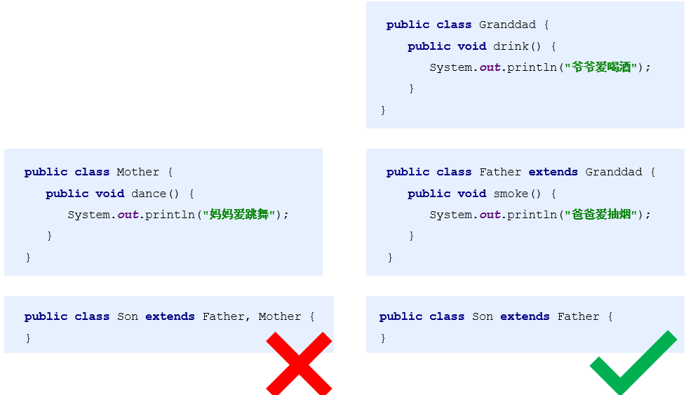

好了，关于Java中继承的注意事项我们就先讲到这里。

### 1.7 继承案例

#### 1.7.1 老师和学生

需求：定义老师类和学生类，然后写代码测试；最后找到老师类和学生类当中的共性内容，抽取出一个父类，用继承的方式改写代码，并进行测试

看完需求后，我们先简单的说一下思路：

**思路：**

①定义老师类(姓名，年龄，教书())

②定义学生类(姓名，年龄，学习())

③定义测试类，写代码测试

```java
/*
    老师类
 */
public class Teacher {
    private String name;
    private int age;

    public Teacher() {
    }

    public Teacher(String name, int age) {
        this.name = name;
        this.age = age;
    }

    public String getName() {
        return name;
    }

    public void setName(String name) {
        this.name = name;
    }

    public int getAge() {
        return age;
    }

    public void setAge(int age) {
        this.age = age;
    }

    public void teach() {
        System.out.println("用爱成就每一位学员");
    }
}
```

```java
/*
    学生类
 */
public class Student {
    private String name;
    private int age;

    public Student() {
    }

    public Student(String name, int age) {
        this.name = name;
        this.age = age;
    }

    public String getName() {
        return name;
    }

    public void setName(String name) {
        this.name = name;
    }

    public int getAge() {
        return age;
    }

    public void setAge(int age) {
        this.age = age;
    }

    public void study() {
        System.out.println("好好学习天天向上");
    }
}
```

```java
/*
    测试类
 */
public class Demo {
    public static void main(String[] args) {
        //创建老师类对象进行测试
        Teacher t1 = new Teacher();
        t1.setName("林青霞");
        t1.setAge(30);
        System.out.println(t1.getName() + "," + t1.getAge());
        t1.teach();

        Teacher t2 = new Teacher("风清扬", 33);
        System.out.println(t2.getName() + "," + t2.getAge());
        t2.teach();

        //学生类的测试，留给大家自己练习
    }
}
```

演示完毕后，回到资料，继续说：

④共性抽取父类，定义人类(姓名，年龄)

⑤定义老师类，继承人类，并给出自己特有方法：教书()

⑥定义学生类，继承人类，并给出自己特有方法：学习()

⑦定义测试类，写代码测试

```java
/*
    人类
 */
public class Person {
    private String name;
    private int age;

    public Person() {
    }

    public Person(String name, int age) {
        this.name = name;
        this.age = age;
    }

    public String getName() {
        return name;
    }

    public void setName(String name) {
        this.name = name;
    }

    public int getAge() {
        return age;
    }

    public void setAge(int age) {
        this.age = age;
    }
}
```

```java
/*
    老师类
 */
public class Teacher extends Person {

    public Teacher() {
    }

    public Teacher(String name, int age) {
//        this.name = name;
//        this.age = age;
        super(name, age);
    }

    public void teach() {
        System.out.println("用爱成就每一位学员");
    }

}

```

```java
/*
    测试类
 */
public class PersonDemo {
    public static void main(String[] args) {
        //创建老师类对象并进行测试
        Teacher t1 = new Teacher();
        t1.setName("林青霞");
        t1.setAge(33);
        System.out.println(t1.getName() + "," + t1.getAge());
        t1.teach();


        Teacher t2 = new Teacher("风清扬", 36);
        System.out.println(t2.getName() + "," + t2.getAge());
        t2.teach();

        //学生类的定义和测试，留给大家自学练习
    }
}
```

留给大家的作业：定义学生类继承自人类，并创建学生类对象进行测试。

好了，关于老师和学生的练习我们就先讲到这里。

讲解完毕后，大家赶快动手练习一下吧。

#### 1.7.2 项目经理和程序员

需求：请使用继承的思想设计出项目经理类和程序员类，并进行测试。

看完这个需求后，我们首先得知道项目经理和程序员都有哪些属性和行为，这样我们才能够设计这两个类，通过这两个类的共性特性，设计出一个父类。

这里呢，我们给出项目经理和程序员的成员变量和成员方法：

**项目经理：**

​	成员变量：工号，姓名，工资，奖金

​	成员方法：工作

**程序员：**

​	成员变量：工号，姓名，工资

​	成员方法：工作

通过分析，我们可以找到它们的共性内容，设计出一个父类：员工类

**员工类：**

​	成员变量：工号，姓名，工资

​	成员方法：工作

程序员类继承自员工类，没有新的成员需要添加。

而项目经理类继承自员工类，需要添加一个成员变量：奖金。

下面给出实现思路：

**思路：**

①定义员工类(工号，姓名，工资，工作())

②定义项目经理类，继承自员工类，添加一个新的成员变量奖金

③定义程序员类，不需要添加新的成员

④定义测试类，进行测试

分析完毕后，我们到IDEA中去实现一下：

```java
/*
    员工类
 */
public class Employee {
    //工号
    private String id;
    //姓名
    private String name;
    //薪水
    private double salary;

    public Employee() {
    }

    public Employee(String id, String name, double salary) {
        this.id = id;
        this.name = name;
        this.salary = salary;
    }

    public String getId() {
        return id;
    }

    public void setId(String id) {
        this.id = id;
    }

    public String getName() {
        return name;
    }

    public void setName(String name) {
        this.name = name;
    }

    public double getSalary() {
        return salary;
    }

    public void setSalary(double salary) {
        this.salary = salary;
    }

    public void work() {
        System.out.println("员工需要工作");
    }
}
```

```java
/*
    项目经理类
 */
public class Manager extends Employee {
    //奖金
    private double bonus;

    public Manager() {
    }

    public Manager(String id, String name, double salary, double bonus) {
        super(id, name, salary);
        this.bonus = bonus;
    }

    public double getBonus() {
        return bonus;
    }

    public void setBonus(double bonus) {
        this.bonus = bonus;
    }

    @Override
    public void work() {
        System.out.println("项目经理和客户谈需求");
    }
}
```

```java
/*
    程序员类
 */
public class Programmer extends Employee {

    public Programmer() {
    }

    public Programmer(String id, String name, double salary) {
        super(id, name, salary);
    }

    @Override
    public void work() {
        System.out.println("程序员根据需求编写代码");
    }
}
```

```java
/*
    测试类
 */
public class EmployeeDemo {
    public static void main(String[] args) {
        //创建项目经理类对象，并进行测试
        Manager m1 = new Manager();
        m1.setId("itheima001");
        m1.setName("林青霞");
        m1.setSalary(10000.00);
        m1.setBonus(20000.00);
        System.out.println(m1.getId() + "," + m1.getName() + "," + m1.getSalary() + "," + m1.getBonus());

        Manager m2 = new Manager("itheima001", "林青霞", 10000.00, 20000.00);
        System.out.println(m2.getId() + "," + m2.getName() + "," + m2.getSalary() + "," + m2.getBonus());
        System.out.println("-------------------------------");

        //创建程序员类对象，并进行测试
        Programmer p1 = new Programmer();
        p1.setId("itheima520");
        p1.setName("风清扬");
        p1.setSalary(20000.00);
        System.out.println(p1.getId() + "," + p1.getName() + "," + p1.getSalary());

        Programmer p2 = new Programmer("itheima520", "风清扬", 20000.00);
        System.out.println(p2.getId() + "," + p2.getName() + "," + p2.getSalary());
    }
}
```

重点看子类新增的成员变量如何赋值，以及重写父类方法后的调用。

好了，关于项目经理和程序员的练习我们就先讲到这里。

讲解完毕后，大家赶快动手练习一下吧。

## 2：修饰符

### 2.1 权限修饰符

来，继续啊，下面我们来学习修饰符。

在学习修饰符之前，我们先说一下**修饰符的分类：**

- 权限修饰符
- 状态修饰符

修饰符分为权限修饰符和状态修饰符，我们先来学习权限修饰符。

而关于权限修饰符呢，我们先到IDEA中去演示，然后再回来总结。

```java
package com.itheima_01;

public class Fu {
    private void show1() {
        System.out.println("private");
    }

    void show2() {
        System.out.println("默认");
    }

    protected void show3() {
        System.out.println("protected");
    }

    public void show4() {
        System.out.println("public");
    }

    public static void main(String[] args) {
        //创建Fu的对象，测试看有哪些方法可以使用
        Fu f = new Fu();
        f.show1();
        f.show2();
        f.show3();
        f.show4();
    }

}
```

```java
package com.itheima_01;

public class Zi extends Fu {

    public static void main(String[] args) {
        //创建Zi的对象，测试看有哪些方法可以使用
        Zi z = new Zi();
        z.show2();
        z.show3();
        z.show4();
    }

}
```

```java
package com.itheima_01;

public class Demo {

    public static void main(String[] args) {
        //创建Fu的对象，测试看有哪些方法可以使用
        Fu f = new Fu();
        f.show2();
        f.show3();
        f.show4();
    }

}
```

```java
package com.itheima_02;

import com.itheima_01.Fu;

public class Zi extends Fu {

    public static void main(String[] args) {
        //创建Zi的对象，测试看有哪些方法可以使用
        Zi z = new Zi();
        z.show3();
        z.show4();
    }

}
```

```java
package com.itheima_02;

import com.itheima_01.Fu;

public class Demo {

    public static void main(String[] args) {
        //创建Fu的对象，测试看有哪些方法可以使用
        Fu f = new Fu();
        f.show4();
    }

}
```

演示完毕后，回到资料我们来总结一下：

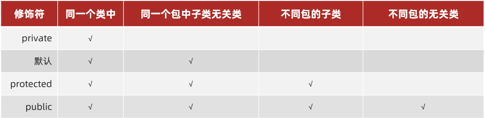

好了，关于权限修饰符我们就先讲到这里

### 2.2 final

#### 2.2.1 final关键字

来，继续啊，下面我们来学习状态修饰符。

在学习状态修饰符之前，我们先说一下**状态修饰符的分类：**

- **final**(最终态)
- **static**(静态)


状态修饰符分为final最终态和static静态，我们先来学习final最终态。

而关于final最终态呢，我们先来说一下：

- **final** 关键字是最终的意思，可以修饰成员方法，成员变量，类

那用final修饰的内容有什么特点呢？我们先到IDEA中去演示，然后再回来总结。

```java
public class Fu {

    public final void method() {
        System.out.println("Fu method");
    }

}

/*
public final class Fu {

    public final void method() {
        System.out.println("Fu method");
    }

}

*/

public class Zi extends Fu {

    public final int age = 20;

    public void show() {
//        age = 30;
        System.out.println(age);
    }


//    @Override
//    public void method() {
//        System.out.println("Zi method");
//    }

}

/*
    测试类
 */
public class Demo {
    public static void main(String[] args) {
        Zi z = new Zi();
        z.method();
        z.show();
    }
}
```

演示完毕后，回到资料我们来总结一下：

**final** 修饰的特点

- 修饰方法：表明该方法是最终方法，**不能被重写**
- 修饰变量：表明该变量是常量，**不能再次被赋值**
- 修饰类：表明该类是最终类，**不能被继承**

好了，关于final关键字我们就先讲到这里

#### 2.2.2 final修饰局部变量

来，继续啊，下面我们来学习final修饰局部变量。

而关于final修饰局部变量呢，我们先到IDEA中去演示，然后再回来总结。

```java
public class Student {
    public int age = 20;
}
```

```java
/*
    测试类
 */
public class FinalDemo {

    public static void main(String[] args) {
        //final修饰基本类型变量
        final int age = 20;
//        age = 100;
        System.out.println(age);


        //final修饰引用类型变量
        final Student s = new Student();
        s.age = 100;
        System.out.println(s.age);

//        s = new Student();
    }

}
```

演示完毕后，回到资料我们来总结一下：

**final修饰局部变量：**

- 变量是基本类型：final 修饰指的是基本类型的**数据值**不能发生改变
- 变量是引用类型：final 修饰指的是引用类型的**地址值**不能发生改变，但是地址里面的内容是可以发生改变的

好了，关于final修饰局部变量我们就先讲到这里

### 2.3 static

#### 2.3.1 static关键字

来，继续啊，下面我们来学习static关键字。

首先，我们来说一下：

- **static**关键字是静态的意思，可以修饰成员方法，成员变量

那用static修饰的成员有什么特点呢？我们先到IDEA中去演示，然后再回来总结。

```java
public class Student {

    public String name; //姓名
    public int age; //年龄
    //    public String university; //学校
    public static String university; //学校

    public void show() {
        System.out.println(name + "," + age + "," + university);
    }

}
```

```java
/*
    测试类
 */
public class StaticDemo {
    public static void main(String[] args) {

        Student.university = "传智大学";

        Student s1 = new Student();
        s1.name = "林青霞";
        s1.age = 33;
//        s1.university = "传智大学";
        s1.show();

        Student s2 = new Student();
        s2.name = "风清扬";
        s2.age = 36;
//        s2.university = "传智大学";
        s2.show();
    }
}
```

演示完毕后，回到资料我们来总结一下：

**static 修饰的特点**

- 被类的所有对象共享，这也是我们判断是否使用静态关键字的条件
- 可以通过类名调用，当然，也可以通过对象名调用，**推荐使用类名调用**

好了，关于static关键字我们就先讲到这里

#### 2.3.2 static访问特点

来，继续啊，下面我们来学习static修饰成员的访问特点。

那有什么特点呢？我们先到IDEA中去演示，然后再回来总结。

```java
/*
    static访问特点
 */
public class Student {
    //非静态成员变量
    private String name = "林青霞";
    //静态成员变量
    private static String university = "传智大学";

    //非静态成员方法
    public void show1() {

    }

    //非静态成员方法
    public void show2() {
        System.out.println(name);
        System.out.println(university);
        show1();
        show3();
    }

    //静态成员方法
    public static void show3() {

    }

    //静态成员方法
    public static void show4() {
//        System.out.println(name);
        System.out.println(university);
//        show1();
        show3();
    }
}
```

演示完毕后，回到资料我们来总结一下：

**非静态的成员方法**

- 能访问静态的成员变量
- 能访问非静态的成员变量
- 能访问静态的成员方法
- 能访问非静态的成员方法

**静态的成员方法**

- 能访问静态的成员变量
- 能访问静态的成员方法

**总结成一句话就是：静态成员方法只能访问静态成员**

好了，关于static修饰成员的访问特点我们就先讲到这里

#### 2.3.3 main方法详细说明

来，继续啊，下面我们来学习main方法的详细说明。

首先，我们来看一下，这是main方法的声明：

public static void main(String[] args) { }

- public   被jvm调用，访问权限足够大
- static   被jvm调用，不用创建对象，直接类名访问
- void   被jvm调用，不需要给jvm返回值
- main   一个通用的名称，虽然不是关键字，但是被jvm识别
- String[] args   以前用于接收键盘录入的
- 演示args接收数据

IDEA中代码演示：

```java
public class HelloWorld {
    public static void main(String[] args) {
        System.out.println(args.length);

        for (int i = 0; i < args.length; i++) {
            System.out.println(args[i]);
        }
    }
}
```

通过args接收数据，参数的配置：

第一步：选择HelloWorld下面的Edit Configurations...

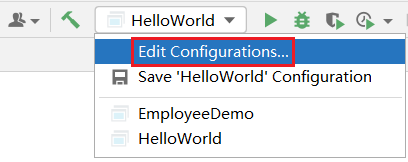

第二步：配置参数，数据之间用空格隔开

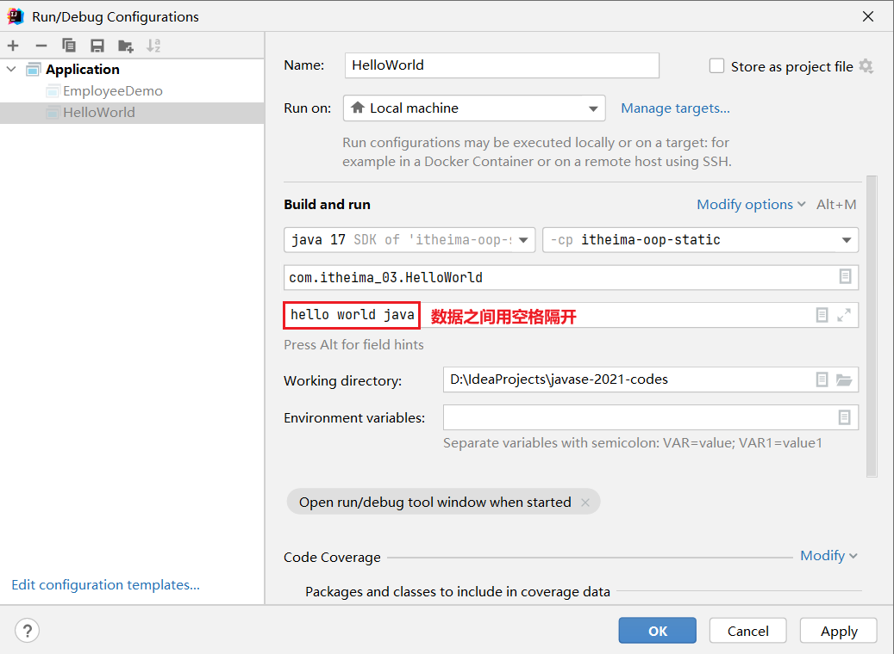

关于args接收参数，现在已经很少使用了，我们作为了解即可。

好了，关于main方法的详细说明我们就先讲到这里

#### 2.3.4 static应用：工具类

来，继续啊，下面我们来学习static的应用。

static的应用有很多，这里我们讲解其中的一个，就是static关键字在工具类中的使用。

而关于工具类的制作呢，下面我们一起到IDEA中去演示，然后再回来总结工具类的特点。

```java
/*
    工具类：
        构造方法私有
        成员静态修饰
 */
public class ArrayTool {

    //构造方法私有
    private ArrayTool() {
    }

    public static int getMax(int[] arr) {
        int max = arr[0];

        for (int i = 1; i < arr.length; i++) {
            if (arr[i] > max) {
                max = arr[i];
            }
        }

        return max;
    }
}
```

```java
public class ArrayDemo {
    public static void main(String[] args) {
        //定义一个数组
        int[] arr = {12, 56, 78, 93, 40};

        //需求：获取数组中最大值
//        int max = arr[0];
//
//        for (int i = 1; i < arr.length; i++) {
//            if (arr[i] > max) {
//                max = arr[i];
//            }
//        }

        //创建对象调用
//        ArrayTool at = new ArrayTool();
//        int max = at.getMax(arr);

        //调用类的静态方法
        int max = ArrayTool.getMax(arr);

        System.out.println("数组中最大值是：" + max);
    }
}
```

演示完毕后，回到资料我们来总结一下：

**工具类的特点：**

- 构造方法私有
- 成员用static修饰

好了，关于工具类的制作和使用我们就先讲到这里

#### 2.3.5 jar包和帮助文档

来，继续啊，下面我们来学习jar包和帮助文档。

首先，我们来回顾一下，刚才我们写了一个工具类：ArrayTool，提供了获取数组最大值的方法。但是呢，这个工具类只能在我们当前的模块中使用。

实际上只要是获取数组最大值，无论是哪个项目中，代码应该都是一样的，为了让我们的工具类做到一次书写，多次使用的效果，这个时候，我们就需要通过jar包来完成。

那jar包是什么呢？

jar包，也就是后缀名为.jar 的文件，也叫做jar文件。JAR文件（Java归档，英语：JavaARchive）是一种软件包文件格式，一般情况下jar文件中打包了多个class文件。

简单的理解：jar包就是.class文件的压缩包

知道了jar是什么之后，那如何制作jar包呢？

在讲解jar包的制作和使用前，我们先说一下，接下来要讲解的内容，步骤比较多，不过大家不同担心，在我们给出的笔记中都有详细的步骤纪录，大家不用担心记不住，照着我们给出的笔记，

大家就可以自己完成jar包的制作和使用。

然后再回到jar包的制作。

第一步：把工具类的代码，单独写到一个模块中，并添加文档注释


```java
/**
 * 这是对数组进行操作的工具类
 *
 * @author fqy
 * @version 1.0
 */
public class ArrayTool {

    //构造方法私有
    private ArrayTool() {
    }

    /**
     * 获取数组中的最大值
     *
     * @param arr 参数是一个int数组
     * @return 返回数组中的最大值
     */
    public static int getMax(int[] arr) {
        int max = arr[0];

        for (int i = 1; i < arr.length; i++) {
            if (arr[i] > max) {
                max = arr[i];
            }
        }

        return max;
    }
}
```

第二步：通过File找到新建模块的位置

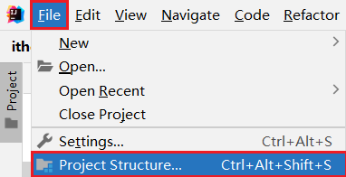

第三步：按照如下步骤选择要制作jar包的模块

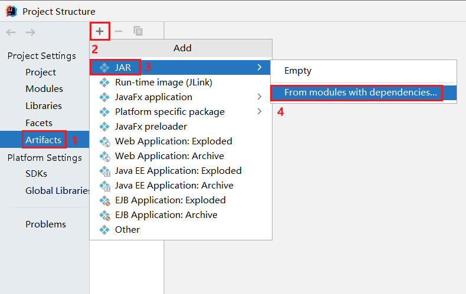

第四步：在弹出的窗体中，选择要制作jar包的模块，最后点击OK按钮

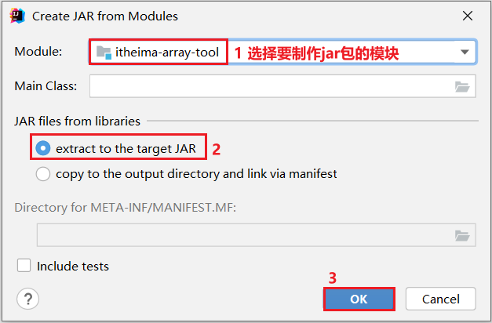

第五步：在这个窗体中，可以修改jar包的存放路径，最后点击OK按钮

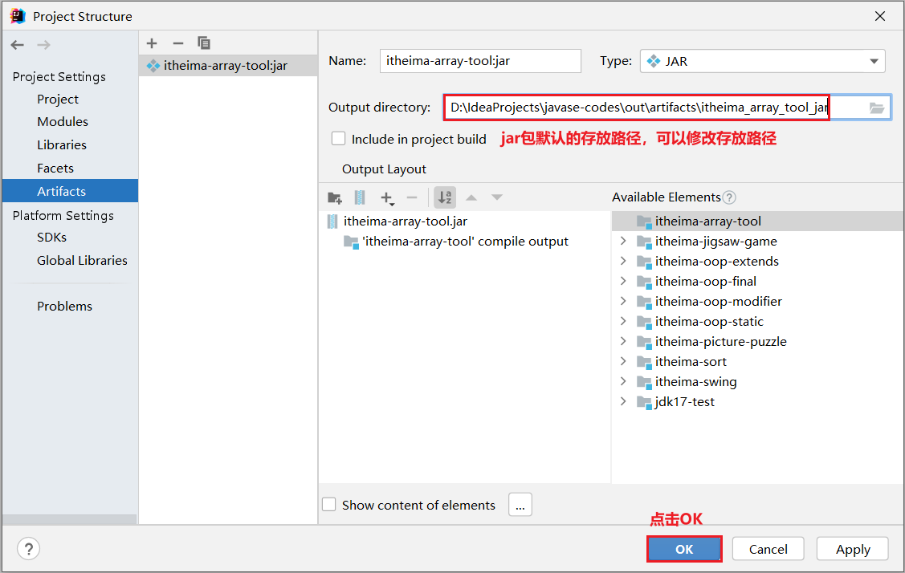

第六步：选择Build下面的Build Artifacts...

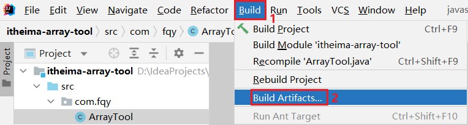

第七步：在弹出的窗体中，选择Build即可

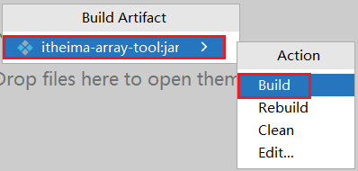


第八步：到jar包的存放路径下，就可以找到生成的jar包


到此，jar包就制作完成了。这里，我们可以通过解压软件去看看jar包里面的内容。


有了jar包以后，我们又该如何使用jar包呢？

第一步：在要使用jar的模块下新建一个lib文件夹

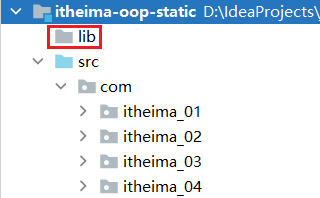

第二步：把jar包复制到该文件夹下

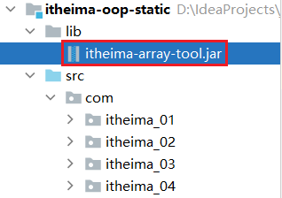


第三步：通过Add as Library...将外部jar包添加到IDEA项目中

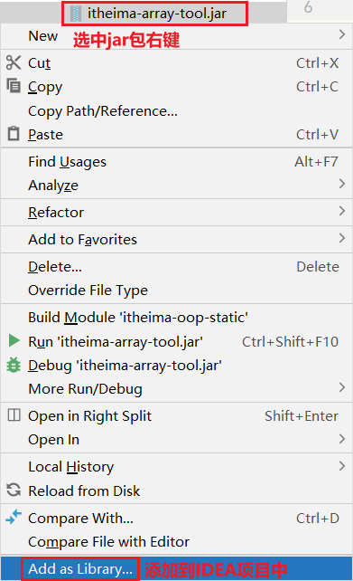

第四步：在弹出的窗口个中，选择要使用jar包的模块，点击OK按钮

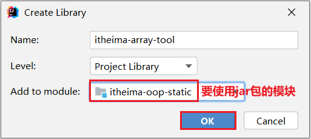

第五步：最后在我们自己的类中使用工具类

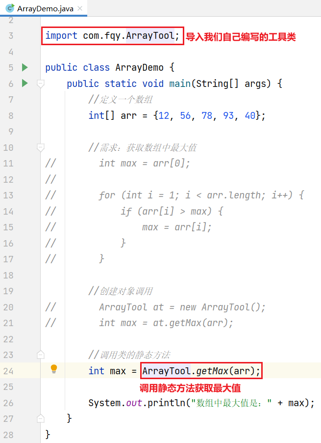

到此，jar包的制作和使用我们就讲解完毕了。

好了，讲完了jar包的制作和使用后，这里我们再提出一个问题，如果别人仅仅给了你一个jar包，你都不知道这个jar包提供了哪些类，哪些方法。

你该如何使用呢？回想一下，前面我们在学习JDK提供的API的时候，我们是不是参照了一个帮助文档啊。

这里呢，我们就带着大家制作一个自己的帮助文档。

来，回来继续，我们来制作帮助文档。

第一步：选择Tools下面的Generate JavaDoc...


第二步：在弹出的窗体中，补充如下内容，并最终点击OK按钮

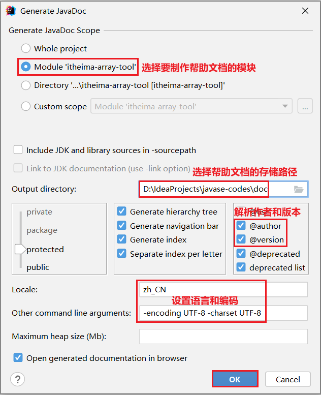

第三步：最终通过浏览器就能够看到生成的帮助文档

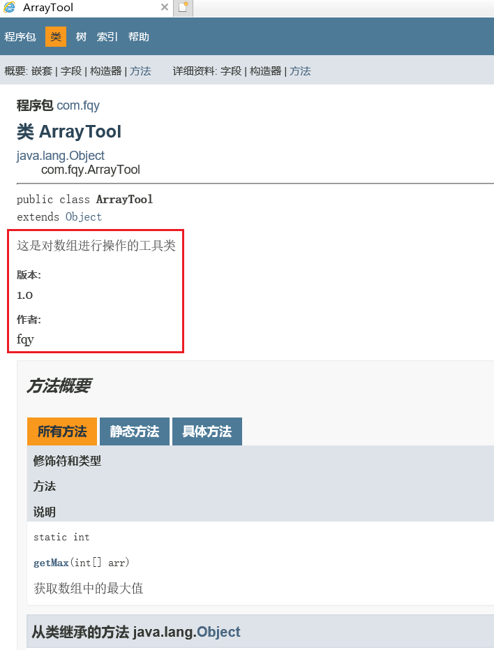

看到这里，估计有同学就要想了，为什么和我们使用的帮助文档格式不一样呢？这里要跟大家说一下，我们使用的帮助文档是chm格式结果，我们可以把网页形式的文档通过工具制作成chm格式。

有空大家自己百度完成即可。这里我们就不在讲解这个内容了。

然后，我们再来看看自己制作的帮助文档中的内容，看完后，我们再去看前面使用过的帮助文档，就知道是怎么回事了。而且，在以后的开发中，如果我们使用到了第三个的jar包，并且它也提供了

帮助文档，那么我们就可以根据帮助文档来使用它所提供的API了。到此，帮助文档的制作我们就讲解完毕了。

最后，我们来总结一下，刚才讲解了三个内容：

- jar包的制作
- jar包的使用
- 帮助文档的制作

每一步的流程和细节，我们在资料中都有详细的纪录，大家参照文档就可以自己完成。

好了，关于jar包的制作和使用，以及帮助文档的制作我们就先讲到这里

#### 2.3.6 Math类使用(自学)

来，继续啊，下面我们来学习Math类的使用。

首先，我们打开帮助文档，来看一下Math类，它在java.lang包下，使用它是不需要导包的。

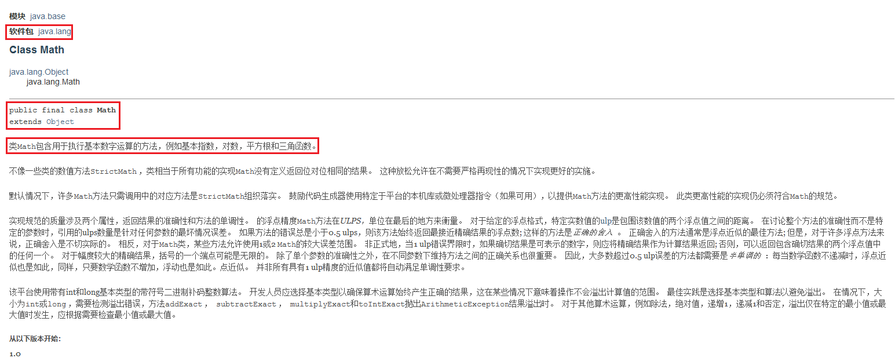

了解了Math相关的基础知识后，我们去看一下它里面的方法。

往下看，这里没有构造方法，没有构造方法，它的成员我们该如何使用呢？

这里我们来看一下，发现它里面的成员都用static修饰了，可以通过类名直接访问。

回到资料，总结一下：

- Math类是：数学工具类，包含对数学运算的方法
- 帮助文档中，没有看到构造方法，因为成员都用static修饰了，可以通过类名直接访问

下面我们到IDEA中去演示几个方法：

```java
/*
    Math类的使用
 */
public class MathDemo {
    public static void main(String[] args) {
        //public static int abs(int a):返回int值的绝对值
        System.out.println(Math.abs(10));
        System.out.println(Math.abs(-10));
        System.out.println("-----------");

        //public static int max(int a, int b):返回两个int值中较大的int
        System.out.println(Math.max(10, 20));
        System.out.println("-----------");

        //public static double pow(double a, double b):返回第一个参数的值，该值是第二个参数的幂
        System.out.println(Math.pow(2, 3));
        System.out.println("-----------");

        //public static long round(double a):返回与参数最接近的long
        System.out.println(Math.round(15.4));
        System.out.println(Math.round(15.5));
    }
}
```

讲解完毕后，大家赶快动手练习一下吧。