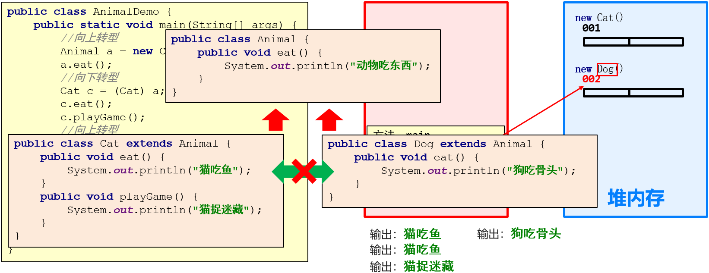
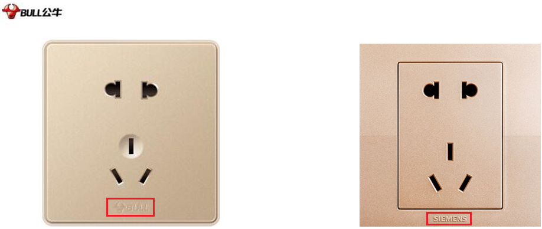
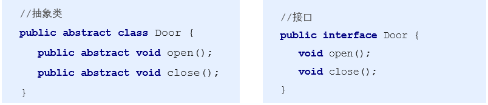
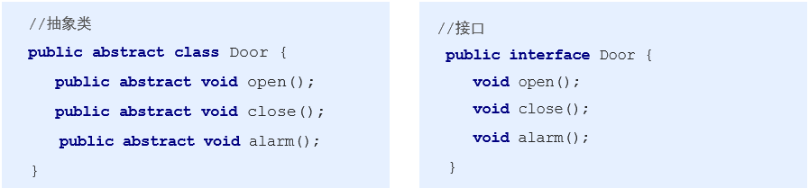
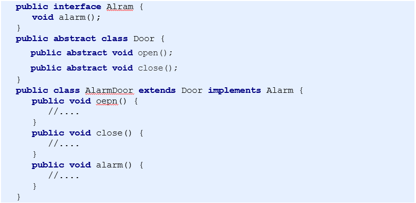
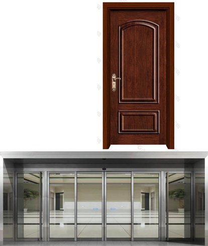

# 面向对象高级(2)

**今日目标：**

- 能够知道多态的前提
- 能够理解多态的好处和弊端
- 能够理解多态中的转型
- 能够知道抽象类的特点
- 能够知道抽象类的成员特点
- 能够知道接口的特点
- 能够知道接口的成员特点
- 能够理解抽象类和接口的区别

## 1：多态

### 1.1 多态概述

来，继续啊，下面我们来学习多态。

那什么是多态呢？我们一起来说一下：

- **多态：**指的是同一个对象，在不同时刻表现出来的多种形态

那这句话又该如何理解呢？我们再来举例说明一下：

举例：猫

- 我们可以说猫是猫：**猫** **cat = new** **猫**();
- 我们也可以说猫是动物：**动物** **animal = new** **猫**();
- 这里猫在不同的时刻表现出来了多种形态，这就是多态

了解了什么是多态后，我们再来说一下多态的前提和体现：

- 有继承/实现关系
- 有方法重写
- 有父类引用指向子类对象

第一个条件是：有继承或者实现关系，继承关系我们讲解过了，实现关系呢，等后面我们讲解接口的时候会去讲解的。

第二个条件是：有方法重写，方法重写我们在继承中已经讲解过了。

第三个条件是：有父类引用指向子类对象。怎么理解这句话呢？

看这里：**动物** **animal = new** **猫**();

父类引用，指的是左边的内容；而子类对象，指的是右边的内容。当然，这个要求在代码实现的时候，猫类是继承自动物类的。

说完了第三个条件后，这里我们在说一下，第三个条件还不够准确，等后面我们学习了接口后会给出更准确的说法。

知道了多态的前提和体现后，下面我们到IDEA中去演示一下：

```java
public class Animal {

    public void eat() {
        System.out.println("动物吃东西");
    }

}
```

```java
public class Cat extends Animal {

    @Override
    public void eat() {
        System.out.println("猫吃鱼");
    }

}
```

```java
/*
    多态的前提和体现
        有继承/实现关系
        有方法重写
        有父类引用指向子类对象
 */
public class AnimalDemo {
    public static void main(String[] args) {
        //有父类引用指向子类对象
        Animal a = new Cat();
    }
}
```


好了，关于多态的基础知识我们就先讲到这里

### 1.2 多态中成员访问特点

来，继续啊，下面我们来学习多态中成员的访问特点。

而关于多态中成员的访问特点呢，我们先到IDEA中去演示，然后再回来总结。

```java
public class Animal {

    public int age = 40;

    public void eat() {
        System.out.println("动物吃东西");
    }

}
```

```java
public class Cat extends Animal {

    public int age = 20;
    public int weight = 10;

    @Override
    public void eat() {
        System.out.println("猫吃鱼");
    }

    public void playGame() {
        System.out.println("猫捉迷藏");
    }

}
```

```java
/*
    测试类
 */
public class AnimalDemo {
    public static void main(String[] args) {
        //有父类引用指向子类对象
        Animal a = new Cat();

        System.out.println(a.age);
//        System.out.println(a.weight);

        a.eat();
//        a.playGame();

    }
}
```

演示完毕后，回到资料我们来总结一下：

多态中成员方法特点：

- **成员变量**：编译看左边，执行看左边
- **成员方法**：编译看左边，执行看右边

为什么成员变量和成员方法的访问不一样呢？

因为成员方法有重写，而成员变量没有

好了，关于多态中成员访问特点我们就先讲到这里

讲解完毕后，大家赶快动手练习一下吧。

### 1.3 多态的好处和弊端

来，继续啊，下面我们来学习多态的好处和弊端。

而关于多态的好处和弊端呢，我们先到IDEA中去演示，然后再回来总结。

```java
public class Animal {

    public void eat() {
        System.out.println("动物吃东西");
    }

}
```

```java
public class Cat extends Animal {

    @Override
    public void eat() {
        System.out.println("猫吃鱼");
    }

}
```

```java
public class Dog extends Animal {

    @Override
    public void eat() {
        System.out.println("狗吃骨头");
    }

    public void lookDoor() {
        System.out.println("狗看门");
    }

}
```

```java
public class Pig extends Animal {

    @Override
    public void eat() {
        System.out.println("猪吃白菜");
    }
}
```

```java
/*
    动物操作类
 */
public class AnimalOperator {

    /*
    public void useAnimal(Cat c) { //Cat c = new Cat();
        c.eat();
    }

    public void useAnimal(Dog d) { //Dog d = new Dog();
        d.eat();
    }
    */

    public void useAnimal(Animal a) {
        //Animal a = new Cat();
        //Animal a = new Dog();

        a.eat();
//        a.lookDoor();
    }
    
}
```

```java
/*
    测试类
 */
public class AnimalDemo {
    public static void main(String[] args) {
        //创建动物操作类的对象，调用方法
        AnimalOperator ao = new AnimalOperator();
        Cat c = new Cat();
        ao.useAnimal(c);


        Dog d = new Dog();
        ao.useAnimal(d);


        Pig p = new Pig();
        ao.useAnimal(p);

    }
}
```

演示完毕后，回到资料我们来总结一下：

**多态的好处：**提高了程序的扩展性

- 具体体现：定义方法的时候，使用父类型作为参数，将来在使用的时候，使用具体的子类型参与操作

**多态的弊端：**不能使用子类的特有功能

好了，关于多态的好处和弊端我们就先讲到这里

### 1.4 多态中的转型

来，继续啊，下面我们来学习多态中的转型。

首先，我们来说一下，为什么要学习多态中的转型呢？因为我们前面讲过，多态的弊端是不能访问子类的特有功能。而通过转型就可以访问子类特有功能了。

知道了，为什么要学习多态中的转型后，我们来说一下多态中的转型问题：

多态中的转型分为如下两种情况：

- 向上转型
  - 从子到父
  - 父类引用指向子类对象
- 向下转型
  - 从父到子
  - 父类引用转为子类对象

了解了多态中的转型后，下面我们到IDEA中去讲解一下多态中的转型问题。

```java
public class Animal {

    public void eat() {
        System.out.println("动物吃东西");
    }

}
```

```java
public class Cat extends Animal {

    @Override
    public void eat() {
        System.out.println("猫吃鱼");
    }

    public void playGame() {
        System.out.println("猫捉迷藏");
    }

}
```

```java
/*
    向上转型
        从子到父
        父类引用指向子类对象

    向下转型
        从父到子
        父类引用转为子类对象
 */
public class AnimalDemo {
    public static void main(String[] args) {
        //多态
        Animal a = new Cat(); //向上转型
        a.eat();
//        a.playGame();

        /*
        //创建Cat类的对象
        Cat c = new Cat();
        c.eat();
        c.playGame();
        */

        //向下转型
        Cat c = (Cat)a;
        c.eat();
        c.playGame();
    }
}
```

虽然我们通过向下转型解决了多态中的访问弊端，但是一般来说，我们使用多态的时候，主要还是使用父类中定义的通用功能。

好了，关于多态中的转型问题我们就先讲到这里

### 1.5 多态转型内存图解

来，继续啊，下面我们来学习多态转型的内存图解。

整个过程讲解的是下图代码的执行流程，大家能够听懂即可。



最后，我们自己编写代码验证一下：

```java
public class Animal {

    public void eat() {
        System.out.println("动物吃东西");
    }

}
```

```java
public class Cat extends Animal {

    @Override
    public void eat() {
        System.out.println("猫吃鱼");
    }

    public void playGame() {
        System.out.println("猫捉迷藏");
    }

}
```

```java
public class Dog extends Animal {

    @Override
    public void eat() {
        System.out.println("狗吃骨头");
    }

}
```

```java
/*
    测试类
 */
public class AnimalDemo {
    public static void main(String[] args) {
        //向上转型
        Animal a = new Cat();
        a.eat();

        //向下转型
        Cat c = (Cat) a;
        c.eat();
        c.playGame();

        //向上转型
        a = new Dog();
        a.eat();

        //向下转型
        //ClassCastException 类型转换异常
//        Cat cc = (Cat) a;
//        cc.eat();
//        cc.playGame();

        //为了避免类型转换异常，在做向下转型的时候，一般我们会进行类型的判断。这里就用到了一个新的关键字：instanceof
        if (a instanceof Cat) {
            Cat cc = (Cat) a;
            cc.eat();
            cc.playGame();
        }
    }
}
```

代码中我们引入了一个新的关键字：instanceof

由于仅仅是验证讲解的结论，故不需要练习。

### 1.6 案例：猫和狗(多态版)

需求：请采用多态的思想实现猫和狗的案例，并在测试类中进行测试

看完需求后，我们先简单的说一下思路：

**思路：**

① 定义动物类(Animal)

- 成员变量：姓名，年龄
- 构造方法：无参，带参
- 成员方法：get/set，吃(){}

② 定义猫类(Cat)，继承动物类，重写吃的方法

- 构造方法：无参，带参
- 成员方法：吃(){}

③ 定义狗类(Dog)，继承动物类，重写吃的方法

- 构造方法：无参，带参
- 成员方法：吃(){}

④ 定义测试类(AnimalDemo)，写代码测试

有了思路之后，下面我们一起到IDEA中去实现一下：

```java
public class Animal {
    private String name;
    private int age;

    public Animal() {
    }

    public Animal(String name, int age) {
        this.name = name;
        this.age = age;
    }

    public String getName() {
        return name;
    }

    public void setName(String name) {
        this.name = name;
    }

    public int getAge() {
        return age;
    }

    public void setAge(int age) {
        this.age = age;
    }

    public void eat() {
        System.out.println("动物吃东西");
    }
}
```

```java
public class Cat extends Animal {

    public Cat() {
    }

    public Cat(String name, int age) {
        super(name, age);
    }

    @Override
    public void eat() {
        System.out.println("猫吃鱼");
    }
}
```

```java
public class Dog extends Animal {

    public Dog() {
    }

    public Dog(String name, int age) {
        super(name, age);
    }

    @Override
    public void eat() {
        System.out.println("狗吃骨头");
    }
}
```

```java
/*
    测试类
 */
public class AnimalDemo {
    public static void main(String[] args) {
        //按照多态的方式创建对象并进行测试
        Animal a = new Cat();
        a.setName("加菲");
        a.setAge(5);
        System.out.println(a.getName() + "," + a.getAge());
        a.eat();

        a = new Cat("加菲", 5);
        System.out.println(a.getName() + "," + a.getAge());
        a.eat();

    }
}
```

创建狗类的对象进行测试留给大家自己练习。

好了，关于猫和狗的练习多态版我们就先讲到这里。

讲解完毕后，大家赶快动手练习一下吧。

## 2：抽象类

### 2.1 抽象类概述

来，继续啊，下面我们来学习抽象类。

为了给大家说明白什么是抽象类，我们先来回顾一下前面讲解过的猫狗案例。

当时我们提取出了一个动物类，这个时候我们是可以通过Animal a = new Animal()来创建动物对象，

其实这是不对的。为什么呢？因为，我说动物，你知道我说的是什么动物吗？只有看到了具体的动物，你才知道，

这是什么动物。 所以说，动物本身并不是一个具体的事物，而是一个抽象的事物。只有真正的猫，狗才是具体的动物。

同理，我们也可以推想，不同的动物吃的东西应该是不一样的，所以，我们不应该在动物类中给出具体体现，而是应该给出一个吃的方法声明，不给方法体。

这里我们一起来说一下：

- 在Java中，一个**没有方法体**的方法应该定义为**抽象方法**，而类中如果有**抽象方法**，该类必须定义为**抽象类**

知道了什么是抽象方法和抽象类之后，下面呢，我们到IDEA中去演示一下：

```java
public abstract class Animal {

    /*
    public void eat() {
        System.out.println("吃东西");
    }
    */

    public abstract void eat();

}

/*
    测试类
 */
public class AnimalDemo {

    public static void main(String[] args) {
        /*
        Animal a = new Animal();
        a.eat();
        */
    }

}
```

在这里呢，我们把抽象方法和抽象类做了一个简单的演示。至于抽象类的特点我们下一个知识再去讲解。

好了，关于抽象类的基础知识我们就先讲到这里

### 2.2 抽象类特点

来，继续啊，下面我们来学习抽象类的特点。

而关于抽象类的特点呢，我们先到IDEA中去演示，然后再回来总结。

```java
/*
    抽象类
 */
public abstract class Animal {
    //抽象方法
    public abstract void eat();

    public void sleep() {
        System.out.println("睡觉");
    }

}
```

```java
public class Cat extends Animal {

    @Override
    public void eat() {
        System.out.println("猫吃鱼");
    }
}
```

```java
public abstract class Dog extends Animal {

}
```

```java
/*
    测试类
 */
public class AnimalDemo {
    public static void main(String[] args) {
//        Animal a = new Animal();
        Animal a = new Cat();
        a.eat();
        a.sleep();
    }
}
```

演示完毕后，回到资料我们来总结一下：

**抽象类的特点：**

- 抽象类和抽象方法必须使用 **abstract** 关键字修饰
  - public **abstract** class 类名 {}
  - public **abstract** void eat();
- 抽象类中不一定有抽象方法，有抽象方法的类一定是抽象类
- 抽象类不能实例化
  - 抽象类如何实例化呢？参照多态的方式，通过子类对象实例化，这叫抽象类多态
- 抽象类的子类
  - 要么重写抽象类中的所有抽象方法
  - 要么是抽象类

好了，关于抽象类的特点我们就先讲到这里

### 2.3 抽象类的成员特点

来，继续啊，下面我们来学习抽象类的成员特点。

而关于抽象类的成员特点呢，我们先到IDEA中去演示，然后再回来总结。

```java
/*
    抽象类
 */
public abstract class Animal {

    private int age = 20;
    private final String name = "动物";

    public Animal() {
    }

    public Animal(int age) {
        this.age = age;
    }


    public void show() {
        age = 40;
        System.out.println(age);
//        name = "老虎";
        System.out.println(name);
    }

    public abstract void eat();

}
```

```java
public class Cat extends Animal {

    @Override
    public void eat() {
        System.out.println("猫吃鱼");
    }
}
```

```java
/*
    测试类
 */
public class AnimalDemo {
    public static void main(String[] args) {
        Animal a = new Cat();
        a.eat();
        a.show();
    }
}
```

演示完毕后，回到资料我们来总结一下：

**抽象类的成员特点：**

- 成员变量
  - 可以是变量
  - 也可以是常量
- 构造方法
  - 有构造方法，但是不能实例化
  - 那么，构造方法的作用是什么呢？用于子类访问父类数据的初始化
- 成员方法
  - 可以有抽象方法：限定子类必须完成某些动作
  - 也可以有非抽象方法：提高代码复用性

好了，关于抽象类的成员特点我们就先讲到这里

### 2.4 案例：猫和狗(抽象类版)

需求：请采用抽象类的思想实现猫和狗的案例，并在测试类中进行测试

看完需求后，我们先简单的说一下思路：

**思路：**

① 定义动物类(Animal)

- 成员变量：姓名，年龄
- 构造方法：无参，带参
- 成员方法：get/set，吃();

② 定义猫类(Cat)，继承动物类，重写吃的方法

- 构造方法：无参，带参
- 成员方法：吃(){…}

③ 定义狗类(Dog)，继承动物类，重写吃的方法

- 构造方法：无参，带参
- 成员方法：吃(){…}

④ 定义测试类(AnimalDemo)，写代码测试

有了思路之后，下面我们一起到IDEA中去实现一下：

```java
public abstract class Animal {
    private String name;
    private int age;

    public Animal() {
    }

    public Animal(String name, int age) {
        this.name = name;
        this.age = age;
    }

    public String getName() {
        return name;
    }

    public void setName(String name) {
        this.name = name;
    }

    public int getAge() {
        return age;
    }

    public void setAge(int age) {
        this.age = age;
    }

    public abstract void eat();
}
```

```java
public class Cat extends Animal {

    public Cat() {
    }

    public Cat(String name, int age) {
        super(name, age);
    }

    @Override
    public void eat() {
        System.out.println("猫吃鱼");
    }
}
```

```java
public class Dog extends Animal {

    public Dog() {
    }

    public Dog(String name, int age) {
        super(name, age);
    }

    @Override
    public void eat() {
        System.out.println("狗吃骨头");
    }
}
```

```java
/*
    测试类
 */
public class AnimalDemo {
    public static void main(String[] args) {
        //创建对象，按照多态的方式
        Animal a = new Cat();
        a.setName("加菲");
        a.setAge(5);
        System.out.println(a.getName()+","+a.getAge());
        a.eat();
        System.out.println("--------");

        a = new Cat("加菲",5);
        System.out.println(a.getName()+","+a.getAge());
        a.eat();
    }
}
```

好了，关于猫和狗的练习抽象类版我们就先讲到这里。

讲解完毕后，大家赶快动手练习一下吧。

## 3：接口

### 3.1 接口概述

来，继续啊，下面我们来学习接口。

其实啊，在生活中，接口随处可见，为了帮助大家理解什么是接口，这里呢我们来举例说明一下。

看这里：



这是我们房间中比较常见的五孔插线面板，我们再来一个五孔插线面板。

大家认真看一下啊，这是两种不同类型的插线面板，对插线面板有了解的同学，应该能够看出来。

左边这个是公牛的，右边这个是西门子的。

为什么不同厂商生成的插线面板装到你家里，你都可以使用呢？

原因很简单，因为这些面板是这些厂商遵循同样的规范生产的。

所以说，接口啊，就是一种公共的规范，只要符合规范，大家都可以使用。

这是我们生活当中的，其实与计算机相关的接口也随处可见：


这是笔记本，有两个USB插口，可以用来连接外接设备。

我们在使用笔记本的时候，有些操作我们发现使用键盘不方便，这里呢，我们就可以提供一个鼠标，插入到这个USB插口里面就可以使用了。

再比如说，笔记本上的键盘用起来我感觉不是很方便，而且我担心给他敲坏了，怎么本？我们就可以提供一个外置的键盘，插入到这个USB插口里面也就可以使用了。

再比如说，我电脑上有一些学习资料，我要给你。如果有网络，我们可以通过一些网络软件发送给你，如果没有网络，怎么办呢？这个时候，我们就可以通过这样的一个小工具：U盘来拷贝资料。

插入到这个USB插口里面也就可以使用了。

看到这里，我们思考一下，这些产品是由不同的厂商生产的，但是它们却都可以通过这个USB插口接到这个电脑上，这是为什么呢？

原因很简单，因为它们参照的是同样的USB插口规范来实现的。无论是尺寸，厚度等都是有标准参数的。所以，虽然它们是不同的厂商生产的，但是却可以通过这个USB插口来使用。

最后呢，我们来说一下：

- 接口就是一种**公共的规范标准**，只要符合规范标准，大家都可以通用
- Java中的接口更多的体现在**对行为的抽象**

好了，关于接口的基础知识我们就先讲到这里

### 3.2 接口特点

来，继续啊，下面我们来学习接口的特点。

而关于接口的特点呢，我们先到IDEA中去演示，然后再回来总结。

```java
/*
    定义了一个接口
 */
public interface Inter {
    public abstract void show();
}

```

```java
public class InterImpl implements Inter {
    @Override
    public void show() {
        System.out.println("show...");
    }
}

```

```java
public abstract class InterImpl2 implements Inter{

}

```

```java
/*
    测试类
 */
public class InterDemo {
    public static void main(String[] args) {
//        Inter i = new Inter();
        Inter i = new InterImpl();
        i.show();
    }
}
```

演示完毕后，回到资料我们来总结一下：

**接口的特点：**

- 接口用关键字interface修饰
  - public **interface** 接口名 {} 
- 类实现接口用implements表示
  - public class 类名 **implements** 接口名 {}
- 接口不能实例化
  - 接口如何实例化呢？参照多态的方式，通过实现类对象实例化，这叫接口多态
  - 多态的形式：具体类多态，**抽象类多态，接口多态**
  - 多态的前提：有继承或者实现关系；有方法重写；有父(类/接口)引用指向(子/实现)类对象
- 接口的实现类
  - 要么重写接口中的所有抽象方法
  - 要么是抽象类

好了，关于接口的特点我们就先讲到这里

### 3.3 接口的成员特点

来，继续啊，下面我们来学习接口的成员特点。

而关于接口的成员特点呢，我们先到IDEA中去演示，然后再回来总结。

```java
public interface Inter {
    public int num = 10;
    public final int num2 = 20;
//    public static final int num3 = 30;
    int num3 = 30;

//    public Inter() {}

//    public void show() {}

    public abstract void method();
    void show();

}
```

```java
//public class InterImpl implements Inter {

public class InterImpl extends Object implements Inter {
    public InterImpl() {
        super();
    }

    @Override
    public void method() {
        System.out.println("method");
    }

    @Override
    public void show() {
        System.out.println("show");
    }
}
```

```java
/*
    测试类
 */
public class InterfaceDemo {
    public static void main(String[] args) {
        Inter i = new InterImpl();
//        i.num = 20;
        System.out.println(i.num);
//        i.num2 = 40;
        System.out.println(i.num2);
        System.out.println(Inter.num);
    }
}
```

演示完毕后，回到资料我们来总结一下：

**接口的成员特点：**

- 成员变量
  - 只能是常量
  - 默认修饰符：**public static final**
- 构造方法
  - 没有，因为接口主要是扩展功能的，而没有具体存在
  - 一个类如果没有父类，默认继承自Object类
- 成员方法
  - 只能是抽象方法
  - 默认修饰符：**public abstract**
  - 关于接口中的方法，JDK8和JDK9中有一些新特性，后面再讲解

好了，关于接口的成员特点我们就先讲到这里

### 3.4 类和接口的关系

来，继续啊，下面我们来学习类和接口的关系。

我们一起来说一下：

- 类和类的关系
  - 继承关系，只能单继承，但是可以多层继承
- 类和接口的关系
  - 实现关系，可以单实现，也可以多实现，还可以在继承一个类的同时实现多个接口
- 接口和接口的关系
  - 继承关系，可以单继承，也可以多继承

知道了类和类，类和接口，以及接口和接口的关系后，我们先到IDEA中去演示一下：

```java
public interface Inter1 {
    
}
```

```java
public interface Inter2 {

}
```

```java
public interface Inter3 extends Inter1,Inter2 {

}
```

```java
public class InterImpl extends Object implements Inter1,Inter2,Inter3 {

}
```

好了，关于类和接口的关系我们就先讲到这里

### 3.5 抽象类和接口的区别

来，继续啊，下面我们来学习抽象类和接口的区别。

我们一起来说一下：

- 成员区别
  - 抽象类   变量,常量；有构造方法；有抽象方法,也有非抽象方法
  - 接口   常量；抽象方法
- 关系区别
  - 类与类   继承，单继承
  - 类与接口   实现，可以单实现，也可以多实现
  - 接口与接口   继承，单继承，多继承
- 设计理念区别
  - 抽象类   对类抽象，包括属性、行为
  - 接口   对行为抽象，主要是行为

前2个其实属于语法层面的区别，我们重点再来说一个设计层面的区别

抽象类是对一种事物的抽象，即对类抽象，而接口是对行为的抽象。

抽象类是对整个类整体进行抽象，包括属性、行为，但是接口却是对类局部（行为）进行抽象。

下面我们来举例说明一下：

门和警报的例子

门：都有open()和close()两个动作，这个时候，我们可以分别使用抽象类和接口来定义这个抽象概念



随着时代的发展，我们的门具备了报警(alarm())的功能，又该如何实现呢？

这里我们给出两种思路：

第一种方案：将这三个功能都放在抽象类里面，但是这样一来所有继承于这个抽象类的子类都具备了报警功能，但是有的门并不一定具备报警功能，所以，这种设计不好

第二种方案：将这三个功能都放在接口里面，需要用到报警功能的类就需要实现这个接口中的open( )和close( )，也许这个类根本就不具备open( )和close( )这两个功能，比如火灾报警器。

由此可见，这两种设计都不好，那该如何设计呢？



我们一起来说一下：Door的open() 、close()和alarm()根本就属于两个不同范畴内的行为，open()和close()属于门本身固有的行为特性，而alarm()属于延伸的附加行为。

因此最好的解决办法是单独将报警设计为一个接口，包含alarm()行为,Door设计为单独的一个抽象类，包含open和close两种行为。再设计一个报警门继承Door类和实现Alarm接口。



在这里，我们再次强调抽象类是对事物的抽象，而接口是对行为的抽象。

好了，关于抽象类和接口的区别我们就先讲到这里

### 3.6 案例：木门和电动报警门

需求：请采用面向对象的思想实现木门和电动报警门的案例，并在测试类中进行测试

看完需求后，我们先简单的分析一下：



**分析：**

①木门

- 成员变量：宽，高，品牌
- 成员方法：开门，关门

②电动报警门：

- 成员变量：宽，高，品牌
- 成员方法：开门，关门，报警

分析完毕后，我们来说一下实现思路：

**思路：**

①定义报警 (Alarm)接口

- 成员方法：报警

②定义门 (Door)抽象类

- 成员变量：宽，高，品牌
- 构造方法：无参，带参
- 成员方法：get/set方法，开门，关门

③定义木门类(WoodDoor)，继承门类

- 构造方法：无参，带参
- 成员方法：开门，关门

④定义电动报警门类(ElectricAlarmDoor),继承门类,实现报警接口

- 构造方法：无参，带参
- 成员方法：开门，关门，报警

⑤定义测试类(DoorDemo)，创建对象进行测试

知道了实现思路后，下面我们一起到IDEA中去实现一下：

```java
/*
    报警接口
 */
public interface Alarm {
    void alarm();
}
```

```java
/*
    抽象门类
 */
public abstract class Door {
    //宽
    private double width;
    //高
    private double height;
    //品牌
    private String brand;

    public Door() {
    }

    public Door(double width, double height, String brand) {
        this.width = width;
        this.height = height;
        this.brand = brand;
    }

    public double getWidth() {
        return width;
    }

    public void setWidth(double width) {
        this.width = width;
    }

    public double getHeight() {
        return height;
    }

    public void setHeight(double height) {
        this.height = height;
    }

    public String getBrand() {
        return brand;
    }

    public void setBrand(String brand) {
        this.brand = brand;
    }

    //开门
    public abstract void open();

    //关门
    public abstract void close();
}
```

```java
/*
    木门
 */
public class WoodDoor extends Door {

    public WoodDoor() {
    }

    public WoodDoor(double width, double height, String brand) {
        super(width, height, brand);
    }

    @Override
    public void open() {
        System.out.println("手动开门");
    }

    @Override
    public void close() {
        System.out.println("手动关门");
    }
}
```

```java
/*
    电动报警门
 */
public class ElectricAlarmDoor extends Door implements Alarm {
    public ElectricAlarmDoor() {
    }

    public ElectricAlarmDoor(double width, double height, String brand) {
        super(width, height, brand);
    }

    @Override
    public void open() {
        System.out.println("自动开门");
    }

    @Override
    public void close() {
        System.out.println("自动关门");
    }


    @Override
    public void alarm() {
        System.out.println("具有报警功能");
    }
}
```

```java
/*
    测试类
 */
public class DoorDemo {
    public static void main(String[] args) {
        //木门
        WoodDoor wd = new WoodDoor();
        wd.open();
        wd.close();
//        wd.alarm();
        System.out.println("--------");

        //电动报警门
        ElectricAlarmDoor ed = new ElectricAlarmDoor();
        ed.open();
        ed.close();
        ed.alarm();
        System.out.println("--------");

        //多态用法
        Door d = new WoodDoor();
        d.open();
        d.close();
        System.out.println("--------");

        d = new ElectricAlarmDoor();
        d.open();
        d.close();
//        d.alarm();
        System.out.println("--------");

        Alarm a = new ElectricAlarmDoor();
//        a.open();
//        a.close();
        a.alarm();
    }
}
```

### 3.7 接口新增的方法

来，继续啊，下面我们来学习接口中新增的方法。

在讲解接口中的新增的方法之前，我们来回顾一下我们讲解过的**接口组成：**

- 常量
  - public static final
- 抽象方法
  - public abstract
- 默认方法(Java 8)
- 静态方法(Java 8)
- 私有方法(Java 9)

但是呢，在Java 8 以后，我们可以在接口中添加默认方法和静态方法了。在Java 9以后，我们可以在接口中添加私有方法了。

看到这，先给大家强调一下，这里新增的3类方法我们自己在开发中很少使用，通常是Java源码中涉及到，对我们来说，能够识别语法，知道调用关系即可。

下面呢，我们就逐一介绍这三类方法：

先来看第一个默认方法：

**接口中默认方法的定义格式：**

- 格式：public **default** 返回值类型 方法名(参数列表) {   }
- 范例：public **default** void show1() {   }

**接口中默认方法的注意事项：**

- public可以省略，default不能省略


再来看第二个静态方法：

**接口中静态方法的定义格式：**

- 格式：public **static** 返回值类型 方法名(参数列表) {   }
- 范例：public **static** void show2() {   }

**接口中静态方法的注意事项：**

- 静态方法只能通过接口名调用，不能通过实现类名或者对象名调用

- public可以省略，static不能省略


最后来看第三个私有方法：

**接口中私有方法的定义格式：**

- 格式1：**private** 返回值类型 方法名(参数列表) {   }
- 范例1：**private** void show3() {   }
- 格式2：**private** static 返回值类型 方法名(参数列表) {   }
- 范例2：**private** static void show4() {   }

**接口中私有方法的注意事项：**

- 默认方法可以调用私有的静态方法和非静态方法
- 静态方法只能调用私有的静态方法

IDEA中的代码演示如下：

```java
public interface Inter {
//    public default void show1() {
//        System.out.println("默认方法被调用");
//    }

    default void show1() {
        System.out.println("默认方法被调用");
        show3();
        show4();
    }

//    public static void show2() {
//        System.out.println("静态方法被调用");
//    }

    static void show2() {
        System.out.println("静态方法被调用");
//        show3();
        show4();
    }

    private void show3() {
        System.out.println("私有方法");
    }

    private static void show4() {
        System.out.println("静态私有方法");
    }

}
```

```java
public class InterImpl implements Inter {
    
}
```

```java
/*
    测试类
 */
public class InterDemo {
    public static void main(String[] args) {
        Inter i = new InterImpl();
        i.show1();
//        i.show2();
//        InterImpl.show2();
        Inter.show2();
    }
}
```

好了，关于接口中新增的方法我们就先讲到这里