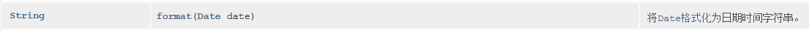
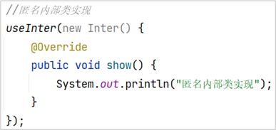
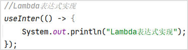

# 面向对象高级(3)

**今日目标：**

- 能够知道内部类的格式
- 能够知道内部类的分类
- 能够知道匿名内部类的格式
- 能够理解匿名内部类的使用
- 能够知道Lambda表达式的格式
- 能够使用Lambda表达式完成今日案例
- 能够知道Lambda表达式和匿名内部类的区别

## 1：内部类

### 1.1 内部类概述

来，继续啊，下面我们来学习内部类。

那什么是内部类呢？我们一起来说一下：

- **内部类：**就是在一个类中定义一个类。举例：在一个类A的内部定义一个类B，类B就被称为内部类

我们来看一下内部类的定义格式：

**格式：**


**范例：**


了解了内部类的格式后，我们再来说一下内部类的**访问特点：**

- 内部类可以直接访问外部类的成员，包括私有
- 外部类要访问内部类的成员，必须创建对象

知道了内部类的格式和访问特点后，下面我们到IDEA中去演示一下：

```java
/*
    内部类格式：
        public class 类名{
              修饰符 class 类名{

              }
        }

    内部类访问特点：
        内部类可以直接访问外部类的成员，包括私有
        外部类要访问内部类的成员，必须创建对象
 */
public class Outer {

    private int num = 10;

    public class Inner {

        public void show() {
            System.out.println(num);
        }

    }

    public void method() {
//        show();

        Inner i = new Inner();
        i.show();
    }

}
```

好了，关于内部类的基础知识我们就先讲到这里

### 1.2 成员内部类

来，继续啊，下面我们来学习成员内部类。

那什么是成员内部类呢？我们一起来说一下：

按照内部类在类中定义的位置不同，可以分为如下两种形式

- 在类的成员位置：**成员内部类**
- 在类的局部位置：**局部内部类**

所以说，成员内部类就是指在类的成员位置定义内部类。

知道了什么是成员内部类后，下面我们到IDEA中去演示一下：

```java
public class Outer {

    private int num = 10;

    /*
    public class Inner {
        public void show() {
            System.out.println(num);
        }
    }
    */

    private class Inner {
        public void show() {
            System.out.println(num);
        }
    }

    public void method() {
        Inner i = new Inner();
        i.show();
    }

}
```

```java
/*
    测试类
 */
public class InnerDemo {
    public static void main(String[] args) {
        //创建内部类对象，并调用方法
//        Inner i = new Inner();

//        Outer.Inner oi = new Outer().new Inner();
//        oi.show();

        Outer o = new Outer();
        o.method();

    }
}
```

在演示过程中，关于成员内部类如何创建对象，我们要到PPT中去看一下格式：

- **格式：**外部类名.内部类名 对象名 = 外部类对象.内部类对象;
- **范例：**Outer.Inner oi = new Outer().new Inner();

好了，关于成员内部类我们就先讲到这里。

讲解完毕后，大家赶快动手练习一下吧。

### 1.3 局部内部类

来，继续啊，下面我们来学习局部内部类。

而关于局部内部类呢，我们先到IDEA中去演示，然后再回来总结。

```java
public class Outer {

    private int num = 10;

    public void method() {
        int num2 = 20;
        class Inner {
            public void show() {
                System.out.println(num);
                System.out.println(num2);
            }
        }

        Inner i = new Inner();
        i.show();

    }

}
```

```java
/*
    测试类
 */
public class OuterDemo {
    public static void main(String[] args) {
        Outer o = new Outer();
        o.method();
    }
}
```

演示完毕后，回到资料我们来总结一下：

- 局部内部类是在方法中定义的类，所以外界是无法直接使用，需要在方法内部创建对象并使用
- 该类可以直接访问外部类的成员，也可以访问方法内的局部变量

好了，关于局部内部类我们就先讲到这里。

讲解完毕后，大家赶快动手练习一下吧。

### 1.4 匿名内部类

来，继续啊，下面我们来学习匿名内部类。

而匿名内部类是局部内部类的一种特殊形式，所以，它归属于局部内部类。

那匿名内部类特殊在哪里呢？我们一起来看一下：

它有这样的一个前提：

- **前提：**存在一个类或者接口，这里的类可以是具体类也可以是抽象类

光知道这个前提也不行啊，我们还是不知道匿名内部类和局部内部类有什么区别啊？

首先，就体现在匿名内部类的格式上：

**格式：**


**范例：**


这里，我们重点来说一下这个匿名内部类的本质。

认真看啊，这里有new，说明最终结果应该是一个对象。

但是呢，如果这里是抽象类或者接口，它是不能创建对象的，那这个对象到底是什么对象呢？

我们再来看，它里面重写了父类或者接口中的方法，所以，说明这里的对象应该是一个父类的子类对象或者接口的实现类对象。

知道了是对象后，我们再来看一下，这个对象有名字吗？发现没有名字，所以它整体是一个匿名的对象。

分析完毕后，这里我们给出结论，匿名内部类的本质：

**本质：是一个继承了该类的子类匿名对象，或者是一个实现了该接口的实现类匿名对象**

知道了匿名内部类的格式和本质后，下面我们到IDEA中去演示一下：

```java
public interface Inter {

    void show();

}
```

```java
/*
    前提：
       存在一个类或者接口
      这里的类可以是具体类也可以是抽象类

   格式：
      new 类名或者接口名(){
         重写方法;
      };

   本质是什么呢?
       是一个继承了该类或者实现了该接口的子类匿名对象
 */
public class Outer {

    public void method() {
        /*
        new Inter() {
            @Override
            public void show() {
                System.out.println("匿名内部类");
            }
        };
        */

//        show();

        /*
        new Inter() {
            @Override
            public void show() {
                System.out.println("匿名内部类");
            }
        }.show();

        new Inter() {
            @Override
            public void show() {
                System.out.println("匿名内部类");
            }
        }.show();
        */

        Inter i = new Inter() {
            @Override
            public void show() {
                System.out.println("匿名内部类");
            }
        };

        i.show();
        i.show();
    }

}
```

```java
/*
    测试类
 */
public class OuterDemo {
    public static void main(String[] args) {
        Outer o = new Outer();
        o.method();
    }
}
```

好了，关于匿名内部类我们就先讲到这里。

讲解完毕后，大家赶快动手练习一下吧。

### 1.5 匿名内部类在开发中的应用

来，继续啊，下面我们来匿名内部类在开发中的应用。

首先，来看一下需求：给按钮添加事件。

很明显这个知识我们前面已经用过了，只不过，当时是让大家记住一个格式的，今天我们就来讲讲，给按钮添加事件的原理。

而这个原理呢？我们到IDEA中去讲解：

```java
import javax.swing.*;
import java.awt.event.ActionEvent;
import java.awt.event.ActionListener;

public class MyFrame extends JFrame {
    public MyFrame() {
        //窗体初始化
        initFrame();
        //绘制窗体
        paintView();
        //设置窗体可见
        this.setVisible(true);
    }

    public void paintView() {
        //创建按钮
        JButton jButton = new JButton("你点我啊");
        jButton.setBounds(0, 0, 100, 100);
        this.add(jButton);


        //给按钮添加事件
        //ActionListener -- 接口
        //void actionPerformed(ActionEvent e) 发生操作时调用
//        ActionListener actionListener = new MyActionListener();
//        jButton.addActionListener(actionListener);

        //接口的实现类对象呢？匿名内部类
        jButton.addActionListener(new ActionListener() {
            @Override
            public void actionPerformed(ActionEvent e) {
                System.out.println("你再点试试");
            }
        });
    }

    public void initFrame() {
        this.setTitle("给按钮添加事件");
        this.setSize(400, 300);
        this.setDefaultCloseOperation(3);
        this.setLocationRelativeTo(null);
        this.setAlwaysOnTop(true);
        this.setLayout(null);
    }
}
```

```java
import java.awt.event.ActionEvent;
import java.awt.event.ActionListener;

public class MyActionListener implements ActionListener {
    @Override
    public void actionPerformed(ActionEvent e) {
        System.out.println("你再点试试");
    }
}
```

```java
/*
    测试类
 */
public class JButtonDemo {
    public static void main(String[] args) {
        MyFrame my = new MyFrame();
    }
}
```

好了，关于匿名内部类的应用我们就先讲到这里。

讲解完毕后，大家赶快动手练习一下吧。

### 1.6 API 回顾

来，继续啊，学完了面向对象高级部分的知识后，下面呢我们来回顾一下前面学习过的JDK提供的几个API。

当时，不敢多看，是因为好多知识我们还没有学习，现在我们就可以去看看了。

我们重点看以下三个类：

- String
- SimpleDateFormat
- JFrame

接下来，依次来看：

**1：String**

格式问题：


equals方法的参数问题：多态


**2：SimpleDateFormat**

格式问题：


格式化和解析的方法问题：来自父类




**3：JFrame**

格式问题：


添加方法的问题：来自于继承体系，并且参数是多态的形式


方法参数为什么不直接是：JButton，JLabel，JTextField，JTextArea呢？多态


剩下两个，自己看。

通过刚才的API的回顾，我们发现了，JDK提供的API中处处体现了继承关系，实现关系，以及多态的应用。而这些内容只有我们学完了面向对象高级知识才能够看懂。当然，目前我们仅仅是从语法

层面对面向对象有了进一步的了解，而面向对象设计层面的知识，我们还需要再后续学习过程中，不断的去思考，去理解。特别是当我们后面做完一个实际开发的项目后，对面向对象我们可能才会

有一些比较深刻的体会。

好了，关于API的回顾我们就先讲到这里。

## 2：Lambda表达式

### 2.1 体验Lambda表达式

来，继续啊，下面我们来学习Lambda表达式。

而由于Lambda表达式是函数式思想的体现，所以，在这里，我们首先给大家介绍一下函数式编程思想。

来，看这里，这个符号就叫做Lambda。它被称为函数式编程。


要想知道什么是函数式编程，我们先得知道什么是函数。

在数学中，函数就是有输入量、输出量的一套计算方案，也就是“拿数据做操作”。

而我们目前学习的Java语言是一种面向对象语言，面向对象思想强调“必须通过对象的形式来做事情”。也就是说做一件事情之前，我们要先创建一个对象。

而函数式思想则尽量忽略面向对象的复杂语法：“强调做什么，而不是以什么形式去做”，我们要学习的Lambda表达式就是函数式思想的体现。它强调的是做什么。

了解了函数式思想后，下面我们来看一个需求，分别通过面向对象思想和函数式思想来实现。

需求：按照如下代码要求，使用接口，进行测试


面向对象思想：匿名内部类实现

函数式思想：Lambda表达式实现

知道了要实现的需求后，下面我们到IDEA中去演示一下：

```java
public interface Inter {
    void show();
}
```

```java
/*
    测试类
 */
public class InterDemo {
    public static void main(String[] args) {
        //匿名内部类实现
        useInter(new Inter() {
            @Override
            public void show() {
                System.out.println("匿名内部类实现");
            }
        });

        //Lambda表达式实现
        useInter(() -> {
            System.out.println("Lambda表达式实现");
        });
    }

    public static void useInter(Inter i) {
        i.show();
    }
}
```

Lambd表达式的方式比匿名内部类更简洁，而且它重点是关注要做的事情。而不是按照面向对象的方式去思考哪个对象去怎么做事情。

好了，关于Lambda表达式的体验我们就先讲到这里。

讲解完毕后，大家赶快动手练习一下吧。

### 2.2 Lambda表达式标准格式

来，继续啊，下面我们来学习Lambda表达式的标准格式

在讲解Lambda表达式的标准格式之前，我们先来分析一下匿名内部类方式和Lambda表达式方式的代码区别。

**匿名内部类中重写show()方法的代码分析**

- 方法形式参数为空，说明调用方法时不需要传递参数
- 方法返回值类型为void，说明方法执行没有结果返回
- 方法体中的内容，是我们具体要做的事情



**Lambda表达式的代码分析**

- ()：里面没有内容，可以看成是方法形式参数为空
- ->：用箭头指向后面要做的事情
- { }：包含一段代码，我们称之为代码块，可以看成是方法体中的内容



组成Lambda表达式的三要素：**形式参数**，**箭头**，**代码块**

知道了Lambda表达式的三要素之后，我们来说一下Lambda表达式的标准格式：

**Lambda表达式的格式**

- 格式：**(形式参数) -> {代码块}**
- 形式参数：如果有多个参数，参数之间用逗号隔开；如果没有参数，留空即可
- ->：由英文中划线和大于符号组成，固定写法。代表指向动作
- 代码块：是我们具体要做的事情，也就是以前我们写的方法体内容

总结起来就是一句话：**拿着形式参数去做代码块中的事情**

至于这个格式在使用中的一些特点，我们后面一边使用一边讲解。

好了，关于Lambda表达式的标准格式我们就先讲到这里

### 2.3 练习1(无参无返回值)

来，继续啊，下面我们来通过一些练习掌握Lambda表达式的使用特点。

在做练习之前呢，我们先来说一下，**Lambda表达式的使用前提：**

- 有一个接口
- 接口中只能有一个抽象方法

知道了Lambda表达式的使用前提后，我们先来看第一个练习。

**练习1：**

- 定义一个接口(Eatable)，里面定义一个抽象方法：void eat();
- 定义一个测试类(EatableDemo)，在测试类中提供两个方法
  - 一个方法是：useEatable(Eatable e)
  - 一个方法是主方法，在主方法中调用useEatable方法

知道了要做什么之后，下面我们到IDEA中去演示一下：

```java
public interface Eatable {
    void eat();
}
```

```java
/*
    Lambda表达式的格式：(形式参数) -> {代码块}

    练习1：
        1:定义一个接口(Eatable)，里面定义一个抽象方法：void eat();
        2:定义一个测试类(EatableDemo)，在测试类中提供两个方法
            一个方法是：useEatable(Eatable e)
            一个方法是主方法，在主方法中调用useEatable方法
 */
public class EatableDemo {
    public static void main(String[] args) {
        //在主方法中调用useEatable方法
        //匿名内部类
        useEatable(new Eatable() {
            @Override
            public void eat() {
                System.out.println("一天一苹果，医生远离我");
            }
        });

        //Lambda表达式
        useEatable(() -> {
            System.out.println("一天一苹果，医生远离我");
        });
    }

    private static void useEatable(Eatable e) {
        e.eat();
    }
}
```

好了，关于Lambda表达式的第一个练习我们就先讲到这里。

讲解完毕后，大家赶快动手练习一下吧。

### 2.4 练习2(带参无返回值)

来，继续啊，下面我们来看Lambda表达式的第二个练习。

**练习2：**

- 定义一个接口(Flyable)，里面定义一个抽象方法：void fly(String s);
- 定义一个测试类(FlyableDemo)，在测试类中提供两个方法
- 一个方法是：useFlyable(Flyable f)
- 一个方法是主方法，在主方法中调用useFlyable方法

知道了要做什么之后，下面我们到IDEA中去演示一下：

```java
public interface Flyable {
    void fly(String s);
}

/*
    Lambda表达式的格式：(形式参数) -> {代码块}

    练习2：
        1:定义一个接口(Flyable)，里面定义一个抽象方法：void fly(String s);
        2:定义一个测试类(FlyableDemo)，在测试类中提供两个方法
            一个方法是：useFlyable(Flyable f)
            一个方法是主方法，在主方法中调用useFlyable方法
 */
public class FlyableDemo {
    public static void main(String[] args) {
        //在主方法中调用useFlyable方法
        //匿名内部类
        useFlyable(new Flyable() {
            @Override
            public void fly(String s) {
                System.out.println(s);
                System.out.println("飞机自驾游");
            }
        });
        System.out.println("--------");

        //Lambda
        useFlyable((String s) -> {
            System.out.println(s);
            System.out.println("飞机自驾游");
        });

    }

    private static void useFlyable(Flyable f) {
        f.fly("风和日丽，晴空万里");
    }
}
```

好了，关于Lambda表达式的第二个练习我们就先讲到这里。

讲解完毕后，大家赶快动手练习一下吧。

### 2.5 练习3(带参带返回值)

来，继续啊，下面我们来看Lambda表达式的第三个练习。

**练习3：**

- 定义一个接口(Addable)，里面定义一个抽象方法：int add(int x,int y);
- 定义一个测试类(AddableDemo)，在测试类中提供两个方法
- 一个方法是：useAddable(Addable a)
- 一个方法是主方法，在主方法中调用useAddable方法

知道了要做什么之后，下面我们到IDEA中去演示一下：

```java
public interface Addable {
    int add(int x,int y);
}
```

```java
/*
    Lambda表达式的格式：(形式参数) -> {代码块}

    练习3：
        1:定义一个接口(Addable)，里面定义一个抽象方法：int add(int x,int y);
        2:定义一个测试类(AddableDemo)，在测试类中提供两个方法
            一个方法是：useAddable(Addable a)
            一个方法是主方法，在主方法中调用useAddable方法
 */
public class AddableDemo {
    public static void main(String[] args) {
        //在主方法中调用useAddable方法
        useAddable((int x,int y) -> {
            return x + y;
//            return  x - y;
        });

    }

    private static void useAddable(Addable a) {
        int sum = a.add(10, 20);
        System.out.println(sum);
    }
}
```

好了，关于Lambda表达式的第三个练习我们就先讲到这里。

讲解完毕后，大家赶快动手练习一下吧。

### 2.6 Lambda的省略模式

来，继续啊，下面我们来学习Lambda表达式的省略模式。

而关于省略模式的省略规则，我们先到IDEA中去演示，然后再回来总结。

```java
public interface Addable {
    int add(int x, int y);
}
```

```java
public interface Flyable {
    void fly(String s);
}
```

```java
/*
    Lambda表达式的省略模式
 */
public class LambdaDemo {
    public static void main(String[] args) {
//        useAddable((int x,int y) -> {
//            return x + y;
//        });
        //参数的类型可以省略
        useAddable((x, y) -> {
            return x + y;
        });
        //但是有多个参数的情况下，不能只省略一个
//        useAddable((x,int y) -> {
//            return x + y;
//        });

//        useFlyable((String s) -> {
//            System.out.println(s);
//        });
//        useFlyable((s) -> {
//            System.out.println(s);
//        });
        //如果参数有且仅有一个，那么小括号可以省略
//        useFlyable(s -> {
//            System.out.println(s);
//        });

        //如果代码块的语句只有一条，可以省略大括号和分号
        useFlyable(s -> System.out.println(s));

        //如果代码块的语句只有一条，可以省略大括号和分号，如果有return，return也要省略掉
        useAddable((x, y) -> x + y);
    }

    private static void useFlyable(Flyable f) {
        f.fly("风和日丽，晴空万里");
    }

    private static void useAddable(Addable a) {
        int sum = a.add(10, 20);
        System.out.println(sum);
    }
}
```

演示完毕后，回到资料我们来总结一下：

**省略规则：**

- 参数类型可以省略。但是有多个参数的情况下，不能只省略一个
- 如果参数有且仅有一个，那么小括号可以省略
- 如果代码块的语句只有一条，可以省略大括号和分号，甚至是return

好了，关于Lambda表达式的省略模式我们就先讲到这里。

讲解完毕后，大家赶快动手练习一下吧。

### 2.7 Lambda和匿名内部类的区别

来，继续啊，下面我们来学习Lambda表达式和匿名内部类的区别。

而关于省略模式的省略规则，我们先到IDEA中去演示，然后再回来总结。

```java
public interface Inter {
    void show();
//    void show2();
}
```

```java
public abstract class Animal {
    public abstract void method();
}
```

```java
public class Student {
    public void study() {
        System.out.println("爱生活，爱Java");
    }
}
```

```java
/*
    Lambda表达式和匿名内部类的区别
 */
public class LambdaDemo {
    public static void main(String[] args) {
        //匿名内部类
        /*
        useInter(new Inter() {
            @Override
            public void show() {
                System.out.println("接口");
            }
        });

        useAnimal(new Animal() {
            @Override
            public void method() {
                System.out.println("抽象类");
            }
        });

        useStudent(new Student(){
            @Override
            public void study() {
                System.out.println("具体类");
            }
        });
        */

        useInter(new Inter() {
            @Override
            public void show() {
                System.out.println("接口");
            }
        });

        //Lambda
//        useInter(() -> System.out.println("接口"));
//        useAnimal(() -> System.out.println("抽象类"));
//        useStudent(() -> System.out.println("具体类"));

//        useInter(() -> System.out.println("接口"));

//        useInter(new Inter() {
//            @Override
//            public void show() {
//                System.out.println("show");
//            }
//
//            @Override
//            public void show2() {
//                System.out.println("show2");
//            }
//        });

    }

    private static void useStudent(Student s) {
        s.study();
    }

    private static void useAnimal(Animal a) {
        a.method();
    }

    private static void useInter(Inter i) {
        i.show();
    }
}
```

演示完毕后，回到资料我们来总结一下：

- **所需类型不同**
  - 匿名内部类：可以是接口，也可以是抽象类，还可以是具体类
  - Lambda表达式：只能是接口
- **使用限制不同**
  - 如果接口中仅有一个抽象方法，可以使用Lambda表达式，也可以使用匿名内部类
  - 如果接口中多于一个抽象方法，只能使用匿名内部类，而不能使用Lambda表达式
- **实现原理不同**
  - 匿名内部类：编译之后，产生一个单独的.class字节码文件
  - Lambda表达式：编译之后，你没有看到一个单独的.class字节码文件。对应的字节码会在运行的时候动态生成

好了，关于Lambda表达式和匿名内部类的区别我们就先讲到这里。

讲解完毕后，大家赶快动手练习一下吧。