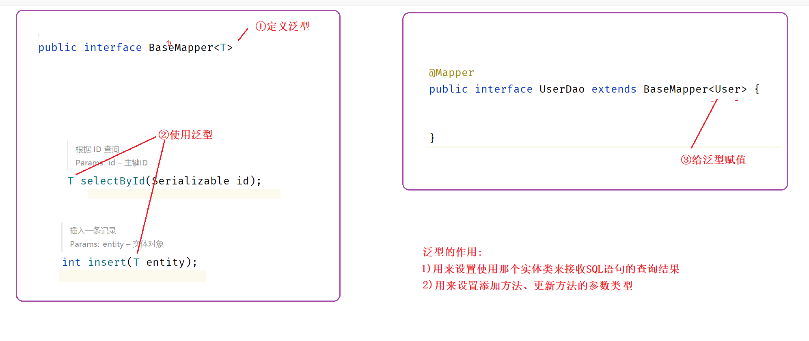
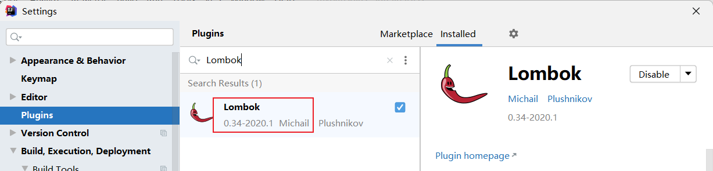
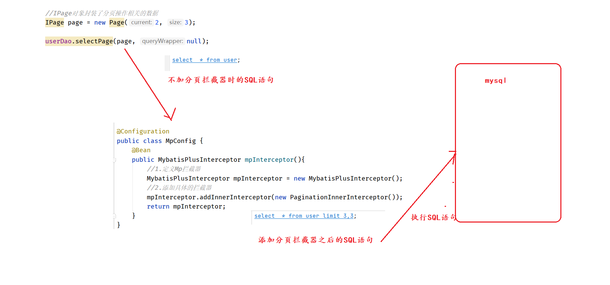
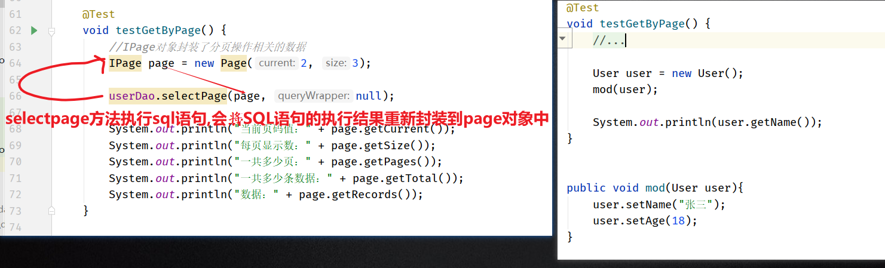
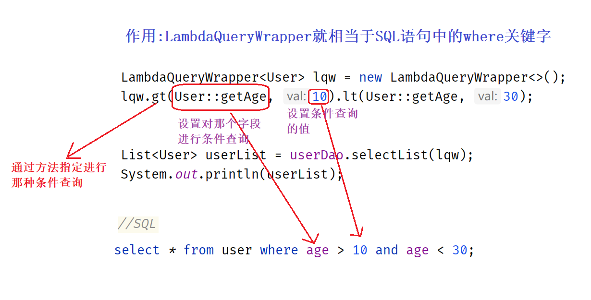
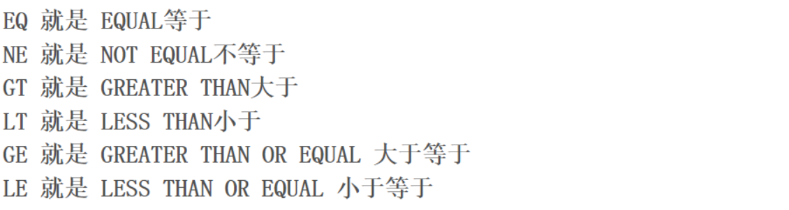
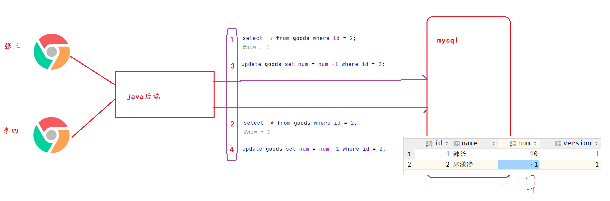
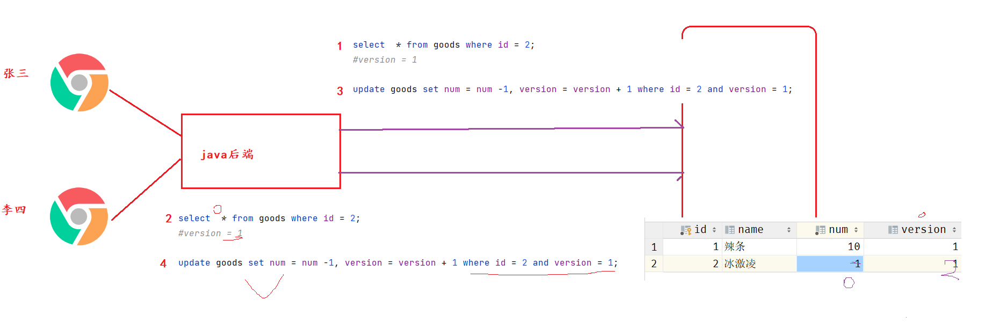
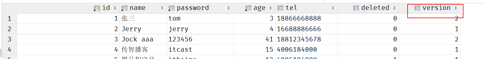

# 1 入门案例

## 1.1)mybatisPlus的口号

```
为了简化mybatis开发而生
```

## 1.2)开发步骤

①导包

```xml
<dependencies>

    <dependency>
        <groupId>com.baomidou</groupId>
        <artifactId>mybatis-plus-boot-starter</artifactId>
        <version>3.4.1</version>
    </dependency>

    <dependency>
        <groupId>org.springframework.boot</groupId>
        <artifactId>spring-boot-starter</artifactId>
    </dependency>

    <dependency>
        <groupId>com.alibaba</groupId>
        <artifactId>druid</artifactId>
        <version>1.1.16</version>
    </dependency>

    <dependency>
        <groupId>mysql</groupId>
        <artifactId>mysql-connector-java</artifactId>
        <scope>runtime</scope>
    </dependency>

    <dependency>
        <groupId>org.springframework.boot</groupId>
        <artifactId>spring-boot-starter-test</artifactId>
        <scope>test</scope>
    </dependency>

    <dependency>
        <groupId>org.projectlombok</groupId>
        <artifactId>lombok</artifactId>
        <version>1.18.12</version>
    </dependency>

</dependencies>
```

②配置数据库连接

```json
spring:
  datasource:
    type: com.alibaba.druid.pool.DruidDataSource
    driver-class-name: com.mysql.cj.jdbc.Driver
    url: jdbc:mysql://localhost:3306/mybatisplus_db?serverTimezone=UTC
    username: root
    password: root
```

③编写dao接口

```java
@Mapper
public interface UserDao extends BaseMapper<User> {
    
}
```

## 1.3)常见疑问

继承BaseMapper接口时,泛型有啥用

|  |
| ------------------------------------------------------------ |


# 2 MP的标准的CRUD

## 2.1)代码实现

```java
@SpringBootTest
class Mybatisplus01QuickstartApplicationTests {

    @Autowired
    private UserDao userDao;


    @Test
    void testSave(){
        User user = new User();
        user.setName("黑马程序员");
        user.setPassword("itheima");
        user.setAge(12);
        user.setTel("4006184000");
        userDao.insert(user);
    }

    @Test
    void testDelete(){
        userDao.deleteById(1401856123725713409L);
    }

    @Test
    void testUpdate(){
        User user = new User();
        user.setId(1L);
        user.setName("Tom888");
        user.setPassword("tom888");
        userDao.updateById(user);
    }

    @Test
    void testGetById(){
        User user = userDao.selectById(2L);
        System.out.println(user);
    }

    @Test
    void testGetAll() {
        List<User> userList = userDao.selectList(null);
        System.out.println(userList);
    }

}
```

## 2.2)常见疑问

①mybatisPlus底层是怎么操作数据库的

```
本质其实还是执行的SQL语句, 底层会自动帮我们拼接需要执行的SQL
```

②mybatisPlus怎么知道操作那张表,那些字段?

```
默认情况下 
类名首字母小写就是表名
类中的成员变量名就是表中的字段名
```


# 3 Lombok

## 3.1)开发步骤

2.1)导包

```xml
<dependency>
    <groupId>org.projectlombok</groupId>
    <artifactId>lombok</artifactId>
    <version>1.18.12</version>
</dependency>
```

2.2)使用注解

```java
@Data                   //会自动帮我们生成 get、set、toString、hashCode、equlas
@AllArgsConstructor     //自动生成全参构造
@NoArgsConstructor      //自动生成无参构造    
                        //注意: 使用@AllArgsConstructor时,一定也要使用@NoArgsConstructor 
public class User {
    private Long id;
    private String name;
    private String password;
    private Integer age;
    private String tel;
}
```

```java
//@Slf4j  自动的帮我们在当前类中生成一个Logger对象,这个对象的变量名是log
@Slf4j
@Service
public class UserServiceImpl implements UserService {

    //private Logger logger = LoggerFactory.getLogger(UserServiceImpl.class);

    @Autowired
    private UserDao userDao;

    public List<User> selectAll() {
        log.info("info.....");

        return userDao.selectList(null);
    }

}
```

## 3.2)常见疑问

1)lombok什么时候帮我们生成的get,set等方法?

```
将java文件编译成class文件时,会生成这些方法!
```

2)必须安装Lombok插件

```
插件的作用: 告诉idea工具, 我们现在是使用的注解开发的实体类
```




# 4 MP的分页查询

## 4.1)开发步骤

①添加分页拦截器

```java
@Configuration
public class MpConfig {
    @Bean
    public MybatisPlusInterceptor mpInterceptor() {
        //1.定义Mp拦截器
        MybatisPlusInterceptor mpInterceptor = new MybatisPlusInterceptor();
        //2.添加具体的拦截器
        mpInterceptor.addInnerInterceptor(new PaginationInnerInterceptor());
        return mpInterceptor;
    }
}
```

②使用

```java
@Test
void testGetByPage() {
    //IPage对象封装了分页操作相关的数据
    IPage page = new Page(2, 3);

    userDao.selectPage(page, null);
	
    System.out.println("一共多少条数据：" + page.getTotal());
    System.out.println("数据：" + page.getRecords());
}
```

## 4.2)常见疑问

①拦截器的作用

|  |
| ------------------------------------------- |

②MpConfig必须在启动类的子包下面?

```
因为启动类默认扫描子包下面的类
```

③为啥没用返回值接收



④开启日志

```yaml
# 开启mp的日志（输出到控制台）
mybatis-plus:
  configuration:
    log-impl: org.apache.ibatis.logging.stdout.StdOutImpl
```


# 5 MP的条件查询

## 5.1)lambda表达式

```js
//把fun这个函数做为参数,传递给setInterval
<script>
    function fun() {
        console.log(666)
    }

    //每隔一秒,就执行一次fun函数
    setInterval(fun, 1000);
</script>
```

```java
//需求: 遍历打印集合中的每一元素
@Test
public void test1() {
    List<Integer> list = Arrays.asList(1, 3, 5, 7, 9);

    //jdk8以前
    for (Integer integer : list) {
        System.out.println(integer);
    }

    //jdk8
    list.stream().forEach(integer -> { System.out.println(integer);});
    list.stream().forEach(integer -> { String.valueOf(integer);});
    
    //list.stream().forEach(integer -> { });


    //String.valueOf();    .  代表执行这个方法
    //String::valueOf      :: 表示将方法本身做为参数传递
    list.stream().forEach(System.out::println);
    list.stream().forEach(String::valueOf);
}
```

```java
//User::getAge 是将getAge方法本身做为参数传递给MP,  MP拿到getAge方法后会根据这个方法获取对应的成员变量名称
LambdaQueryWrapper<User> lqw = new LambdaQueryWrapper<>();
lqw.lt(User::getAge, 10);
List<User> userList3 = userDao.selectList(lqw);
System.out.println(userList3);
```


## 5.2)条件查询的三种方式

1)方式一:使用QueryWrapper按条件查询

```java
QueryWrapper qw1 = new QueryWrapper();
qw1.lt("age",18);
List<User> userList1 = userDao.selectList(qw1);
System.out.println(userList1);
```

2)方式二:使用QueryWrapper的lambda格式按条件查询

```java
QueryWrapper<User> qw2 = new QueryWrapper<User>();
qw2.lambda().lt(User::getAge, 10);
List<User> userList2 = userDao.selectList(qw2);
System.out.println(userList2);
```

3)方式三:使用LambdaQueryWrapper按条件查询 【强烈推荐】

```java
LambdaQueryWrapper<User> lqw = new LambdaQueryWrapper<>();

//并且关系：10到30岁之间
//lqw.lt(User::getAge, 30).gt(User::getAge, 10);

//或者关系：小于10岁或者大于30岁
lqw.lt(User::getAge, 10).or().gt(User::getAge, 30);

List<User> userList = userDao.selectList(lqw);
System.out.println(userList);
```

4)LambdaQueryWrapper解析

```
1)作用: LambdaQueryWrapper就相当于SQL语句中的where关键字,使用LambdaQueryWrapper可以拼接where查询条件
2)好处: 相比于QueryWrapper,LambdaQueryWrapper可以使用get方法做为参数,不用担心参数名写错了!
```

|  |
| ------------------------------------------------------------ |

## 5.3)gt lt记不住怎么办?

| 直接百度查 |
| ------------------------------------------------------------ |

## 5.4)条件查询null值判定

```java
//模拟页面传递过来的查询数据
UserQuery uq = new UserQuery();
uq.setAge(10);
uq.setAge2(30);

LambdaQueryWrapper<User> lqw = new LambdaQueryWrapper<User>();
//先判定第一个参数是否为true，如果为true才会拼接当前条件

lqw.gt(null != uq.getAge(), User::getAge, uq.getAge())
   .lt(null != uq.getAge2(), User::getAge, uq.getAge2());

List<User> userList = userDao.selectList(lqw);
System.out.println(userList);
```

```ABAP
满足条件才会拼接  栗子: gt条件不满足的话SQL语句就是   select * from user where age < 30
```


# 6 指定查询字段

6.1)SQL语句回顾

```sql
--  查询所有字段
select id, name, password, age, tel from user;

-- 查询指定字段
select id,name,age from user;


-- 通过tel分组查询,统计tel相同的数量
select tel,count(*) from user group by tel;
```

6.2)使用LambdaQueryWrapper指定需要查询的字段

```java
LambdaQueryWrapper<User> lqw = new LambdaQueryWrapper<User>();
lqw.select(User::getId,User::getName,User::getAge);

List<User> userList = userDao.selectList(lqw);
System.out.println(userList);
```

6.3)使用QueryWrapper指定函数查询

```java
QueryWrapper<User> lqw = new QueryWrapper<User>();
lqw.select("count(*) as count, tel");
lqw.groupBy("tel");

List<Map<String, Object>> userList = userDao.selectMaps(lqw);
System.out.println(userList);
```


# 7 其他查询条件

7.1)eq    等同于=  

```java
LambdaQueryWrapper<User> lqw = new LambdaQueryWrapper<User>();
lqw.eq(User::getName,"Jerry").eq(User::getPassword,"jerry");
 
//SQL: select * from user where name = 'Jerry' and password = 'jerry';
User loginUser = userDao.selectOne(lqw);
System.out.println(loginUser);
```

7.2)范围查询 between

```java
LambdaQueryWrapper<User> lqw = new LambdaQueryWrapper<User>();
lqw.between(User::getAge,10,30);

//SQL: select * from user where age between 10 and 30;
List<User> userList = userDao.selectList(lqw);
System.out.println(userList);
```

7.3)模糊匹配 like

```java
//lqw.like(User::getName, "J");       like  '%J%' 
//lqw.likeRight(User::getName, "J");  like  'J%'
//lqw.likeLeft(User::getName, "J");   like  '%J'

LambdaQueryWrapper<User> lqw = new LambdaQueryWrapper<User>();
lqw.likeLeft(User::getName,"J");

List<User> userList = userDao.selectList(lqw);
System.out.println(userList);
```


# 8 映射匹配兼容性

8.1)代码

```java
@Data
@TableName("tbl_user")
public class User {

    private Long id;

    private String name;

    @TableField(value = "pwd", select = false)
    private String password;

    private Integer age;

    private String tel;

    @TableField(exist = false)
    private Integer online;
    
}
```

8.2)@TableName注解 

```
如果实体类的类名和表名不一致了使用@TableName("tbl_user")注解指定表名
```

8.3)@TableField注解

```
①如果属性名和表字段名不一致了使用@TableName的value属性指定字段名 栗子:@TableName("pwd")
②@TableField的exist属性等于false,表示数据库表中不存在这个字段
③@TableField的select属性等于false,表示查询时不查询这个字段的数据
```

 8.4)统一指定表名前缀

```yaml
mybatis-plus:
  global-config:
    db-config:
      table-prefix: tbl_
```

8.5)全局配置和@TableName注解都存在时,那个生效?

```
@TableName注解生效
```


# 9 id生成策略

1)id策略解析

```java
/**
* 雪花算法
* 1) 添加数据时没有手动的设置id才生效
* 2) 表中的主键是字符串类型, 会自动生成一个字符串填充, 表中的主键是数字类型, 会自动生成一个数字填充
* 3) 代码中不需要做任何配置, 默认就是使用的雪花算法
*/

@TableId(type = ASSIGN_ID)
private Long id;
```

2)统一指定所有id的策略 (yml配置文件中)

```yaml
mybatis-plus:
  global-config:
    db-config:
      id-type: assign_id
```

3)全局配置和@TableId注解都存在时,那个生效?

```java
@TableId注解生效
```


# 10 多数据操作

1)删除指定多条数据

```java
List<Long> list1 = new ArrayList<>();
list1.add(1402551342481838081L);
list1.add(1402553134049501186L);
list1.add(1402553619611430913L);

//SQL: delete from user where id in (1402551342481838081,1402553134049501186,1402553619611430913);
userDao.deleteBatchIds(list1);
```

2)查询指定多条数据

```java
List<Long> list2 = new ArrayList<>();
list2.add(1L);
list2.add(3L);
list2.add(4L);

//SQL: select * from user where id in (1,3,4);
userDao.selectBatchIds(list2);
```


# 11 逻辑删除

1)方式一:  @TableLogic

```java
@TableLogic(value = "0" ,delval = "1")
private Integer deleted;
```

2)方式二: yaml文件中全局配置

```yaml
mybatis-plus:
  global-config:
    db-config:
      # 逻辑删除字段名
      logic-delete-field: deleted
      # 逻辑删除字面值：未删除为0
      logic-not-delete-value: 0
      # 逻辑删除字面值：删除为1
      logic-delete-value: 1
```

3)解析

```
①指定逻辑删除后,调用delete相关的方法底层其实是执行的更新的sql语句
②指定逻辑删除后,所有MP的查询语句只能查询出没有逻辑删除的信息.  where deleted = 0; 
```

4)如果想要查询逻辑删除字段是删除状态的数据怎么办?

```
在dao接口中手写的SQL语句, MP并不会对这些SQL语句进行增强
```

5)全局配置和@TableLogic都存在时,那个生效

```
@TableLogic注解生效
```


# 12 乐观锁

## 12.1)问题分析

|  |
| ------------------------------------------------------------ |

|  |
| ------------------------------------------------------------ |

## 12.2)开发步骤

①添加乐观锁拦截器

```java
@Configuration
public class MpConfig {
    @Bean
    public MybatisPlusInterceptor mpInterceptor() {
        //1.定义Mp拦截器
        MybatisPlusInterceptor mpInterceptor = new MybatisPlusInterceptor();
        //2.添加具体的拦截器
        mpInterceptor.addInnerInterceptor(new PaginationInnerInterceptor());
        //3.添加乐观锁拦截器
        mpInterceptor.addInnerInterceptor(new OptimisticLockerInnerInterceptor());
        return mpInterceptor;
    }
}

```

②数据库增加version字段



③成员变量上面添加@Version注解

```java
@Version
private Integer version;
```

④先执行查询再执行修改  (注意!!! , 注意!!!, 注意!!!)

```java
@Test
void testUpdate() {

    //1.先通过要修改的数据id将当前数据查询出来
    User user = userDao.selectById(3L);     //version=3

    User user2 = userDao.selectById(3L);    //version=3

    user2.setName("Jock aaa");
    userDao.updateById(user2);              //version=>4

    user.setName("Jock bbb");
    userDao.updateById(user);               //verion=3?条件还成立吗?
    
}
```
