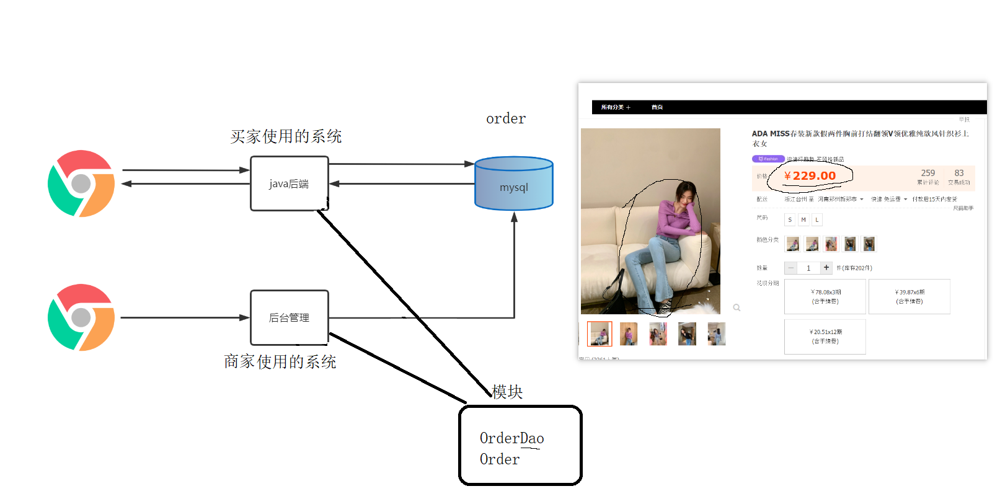

# 1 回顾

1)maven的作用

```
①管理jar包,自动下载jar包
②一键编译、一键打包
```

2)三维坐标

```xml
<dependency>
    <groupId>org.springframework</groupId>
    <artifactId>spring-webmvc</artifactId>
    <version>5.2.10.RELEASE</version>
</dependency>


groupId:     公司的域名(那个公司提供的jar包)
artifactId:  项目名称
version:     版本号
  x.x.x.后缀

  1)大版本更新
  2)小版本更新
  3)bug修复
  4)RELEASE 正式版本 、 SNAPSHOT 开发版本
```

# 2 分模块开发

## 2.1)分模块开发的意义

```
可以让重复的代码只开发一份, 方便维护管理
```

|  |
| ------------------------------------------------------------ |

## 2.2)分模块开发与设计

①必须先maven install

```
因为maven_02_ssm模块需要使用本地仓库中的dao和pojo两个模块的jar包
```

②分模块开发的本质

```
1)先将公共模块打成jar包
2)02_ssm模块就可以导入公共模块的jar包来使用
```

|  |
| ------------------------------------------------------------ |


# 3 依赖

## 3.1)简介

①什么是依赖

```
就是项目中引入的jar包
```

②mave Helper插件

|  |
| ------------------------------------------------------------ |

③依赖的传递

```
直接依赖:  在当前项目中通过三维坐标配置的jar包
间接依赖:  被直接依赖,依赖的资源
```

## 3.2)优先级

①血缘关系近的优先

|  |
| ------------------------------------------------------------ |

②在直接依赖中,配置靠下的优先

|  |
| ------------------------------------------------------------ |

③在间接依赖中,对应直接依赖配置靠上的优先

|  |
| ------------------------------------------------------------ |


## 3.3)调整jar包版本的手段

1)都有哪些手段?

```
①利用优先级
②可选依赖
③排除依赖
```

2)可选依赖

```xml
<dependency>
    <groupId>com.itheima</groupId>
    <artifactId>maven_03_pojo</artifactId>
    <version>1.0-SNAPSHOT</version>
    <optional>false</optional>
</dependency>
```

3)排除依赖

```xml
<dependency>
    <groupId>com.itheima</groupId>
    <artifactId>maven_04_dao</artifactId>
    <version>1.0-SNAPSHOT</version>
    <exclusions>
        <exclusion>
            <groupId>log4j</groupId>
            <artifactId>log4j</artifactId>
        </exclusion>
        <exclusion>
            <groupId>org.mybatis</groupId>
            <artifactId>mybatis</artifactId>
        </exclusion>
    </exclusions>
</dependency>
```

4)解析

|  |
| -------------------------------------------------- |


# 4 聚合

1)如何建立聚合关系

```xml
<!--  在父工程中 设置管理的模块名称-->
<modules>
    <module>maven_02_ssm</module>
    <module>maven_03_pojo</module>
    <module>maven_04_dao</module>
</modules>
```

2)聚合有啥用

```
可以使多个模块的代码 一键编译、打包...
```

3)注意事项

```ABAP
①maven父工程的打包方式设置成pom,代表这是一个父工程, 用来管理其他maven项目
②一键编译打包,无论顺序怎么换,maven都能自动识别出来先打包那个,后打包那个
```


# 5 继承

1)如何建立继承关系

```xml
<!-- 在子工程中 设置-->
<parent>
    <groupId>com.itheima</groupId>
    <artifactId>maven_01_parent</artifactId>
    <version>1.0-SNAPSHOT</version>
    <!-- <relativePath>../../maven_01_parent/pom.xml</relativePath>
              没用直接干掉
        -->
</parent>
```

2)继承有啥用

```
通过继承: 可以统一管理所有模块中的jar包

1)家产:    直接在<dependencies>下面的jar包,子模块都可以直接使用.         
  应用场景: 配置所以模块的公共jar包
  
2)家规:    定义在<dependencyManagement>下面的jar包,子模块不能直接使用
  应用场景: 约定jar包的版本
```

3)注意事项

```ABAP
1)<relativePath>直接干掉就行就行不需要配置
2)子模块和maven父工程的g、v一样的情况下,子模块可以省略不写

3)父工程与子模块之间是约束关系, 在子模块中使用<parent>来定义子父关系
4)子模块与子模块之间是依赖关系, 使用<dependency>标签来建立依赖关系
```


# 6 属性

1)maven.compiler.source、maven.compiler.target的作用

```xml
<properties>
    <project.build.sourceEncoding>UTF-8</project.build.sourceEncoding>
    <maven.compiler.source>8</maven.compiler.source>
    <maven.compiler.target>8</maven.compiler.target>
</properties>
<!--  
这里定义的是编译应该使用那个版本的语法  8 
jdk9  、 jdk10   可以用,  jdk的语法是向下兼容的
-->
```

2)统一定义版本号

|  |
| ------------------------------------------------------------ |

|  |
| ------------------------------------------------------------ |


# 7 使用maven打war包

7.1)maven打war包时没有web.xml文件报错信息

|  |
| ------------------------------------------------------------ |

7.2)解决方案

方式一:

|  |
| ------------------------------------------------------------ |

方式二:  

```xml
<plugin>
    <groupId>org.apache.maven.plugins</groupId>
    <artifactId>maven-war-plugin</artifactId>
    <version>3.2.3</version>
    <configuration>
        <failOnMissingWebXml>false</failOnMissingWebXml>
    </configuration>
</plugin>
```


# 8 重点总结

```
分模块:  可以让重复代码只开发一份,方便维护管理
聚合  :  可以一键编译、打包..所有子模块
继承  :  统一管理项目中的jar包
属性  :  可以将jar包的版本号进行统一的配置管理
```


# 9 跳过测试

1)跳过所有测试(常用)


2)命令行跳过所有测试(了解)

```
mvn install –D skipTests
```

3)跳过指定测试(了解)

```xml
<plugins>
    <plugin>
        <artifactId>maven-surefire-plugin</artifactId>
        <version>2.12.4</version>
        <configuration>
            <skipTests>false</skipTests>
            <!--排除掉不参与测试的内容-->
            <excludes>
                <exclude>**/BookServiceTest.java</exclude>
            </excludes>
        </configuration>
    </plugin>
</plugins>
```


# 10 私服(理解即可)

## 10.1)简介

```
私服的作用:
1)中央仓库是国外的服务,网络访问不稳定, 所以阿里云搭建了一个私服可以让全国程序员直接从阿里私服下载jar包
2)公司管理严格,不能访问外网, 所以公司内部搭建一个私服可以让公司员工统一从私服下载jar包
3)公司有公共模块的开发人员,需要共享开发的jar包, 所以公司内部搭建一个私服可以让员工快速共享公共模块代码的jar包
```

|  |
| --------------------------------------------- |


## 10.2)安装

```
解压: 直接解压latest-win64.zip即可.  
启动: cmd窗口进入 xx\nexus-3.30.1-01\bin , 然后输入" nexus.exe /run nexus "命令
```

```ABAP
注意1: 不要有中文目录
注意2: 有两个文件夹最好放在一起
注意3: 不是直接双击nexus.exe
```


访问路径

```
http://localhost:8081
```

第一次登录会提示密码位置

|  |
| ------------------------------------------------------------ |

启动匿名访问

|  |
| ------------------------------------------------------------ |


## 10.3)仓库分类

|  |
| ------------------------------------------------------------ |


## 10.4)从私服中下载依赖

【第一步】在maven的settings.xml中\<mirrors>标签中配置，此时就需要注释掉aliyun的配置。

```xml
<mirror>
    <id>maven-public</id>
    <mirrorOf>*</mirrorOf>
    <url>http://localhost:8081/repository/maven-public/</url>
</mirror>
```

【第二步】在nexus中设置允许匿名下载，如果不允许将不会从私服中下载依赖


【第三步】如果私服中没有对应的jar，会去中央仓库下载，速度很慢。可以配置让私服去阿里云中下载依赖。

```
阿里maven仓库地址:  http://maven.aliyun.com/nexus/content/groups/public/
```

|  |
| ------------------------------------------------------------ |


## 10.5)上传依赖到私服中

【第一步】配置本地仓库访问私服的权限（在maven的settings.xml的servers标签中配置）

```xml
<server>
  <!--id任意-->
  <id>heima-nexus</id>
  <username>admin</username>
  <password>admin</password><!--填写自己nexus设定的登录秘密-->
</server>
```

【第二步】配置当前项目访问私服上传资源的保存位置（项目的pom.xml文件中配置）

```xml
<distributionManagement>
    <repository>
      	<!--和maven/settings.xml中server中的id一致，表示使用该id对应的用户名和密码-->
        <id>heima-nexus</id>
      	<!--如果jar的版本是release版本，那么就上传到这个仓库，根据自己情况修改-->
        <url>http://localhost:8081/repository/maven-releases/</url>
    </repository>
    <snapshotRepository>
      	<!--和maven/settings.xml中server中的id一致，表示使用该id对应的用户名和密码-->
        <id>heima-nexus</id>
      	<!--如果jar的版本是snapshot版本，那么就上传到这个仓库，根据自己情况修改-->
        <url>http://localhost:8081/repository/maven-snapshots/</url>
    </snapshotRepository>
</distributionManagement>
```

【第三步】发布资源到私服命令

```
mvn deploy
```

配置详解

|  |
| ------------------------------------------------------------ |


## 10.6)注意事项

```
【1】能不能上传到阿里云的私服/中央仓库么? 不能
【2】测试时,千万千万要复制一份setting.xml文件去玩,仅仅在测试项目改成新的setting.xml,其他项目不要动!
```
