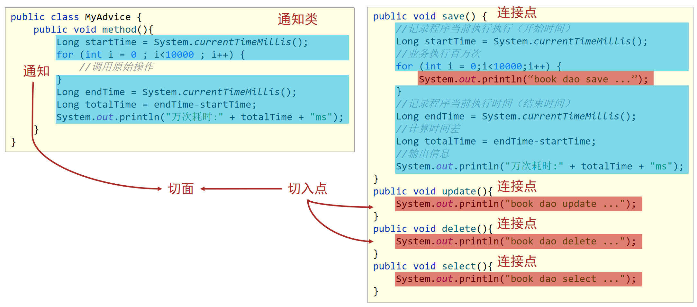

# 1 AOP简介

①动态代理

```
动态代理: 其实就是一个类(Proxy),使用这个类可以在不修改源码的基础上对功能进行增强
```

|  |
| ------------------------------------------------------------ |

②面向切面

```
面向切面(AOP): 底层就是使用动态代理的方式实现的
面向切面思想:   在不修改源码的基础上对功能进行统一增强
```

③其他概念

```
连接点:  所有的方法(可以被增强的方法,在spring中所有的方法都可以被增强 )
切入点:  已经被增强的方法
通知:    增强的代码
通知类:  就是工具类
切面:    用来绑定切入点和通知的关系
```

|  |
| -------------------------------- |


# 2AOP入门案例

## 2.1)开发步骤

①导包

```xml
<dependency>
    <groupId>org.springframework</groupId>
    <artifactId>spring-context</artifactId>
    <version>5.2.10.RELEASE</version>
</dependency>
<dependency>
    <groupId>org.aspectj</groupId>
    <artifactId>aspectjweaver</artifactId>
    <version>1.9.4</version>
</dependency>
```

②在config配置类上面添加注解

```java
@Configuration
@ComponentScan("com.itheima")
@EnableAspectJAutoProxy  //开启注解开发AOP功能
public class SpringConfig {
}
```

③编写通知类(工具类)

```java
//通知类必须配置成Spring管理的bean
@Component
//设置当前类为通知类
@Aspect
public class MyAdvice {
    
    //设置切入点，要求配置在方法上方
    @Pointcut("execution(void com.itheima.dao.BookDao.*())")
    private void pt() {
    }

    //设置在切入点pt()的前面运行当前操作（前置通知）
    @Before("pt()")
    public void method() {
        System.out.println(System.currentTimeMillis());
    }
    
}
```

## 2.2)常见疑问

①为什么要导入aspectJ包

```
spring    对AOP的思想进行了实现
aspectJ   对AOP的思想也进行了实现
aspectJ对AOP的实现比spring好,  spring官方推荐使用aspectJ
```

②@EnableAspectJAutoProxy的作用

|  |
| ------------------------------------------------------------ |

③什么是切面

|  |
| ------------------------------------------------------------ |

④切入点只能指定对一个方法进行增强么?

```javascript
//不是的, 可以使用通配符
@Pointcut("execution(void com.itheima.dao.BookDao.*())")
```

## 2.3)流程解析

|  |
| -------------------------------------- |


# 3AOP详解

## 3.1)切入点表达式

```java
1)严格匹配
@Pointcut("execution(void com.itheima.dao.BookDao.update())")

2)使用*进行匹配, 一个*号代表匹配单个 (一般使用在 返回值、类名、方法名、包名)
  还可以匹配以xx开头、以xx结尾   
@Pointcut("execution(void com.itheima.dao.*.add*())")   
    
3)使用..进行匹配,可以匹配0个、1个、多个都可以(一般使用在 参数 上)
@Pointcut("execution(void com.itheima.dao.BookDao.*(..))")
    
4)常见格式  //dao包下面的所有类、的所有方法 
@Pointcut("execution(* com.itheima.dao.*.*(..))") 
```


## 3.2)通知类型

①前置、后置、异常、返回后(了解)

|  |
| ------------------------------------------------------------ |

②环绕通知(也叫万能通知)

```java
//@Around：环绕通知，在原始方法运行的前后执行
@Around("pt()")
public Object around(ProceedingJoinPoint pjp) throws Throwable {
    Object ret = null;
    try {
        System.out.println("前置通知 ...");
        
        //表示对原始操作的调用
        ret = pjp.proceed();

        System.out.println("返回后通知...");
    } catch (Throwable e) {
        System.out.println("异常通知...");
    }

    System.out.println("后置通知 ...");
    return ret;
}
```

## 3.3)获取原始方法数据

```
1)JoinPoint和ProceedingJoinPoint的区别
  ①ProceedingJoinPoint形参只能在环绕通知中使用,其他类型的通知不能使用这个参数
  ②ProceedingJoinPoint形参可以调用原始方法执行,JoinPoint不能调用原始方法

2)参数:   所有的通知类型都可以获取原始方法的参数
3)返回值:  返回后通知和环绕通知可以获取到
4)异常:   异常通知和环绕通知可以获取到
```

```java
//@Before("pt()")
public void before(JoinPoint jp) {
    Object[] args = jp.getArgs();
    System.out.println(Arrays.toString(args));
    System.out.println("before advice ..." );
}

//@After("pt()")
public void after(JoinPoint jp) {
    Object[] args = jp.getArgs();
    System.out.println(Arrays.toString(args));
    System.out.println("after advice ...");
}

//设置返回后通知获取原始方法的返回值，要求returning属性值必须与方法形参名相同
//注意:JoinPoint必须配置成通知方法中的第一个参数，可用于获取原始方法调用的参数
//@AfterReturning(value = "pt()",returning = "ret")
public void afterReturning(JoinPoint jp,String ret) {
    System.out.println("afterReturning advice ..."+ret);
}

//设置抛出异常后通知获取原始方法运行时抛出的异常对象，要求throwing属性值必须与方法形参名相同
//@AfterThrowing(value = "pt()",throwing = "t")
public void afterThrowing(Throwable t) {
    System.out.println("afterThrowing advice ..."+t);
}

//ProceedingJoinPoint：专用于环绕通知，是JoinPoint子类，可以实现对原始方法的调用
@Around("pt()")
public Object around(ProceedingJoinPoint pjp) {
    Object[] args = pjp.getArgs();
    System.out.println(Arrays.toString(args));
    args[0] = 666;
    Object ret = null;
    try {
        ret = pjp.proceed(args);
    } catch (Throwable t) {
        t.printStackTrace();
    }
    return ret;
}
```


# 4AOP案例

## 4.1)案例一:  业务层执行效率

```java
@Component
@Aspect
public class ProjectAdvice {

    //匹配业务层的所有方法
    @Pointcut("execution(* com.itheima.service.*Service.*(..))")
    private void servicePt() {
    }

    //设置环绕通知，在原始操作的运行前后记录执行时间
    @Around("ProjectAdvice.servicePt()")
    public void runSpeed(ProceedingJoinPoint pjp) throws Throwable {
        //获取执行的签名对象
        Signature signature = pjp.getSignature();
        String className = signature.getDeclaringTypeName();
        String methodName = signature.getName();

        long start = System.currentTimeMillis();
        for (int i = 0; i < 10000; i++) {
            pjp.proceed();
        }
        long end = System.currentTimeMillis();
        System.out.println("万次执行" + className + "." + methodName + "---->" + (end - start) + "ms");
    }

}
```

```ABAP
ProceedingJoinPoint pjp形参: 

1)使用这个形参可以原始方法的全类名 String className = signature.getDeclaringTypeName();
2)使用这个形参可以原始方法的方法名 String methodName = signature.getName();
3)使用这个形参可以原始方法的参数  Object[] args = pjp.getArgs();
4)使用这个形参可以执行原始方法    Object  obj  =  pjp.proceed();
```


## 4.2)案例二:  百度网盘密码处理

|  |
| -------------------------------------------------------- |


# 5AOP总结

```
1)AOP思想:       在不修改源码的基础上对功能进行统一增强
2)开发步骤:       ①导包、②开启注解开发AOP功能、③编写通知类
3)切入点表达式:    忘了百度查
4)通知类型:       重点掌握环绕通知
5)增强方法的形参:  ProceedingJoinPoint的使用
```


# 6spring事务简介

①什么是事务

```
mysql事务:  mysql数据库给我们提供的一个功能
这个功能就是可以保证多条SQL语句 要么全部执行成功,要么全部执行失败
```

②什么是spring事务

```
spring事务: 就是对mysql事务的一个封装
```

③spring事务底层是使用AOP的思想实现的

|  |
| ------------------------------------------------------------ |


# 7spring事务入门案例

## 7.1)开发步骤

①开启事务功能

```java
@Configuration
@ComponentScan("com.itheima")
@PropertySource("classpath:jdbc.properties")
@Import({JdbcConfig.class,MybatisConfig.class})
//开启注解式事务驱动
@EnableTransactionManagement
public class SpringConfig {
}
```

②配置一个事务管理器

```java
//配置事务管理器，mybatis使用的是jdbc事务
@Bean
public PlatformTransactionManager transactionManager(DataSource dataSource){
    DataSourceTransactionManager tm = new DataSourceTransactionManager();
    tm.setDataSource(dataSource);
    return tm;
}
```

③在想要事务的方法上面添加注解

```java
public interface AccountService {
    /**
     * 转账操作
     * @param out 传出方
     * @param in 转入方
     * @param money 金额
     */
    //配置当前接口方法具有事务
    @Transactional
    public void transfer(String out,String in ,Double money);
 
}
```


## 7.2)常见疑问

①事务管理器是个什么东西?

|  |
| ------------------------------------------------------------ |

② @Transactional注解都是在service层的方法上面添加

|  |
| ------------------------------------------------------------ |


# 8spring事务的角色、属性、传播行为

## 8.1)角色

```
事务管理员: 外层的方法,叫事务管理员
事务协调员: 里层的方法,叫事务协调员
```

## 8.2)@Transactional注解的属性

```java
@Transactional(readOnly = true,timeout = -1,rollbackFor = IOException.class)

//1)readOnly = true  只读-设置成只读事务后,对应的方法不能对数据库进行修改的操作
//2)timeout  = 2     连接数据库的超时时间 单位秒,   默认-1 , 永远等待
//3)rollbackFor      指定回滚的异常,默认只回滚运行时异常
```

|  |
| ------------------------------------------------------------ |

## 8.3)事务的传播行为

①案例

|  |
| ------------------------------------------------------------ |

②总结

|  |
| ------------------------------------------------------------ |

