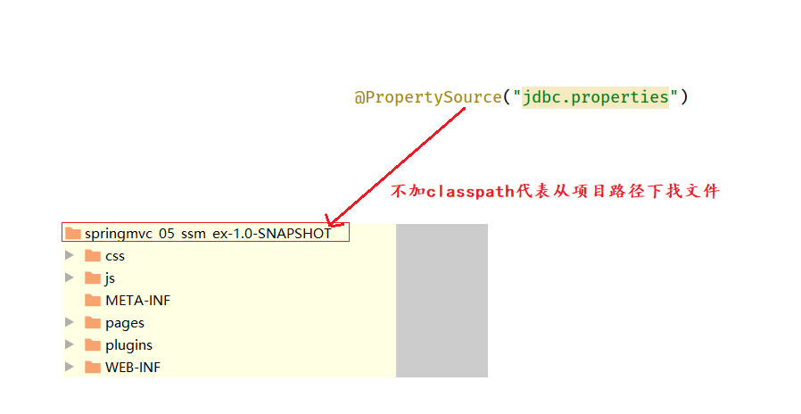

# 1 SSM整合

|  |
| -------------------------------------- |


# 2 表现层的返回值统一成Result

①数据定义的格式

```json
{
    "code":"20021",
    "msg": "错误提示..",
    "data": null
}
```

②这样写有什么好处

```
对后端开发人员来说没啥好处, 对前端人员来说非常友好
目的是方便前端人员的开发, 降低沟通成本
```

③code值的规则不是递增

```
一般前几位代表什么意思, 中间几位代表什么意思, 后几位代表什么意思.   栗子: 身份证号码
```

④开发步骤

1)定义一个Result类

```java
public class Result {
    //描述统一格式中的数据
    private Object data;
    //描述统一格式中的编码，用于区分操作，可以简化配置0或1表示成功失败
    private Integer code;
    //描述统一格式中的消息，可选属性
    private String msg;
    
    //.....
}
```

2)定义一个Code类

```java
//状态码
public class Code {
    public static final Integer SAVE_OK = 20011;
    public static final Integer DELETE_OK = 20021;
    public static final Integer UPDATE_OK = 20031;
    public static final Integer GET_OK = 20041;

    public static final Integer SAVE_ERR = 20010;
    public static final Integer DELETE_ERR = 20020;
    public static final Integer UPDATE_ERR = 20030;
    public static final Integer GET_ERR = 20040;
}

```

3)将controller层方法的返回值都改造成Result

```java
@GetMapping
public Result getAll() {
    List<Book> bookList = bookService.getAll();
    
    
    Integer code = bookList != null ? Code.GET_OK : Code.GET_ERR;
    
    String msg = bookList != null ? "" : "数据查询失败，请重试！";
    
    return new Result(code,bookList,msg);
}
```


# 3 统一异常处理

## 3.1)原理分析

①统一异常处理原理

|  |
| ------------------------------------------------------------ |

②一个@ExceptionHandler相当于一个catch块

|  |
| ------------------------------------------------------------ |


## 3.2)开发步骤(自定义异常)

①自定义一个异常类

```java
//1)定义一个见名知意的类
//2)继承RuntimeException
//3)提供构造方法

public class BusinessException extends RuntimeException{
    private Integer code;

    public Integer getCode() {
        return code;
    }

    public void setCode(Integer code) {
        this.code = code;
    }

    public BusinessException(Integer code, String message) {
        super(message);   //调用父类构造-给detailMessage成员变量赋值
        this.code = code;
    }

    public BusinessException(Integer code, String message, Throwable cause) {
        super(message, cause);
        this.code = code;
    }

}
```

②用自定义的异常类抛出异常

```java
public Book getById(Integer id) {
    //模拟业务异常，包装成自定义异常
    if(id < 0){
        throw new BusinessException(Code.BUSINESS_ERR,"请不要使用你的技术挑战我的耐性!");
    }

    return bookDao.getById(id);
}
```

③统一捕获异常

```java
@ControllerAdvice
@ResponseBody
public class ProjectExceptionAdvice {


    @ExceptionHandler(BusinessException.class)
    public Result doBusinessException(BusinessException ex){
        return new Result(ex.getCode(),null,ex.getMessage());
    }

    //除了自定义的异常处理器，保留对Exception类型的异常处理，用于处理非预期的异常
    @ExceptionHandler(Exception.class)
    public Result doOtherException(Exception ex){
        return new Result(Code.SYSTEM_UNKNOW_ERR,null,"系统繁忙，请稍后再试！");
    }

}
```


# 4 前后端联调

## 4.1) 列表查询

①前后端交互流程

|  |
| ------------------------------------------------------------ |

②res.data.data, 怎么这么多data?

|  |
| ------------------------------------------------------------ |


## 4.2) 添加功能

①打开添加窗口

|  |
| ------------------------------------------------------------ |

②点击确认添加按钮

|  |
| ------------------------------------------------------------ |

## 4.3) 修改功能

①数据回显

|  |
| ------------------------------------------------------------ |

②点击确认修改按钮

|  |
| ------------------------------------------------------------ |

## 4.4)删除功能

|  |
| ------------------------------------------------------------ |


# 5 拦截器

## 5.1) 简介

①过滤器

|  |
| ------------------------------------------------------------ |

②过滤器和拦截器对比

```java
package com.itheima;


import javax.servlet.*;
import java.io.IOException;

/**
 * 过滤器
 * 1)作用: 统一编码格式、登录权限校验
 * 2)缺点: 不能和spring整合使用,不能从IOC容器中取对象(过滤器的执行时机比IOC容器初始化还早)
 * 3)优点: 只有是web项目,都可以使用
 * 
 * 
 * 拦截器
 * 1)作用: 和过滤器一模一样
 * 2)优点: 可以和spring整合使用,可以从IOC容器中取对象(拦截器是springmvc内置的一个功能)
 * 3)缺点: 只能在springmvc的项目中使用
 */

//@Webfilter
public class MyFilter implements Filter {

    //@Autowired
    //private BookController bookController;

    @Override
    public void init(FilterConfig filterConfig) throws ServletException {

    }

    @Override
    public void doFilter(ServletRequest servletRequest, ServletResponse servletResponse, FilterChain filterChain) throws IOException, ServletException {
        servletRequest.setCharacterEncoding("utf-8");
        System.out.println("前置拦截");

        filterChain.doFilter(servletRequest, servletResponse);  //放行

        System.out.println("后置拦截");
    }

    @Override
    public void destroy() {

    }
    
}
```


## 5.2) 开发步骤

①定义拦截器(拦截之后我们要干什么事情)

```java
@Component
//定义拦截器类，实现HandlerInterceptor接口
//注意当前类必须受Spring容器控制
public class ProjectInterceptor implements HandlerInterceptor {
    
    @Override
    //原始方法调用前执行的内容
    //返回值类型可以拦截控制的执行，true放行，false终止
    public boolean preHandle(HttpServletRequest request, HttpServletResponse response, Object handler) throws Exception {
        
        String contentType = request.getHeader("Content-Type");
        HandlerMethod hm = (HandlerMethod)handler;
        System.out.println("preHandle..."+contentType);
        
        
        return true;
    }


}
```

②定义拦截器配置类(配置那个路径需要拦截)

```java
@Configuration
public class SpringMvcSupport extends WebMvcConfigurationSupport {
    
    @Autowired
    private ProjectInterceptor projectInterceptor;

    @Override
    protected void addInterceptors(InterceptorRegistry registry) {
        //配置拦截器
        registry.addInterceptor(projectInterceptor).addPathPatterns("/books","/books/*");
    }
    
}
```

③加载拦截器配置类

```java
@Configuration
@ComponentScan({"com.itheima.controller","com.itheima.config"})
@EnableWebMvc
public class SpringMvcConfig {

}
```


## 5.3) 拦截器参数

1)request、response

```
request  :  处理请求的
response :  处理响应的
```

2)handler

```
栗子: http://localhost/books/1  ->  getById
请求路径对应方法的 注解、返回值类型、参数、方法本身等等
```

3)modelAndView

```
 过时了
```

4)Exception

```
异常   
栗子:如果现在拦截是是/books/1这请求,那这里封装的就是那个方法出现的异常?  getById方法出现的异常
```


## 5.4) 拦截器链配置

|  |
| ------------------------------------------------------------ |

|  |
| ------------------------------------------------------------ |

|  |
| ------------------------------------------------------------ |

```
postHandle:       只有对应的controller方法执行了,所有的拦截器都放行了postHandle才会执行
afterCompletion:  只有进入到了这个拦截器,而且对应的preHandle放行了才会执行
```


# 6 常见问题

1)加载properties文件时classpath不能丢

```java
//项目运行,运行的编译后的文件!
//classpath 代表编译路径的根路径, 编译路径的根路径指的是WEB-INF下面的classes
```

| 加classpath |
| ------------------------------------------------------------ |

| 不加classpath |
| ------------------------------------------------------------ |
