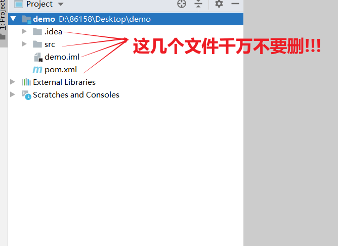

# 1 springboot简介

## 1.1)原生的SSM项目存在的问题

```
①配置繁琐
②导包繁琐
```

## 1.2)springboot的优点

```
为了简化SSM项目的搭建而生
```

## 1.3)idea创建springboot项目

|  |
| ------------------------------------------------------------ |

|  |
| ------------------------------------------------------------ |

## 1.4)注意事项

①文件不要多删了

```ABAP
如何创建成功之后,没有看到.idea文件夹和 *.iml文件 就不用管了
```

|  |
| ------------------------------------------------------------ |

②创建的controller包,必须是启动类的子包

|  |
| ------------------------------------------------------------ |

③jar包下载问题

```ABAP
如果pom文件爆红,但是代码能正常运行,说明jar包已经下载成功了,  重启idea即可解决pom文件爆红问题
```

|  |
| ------------------------------------------------------------ |

## 1.4)常见疑问

①spring-boot-maven-plugin插件的作用

```
打包是可以将项目依赖的jar包,一起打进入
```

②springboot项目到底是怎么启动项目的

```
内置了Tomacat, 本质还是使用tomcat启动项目
```

|  |
| ------------------------------------------------------------ |

③为什么controller包要放在启动类的子类位置

```
因为springboot项目启动时,默认扫描启动类所在的包,进行IOC初始化
```


# 2 如何启动boot项目的jar包

1)直接启动

```sh
#注意: 需要在jar的目录下打开cmd窗口
java -jar springboot_01-0.0.1-SNAPSHOT.jar
```

2)指定参数启动

```sh
java -jar springboot_01-0.0.1-SNAPSHOT.jar --server.port=88 --server.servlet.context-path=/spring
```


# 3 起步依赖

```
起步依赖(starter): 整理好的一套兼容性比较好的jar包,不会出现jar包版本冲突问题
注意:springboot并没有包含所有坐标,个别jar包还得我们自己手动导入
```

|  |
| ------------------------------------------------------------ |


# 4 切换web服务器

## 4.1)开发步骤

①移除tomcat的jar包

```xml
<dependency>
    <groupId>org.springframework.boot</groupId>
    <artifactId>spring-boot-starter-web</artifactId>
    <exclusions>
        <exclusion>
            <groupId>org.springframework.boot</groupId>
            <artifactId>spring-boot-starter-tomcat</artifactId>
        </exclusion>
    </exclusions>
</dependency>
```

②添加jetty的jar包

```xml
<dependency>
    <groupId>org.springframework.boot</groupId>
    <artifactId>spring-boot-starter-jetty</artifactId>
</dependency>
```

## 4.2)jetty是个啥

```
jetty和tomcat一样都是一个web服务器,比tomcat轻量一下,但同时功能也少一些
jetty:就是一个简化版的tomcat
```


# 5 配置文件

1)优先级

```sh
#优先级指的是三个配置文件中,有相同的配置时,我们使用的是那个!
properties  > yml  > yaml
```

2)springboot项目中配置文件名是固定的

```java
application*.properties  、 application*.yml  、 application*.yaml
```

3)思想:  约定大于配置

```
springboot开发人员认为
很多配置约定好比让程序员灵活配置更好,这种思想叫 "约定优于配置"
```

4)yml和yaml

```
yml和yaml是同一种类型的文件
```

5)yaml格式

|  |
| ------------------------------------------------------------ |


# 6 读取配置

①读取单个

```java
@RestController
@RequestMapping("/books")
public class BookController {

    //使用@Value读取单一属性数据
    @Value("${lesson}")
    private String lesson;
    
    @Value("${server.port}")
    private Integer port;
    
    @Value("${enterprise.subject[0]}")
    private String subject_00;

    @GetMapping("/{id}")
    public String getById(@PathVariable Integer id) {
        System.out.println(lesson);
        System.out.println(port);
         System.out.println(subject_00);

        return "hello , spring boot!";
    }

}
```

②读取所有

```java
@RestController
@RequestMapping("/books")
public class BookController {

    //使用Environment封装全配置数据
    @Autowired
    private Environment environment;

    @GetMapping("/{id}")
    public String getById(@PathVariable Integer id) {

        System.out.println(environment.getProperty("lesson"));
        System.out.println(environment.getProperty("server.port"));
        System.out.println(environment.getProperty("enterprise.age"));
        System.out.println(environment.getProperty("enterprise.subject[1]"));
        
        return "hello , spring boot!";
    }

}
```

③读取指定前缀的配置

```ABAP
@ConfigurationProperties(prefix = "enterprise")
//1)前缀必须是全小写,不能有大写、不能有特殊字符
//2)成员变量没有限制,大小写都可以
```

```java
//封装yaml对象格式数据必须先声明当前实体类受Spring管控
//使用@ConfigurationProperties注解定义当前实体类读取配置属性信息，通过prefix属性设置读取哪个数据
@Component
@ConfigurationProperties(prefix = "enterprise")
public class Enterprise {

    private String userName;
    private Integer age;
    private String tel;
    private String[] subject;

	//get、set方法省略了....
}
```

```java
@RestController
@RequestMapping("/books")
public class BookController {

    @Autowired
    private Enterprise enterprise;

    @GetMapping("/{id}")
    public String getById(@PathVariable Integer id) {
        System.out.println(enterprise);
        System.out.println(enterprise.getAge());
        return "hello , spring boot!";
    }

}
```


# 7 多环境开发

1)什么是多环境?

```
一般指的是 数据库的多环境
```

2)yml如何配置多环境

|  |
| ------------------------------------------------------------ |

3)使用多环境开发所有配置都必须配置多份么?

```
不是的，公共的配置在设置启用环境的地方配置一份即可
```

|  |
| ------------------------------------------------------------ |

4)启用环境的设置必须配置在最上面么?

```
不是的, 配置在什么地方都行, 底层是根据key来解析的,不是根据位置来解析
```

|  |
| ------------------------------------------------------------ |

5)properties如何配置多环境

```
1)使用多文件来配置多环境
2)在application.properties文件中设置启动的环境
```

|  |
| ------------------------------------------------------------ |


# 8 配置文件位置优先级

```
相同的配置(server.port),优先级如下(由高到底)
1)命令行直接指定参数
2)外部config文件夹中的文件
3)外部根目录下的文件
4)jar包内部config文件夹中的文件
5)jar包内部根目录下的文件

注意:
1)文件位置的优先级和文件类型的优先级没有关系,不管是properties还是yml,外部config文件夹中的配置一定高于外部根目录下的配置
2)同一文件夹下 properties  >  yml  > yaml
```


# 9 springboot整合Junit

## 9.1)开发步骤

①导包

```xml
<dependency>
    <groupId>org.springframework.boot</groupId>
    <artifactId>spring-boot-starter-test</artifactId>
    <scope>test</scope>
</dependency>
```

②编写测试类

```java
@SpringBootTest
public class Springboot07TestApplicationTests {

    @Autowired
    private BookService bookService;

    @Test
    public void save() {
        bookService.save();
    }

}
```

## 9.2)注意事项

|  |
| ------------------------------------------------------------ |


# 10 springboot整合Mybatis

开发步骤

①导包

```xml
<dependencies>
    <dependency>
        <groupId>org.mybatis.spring.boot</groupId>
        <artifactId>mybatis-spring-boot-starter</artifactId>
        <version>2.2.0</version>
    </dependency>

    <dependency>
        <groupId>mysql</groupId>
        <artifactId>mysql-connector-java</artifactId>
        <scope>runtime</scope>
    </dependency>

    <dependency>
        <groupId>org.springframework.boot</groupId>
        <artifactId>spring-boot-starter-test</artifactId>
        <scope>test</scope>
    </dependency>

    <dependency>
        <groupId>com.alibaba</groupId>
        <artifactId>druid</artifactId>
        <version>1.1.16</version>
    </dependency>
    
</dependencies>
```

②配置数据库连接

```yaml
#?characterEncoding=utf-8&useSSL=false&serverTimezone=UTC
spring:
  datasource:
    type: com.alibaba.druid.pool.DruidDataSource
    driver-class-name: com.mysql.cj.jdbc.Driver
    url: jdbc:mysql://localhost:3306/ssm_db?serverTimezone=UTC&useSSL=false&characterEncoding=utf-8
    username: root
    password: root
```

③扫描dao接口(Mapper接口)

方式一: 在每一个到dao接口上添加@Mapper注解

```java
@Mapper
public interface BookDao {
    
    @Select("select * from tbl_book where id = #{id}")
    public Book getById(Integer id);
    
}
```

方式二: 在启动类上面添加@MapperScan扫描

```java
@SpringBootApplication
@MapperScan("com.itheima.dao")
public class Springboot08MybatisApplication {

	public static void main(String[] args) {
		SpringApplication.run(Springboot08MybatisApplication.class, args);
	}

}
```


# 11 springboot-SSM案例

## 11.1)后端开发步骤

1)导包

```xml
<dependency>
    <groupId>org.springframework.boot</groupId>
    <artifactId>spring-boot-starter-web</artifactId>
</dependency>

<dependency>
    <groupId>org.mybatis.spring.boot</groupId>
    <artifactId>mybatis-spring-boot-starter</artifactId>
    <version>2.2.0</version>
</dependency>

<dependency>
    <groupId>mysql</groupId>
    <artifactId>mysql-connector-java</artifactId>
    <scope>runtime</scope>
</dependency>

<dependency>
    <groupId>org.springframework.boot</groupId>
    <artifactId>spring-boot-starter-test</artifactId>
    <scope>test</scope>
</dependency>

<!--TODO 添加必要的依赖坐标-->
<dependency>
    <groupId>com.alibaba</groupId>
    <artifactId>druid</artifactId>
    <version>1.1.16</version>
</dependency>
```

2)添加配置

```yaml
# TODO 配置数据源相关信息
server:
 port: 80

spring:
 datasource:
   type: com.alibaba.druid.pool.DruidDataSource
   driver-class-name: com.mysql.cj.jdbc.Driver
   url: jdbc:mysql://localhost:3306/ssm_db?serverTimezone=UTC&useSSL=false&characterEncoding=utf-8
   username: root
   password: root
```

3)编写业务代码

```
controller、service、dao、domain 以前怎么写现在还怎么写!  (所有的config配置类都不需要了)
```


## 11.2)前端开发步骤

1)拷贝页面到static目录下

|  |
| ------------------------------------------------------------ |

2)为啥首页名称要定义成index.html

|  |
| ------------------------------------------------------------ |

