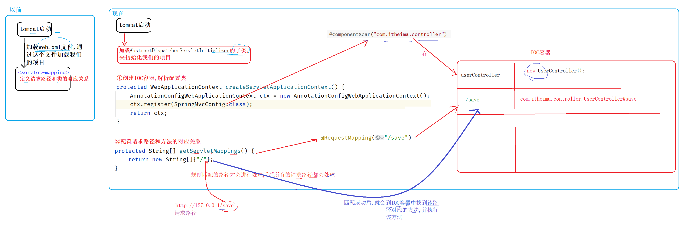
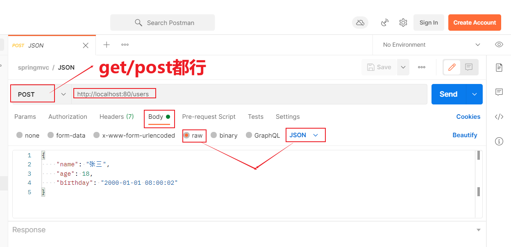
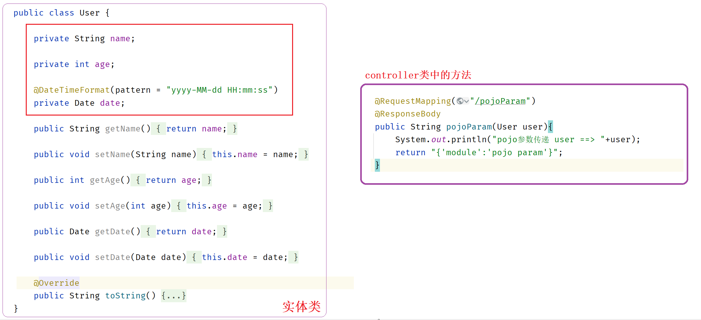

# 1springMVC简介

|  |
| ------------------------------------------------------------ |

# 2springMVC入门案例

## 2.1)开发步骤

①导包

```xml
<dependencies>
    <dependency>
        <groupId>javax.servlet</groupId>
        <artifactId>javax.servlet-api</artifactId>
        <version>3.1.0</version>
        <scope>provided</scope>
    </dependency>
    <dependency>
        <groupId>org.springframework</groupId>
        <artifactId>spring-webmvc</artifactId>
        <version>5.2.10.RELEASE</version>
    </dependency>
</dependencies>

<build>
    <plugins>
        <plugin>
            <groupId>org.apache.tomcat.maven</groupId>
            <artifactId>tomcat7-maven-plugin</artifactId>
            <version>2.1</version>
            <configuration>
                <port>80</port>
                <path>/</path>
            </configuration>
        </plugin>
    </plugins>
</build>
```

②编写spring的config配置类

```java
@Configuration
@ComponentScan("com.itheima.controller")
public class SpringMvcConfig {
}
```

③加载spring的config配置类

```java
//tomcat的web容器配置类
public class ServletConfig extends AbstractDispatcherServletInitializer {

    //加载springmvc配置类，产生springmvc容器（本质还是spring容器）
    protected WebApplicationContext createServletApplicationContext() {
        //初始化WebApplicationContext对象
        AnnotationConfigWebApplicationContext ctx = new AnnotationConfigWebApplicationContext();
        //加载指定配置类
        ctx.register(SpringMvcConfig.class);
        return ctx;
    }

    //设置由springmvc控制器处理的请求映射路径
    protected String[] getServletMappings() {
        return new String[]{"/"};
    }
	
    //加载spring配置类
    protected WebApplicationContext createRootApplicationContext() {
        return null;
    }
}

```

④定义controller类 (接收请求、响应数据)

```java
@Controller
public class UserController {

    //设置映射路径为/save，即外部访问路径
    @RequestMapping("/save")
    //设置当前操作返回结果为指定json数据（本质上是一个字符串信息）
    @ResponseBody
    public String save(){
        System.out.println("user save ...");
        return "{'info':'springmvc'}";
    }

}
```


## 2.2)常见疑问

①createServletApplicationContext方法的作用

|  |
| ------------------------------------------------------------ |

②请求路径第一个斜杠可以省略,而且请求路径可以配置多级(了解)

```java
//设置映射路径为/save，即外部访问路径
@RequestMapping("save/abc")
//设置当前操作返回结果为指定json数据（本质上是一个字符串信息）
@ResponseBody
public String save(){
    System.out.println("user save ...");
    return "{'info':'springmvc'}";
}
```

③@ResponseBody加和不加的区别

```
方法的返回值类型是String时,并且方法上面添加了@ResponseBody注解,会将return的数据原样返回给前端
方法的返回值类型是String时,并且方法上面没有添加@ResponseBody注解,会找和返回值名称一样的页面响应前端
```

④request和response

```
request:  处理请求的
response: 处理响应的
```

## 2.3)流程解析

|  |
| ------------------------------------------- |


# 3spring加载Bean

## 3.1)整合方式

①方式一:

```
SpringConfig加载的bean设定扫描范围为com.itheima，排除掉controller包内的bean
SpringMvcConfig加载的bean设定扫描范围为com.itheima.controller
```

|  |
| ------------------------------------------------------------ |

②方式二:

```
SpringConfig加载的bean设定扫描范围为com.itheima.service 和 com.itheima.dao
SpringMvcConfig加载的bean设定扫描范围为com.itheima.controller
```

|  |
| ------------------------------------------------------------ |

③方式三: 

```
直接使用一个环境,不区分spring和springMVC
```

|  |
| ------------------------------------------------------------ |

## 3.2)常见疑问

①AbstractAnnotationConfigDispatcherServletInitializer和AbstractDispatcherServletInitializer

```
1)AbstractAnnotationConfigDispatcherServletInitializer是AbstractDispatcherServletInitializer的子类
2)在AbstractAnnotationConfigDispatcherServletInitializer类中封装了创建IOC容器、调用register方法的代码
```

|  |
| ------------------------------------------------------------ |

②"不区分spring和springMVC环境 " 和 "区分spring和springMVC 环境" 的区别

|  |
| ------------------------------------------------------------ |

|  |
| ------------------------------------------------------------ |


# 4postman工具

①postman工具的作用

```
postman是一个测试工具,可以代替浏览器发送http请求
```

②不需要注册账号也能使用

|  |
| ------------------------------------------------------------ |

③如何发送get请求

|  |
| ------------------------------------------------------------ |

④如何发送post请求

|  |
| ------------------------------------------------------------ |

⑤如何发送json格式数据

|  |
| ------------------------------------------------------------ |


# 5设置请求路径映射

①@RequestMapping

```
1)可以定义在类的上面,也可以定义在方法上面
2)路径不能重复
```

```java
//使用 "http:127.0.0.1:80/user/save" 才能访问到save()方法

@Controller
@RequestMapping("/user")
public class UserController {

    @RequestMapping("/save")
    @ResponseBody
    public String save() {
        System.out.println("user save ...");
        return "test...";
    }

}
```


# 6如何接收前端的参数

## 6.1)中文乱码

```java
//在tomcat的ServletConfig配置类中添加过滤器
```

```java
public class ServletConfig extends AbstractAnnotationConfigDispatcherServletInitializer {

    protected Class<?>[] getRootConfigClasses() {
        return new Class[0];
    }

    protected Class<?>[] getServletConfigClasses() {
        return new Class[]{SpringMvcConfig.class};
    }

    protected String[] getServletMappings() {
        return new String[]{"/"};
    }

    //乱码处理  - 只能处理post请求的乱码问题
    @Override
    protected Filter[] getServletFilters() {
        CharacterEncodingFilter filter = new CharacterEncodingFilter();
        filter.setEncoding("UTF-8");
        return new Filter[]{filter};
    }

}
```

|  |
| ------------------------------------------------------------ |


## 6.2)接收url地址参数、表单参数

①使用单个形参接收

```java
//请求路径:  http://127.0.0.1:80/commonParam?name=zs&age=18

//普通参数：请求参数与形参名称对应即可完成参数传递
@RequestMapping("/commonParam")
@ResponseBody
public String commonParam(String name ,int age){
    System.out.println("普通参数传递 name ==> "+name);
    System.out.println("普通参数传递 age ==> "+age);
    return "{'module':'common param'}";
}
```

```java
//请求路径:  http://127.0.0.1:80/commonParamDifferentName?name=zs&age=18

//普通参数:请求参数名与形参名不同时，使用@RequestParam注解关联请求参数名称与形参名称之间的关系
@RequestMapping("/commonParamDifferentName")
@ResponseBody
public String commonParamDifferentName(@RequestParam("name") String userName , int age){
    System.out.println("普通参数传递 userName ==> "+userName);
    System.out.println("普通参数传递 age ==> "+age);
    return "{'module':'common param different name'}";
}
```

②使用pojo实体类接收

```java
//请求路径:  http://127.0.0.1:80/pojoParam?name=zs&age=18

//POJO参数：请求参数与形参对象中的属性对应即可完成参数传递
@RequestMapping("/pojoParam")
@ResponseBody
public String pojoParam(User user){
    System.out.println("pojo参数传递 user ==> "+user);
    return "{'module':'pojo param'}";
}
```

```ABAP
注意: 使用pojo实体类接收参数时,底层是利用的set方法接收给成员变量赋值的
```

③使用数组接收

```java
//请求路径:  http://127.0.0.1:80/arrayParam?likes=a&likes=b&likes=c

//数组参数：同名请求参数可以直接映射到对应名称的形参数组对象中
@RequestMapping("/arrayParam")
@ResponseBody
public String arrayParam(String[] likes){
    System.out.println("数组参数传递 likes ==> "+ Arrays.toString(likes));
    return "{'module':'array param'}";
}
```

④使用集合接收

```java
//请求路径:  http://127.0.0.1:80/listParam?likes=a&likes=b&likes=c

//集合参数：同名请求参数可以使用@RequestParam注解映射到对应名称的集合对象中作为数据
//注意:
    //1)只有形参的类型是集合类型,@RequestParam注解就不能省略
    //2)如果不加@RequestParam注解,底层其实set方法给集合中的成员变量赋值
    //3)如果加@RequestParam注解,底层就会利用add方法向集合中添加数据
@RequestMapping("/listParam")
@ResponseBody
public String listParam(@RequestParam List<String> likes){  
    System.out.println("集合参数传递 likes ==> "+ likes);
    return "{'module':'list param'}";
}
```

## 6.3)接收json格式的参数

### 开发步骤

①导入jar包

```xml
<dependency>
    <groupId>com.fasterxml.jackson.core</groupId>
    <artifactId>jackson-databind</artifactId>
    <version>2.9.0</version>
</dependency>
```

②在confing配置类上面添加注解 @EnableWebMvc

```java
@Configuration
@ComponentScan("com.itheima.controller")
//开启json数据类型自动转换
@EnableWebMvc
public class SpringMvcConfig {
}
```

③在方法的形参前面使用@RequestBody

```java
@RequestMapping("/pojoParamForJson")
@ResponseBody
public String pojoParamForJson(@RequestBody User user){
    System.out.println("pojo(json)参数传递 user ==> "+user);
    return "{'module':'pojo for json param'}";
}
```

### 常见疑问

①什么是json数据自动转换

```java
//json数据的本质:   就是按照一定格式书写的字符串
//json数据自动转换: 就是将json格式的字符串自动转换成对应的实现类

@EnableWebMvc  //开启转换功能
@RequestBody  //进行转换
```

②json格式的数据怎么写

```json
//1)json数组
["张三","李四"]

//2)json对象
{"name":"张三","age":18}

//3)json集合
[
 {"name":"张三","age":18},
 {"name":"李四","age":20}
]
```

③不管json格式多么简单,必须使用实体类接收

```json
栗子:  {"id":"666"}
```

```java
@RequestMapping("/pojoParamForJson")
@ResponseBody
public String pojoParamForJson(@RequestBody String id){  //这些不行
    // id  =  {"id":"666"}
    System.out.println("pojo(json)参数传递 user ==> "+id);
    return "{'module':'pojo for json param'}";
}
```

|  |
| ------------------------------------------------------------ |


## 6.4)接收url地址、表单中的日期数据

①结论

```ABAP
参数什么格式,就使用@DateTimeFormat定义成什么格式接收就行
```

②单个形参是Date类型

```java
@RequestMapping("/dateParam")
@ResponseBody
public String dateParam(Date date,
                        @DateTimeFormat(pattern = "yyyy-MM-dd") Date date1,
                        @DateTimeFormat(pattern = "yyyy/MM/dd HH:mm:ss") Date date2) {
    
    System.out.println("参数传递 date ==> " + date);
    System.out.println("参数传递 date1(yyyy-MM-dd) ==> " + date1);
    System.out.println("参数传递 date2(yyyy/MM/dd HH:mm:ss) ==> " + date2);

    return "{'module':'data param'}";
}
```

③实体类中成员变量是Date类型

|  |
| ------------------------------------------------------------ |

## 6.5)接收json格式中的日期数据

```ABAP
//@DateTimeFormat(pattern = "yyyy-MM-dd HH:mm:ss")
//@DateTimeFormat  仅仅只能接收url地址/表单参数中的日期数据

//@JsonFormat(pattern = "yyyy-MM-dd HH:mm:ss")
//专用于接收JSON串里面的日期数据
```

|  |
| ------------------------------------------------------------ |


# 7响应数据

①@ResponseBody

```ABAP
1)方法的返回值类型是String时, 不加@ResponseBody注解,找对应的页面. 加@ResponseBody注解将返回值原样输出
2)方法的返回值类型是其他类型时, 不加@ResponseBody注解,会直接报错.  加@ResponseBody注解将数据转换成JSON格式返回

3)@ResponseBody注解可以定义在方法上面、也可以定义在类上面
  定义在类上面: 代表对该类中的所有方法起效
```

```java
//@ResponseBody
@Controller
public class UserController {

    //响应页面/跳转页面
    //返回值为String类型，设置返回值为页面名称，即可实现页面跳转
    @RequestMapping("/toJumpPage")
    public String toJumpPage(){
        System.out.println("跳转页面");
        return "page.jsp";
    }

    //响应文本数据
    //返回值为String类型，设置返回值为任意字符串信息，即可实现返回指定字符串信息
    @RequestMapping("/toText")
    @ResponseBody
    public String toText(){
        System.out.println("返回纯文本数据");
        return "response text";
    }

    //响应POJO对象
    //返回值为实体类对象，设置返回值为实体类类型，即可实现返回对应对象的json数据
    @RequestMapping("/toJsonPOJO")
    @ResponseBody
    public User toJsonPOJO(){
        System.out.println("返回json对象数据");
        User user = new User();
        user.setName("itcast");
        user.setAge(15);
        return user;
    }

    //响应POJO集合对象
    //返回值为集合对象，设置返回值为集合类型，即可实现返回对应集合的json数组数据
    @RequestMapping("/toJsonList")
    @ResponseBody
    public List<User> toJsonList(){
        System.out.println("返回json集合数据");
        User user1 = new User();
        user1.setName("传智播客");
        user1.setAge(15);

        User user2 = new User();
        user2.setName("黑马程序员");
        user2.setAge(12);

        List<User> userList = new ArrayList<User>();
        userList.add(user1);
        userList.add(user2);

        return userList;
    }
    
}
```


# 8rest风格简介

①什么是rest风格

```
rest风格 : 使用请求路径 +  请求方式 来确定访问那个方法

get      查询
post     添加
put      修改
delete   删除
```

②路径相同的情况下存储到IOC容器中不会冲突?

```
不会,IOC容器中key值存储的不仅仅是路径还有请求类型
```

|  |
| ------------------------------------------------------------ |

# 9rest入门案例

①@RequestMapping

```java
//1)可以定义下类的上面,也可以定义在方法上面
//2)@RequestMapping注解中value属性用来定义方法的请求路径,method属性用来定义方法的请求类型
```

②@PathVariable 

```java
//什么是路径参数:    http://localhost:80/users/1

//1)  {id} 作用:  用来接收路径参数中的值
//2)  @PathVariable作用:  是将接收到值 赋值给对应的形参

@RequestMapping(value = "/users/{id}" ,method = RequestMethod.GET)
@ResponseBody
public String getById(@PathVariable Integer id){
    System.out.println("user getById..."+id);
    return "{'module':'user getById'}";
}
```

③接收参数的三个注解对比

```
@RequestParam  接收url地址参数、表单参数时使用
@RequestBody   接收json格式的参数
@PathVariable  接收路径参数
```

|  |
| -------------------------------- |

# 10rest风格总结

①设置请求路径映射

```java
@RequestMapping("/books")

@PostMapping
@DeleteMapping("/{id}")
@PutMapping
@GetMapping
```

②接收前端的参数

```java
@RequestParam  //接收url地址参数、表单参数时使用
@RequestBody   //接收json格式的参数
@PathVariable  //接收路径参数

@DateTimeFormat(pattern = "yyyy/MM/dd HH:mm:ss")  //接收日期格式的参数
```

③响应数据

```java
@RestController  //是 @Controller  + @ResponseBody 的结合体
```

④配置类

```java
@EnableWebMvc  //功能之一: 开启json数据类型自动转换
```


# 11rest前后端案例

静态资源过滤配置

①代码

```java
@Configuration
public class SpringMvcSupport extends WebMvcConfigurationSupport {
    //设置静态资源访问过滤，当前类需要设置为配置类，并被扫描加载
    @Override
    protected void addResourceHandlers(ResourceHandlerRegistry registry) {
        //当访问/pages/????时候，从/pages目录下查找内容
        registry.addResourceHandler("/pages/**").addResourceLocations("/pages/");
        registry.addResourceHandler("/js/**").addResourceLocations("/js/");
        registry.addResourceHandler("/css/**").addResourceLocations("/css/");
        registry.addResourceHandler("/plugins/**").addResourceLocations("/plugins/");
    }
}
```

②解析

|  |
| ---------------------------------------------------------- |

