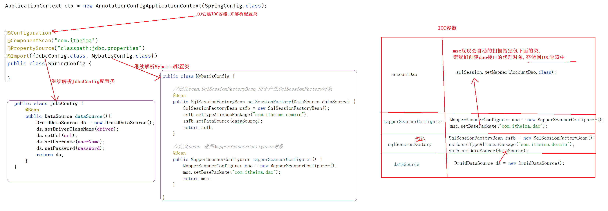

# 1 应用案例

## 1.1)回顾: 数据源 

①什么是数据源

```java
//数据源-数据库连接池技术   栗子: DruidDataSource就是我们常用的数据源
DruidDataSource druidDataSource = new DruidDataSource();
druidDataSource.setDriverClassName("com.mysql.jdbc.Driver");
druidDataSource.setUsername("root");
druidDataSource.setPassword("root");
druidDataSource.setUrl("jdbc:mysql://localhost:3306/mysql");
```


②什么是C3p0

```
和druid一样都是对数据库连接思想的实现
```

③为什么C3p0和druid配置的属性名称不一样?


④实际开发中c3p0和druid都要么？

```
选择其中一个就行, 现在流行的是druid 
```


## 1.2)开发步骤

```
需求: 是将DruidDataSource这个第三方jar包给我们提供的类,交给spring IOC管理
```

①导包

```xml
<dependency>
    <groupId>org.springframework</groupId>
    <artifactId>spring-context</artifactId>
    <version>5.2.10.RELEASE</version>
</dependency>
<dependency>
    <groupId>com.alibaba</groupId>
    <artifactId>druid</artifactId>
    <version>1.1.16</version>
</dependency>
```

②使用spring的xml加载外部的properties文件

```xml
<context:property-placeholder location="classpath:jdbc.properties" system-properties-mode="NEVER"/>
```

③配置DruidDataSource类的Bean标签

```xml
<!--    3.使用属性占位符${}读取properties文件中的属性-->
<!--    说明：idea自动识别${}加载的属性值，需要手工点击才可以查阅原始书写格式-->
<bean id="dataSource" class="com.alibaba.druid.pool.DruidDataSource">
    <property name="driverClassName" value="${jdbc.driver}"/>
    <property name="url" value="${jdbc.url}"/>
    <property name="username" value="${jdbc.username}"/>
    <property name="password" value="${jdbc.password}"/>
</bean>
```

④使用spring创建对象

```java
public static void main(String[] args) {
    ApplicationContext ctx = new ClassPathXmlApplicationContext("applicationContext.xml");

    DataSource dataSource = (DataSource) ctx.getBean("dataSource");
    System.out.println(dataSource);
}
```

## 1.3)流程解析


## 1.4)常见疑问

①classpath 和classpath*的区别

```xml
<!-- 
classpath:     只能读取本项目中的配置文件
classpath*:    除了可以读取本项目中的配置文件之外,还可以读取jar包中的配置文件
*.properties   代表读取以properties为后缀的所有配置文件
-->
<context:property-placeholder location="classpath:jdbc.properties"/>
```

②注意: 占位符别忘写了,  或者写成#{} 都是不对的

```xml
<bean id="dataSource" class="com.alibaba.druid.pool.DruidDataSource">
    <property name="driverClassName" value="jdbc.driver"/>    <!-- 这样写是不行的 -->
    <property name="url" value="#{jdbc.url}"/>                <!-- 这样写是不行的 --> 
    <property name="username" value="${jdbc.username}"/>
    <property name="password" value="${jdbc.password}"/>
</bean>
```

③命名空间

```
为什么要引入context命名空间,有啥用?  答: 规定限制配置文件中的标签该怎么定义
```

| 命名空间别名 |
| ------------------------------------------------------------ |


# 2 xml总结 (了解)

## 2.1) 如何创建一个IOC容器

```java
//方式一: (重点)
ApplicationContext ctx = new ClassPathXmlApplicationContext("applicationContext.xml");

//方式二: 了解
ApplicationContext ctx = new FileSystemXmlApplicationContext("D:\\applicationContext.xml");

//方式三: 了解
ApplicationContext ctx = new ClassPathXmlApplicationContext("applicationContext.xml","bean.xml");
```

|  |
| ------------------------------------------------ |

## 2.2) 如何从IOC容器中获取bean对象

```java
//方式一:
BookDao bookDao = (BookDao) ctx.getBean("bookDao");

//方式二:
 BookDao bookDao = ctx.getBean("bookDao",BookDao.class);

//方式三: (注意: 使用这种方式对应类型的bean对象在IOC容器中只能有一个)
BookDao bookDao = ctx.getBean(BookDao.class);
```

## 2.3)懒加载

①什么是懒加载

```
创建IOC容器时,不会解析配置文件,不会创建bean对象, 当第一次使用时才会创建这个类的对象
```

②BeanFactory (了解)

```ABAP
BeanFactory是所有IOC容器类的祖类    默认 - 使用懒加载模式创建Bean对象
```

```java
Resource resources = new ClassPathResource("applicationContext.xml");
BeanFactory bf = new XmlBeanFactory(resources);

BookDao bookDao = bf.getBean("bookDao", BookDao.class);
bookDao.save();
```

③ApplicationContext (推荐)

```ABAP
默认- 初始化IOC容器时立即创建Bean对象 (如果有特殊需求:可以将指定的bean配置成懒加载)
```

```xml
<bean id="person" class="com.itheima.domain.Person" lazy-init="true"/>
```

```java
ApplicationContext app = new ClassPathXmlApplicationContext("applicationContext.xml");

Person person = app.getBean("person", Person.class);
System.out.println(person);
```

## 2.4)bean标签总结

| 属性相关总结 |
| ------------------------------------------------------------ |

| 依赖注入总结 |
| ---------------------------------------------------- |


# 3 注解开发

## 3.1)注解开发入门

### 开发步骤

①导包

```xml
<dependency>
    <groupId>org.springframework</groupId>
    <artifactId>spring-context</artifactId>
    <version>5.2.10.RELEASE</version>
</dependency>
```

②编写xml配置文件

```xml
<?xml version="1.0" encoding="UTF-8"?>
<beans xmlns="http://www.springframework.org/schema/beans"
       xmlns:context="http://www.springframework.org/schema/context"
       xmlns:xsi="http://www.w3.org/2001/XMLSchema-instance"
       xsi:schemaLocation="
        http://www.springframework.org/schema/beans http://www.springframework.org/schema/beans/spring-beans.xsd
        http://www.springframework.org/schema/context http://www.springframework.org/schema/context/spring-context.xsd">
		
    <!--配置包扫描-->
    <context:component-scan base-package="com.itheima"/>

</beans>
```

③在想要交给spring管理的类上面添加注解

```java
@Service("bookService")
public class BookServiceImpl implements BookService {

    private BookDao bookDao;

    public void setBookDao(BookDao bookDao) {
        this.bookDao = bookDao;
    }

    public void save() {
        System.out.println("book service save ...");
        bookDao.save();
    }

}
```

④使用spring创建对象

```java
public static void main(String[] args) {
    ApplicationContext ctx = new ClassPathXmlApplicationContext("applicationContext.xml");

    BookService bookService = ctx.getBean("bookServiceImpl", BookService.class);
    bookService.save();
}
```

### 流程解析

|  |
| ------------------------------------------------------------ |

### 注解使用说明

```ABAP
@Component  
  1)创建对象
  2)如果没有定义Bean的id,默认使用类名首字母小写做为Bean的Id

下面的注解时@Component的衍生注解, 作用和@Component注解一模一样  (为了见名知意)
@Controller 用于controller层
@Service    用于Service层
@Repository 用于dao层
```


## 3.2)纯注解开发

### 开发步骤

①声明配置类

```java
//声明当前类为Spring配置类
@Configuration
//设置bean扫描路径，多个路径书写为字符串数组格式
@ComponentScan({"com.itheima"})
public class SpringConfig {

}
```

②在想要交给spring管理的类上面添加注解

```java
@Service("bookService")
public class BookServiceImpl implements BookService {

    private BookDao bookDao;

    public void setBookDao(BookDao bookDao) {
        this.bookDao = bookDao;
    }

    public void save() {
        System.out.println("book service save ...");
        bookDao.save();
    }

}
```

③使用spring创建对象

```java
public static void main(String[] args) {
    //AnnotationConfigApplicationContext加载Spring配置类初始化Spring容器
    ApplicationContext ctx = new AnnotationConfigApplicationContext(SpringConfig.class);

    //按类型获取bean
    BookService bookService = ctx.getBean(BookService.class);
    System.out.println(bookService);
}
```

### 流程解析

|  |
| ------------------------------------------------------------ |

### xml文件和注解的对比

|  |
| ------------------------------------------------------------ |


# 4声明周期&作用范围 (了解)

```java
//声明周期 
@PostConstruct : 定义在方法的上面, 代表该方法就可以干预对象的创建了
 @PreDestroy:     定义在方法的上面,代表该方法就可以干预销毁对象了
```

```java
//作用范围
@Scope("singleton")  :  定义在类的上面, 可以直接创建该类时使用单例的方式还是多例的方式

singleton 单例
prototype 多例
```


# 5注解开发依赖注入

```
依赖注入: 给类中的成员变量赋值
```

## 5.1)注入引用类型

①注意: @Autowired注解是从IOC容器中获取对象给成员变量赋值

|  |
| ------------------------------------------------------------ |

②@Autowired注解和Autowired属性的区别

|  |
| ------------------------------------------------------------ |

③@Autowired注解:  详解

```
1)@Autowired注解可以定义在成员变量上面、方法上面、形参前面...等
2)@Autowired的注入方式
  2.1)优先按照类型注入,如果找不到,直接报错
  2.2)优先按照类型注入,如果找到多个,按照成员变量的属性名找, 如果按照成员变量的属性名也找不到,就会报错

3)找多个的情况下报错的解决方案
  3.1)使用@Qualifier("bookDao1")注解指定bean的名称, 注意: @Qualifier必须和@Autowired同时使用
  3.2)使用@Primary注解,在那个类上面加这个注解,那么@Autowired获取对象时就优先使用那个
```


## 5.2)注入简单类型

①@Value注解

```
@Value注解 : 给类中的成员变量赋值(注入的是简单类型,支持使用${}从配置文件中读取)
```

②@PropertySource({"jdbc.properties"})

```
@PropertySource注解: 加载指定的配置文件到项目中(注意: 不支持通配符)
```


# 6注解开发管理第三方bean

①第三方的类,可以使用@Controller、@Service ...这些注解管理么?

```
不能, 答:因为第三方的bean这些类是jar包中提供的,我们改不了!
```

②@Bean注解

```
1)在方法上面使用
2)将方法的返回值存储到IOC容器中,不会自动的帮我们创建对象
  @Controller、@Service..这些注解会自动的帮我们创建对象
3)@Bean注解可以自定义指定bean的ID, 栗子: @Bean("ds")  , 如果没有指定默认方法名作为指定bean的ID
```

③@Import注解

```
@Import注解作用:  导入其他配置类
```

|  |
| ------------------------------------------------------------ |


④给第三方bean的成员变量赋值

开发步骤

```
1)在config配置类上使用@PropertySource({"jdbc.properties"})注解加载properties配置文件
2)使用@Value("${}")注解给对应的成员变量赋值
3)调用第三方对象的set方法进行设值
```

解析

|  |
| ------------------------------------------------------------ |


# 7注解总结

```
存
@Controller  用于Controller层(就是web层 , servlet)
@Service     用于Service层
@Bean        用于第三方的类

取 - 给成员变量赋值
@Autowired   注入引用类型
@Value       注入简单类类型

其他
@Configuration   定义配置类
@ComponentScan   包扫描
@PropertySource  加载properties配置文件
@Import          导入其他配置类,让Spring继续解析这些配置类
```


# 8spring整合Mybatis

## 8.1)整合的思路

```
1)将SqlSessionFactory、AccountDao接口的代理类交给spring管理
2)将mybatis的xml配置文件改造成注解开发
```

## 8.2)开发步骤

①导包

```xml
<!-- spring的核心包 -->
<dependency>
    <groupId>org.springframework</groupId>
    <artifactId>spring-context</artifactId>
    <version>5.2.10.RELEASE</version>
</dependency>

<!-- druid数据源 -->
<dependency>
    <groupId>com.alibaba</groupId>
    <artifactId>druid</artifactId>
    <version>1.1.16</version>
</dependency>

<!-- mybatis的核心包 -->
<dependency>
    <groupId>org.mybatis</groupId>
    <artifactId>mybatis</artifactId>
    <version>3.5.6</version>
</dependency>

<!-- java代码连接mysql数据库的驱动 -->
<dependency>
    <groupId>mysql</groupId>
    <artifactId>mysql-connector-java</artifactId>
    <version>5.1.47</version>
</dependency>

<!-- spring给我提供的jdbc -->
<dependency>
    <groupId>org.springframework</groupId>
    <artifactId>spring-jdbc</artifactId>
    <version>5.2.10.RELEASE</version>
</dependency>

<!-- mybatis和spring 框架进行整合用的包 -->
<dependency>
    <groupId>org.mybatis</groupId>
    <artifactId>mybatis-spring</artifactId>
    <version>1.3.0</version>
</dependency>
```

|  |
| ------------------------------------------------------------ |

②编写配置类

```java
public class JdbcConfig {
    @Value("${jdbc.driver}")
    private String driver;
    @Value("${jdbc.url}")
    private String url;
    @Value("${jdbc.username}")
    private String userName;
    @Value("${jdbc.password}")
    private String password;

    @Bean
    public DataSource dataSource(){
        DruidDataSource ds = new DruidDataSource();
        ds.setDriverClassName(driver);
        ds.setUrl(url);
        ds.setUsername(userName);
        ds.setPassword(password);
        return ds;
    }
}
```

```java
public class MybatisConfig {

    //定义bean,SqlSessionFactoryBean,用于产生SqlSessionFactory对象
    @Bean
    public SqlSessionFactoryBean sqlSessionFactory(DataSource dataSource) {
        SqlSessionFactoryBean ssfb = new SqlSessionFactoryBean();
        ssfb.setTypeAliasesPackage("com.itheima.domain");
        ssfb.setDataSource(dataSource);
        return ssfb;
    }
	
    //定义bean，返回MapperScannerConfigurer对象
    @Bean
    public MapperScannerConfigurer mapperScannerConfigurer() {
        MapperScannerConfigurer msc = new MapperScannerConfigurer();
        msc.setBasePackage("com.itheima.dao");
        return msc;
    }

}
```

③加载配置类

```java
@Configuration
@ComponentScan("com.itheima")
@PropertySource("classpath:jdbc.properties")
@Import({JdbcConfig.class, MybatisConfig.class})
public class SpringConfig {

}
```

④使用dao

```java
@Service
public class AccountServiceImpl implements AccountService {

    @Autowired
    private AccountDao accountDao;

    public void save(Account account) {
        accountDao.save(account);
    }

}
```

## 8.3)流程解析

|  |
| ---------------------------- |

## 8.4)常见疑问

①mapperScannerConfigurer的作用

|  |
| ------------------------------------------------------------ |

②DataSource的作用

|  |
| ------------------------------------------------------------ |

③dao接口上面需要添加@Repository注解么?

```
不需要,原因如下
1)@Repository注解的作用是:  spring遇到这个注解就会创建类的对象存储到IOC容器中,dao接口不能创建对象
2)dao接口的代理对象是mybatis框架帮我们创建的,存储到IOC容器中的。
```


# 9spring整合junit

## 9.1)开发步骤

①导包

```xml
<dependency>
    <groupId>junit</groupId>
    <artifactId>junit</artifactId>
    <version>4.12</version>
    <scope>test</scope>
</dependency>

<dependency>
    <groupId>org.springframework</groupId>
    <artifactId>spring-test</artifactId>
    <version>5.2.10.RELEASE</version>
</dependency>
```

②在测试类中直接使用@Autowired注入对象使用

```java
//设置类运行器
@RunWith(SpringJUnit4ClassRunner.class)
//设置Spring环境对应的配置类
@ContextConfiguration(classes = SpringConfig.class)
public class AccountServiceTest {
    
    //支持自动装配注入bean
    @Autowired
    private AccountService accountService;

    @Test
    public void testFindById(){
        System.out.println(accountService.findById(1));
    }

    @Test
    public void testFindAll(){
        System.out.println(accountService.findAll());
    }

}
```

## 9.2)注解解析

①@ContextConfiguration(classes = SpringConfig.class)

```java
//让spring知道通过这个配置类初始化那些东西
相当于: ApplicationContext ctx = new AnnotationConfigApplicationContext(SpringConfig.class);
```

②@RunWith(SpringJUnit4ClassRunner.class)

```java
//告诉 @Test注解现在是spring环境, 在执行测试方法之前需要将IOC容器初始化完成
```

