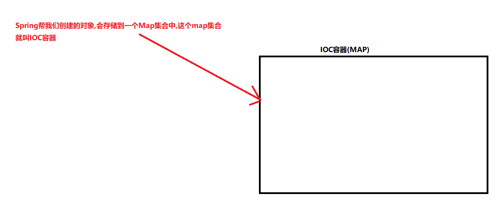
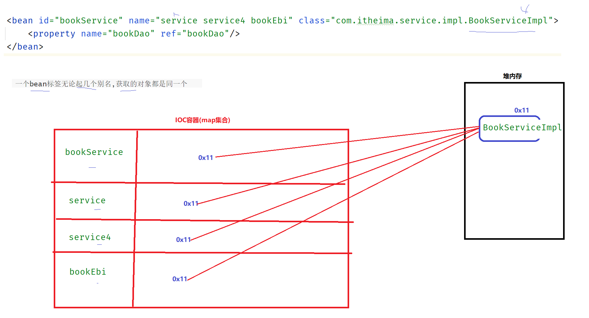

# 0 课前交代

```
1) 思考"为啥学习这个技术,解决了什么问题"
2) 课堂上有啥疑惑一定要及时问
3) 课下练习有问题15分钟无法解决,一定要问

4)资料
  基础框架8天md笔记
  基础框架课堂练习
  基础框架8天代码
```


# 1 前置知识回顾


# 2 spring简介

## 2.1)spring能干什么

①简化开发

```
IOC -  解耦合
AOP -  面向切面
```

②整合框架

```
SSH (spring  struts  hibernate)
SSI (spring  springmvc  ibatis)
SSM (spring  springmvc  mybatis)
SSMP (spring  springmvc  mybatis  mybatis-plus)
springboot
```


## 2.2)spring概述

①广义、狭义

```
广义 :  spring全家桶( spring feamework、 spring boot、spring cloud、spring session) 
狭义 :  spring feamework
```

②发展史


③系统架构

```
组件其实就是jar包,只需要将对应的jar包导入到我们的项目中,我就可以使用对应的功能了
```


# 3 核心概念

①为什么要学spring?  spring给我们带来的什么好处?

```
①如果service层的代码发生了改变,那么controller层的代码就不得不进行修改,这种现象叫"耦合"
②如何解耦合? 需要使用工具类创建对象,达到"解耦合"
```

```
使用使用工具类创建对象这件事spring IOC帮我们封装好了,使用spring IOC就可以实现解耦
spring IOC的功能之一就是帮我们创建对象
```

```ABAP
代码见: day01-spring入门随堂资料-随堂代码-spring_00_factory
```

②什么是IOC

```
IOC(控制反转): 以前创建对象是有程序员自己手动new,现在使用有spring帮我们创建对象, 创建对象的权限发生了改变
              spring帮我们创建出来的对象,spring会帮我们进行管理对象
              
              创建对象、管理对象现在都是由spring IOC控制的
```

③什么是DI

```
DI(依赖注入):  使用spring的技术给类中的成员变量赋值
依赖: 其实就是类中的成员变量
注入: 就是给成员变量赋值
```

④什么是IOC容器

```
IOC容器的本质: 其实就是一个MAP集合
```



⑤什么是Bean

```
Bean: 就是创建出来的对象,只不过仅仅是存储在IOC容器中的对象我们才叫Bean
```


# 4 IOC入门案例

## 4.1)开发步骤

0)前置工作

```
1)创建一个maven项目
2)定义BookDao  BookDaoImpl类
```

1)导包

```xml
<dependency>
    <groupId>org.springframework</groupId>
    <artifactId>spring-context</artifactId>
    <version>5.2.10.RELEASE</version>
</dependency>
```

2)编写配置文件

```xml
<?xml version="1.0" encoding="UTF-8"?>
<beans xmlns="http://www.springframework.org/schema/beans"
       xmlns:xsi="http://www.w3.org/2001/XMLSchema-instance"
       xsi:schemaLocation="http://www.springframework.org/schema/beans http://www.springframework.org/schema/beans/spring-beans.xsd">


    <!--2.配置bean-->
    <!--bean标签标示配置bean
    id属性标示给bean起名字
    class属性表示给bean定义类型-->
    <bean id="bookDao" class="com.itheima.dao.impl.BookDaoImpl" />
  

</beans>
```

3)使用spring创建对象

```java
public static void main(String[] args) {
    //3.获取IoC容器
    ApplicationContext ctx = new ClassPathXmlApplicationContext("applicationContext.xml");

    //4.获取bean（根据bean配置id获取）
    BookDao bookDao = (BookDao) ctx.getBean("bookDao");
}
```

## 4.2)流程解析


## 4.3)常见疑问

①直接new一个对象不行么? 为什么要使用IOC帮我们创建对象呢?

```
实际工作中我们要创建的对有成百上千个,使用spring帮我们创建对象能简化开发(实现解耦、方便维护)
```

②bean标签的class属性值不能写接口

```
接口不能创建对象
```

③bean标签的id属性值不能重复

```
因为bean标签的id属性值,相对于map集合中的key值,所有不能重复
```


# 5 DI入门案例

## 5.1)开发步骤

①给类中的成员变量提供set方法

```java
public class BookServiceImpl implements BookService {
    //5.删除业务层中使用new的方式创建的dao对象
    private BookDao bookDao;

    //6.提供对应的set方法
    public void setBookDao(BookDao bookDao) {
        this.bookDao = bookDao;
    }

    public void save() {
        System.out.println("book service save ...");
        bookDao.save();
    }
}
```

②修改配置文件

```xml
<bean id="bookDao" class="com.itheima.dao.impl.BookDaoImpl"/>

<bean id="bookService" class="com.itheima.service.impl.BookServiceImpl">
    <property name="bookDao" ref="bookDao"/>
</bean>
```

③使用spring创建对象

```java
public static void main(String[] args) {
    //3.获取IoC容器
    ApplicationContext ctx = new ClassPathXmlApplicationContext("applicationContext.xml");

    BookService  bookService = (BookService) ctx.getBean("bookService");
    System.out.println(bookService);
}
```

## 5.2)常用疑问

|  |
| ------------------------------------------------------------ |

## 5.3)流程解析

|  |
| ------------------------------------------------------------ |

# 6 IOC详解

## 6.1)bean的基本配置

①什么样的对象适合使用spring管理

```
controller类、service类、dao类这些才会存到IOC容器中,在整个项目中这些类只会创建一个对象
```

②bean标签的name属性(了解)

```
name属性的作用: 起别名
```

| 注意: 一个bean标签无论起几个别名,获取的对象都是同一个 |
| ------------------------------------------------------------ |

| 注意: 别名不能重复(无论是id还是name都是IOC容器中的key值, 需要保证同一个key值对应的value不能冲突) |
| ------------------------------------------------------------ |

③bean标签的scope的属性(了解)

```
scope的属性作用: 配置bean的作用域(对象是单例还是多例)
```

|  |
| ------------------------------------------------------------ |


## 6.2)bean的四种实例化方式

①什么是bean的实例化

```
bean:  存储到IOC容器中的对象
实例化: 创建对象
bean的实例化方式: IOC容器中对象的创建方式
```


②以前我们是怎么获取对象的

```java
public static void main(String[] args) throws SQLException {
    //方式一: 利用构造方法创建对象
    BookDaoImpl bookDao = new BookDaoImpl();

    //方式二:  利用静态方法获取一个对象
    Connection connection = DriverManager.getConnection("jdbc:msyql://....", "root", "root");

    //方式三: 利用类中普通方法获取一个对象
    SqlSessionFactoryBuilder builder = new SqlSessionFactoryBuilder();
    SqlSessionFactory build = builder.build(in);
}
```


③spring IOC是如何创建对象的

方式一: 利用构造方法创建对象

> 主要是给我们自己定义的类创建对象的

```xml
<!--方式一：构造方法实例化bean-->
<bean id="bookDao" class="com.itheima.dao.impl.BookDaoImpl"/>
```

方式二:  利用静态方法获取一个对象

> 主要给第三方jar包中类使用的

```xml
<bean id="orderDao" class="com.itheima.factory.OrderDaoFactory" factory-method="getOrderDao"/>
```

|  |
| ------------------------------------------------------------ |

方式三:  利用类的普通方法获取一个对象

> 主要给第三方jar包中类使用的

```xml
<bean id="userFactory" class="com.itheima.factory.UserDaoFactory"/>
<bean id="userDao" factory-method="getUserDao" factory-bean="userFactory"/>
```

方式四:  (方式三的变形)使用FactoryBean

> 主要给jar包的开发者使用,  栗子:  mybatis

```java
public class UserDaoFactoryBean implements FactoryBean<UserDao> {

    //代替原始实例工厂中创建对象的方法
    public UserDao getObject() throws Exception {
        return new UserDaoImpl();
    }

    public Class<?> getObjectType() {
        return UserDao.class;
    }

}
```

```xml
<!--方式四：使用FactoryBean实例化bean-->
<bean id="userDao" class="com.itheima.factory.UserDaoFactoryBean"/>
```

| 解析 |
| ------------------------------------------------------------ |


## 6.3)bean的生命周期

①什么是生命周期

```
生命周期:        对于生物来说就是从出生到死亡的过程
bean的生命周期:  对象从创建到销毁的过程
```

```ABAP
spring给我们提供了可以干预这个生命周期的方式
```


②如何干预bean的生命周期

方式一: xml配置方式

```xml
<!--init-method：设置bean初始化生命周期回调函数-->
<!--destroy-method：设置bean销毁生命周期回调函数，仅适用于单例对象-->
<bean id="bookDao" class="com.itheima.dao.impl.BookDaoImpl" init-method="init" destroy-method="destory"/>
```

方式二: 实现接口的方式

```java
public class BookServiceImpl implements BookService, InitializingBean, DisposableBean {
    private BookDao bookDao;

    public BookServiceImpl() {
        System.out.println("BookServiceImpl的 构造方法..");
    }

    public void setBookDao(BookDao bookDao) {
        System.out.println("BookServiceImpl的 set方法 .....");
        this.bookDao = bookDao;
    }

    public void save() {
        System.out.println("book service save ...");
        bookDao.save();
    }
	
    //干预对象创建时的方法
    public void afterPropertiesSet() throws Exception {
        System.out.println("service init");
    }
    
    //干预对象销毁时的方法
    public void destroy() throws Exception {
        System.out.println("service destroy");
    }

}
```

```java
1)为什么初始化和销毁提供两个接口, 因为: 初始化和销毁不一定必须都的同时干,可以仅仅干其中一件事
  栗子: public class BookServiceImpl implements BookService,DisposableBean{} 
    
2)对象初始化的过程是在创建ApplicationContext对象时底层就会帮我们完成存储到IOC容器中了
  ApplicationContext ctx = new ClassPathXmlApplicationContext("applicationContext.xml");
```


③生命周期的执行流程

```java
1)创建对象开辟内存空间、调用构造方法
2)给类中的成员变量赋值
3)执行干预对象创建时的方法
4)存储对象到IOC容器中

----------------------------------------

5)从IOC容器中获取对象使用

------------------------------------------

6)执行干预对象销毁时的方法
7)销毁IOC容器
```


# 7 DI详解

## 7.1)setter注入

①什么是DI(依赖注入)

```
DI(依赖注入) : 给类中的成员变量赋值
```

②ref和value的区别

|  |
| ------------------------------------------------------------ |

## 7.2)构造器注入

①配置

```xml
<!-- constructor-arg标签代表利用构造方法给类中的成员变量赋值 -->
<bean id="bookDao" class="com.itheima.dao.impl.BookDaoImpl">
    <constructor-arg name="connectionNum" value="10"/>
    <constructor-arg name="databaseName" value="mysql"/>
</bean>

<bean id="userDao" class="com.itheima.dao.impl.UserDaoImpl"/>

<bean id="bookService" class="com.itheima.service.impl.BookServiceImpl">
    <constructor-arg name="userDao" ref="userDao"/>
    <constructor-arg name="bookDao" ref="bookDao"/>
</bean>
```

②构造器注入和setter注入如何选择?

```ABAP
如何能用setter注入,就使用setter注入,否则使用构造器注入
```

## 7.3)自动装配

①通过类型注入 :  保证IOC容器中该类型的对象只能有一个

|  |
| ------------------------------------------------------------ |

②通过名称注入:  bean的id要和set方法名称对应

|  |
| ------------------------------------------------------------ |

③注意:  不管是利用通过类型注入还是通过名称注入, 底层都是利用set方法给成员变量赋值的,所以set方法不能丢!

④注意:  自动装配不能给简单类型赋值


## 7.4)集合注入(了解)

```java
public class BookDaoImpl implements BookDao {

    private int[] array;
    private List<String> stringList;

    public void setArray(int[] array) {
        this.array = array;
    }

    public void setStringList(List<String> stringList) {
        this.stringList = stringList;
    }

    public void save() {
        System.out.println("book dao save ...");

        System.out.println("打印数组:" + Arrays.toString(array));
        System.out.println("打印集合:" + stringList);
    }
}
```

```xml
<?xml version="1.0" encoding="UTF-8"?>
<beans xmlns="http://www.springframework.org/schema/beans"
       xmlns:xsi="http://www.w3.org/2001/XMLSchema-instance"
       xsi:schemaLocation="http://www.springframework.org/schema/beans http://www.springframework.org/schema/beans/spring-beans.xsd">


    <bean id="bookDao" class="com.itheima.dao.impl.BookDaoImpl">
        <!--数组注入-->
        <property name="array">
            <array>
                <value>100</value>
                <value>200</value>
                <value>300</value>
            </array>
        </property>

        <!--集合注入-->
        <property name="stringList">
            <list>
                <value>张三</value>
                <value>李四</value>
                <value>王五</value>
            </list>
        </property>
        
    </bean>
</beans>
```

