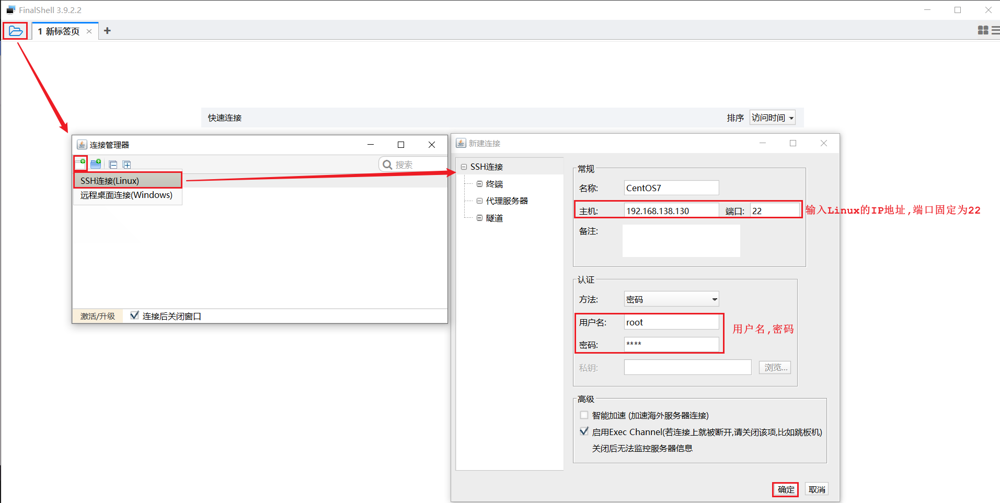
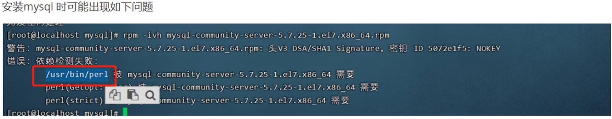
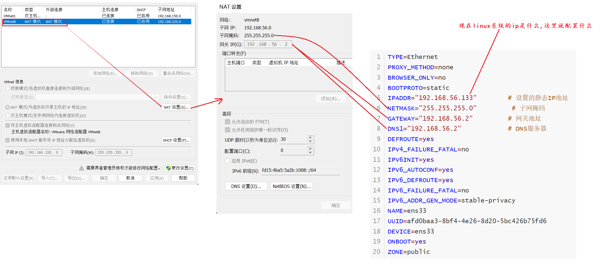

# 1 常见系统

```
windows  -- (win10  win11  winserver)
UNIX     -- (mac  IOS ipados)
Linux    -- (安卓、鸿蒙、嵌入式)
```

```
windows  收费、不稳定、不开源
UNIX     收费、不开源
-------------------------------------
Linux    免费、稳定、开源的
```

# 2 内核版和发行版

```
林纳斯·托瓦兹
```

|  |
| ------------------------------------------------------------ |

# 3 安装

## 3.1)安装方式

```
1) 方式1   重载系统-安装成Linux   (不适于学习)
2) 方式2   买一个新电脑           (不适于学习)
3) 方式3   通过软件
           3.1) 先安装vmware
           3.2) 通过vmware安装linux
```

|  |
| ------------------------------------------------------------ |

```ABAP
vmware  和  linux  是两个软件 , 不要安装在同一个文件夹下面
```

## 3.2)安装vmware注意事项

```
1)以管理员的身份运行
2)关闭各种杀毒软件(360、火绒 等等)
3)win防火墙关闭
```

|  |
| ------------------------------------------------------------ |

## 3.3)安装Linux注意事项

①细节一

|  |
| ------------------------------------------------------------ |

②细节二
|  |
| ------------------------------------------------------------ |

③细节三
|  |
| ------------------------------------------------------------ |

④细节四
|  |
| ---------------------------------------- |

⑤细节五
|  |
| ------------------------------------------------------------ |

⑥细节六
|  |
| ------------------------------------------------------------ |

## 3.4)安装finalshell

①为什么需要使用finalshell

```
郑州办公、服务器在北京
阿里的服务器在千岛湖的湖底
```

②连接

|  |
| ------------------------------------------------------------ |

## 3.5)常见问题

①运行虚拟机系统蓝屏

```
虚拟机所在磁盘的空间不足;-------> 清理磁盘空间。
```

②运行虚拟机时报错VT-x

|  |
| ------------------------------------------------------------ |

```
这个是由于英特尔的虚拟化技术,没有开启,需要进入系统的BIOS界面,开启英特尔的虚拟化技术;不同的电脑型号,进入BIOS界面的方式不同,需要百度查询一下自己电脑的型号,如何进BIOS;

参考: https://blog.csdn.net/biu_code/article/details/107504627
```

③finalshell连接不上linux

```ABAP
可能的原因有四个:
1)是否开启了虚拟机
2)检查一下linux系统的ip是否变了
```

3)检查网络设置中vmnet8是否启用

|  |
| ------------------------------------------------------------ |

4)网络适配器中没有vmnet8

|  |
| ------------------------------------ |


④如何检测宿主机和linux系统是否网络畅通
|  |
| ------------------------------------------------------------ |

⑤vmnet8是什么

```properties
1)vmnet1和vmnet8是两个虚拟网卡，主要作用是让虚拟机可以通过你的宿主机的网线上网。

2)vmnet1是为host-only方式服务的，vmnet8是为NAT方式服务的。

3)使用NAT网络模式，在宿主机安装多台虚拟机，和宿主组成一个小局域网，宿主机，虚拟机之间都可以互相
  通信，虚拟机也可访问外网
```


# 4 基本操作

## 4 .1 目录结构

```
根路径是 /
```

|  |
| ------------------------------------------------------------ |

## 4 .2 常用命令

| 序号 | 命令           | 对应英文             | 作用                    |
| ---- | -------------- | -------------------- | ----------------------- |
| 1    | ls [目录名]    | list                 | 查看当前目录下的内容    |
| 2    | pwd            | print work directory | 查看当前所在目录        |
| 3    | cd [目录名]    | change directory     | 切换目录                |
| 4    | touch [文件名] | touch                | 如果文件不存在,创建文件 |
| 5    | mkdir [目录名] | make directory       | 创建目录                |
| 6    | rm [文件名]    | remove               | 删除指定文件            |

```ABAP
乱码问题-[选做]
echo 'LANG="en_US.UTF-8"' >> /etc/profile
source /etc/profile
```

## 4 .3 使用技巧

```
1) Tab键自动补全
2) 连续两次Tab键，给出操作提示
3) 使用上下箭头快速调出曾经使用过的命令
4) 使用clear命令或者Ctrl+l快捷键实现清屏
```

## 4 .4 命令格式

```
command [-options] [parameter]
	
说明:
	command: 	 命令名
	[-options]:  选项，可用来对命令进行控制，也可以省略
	[parameter]: 传给命令的参数，可以是零个、一个或者多个
	
注意: 
	[] 	 代表可选
	命令名、选项、参数之间有空格进行分隔
```

| 栗子 |
| ------------------------------------------------------------ |

# 5 命令详解

### ls   、ll

```sh
作用: 显示指定目录下的内容
语法: ls [-al] [dir]

常用:
ls
ll

#包含隐藏文件
ls -a     
ll -a
```

------

### 操作文件夹

cd

```
cd dev   或者  cd ./dev       进入当前目录下面的dev文件夹
cd /dev                      进入根目录下面的dev文件夹

cd ..            退一级

注意: 支持混用
      cd /usr/local/games/
      cd ../src
```

mkdir

```
mkdir -p  a/b/c     级联创建文件夹  - 从当前目录下创建
mkdir -p  /a/b/c    级联创建文件夹  - 从根目录下创建

说明: 
	-p: 通过此选项，可以实现多层目录同时创建
```

rmdir

```
rmdir -p  /a/b/c    只能级联删除空的文件夹
rmdir itcast*       删除名称以itcast开始的空目录
```

------

### 查看文本文件中的内容

```sh
#全部展示  适用于查看小文件
cat -n /etc/a.txt

#分页展示 适用于查看大文件    回车 下一行   空格 下一页   b 上一页
more /etc/a.txt 

#查看尾部  适用于查看实时更新的日志文件
tail -50   /etc/a.log   查看最后50行
tail -5f  /etc/a.log    查看最后5行,并且进入监控状态   (ctrl + c 退出监控状态)

#向文件中添加数据
echo 1 >> 1.txt
```

------

### rm 删除

```
rm -rf  /etc  文件强制递归删除(危险操作)

说明: 
    -r: 将目录及目录中所有文件（目录）逐一删除，即递归删除
    -f: 无需确认，直接删除
```

------

### cp 复制、mv移动

cp 复制

```
可以在复制的过程中,实现名称修改
```

```shell
cp hello.txt itcast/            将hello.txt复制到itcast目录中
cp hello.txt ./hi.txt           将hello.txt复制到当前目录，并改名为hi.txt

cp -r itcast/ ./itheima/    	将itcast目录和目录下所有文件复制到itheima目录下
cp -r itcast/* ./itheima/ 	 	将itcast目录下所有文件复制到itheima目录下

说明: 
	-r: 如果复制的是目录需要使用此选项，此时将复制该目录下所有的子目录和文件
```

mv  移动

```
可以实现重命名 或者 移动
```

```
mv hello.txt hi.txt                 将hello.txt改名为hi.txt
mv hi.txt itheima/                  将文件hi.txt移动到itheima目录中
mv hi.txt itheima/hello.txt   		将hi.txt移动到itheima目录中，并改名为hello.txt

mv itcast/ itheima/                 如果itheima目录不存在，将itcast目录改名为itheima
mv itcast/ itheima/                 如果itheima目录存在，将itcast目录移动到itheima目录中
```

------

### tar

```shell
打包 、解包      后缀的命名规范 .tar
tar -cvf hello.tar ./*		  		将当前目录下所有文件打包，打包后的文件名为hello.tar
对应
tar -xvf hello.tar		  			将hello.tar文件进行解包，并将解包后的文件放在当前目录

#-----------------------------------------------------------------------------

压缩、解压   后缀的命名规范 .tar.gz
tar -zcvf hello.tar.gz ./*		  	将当前目录下所有文件打包并压缩，打包后的文件名为hello.tar.gz
对应
tar -zxvf hello.tar.gz -C /usr/local     将hello.tar.gz文件进行解压，并将解压后的文件放在/usr/local目录
```

```
说明:
    -z: z代表的是gzip，通过gzip命令处理文件，gzip可以对文件压缩或者解压
    -c: c代表的是create，即创建新的包文件
    -x: x代表的是extract，实现从包文件中还原文件
    -v: v代表的是verbose，显示命令的执行过程
    -f: f代表的是file，用于指定包文件的名称
```

------

### vim 编辑文本文件内容

```
安装: yum install vim
解析: yum是linux内置的一个命令,可以在线安装软件
```

```shell
#第一步
vim a.txt   打开文件

#第二步
:set nu     显示行号  [可选]
i           进入编辑状态

#第三步
Esc  :wq    退出保存
```

| 底行模式命令 | 含义                                 |
| ------------ | ------------------------------------ |
| :wq          | 保存并退出                           |
| :q!          | 不保存退出                           |
| :set nu      | 显示行号                             |
| :set nonu    | 取消行号显示                         |
| :n           | 定位到第n行, 如 :10 就是定位到第10行 |

------

### find 查找文件

```sh
find  .  –name "*.java"			在当前目录及其子目录下查找.java结尾文件
find  /itcast  -name "*.java"	在/itcast目录及其子目录下查找.java结尾的文件

常用
find /  -name "*.log"       全盘搜索
```

------

### grep 搜索文件中的内容

```
grep Hello HelloWorld.java	查找HelloWorld.java文件中出现的Hello字符串的位置
grep hello *.java			查找当前目录中所有.java结尾的文件中包含hello字符串的位置
```

```ABAP
注意: 搜索是区别大小写的
```

------

### sh

```
是linux 自带的一个运行脚本文件的指令  (shell是一种开发语言,  shell语言开发的脚本文件不需要编译就可以使用 运行)

sh startup.sh   或者   ./startup.sh
```

------

### ps

```shell
linux 提供的查看进程的命令

ps -ef
```

------

### 管理命令  |

```
作用 连接两个linux命令,  是把第一个linux命令的输出做为另一个linux命令的输入
```

|  |
| ------------------------------------------------------------ |

------

### systemctl

```shell
#linux提供的操作系统服务的命令
systemctl start  xxx       #启动
systemctl stop   xxx       #停止
systemctl restart   xxx    #重启
systemctl status xxx       #查看

systemctl disable xxx      #禁止开机启动
systemctl enable xxx       #设置开启启动
```

### 防火墙

```shell
systemctl start  firewalld      #启动
systemctl stop   firewalld      #停止
systemctl restart  firewalld    #重启
systemctl status firewalld       #查看

systemctl disable firewalld   #禁止开机启动
systemctl enable firewalld    #设置开启启动

#防火墙命令----------------------------------------------------------
#开放指定端口
firewall-cmd --zone=public --add-port=8080/tcp --permanent

#关闭指定端口
firewall-cmd --zone=public --remove-port=8080/tcp --permanent

#重新加载
firewall-cmd --reload

#查看
firewall-cmd --zone=public --list-ports
```

------

### kill

```shell
ps -ef | grep tomcat   #查看进程

#linux系统提供 结束进程的命令
kill -9  进程号   #强制杀进程
```

# 6 软件安装

## 安装方式

```
原始的方式
   方式一:  编译源码安装     -  官方只提供了源码,没有给我们提供安装包
   方式二:  二进制发布包安装  -  官方编译好了,打了一个压缩包,  直接解压即可

centos
   方式三: rpm安装  类似于win系统的exe安装包
   方式四: yum安装  一种在线的安装的方式(从应用商城中下载直接安装)
```

```
选择那种方式是由有软件的开发商决定的
```

## jdk

```shell
1)上传
2)解压
  tar -zxvf jdk-8u171-linux-x64.tar.gz -C /usr/local
  
3)配置环境变量 
  vim命令修改/etc/profile
  
  在profile文件中添加下面的配置
  JAVA_HOME=/usr/local/jdk1.8.0_171
  PATH=$JAVA_HOME/bin:$PATH
  
4)重新加载
  source /etc/profile
    
5)验证
  java -version
```

```ABAP
#如果编辑profile时把文件搞坏了,导致 ll ls 等命令不能用

#在任意目录下执行下面的命令即可修复
export PATH=/usr/bin:/usr/sbin:/bin:/sbin:/usr/X11R6/bin
```

## tomcat

安装

```
1)上传
2)解压
  tar -zxvf apache-tomcat-7.0.57.tar.gz -C /usr/local
```

启动

```
cd /usr/local/apache-tomcat-7.0.57/bin
sh startup.sh
```

查看进程

```
ps -ef | grep tomcat
```

关闭防火墙

```shell
systemctl stop firewalld         #关闭防火墙
systemctl disable firewalld      #开启时禁止启动防火墙

#或者开放8080端口-----------------------------------------------

firewall-cmd --zone=public --add-port=8080/tcp --permanent
#重新加载
firewall-cmd --reload
#查看
firewall-cmd --zone=public --list-ports
```

停止

```sh
#方式一:
cd /usr/local/apache-tomcat-7.0.57/bin
sh shutdown.sh

#方式二:
ps -ef | grep tomcat
kill -9 xxx
```

## mysql

1)环境准备

```shell
#卸载
rpm -qa | grep mariadb
rpm -e --nodeps  mariadb-libs-5.5.60-1.el7_5.x86_64

#创建文件夹
mkdir /usr/local/mysql

#安装依赖环境
yum install net-tools
yum install perl
```



2)安装

```sh
#1)上传
#2)解压
   tar -zxvf mysql-5.7.25-1.el7.x86_64.rpm-bundle.tar.gz -C /usr/local/mysql
#3)进入/usr/local/mysql目录
   cd /usr/local/mysql
#4)安装
   rpm -ivh mysql-community-common-5.7.25-1.el7.x86_64.rpm
   rpm -ivh mysql-community-libs-5.7.25-1.el7.x86_64.rpm
   rpm -ivh mysql-community-devel-5.7.25-1.el7.x86_64.rpm
   rpm -ivh mysql-community-libs-compat-5.7.25-1.el7.x86_64.rpm
   rpm -ivh mysql-community-client-5.7.25-1.el7.x86_64.rpm
   rpm -ivh mysql-community-server-5.7.25-1.el7.x86_64.rpm
```

3)启动

```sh
#1)基本的启动停止命令
   systemctl start mysqld	   启动mysql服务
   systemctl enable mysqld     设置开机启动

#2)查看临时密码
   cat /var/log/mysqld.log | grep password
   
#3)登录mysql,修改临时密码
   mysql -uroot -p
   临时密码
   
   msyql>  set global validate_password_length=4;
   msyql>  set global validate_password_policy=LOW;
   msyql>  set password = password('root');   
```


4)开发权限 - 允许外界访问本机的mysql数据库

```sh
 msyql>  grant all on *.* to 'root'@'%' identified by 'root';    #外界访问我们mysql数据库的密码 
 msyql>  flush privileges;
```

5)开放防火墙

```shell
#开放3306端口
firewall-cmd --zone=public --add-port=3306/tcp --permanent
#重新加载
firewall-cmd --reload
#查看开发端口
firewall-cmd --zone=public --list-ports
```

6)远程连接

|  |
| ------------------------------------------------------------ |


⑦注意事项
```ABAP
1)初始密码 mysql -uroot -p#eW*c.EiG3Dt 不识别
  先输入mysql -uroot -p
  再输入密码
2)在控制台中操作SQL指令最后必须加分号!"因为分号是SQL语句的结束标记"
3)如何退出mysql控制台 在控制台输入 exit  回车确认  
```

## lrzsz

```sh
#快速上传工具

yum list lrzsz                   #搜索应用商城中有没有对应的软件       
yum install lrzsz.x86_64         #在线安装
```

# 7 项目部署

## 7.1)手动部署spring boot项目

①霸屏式启动boot项目

```
java -jar xxx.jar
```

```ABAP
注意: 
内置了tomcat, 所以打成jar包,上传到Linux服务器即可,无需依赖外部tomcat
先停止tomcat的运行
```

②后台运行方式启动boot项目

```
nohup java -jar helloworld-1.0-SNAPSHOT.jar &> hello.log &
```

|  |
| ------------------------------------------------------------ |

```sh
#开发8080端口
firewall-cmd --zone=public --add-port=8080/tcp --permanent
#重新加载
firewall-cmd --reload
#查看
firewall-cmd --zone=public --list-ports
```


## 7.2)自动部署

### 7.2.1)流程分析

|  |
| ------------------------------------------------------------ |

### 7.2.2)前期准备工作 git

①安装

```sh
yum install git
```

②验证

```
git --version
```

### 7.2.3)前期准备工作 maven

1)上传/解压

```
tar -zxvf apache-maven-3.5.4-bin.tar.gz -C /usr/local
```

2)修改环境变量

```sh
vim /etc/profile

export MAVEN_HOME=/usr/local/apache-maven-3.5.4
export PATH=$JAVA_HOME/bin:$MAVEN_HOME/bin:$PATH

source /etc/profile
```

3)配置maven 的settings.xml文件

```xml
<!--1)配置本地仓库位置 -->
<localRepository>/usr/local/repo</localRepository>

<!--2)配置从阿里云下载jar包 -->
<mirror> 
 <id>alimaven</id> 
 <mirrorOf>central</mirrorOf> 
 <name>aliyun maven</name> 
 <url>http://maven.aliyun.com/nexus/content/groups/public/</url>
</mirror>
```

4)验证

```sh
mvn -v
```

### 7.2.4)前期准备工作 clone代码

```
cd /usr/local/app/
git clone https://gitee.com/JayeTian/hellogit.git
```

### 7.2.5)shell脚本文件

|  |
| ---------------------------------- |

|  |
| ------------------------------------------------------------ |

### 7.2.6)权限

| 权限解析 |
| ------------------------------------------------------------ |

``` sh
chmod rwx rwx rwx bootStart.sh

r 读   --- 4    
w 写   --- 2   
x 执行 --- 1   
```

```
chmod 777 bootStart.sh   为所有用户授予读、写、执行权限
chmod 755 bootStart.sh   为文件拥有者授予读、写、执行权限，同组用户和其他用户授予读、执行权限
chmod 210 bootStart.sh   为文件拥有者授予写权限，同组用户授予执行权限，其他用户没有任何权限
```

## 7.3) 静态IP配置

①在什么地方配置

```sh
vim  /etc/sysconfig/network-scripts/ifcfg-ens33
```

②配置什么

|  |
| ------------------------------------------------------------ |

③怎么配置

|  |
| ------------------------------------------------------------ |

|  |
| ---------------------- |

```sh
TYPE=Ethernet
PROXY_METHOD=none
BROWSER_ONLY=no
BOOTPROTO=static
IPADDR="192.168.56.133"        # 设置的静态IP地址
NETMASK="255.255.255.0"         # 子网掩码
GATEWAY="192.168.56.2"         # 网关地址
DNS1="192.168.56.2"            # DNS服务器
DEFROUTE=yes
IPV4_FAILURE_FATAL=no
IPV6INIT=yes
IPV6_AUTOCONF=yes
IPV6_DEFROUTE=yes
IPV6_FAILURE_FATAL=no
IPV6_ADDR_GEN_MODE=stable-privacy
NAME=ens33
UUID=afd0baa3-8bf4-4e26-8d20-5bc426b75fd6
DEVICE=ens33
ONBOOT=yes
ZONE=public
```

④需要重启网络服务

```ABAP
systemctl restart network
```

⑤验证

```sh
#查看ip
ip addr

#访问百度
ping www.baidu.com
```


## 7.4)自动部署步骤大总结

1)前置工作  -  将一个springboot项目上传到gitee远程仓库

2)前置工作  -  安装git、maven

3)克隆代码

```sh
cd /usr/local/app/
git clone http://xxx
```

4)创建sh文件夹

```shell
mkdir /usr/local/sh
```

5)上传启动脚本到sh文件夹 (先修改,再上传)

|  |
| ------------------------------------------------------------ |

6)设置启动脚本的执行权限

 ```sh
 chmod 777 bootStart.sh
 ```

7)执行启动脚本文件

 ```sh
 cd /usr/local/sh
 sh bootStart.sh
 ```

8)开放防火墙

 ```shell
 #开放8080端口
 firewall-cmd --zone=public --add-port=8080/tcp --permanent
 #重新加载
 firewall-cmd --reload
 #查看开发端口
 firewall-cmd --zone=public --list-ports
 ```

9)验证

```
win系统,使用浏览器访问项目
```
