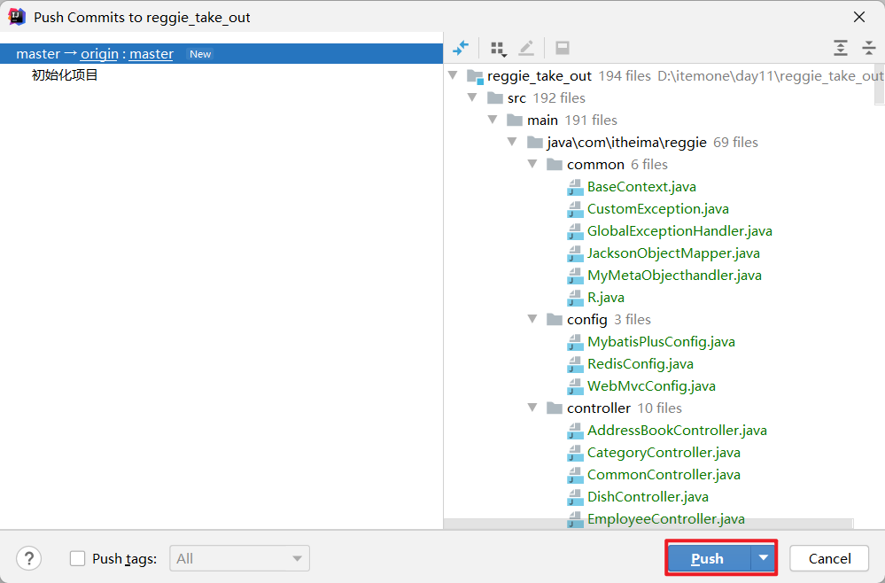

## 0 git命令速查表


## 1 后续课程展望


## 2 后续课程学习方式

```
重概念:  弄明白为啥学习这个技术,这个技术能够什么问题
轻代码:  命令是什么,代码怎么写,无所谓 (百度/文档 照着抄就行)
```

```
实际工作中是: 开卷考试
```

## 3 为什么要学习git

```
1) 我们需要一个帮我们自动合并代码的工具
2) 我们需要一个帮我们找回历史版本的工具
```

```
git: 是一个工具, 管理的是我们自己写代码
```

## 4 安装

```
诀窍: 闭着眼直接下一步
```

## 5 托管服务

免费第三方平台

```
github.com    国外服务器,时不时的会访问失败 
gitee.com     国内服务器
```

自己搭建

```
gitLab
```

|  |
| ------------------------------------------------------------ |


## 6 gitee注意事项

```ABAP
注意: 账号密码一定要记住!!!
```

```
1)私有的项目只能5个人同时使用,超出部分需要交钱
2)每个人5G空间, 单个文件大小50M
3)程序员可以创建开源的仓库和私有的仓库
```

## 7 开源的仓库

```
1)开源仓库 指的是 全球任何一个人都可以免费的下载源码
2)其他人只能下载、没有提交修改的权限
```

## 8 团队协作开发

|  |
| ------------------------------------------------------------ |

|  |
| ------------------------------------------------------------ |

## 9 版本库、暂存区、工作区

|  |
| -------------------------------------------------------- |

## 10 文件状态

|  |
| ------------------------------------------------------------ |

## 11 全局命令

```shell
设置用户信息
git config --global user.name "Jaye"
git config --global user.email "123@qq.com"

查看配置信息
git config --list
```

```ABAP
注意:  
1)name 和 email 能够保证别人能看懂就行了, 不需要和gitee的账号一致
2)上面的命令可以在cmd窗口中运行
```

## 12 本地操作命令

①基本命令

```shell
git init     在本地初始化Git仓库
git status   查看文件状态

git add .                 将文件的修改加入暂存区
git commit -m "注释信息"   将暂存区的文件修改提交到版本库

git log      查看日志
```

②回退命令

```shell
#撤销某个未执行commit命令的文件
git checkout HEAD 文件名

#撤销当前项目中所有未执行commit命令的文件
git reset --hard HEAD

#撤销某个指定的提交
git revert 版本号

#回退到指定版本
git reset --hard 版本号
```

## 13 远程操作命令

```shell
git clone 从远程仓库克隆

git remote  查看远程仓库
git remote add 添加远程仓库

git pull 从远程仓库拉取
git push 推送到远程仓库
```

```ABAP
重点: pull 和 push
```

## 14 初始化项目-命令行方式

```shell
1)创建本地仓库
git init

2)提交代码到本地仓库
git add .
git commit -m "初始化项目"

3)创建远程仓库

4)绑定本地仓库和远程仓库关系
git remote add  origin https://gitee.com/JayeTian/hellogit.git    
    
5)先拉取远程仓库的操作记录到本地[可选-只有当远程仓库不是空白仓库时需要执行]
git pull origin master --allow-unrelated-histories
    
6)提交代码到远程仓库
git push origin master
```

```ABAP
注意: 远程仓库必须是空白仓库(没有任何操作记录的仓库)
```

## 15 日常开发-步骤 (重点)

①第一天入职

```shell
git clone https://gitee.com/JayeTian/reggie_take_out.git

使用idea工具打开项目(熟悉代码)
```

②日常操作

```shell
1)提交修改代码到本地仓库
git add .
git commit -m "修改了xxBug"
    
2)先拉取远程仓库代码
git pull origin dev

3)推送代码到远程仓库
git push origin dev
```

③合并代码到主分支

> 场景:  当一个需求开发完成,并且经过测试人员严格测试后

```shell
1)切换到主分支
git checkout 分支名称
    
2)合并代码到主分支
git merge master

3)提交合并代码到本地仓库
git add .
git commit -m "合并代码xx需求的代码"
    
4)先拉取远程仓库代码
git pull origin dev

5)推送代码到远程仓库
git push origin dev
```

## 16 身份认证

1)第一次推送需要登录

|  |
| ------------------------------------------------------------ |

2)账号密码写错了怎么办

|  |
| ------------------------------------------------------------ |

## 17  分支操作

①为什么要使用分支

|  |
| ------------------------------------------------------------ |

②常见分支操作命令

```shell
查看分支
git branch 		列出所有本地分支
git branch -r 	列出所有远程分支
git branch -a 	列出所有本地分支和远程分支

创建分支   (注意:现在在那个分支上执行的命令, 那么新分支的代码就和那个分支一样)
git branch 分支名称

切换分支
git checkout 分支名称

创建并切换分支  (注意:现在在那个分支上执行的命令, 那么新分支的代码就和那个分支一样)
git checkout -b [branchName]

推送至远程仓库分支
git push [shortName] [name]   

合并分支   (注意: 将指定的分支合并到当前分支)
git merge [name]
```

## 18 标签(了解)

|  |
| ------------------------------------------------------------ |

```shell
git tag                           查看标签
git tag [name]                    创建标签
git push [shortName] [name]       将标签推送至远程仓库
git checkout -b [branch] [name]   检出标签
```

## 19 idea操作git

### 1)idea配置git


### 2)本地操作

| git init |
| ------------------------------------------------------------ |

| git add . |
| ------------------------------------------------------------ |

| git commit -m "xxx" |
| ------------------------------------------------------------ |

| git log |
| ------------------------------------------------------------ |

| git checkout head  文件名 |
| ------------------------------------------------------------ |

| git reset --hard 版本号 |
| ------------------------------------------------------------ |

| git revert 版本号 |
| ------------------------------------------------------------ |

### 3)远程操作

| git clone xxx |
| ------------------------------------------------------------ |

| git remote add origin xxx |
| ------------------------------------------------------------ |

| 绑定本地仓库和远程仓库关系时,URL路径写错了怎么办 |
| ------------------------------------------------------------ |

| git pull  和   git push    |
| ------------------------------------------------------------ |

### 4)分支操作

| git checkout -b  dev2 |
| ------------------------------------------------------------ |

| git merge [name] |
| ------------------------------------------------------------ |

### 5).gitignore文件的作用

```
过滤那些文件不需要git管理

注意事项
1).gitignore文件是需要上传到远程仓库的
2).gitignore文件名不能改
3).gitignore文件的存储必须和.git文件夹同级别
```


## 20 初始化项目-idea工具

### 本地操作

1)初始化本地仓库  " git init "


```ABAP
注意: 选择的文件夹一定要是本项目名称的文件夹!
```

2)添加.gitignore配置文件

```
方式一: 从其他项目中拷贝过来一个
方式二: 直接使用idea工具添加排除的文件/文件夹
```

```ABAP
注意: 一定要在初始化本地仓库后 立即做这件事!
```

3)提交代码到本地仓库

| git add . |
| ------------------------------------------------------------ |

| git commit -m "xxx" |
| ------------------------------------------------------------ |

### 远程操作

4)创建远程仓库

```ABAP
注意:
1)仓库的名称和项目名称保持一致
2)远程仓库必须是空白仓库
```

5)绑定本地仓库和远程仓库的关联关系

```
git remote add origin https://gitee.com/JayeTian/reggie_take_out.git
```


6)推送代码到远程

```
git push origin master
```




## 21 常见问题

### 1 不小心把不需要文件提交到了远程

```shell
1)在.gitignore文件中 添加过滤配置

2)取消版本跟踪 (从暂存区、本地仓库删除文件)
git rm --cached -r target/

3)提交操作到本地仓库
git add .
git commit -m "添加target/过滤配置"

4)推送代码到远程
git push origin master
```

### 2 回退版本并推送到远程

方式一:    reset     该方式会清除commit提交记录

```
1)"回退到"指定版本
git reset --hard 版本号

2)推送到远程
git push -f origin master
```

方式二:    revert   该方式不会清除commit提交记录

```
1)"回退"指定版本
git revert 版本号

2)推送到远程
git push origin master
```
