# 1 回顾

| 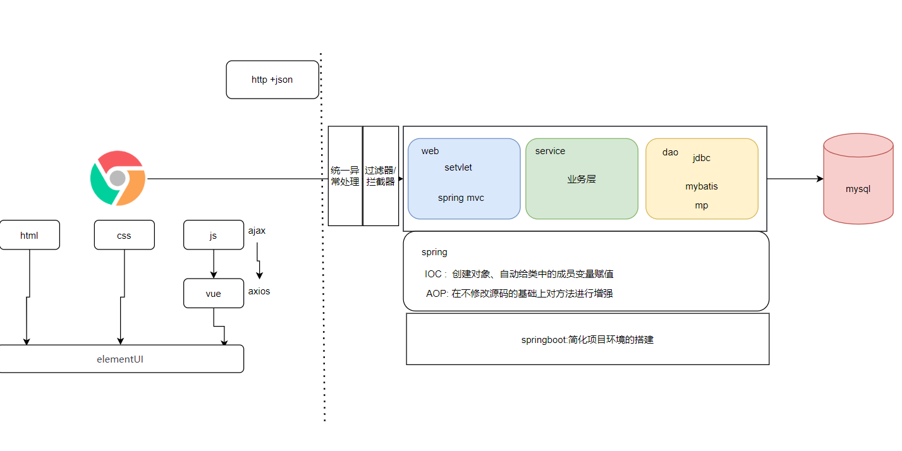 |
| ------------------------------------------------------------ |

# 2 讲课顺序

| 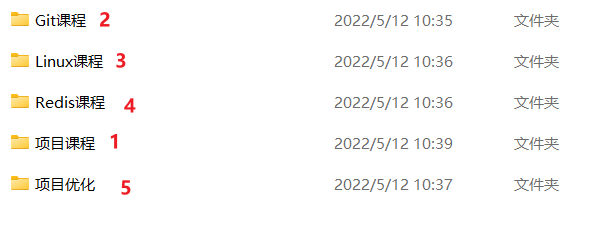 |
| ------------------------------------------------------------ |

# 3 软件开发流程

| 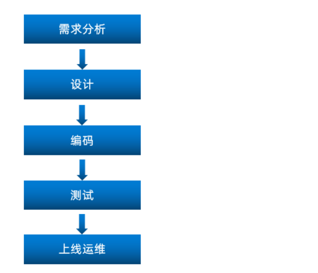 |
| ------------------------------------------------------------ |

```
1)收集需求、整理需求  (产品经理)
2)分配任务          (项目经理)
-----------------------------------------------------
3)分析需求                         1                                      
  1)看不懂 (问产品、开会)
  2)确认需求 (自己理解是否正确)
4)分析代码、设计代码                  1          
  表、字段、逻辑
5)写代码                            1                   
6)自己测试
7)提交给测试人员(专业的测试)          1
8)修改bug                         1
-----------------------------------------------------
9)再次测试、用户测试
10)上线 (运维干的)
```

```
5天  写代码2天
看文档、写文档、沟通、分析需求

对程序员的要求
1)沟通能力
2)表达能力
3)写文档的能力
4)编码能力
```

# 4 角色

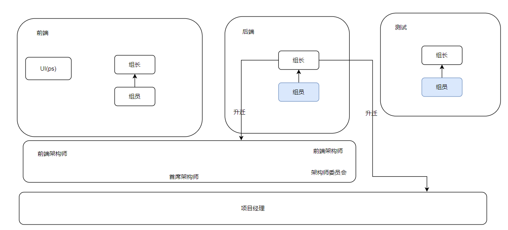

# 5 产品原型

```
什么是产品原型: 由产品经理设计的界面化的需求文档
```

| 谷歌浏览器如何打开产品原型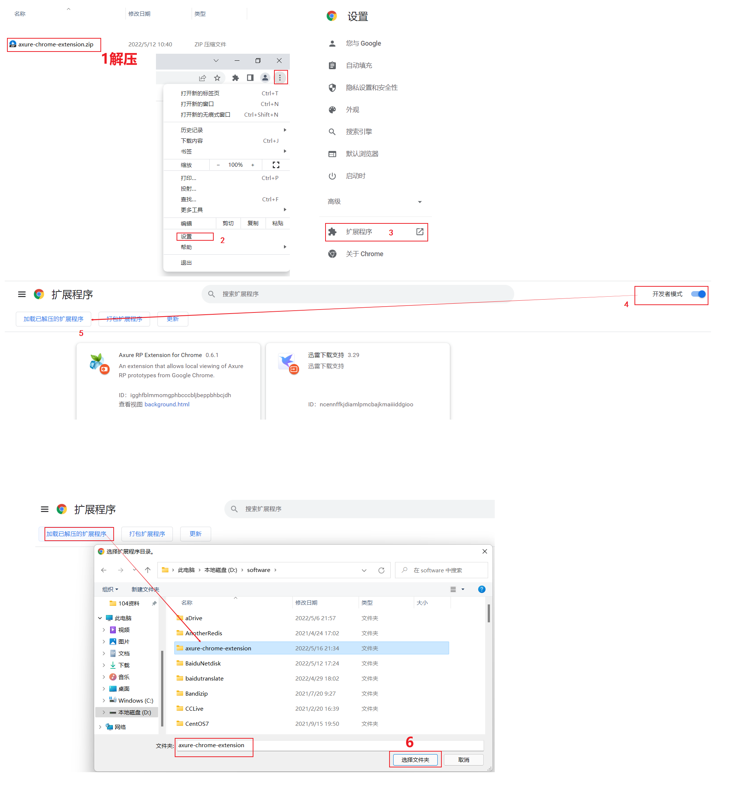 |
| ------------------------------------------------------------ |

# 6 技术选型

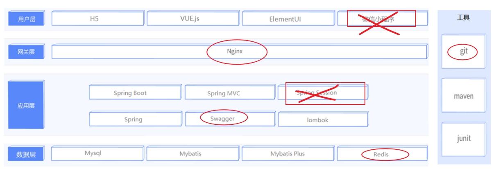

# 7 项目设计

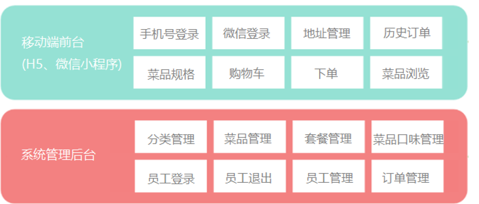

# 8 数据库导入

0)SQL脚本在哪?

```
项目一瑞吉点餐\项目课程\资料\数据模型\db_reggie.sql
```

1)命令行

```mysql
create database reggie character set utf8mb4;
use reggie;
source D:\xxx\db_reggie.sql
```

2)可视化工具 Navicat

| 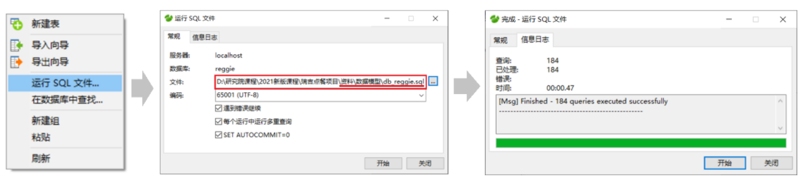 |
| ------------------------------------------------------------ |

3)可视化工具DBEaver

| 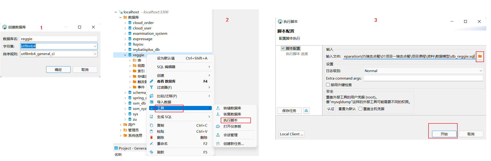 |
| ---------------------------------------------------- |

```ABAP
注意: 运行SQL脚本出现异常-直接拷贝SQL脚本文件中的到SQL控制台运行就行了
```

4)可视化工具 idea

| 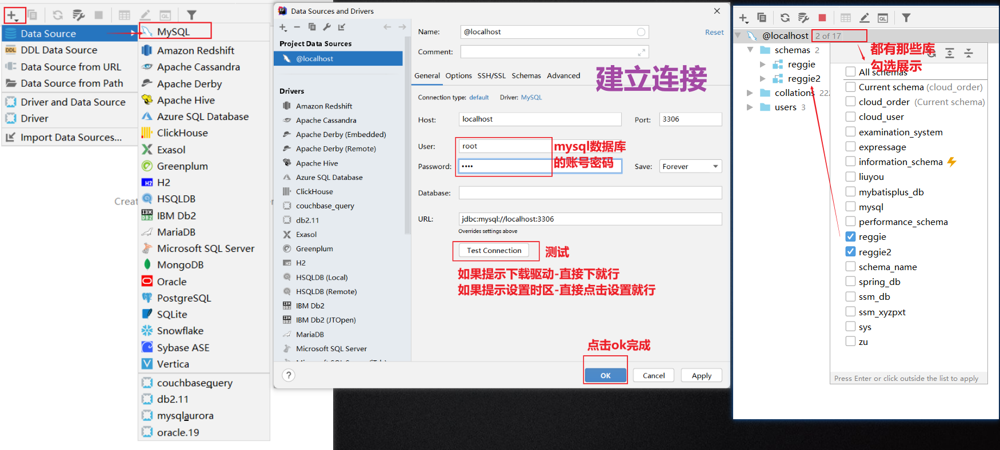 |
| ------------------------------------------------------------ |

| 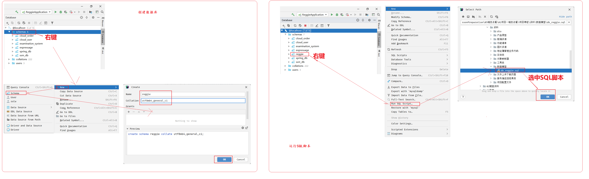 |
| ---------------------------------------------- |

------


# 9 环境搭建

### 1)创建一个普通的maven项目

### 2)导入坐标

```xml
<parent>
    <groupId>org.springframework.boot</groupId>
    <artifactId>spring-boot-starter-parent</artifactId>
    <version>2.4.5</version>
    <relativePath/> <!-- lookup parent from repository -->
</parent>

<groupId>com.itheima</groupId>
<artifactId>reggie_take_out</artifactId>
<version>1.0-SNAPSHOT</version>

<properties>
    <java.version>1.8</java.version>
</properties>

<dependencies>    
    <dependency>
        <groupId>org.springframework.boot</groupId>
        <artifactId>spring-boot-starter</artifactId>
    </dependency>

    <dependency>
        <groupId>org.springframework.boot</groupId>
        <artifactId>spring-boot-starter-test</artifactId>
        <scope>test</scope>
    </dependency>

    <dependency>
        <groupId>org.springframework.boot</groupId>
        <artifactId>spring-boot-starter-web</artifactId>
        <scope>compile</scope>
    </dependency>

    <dependency>
        <groupId>com.baomidou</groupId>
        <artifactId>mybatis-plus-boot-starter</artifactId>
        <version>3.4.2</version>
    </dependency>

    <dependency>
        <groupId>org.projectlombok</groupId>
        <artifactId>lombok</artifactId>
        <version>1.18.20</version>
    </dependency>

    <dependency>
        <groupId>com.alibaba</groupId>
        <artifactId>fastjson</artifactId>
        <version>1.2.76</version>
    </dependency>

    <dependency>
        <groupId>commons-lang</groupId>
        <artifactId>commons-lang</artifactId>
        <version>2.6</version>
    </dependency>

    <dependency>
        <groupId>mysql</groupId>
        <artifactId>mysql-connector-java</artifactId>
        <scope>runtime</scope>
    </dependency>

    <dependency>
        <groupId>com.alibaba</groupId>
        <artifactId>druid-spring-boot-starter</artifactId>
        <version>1.1.23</version>
    </dependency>

</dependencies>

<build>
    <plugins>
        <plugin>
            <groupId>org.springframework.boot</groupId>
            <artifactId>spring-boot-maven-plugin</artifactId>
            <version>2.4.5</version>
        </plugin>
    </plugins>
</build>
```

```ABAP
注意: 
①pom.xml文件的jar包版本一定要和视频中提供一样!
②项目的本身的g、a、v不要从拷贝笔记上的,项目创建出来什么样就什么样不要动!
```

### 3)启动类

```java
@Slf4j
@SpringBootApplication
public class ReggieApplication {
    public static void main(String[] args) {
        SpringApplication.run(ReggieApplication.class,args);
        log.info("项目启动成功...");
    }
}
```

### 4)yaml配置文件

```yaml
server:
  port: 8080
spring:
  application:
    #应用的名称，可选
    name: reggie_take_out
  datasource:
    driver-class-name: com.mysql.cj.jdbc.Driver
    url: jdbc:mysql://localhost:3306/reggie?characterEncoding=utf-8&useSSL=false&serverTimezone=Asia/Shanghai
    username: root
    password: root
mybatis-plus:
  configuration:
    #在映射实体或者属性时，将数据库中表名和字段名中的下划线去掉，按照驼峰命名法映射
    map-underscore-to-camel-case: true
    log-impl: org.apache.ibatis.logging.stdout.StdOutImpl
  global-config:
    db-config:
      id-type: ASSIGN_ID
```

### 5)静态资源配置

5.1)静态资源哪里找

```
项目一瑞吉点餐\项目课程\资料\前端资源
```

5.2)拷贝

```
拷贝到resources目录下
```

5.3)编写静态资源过滤器

```java
@Slf4j
@Configuration
public class WebMvcConfig extends WebMvcConfigurationSupport {
    /**
     * 设置静态资源映射
     * @param registry
     */
    @Override
    protected void addResourceHandlers(ResourceHandlerRegistry registry) {
        log.info("开始进行静态资源映射...");
        registry.addResourceHandler("/backend/**").addResourceLocations("classpath:/backend/");
        registry.addResourceHandler("/front/**").addResourceLocations("classpath:/front/");
    }
    
}
```

5.4)注意事项

```ABAP
①不要将静态资源放到static目录下,后面有坑
②配置静态资源过滤器的时候,classpath:不能丢!
```

| classpath 代表编译路径的根路径, 编译路径的根路径指的是WEB-INF下面的classes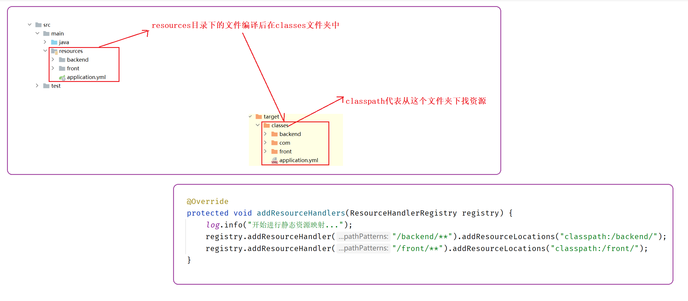 |
| ------------------------------------------------------------ |

# 10 后端代码结构

dao层: MP

```java
import com.baomidou.mybatisplus.core.mapper.BaseMapper;
import com.itheima.reggie.entity.Employee;
import org.apache.ibatis.annotations.Mapper;

@Mapper
public interface EmployeeMapper extends BaseMapper<Employee>{
		
}
```

service层: MP

```java
import com.baomidou.mybatisplus.extension.service.IService;
import com.itheima.reggie.entity.Employee;

public interface EmployeeService extends IService<Employee> {


}
```

```java
/**
 *  ServiceImpl 泛型
 *  第一泛型:  定义使用那个dao对象
 *  第二泛型:  定义使用那个实体类封装查询的结果
 */
@Service
public class EmployeeServiceImpl extends ServiceImpl<EmployeeMapper, Employee> implements EmployeeService {
    
    

}
```

controller层:  springmvc

```java
@Slf4j
@RestController
@RequestMapping("/employee")
public class EmployeeController {

    @Autowired
    private EmployeeService employeeService;
    
}
```

实体类: lombok

```java
@Data
public class Employee implements Serializable {

    private static final long serialVersionUID = 1L;

    private Long id;

    private String username;
		
    //..........

}
```

# 11 泛型

1)泛型类

```
在类名后面使用<>加大写字母定义了泛型的类,叫泛型类
```

| 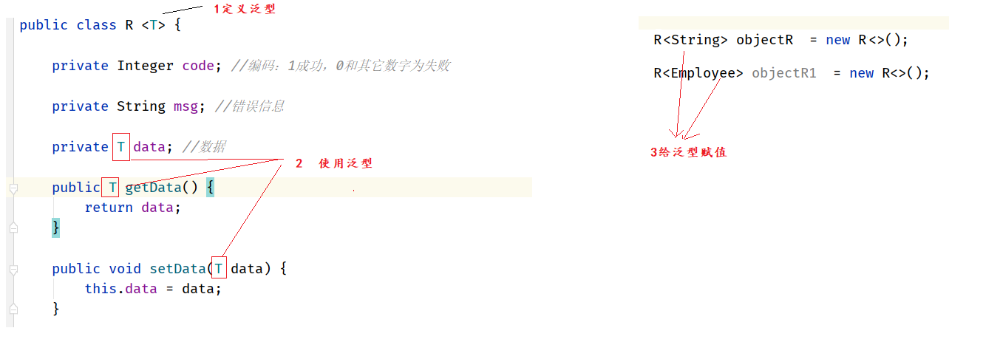 |
| ------------------------------------------------------------ |

2)泛型方法

```
在方法的返回值前面使用<>加大写字母定义了泛型的方法,叫泛型方法
```

| 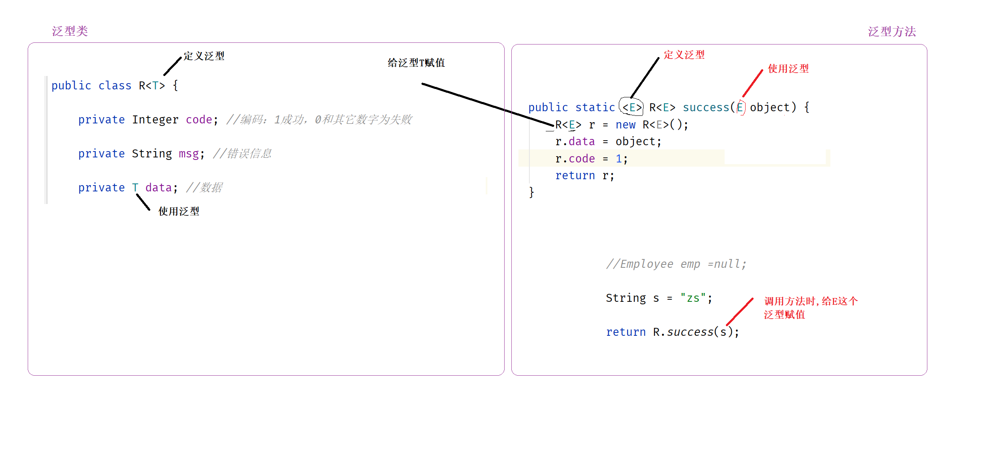 |
| ------------------------------ |

# 12 浏览器控制台说明

| 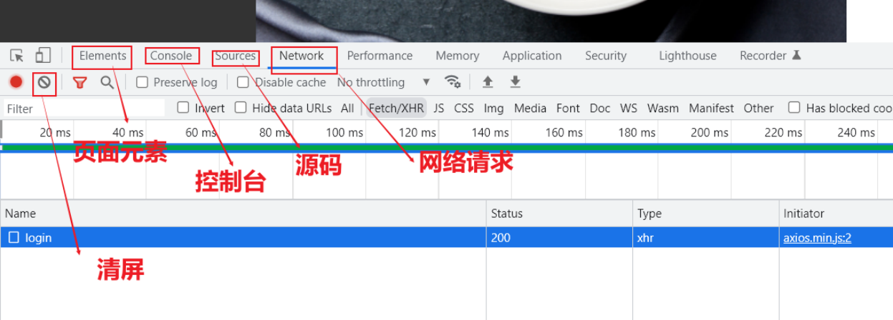 |
| ------------------------------------------------------------ |

# 13 管理端登录功能

## 13.1)开发套路

①需求分析:  思考要实现什么效果

```ABAP
验证用户名、密码是否正确,检验账号是否被禁用
成功: 存储登录状态到session中,响应登录成功
失败: 直接响应登录失败
```

②前后端交互:  分析请求路径、请求类型、请求参数、返回值 ( 未来工作中有文档 )

方式一: 分析前端代码

| 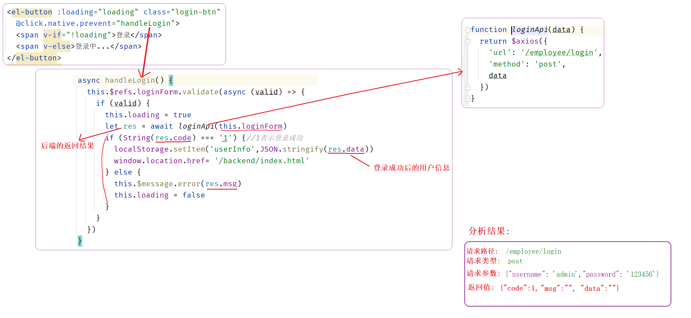 |
| ------------------------------------------------------------ |

方式二:  浏览器 F12

| 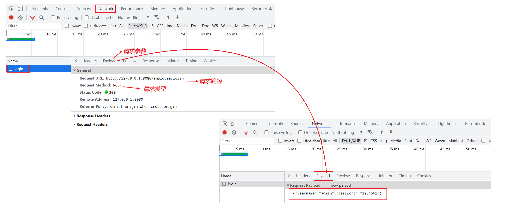 |
| ------------------------------------------------------------ |

③需求分析:   SQL语句、代码逻辑

```ABAP
1)将接收到的明文密码使用MD5加密, 拿到密文后和数据库中保存的密文进行比较
2)通过账号查询用户信息 SQL: select * from employee where username = 'admin';
3)保存登录成功状态到session中
```

④代码实现

```java
@PostMapping("/login")
public R<Employee> login(HttpServletRequest request, @RequestBody Employee employee) {
    //1、将页面提交的密码password进行md5加密处理
    String password = employee.getPassword();
    password = DigestUtils.md5DigestAsHex(password.getBytes());

    //2、根据页面提交的用户名username查询数据库
    LambdaQueryWrapper<Employee> queryWrapper = new LambdaQueryWrapper<>();
    queryWrapper.eq(Employee::getUsername, employee.getUsername());
    Employee emp = employeeService.getOne(queryWrapper);

    //3、如果没有查询到则返回登录失败结果
    if (emp == null) {
        return R.error("登录失败");
    }

    //4、密码比对，如果不一致则返回登录失败结果
    if (!emp.getPassword().equals(password)) {
        return R.error("登录失败");
    }

    //5、查看员工状态，如果为已禁用状态，则返回员工已禁用结果
    if (emp.getStatus() == 0) {
        return R.error("账号已禁用");
    }

    //6、登录成功，将员工id存入Session并返回登录成功结果
    request.getSession().setAttribute("employee", emp.getId());
    return R.success(emp);
}
```


## 13.2)常见疑问

①md5加密

为什么要加密

```
数据库泄露了
银行内部员工可以直接看到你的银行卡密码
```

怎么加密

```
可逆加密: 古希腊战争
hello   --加密--  IFMMP


MD5特性 
栗子: 123456  --MD5-->  e10adc3949ba59abbe56e057f20f883e
1)不可逆加密  
2)加密后密文是固定
```

```java
public class Md5Test {

    public static void main(String[] args) {
        String str = "123456";
		
        //注意: md5DigestAsHex方法的参数类型是 byte[] 
        String pwd = DigestUtils.md5DigestAsHex(str.getBytes());

        System.out.println(pwd);
    }

}
```

②service层代码继承IService接口, 继承ServiceImpl类的作用

| 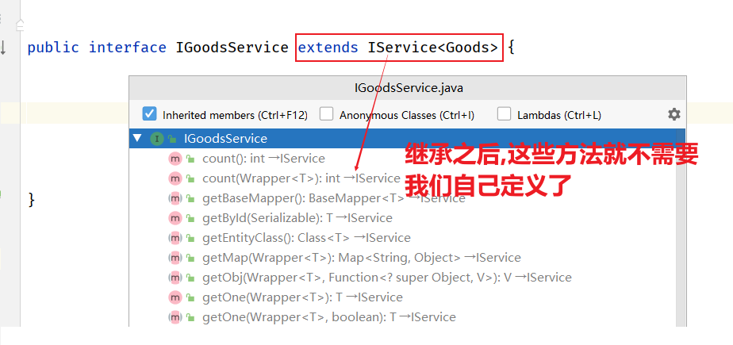 |
| ------------------------------------------------------------ |

| 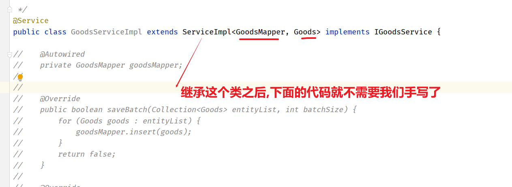 |
| ------------------------------------------------------------ |

| 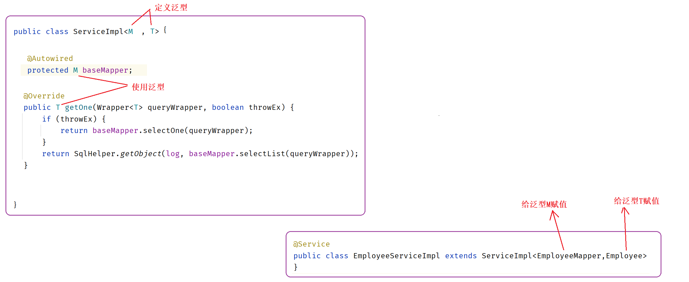 |
| ------------------------------------------------------------ |

③登录验证通过后,为什么要将登录状态存储session中

| 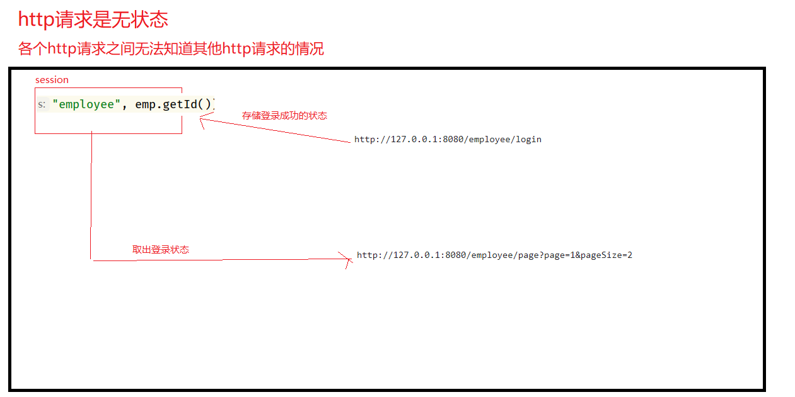 |
| ------------------------------------------------------------ |


# 14 回顾: 如何接收参数

```
1) json格式的参数,使用@RequestBody接收   栗子: {"username":"admin","password":"123456333"}
2) url地址参数,使用@RequestParam接收     栗子: http://127.0.0.1:8080/employee/login?id=666
3) 路径参数,使用@PathVariable接收        栗子: http://127.0.0.1:8080/employee/login/666
```


# 15 管理端退出功能

## 15.1)开发套路

①需求分析:思考要实现什么效果

```
销毁session中的登录状态,响应退出成功
```

②前后端交互: 分析请求路径、请求类型、请求参数、返回值 ( 未来工作中有文档 )

方式一:  分析前端代码

| 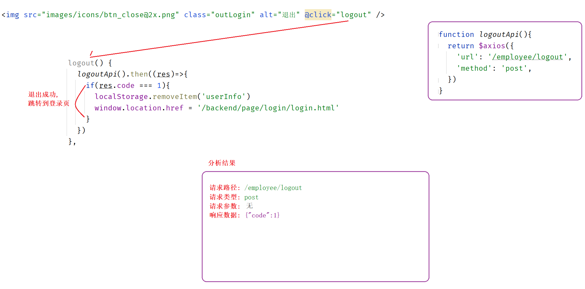 |
| ------------------------------------------------------------ |

方式二: 浏览器F12

| 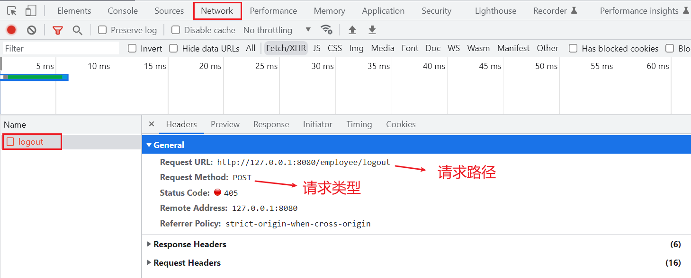 |
| ------------------------------------------------------------ |

③代码实现

```java
@PostMapping("/logout")
public R<String> logout(HttpServletRequest request) {
    //清理Session中保存的当前登录员工的id
    request.getSession().removeAttribute("employee");
    return R.success("退出成功");
}
```


## 15.2)常见疑问

①为什么要销毁session中的登录状态

```
销毁session中的登录状态后,需要登录的才能访问的请求就无法从session中获取登录状态,从而判断登录状态为未登录
```

| 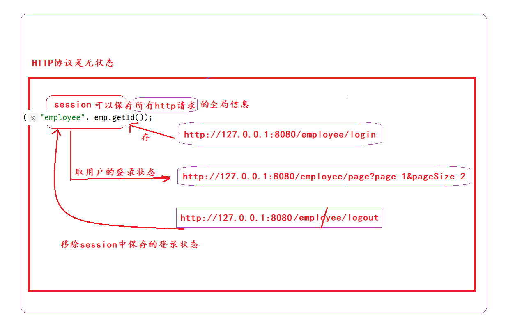 |
| ------------------------------------------------------------ |

②为什么返回值R的泛型写成String

```
其实在退出登录这个controller方法中,返回值R的泛型定义成什么都无所谓,就算是不写也没关系
因为R的泛型代表data成员变量的类型,而退出登录只需要响应一个code值(退出成功)就行了,并没有用到data这个成员变量
详解: 见笔记上第11项泛型类 和 第15项中的前后端交互分析
```

