# 1 登录校验-过滤器

## 1.1)开发套路

①需求分析:  思考要实现什么效果

```ABAP
使用过滤器 拦截所有http请求,将需要登录且未登录的情况下的请求,直接响应未登录

1)有些路径不需要登录
  直接放行

2)有些路径是需要登录
  用户已登录:  直接放行
  用户未登录:  返回未登录-不放行
```

| 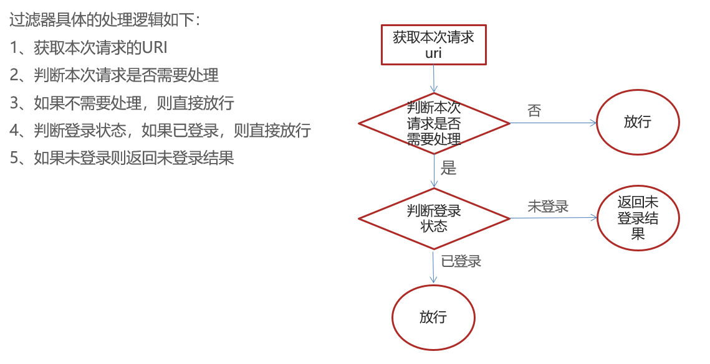 |
| ------------------------------------------------------------ |

②前后端交互:   返回值 ( 未来工作中有文档 )

| 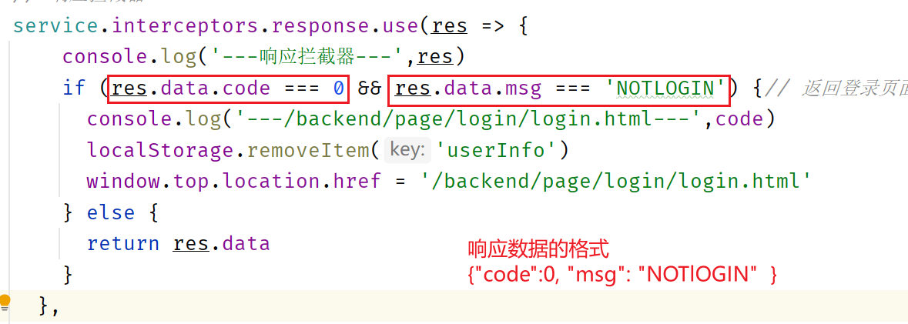 |
| ------------------------------------------------------------ |

③代码实现

```java
import com.alibaba.fastjson.JSON;
import com.itheima.reggie.common.R;
import lombok.extern.slf4j.Slf4j;
import org.springframework.util.AntPathMatcher;
import javax.servlet.*;
import javax.servlet.annotation.WebFilter;
import javax.servlet.http.HttpServletRequest;
import javax.servlet.http.HttpServletResponse;
import java.io.IOException;
import java.util.Arrays;
import java.util.List;

/**
 * 检查用户是否已经完成登录
 */
@WebFilter(urlPatterns = "/*")
@Slf4j
public class LoginCheckFilter implements Filter {

    //路径匹配器，支持通配符
    public static final AntPathMatcher PATH_MATCHER = new AntPathMatcher();

    //定义不需要处理的请求路径
    public static final List<String> urls = Arrays.asList("/employee/login", "/employee/logout", "/backend/**", "/front/**");

    @Override
    public void doFilter(ServletRequest servletRequest, ServletResponse servletResponse, FilterChain filterChain) throws IOException, ServletException {
        HttpServletRequest request = (HttpServletRequest) servletRequest;
        HttpServletResponse response = (HttpServletResponse) servletResponse;

        //1、获取本次请求的URI
        String requestURI = request.getRequestURI();//  /backend/index.html
        log.info("拦截到请求：{}", requestURI);

        //2、判断本次请求是否需要处理
        boolean check = check(requestURI);
        
        //3、如果不需要处理，则直接放行
        if (check) {
            log.info("本次请求{}不需要处理", requestURI);
            filterChain.doFilter(request, response);
            return;
        }

        //4、判断登录状态，如果已登录，则直接放行
        if (request.getSession().getAttribute("employee") != null) {
            log.info("用户已登录，用户id为：{}", request.getSession().getAttribute("employee"));
            filterChain.doFilter(request, response);
            return;
        }
		
         //5、如果未登录则返回未登录结果，通过输出流方式向客户端页面响应数据
        log.info("用户未登录");
        response.getWriter().write(JSON.toJSONString(R.error("NOTLOGIN")));
        return;

    }

    /**
     * 路径匹配，检查本次请求是否需要放行
     *
     * @param requestURI
     * @return
     */
    public boolean check(String requestURI) {
        for (String url : urls) {
            boolean match = PATH_MATCHER.match(url, requestURI);
            if (match) {
                return true;
            }
        }
        return false;
    }

}
```

⑥功能测试


## 1.2)常见疑问

①@ServletComponentScan注解

| 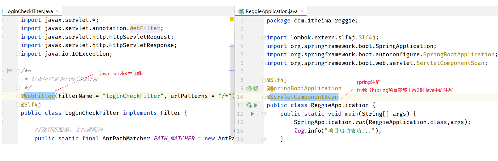 |
| ------------------------------------------------------------ |

②URI 和URL的区别

| 更多操作 |
| ------------------------------------------------------------ |

③日志打印

|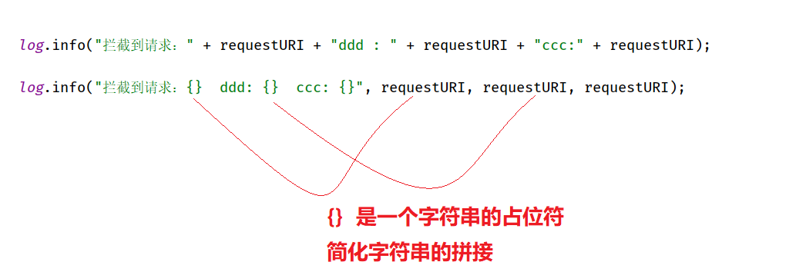 |
| ------------------------------------------------------------ |

④@WebFilter注解的属性

```java
@WebFilter(filterName = "loginCheckFilter", urlPatterns = "/*")

属性filterName:  定义的内容相当于IOC容器中的BeanId,这里写不写都行我们用不到
属性urlPatterns: 定义拦截的请求,"/*"代表拦截所有请求
```

⑤AntPathMatcher的作用

```java
public static final AntPathMatcher PATH_MATCHER = new AntPathMatcher();

//参数一:  url 匹配规则               栗子:  /backend/**
//参数二:  requestURI需要匹配的URI     栗子:  /backend/index.html
//返回值:  匹配成功返回true、匹配失败返回flase

boolean match = PATH_MATCHER.match(url, requestURI);
```

| 符号 | 含义                   |
| ---- | ---------------------- |
| ?    | 匹配一个字符           |
| *    | 匹配0个或多个字符      |
| **   | 匹配0个或多个目录/字符 |


# 2 添加员工

## 2.1)开发套路

①需求分析:  思考要实现什么效果

```ABAP
向员工表(employee)中添加一条数据,并向前端响应添加成功或者添加失败
```

②前后端交互:   分析请求路径、请求类型、请求参数、返回值 ( 未来工作中有文档 )

方式一: 分析前端代码

| 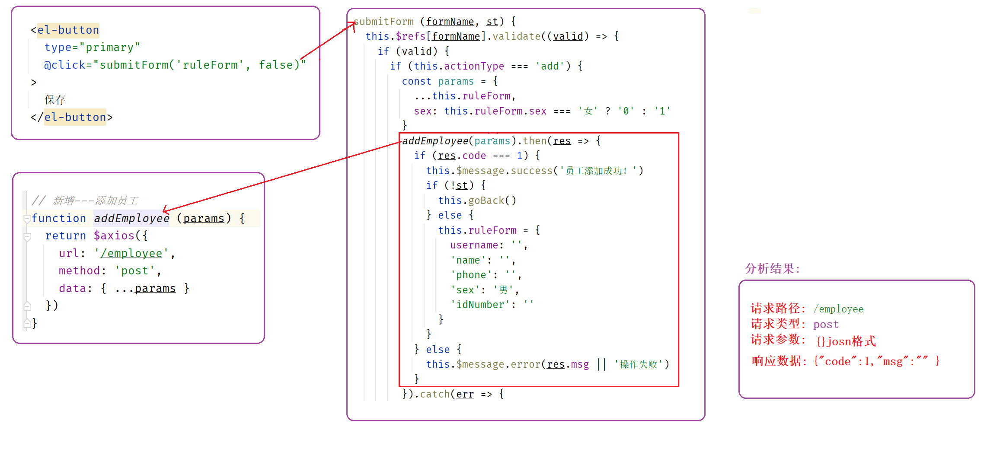 |
| ------------------------------------------------------------ |

方式二: 浏览器F12

| 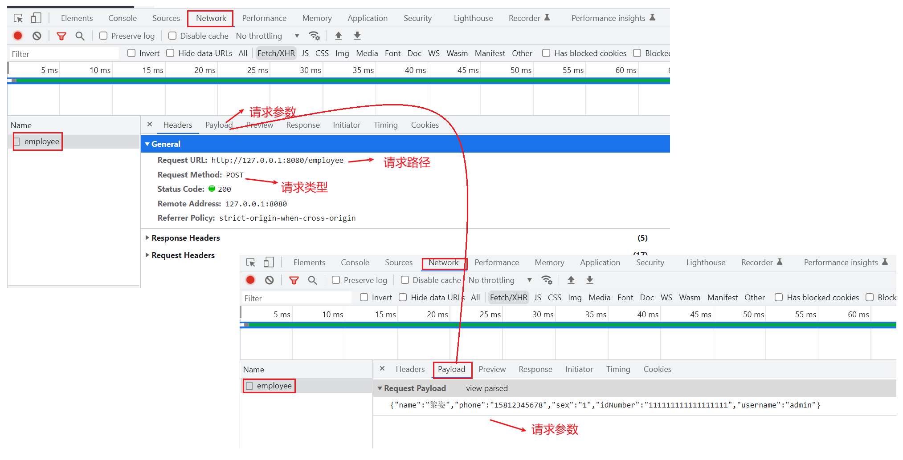 |
| ------------------------------------------------------------ |

③需求分析:  SQL语句、表结构、代码逻辑

| 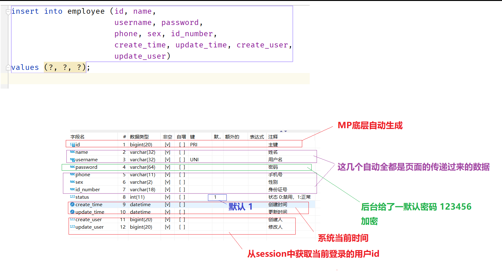 |
| ------------------------------------------------------------ |

④代码实现

```java
@PostMapping
public R<String> save(HttpServletRequest request, @RequestBody Employee employee) {
    log.info("新增员工，员工信息：{}", employee.toString());

    //设置初始密码123456，需要进行md5加密处理
    employee.setPassword(DigestUtils.md5DigestAsHex("123456".getBytes()));

    // new Date();
    // JDK8  LocalDateTime.now()
    employee.setCreateTime(LocalDateTime.now());
    employee.setUpdateTime(LocalDateTime.now());

    //获得当前登录用户的id
    Long empId = (Long) request.getSession().getAttribute("employee");

    employee.setCreateUser(empId);
    employee.setUpdateUser(empId);

    employeeService.save(employee);

    return R.success("新增员工成功");
}
```

⑤功能测试


## 2.2)常见疑问

①LocalDateTime是啥

```
LocalDateTime是JDK8给我们提供的一个时间类,调用该类中的静态方法now()可以获取系统的当前时间,等价于new Date()
注意:setCreateTime方法不能传递一个Date对象,因为数据类型不一样。错误栗子:employee.setCreateTime(new Date());
```


# 3 统一异常处理

3.1)简介

```
统一异常处理底层是利用的AOP思想对异常进行的统一处理
AOP思想: 在不修改源码的基础上对功能进行统一增强!
```

3.2)统一异常处理原理图

| 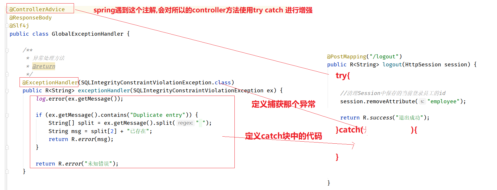 |
| ------------------------------------------------------------ |

3.3)一个@ExceptionHandler代表一个catch

| 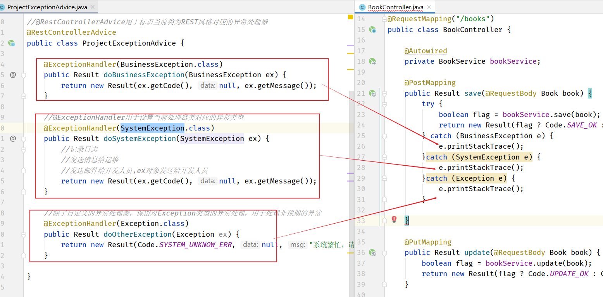 |
| ------------------------------------------------------------ |

3.4)全局异常处理的坑

| 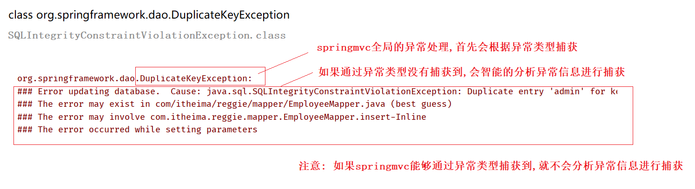 |
| ------------------------------------------------------------ |

3.5)代码实现

```java
/**
 * 全局异常处理
 * @RestControllerAdvice是复合注解: @ControllerAdvice  + @ResponseBody
 */
@Slf4j
@RestControllerAdvice
public class GlobalExceptionHandler {

    /**
     * 异常处理方法
     * @param e
     * @return
     */
    @ExceptionHandler(DuplicateKeyException.class)
    public R<String> exceptionHandler(DuplicateKeyException e) {
        log.error(e.getMessage(), e);

        String[] split = e.getMessage().split(" ");
        String msg = split[9] + "已存在";

        return R.error(msg);
    }

    /**
     * 兜底的异常处理
     * @param e
     * @return
     */
    @ExceptionHandler(Exception.class)
    public R exception(Exception e) {
        log.error(e.getMessage(), e);
        return R.error("您的网络有问题,请稍后重试!");
    }


}
```


# 4 员工分页查询

## 4.1)开发套路

①需求分析:  思考要实现什么效果

```ABAP
分页查询员工信息
```

②前后端交互:  分析请求路径、请求类型、请求参数、返回值 ( 未来工作中有文档 )

方式一: 分析前端代码

| 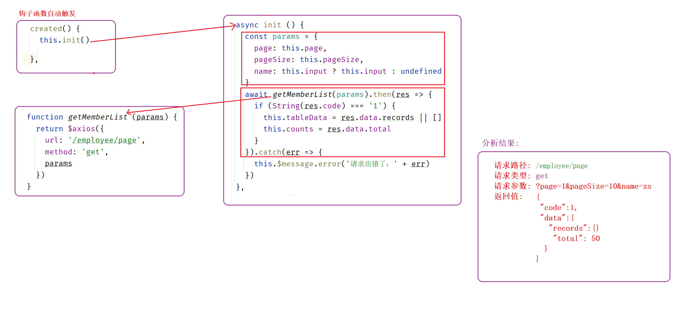 |
| ------------------------------------------------------------ |

方式二:  浏览器F12

| 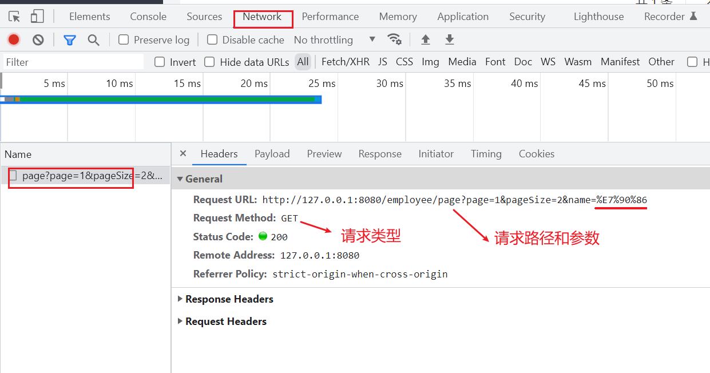 |
| ------------------------------------------------------------ |

③编写对应的controller方法

```java
//重点关注: 映射关系、参数、返回值
@GetMapping("/page")
public R<Page> page(int page, int pageSize, String name) {
    log.info("page = {},pageSize = {},name = {}", page, pageSize, name);

    return R.success(pageInfo);
}
```

④需求分析:  SQL语句、代码逻辑、表结构

```sql
select  COUNT(*) from employee where name like '%管%';

select * from employee where name like '%管%' order by update_time desc limit 0,10;
```

⑤代码实现

```java
@GetMapping("/page")
public R<Page> page(int page, int pageSize, String name) {
    log.info("page = {},pageSize = {},name = {}", page, pageSize, name);

    //构造分页构造器
    Page pageInfo = new Page(page, pageSize);

    //构造条件构造器
    LambdaQueryWrapper<Employee> queryWrapper = new LambdaQueryWrapper();
    //添加过滤条件
    queryWrapper.like(StringUtils.isNotBlank(name), Employee::getName, name);
    //添加排序条件
    queryWrapper.orderByDesc(Employee::getUpdateTime);

    //执行查询
    employeeService.page(pageInfo, queryWrapper);

    return R.success(pageInfo);
}
```

| 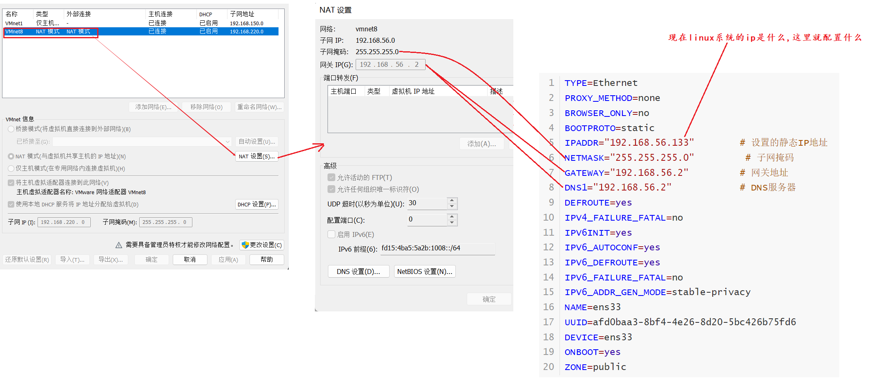 |
| ---------------------- |

⑥功能测试

## 4.2)常见疑问

①字符串非空判断

方法一:  自己处理

```java
if (name != null  &&  !"".equals(name)){

}
```

方法二:  使用工具类

```
StringUtils.isNotBlank(name);

优点: 可读性强、代码简单
注意: 导包 import org.apache.commons.lang.StringUtils;
```

```java
public static void main(String[] args) {
    String name = "  ";

    //boolean b = StringUtils.isNotEmpty(name);
    //System.out.println(b);

    boolean b = StringUtils.isNotBlank(name);  //具有去掉两头空串的功能
    System.out.println(b);
}
```

# 6 rest风格

```
rest风格: 使用请求路径+请求类型 来确定对应的controller方法是那个!
post   添加
get    查询
put    修改
delete 删除
```

# 7 员工禁用启用

## 7.1)开发套路

①需求分析: 思考要实现什么效果

```
禁用:  将对应员工在数据库中的status字段的值改成 0
启动:  将对应员工在数据库中的status字段的值改成 1
```

②前后端交互:分析请求路径、请求类型、请求参数、返回值 ( 未来工作中有文档 )

方式一: 分析前端代码

| 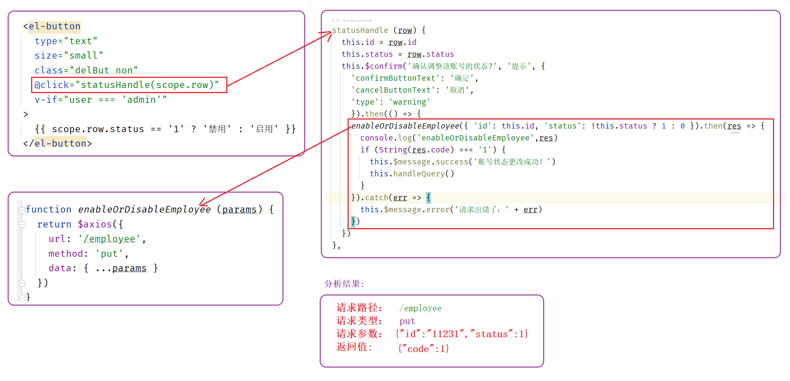 |
| ------------------------------------------------------------ |

方式二: 浏览器F12

| 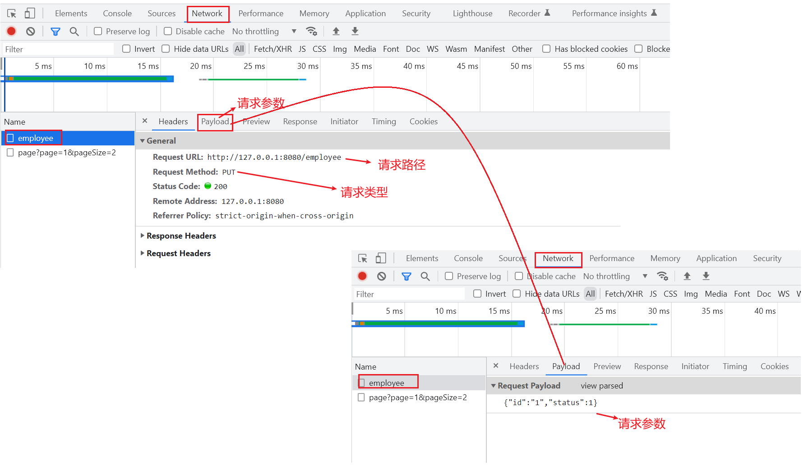 |
| ------------------------------------------------------------ |

③编写对应的controller方法

```java
//重点关注: 映射关系、参数、返回值
@PutMapping
public R<String> update(HttpServletRequest request, @RequestBody Employee employee) {
    log.info(employee.toString());

    return R.success("员工信息修改成功");
}
```

④需求分析:SQL语句、代码逻辑、表结构

| 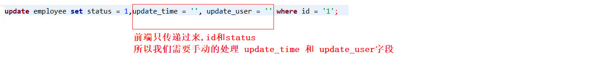 |
| ------------------------------------------------------------ |

⑤代码实现

```java
@PutMapping
public R<String> update(HttpServletRequest request, @RequestBody Employee employee) {
    log.info(employee.toString());

    Long empId = (Long) request.getSession().getAttribute("employee");
    
    employee.setUpdateTime(LocalDateTime.now());
    employee.setUpdateUser(empId);

    //执行更新时,MP底层 会自动判断 只会更新非空字段
    employeeService.updateById(employee);

    return R.success("员工信息修改成功");
}
```

⑥功能测试


# 8 js long类型精度丢失问题

## 8.1)问题分析

```
问题:
  js语言最多处理16位的数字, 多余的长度会出现精度丢失

如何解决:
  返回数据时,将long类型数据,转换成字符串返回给前端

怎么才能返回字符串呢?
  把java对象转换成JSON数据时的逻辑给改了,遇到long类型的成员变量将其变成String类型再返回
```

## 8.2) 消息转换器

1)什么是消息转换器

| 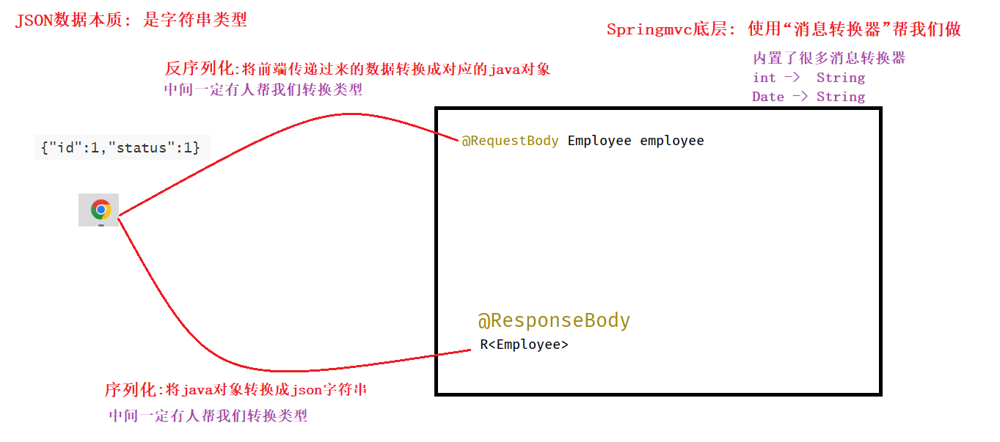 |
| ------------------------------------------------------------ |

2)实现方式

方式一:  注解方式

```java
@JsonSerialize(using = ToStringSerializer.class)
private Long id;
    
@JsonFormat(pattern = "yyyy-MM-dd HH:mm:ss")
private LocalDateTime createTime;
```

方式二:  全局处理

```java
//定义消息转换器
public class JacksonObjectMapper extends ObjectMapper {

    public static final String DEFAULT_DATE_FORMAT = "yyyy-MM-dd";
    public static final String DEFAULT_DATE_TIME_FORMAT = "yyyy-MM-dd HH:mm:ss";
    public static final String DEFAULT_TIME_FORMAT = "HH:mm:ss";

    public JacksonObjectMapper() {
        super();
        //收到未知属性时不报异常
        this.configure(FAIL_ON_UNKNOWN_PROPERTIES, false);

        //反序列化时，属性不存在的兼容处理
        this.getDeserializationConfig()
            .withoutFeatures(DeserializationFeature.FAIL_ON_UNKNOWN_PROPERTIES);

        SimpleModule simpleModule = new SimpleModule()
            .addDeserializer(LocalDateTime.class, new LocalDateTimeDeserializer(DateTimeFormatter.ofPattern(DEFAULT_DATE_TIME_FORMAT)))
            .addDeserializer(LocalDate.class, new LocalDateDeserializer(DateTimeFormatter.ofPattern(DEFAULT_DATE_FORMAT)))
            .addDeserializer(LocalTime.class, new LocalTimeDeserializer(DateTimeFormatter.ofPattern(DEFAULT_TIME_FORMAT)))

            .addSerializer(BigInteger.class, ToStringSerializer.instance)
            .addSerializer(Long.class, ToStringSerializer.instance)
            .addSerializer(LocalDateTime.class, new LocalDateTimeSerializer(DateTimeFormatter.ofPattern(DEFAULT_DATE_TIME_FORMAT)))
            .addSerializer(LocalDate.class, new LocalDateSerializer(DateTimeFormatter.ofPattern(DEFAULT_DATE_FORMAT)))
            .addSerializer(LocalTime.class, new LocalTimeSerializer(DateTimeFormatter.ofPattern(DEFAULT_TIME_FORMAT)));

        //注册功能模块 例如，可以添加自定义序列化器和反序列化器
        this.registerModule(simpleModule);
    }
}
```

```java
//将自定义的消息转换器交给springmvc
@Slf4j
@Configuration
public class WebMvcConfig extends WebMvcConfigurationSupport {

    /**
     * 设置静态资源映射
     */
    @Override
    protected void addResourceHandlers(ResourceHandlerRegistry registry) {
        log.info("开始进行静态资源映射...");
        registry.addResourceHandler("/backend/**").addResourceLocations("classpath:/backend/");
        registry.addResourceHandler("/front/**").addResourceLocations("classpath:/front/");
    }

    /**
     * 扩展mvc框架的消息转换器
     */
    @Override
    protected void extendMessageConverters(List<HttpMessageConverter<?>> converters) {
        log.info("扩展消息转换器...");
        //创建消息转换器对象
        MappingJackson2HttpMessageConverter messageConverter = 
                                                new MappingJackson2HttpMessageConverter();
        //设置对象转换器，底层使用Jackson将Java对象转为json
        messageConverter.setObjectMapper(new JacksonObjectMapper());
        //将上面的消息转换器对象追加到mvc框架的转换器集合中
        converters.add(0, messageConverter);
    }

}
```

## 8.3)静态资源访问的坑

| 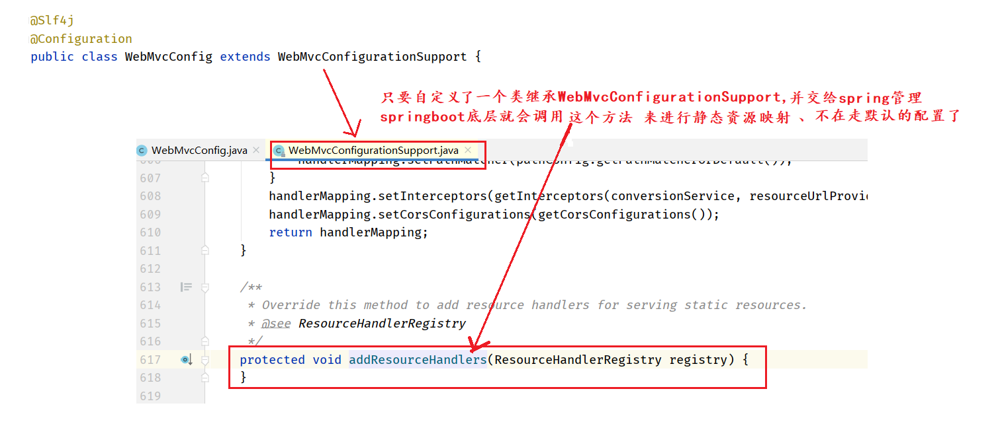 |
| ------------------------------------------------------------ |


# 9 编辑员工

①需求分析:思考要实现什么效果

```
打开编辑页面时进行数据回显
点击保存按钮时进行数据更新(和启用禁用共用一个controller方法)
```

| 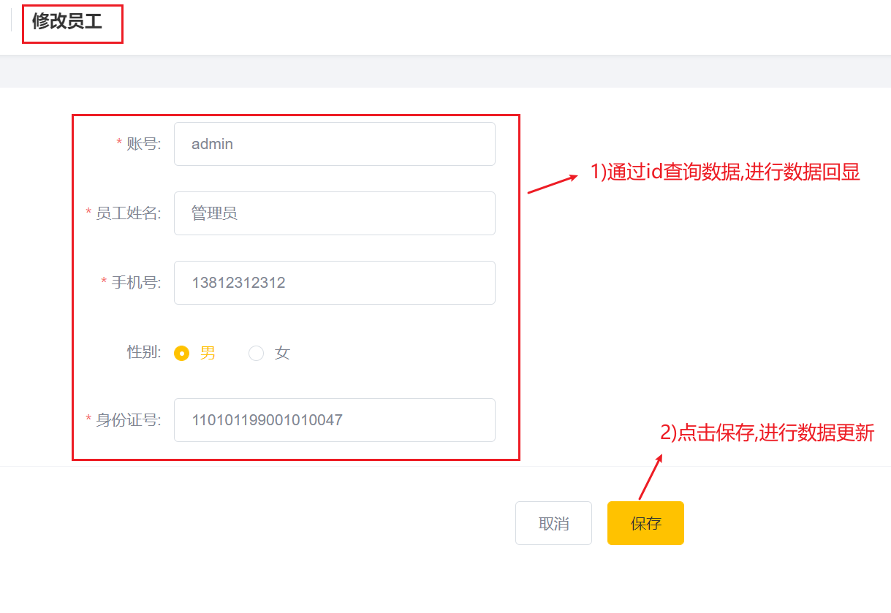 |
| ------------------------------------------------------------ |

②前后端交互:分析请求路径、请求类型、请求参数、返回值 (未来工作中有文档)

方式一:分析前端代码

| 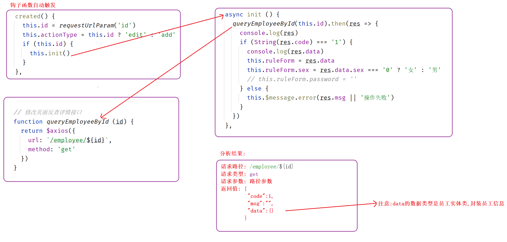 |
| ------------------------------------------------------------ |

方式二:浏览器F12

| 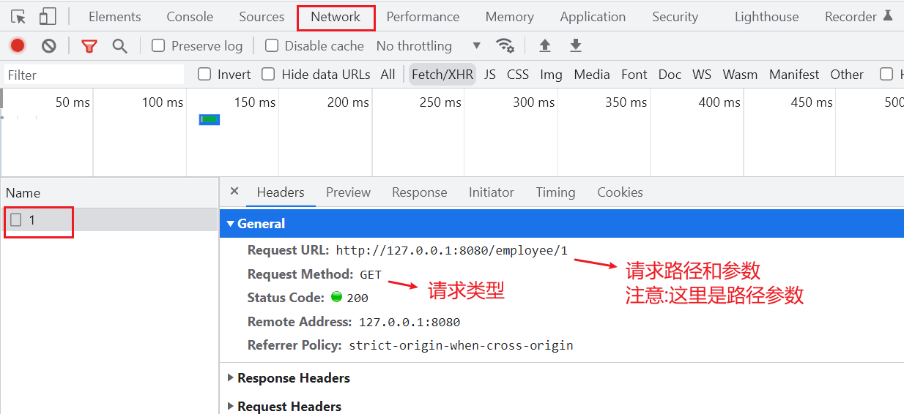 |
| ------------------------------------------------------------ |

③需求分析: SQL语句、代码逻辑、表结构

```sql
SELECT * FROM employee WHERE id=?
```

④代码实现

```java
/**
 * 根据id查询员工信息
 *  
 *{id}: 接收参数的值
 *@PathVariable: 将接收到的数据赋值给形参
 */
@GetMapping("/{id}")
public R<Employee> getById(@PathVariable Long id) {
    
    log.info("根据id查询员工信息...");
    Employee employee = employeeService.getById(id);
    
    if (employee != null) {
        return R.success(employee);
    }
    
    return R.error("没有查询到对应员工信息");
}
```

⑤功能测试
