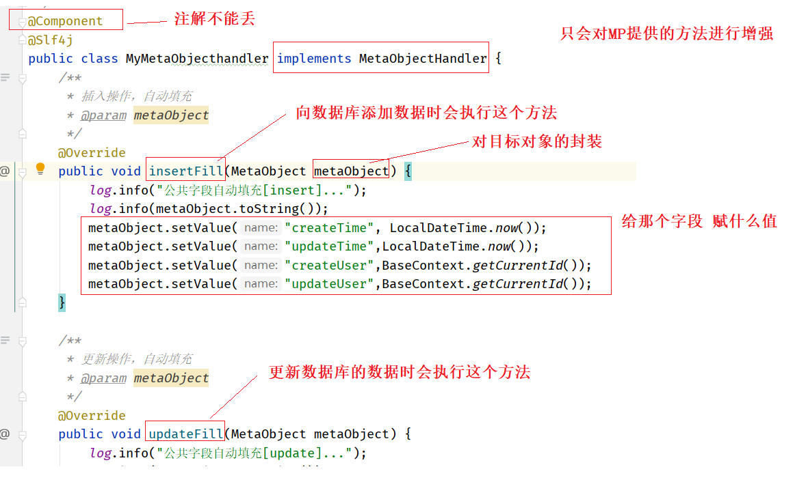

## 1 公共字段填充

### 1.1)需求分析

```
createTime、updateTime、createUser、updateUser 公共字段处理逻辑一样, 自己写代码繁琐!!!

MP提供了统一处理的逻辑
 1)需要告诉MP那些字段需要处理
 2)需要告诉MP什么时候处理这些字段
 3)需要告诉MP这些字段赋什么值
```

### 1.2)代码实现

1)添加注解

```java
@TableField(fill = FieldFill.INSERT)
private LocalDateTime createTime;

@TableField(fill = FieldFill.INSERT_UPDATE)
private LocalDateTime updateTime;

@TableField(fill = FieldFill.INSERT)
private Long createUser;

@TableField(fill = FieldFill.INSERT_UPDATE)
private Long updateUser;
```

2)工具类编写

```java
@Component
@Slf4j
public class MyMetaObjecthandler implements MetaObjectHandler {
    /**
     * 插入操作，自动填充
     * @param metaObject
     */
    @Override
    public void insertFill(MetaObject metaObject) {
        log.info("公共字段自动填充[insert]...");
        log.info(metaObject.toString());
        metaObject.setValue("createTime", LocalDateTime.now());
        metaObject.setValue("updateTime",LocalDateTime.now());
        metaObject.setValue("createUser",BaseContext.getCurrentId());
        metaObject.setValue("updateUser",BaseContext.getCurrentId());
    }

    /**
     * 更新操作，自动填充
     * @param metaObject
     */
    @Override
    public void updateFill(MetaObject metaObject) {
        log.info("公共字段自动填充[update]...");
        log.info(metaObject.toString());

        long id = Thread.currentThread().getId();
        log.info("线程id为：{}",id);

        metaObject.setValue("updateTime",LocalDateTime.now());
        metaObject.setValue("updateUser",BaseContext.getCurrentId());
    }
}
```

### 1.3)代码分析

|  |
| ------------------------------------------------------------ |

|  |
| ------------------------------------------------------------ |

### 1.4)获取当前登录用户id

①编写BaseContext工具类

```ABAP
为什么需要这个工具类? 答:因为MP公共字段填充的类中没办法获取session对象,获取当前登录id,所以需要这个工具类进行数据中转
为什么使用ThreadLocal? 答:可以保证高并发情况下的数据安全(详情见ThreadLocal解析)
```

```java
public class BaseContext {
    private static ThreadLocal<Long> threadLocal = new ThreadLocal<>();

    /**
     * 设置值
     * @param id
     */
    public static void setCurrentId(Long id){
        threadLocal.set(id);
    }

    /**
     * 获取值
     * @return
     */
    public static Long getCurrentId(){
        return threadLocal.get();
    }
}
```

②过滤器存值(当前用户id)

```java
/**
 * 检查用户是否已经完成登录
 */
@WebFilter(filterName = "loginCheckFilter",urlPatterns = "/*")
@Slf4j
public class LoginCheckFilter implements Filter{
    //路径匹配器，支持通配符
    public static final AntPathMatcher PATH_MATCHER = new AntPathMatcher();

    @Override
    public void doFilter(ServletRequest servletRequest, ServletResponse servletResponse, FilterChain filterChain) throws IOException, ServletException {
        HttpServletRequest request = (HttpServletRequest) servletRequest;
        HttpServletResponse response = (HttpServletResponse) servletResponse;

        //1、获取本次请求的URI
        String requestURI = request.getRequestURI();// /backend/index.html

        log.info("拦截到请求：{}",requestURI);

        //定义不需要处理的请求路径
        String[] urls = new String[]{
                "/employee/login",
                "/employee/logout",
                "/backend/**",
                "/front/**"
        };


        //2、判断本次请求是否需要处理
        boolean check = check(urls, requestURI);

        //3、如果不需要处理，则直接放行
        if(check){
            log.info("本次请求{}不需要处理",requestURI);
            filterChain.doFilter(request,response);
            return;
        }

        //4、判断登录状态，如果已登录，则直接放行
        if(request.getSession().getAttribute("employee") != null){
            log.info("用户已登录，用户id为：{}",request.getSession().getAttribute("employee"));

            Long empId = (Long) request.getSession().getAttribute("employee");
            BaseContext.setCurrentId(empId);

            filterChain.doFilter(request,response);
            return;
        }

        log.info("用户未登录");
        //5、如果未登录则返回未登录结果，通过输出流方式向客户端页面响应数据
        response.getWriter().write(JSON.toJSONString(R.error("NOTLOGIN")));
        return;

    }

    /**
     * 路径匹配，检查本次请求是否需要放行
     * @param urls
     * @param requestURI
     * @return
     */
    public boolean check(String[] urls,String requestURI){
        for (String url : urls) {
            boolean match = PATH_MATCHER.match(url, requestURI);
            if(match){
                return true;
            }
        }
        return false;
    }
}
```

③MetaObjectHandler取值 (当前用户id)

```java
@Component
@Slf4j
public class MyMetaObjecthandler implements MetaObjectHandler {
    /**
     * 插入操作，自动填充
     * @param metaObject
     */
    @Override
    public void insertFill(MetaObject metaObject) {
        log.info("公共字段自动填充[insert]...");
        log.info(metaObject.toString());
        metaObject.setValue("createTime", LocalDateTime.now());
        metaObject.setValue("updateTime",LocalDateTime.now());
        metaObject.setValue("createUser",BaseContext.getCurrentId());
        metaObject.setValue("updateUser",BaseContext.getCurrentId());
    }

    /**
     * 更新操作，自动填充
     * @param metaObject
     */
    @Override
    public void updateFill(MetaObject metaObject) {
        log.info("公共字段自动填充[update]...");
        log.info(metaObject.toString());

        long id = Thread.currentThread().getId();
        log.info("线程id为：{}",id);

        metaObject.setValue("updateTime",LocalDateTime.now());
        metaObject.setValue("updateUser",BaseContext.getCurrentId());
    }
}
```

④代码分析

|  |
| ------------------------------------------------------------ |

### 1.5)ThreadLocal

①简介

```
ThreadLocal是Thread的局部变量,ThreadLocal为每个使用该变量的线程提供独立的变量副本
通俗的来讲,ThreadLocal就是一个map集合,只不过这个map集合的key可以省略不写,默认为当前线程
```

②代码

|  |
| ------------------------------------------------------------ |

③解析

|  |
| -------------------------- |

|  |
| ------------------------------------------------------------ |


## 2 添加分类信息

①需求分析: 思考要实现什么效果

```ABAP
添加分类信息到数据库的category表中,并响应添加成功/添加失败
```

②前后端交互:分析请求路径、请求类型、请求参数、返回值 (未来工作中有文档)

方式一: 分析前端代码

|  |
| ---------------------------------------- |

方式二: 浏览器F12

|  |
| ------------------------------------------------------------ |

③需求分析: SQL语句、代码逻辑、表结构

```sql
insert into category (id, type, name, create_time, update_time, create_user, update_user) 
VALUES (?,?,?,?,?,?,?);
```

|  |
| ------------------------------------------------------------ |

④代码实现

```java
@PostMapping
public R<String> save(@RequestBody Category category) {
    log.info("category:{}", category);
    categoryService.save(category);
    return R.success("新增分类成功");
}
```

⑤功能测试


## 3 分页查询分类信息

①需求分析: 思考要实现什么效果

```ABAP
分页查询category表中的数据,将总条数和当前页的列表数据响应给前端
```

②前后端交互:分析请求路径、请求类型、请求参数、返回值 (未来工作中有文档)

方式一:分析前端代码

|  |
| ------------------------------------------------------------ |

方式二:浏览器F12

|  |
| ------------------------------------------------------------ |

③需求分析:SQL语句、代码逻辑、表结构

```sql
select COUNT(*)  from category;

select * from category order by sort asc limit 0,10;
```

④代码实现

```java
@GetMapping("/page")
public R<Page> page(int page, int pageSize) {
    //分页构造器
    Page<Category> pageInfo = new Page<>(page, pageSize);

    //条件构造器
    LambdaQueryWrapper<Category> queryWrapper = new LambdaQueryWrapper<>();
    //添加排序条件，根据sort进行排序
    queryWrapper.orderByAsc(Category::getSort);

    //分页查询
    categoryService.page(pageInfo, queryWrapper);
    return R.success(pageInfo);
}
```

⑤功能测试


## 4 删除分类信息

①需求分析: 思考要实现什么效果

```ABAP
删除数据库中的分类信息,但该分类下面有菜品或者套餐信息时不允许删除
```

②前后端交互:分析请求路径、请求类型、请求参数、返回值 (未来工作中有文档)

方式一:分析前端代码

|  |
| ------------------------------------------------------------ |

方式二:浏览器F12

|  |
| ------------------------------------------------------------ |

③需求分析:SQL语句、代码逻辑、表结构

```sql
select count(*) from dish where category_id = 1397844303408574465;

select count(*) from setmeal where category_id = 1397844303408574465;

delete from category where id = 1397844303408574465;
```

④代码实现

```java
//CategoryController类中的方法

@DeleteMapping
public R<String> delete(Long id){
    log.info("删除分类，id为：{}",id);
    
    categoryService.remove(id);

    return R.success("分类信息删除成功");
}
```

```java
//categoryServiceImpl类中的方法
@Override
public void remove(Long id) {
    //添加查询条件，根据分类id进行查询
    LambdaQueryWrapper<Dish> dishLqw = new LambdaQueryWrapper<>();
    dishLqw.eq(Dish::getCategoryId, id);
    	
    //SQL: select count(*) from dish where category_id = 1397844303408574465;
    int count1 = dishService.count(dishLqw);
    if (count1 > 0) {
        throw new CustomException("当前分类下关联了菜品，不能删除");
    }
 
    //添加查询条件，根据分类id进行查询
    LambdaQueryWrapper<Setmeal> setMealLqw = new LambdaQueryWrapper<>();
    setMealLqw.eq(Setmeal::getCategoryId, id);
    
    //SQL: select count(*) from setmeal where category_id = 1397844303408574465;
    int count2 = setmealService.count(setMealLqw);
    if (count2 > 0) {
        throw new CustomException("当前分类下关联了套餐，不能删除");
    }

    //delete from category where id = 1397844303408574465;
    super.removeById(id);
}
```

```java
/**
 * 自定义业务异常类
 */
public class CustomException extends RuntimeException {
    public CustomException(String message){
        super(message);
    }
}
```

```java
//全局异常处理类中的方法

/**
 * 异常处理方法
 * @return
 */
@ExceptionHandler(CustomException.class)
public R<String> exceptionHandler(CustomException ex){
    log.error(ex.getMessage(),ex);
    return R.error(ex.getMessage());
}
```

⑤功能测试


## 6 修改分类信息

### 6.1)开发套路

①需求分析: 思考要实现什么效果

```ABAP
更新category表中的数据,并响应更新成功/更新失败
```

②前后端交互:分析请求路径、请求类型、请求参数、返回值 (未来工作中有文档)

方式一:分析前端代码

|  |
| ------------------------------------------------------------ |

方式二:浏览器F12

|  |
| ------------------------------------------------------------ |

③需求分析:SQL语句、代码逻辑、表结构

```sql
update category set name = '',sort = 20, update_time = '',update_user= '' where id = xx;
```

④代码实现

```java
@PutMapping
public R<String> update(@RequestBody Category category){
    log.info("修改分类信息：{}",category);

    categoryService.updateById(category);

    return R.success("修改分类信息成功");
}
```

⑤功能测试

### 6.2)常见疑问

①为什么数据回显不需要和后端交互

```ABAP
因为编辑分类信息页面和列表页面是同一个页面,前端可以很方便的获取需要编辑的这条数据的信息,所以不需要和后端交互
```

|  |
| ------------------------------------------------------------ |

