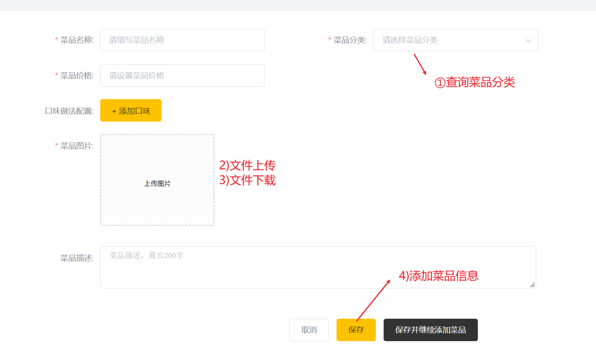
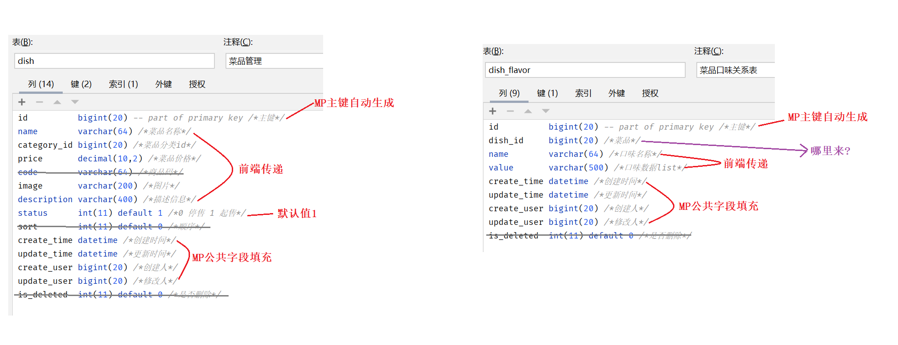

## 1 文件上传

文件上传三要素(面试题)

```html
<!--
1)method  必须是  post     (get请求最多传输64K数据)
2)type    必须是 "file"     
3)enctype 必须是multipart/form-data
          告诉浏览器上传时,不仅仅有普通表单,还有附件
-->
<form action="/fileUpload" method="post" enctype="multipart/form-data">
    用户名<input type="text" name="username"><br><br>
    文件上传<input type="file" name="file"><br><br>
    <input type="submit" value="提交">
</form>
```

代码分析

|  |
| ------------------------------------------------------------ |

代码实现

```java
@PostMapping("/upload")
public R<String> upload(MultipartFile file) throws IOException {
    //file是一个临时文件，需要转存到指定位置，否则本次请求完成后临时文件会删除
    log.info(file.toString());

    //原文件名
    String originalFilename = file.getOriginalFilename();  //abc.jpg   ab.cd.jpg
    //后缀
    String suffix = originalFilename.substring(originalFilename.lastIndexOf("."));
    //新文件名
    String fileName = UUID.randomUUID().toString() + suffix;  //99e952ef.jpg

    //使用日期进行分文件夹存储-每天一个文件夹
    SimpleDateFormat sdf = new SimpleDateFormat("yyyyMMdd");
    String datePath = sdf.format(new Date());

    //basePath   D:\img\
    //datePath   20221212
    //dir        D:\img\20221212
    //创建一个目录对象
    File dir = new File(basePath, datePath);
    dir.mkdirs();


    //dir +  fileName       D:\img\20221212\99e952ef.jpg
    //将临时文件转存到指定位置
    file.transferTo(new File(dir, fileName));

    return R.success(datePath + "/" + fileName);
}
```

注意事项

```yaml
# springmvc(springboot) 默认超过 1MB就会报错
# 在yml文件中配置可以自定义限制文件上传大小

spring:
  servlet:
    multipart:
      max-file-size: 10MB        #单个文件大小最大值
      max-request-size: 20MB     #一次请求文件大小最大值
```

## 2 文件下载

代码实现

```java
@GetMapping("/download")
public void download(String name, HttpServletResponse response) throws IOException {
    //basePath   D:\img\
    //datePath   20221212
    //fileName  99e952ef.jpg

    //name =  datePath + fileName
    FileInputStream fis = new FileInputStream(basePath + name);
    ServletOutputStream os = response.getOutputStream();
    response.setContentType("image/jpeg");

    int len;  //读到的字节个数
    byte[] bytes = new byte[1024];  //存储读到的内容
    while ((len = fis.read(bytes)) != -1) {
        os.write(bytes, 0, len);
        os.flush();
    }

    fis.close();
    os.close();
}
```

上传、下载流程

|  |
| ------------------------------------------------------------ |


## 3 添加菜品

### 3.1)页面交互

|  |
| ------------------------------------------------------------ |

### 3.1)查询分类数据

①需求分析:思考要实现什么效果

```ABAP
获取所有的菜品分类信息,并响应给前端
```

②前后端交互:分析请求路径、请求类型、请求参数、返回值 (未来工作中有文档)

方式一:分析前端代码

|  |
| ---------------------------------------- |

方式二: 浏览器F12

|  |
| ------------------------------------------------------------ |

③需求分析: SQL语句、代码逻辑、表结构

```sql
select * from category where type = 1 order by sort ASC,update_time DESC ;
```

④代码实现

```java
@GetMapping("/list")
public R<List<Category>> list(Category category){
    
    //条件构造器
    LambdaQueryWrapper<Category> queryWrapper = new LambdaQueryWrapper<>();
    //添加条件
    queryWrapper.eq(category.getType() != null,Category::getType,category.getType());
    //添加排序条件
    queryWrapper.orderByAsc(Category::getSort).orderByDesc(Category::getUpdateTime);

    List<Category> list = categoryService.list(queryWrapper);

    return R.success(list);
}
```

⑤功能测试


### 3.2)保存菜品数据

#### 开发套路

①需求分析:思考要实现什么效果

```ABAP
保存菜品信息到dish表,保存口味信息到dish_flavor表,并响应添加成功/添加失败
```

②前后端交互:分析请求路径、请求类型、请求参数、返回值 (未来工作中有文档)

方式一: 分析前端代码

|  |
| ------------------------------------------------------------ |

方式二:浏览器F12

|  |
| ------------------------------------------------------------ |

③需求分析:SQL语句、代码逻辑、表结构

```sql
-- 添加数据到菜品表(dish)
INSERT INTO dish ( id, name, category_id, price, code, image, description, status, create_time, update_time, create_user, update_user ) VALUES ( ?, ?, ?, ?, ?, ?, ?, ?, ?, ?, ?, ? )

-- 添加数据到菜品口味表(dish_flavor)
INSERT INTO dish_flavor ( id, dish_id, name, value, create_time, update_time, create_user, update_user ) VALUES 
( ?, ?, ?, ?, ?, ?, ?, ? ),
( ?, ?, ?, ?, ?, ?, ?, ? ),
( ?, ?, ?, ?, ?, ?, ?, ? )
```

|  |
| ------------------------------------------------------------ |

④代码实现

```java
//controller方法
@PostMapping
public R<String> save(@RequestBody DishDto dishDto) {
    log.info(dishDto.toString());

    dishService.saveWithFlavor(dishDto);

    return R.success("新增菜品成功");
}
```

```java
//service类中方法

@Transactional
public void saveWithFlavor(DishDto dishDto) {
    
    //1)保存菜品的基本信息到菜品表dish
    //现在保存Dish对象到数据库,多余的字段会忽略掉
    this.save(dishDto);  
	
    //2)菜品id
    //执行添加菜品的SQL语句之后,才有生成dishId,并会自动的将生成的主键Id赋值到dishDto
    Long dishId = dishDto.getId(); 

    //3)封装菜品ID到菜品口味
    List<DishFlavor> flavors = dishDto.getFlavors();
    for (DishFlavor flavor : flavors) {
        flavor.setDishId(dishId);
    }
	
    //4)保存菜品口味数据到菜品口味表dish_flavor
    dishFlavorService.saveBatch(flavors);
}
```

⑤功能测试

#### 常见疑问

①POJO、DTO 、VO


②事务开发步骤

```
1)启动类上添加注解@EnableTransactionManagement
2)在方法上面或者类上面添加注解 @Transactional
```

③为啥需要开启事务

```
因为要保证向两张表中添加数据时,要么全部成功,要么全部失败
```


## 4 菜品分页查询

#### 4.1)开发套路

①需求分析: 思考要实现什么效果

```ABAP
分页查询菜品信息,并将总条数、当前页的列表数据返回给前端
```

|  |
| ------------------------------------------------------------ |

②前后端交互:分析请求路径、请求类型、请求参数、返回值 (未来工作中有文档)

|  |
| ------------------------------------------------------------ |

③需求分析:SQL语句、代码逻辑、表结构

```sql
-- 查询总条数
SELECT COUNT(*) FROM dish WHERE name LIKE %老%;

-- 查询列表数据
SELECT * FROM dish WHERE name LIKE '%老%' ORDER BY update_time DESC LIMIT 0,10;

-- 查询分类名称
SELECT * FROM category WHERE id= 1413341197421846529;
SELECT * FROM category WHERE id= 1397844391040167938;
```

④代码实现

1)Dish类中添加categoryName字段

```java
//菜品分类名称  - 冗余字段   false代表不存在
@TableField(exist = false)
private String categoryName;
```

2)controller类

```java
@GetMapping("/page")
public R<Page> page(int page, int pageSize, String name) {

    //构造分页构造器对象
    Page<Dish> pageInfo = new Page<>(page, pageSize);
    //条件构造器
    LambdaQueryWrapper<Dish> queryWrapper = new LambdaQueryWrapper<>();
    //添加过滤条件
    queryWrapper.like(StringUtils.isNotBlank(name), Dish::getName, name);
    //添加排序条件
    queryWrapper.orderByDesc(Dish::getUpdateTime);

    //执行分页查询
    dishService.page(pageInfo, queryWrapper);

    //循环遍历-通过categoryId查询分类信息,并给dish对象中的categoryName字段赋值
    List<Dish> dishList = pageInfo.getRecords();
    for (Dish dish : dishList) {
        //SQL:SELECT * FROM category WHERE id= 1413341197421846529;
        Long categoryId = dish.getCategoryId();
        Category category = categoryService.getById(categoryId);

        dish.setCategoryName(category.getName());
    }

    return R.success(pageInfo);
}
```

⑤功能测试


#### 4.2)常见疑问

①BeanUtils工具类

```java
/**
 *BeanUtils.copyProperties()  将一个对象中的属性值、复制给一个对象
 *复制时 两个对象的数据类型没有限制, 可以一样,也可以不一样
 *只要两个对象的类中有相同的成员变量就行了
 */
public static void main(String[] args) {
    Dish dish = new Dish();
    dish.setId(1L);
    dish.setName("王老吉");

    //DishDto dishDto = new DishDto();
    //dishDto.setId(dish.getId());
    //dishDto.setName(dish.getName());

    //对象的属性值拷贝   - 将原对象中的属性值拷贝目标对象中
    //参数一:  原对象
    //参数二:  目标对象
    DishDto dishDto = new DishDto();
    BeanUtils.copyProperties(dish,dishDto);

    System.out.println(dishDto);
}
```

```ABAP
注意:不要导错包了   import org.springframework.beans.BeanUtils;  
```


## 5 修改菜品

|  |
| ------------------------------------------------------------ |


### 8.1)数据回显

url分析

```
URL: http://127.0.0.1:8080/dish/1413385247889891330
Method: GET
```

代码实现

```java
@GetMapping("/{id}")
public R<DishDto> get(@PathVariable Long id) {

    DishDto dishDto = dishService.getByIdWithFlavor(id);

    return R.success(dishDto);
}
```

```java
public DishDto getByIdWithFlavor(Long id) {
    //查询菜品基本信息，从dish表查询
    Dish dish = this.getById(id);

    DishDto dishDto = new DishDto();   
    BeanUtils.copyProperties(dish, dishDto);    //属性值拷贝(看属性名是否一样)

    //查询当前菜品对应的口味信息，从dish_flavor表查询
    LambdaQueryWrapper<DishFlavor> queryWrapper = new LambdaQueryWrapper<>();
    queryWrapper.eq(DishFlavor::getDishId, dish.getId());
    List<DishFlavor> flavors = dishFlavorService.list(queryWrapper);
    dishDto.setFlavors(flavors);

    return dishDto;
}
```

### 8.2)修改菜品信息

url分析

```json
URL:    http://127.0.0.1:8080/dish
Method: PUT
参数:
{
    "id": "1528585998139637762",
    "name": "红烧鱼头",
    "categoryId": "1397844303408574465",
    "categoryName": null,
    "price": 5800,
    "code": "",
    "image": "2022/05/23/ae45d35d-adbb-48b9-ae1d-21d82f4f38aa.jpg",
    "description": "从存储存储",
    "status": 1,
    "sort": 0,
    "createTime": "2022-05-23 11:57:56",
    "createUser": "1",
    "updateUser": "1",
    "flavors": [
        {
            "id": "1528585998215135234",
            "dishId": "1528585998139637762",
            "name": "甜味",
            "value": "[\"无糖\",\"少糖\",\"半糖\",\"多糖\",\"全糖\"]",
            "createTime": "2022-05-23 17:27:09",
            "updateTime": "2022-05-23 17:27:09",
            "createUser": "1",
            "updateUser": "1",
            "isDeleted": 0,
            "showOption": false
        },
        {
            "id": "1528585998215135235",
            "dishId": "1528585998139637762",
            "name": "辣度",
            "value": "[\"不辣\",\"微辣\",\"中辣\",\"重辣\"]",
            "createTime": "2022-05-23 17:27:09",
            "updateTime": "2022-05-23 17:27:09",
            "createUser": "1",
            "updateUser": "1",
            "isDeleted": 0,
            "showOption": false
        }
    ],
    "copies": null
}
```

代码实现

```java
@PutMapping
public R<String> update(@RequestBody DishDto dishDto) {
    log.info(dishDto.toString());

    dishService.updateWithFlavor(dishDto);

    return R.success("修改菜品成功");
}
```

```java
@Override
@Transactional
public void updateWithFlavor(DishDto dishDto) {
    //1)更新dish表基本信息
    this.updateById(dishDto);

    //2)清理当前菜品对应口味数据---dish_flavor表的delete操作
    LambdaQueryWrapper<DishFlavor> queryWrapper = new LambdaQueryWrapper();
    queryWrapper.eq(DishFlavor::getDishId,dishDto.getId());
    dishFlavorService.remove(queryWrapper);

    //3)添加当前提交过来的口味数据---dish_flavor表的insert操作
    List<DishFlavor> flavors = dishDto.getFlavors();
    for (DishFlavor flavor : flavors) {
        flavor.setDishId(dishDto.getId());
    }
    
    dishFlavorService.saveBatch(flavors);
}
```
