## 1 送货地址管理

交互分析

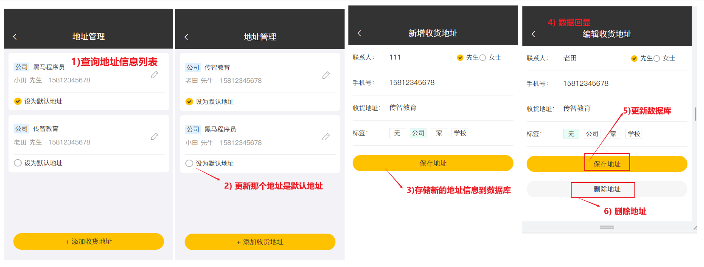

数据模型

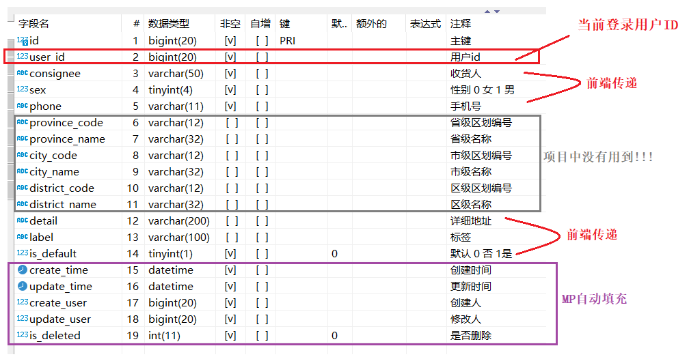

代码分析

| 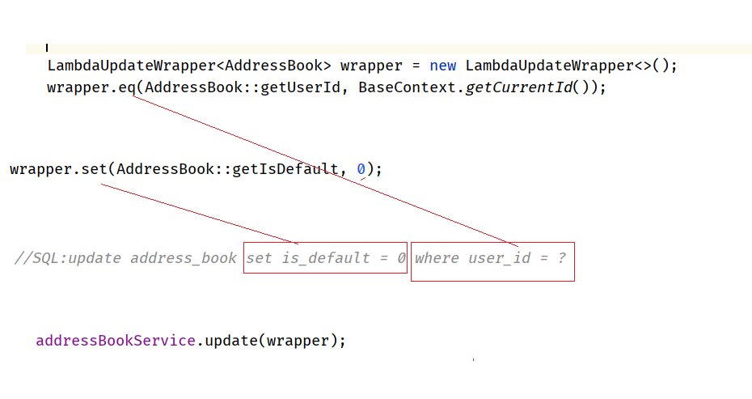 |
| ------------------------------------------------------------ |

代码实现

```java
/**
 * 地址簿管理
 */
@Slf4j
@RestController
@RequestMapping("/addressBook")
public class AddressBookController {

    @Autowired
    private AddressBookService addressBookService;

    /**
     * 新增
     */
    @PostMapping
    public R<AddressBook> save(@RequestBody AddressBook addressBook) {
        addressBook.setUserId(BaseContext.getCurrentId());
        log.info("addressBook:{}", addressBook);
        addressBookService.save(addressBook);
        return R.success(addressBook);
    }

    /**
     * 设置默认地址
     */
    @PutMapping("default")
    public R<AddressBook> setDefault(@RequestBody AddressBook addressBook) {
        log.info("addressBook:{}", addressBook);

        LambdaUpdateWrapper<AddressBook> wrapper = new LambdaUpdateWrapper<>();
        wrapper.eq(AddressBook::getUserId, BaseContext.getCurrentId());
        wrapper.set(AddressBook::getIsDefault, 0);
        //SQL:update address_book set is_default = 0 where user_id = ?
        addressBookService.update(wrapper);

        //SQL:update address_book set is_default = 1 where id = ?
        addressBook.setIsDefault(1);
        addressBookService.updateById(addressBook);

        return R.success(addressBook);
    }

    /**
     * 根据id查询地址
     */
    @GetMapping("/{id}")
    public R get(@PathVariable Long id) {
        AddressBook addressBook = addressBookService.getById(id);
        if (addressBook != null) {
            return R.success(addressBook);
        } else {
            return R.error("没有找到该对象");
        }
    }

    /**
     * 查询默认地址
     */
    @GetMapping("default")
    public R<AddressBook> getDefault() {
        LambdaQueryWrapper<AddressBook> queryWrapper = new LambdaQueryWrapper<>();
        queryWrapper.eq(AddressBook::getUserId, BaseContext.getCurrentId());
        queryWrapper.eq(AddressBook::getIsDefault, 1);
        //SQL:select * from address_book where user_id = ? and is_default = 1
        AddressBook addressBook = addressBookService.getOne(queryWrapper);

        if (null == addressBook) {
            return R.error("没有找到该对象");
        } else {
            return R.success(addressBook);
        }
    }

    /**
     * 查询指定用户的全部地址
     */
    @GetMapping("/list")
    public R<List<AddressBook>> list(AddressBook addressBook) {
        addressBook.setUserId(BaseContext.getCurrentId());
        log.info("addressBook:{}", addressBook);

        //条件构造器
        LambdaQueryWrapper<AddressBook> queryWrapper = new LambdaQueryWrapper<>();
        queryWrapper.eq(null != addressBook.getUserId(), 
                        AddressBook::getUserId, addressBook.getUserId());
        queryWrapper.orderByDesc(AddressBook::getUpdateTime);

        //SQL:select * from address_book where user_id = ? order by update_time desc
        return R.success(addressBookService.list(queryWrapper));
    }
}
```

## 2 session

| 每一个客户端和后台之间都有一份单独的session对象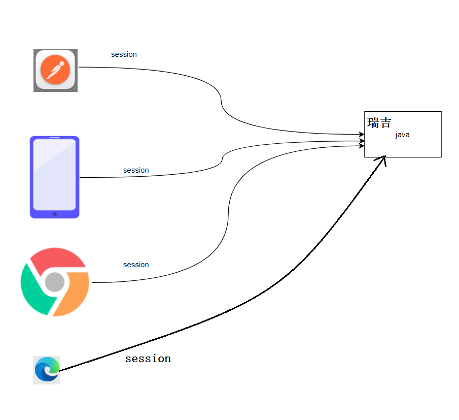 |
| ------------------------------------------------------------ |

## 3 菜品信息展示

①需求分析:思考要实现什么效果

```ABAP
通过分类Id查询基本菜品信息及口味信息
```

②前后端交互:分析请求路径、请求类型、请求参数、返回值 (未来工作中有文档)

方式一: 浏览器F12

| 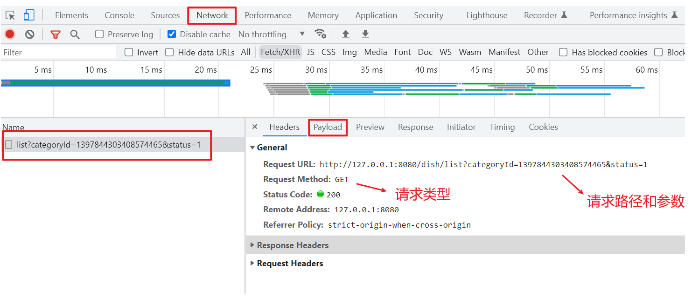 |
| ------------------------------------------------------------ |

方式二: 分析前端代码

| 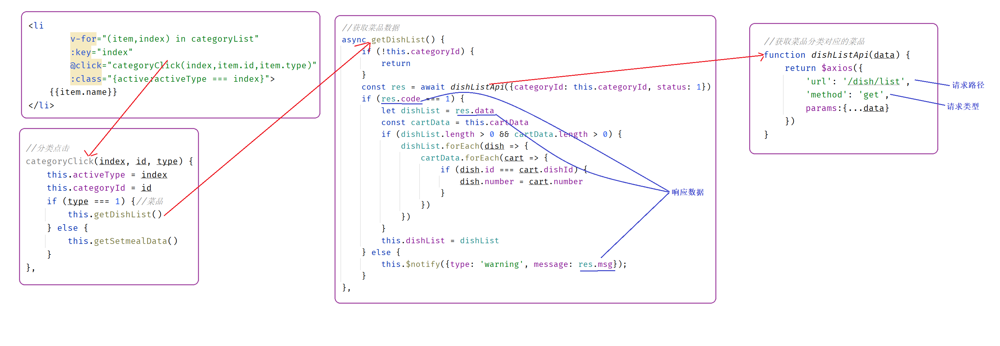 |
| -------------------------------- |

③需求分析:SQL语句、代码逻辑、表结构

```sql
-- 查询菜品信息
SELECT * FROM dish WHERE category_id = ? AND status = ? ORDER BY update_time DESC

-- 查询口味信息
select * from dish_flavor where dish_id = 1397849739276890114;
```

④代码实现

```java
@GetMapping("/list")
public R<List<DishDto>> list(Dish dish) {
    //构造查询条件
    LambdaQueryWrapper<Dish> queryWrapper = new LambdaQueryWrapper<>();
    //添加条件,分类Id
    queryWrapper.eq(dish.getCategoryId() != null, Dish::getCategoryId, dish.getCategoryId());
    //添加条件，查询状态为1（起售状态）的菜品
    queryWrapper.eq(Dish::getStatus, 1);
    //添加排序条件
    queryWrapper.orderByDesc(Dish::getUpdateTime);

    //SQL: SELECT * FROM dish WHERE category_id = ? AND status = ? ORDER BY update_time DESC
    List<Dish> list = dishService.list(queryWrapper);

    //查询菜品的口味信息,并返回给前端
    ArrayList<DishDto> dishDtoList = new ArrayList<>();
    for (Dish d : list) {
        DishDto dishDto = new DishDto();
        BeanUtils.copyProperties(d, dishDto);

        //查询菜品对应的口味信息
        LambdaQueryWrapper<DishFlavor> lqw = new LambdaQueryWrapper<>();
        lqw.eq(DishFlavor::getDishId, dishDto.getId());
        
        //SQL: select * from dish_flavor where dish_id = 1397849739276890114;
        List<DishFlavor> flavorList = dishFlavorService.list(lqw);
        dishDto.setFlavors(flavorList);

        dishDtoList.add(dishDto);
    }

    return R.success(dishDtoList);
}
```

⑤功能测试


## 4 套餐信息展示

①需求分析: 思考要实现什么效果

```ABAP
根据分类id查询基本套餐信息
```

②前后端交互: 分析请求路径、请求类型、请求参数、返回值 (未来工作中有文档)

| 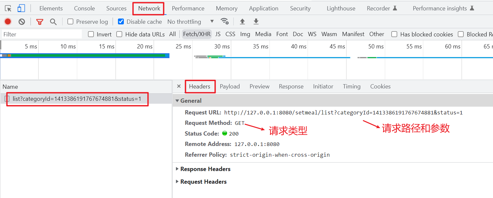 |
| ------------------------------------------------------------ |

| 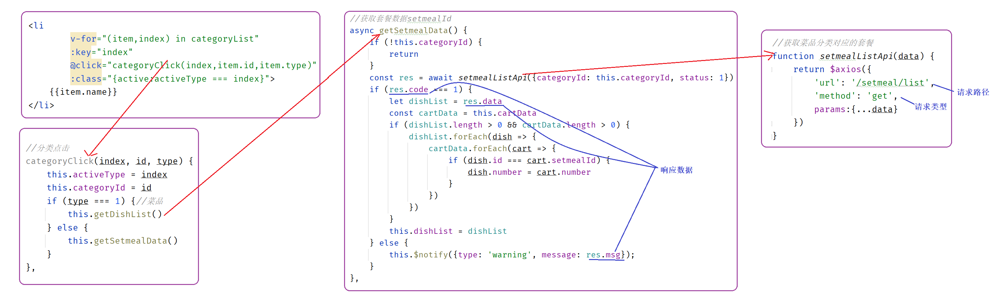 |
| -------------------------------- |

③需求分析: SQL语句、代码逻辑、表结构

```sql
select * from setmeal where category_id = ? and status = ? order by update_time DESC;
```

④代码实现

```java
@GetMapping("/list")
public R<List<Setmeal>> list(Setmeal setmeal){
    LambdaQueryWrapper<Setmeal> lqw = new LambdaQueryWrapper<>();
    lqw.eq(setmeal.getCategoryId() != null,Setmeal::getCategoryId,setmeal.getCategoryId());
    lqw.eq(setmeal.getStatus() != null,Setmeal::getStatus,setmeal.getStatus());
    lqw.orderByDesc(Setmeal::getUpdateTime);

    List<Setmeal> list = setmealService.list(lqw);

    return R.success(list);
}
```

⑤功能测试


## 5 购物车

### 5 .1)需求分析

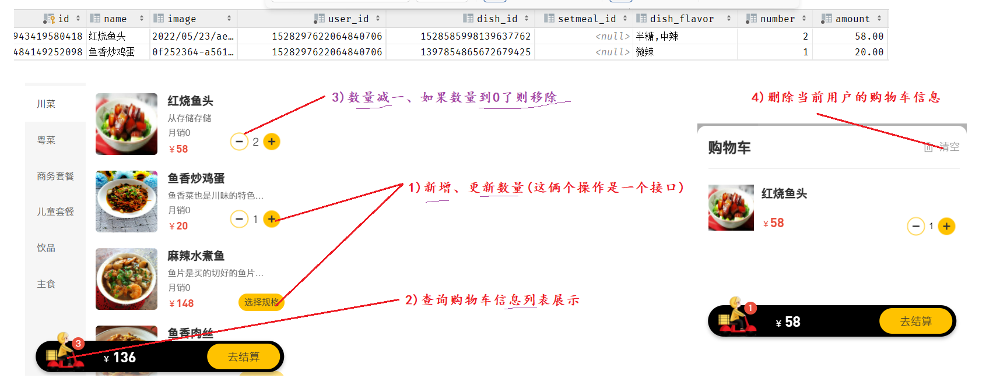

### 5 .2)添加购物车

①需求分析: 思考要实现什么效果

```ABAP
添加菜品/套餐信息到购物车, 并响应当前购物车的信息
```

②前后端交互: 分析请求路径、请求类型、请求参数、返回值 (未来工作中有文档)

| 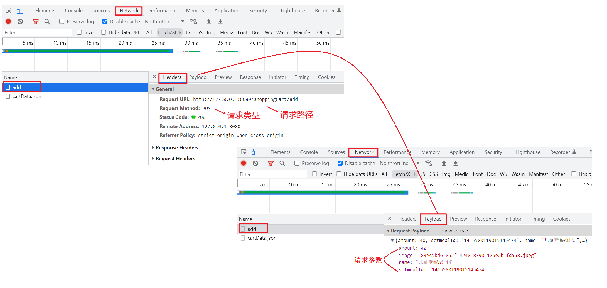 |
| ------------------------------------------------------------ |

| 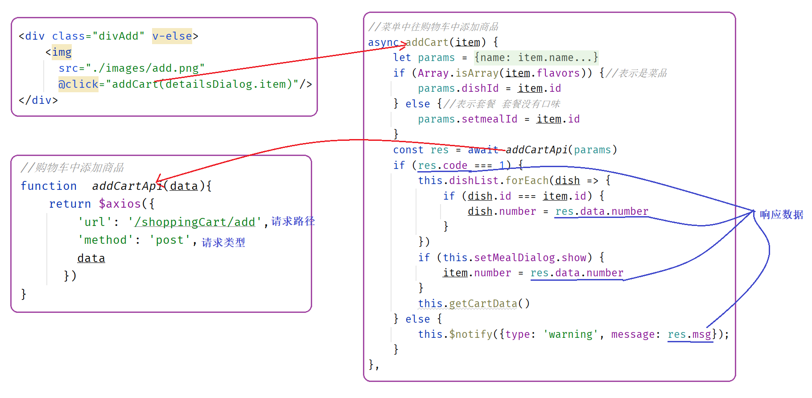 |
| ------------------------------------------------------------ |

③需求分析:  SQL语句、代码逻辑、表结构

```sql
-- 查询当前用户指定菜品或者套餐的购物车信息
select * from shopping_cart where user_id = ? and dish_id/setmeal_id = ?

-- 更新购物车中菜品或者套餐的数量
update shopping_cart set number = ? where id = ?

-- 添加菜品或者套餐信息到购物车
insert into shopping_cart (id, name, image, user_id, dish_id, setmeal_id, dish_flavor, amount, create_time) VALUES (?,?,?,?,?,?,?,?,?)
```

④代码实现

```java
@PostMapping("/add")
public R<ShoppingCart> add(@RequestBody ShoppingCart shoppingCart){
    log.info("购物车数据:{}",shoppingCart);

    //设置用户id，指定当前是哪个用户的购物车数据
    Long currentId = BaseContext.getCurrentId();
    shoppingCart.setUserId(currentId);

    Long dishId = shoppingCart.getDishId();

    LambdaQueryWrapper<ShoppingCart> queryWrapper = new LambdaQueryWrapper<>();
    queryWrapper.eq(ShoppingCart::getUserId,currentId);

    if(dishId != null){
        //添加到购物车的是菜品
        queryWrapper.eq(ShoppingCart::getDishId,dishId);
    }else{
        //添加到购物车的是套餐
        queryWrapper.eq(ShoppingCart::getSetmealId,shoppingCart.getSetmealId());
    }

    //查询当前菜品或者套餐是否在购物车中
    //SQL: select * from shopping_cart where user_id = ? and dish_id/setmeal_id = ?
    ShoppingCart cartServiceOne = shoppingCartService.getOne(queryWrapper);
	
    if(cartServiceOne != null){
        //如果已经存在，就在原来数量基础上加一
        Integer number = cartServiceOne.getNumber();
        cartServiceOne.setNumber(number + 1);
        shoppingCartService.updateById(cartServiceOne);
    }else{
        //如果不存在，则添加到购物车，数量默认就是一
        shoppingCart.setNumber(1);
        shoppingCart.setCreateTime(LocalDateTime.now());
        shoppingCartService.save(shoppingCart);
        cartServiceOne = shoppingCart;
    }

    return R.success(cartServiceOne);
}
```

⑤功能测试


### 5 .3)查看购物车

①需求分析: 思考要实现什么效果

```ABAP
查询当前用户的购物车信息
```

②前后端交互: 分析请求路径、请求类型、请求参数、返回值 (未来工作中有文档)

| 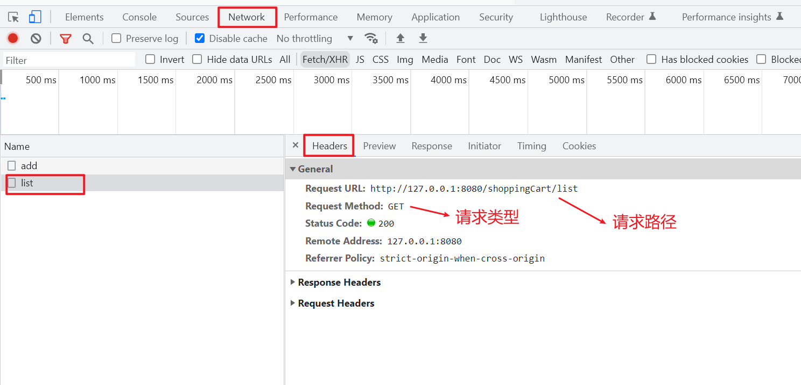 |
| ------------------------------------------------------------ |

| 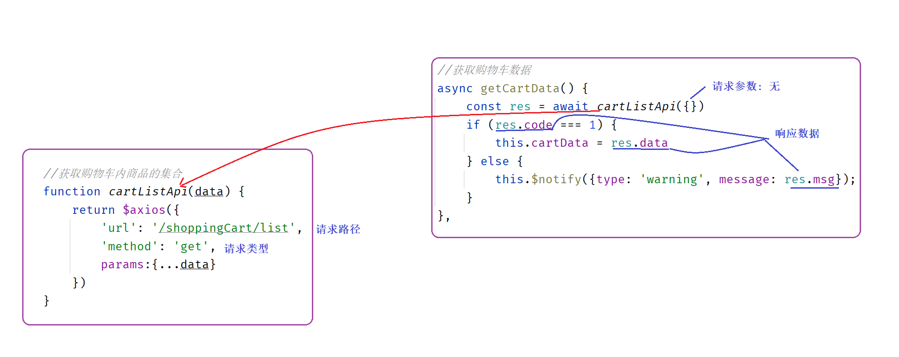 |
| ------------------------------------------------------------ |

③需求分析: SQL语句、代码逻辑、表结构

```sql
-- 查询当前用户的购物车信息
select * from shopping_cart where user_id = ?
```

④代码实现

```java
@GetMapping("/list")
public R<List<ShoppingCart>> list(){
    log.info("查看购物车...");

    LambdaQueryWrapper<ShoppingCart> queryWrapper = new LambdaQueryWrapper<>();
    queryWrapper.eq(ShoppingCart::getUserId,BaseContext.getCurrentId());
    queryWrapper.orderByAsc(ShoppingCart::getCreateTime);

    List<ShoppingCart> list = shoppingCartService.list(queryWrapper);

    return R.success(list);
}
```

⑤功能测试


### 5 .4)清空购物车

①需求分析: 思考要实现什么效果

```ABAP
删除当前用户购物车中的数据
```

②前后端交互: 分析请求路径、请求类型、请求参数、返回值 (未来工作中有文档)

| 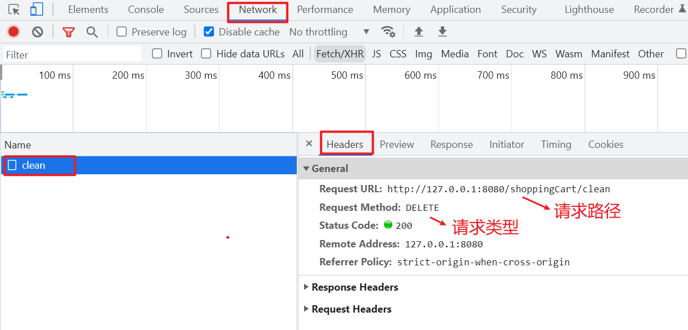 |
| ------------------------------------------------------------ |

| 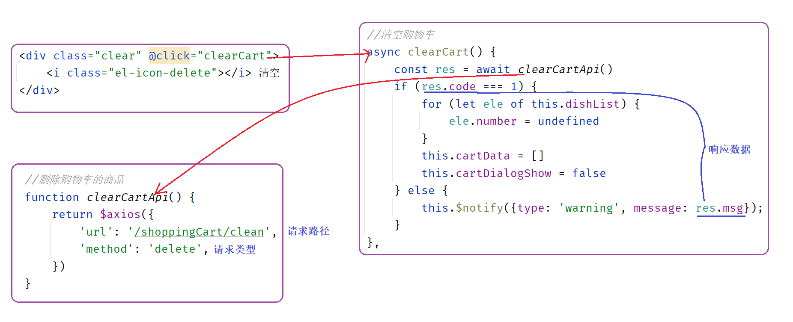 |
| ------------------------------------------------------------ |

③需求分析: SQL语句、代码逻辑、表结构

```sql
-- 删除当前用户购物车中的数据
delete from shopping_cart where user_id = ?
```

④代码实现

```java
@DeleteMapping("/clean")
public R<String> clean(){
    LambdaQueryWrapper<ShoppingCart> queryWrapper = new LambdaQueryWrapper<>();
    queryWrapper.eq(ShoppingCart::getUserId,BaseContext.getCurrentId());
	
    //SQL: delete from shopping_cart where user_id = ?
    shoppingCartService.remove(queryWrapper);

    return R.success("清空购物车成功");
}
```

⑤功能测试


## 6 下单

① 交互分析

| 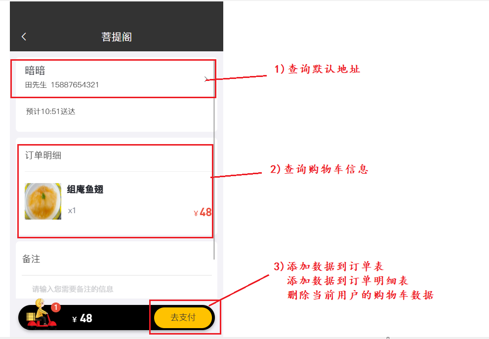 |
| ------------------------------------------------------------ |

② 需求分析

| 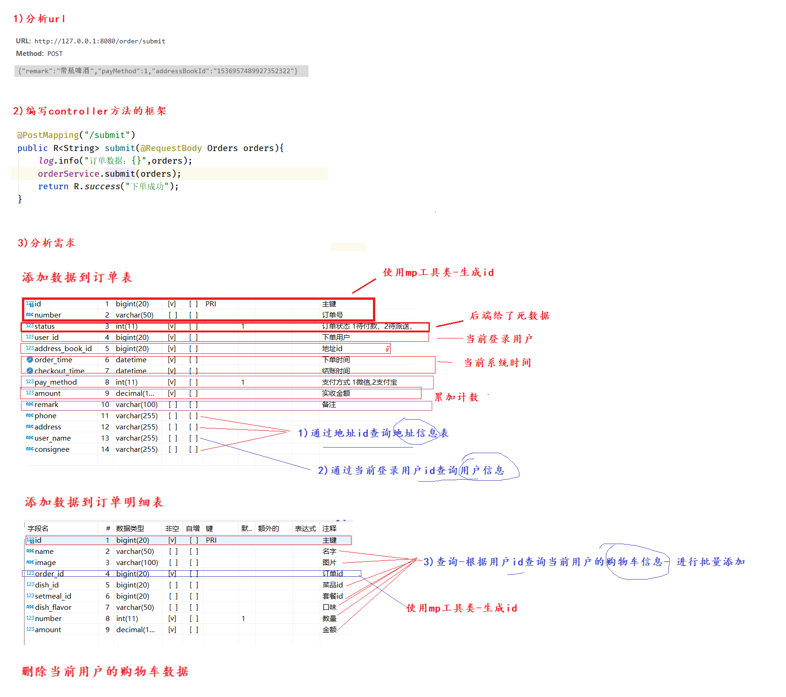 |
| ---------------------------- |

③需求分析: SQL语句、代码逻辑、表结构

```sql
-- 查询当前用户的购物车数据
select * from shopping_cart where user_id = ?

-- 查询当前用户信息
select * from user where id = ?

-- 查询收货地址信息
select * from address_book where id = ?

-- 向订单表插入数据,一条数据
insert into orders (id, number, status, user_id, address_book_id, order_time, checkout_time, pay_method, amount, remark, phone, address, user_name, consignee)
VALUES (?,?,?,?,?,?,?,?,?,?,?,?,?,?)

-- 向订单明细表插入数据，多条数据
insert into order_detail (id, name, image, order_id, dish_id, setmeal_id, dish_flavor, amount) VALUES (?,?,?,?,?,?,?,?),(?,?,?,?,?,?,?,?)

-- 删除当前用户的购物车数据
delete from shopping_cart where user_id = ?
```

④ 代码实现

```java
package com.itheima.reggie.service.impl;

import com.baomidou.mybatisplus.core.conditions.query.LambdaQueryWrapper;
import com.baomidou.mybatisplus.core.toolkit.IdWorker;
import com.baomidou.mybatisplus.extension.service.impl.ServiceImpl;
import com.itheima.reggie.common.BaseContext;
import com.itheima.reggie.common.CustomException;
import com.itheima.reggie.entity.*;
import com.itheima.reggie.mapper.OrderMapper;
import com.itheima.reggie.service.*;
import lombok.extern.slf4j.Slf4j;
import org.springframework.beans.BeanUtils;
import org.springframework.beans.factory.annotation.Autowired;
import org.springframework.stereotype.Service;
import org.springframework.transaction.annotation.Transactional;

import java.math.BigDecimal;
import java.time.LocalDateTime;
import java.util.ArrayList;
import java.util.List;

@Service
@Slf4j
public class OrderServiceImpl extends ServiceImpl<OrderMapper, Orders> implements OrderService {

    @Autowired
    private ShoppingCartService shoppingCartService;

    @Autowired
    private UserService userService;

    @Autowired
    private AddressBookService addressBookService;

    @Autowired
    private OrderDetailService orderDetailService;

    /**
     * 用户下单
     *
     * @param orders
     */
    @Transactional
    public void submit(Orders orders) {
        //获得当前用户id
        Long userId = BaseContext.getCurrentId();

        //查询当前用户的购物车数据
        //SQL :  select * from shopping_cart where user_id = ?
        LambdaQueryWrapper<ShoppingCart> wrapper = new LambdaQueryWrapper<>();
        wrapper.eq(ShoppingCart::getUserId, userId);
        List<ShoppingCart> shoppingCarts = shoppingCartService.list(wrapper);
        if (shoppingCarts == null || shoppingCarts.size() == 0) {
            throw new CustomException("购物车为空，不能下单");
        }

        //查询用户数据
        //SQL : select * from user where id = ?
        User user = userService.getById(userId);

        //查询地址数据
        //SQL:  select * from address_book where id = ?
        Long addressBookId = orders.getAddressBookId();
        AddressBook addressBook = addressBookService.getById(addressBookId);
        if (addressBook == null) {
            throw new CustomException("用户地址信息有误，不能下单");
        }

        //计算总金额
        BigDecimal amount = new BigDecimal(0);
        for (ShoppingCart shoppingCart : shoppingCarts) {
            BigDecimal number = new BigDecimal(shoppingCart.getNumber());
            BigDecimal bd = shoppingCart.getAmount();
            BigDecimal multiply = number.multiply(bd);
            amount = amount.add(multiply);
        }

        long orderId = IdWorker.getId();//订单号
        orders.setId(orderId);
        orders.setNumber(orderId + "");
        orders.setStatus(2);
        orders.setUserId(userId);
        orders.setOrderTime(LocalDateTime.now());
        orders.setCheckoutTime(LocalDateTime.now());
        orders.setAmount(amount);
        orders.setPhone(addressBook.getPhone());
        orders.setAddress((addressBook.getProvinceName() == null ? "" : addressBook.getProvinceName())
                + (addressBook.getCityName() == null ? "" : addressBook.getCityName())
                + (addressBook.getDistrictName() == null ? "" : addressBook.getDistrictName())
                + (addressBook.getDetail() == null ? "" : addressBook.getDetail()));
        orders.setUserName(user.getName());
        orders.setConsignee(addressBook.getConsignee());
        //向订单表插入数据，一条数据
        super.save(orders);


        ArrayList<OrderDetail> orderDetails = new ArrayList<>();
        for (ShoppingCart shoppingCart : shoppingCarts) {
            OrderDetail orderDetail = new OrderDetail();

            orderDetail.setOrderId(orderId);
            BeanUtils.copyProperties(shoppingCart,orderDetail);

            orderDetails.add(orderDetail);
        }
        //向订单明细表插入数据，多条数据
        orderDetailService.saveBatch(orderDetails);

        //清空购物车数据
        //SQL : delete from shopping_cart where user_id = ?
        shoppingCartService.remove(wrapper);
    }
}
```
