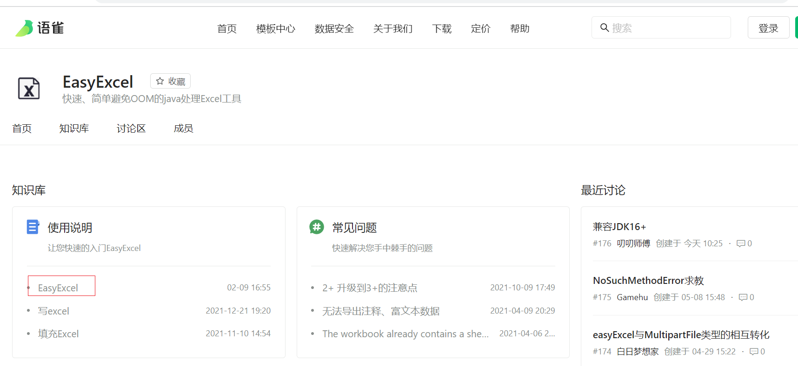
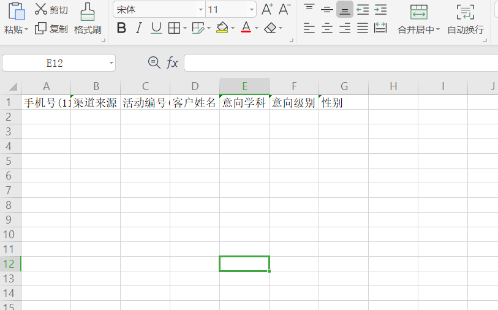
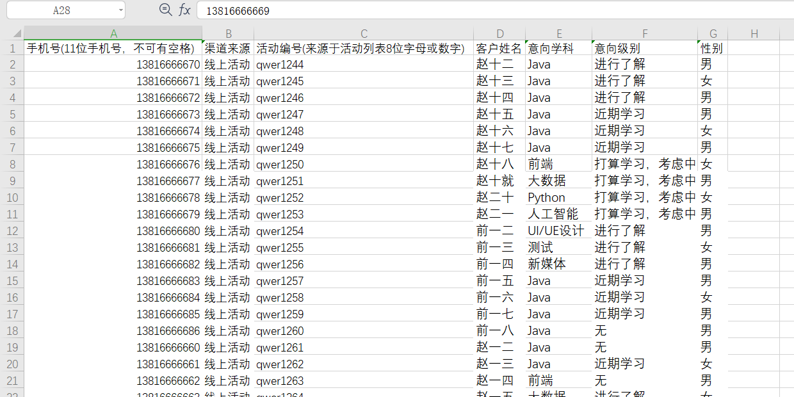

# 20-1-EasyExcel技术调研（实现）

## 1.参考网址

​	参考官网上的内容

​	官网地址如下：

​	https://yuque.com/easyexcel

​	git地址：

​	https://gitcode.net/mirrors/alibaba/easyexcel?utm_source=csdn_github_accelerator




## 2. 需求

```
为什么有要批量导入Excle功能，
     因为线下做活动或线上做推广的时候（比如你留一个手机号给给你一瓶水），活动的运营人员会收取很多的手机号，个人信息，这些手机号不可能让活动人员到我们的crm系统中一个一个进行录入,他最多整理成一份excel，然后在crm端应该有一个功能，这个功需要能批量的导入excel中的线索到我们的数据库中
线索模板如下图所示：
```

 

线索数据如下图所示：

 

## 3. EasyExcel 简介

```
EasyExcel是一个基于Java的简单、省内存的读写Excel的开源项目。在尽可能节约内存的情况下支持读写百M的Excel。
```

```
官方测试效率
    4M内存20秒读取75M(46W行25列)的Excel（3.0.2+版本）
    当然还有急速模式能更快，但是内存占用会在100M多一点
```

```
jdk 版本要求
   	● 2+ 版本支持 Java7和Java6
	● 3+ 版本至少 Java8
```

## 4. 读取Excle 入门 

```xml
<dependency>
     <groupId>com.alibaba</groupId>
     <artifactId>easyexcel</artifactId>
     <version>3.0.5</version>
</dependency>
<dependency>
    <groupId>org.projectlombok</groupId>
    <artifactId>lombok</artifactId>
    <version>1.18.24</version>
</dependency>
```

### 实体类对象

```java
@Data
public class TbClueExcelVo {
    /**
     * 客户手机号 手机号(11位手机号，不可有空格)
     */
    private String phone;
    /**
     * 渠道
     */
    private String channel;
    /**
     * 活动编号 (来源于活动列表8位字母或数字)
     */
    private String activityCode;

    /**
     * "客户姓名
     **/
    private String name;
    /**
     * 意向学科
     */
    private String subject;
    /**
     * 意向级别
     */
    private String level;
    /**
     * 性别
     */
    private String sex;
    /**
     * 年龄
     */
    private Long age;
    /**
     * 微信
     */
    private String weixin;
    /**
     * qq
     */
    private String qq;
}
```

### 编写Listener

```java
package com.itheima.listener;

import com.alibaba.excel.context.AnalysisContext;
import com.alibaba.excel.metadata.data.ReadCellData;
import com.alibaba.excel.read.listener.ReadListener;
import com.itheima.domain.TbClueExcelVo;
import lombok.extern.slf4j.Slf4j;

import java.util.Map;

@Slf4j
public class ClueDataListener implements ReadListener<TbClueExcelVo> {
     // 第一行是头部, 会在这里输出
    // 如果不需要打印Header 该方法可以省略
    @Override
    public void invokeHead(Map<Integer, ReadCellData<?>> headMap, AnalysisContext context) {
        log.info("解析到Excle 的头部:{}");
        headMap.forEach((key,value)->{
            log.info("解析到Excle 的头部:"+value.getStringValue());
        });
    }
    
    // 从第二行开始读取
    @Override
    public void invoke(TbClueExcelVo data, AnalysisContext context) {
       log.info("读取到了一行数据:{}",data);
    }
    /**
     * 所有数据解析完成了 都会来调用
     *
     * @param context
     */
    @Override
    public void doAfterAllAnalysed(AnalysisContext context) {
        log.info("excle 解析完毕");
    }

}
```

### 读取

``` java
@Test
public void testRead() throws Exception{
    EasyExcel.read("D:\\部分数据.xls", TbClueExcelVo.class,new ClueDataListener()).sheet().doRead();
}
```


## 5.读取Excle 高级使用

### @ExcelProperty

可以使用@ExcelProperty 在实体类上, 用来强制列对应

```
index : 根据索引对应 从0 开始
value : 根据表格头读取
```

```java
@Data
public class TbClueExcelVo {
    /**
     * 强制读取第0 列 这里不建议 index 和 value 同时用，要么一个对象只用index，要么一个对象只用value去匹配
     */
    @ExcelProperty(index = 0)
    private String phone;
    /**
     * 渠道()
     */
    @ExcelProperty(value="渠道来源")
    private String channel;
    /**
     * 活动编号 (来源于活动列表8位字母或数字)
     */
    private String activityCode;

    /**
     * "客户姓名
     **/
    private String name;
    /**
     * 意向学科
     */
    private String subject;
    /**
     * 意向级别
     */
    private String level;
    /**
     * 性别
     */
    private String sex;
    /**
     * 年龄
     */
    private Long age;
    /**
     * 微信
     */
    private String weixin;
    /**
     * qq
     */
    private String qq;
}
```

### Listener 调用Service 处理并返回结果

```
官方不建议把Listener对象放到IoC容器
```

```java
package com.itheima.listener;

import com.alibaba.excel.context.AnalysisContext;
import com.alibaba.excel.metadata.data.ReadCellData;
import com.alibaba.excel.read.listener.ReadListener;
import com.itheima.TBClueService;
import com.itheima.domain.TbClueExcelVo;
import lombok.extern.slf4j.Slf4j;

import java.util.HashMap;
import java.util.Map;

@Slf4j
public class ClueDataListener2 implements ReadListener<TbClueExcelVo> {
    //注意：由于并没有将ClueDataListener2放入IoC容器，因此在此处不能从IoC容器中获取对象
    private TBClueService service ;
    // 成功失败条数
    private int successNum=0;
    private int errorNum=0;
    // 如果需要使用Service 可以通过构造函数传递
    public ClueDataListener2(TBClueService service) {
        this.service=service;
    }
    // 从第二行开始读取
    @Override
    public void invoke(TbClueExcelVo data, AnalysisContext context) {
        boolean falg = service.dealData(data);
        if(falg){
            successNum++;
        }else {
            errorNum++;
        }
    }
    /**
     * 所有数据解析完成了 都会来调用
     *
     * @param context
     */
    @Override
    public void doAfterAllAnalysed(AnalysisContext context) {
        log.info("excle 解析完毕");
    }
    // 返回处理结果 成功失败条数, 也可以封装成一个对象 这里简单使用map
    public Map getResult(){
        HashMap map = new HashMap();
        map.put("successNum",successNum);
        map.put("errorNum",errorNum);
        return map;
    }

}
```

### 使用流对象

```java
@SpringBootTest
public class ExcleTest {
    @Autowired
    private TBClueService service;

    @Test
    public void testRead2() throws Exception{
        FileInputStream inputStream =new FileInputStream(new File("D:\\部分数据.xls"));
        // 有个很重要的点 DemoDataListener 不能被spring管理，要每次读取excel都要new,然后里面用到spring可以构造方法传进去
        ClueDataListener2 clueDataListener2 = new ClueDataListener2(service);
        EasyExcel.read(inputStream, TbClueExcelVo.class,clueDataListener2).sheet().doRead();
        Map result = clueDataListener2.getResult();
        System.out.println("结果:"+result);
    }
```


## 6.入门 生成Excel

```asciiarmor
 @ExcelProperty("渠道来源") 可以指定生成模板的名称
 @ExcelIgnore 可以忽略该字段 注意：这个注解加上后,读取也会失效
```

```java
package com.itheima.domain;

import com.alibaba.excel.annotation.ExcelIgnore;
import com.alibaba.excel.annotation.ExcelProperty;
import lombok.Data;

@Data
public class TbClueExcelVo {
    /**
     * 强制读取第0 列 这里不建议 index 和 name 同时用，要么一个对象只用index，要么一个对象只用name去匹配
     */
    @ExcelProperty(index = 0)
    private String phone;
    /**
     * 渠道()
     */
    @ExcelProperty(value="渠道来源")
    private String channel;
    /**
     * 活动编号 (来源于活动列表8位字母或数字)
     */
    private String activityCode;

    /**
     * "客户姓名
     **/
    private String name;
    /**
     * 意向学科
     */
    private String subject;
    /**
     * 意向级别
     */
    private String level;
    /**
     * 性别
     */
    private String sex;
    /**
     * 年龄
     */
    private Long age;
    /**
     * 微信
     */
    private String weixin;
    /**
     * qq
     *  @ExcelIgnore 可以忽略该字段,注意 ,这个注解加上后,读取也会失效
     */
    @ExcelIgnore
    private String qq;
}
```

```java
  @Test
    public void testWrite() throws Exception{

        List<TbClueExcelVo> list = new ArrayList<>();
        for (int i = 0; i <10 ; i++) {
            TbClueExcelVo vo = new TbClueExcelVo();
            vo.setPhone("132"+i);

            vo.setName("hh");
            vo.setQq("1234567876"+i);
            list.add(vo);
        }

        EasyExcel.write(new File("D:\\test.xls"), TbClueExcelVo.class).sheet("sheet页名称").doWrite(list);
    }
```


