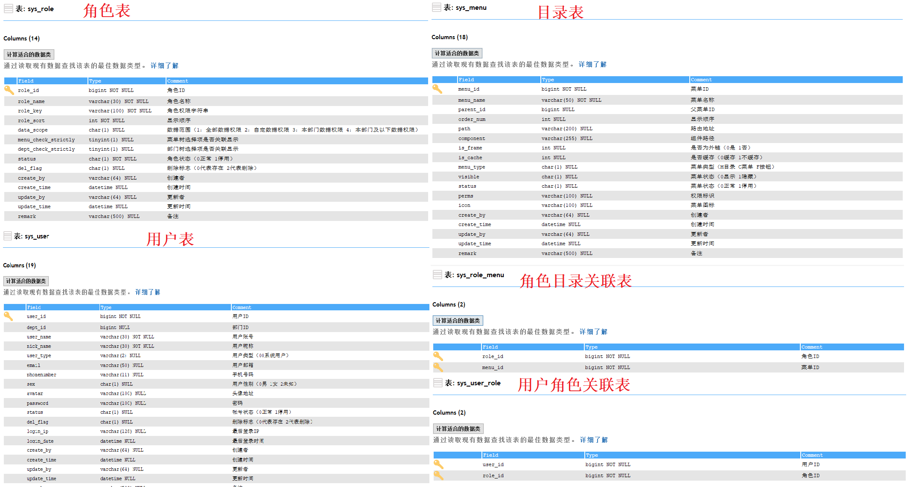
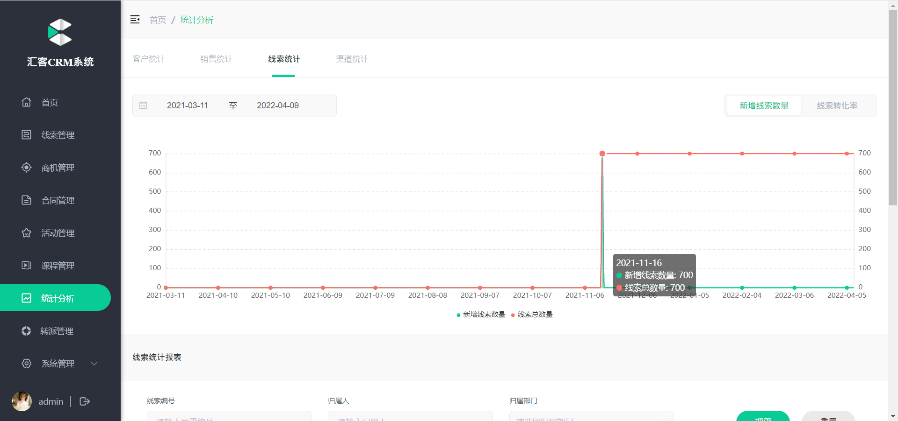
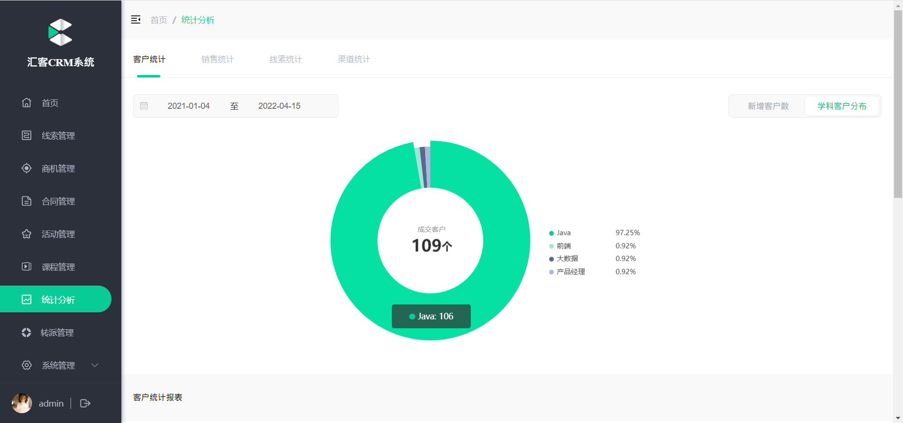
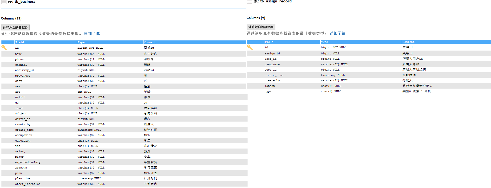

# 考试题

## 第一题

在CRM系统中提供了用户表，提供角色表，提供目录表，用户角色关联表，角色目录关联表

关系如下所示：



在下列sql能够在指定用户id的情况下，查询出用户对应的目录(不需要考虑状态，假定用户id是137)

正确答案 A,B,C

A：

```sql
SELECT *
FROM sys_menu m
	LEFT JOIN sys_role_menu rm ON m.menu_id = rm.menu_id
	LEFT JOIN sys_user_role ur ON rm.role_id = ur.role_id
WHERE ur.user_id = 137
```

B：

```sql
SELECT *
FROM sys_menu
WHERE menu_id IN (
	SELECT menu_id
	FROM `sys_role_menu`
	WHERE role_id IN (
		SELECT role_id
		FROM `sys_user_role`
		WHERE user_id = 137
	)
)
```

C:

```sql
SELECT *
FROM `sys_menu`
WHERE menu_id IN (
	SELECT rm.menu_id
	FROM `sys_role_menu` rm
		LEFT JOIN `sys_user_role` ur ON rm.role_id = ur.role_id
	WHERE ur.user_id = 137
)
```

D:

```sql
SELECT m.*
FROM `sys_role` ro
	LEFT JOIN `sys_user_role` ur ON ro.role_id = ur.role_id
	LEFT JOIN `sys_role_menu` rm ON ro.role_id = rm.role_id
	LEFT JOIN `sys_menu` m ON rm.role_id = m.menu_id
WHERE ur.user_id = 137
```

```ABAP
解析:
   D 选项  rm.role_id = m.menu_id 字段匹配错误
```

## 第二题

JWT（json web token）的组成：

正确答案：B

A	加密算法.密文

B	头信息header.载荷信息payload.签名sign

C 	加密算法.令牌类型.非敏感用户信息.密文

D	Base64加密的头信息.Base64加密的敏感数据.Base64加密的密文


## 第三题

前端浏览器发送数据到后端

a.后端如何接收如何接收url中?后拼接的参数,如http://127.0.0.1/api?name=zhangsan&age=18

b.如何接收json数据

c.springmvc中接收前端上传的文件使用的是什么类

**正确答案 D**

A @RequestParam,@RequestParam,File

B @PathVariable,@RequestParam,String

C @RequestBody,@RequestParam,MultipartFile

D @RequestParam,@RequestBody,MultipartFile

```ABAP
@RequestParam(可以省略)  接收?key=value 形式参数
@PathVariable 接收 路径传参：/clue/1234
@RequestBody 接受json: {}
springmvc 中 MultipartFile 接受 上传的附件
```


## 第四题

4.为什么后端返回数据给前端，前端接受到的是json数据

**正确答案 B,C**

A.因为返回的时候我们手动转了json

B.@ResponseBody

C.@RestController

D.@RequestBody

```ABAP
@RestController =@ResponseBody+@Controller
真正转json 是因为有 注解 @ResponseBody, 所以 B 和C 都对
```


## 第五题

Mybatis中mapper接口和对应的xml文件是如何对应上的

**正确答案：C**

A.插件帮我们定位的

B.按照文件名进行匹配的，定义一个Mapper接口 UserMapper.java，对应的xml文件的文件名是UserMapper.xml才能对应上

C.需要在xml文件中的namespace中指定Mapper层接口的全路径

D.xml文件需要和对应的接口文件在同一项目中即可

```ABAP
spring-boot 中 通过配置的方式制定 xml 文件的位置, 
但是 xml 和java 代码中方法的对应是通过 xml 中的namespace +id
```


## 第六题

在使用Mybatis的时候 #{}和${}有什么区别

**正确答案C**

A.没有区别

B.#{}不安全会将传入的所有信息直接使用,存在SQL注入的风险,${}使用? 占位符方式传参

C.${}不安全,会将传入的所有信息直接使用,存在SQL注入的风险,#{}使用? 占位符方式传参

D.在使用#{}的时候会在实际参数前加上#，在使用${}的时候会在实际参数前加上"$"


## 第七题

给定Mybatis中的查询语句

```xml
<mapper namespace="com.huike.clues.mapper.TestMapper">
  
<select id="getById" parameterType="Long" resultMap="GetResult">
    <include refid="getTest"/>
    where id = #{id}
</select>
</mapper>
```

可以分析出什么

**正确答案：B**

A：对应的是Mapper层接口是TestMapper,对应的方法名getById，传入参数是一个Long类型的参数,参数名为id,执行的sql语句引用了一个叫getTest的sql，对应的应该在xml里找到对应id为getTest的sql,最终返回的是一个在代码中定义了的实体类叫GetResult

B: 对应的是Mapper层接口是TestMapper,对应的方法名getById，传入参数是一个Long类型的参数,执行的sql语句引用了一个叫getTest的sql并且需要在引用的sql后拼接上where id = #{id}，对应的应该在xml里找到对应id为getTest的sql,最终返回的是一个在xml中定义了的resultMap,并且对应的这个resultMap的id是GetResult

C:给出条件较少，无法确定对应的Mapper层接口，但是能确定方法名是getById,传入参数是一个Long类型的参数,执行的sql语句引用了一个叫getTest的sql，对应的应该在xml里找到对应id为getTest的sql,最终返回的是一个在xml中定义了的resultMap,并且对应的这个resultMap的id是GetResult

D:给出条件较少，无法判断Mapper层接口，只能确定方法名，传入参数类型是一个long类型，并且返回的是一个在实体类中定义的类类名是GetResult

```ABAP
解析
  A:当参数只有一个时 ,#{}中变量名任意,所以我们不知道java 代码中参数名称是什么
     返回值使用的是ResultMap , 不是实体类对象
  C: 可以通过 namespace 知道接口名
  D: 返回值使用的是ResultMap , 不是实体类对象
```


## 第八题

在未使用任何插件想要通过Mybatis去实现分页查询，对应的limit里的参数是如何计算的

注：

​	前端给定，pageNum（页号）,pageSize（每页条数） 

​	前端给定了的页号从第一页开始，即从1开始

A limit pageNum , pageSize

B limit pageSize*(pageNum-1) , pageSize

C limit pageSize*pageNum , pageSize

D limit pageSize,pageNum

**正确答案：B**


## 第九题

CommandLineRunner接口有什么用  

提示:

```
CRM 项目启动类实现了该接口: 将所有已经存在的活动编号保存到Redis中（后续经过优化，已经删除了）
```

**正确答案D**

A：重写run方法里的内容，会在启动项目的同时，启动一个线程来执行run方法里的内容

B：重写run方法里的内容，会在服务启动前执行run方法里的内容

C：在服务启动完成后，开启一个线程来执行run方法里的内容

D：在服务启动完成后，顺序执行run方法里的内容


## 第十题

CRM系统中的验证码功能是怎么实现的？ 

 **正确答案C**

A.通过工具生成一个验证码的公式，将验证码的公式和验证码的结果返回给前端

B.通过工具生成验证码在内存中，生成一个uuid，将验证码的结果作为value,将uuid作为key存入到redis中，并设置了超时时间为2分钟，将内存中的uuid和验证码图片返回

C.通过开源工具生成验证码的公式和结果，截取结果部分@，使用uuid为key,验证码的结果为value存入到redis中，并设置超时时间为2分钟，将uuid返回给前端，将内存中验证码的图片使用base64转码后返回给前端

D.将生成的验证码的公式使用Base64转码返回给前端，将验证码的结果和uuid返回给前端


## 第十一题

对于CRM系统来说的核心业务逻辑是什么样的？

**正确答案A**

A.线索转商机转合同

B合同转商机转线索

C合同转线索转商机

D线索转合同转线索


## 第十二题

对于汇客CRM系统中在线索跟进阶段,连续很多天无法沟通的手机号和空号我们是如何处理的

**正确答案C**

A转商机

B转合同

C标记伪线索

D线索跟进


## 第十三题

对于汇客CRM系统中商机阶段，客户报名了别的机构，而不是在我们机构报名学习，我们会如何处理这部分客户

**正确答案D**

A.标记伪线索

B.转合同

C.转线索

D.踢回公海池


## 第十四题

对于汇客CRM系统来说，最终成交成客户需要与客户签订合同，这部分合同最终保存在哪

（只考虑汇客CRM系统）

**A.Minio服务器**

B.阿里云OSS服务器

C.本地磁盘存储

D.Mysql中存储

正确答案A


## 第十五题

对于汇客CRM系统中，如何确定一条商机**从过去到现在的所有的拥有人**

A：查询商机表，create_by即为当前的所属人

```sql
select create_by from `tb_business`
```

B：查询商机表和分配表，分配表里的assign_id若等于商机表里的id，并且分配表里的type为1，则分配表里的user_id则为所属人id

```sql
SELECT b.name AS businessName, ar.user_name AS `owner`
FROM `tb_business` b
	LEFT JOIN `tb_assign_record` ar
	ON b.id = ar.`assign_id`
		AND ar.type = 1
```

C：查询商机表和分配表，分配表里的assign_id若等于商机表里的id，且分配表里的latest为1，则分配表里的user_id则为所属人id

```sql
SELECT b.name AS businessName, ar.user_name AS `owner`
FROM `tb_business` b
	LEFT JOIN `tb_assign_record` ar
	ON b.id = ar.`assign_id`
		AND ar.latest = 1
```

D：查询商机表和分配表，分配表里的assign_id若等于商机表里的id，且分配表里的latest为1,且type为1，则分配表里的user_id则为所属人id

```sql
SELECT b.name AS businessName, ar.user_name AS `owner`
FROM `tb_business` b
	LEFT JOIN `tb_assign_record` ar
	ON b.id = ar.`assign_id`
		AND ar.type = 1
		AND ar.latest = 1
```

正确答案：B

```ABAP
tb_assign_record 表记录了分配记录
    type : 1,商机,0 线索
    latest: 1 最后一条记录
```


## 第十六题

对于汇客CRM系统中，如何确定一条线索的**最终所属人**

A：查询线索表，create_by即为当前的所属人

```sql
SELECT `create_by` FROM `tb_clue` 
```

B：查询线索表和分配表，分配表里的assign_id若等于线索表里的id，且分配表里的latest为1,且type为0，则分配表里的user_id则为所属人id

```sql
SELECT clue.name, ar.user_name AS `owner`
FROM `tb_clue` clue
	LEFT JOIN `tb_assign_record` ar
	ON clue.`id` = ar.assign_id
		AND ar.latest = 1
		AND ar.type = 0
```

C：查询线索表和分配表，分配表里的assign_id若等于线索表里的id，且分配表里的latest为1,且type为1，则分配表里的user_id则为所属人id

```sql
SELECT clue.name, ar.user_name AS `owner`
FROM `tb_clue` clue
	LEFT JOIN `tb_assign_record` ar
	ON clue.`id` = ar.assign_id
		AND ar.latest = 1
		AND ar.type = 1
```

D：查询线索表和分配表，分配表里的assign_id若等于线索表里的id，且type为0，则分配表里的user_id则为所属人id

```sql
SELECT clue.name, ar.user_name AS `owner`
FROM `tb_clue` clue
	LEFT JOIN `tb_assign_record` ar
	ON clue.`id` = ar.assign_id
		AND ar.type = 0
```

**正确答案：B**


## 第十七题

对于汇客CRM系统中，我们多次使用统计分析图表，其中符合折线图的封装类是哪一个

参考折线图：



参考json：

```json
{
    "xAxis":[
        "2021-03-11",
        "2021-03-12",
        "2021-03-13",
        "2021-03-14",
        "2021-03-15"
    ],
    "series":[
        {
            "name":"新增线索数量",
            "data":[
                0,
                0,
                0,
                0,
                0
            ]
        },
        {
            "name":"线索总数量",
            "data":[
                0,
                0,
                0,
                0,
                0
            ]
        }
    ]
}
```

A：

```java
public class Data {
    private List<String> xAxis = new ArrayList<>();
    private List<String> series = new ArrayList<>();
}
```

B：

```java
public class Data {
    private List<String> xAxis = new ArrayList<>();
    private Map series = new HashMap();
}
```

C：

```java
public class Data {
    private List<String> xAxis = new ArrayList<>();
    private List<Map> series = new ArrayList<>();
}
```

D：

```java
@Data
public class Data {
    private List<String> xAxis = new ArrayList<>();
    private List<Inner> series = new ArrayList<Inner>();
}
@Data
public class Inner {
		private String name;
		private List<Integer> data =new ArrayList<>();
}
```

正确答案：C

```ABAP
D: 选项 使用的是lombok 
   最终转json 后 xAxis 会变成小写的xaxis, 不满足要求
```

## 第十八题

对于汇客CRM系统中，我们多次使用统计分析图表，其中最符合饼状图的封装类是哪一个

参考饼状图：



参考json：

```json
[
        {
            "subject":"Java",
            "num":108
        },
        {
            "subject":"产品经理",
            "num":1
        },
        {
            "subject":"前端",
            "num":2
        },
        {
            "subject":"大数据",
            "num":1
        }
]
```

A：

```java
public class Data {
    private String subject;
    private String num;
}
```

B：

```java
public class Data {
    private String name;
    private Integer num;
}
```

C：

```java
public class Data {
    private String subject;
    private Integer num;
}
```

D：

```java
public class Data {
    private Integer subject;
    private Integer num;
}
```

正确答案：C

```xml
注意名称和类型
```


## 第十九题

对于汇客CRM系统来说，我们每次在页面上操作都需要记录操作日志，这部分是使用AOP+自定义注解来做的，记录了每次接口返回的内容和操作的接口，操作人的ip地址等

在系统中，切点的位置，使用了哪些通知类型

A. 切点位置：Controller层方法上(@Log)

​     通知类型：@AfterReturning，@AfterThrowing

B.切点位置:  Service层每个方法上

​    通知类型: @before

C.切点位置: Mapper层每个方法上

​    通知类型: @AfterThrowing

D. 切点位置：Controller层每一个方法上

​     通知类型：@before

**正确答案A**


## 第二十题

在CRM系统中，数据权限是和什么绑定的，数据权限是和用户的角色进行绑定的，在CRM系统中同样也是通过AOP+自定义注解的方式实现的数据权限，那么具体的切点和通知类型

A. 切点位置：Controller层每一个方法上

​     通知类型：@AfterReturning，@AfterThrowing

B.切点位置:  Service层方法上

​    通知类型: @before

C.切点位置: Mapper层每个方法上

​    通知类型: @AfterThrowing

D. 切点位置：Controller层每一个方法上

​     通知类型：@before

正确答案 B 前置通知（在方法执行前进行数据权限校验）


## 第二十一题

补充代码：提供两个数，计算两个数的百分比，并且计算出百分比后还需要精确2位小数

```
2 / 9 = 0.2222 ---> 0.2222 * 100 + % == 22.22%
```

**正确答案：A**

```java
BigDecimal numBigDecimal = new BigDecimal(num1);
BigDecimal allBigDecimal = new BigDecimal(num2);
BigDecimal divide = numBigDecimal.___(allBigDecimal,___,BigDecimal.ROUND_HALF_UP);
BigDecimal result = divide.____(new BigDecimal(100));
```

A：divide,4,multiply

B：multiply,2,divide

C：divide,2,multiply

D：multiply,4,divide


## 第二十二题

补全代码，补全使用并发编程CompletableFuture统计首页数据基本信息中的数据

```java
/**
     * 获取首页基本数据
     * @param beginCreateTime
     * @param endCreateTime
     * @return
     */
    @Override
    public IndexBaseInfoVO getBaseInfo(String beginCreateTime, String endCreateTime) {
        //1）构建一个空的结果集对象
        IndexBaseInfoVO result = new IndexBaseInfoVO();
        //2 封装结果集属性
        // 2.1 由于查询需要用到用户名 调用工具类获取用户名
        String username = SecurityUtils.getUsername();
        try {
            CompletableFuture<Integer> clueNums = CompletableFuture.supplyAsync(()->{
                // 2.2 开始查询第一个属性 线索数量
                return reportMpper.getCluesNum(beginCreateTime, endCreateTime, username);
            });
            CompletableFuture<Integer> bussinessNum = CompletableFuture.supplyAsync(()->{
                // 2.3 开始查询第一个属性 商机数量
                return reportMpper.getBusinessNum(beginCreateTime, endCreateTime, username);
            });

            CompletableFuture<Integer> contractNum = CompletableFuture.supplyAsync(()->{
                // 2.4 开始查询第一个属性 合同数量
                return reportMpper.getContractNum(beginCreateTime, endCreateTime, username);
            });
            CompletableFuture<Double> saleAmount = CompletableFuture.supplyAsync(()->{
                // 2.5 开始查询第一个属性 销售金额数量
                return reportMpper.getSalesAmount(beginCreateTime, endCreateTime, username);
            });
            //3 join等待所有线程全部执行完成
            CompletableFuture
                    .allOf(clueNums,
                            bussinessNum,
                            contractNum,
                            saleAmount)
                    .___();
            //4 封装结果集对象
            result.setCluesNum(___.get());
            result.setBusinessNum(___.get());
            result.setContractNum(___.get());
            result.setSalesAmount(___.get());
        }catch (Exception e) {
            e.printStackTrace();
            return null;
        }
        //5 返回结果集对象
        return result;
    }
```

A:join,clueNums,bussinessNum,saleAmount,contractNum

B:join,clueNums,saleAmount,contractNum,bussinessNum

C:join,saleAmount,contractNum,bussinessNum,clueNums

D:join,clueNums,bussinessNum,contractNum,saleAmount

**正确答案：D**

## 第二十四题

补全sql语句，需要统计商机的最终归属人的用户名和商机的所有信息

参考表字段信息：



```sql
SELECT b.*, r.create_by AS assign_by, _____ AS `owner`, r.create_time AS owner_time
FROM tb_business b
	LEFT JOIN tb_assign_record r ON b.___ = r.____
WHERE r.latest = ___ AND b.type = 1
```

A:r.user_id,b.id,r.assign_id,0

B:r.user_id,b.name,r.user_name,1

C:r.user_name,b.clue_id,r.assign_id,0

D:r.user_name, b.id,r.assign_id,1

**正确答案：D**


## 第二十四题

在CRM系统中的策略模式是如何使用的

A：在系统中我们手动new出了具体的实现类

B：通过@ConditionalOnProperty由spring来替我们选择具体的实现类，而我们需要使用的时候根据多态的方式new出Rule接口的实现类即可

C：通过@ConditionalOnProperty由spring来替我们选择具体的实现类，而我们需要使用的时候通过@Autowired注入Rule接口即可，因为具体的实现类已经由spring替我们选择好了

D：根据各个策略类上在IOC容器中的别名，通过getBean()方法获得

正确答案：C


## 第二十五题

在我们系统中redis存储了哪些内容：

A:   验证码的结果

B：活动编号

C：登录的用户信息

D：字典的内容

**正确答案：ABCD**