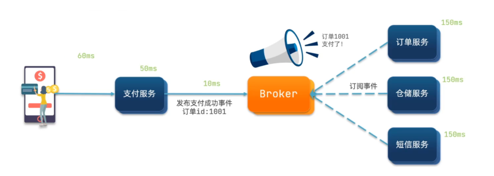

## MQ 笔记

## 1. 同步通信(理解)


```
同步调用的优点：
	- 时效性较强，可以立即得到结果
同步调用的问题：
    - 耦合度高
    - 性能和吞吐能力下降
    - 有额外的资源消耗
    - 有级联失败问题
```

## 2.异步通信(理解)



```
好处：
    - 吞吐量提升：无需等待订阅者处理完成，响应更快速
    - 故障隔离：服务没有直接调用，不存在级联失败问题
    - 调用间没有阻塞，不会造成无效的资源占用
    - 耦合度极低，每个服务都可以灵活插拔，可替换
    - 流量削峰：不管发布事件的流量波动多大，都由Broker接收，订阅者可以按照自己的速度去处理事件
缺点：
    - 架构复杂了，业务没有明显的流程线，不好管理
    - 需要依赖于Broker的可靠、安全、性能
    - 时效性差
```

## 3.技术对比

几种常见MQ的对比：

|            | **RabbitMQ**            | **ActiveMQ**                   | **RocketMQ** | **Kafka**  |
| ---------- | ----------------------- | ------------------------------ | ------------ | ---------- |
| 公司/社区  | Rabbit                  | Apache                         | 阿里         | Apache     |
| 开发语言   | Erlang                  | Java                           | Java         | Scala&Java |
| 协议支持   | AMQP，XMPP，SMTP，STOMP | OpenWire,STOMP，REST,XMPP,AMQP | 自定义协议   | 自定义协议 |
| 可用性     | 高                      | 一般                           | 高           | 高         |
| 单机吞吐量 | 一般                    | 差                             | 高           | 非常高     |
| 消息延迟   | 微秒级                  | 毫秒级                         | 毫秒级       | 毫秒以内   |
| 消息可靠性 | 高                      | 一般                           | 高           | 一般       |

追求可用性：Kafka、 RocketMQ 、RabbitMQ

追求可靠性：RabbitMQ、RocketMQ

追求吞吐能力：RocketMQ、Kafka

追求消息低延迟：RabbitMQ、Kafka

## 4 安装及概念

```
docker start mq 启动即可
	
    控制台:  http://192.168.136.132:15672
    java 代码访问:  http://192.168.136.132:5672
	用户名:itcast 
	密  码:123321
```

概念

```properties
Virtual Hosts: 虚拟主机,  不同的项目共用一个 mq 时使用\
                         不同的项目需要创建不同的用户名(多租户),和虚拟主机
publisher:生产者
consumer:消费者
exchange:交换机，负责消息路由(分发)
queue:队列，存储消息
channel : 通道, 负责消息的传输
```


## 5 入门


### 生产者

```java
package cn.itcast.mq.helloworld;

import com.rabbitmq.client.Channel;
import com.rabbitmq.client.Connection;
import com.rabbitmq.client.ConnectionFactory;
import org.junit.Test;

import java.io.IOException;
import java.util.concurrent.TimeoutException;

public class PublisherTest {
    @Test
    public void testSendMessage() throws IOException, TimeoutException {
        // 1.建立连接
        ConnectionFactory factory = new ConnectionFactory();
        // 1.1.设置连接参数，分别是：主机名、端口号、vhost、用户名、密码
        factory.setHost("192.168.136.132");
        factory.setPort(5672);
        factory.setVirtualHost("/");
        factory.setUsername("itcast");
        factory.setPassword("123321");
        // 1.2.建立连接
        Connection connection = factory.newConnection();

        // 2.创建通道Channel
        Channel channel = connection.createChannel();

        // 3.创建队列
        String queueName = "simple.queue";
        channel.queueDeclare(queueName, false, false, false, null);

        // 4.发送消息
        String message = "hello, rabbitmq!";
        channel.basicPublish("", queueName, null, message.getBytes());
        System.out.println("发送消息成功：【" + message + "】");

        // 5.关闭通道和连接
        channel.close();
        connection.close();
    }
}
```

### 消费者

```java

package cn.itcast.mq.helloworld;

import com.rabbitmq.client.*;

import java.io.IOException;
import java.util.concurrent.TimeoutException;

public class ConsumerTest {

    public static void main(String[] args) throws IOException, TimeoutException {
        // 1.建立连接
        ConnectionFactory factory = new ConnectionFactory();
        // 1.1.设置连接参数，分别是：主机名、端口号、vhost、用户名、密码
        factory.setHost("192.168.136.132");
        factory.setPort(5672);
        factory.setVirtualHost("/");
        factory.setUsername("itcast");
        factory.setPassword("123321");
        // 1.2.建立连接
        Connection connection = factory.newConnection();

        // 2.创建通道Channel
        Channel channel = connection.createChannel();

        // 3.创建队列
        String queueName = "simple.queue";
        channel.queueDeclare(queueName, false, false, false, null);

        // 4.订阅消息
        channel.basicConsume(queueName, true, new DefaultConsumer(channel){
            @Override
            public void handleDelivery(String consumerTag, Envelope envelope,
                                       AMQP.BasicProperties properties, byte[] body) throws IOException {
                // 5.处理消息
                String message = new String(body);
                System.out.println("接收到消息：【" + message + "】");

            }
        });


        System.out.println("等待接收消息。。。。");
    }
}

```

## 6 Spring AMQP 入门 (理解)

```
SpringAMQP是基于RabbitMQ封装的一套模板，并且还利用SpringBoot对其实现了自动装配，使用起来非常方便。
```


父工程

```xml
<!--AMQP依赖，包含RabbitMQ-->
<dependency>
    <groupId>org.springframework.boot</groupId>
    <artifactId>spring-boot-starter-amqp</artifactId>
</dependency>
```

### 6.1 消息发送

首先配置MQ地址，在publisher服务的application.yml中添加配置：

```yaml
spring:
  rabbitmq:
    host: 192.168.150.101 # 主机名
    port: 5672 # 端口
    virtual-host: / # 虚拟主机
    username: itcast # 用户名
    password: 123321 # 密码
```


然后在publisher服务中编写测试类SpringAmqpTest，并利用RabbitTemplate实现消息发送：

```java
package cn.itcast.mq.spring;

import org.junit.Test;
import org.junit.runner.RunWith;
import org.springframework.amqp.rabbit.core.RabbitTemplate;
import org.springframework.beans.factory.annotation.Autowired;
import org.springframework.boot.test.context.SpringBootTest;
import org.springframework.test.context.junit4.SpringRunner;

@RunWith(SpringRunner.class)
@SpringBootTest
public class SpringAmqpTest {

    @Autowired
    private RabbitTemplate rabbitTemplate;

    @Test
    public void testSimpleQueue() {
        // 队列名称
        String queueName = "simple.queue";
        // 消息
        String message = "hello, spring amqp!";
        // 发送消息
        rabbitTemplate.convertAndSend(queueName, message);
    }
}
```

```ABAP
注意:
	spring-amqp 默认情况下的简单消息的发送不会自动创建 消息队列,需要在启动类上增加如下代码
    @Bean
    public Queue testQueue(){
        return new Queue("simple.queue",false);
    }
```


### 6.2.消息接收

首先配置MQ地址，在consumer服务的application.yml中添加配置：

```yaml
spring:
  rabbitmq:
    host: 192.168.150.101 # 主机名
    port: 5672 # 端口
    virtual-host: / # 虚拟主机
    username: itcast # 用户名
    password: 123321 # 密码
```


然后在consumer服务的`cn.itcast.mq.listener`包中新建一个类SpringRabbitListener，代码如下：

```java
package cn.itcast.mq.listener;

import org.springframework.amqp.rabbit.annotation.RabbitListener;
import org.springframework.stereotype.Component;

@Component
public class SpringRabbitListener {

    @RabbitListener(queues = "simple.queue")
    public void listenSimpleQueueMessage(String msg) throws InterruptedException {
        System.out.println("spring 消费者接收到消息：【" + msg + "】");
    }
}
```

### 6.3 测试

启动consumer服务，然后在publisher服务中运行测试代码，发送MQ消息

注意:

```java
此处并不会自动创建队列, 如果使用的队列名称不存在则监控不成功

可以在 消息生产者一方增加 如下代码 则会自动创建对象

   public Queue testQueue(){
        return new Queue("simple.queue",false);
    }

```

## 7 五种消息模型 (重点)

### 7.1 普通模式


### 7.2 工作队列模型


```yaml
默认是轮训投递(不管消费者是否能处理完)
配置消息预取 可以解决服务器性能不一致导致消息不及时消费问题
spring:
  rabbitmq:
    host: 192.168.136.132 #rabbitMQ的ip地址
    port: 5672 # 端口
    username: itcast
    password: 123321
    virtual-host: /
    listener:
      simple:
        prefetch: 1  #  这里的1 值得是消费者可以累积多少个未处理消息
```

````
代码参考springAMQP 入门案例(配置两个相同的消费者即可)
````


### 7.3 发布订阅模型

#### 7.3.1 广播模式

```
特征: 交换机会把消息给所有绑定的队列 (本身不会存储)
```


**声明绑定关系(生产者或者消费者声明)**

```java

@Configuration
public class FanoutConfig {
    // itcast.fanout  交换机
    @Bean
    public FanoutExchange fanoutExchange(){
        return new FanoutExchange("itcast.fanout");
    }

    // fanout.queue1 队列
    @Bean
    public Queue fanoutQueue1(){
        return new Queue("fanout.queue1");
    }

    // 绑定队列1到交换机
    @Bean
    public Binding fanoutBinding1(Queue fanoutQueue1, FanoutExchange fanoutExchange){
        return BindingBuilder
                .bind(fanoutQueue1)
                .to(fanoutExchange);
    }

    // fanout.queue2
    @Bean
    public Queue fanoutQueue2(){
        return new Queue("fanout.queue2");
    }

    // 绑定队列2到交换机
    @Bean
    public Binding fanoutBinding2(Queue fanoutQueue2, FanoutExchange fanoutExchange){
        return BindingBuilder
                .bind(fanoutQueue2)
                .to(fanoutExchange);
    }
}
```

**生产者**

```java
   @Test
    public void testSendFanoutExchange() {
        // 交换机名称
        String exchangeName = "itcast.fanout";
        // 消息
        String message = "hello, every one!";

        // 发送消息
        rabbitTemplate.convertAndSend(exchangeName, "", message);
    }
```

消费者

```java
   @RabbitListener(queues = "fanout.queue1")
    public void listenFanoutQueue1(String msg) {
        System.out.println("消费者接收到fanout.queue1的消息：【" + msg + "】");
    }
    @RabbitListener(queues = "fanout.queue2")
    public void listenFanoutQueue2(String msg) {
        System.out.println("消费者接收到fanout.queue2的消息：【" + msg + "】");
    }

```


#### 7.3.2 路由模式

```
按照(Routing Key)字符串精确匹配
```

```
在Direct模型下：

- 队列与交换机的绑定，不能是任意绑定了，而是要指定一个`RoutingKey`（路由key）
- 消息的发送方在 向 Exchange发送消息时，也必须指定消息的 `RoutingKey`。
- Exchange不再把消息交给每一个绑定的队列，而是根据消息的`Routing Key`进行判断，只有队列的`Routingkey`与消息的 `Routing key`完全一致，才会接收到消息
```


**生产者**

```java
  @Test
    public void testSendDirectExchange() {
        // 交换机名称
        String exchangeName = "itcast.direct";
        // 消息
        String message = "hello, blue!";
        // 发送消息
        rabbitTemplate.convertAndSend(exchangeName, "blue", message);
    }
```


**消费者**

````java
 @RabbitListener(bindings = @QueueBinding(
            value = @Queue(name = "direct.queue1"),
            exchange = @Exchange(name = "itcast.direct", type = ExchangeTypes.DIRECT),
            key = {"red", "blue"}
    ))
    public void listenDirectQueue1(String msg){
        System.out.println("消费者接收到direct.queue1的消息：【" + msg + "】");
    }
   
    @RabbitListener(bindings = @QueueBinding(
            value = @Queue(name = "direct.queue2"),
            exchange = @Exchange(name = "itcast.direct", type = ExchangeTypes.DIRECT),
            key = {"red", "yellow"}
    ))
    public void listenDirectQueue2(String msg){
        System.out.println("消费者接收到direct.queue2的消息：【" + msg + "】");
    }
  
````


#### 7.3.3 Topic 模式

```
`Topic`类型的`Exchange`与`Direct`相比，都是可以根据`RoutingKey`把消息路由到不同的队列。只不过`Topic`类型`Exchange`可以让队列在绑定`Routing key` 的时候使用通配符！(按照单词进行模糊匹配)

通配符规则：
`#`：匹配0个或多个词
`*`：匹配不多不少恰好1个词
```


**生产者**

```java
  @Test
    public void testSendTopicExchange() {
        // 交换机名称
        String exchangeName = "itcast.topic";
        // 消息
        String message = "今天天气不错，我的心情好极了!";
        // 发送消息
        rabbitTemplate.convertAndSend(exchangeName, "china.news", message);
    }
```

**消费者**

```java
 @RabbitListener(bindings = @QueueBinding(
            value = @Queue(name = "topic.queue1"),
            exchange = @Exchange(name = "itcast.topic", type = ExchangeTypes.TOPIC),
            key = "china.#"
    ))

    // china.# :  china.news.a   , china.news.b
    // china.* :  china.news, china.logs
    public void listenTopicQueue1(String msg){
        System.out.println("消费者接收到topic.queue1的消息：【" + msg + "】");
    }
    //
    @RabbitListener(bindings = @QueueBinding(
            value = @Queue(name = "topic.queue2"),
            exchange = @Exchange(name = "itcast.topic", type = ExchangeTypes.TOPIC),
            key = "#.news"
    ))
    public void listenTopicQueue2(String msg){
        System.out.println("消费者接收到topic.queue2的消息：【" + msg + "】");
    }
    
```

## 8 消息转换器

```
默认 Spring会把你发送的消息序列化为字节发送给MQ 使用的是jdk 的序列化
JDK序列化存在下列问题：
- 数据体积过大
- 有安全漏洞
- 可读性差
```

可以替换为 json

**生产者和消费者要有相同的配置**

在publisher和consumer两个服务中都引入依赖：

```xml
<dependency>
    <groupId>com.fasterxml.jackson.dataformat</groupId>
    <artifactId>jackson-dataformat-xml</artifactId>
    <version>2.9.10</version>
</dependency>
```

配置消息转换器。

在启动类中添加一个Bean即可：

```java
@Bean
public MessageConverter jsonMessageConverter(){
    return new Jackson2JsonMessageConverter();
}
```


