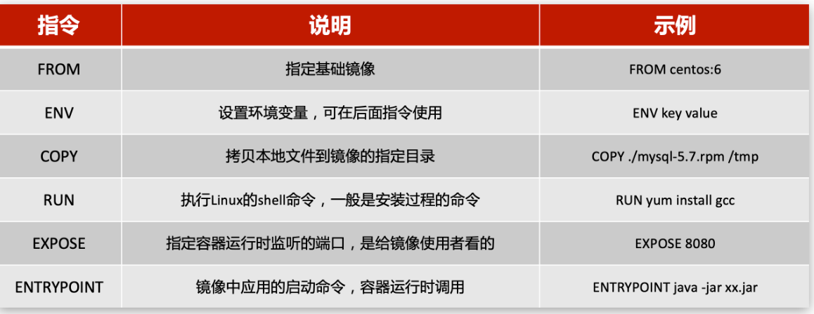
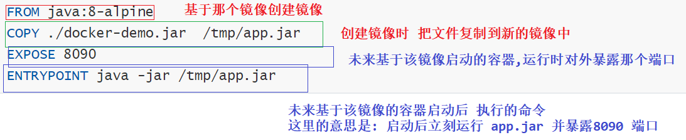
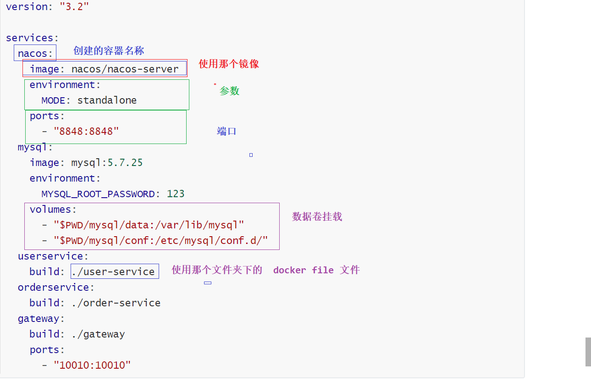

## Linux 命令

```shell
# 关闭
systemctl stop firewalld
# 禁止开机启动防火墙
systemctl disable firewalld
```

```shell
sed -i -e 's#旧字符串#新字符串#g' -e 's#旧字符串#新字符串#g' 文件名
```


## docker命令

查看某个命令的帮助

```shell
#例如:  查看save 命令帮助
docker save --help
```

### 服务命令

```shell
 # 启动docker服务
systemctl start docker
 # 重启docker服务
systemctl restart docker
 # 停止docker服务
systemctl stop docker
# 查看状态
systemctl status docker
# 开机启动 docker 
systemctl enable docker
```

###镜像命令

```shell
# 查看
docker images 
# 删除镜像
docker rmi id
# 搜索
docker search xxxx 
# 下载
docker pull xxx:version
# 例如拉取nginx 指定版本
docker pull nginx:tag
# 镜像导出
# 命令格式：
docker save -o [保存的目标文件名称] [镜像名称]
# 例如
docker save -o nginx.tar nginx:latest
 # 导入
docker load -i nginx.tar
```

### 容器命令

```shell
# 查看容器(已经启动的)
docker ps 
# 查看容器(所有)
docker ps  -a
# 创建 并后台运行
docker run -d  --name=c1 centos:7 
# 创建后立即进入(注意这种方式进入后)
docker run -it  --name=c1 centos:7 
# 进入容器
docker exec -it c1 /bin/bash
# 启动
docker start  c1
# 停止
docker stop  c1
# 删除
docker rm  c1
# 查看详情
docker inspect 容器名称或者容器id

# 让一个运行的容器暂停
docker pause c1
# 让一个容器从暂停状态恢复运行
docker unpause
# 查看日志
docker logs c1
# 查看日志 - 添加 -f 参数可以持续查看日志
docker logs -f c1
```

### 端口映射

```
-p 宿主机端口: 容器内部端口
说明: 一个容器可以映射多个端口
```

```sh
# 创建并启动容器
docker run --name containerName -p 80:80  -d nginx

# docker run ：创建并运行一个容器
# --name : 给容器起一个名字，比如叫做mn
# -p ：将宿主机端口与容器端口映射，冒号左侧是宿主机端口，右侧是容器端口
# -d：后台运行容器
# nginx：镜像名称，例如nginx
 -p
```

### 数据卷

#### 创建

```shell
# 创建数据卷
docker volume create html
#查看所有数据卷
docker volume ls

#查看数据卷详细信息，包括关联的宿主机目录位置
docker volume inspect
#删除指定数据卷
docker volume rm xxx
#删除所有未使用的数据卷
docker volume prune
```

#### 挂载数据卷

```
1.数据卷(目录)不存在会自动创建
2. 一个容器可以挂载多个数据卷
3. 一个数据卷也可以被多个容器挂载(两个容器可以挂载同一个文件夹)
4. 通过命令的方式不支持数据卷更新(只能修改配置,但是繁琐)
```

```sh
# 格式
docker run ... -v 宿主机目录(文件):容器内目录(文件) ...
```

**方式1: 使用上面创建好的数据卷**

```shell
# -v html:/root/htm ：把html数据卷挂载到容器内的/root/html这个目录中

docker run \
  --name mn \
  -v html:/root/html \
  -p 8080:80
  nginx \
```

**方式2: 不使用创建好的数据卷(linux绝对 路径)**

```sh
docker run \
--name mysql \
-e MYSQL_ROOT_PASSWORD=123 \
-p 3306:3306 \
-v /tmp/mysql/conf/hmy.cnf:/etc/mysql/conf.d/hmy.cnf \
-v /tmp/mysql/data:/var/lib/mysql \
-d \
mysql:5.7.25
#  这里的 -v /tmp/mysql/conf/hmy.cnf:/etc/mysql/conf.d/hmy.cnf 是将两个文件 挂载(不是目录)
#  这里的-v /tmp/mysql/data:/var/lib/mysql   是目录挂载
```

### Dockerfile

```sh
# 基于Dockerfile文件 构建 镜像(必须叫Dockerfile)
docker build -t javaweb:1.0 .
# 基于指定dockerfile文件名 构建 镜像(文件名任意)
docker build -f dockerfile2 -t javaweb:1.0 .
```


常用指令



```dockerfile
FROM java:8-alpine
COPY ./docker-demo.jar  /tmp/app.jar
EXPOSE 8090
ENTRYPOINT java -jar /tmp/app.jar
```



### Docker-Compose

```shell
# 文件名必须是 docker-compose.yml,可以使用 -f  指定文件名
# 启动
docker-compose up -d
#查看 日志
docker-compose logs  -f  xxxx  
# 重启服务
docker-compose logs  -f  xxxx  
```



## 私有仓库

```sh
#推送镜像到私有镜像服务必须先tag，步骤如下：

#重新tag本地镜像，名称前缀为私有仓库的地址：192.168.150.101:8080/
docker tag nginx:latest 192.168.150.101:8080/nginx:1.0 
#推送镜像
docker push 192.168.150.101:8080/nginx:1.0 
#拉取镜像
docker pull 192.168.150.101:8080/nginx:1.0 
```

