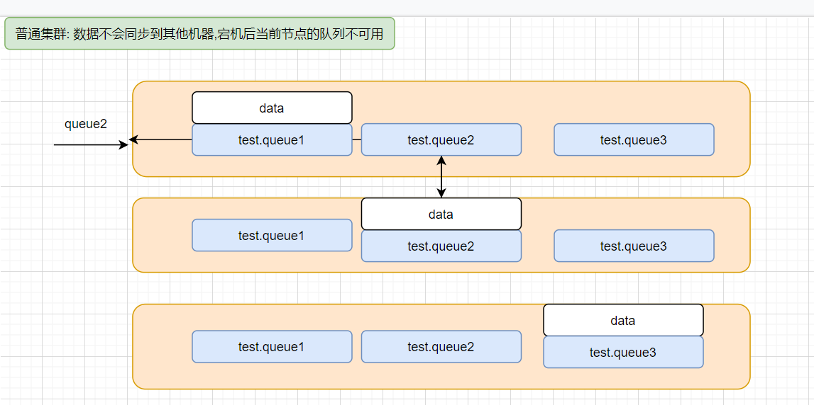
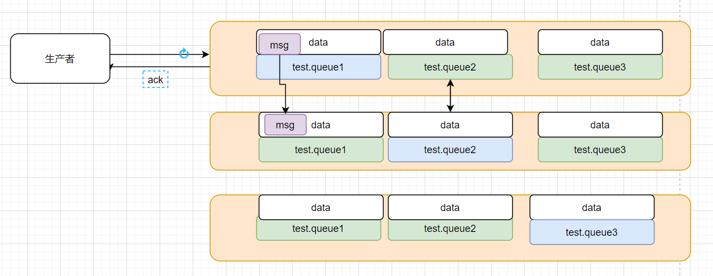

# MQ笔记 高级

## 1. MQ 的问题

```
1 消息可靠性问题:
	消息从发送，到消费者接收，会经理多个过程：其中的每一步都可能导致消息丢失
          - 生产者发送的消息未送达exchange
          - 消息到达exchange后未到达queue
          - MQ宕机，queue将消息丢失
          - consumer接收到消息后未消费就宕机
2.消息堆积问题:
    当生产者发送消息的速度超过了消费者处理消息的速度，就会导致队列中的消息堆积，直到队列存储消息达到上限。之后发送的消息就会成为死信，可能会被丢弃，这就是消息堆积问题。
```

```
3. 业务需求: 
	希望MQ 能具备定时消费消息功能: 例如,超时未支付,订单回退(库存回复)
```

```
4. MQ 单机故障
```


## 2.消息可靠性: 生产者消息确认


### 2.1修改配置

```yaml
spring:
  rabbitmq:
    publisher-confirm-type: correlated
    publisher-returns: true
    template:
      mandatory: true
```

说明：

- `publish-confirm-type`：开启publisher-confirm，这里支持两种类型：
  - `simple`：同步等待confirm结果，直到超时
  - `correlated`：异步回调，定义ConfirmCallback，MQ返回结果时会回调这个ConfirmCallback
- `publish-returns`：开启publish-return功能，同样是基于callback机制，不过是定义ReturnCallback
- `template.mandatory`：定义消息路由失败时的策略。true，则调用ReturnCallback；false：则直接丢弃消息

### 2.2定义Return回调

每个RabbitTemplate只能配置一个ReturnCallback，因此需要在项目加载时配置：

修改publisher服务，添加一个：

```java
package cn.itcast.mq.config;

import lombok.extern.slf4j.Slf4j;
import org.springframework.amqp.rabbit.core.RabbitTemplate;
import org.springframework.amqp.support.converter.Jackson2JsonMessageConverter;
import org.springframework.amqp.support.converter.MessageConverter;
import org.springframework.beans.BeansException;
import org.springframework.context.ApplicationContext;
import org.springframework.context.ApplicationContextAware;
import org.springframework.context.annotation.Bean;
import org.springframework.context.annotation.Configuration;
@Slf4j
@Configuration
public class CommonConfig implements ApplicationContextAware {

    //消息发送失败 调用
    // 1: 消息到达了 交换机但是没有到达队列
    // 2: 消息发送到交换机后,只要有个队列收到了消息,则消息就会被认为发送成功,该方法不会被调用
    @Override
    public void setApplicationContext(ApplicationContext applicationContext) throws BeansException {
        // 获取RabbitTemplate
        RabbitTemplate rabbitTemplate = applicationContext.getBean(RabbitTemplate.class);
        // 设置ReturnCallback
        rabbitTemplate.setReturnCallback((message, replyCode, replyText, exchange, routingKey) -> {
            // 投递失败，记录日志
            log.info("CommonConfig中:消息发送失败，应答码{}，原因{}，交换机{}，路由键{},消息{}",
                    replyCode, replyText, exchange, routingKey, message.toString());
            // 如果有业务需要，可以重发消息
        });
    }

}

```


### 2.3定义ConfirmCallback

ConfirmCallback可以在发送消息时指定，因为每个业务处理confirm成功或失败的逻辑不一定相同。

在publisher服务的cn.itcast.mq.spring.SpringAmqpTest类中，定义一个单元测试方法：

```java
	/*
      测试消息发送持久化
     */
    @Test
    public void testSendMessage2SimpleQueue() throws InterruptedException {
        // 1.消息体
        String message = "hello, spring amqp!";
        // 2.全局唯一的消息ID，需要封装到CorrelationData中
        CorrelationData correlationData = new CorrelationData(UUID.randomUUID().toString());
        // 3.添加callback
        correlationData.getFuture().addCallback(
                result -> {
                    if(result.isAck()){
                        // 3.1.ack，消息成功 (消息投递到交换机成功,该方法就会被调用,不管有没有投递到队列)
                        log.debug("消息发送成功, ID:{}", correlationData.getId());
                    }else{
                        // 3.2.nack，消息失败 (消息投递到交换机失败:例如交换机不存在)
                        log.error("消息发送失败Nack, ID:{}, 原因{}",correlationData.getId(), result.getReason());
                    }
                }, // 消息失败 (消息投递到过程抛出异常,rabbitmq 内部错误)
                ex -> log.error("消息发送异常, ID:{}, 原因{}",correlationData.getId(),ex.getMessage())
        );
        // 4.发送消息
        rabbitTemplate.convertAndSend("confirm.topic", "conform1.log", message, correlationData);

        // 休眠一会儿，等待ack回执
        Thread.sleep(2000);
    }
```

手动创建交换机


手动创建队列


绑定


## 3.消息可靠性: 持久化

```
RabbitMQ 创建的队列和交换机不是持久化的
SpringAMQP 创建的队列和交换机,消息默认都是持久化的
```

```
生产者确认可以确保消息投递到RabbitMQ的队列中，但是消息发送到RabbitMQ以后，如果突然宕机，也可能导致消息丢失。(消息默认在内存中)
要想确保消息在RabbitMQ中安全保存，必须开启消息持久化机制。

- 交换机持久化
- 队列持久化
- 消息持久化
```

### 3.1.交换机持久化

RabbitMQ中交换机默认是非持久化的，mq重启后就丢失。

SpringAMQP中可以通过代码指定交换机持久化：

```java
@Bean
public DirectExchange simpleExchange(){
    // 三个参数：交换机名称、是否持久化、当没有queue与其绑定时是否自动删除
    return new DirectExchange("simple.direct", true, false);
}
```

事实上，默认情况下，由SpringAMQP声明的交换机都是持久化的。


可以在RabbitMQ控制台看到持久化的交换机都会带上`D`的标示：


### 3.2.队列持久化

RabbitMQ中队列默认是非持久化的，mq重启后就丢失。

SpringAMQP中可以通过代码指定交换机持久化：

```java
@Bean
public Queue simpleQueue(){
    // 使用QueueBuilder构建队列，durable就是持久化的
    return QueueBuilder.durable("simple.queue").build();
}
```

事实上，默认情况下，由SpringAMQP声明的队列都是持久化的。

可以在RabbitMQ控制台看到持久化的队列都会带上`D`的标示：


### 3..3.消息持久化

利用SpringAMQP发送消息时，可以设置消息的属性（MessageProperties），指定delivery-mode：

- 1：非持久化
- 2：持久化

用java代码指定：

```java
// 持久化消息
@Test
public void testDurableMessage() {
    // 1.准备消息
    Message message = MessageBuilder.withBody("hello, spring".getBytes(StandardCharsets.UTF_8))
        .setDeliveryMode(MessageDeliveryMode.PERSISTENT)
        .build();
    // 2.发送消息
    rabbitTemplate.convertAndSend("simple.queue", message);
}
```


默认情况下，SpringAMQP发出的任何消息都是持久化的，不用特意指定。

## 4.消息可靠性: 消费者确认

```yaml
spring:
  rabbitmq:
    host: 192.168.136.132 # rabbitMQ的ip地址
    port: 5672 # 端口
    username: itcast
    password: 123321
    virtual-host: /
    listener:
      simple:
        #消息预取
        prefetch: 1
        #确认机制
        acknowledge-mode: auto
```

```
•manual：手动ack，需要在业务代码结束后，调用api发送ack。
•auto：自动ack，由spring监测listener代码是否出现异常，没有异常则返回ack；抛出异常则返回nack
•none：关闭ack，MQ假定消费者获取消息后会成功处理，因此消息投递后立即被删除
```

### 4.1 默认机制

```
auto 模式:
	默认情况下,代码抛出异常后,消息会回退给MQ ,mq 会把消息重新投递给消费者 
```

```
缺点:
	消息被不断消费,性能低
```

### 4.2 消息重试

```
消费者拿到消息后,进行本地重试,重试完成后,返回给队列一个拒绝状态
缺点:
    消息会被丢弃,而且无法找回
```

```yaml
spring:
  rabbitmq:
    host: 192.168.136.132 # rabbitMQ的ip地址
    port: 5672 # 端口
    username: itcast
    password: 123321
    virtual-host: /
    listener:
      simple:
        #消息预取
        prefetch: 1
        #确认机制
        acknowledge-mode: auto
        # 重试
        retry:
          enabled: true # 开启消费者失败重试
          initial-interval: 1000 # 初次的失败等待时长为1秒
          multiplier: 2 # 失败的等待时长倍数，下次等待时长 = multiplier * 上一次等待时长
          max-attempts: 3 # 最大重试次数
          stateless: true # true无状态；false有状态。如果业务中包含事务，这里改为false
```


### 4.3 自定义交换机:记录错误消息(一般不用)


````java
 //==========================自定义错误队列===========================================
    // 失败后自己定义一个 错误队列,接收 那些重试后依旧失败的任务
    //  监听器到这类消息,可以记录到一个专门的日志中,等待认为干预 或者发送短信(邮件)给指定人员处理
    @Bean
    public DirectExchange errorMessageExchange(){
        return new DirectExchange("error.direct");
    }
    @Bean
    public Queue errorQueue(){
        return new Queue("error.queue", true);
    }
    @Bean
    public Binding errorBinding(Queue errorQueue, DirectExchange errorMessageExchange){
        return BindingBuilder.bind(errorQueue).to(errorMessageExchange).with("error");
    }

    @Bean
    public MessageRecoverer republishMessageRecoverer(RabbitTemplate rabbitTemplate){
        return new RepublishMessageRecoverer(rabbitTemplate, "error.direct", "error");
    }
````

## 5.死信

```
什么是死信？
当一个队列中的消息满足下列情况之一时，可以成为死信（dead letter）：
- 消费者使用basic.reject或 basic.nack声明消费失败，并且消息的requeue参数设置为false
- 消息是一个过期消息，超时无人消费
- 要投递的队列消息满了，无法投递
```


```
死信交换机及死信队列的应用:
1) 记录错误消息
2) 实现延时消费
```


## 6 死信的应用: TTL定时消费


```java
 //===============================死信: 消息定时=====================================
    // 声明一个队列，并且指定TTL,同时绑定死信交换机
    @Bean
    public Queue ttlQueue(){
        return QueueBuilder.durable("ttl.queue") // 指定队列名称，并持久化
                .ttl(10000) // 设置队列的超时时间，10秒
                .deadLetterExchange("dl.direct") // 指定死信交换机
                .deadLetterRoutingKey("dl")
                .build();
    }
    // 声明一个 交换机
    @Bean
    public DirectExchange ttlExchange(){
        return new DirectExchange("ttl.direct");
    }
    @Bean
    public Binding ttlBinding(){
        return BindingBuilder.bind(ttlQueue()).to(ttlExchange()).with("ttl");
    }
```

```java
    /*
        ttl1 :声明死信交换机及死信队列绑定关系
     */

    @RabbitListener(bindings = @QueueBinding(
            value = @Queue(name = "dl.queue", durable = "true"),
            exchange =@Exchange(name = "dl.direct"),
            key = "dl"
    ))
    public void listenDlQueue(String msg){
        log.info("接收到 dl.ttl.queue的延迟消息：{}", msg);
    }

```

发送消息

```java

 //实现发送TTL 消息
    @Test
    public void testTTLQueue() {
        // 创建消息
        String message = "hello, ttl queue";
        // 消息ID，需要封装到CorrelationData中
        CorrelationData correlationData = new CorrelationData(UUID.randomUUID().toString());
        // 发送消息
        rabbitTemplate.convertAndSend("ttl.direct", "ttl", message, correlationData);
        // 记录日志
        log.debug("发送消息成功");
    }
```

```java
@Test
public void testTTLMsg() {
    // 创建消息
    Message message = MessageBuilder
        .withBody("hello, ttl message".getBytes(StandardCharsets.UTF_8))
        .setExpiration("5000")
        .build();
    // 消息ID，需要封装到CorrelationData中
    CorrelationData correlationData = new CorrelationData(UUID.randomUUID().toString());
    // 发送消息
    rabbitTemplate.convertAndSend("ttl.direct", "ttl", message, correlationData);
    log.debug("发送消息成功");
}
```


## 7.插件实现: TTL定时消费


```
给大家的 虚拟机中已经安装好了另外一个 容器 mq2  启动即可
# 停止原来的MQ
docker stop mq
# 启动新的MQ
docker start mq2
```


```java
  /*
        ttl2 : 消息延时: 使用插件
     */
    @RabbitListener(bindings = @QueueBinding(
            value = @Queue(name = "delay.queue", durable = "true"),
            exchange = @Exchange(name = "delay.direct", delayed = "true"),
            key = "delay"
    ))
    public void listenDelayExchange(String msg) {
        log.info("消费者接收到了delay.queue的延迟消息"+msg);
    }

```

发送消息

```java


    //实现发送TTL 消息 , 使用插件方式
    @Test
    public void testSendDelayMessage() throws InterruptedException {
        // 1.准备消息
        Message message = MessageBuilder
                .withBody("hello, ttl messsage".getBytes(StandardCharsets.UTF_8))
                .setDeliveryMode(MessageDeliveryMode.PERSISTENT)
                .setHeader("x-delay", 5000)
                .build();
        // 2.准备CorrelationData
        CorrelationData correlationData = new CorrelationData(UUID.randomUUID().toString());
        // 3.发送消息
        rabbitTemplate.convertAndSend("delay.direct", "delay", message, correlationData);
        log.info("发送消息成功");
    }

```

## 8 消息堆积问题

```
- 增加更多消费者，提高消费速度。也就是我们之前说的work queue模式
- 扩大队列容积，提高堆积上限(惰性队列)
```


## 9 MQ 可靠性

### 9.1 普通集群

特征

```properties
- 会在集群的各个节点间共享部分数据，包括：交换机、队列元信息。不包含队列中的消息。
- 当访问集群某节点时，如果队列不在该节点，会从数据所在节点传递到当前节点并返回
```


```
优点:
	相比于单机版,能提升MQ整体处理消息的能力
 缺点:
 	队列所在节点宕机，队列中的消息就会丢失 即无法保重MQ的 高可用性

```




```
给大家的虚拟机准备好了集群
   1)删除/tmp/rabbitmq 文件夹下的内容
   2) 创建mq1 ,mq2 mq3 文件夹
   3) 放入对应的配置文件
   4) docker start mqc1   mqc2  mqc3
```


### 9.2 镜像集群(主从)

```properties
镜像集群：本质是主从模式，具备下面的特征：
    - 交换机、队列、队列中的消息会在各个mq的镜像节点之间同步备份。
    - 创建队列的节点被称为该队列的**主节点，**备份到的其它节点叫做该队列的**镜像**节点。
    - 一个队列的主节点可能是另一个队列的镜像节点
    - 所有操作都是主节点完成，然后同步给镜像节点
    - 主宕机后，镜像节点会替代成新的主
```


```
镜像集群缺点:
     
```

### 9.3 仲裁队列

```
仲裁队列：仲裁队列是3.8版本以后才有的新功能，用来替代镜像队列，具备下列特征：

- 与镜像队列一样，都是主从模式，支持主从数据同步(比镜像集群使用简单,自动)
- 使用非常简单，没有复杂的配置
- 主从同步基于Raft协议，强一致
  生产者消息发送后 先同步数据(过半机器成功就返回)再返回状态

```




## 10 Java  链接集群

### 10.1 Java代码创建仲裁队列

```java
@Bean
public Queue quorumQueue() {
    return QueueBuilder
        .durable("quorum.queue") // 持久化
        .quorum() // 仲裁队列
        .build();
}
```


### 10.2 SpringAMQP连接MQ集群

注意，这里用address来代替host、port方式

```yaml
spring:
  rabbitmq:
    addresses: 192.168.150.105:8071, 192.168.150.105:8072, 192.168.150.105:8073
    username: itcast
    password: 123321
    virtual-host: /
```


```
0) RabbitMQ 几种消息模型
   5种
1) MQ 作用
    1)应用解耦---- 1) 发送邮件--短信
                  2) mysql 数据同步至ES
    			 
    2) 削峰填谷(瞬时高并发业务 ,抢购,秒杀)
-------------------------------------------------------
1:RabbitMQmq 如何保证消息的可靠性,即如何保证消息不丢失?
  1) 发送时可靠性
  	只是消息错误回调,在回调函数中做业务处理(记录日志或重发)
  2) 存储可靠性
     mq 存储到内存不安全,可以开启持久化(交换机,队列,消息)
  3) 消费可靠性
     1) 默认消费失败(抛异常) 消息回到队列后重复消费, 浪费性能
     2) springamqp: 消息重试, 重试后如果还失败,回复拒绝(mq 会丢弃消息-->死信)
        此时应该配置死信交换机+队列,记录错误消息, 如果有必要: 进行人工干预
     3) springamqp: 消息重试, 重试后如果还失败,回复拒绝(mq 会丢弃消息-->死信)
        此时可以自己定义消息错误队列记录消息(建议使用死信)
2:什么是死信? : mq 判定消息不会被消费了
   什么是死信？
    当一个队列中的消息满足下列情况之一时，可以成为死信（dead letter）：
    - 消费者使用basic.reject或 basic.nack声明消费失败，并且消息的requeue参数设置为false
    - 消息是一个过期消息，超时无人消费
    - 要投递的队列消息满了，无法投递
3:RabbitMQ 如何实现消息延时消费,如何实现TTL?
    1) 利用死信实现
    2) 使用插件
4.MQ 消息堆积问题 如何解决?
    1) 多个消费者
    2) 消费者开启多线程
    3) 开启惰性队列即:消息直接存储到硬盘(影响效率)
5.MQ的单机故障 如何解决?
    使用镜像集群或仲裁队列
```

