# Docker 课堂笔记

## 0前置知识回顾

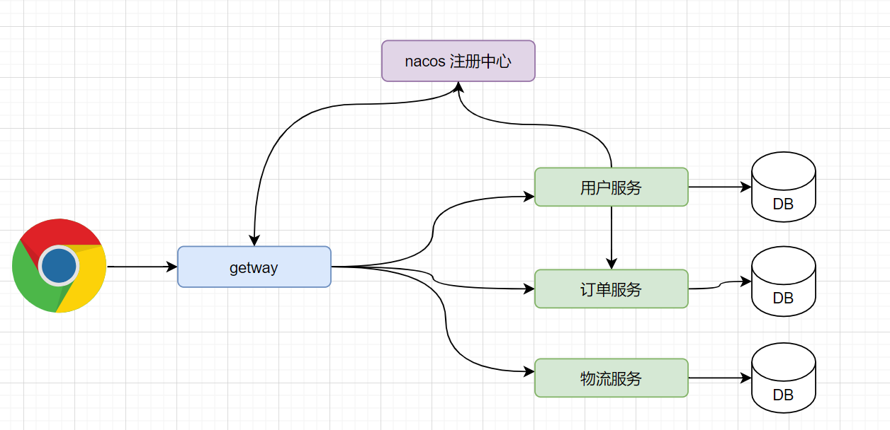

## 1 部署问题


```
方案1: 部署到同一台机器
	优点:
		1) 需要资源少
	缺点:
		1) 软件之间可能有冲突
		2) 容易出现端口冲突
方案2:
    每个服务都准备一台电脑(服务器) 独立部署
	缺点: 不能重复利用硬件资源
方案3:
    使用Vmware 虚拟机技术 ,虚拟很多操作系统	\
	缺点:
	   1) 繁琐 (不适用与大量的创建)
	   2) 资源利用率不高( 平时处于闲置状态)
```


## 2 Docker 介绍 及和VM 对比

```
是一个部署使用的技术
```

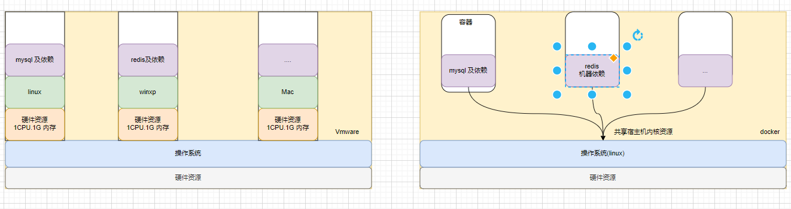


```
优点
使用 docker 部署linux +软件 
1) 体积小
2) 启动时间 更快
3) 性能高
```

## 3 Docker概念

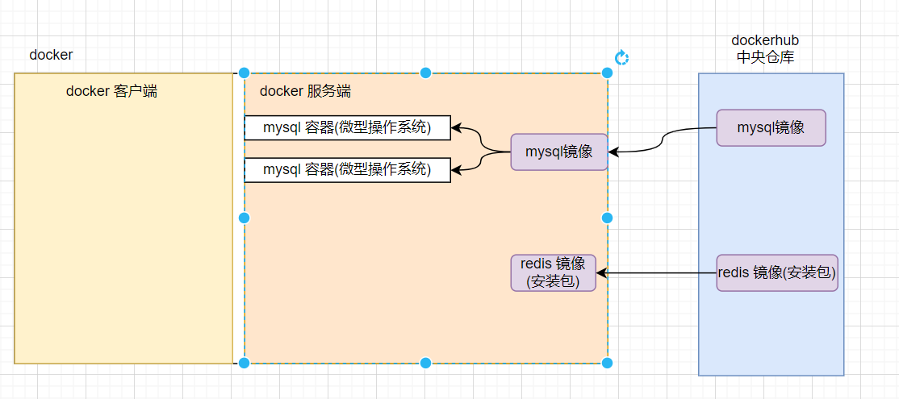

```
docker 客户端    : 
docker 服务端    :
docker 镜像      : 可以理解为操作系统安装包
docker 容器      : 可以理解为基于安装包安装的操作系统
docker 远程仓库   : 远端存储镜像的网站(DockerHub 等)
docker 本地仓库   : 本地存储镜像的地方
```

## 4.Docker的安装

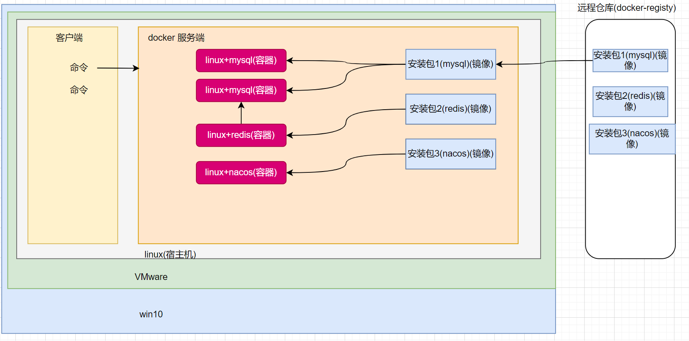

方式1 使用项目一的linux 操作系统

```
参考附件
```

方式2 使用别人的虚拟机

```
1) 解压
2) open 
3) 右键-->设置--> 内存
4) 配置 ip
   编辑 ---_虚拟网络编辑器 --> 编辑
```

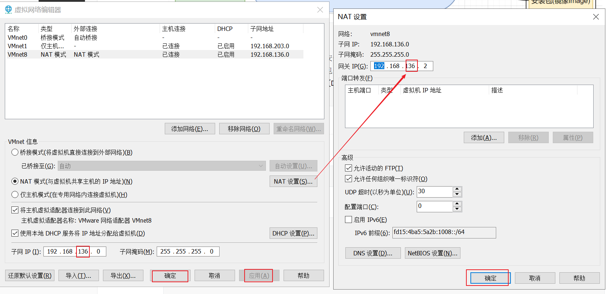


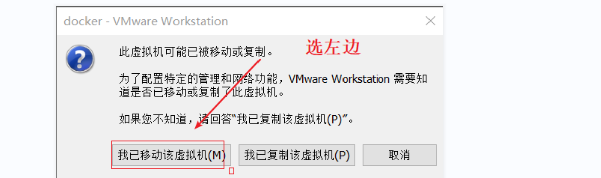

```
登录 192.168.136.132
    root /123456
```

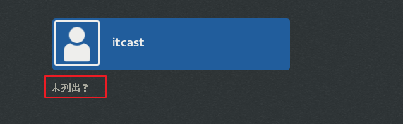


## 5.Docker命令

````sh
# 关闭
systemctl stop firewalld
# 禁止开机启动防火墙
systemctl disable firewalld
# 查看
systemctl status firewalld
````

### 5.1 docker 启动

linux 的命令启动

```sh
systemctl start docker  # 启动docker服务
systemctl stop docker  # 停止docker服务
systemctl restart docker  # 重启docker服务

```

### 5.2 docker 版本

```
docker -v
```

### 5.3 docker 镜像

```sh
# 查看
docker images 
# 删除镜像
docker rmi id
# 搜索
docker search xxxx 
# 下载
docker pull xxx:version
# 例如拉取nginx 指定版本
docker pull nginx:tag
# 镜像导出
# 命令格式：
docker save -o [保存的目标文件名称] [镜像名称]
# 例如
docker save -o nginx.tar nginx:latest
 # 导入
docker load -i nginx.tar
```

### 5.4 docker 容器

```sh
# 查看容器(已经启动的)
docker ps 
# 查看容器(所有)
docker ps  -a
# 创建 并后台运行
docker run -d  --name=mn  -p 80:80 nginx

# 查看日志
docker logs c1
# 查看日志 - 添加 -f 参数可以持续查看日志
docker logs -f c1

# 进入容器
docker exec -it c1 /bin/bash
#  /bin/bash :  是进入容器后执行的第一个命令 (/bin/bash 相当于void )
	exit 退出容器
# 启动
docker start  c1
# 停止
docker stop  c1
# 删除
docker rm  c1
# 查看详情
docker inspect 容器名称或者容器id

# 让一个运行的容器暂停
docker pause c1
# 让一个容器从暂停状态恢复运行
docker unpause

```

```sh
# 创建并启动容器
docker run --name containerName -p 80:80  -d nginx

# docker run ：创建并运行一个容器
# --name : 给容器起一个名字，比如叫做mn
# -p ：将宿主机端口与容器端口映射，冒号左侧是宿主机端口，右侧是容器端口
# -d：后台运行容器
# nginx：镜像名称，例如nginx
```

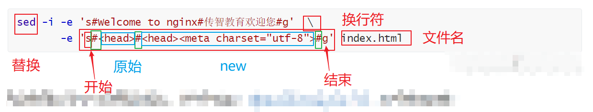

```
docker run -d   --name=redis  -p 6379:6379 redis:lasted 
```

### 5.5 数据卷

```
数据卷就是一个文件夹(宿主机)
注意:
   1) 通过 docker volume create 和我们自己创建的文件夹(mkdir )本质是一样的
   2) 通过 docker volume create 能够被docker volume  命令操作
```


```sh
# 创建数据卷
docker volume create html
(/var/lib/docker/volumes/)
#查看所有数据卷
docker volume ls

#查看数据卷详细信息，包括关联的宿主机目录位置
docker volume inspect
#删除指定数据卷
docker volume rm xxx
#删除所有未使用的数据卷
docker volume prune
```

### 5.5 磁盘挂载


**方式1 : 使用数据卷的方式(相对路径写法)**

````sh
# -v html:/usr/share/nginx/html  把html数据卷挂载到容器内的/usr/share/nginx/html这个目录中
docker run \
  --name mn \
  -v html:/usr/share/nginx/html \
  -p 8080:80 \
  nginx \
````

````
1)  -v 左侧使用的是 数据卷名称 没有 / 
2)  一个容器可以挂载多个目录
3)  一个数据卷可以被多个数据卷挂载
4)   如果创建容器时忘记 挂载,后续无法追加
5) 如果挂载时数据卷不存在 ,则会在宿主机中自动创建(如果容器中的文件夹不为空,则会把容器中的内容,写入到数据卷)
6) 如果挂载时数据卷存在 ,则会覆盖容器中的东西
````

**方式2 使用目录直接挂载**

```sh
docker run \
--name mysql \
-e MYSQL_ROOT_PASSWORD=123 \
-p 3306:3306 \
-v /tmp/mysql/conf/hmy.cnf:/etc/mysql/conf.d/hmy.cnf \
-v /tmp/mysql/data:/var/lib/mysql \
-d \
mysql:5.7.25
#  这里的 -v /tmp/mysql/conf/hmy.cnf:/etc/mysql/conf.d/hmy.cnf 是将两个文件挂载(不是目录)
#  这里的-v /tmp/mysql/data:/var/lib/mysql   是目录挂载
```

```
数据卷挂载与目录直接挂载的

- 数据卷挂载耦合度低，由docker来管理目录，但是目录较深，不好找
- 目录挂载耦合度高，需要我们自己管理目录，不过目录容易寻找查看
- 目录挂载启动时镜像中原有的文件会被本地文件夹的东西覆盖(注意:msyql 的/tmp/mysql/data 时启动后运行时重新生成的)
  数据卷挂挂在可以获取镜像原有的文件
```

## 6 制作镜像

### 6.1镜像分层原理

```
1) 镜像是分层存储
2) 一旦制作了镜像,则镜像的层不能修改
```


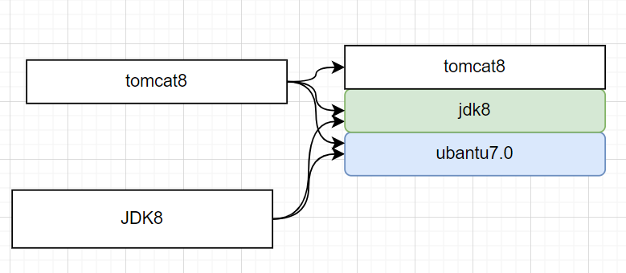

### 6.2 制作镜像DockerFile

```
DockerFile : 提供了一种可以通过描述文件构建镜像的方式
```

1) 格式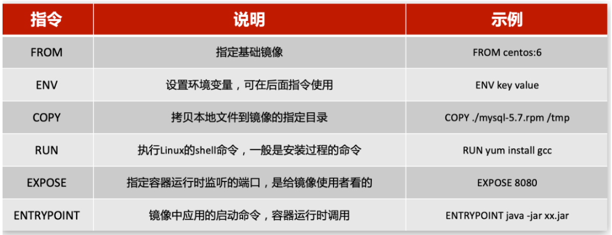

2)  编写

   ````dockerfile
   FROM java:8-alpine
   COPY ./docker-demo.jar  /tmp/app.jar
   EXPOSE 8090
   ENTRYPOINT java -jar /tmp/app.jar
   ````

   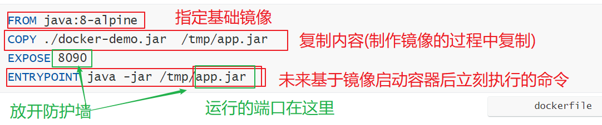

   

   
   
   3.构建
   
   ```sh
   # 基于Dockerfile文件 构建 镜像(默认必须叫Dockerfile)
   docker build -t javaweb:1.0 .
   # 基于指定dockerfile文件名 构建 镜像(文件名任意)
   docker build -f dockerfile2 -t javaweb:1.0 .
   ```
   
   

## 7.Docker Compose

```
DockerCompose可以基于Compose文件帮我们快速的部署分布式应用
```

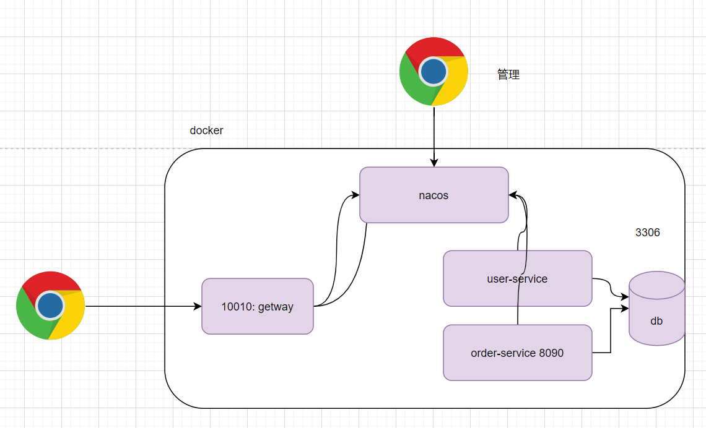

```
1) 复制资料 cloud-demo 中的所有内容到 linux 
2) 执行 docker-compose up -d  
   (会自动创建镜像并基于镜像启动容器)
```


## 8. 重点

```
1) 理解docker 的作用和概念(重点)
	容器
	镜像
	端口映射
	数据卷挂载
2) 通过练习命令理解概念
3) 了解docker-compose 的作用 : 批量创建并启动容器
4) 了解私服的作用及使用
```


````
1) 反馈
2) 练习题
````

