# ES 笔记

## 0 mysql索引

```
 索引: 相当于字典的 目录, 	 
     1) 是建立在列的基础上   
	 2) 底层结构 是B+tree
	 3) 主键列自带索引
	 4) 其他列想要提升查询效率需要创建单独索引
```

```
类似于字典的目录, 可以提升查询效率
优点:
	能提升查询效率
缺点: 
    1)当数据量大时,效率将降低
    2)不能智能搜索
    3)模糊搜索(可能)会导致索引失效
    name   like   '%花%'  (索引失效)
    name   like   '%花'   (索引失效)
    name   like   '花%'    (索引有效)
```

## 1 ES介绍

```
elasticsearch: 
	1) 海量数据搜索技术
    2) 结合其他技术可以实现 日志分析等 (kibana,logstash 等)
    3) 结果集高亮
    4) 搜附近
    5) 拼音搜索
    ......
    
```

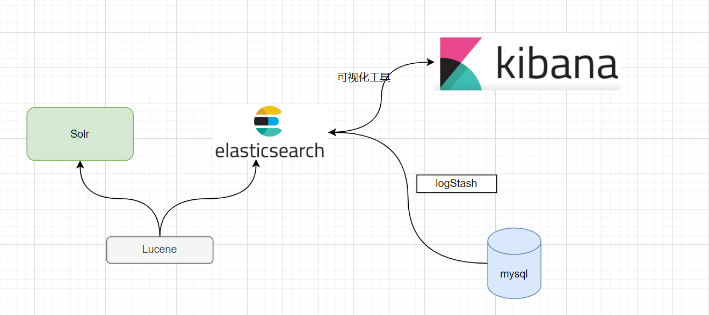


## 2 ES 原理(重点)

```
倒排索引
1)录入时先分词,存储倒排索引和 数据(两份)
2)查询时先分词,根据分词结果
	1) 先查询倒排索引(等值查询) 
	2) 对查询的id  求 ∪ 或 ∩   (默认是求并集∪)
	3) 根据id 查询数据
```

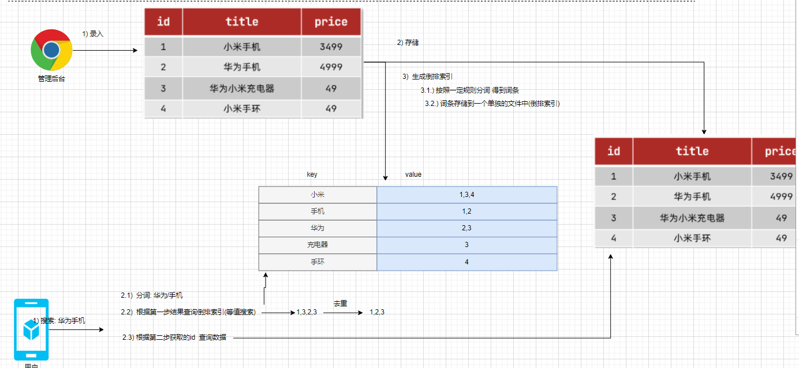

```
倒排索引搜索快的原因:
1) 底层都是等值搜索
2) 倒排索引中词条数量比真正数据要少很多
```

## 3 mysql 和ES 对比(理解)

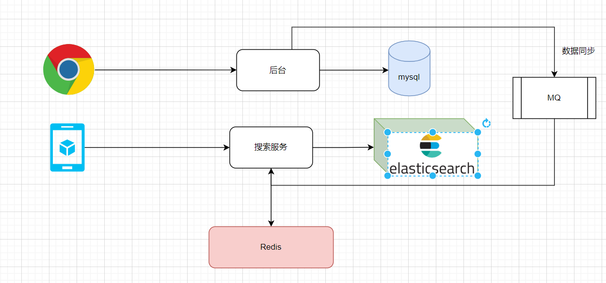

```
- Mysql：擅长事务类型操作，可以确保数据的安全和一致性
- Elasticsearch：擅长海量数据的搜索、分析、计算
- redis 缓存不经常发生变化,搜索频率极高的数据(热点数据缓存)
```

## 4 ES 概念 和mysql 概念对比(理解)

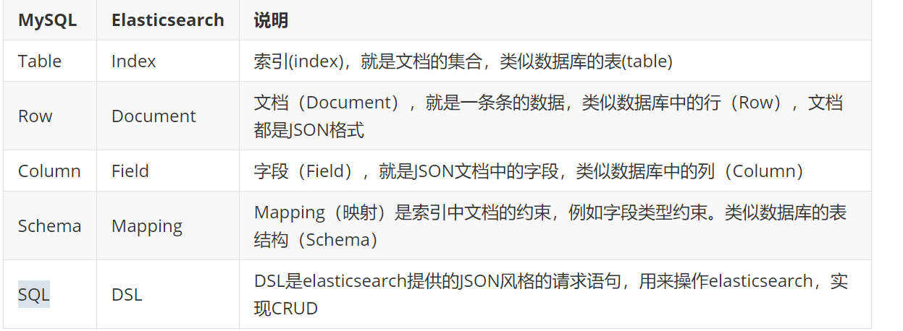

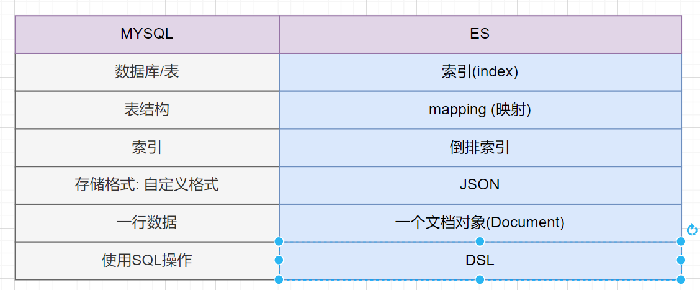


## 5. 安装及启动

```
2G-4G 内存
```

```sh
# 启动docker 
systemctl restart docker
# 启动
docker start es
docker start kibana
# 访问
http://192.168.136.132:9200/
http://192.168.136.132:5601/
```

**chrome 插件**

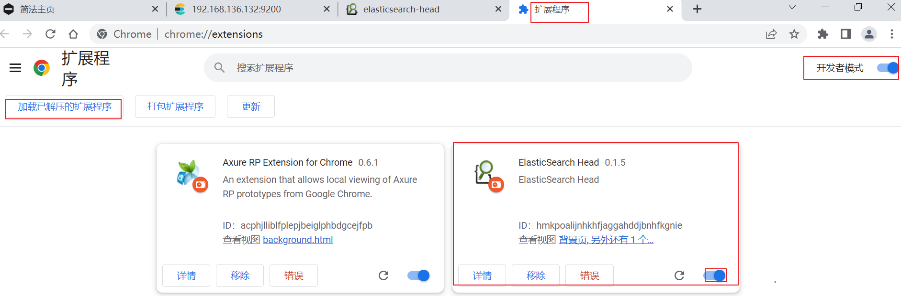


## 6 分词器(理解)

默认带的分词器对中文支持很不好,需要第三方分词器支持


```
IK 分词器
    - ik_smart：智能切分，粗粒度
	- ik_max_word：最细切分，细粒度
```

```sh
# 自带标准分析器
GET /_analyze
{
  "analyzer": "standard",
  "text": "黑马程序员学习java太棒了"
}

#ik 分析器
GET /_analyze
{
  "analyzer": "ik_max_word",
  "text": "黑马程序员学习java太棒了"
}
```

## 7 ES 基本概念(理解)

### 7.1 Mapping

```
Mapping: 表结构统称,也叫映射
```

```
建表关注的问题
    字段类型 : 
    是否创建倒排索引:
    指定分词器
    扩展: 该字段的子字段
```

```
type：字段数据类型，常见的简单类型有：
    - 字符串：
    	- text（可分词的文本）、
    	- keyword（精确值，例如：品牌、国家、ip地址）
    - 数值：long、integer、short、byte、double、float、
    - 布尔：boolean
    - 日期：date
    - 对象：object
    - geo_point : 地理位置 (经纬度逗号分割存储)
    - completion : 用于联想搜索(自动补全) 本笔记: 参考 14章节
index:是否要创建倒排索引
analyzer: 分词, 才需要执行 分词器
properties:
    结合对象类型指定字段名称
```

```ABAP
字符串
	text: 如果一个字段 类型是text (并且需要创建索引)则分词器 生效, 会对内容进行分词, 先分词然后把分词结果放入 倒排索引
	keyword: 如果一个字段 类型是keyword(并且需要创建索引) ,这个字段不分词原样 存储到 倒排索引
```


### 7.2 创建索引(表)

```shell
# 创建索引库
PUT /heima
{
  "mappings": {
     "properties": {
        "info":{
            "type": "text",
            "analyzer": "ik_smart"
        },
        "email":{
          "type": "keyword",
          "index": "false"
        },
        "name":{
          "properties": {
            "firstName": {
              "type": "keyword"
            },
            "lastName": {
              "type": "keyword"
            }
          }
        }
      }
  }
}
# 查询
GET /heima

# 修改索引库 (字段只能增加不能修改)
PUT /heima/_mapping
{
  "properties":{
    "age":{
       "type": "integer"
    }
  }
}

# 删除
DELETE /heima
```

### 7.3 文档操作

```
修改有两种方式：
	- 全量修改：直接覆盖原来的文档
	- 增量修改：修改文档中的部分字段
```

语法

```
- 创建文档：POST /{索引库名}/_doc/文档id   { json文档 }
- 查询文档：GET /{索引库名}/_doc/文档id
- 删除文档：DELETE /{索引库名}/_doc/文档id
- 修改文档：
  - 全量修改：PUT /{索引库名}/_doc/文档id { json文档 }
  - 全量修改：POST /{索引库名}/_doc/文档id { json文档 }
  - 增量修改：POST /{索引库名}/_update/文档id { "doc": {字段}}
```

脚本

```sh

# 查询
GET /heima/_doc/1

# 修改 /新增 (覆盖)
PUT /heima/_doc/2
{
    "info": "黑马程序员高级Java讲师",
    "email": "zy@itcast.cn",
    "name": {
        "firstName": "云",
        "lastName": "赵"
    }
}
# 新增/新增 (覆盖)
POST /heima/_doc/1
{
  "info": "黑马程序员Java讲师",
  "name": {
    "firstName": "云",
    "lastName": "赵"
    }
}

# 删除
DELETE /heima/_doc/1


# 更新(增量修改)

POST /heima/_update/1
{
  "doc": {
    "email": "ZhaoYun@itcast.cn"
  }
}

```

## 8 java 操作

### 8.1 脚本准备

```ABAP
注意点:
   - id 使用的 是字符串类型(keyword)(为了满足ES 要求)
   - 需要参与搜索的字段都应该建立索引(默认会创建索引)
   - 为了后续搜索方便,新建了一个 特殊的字段 "all" 
     数据由其他字段 copy  ,类型text ,未来开发搜索功能 搜索这个字段即可
   - 地理位置必须使用  geo_point 类型
```


````sh

PUT /hotel
{
  "mappings": {
    "properties": {
      "id": {
        "type": "keyword"
      },
      "name":{
        "type": "text",
        "analyzer": "ik_max_word",
        "copy_to": "all"
      },
      "address":{
        "type": "keyword",
        "index": false
      },
      "price":{
        "type": "integer"
      },
      "score":{
        "type": "integer"
      },
      "brand":{
        "type": "keyword",
        "copy_to": "all"
      },
      "city":{
        "type": "keyword",
        "copy_to": "all"
      },
      "starName":{
        "type": "keyword"
      },
      "business":{
        "type": "keyword"
      },
      "location":{
        "type": "geo_point"   
      },
      "pic":{
        "type": "keyword",
        "index": false
      },
      "all":{
        "type": "text",
        "analyzer": "ik_max_word"
      }
    }
  }
}
````

### 8.2 java 操作初始化

```xml
   <properties>
        <java.version>1.8</java.version>
        <elasticsearch.version>7.12.1</elasticsearch.version>
    </properties>
    <dependencies>
        <!--elasticsearch-->
        <dependency>
            <groupId>org.elasticsearch.client</groupId>
            <artifactId>elasticsearch-rest-high-level-client</artifactId>
        </dependency>
    </dependencies>
```

初始化

```java
 private RestHighLevelClient client;
    // 0 创建客户端
    @BeforeEach
    void setUp() {
        client = new RestHighLevelClient(RestClient.builder(
                HttpHost.create("http://192.168.136.132:9200")
        ));
    }
    @AfterEach
    void tearDown() throws IOException {
        client.close();
    }
```

```ABAP
 @BeforeEach    junit 单元测试提供的注解,表示测试方法执行前执行  : 初始化资源
 @AfterEach      junit 单元测试提供的注解,表示测试方法执行后执行 : 销毁资源
```

### 8.3 索引的操作(表)

```java
  // 1. 创建索引
    @Test
    void testCreateIndex() throws IOException {

        // 1.准备Request      PUT /hotel
        CreateIndexRequest request = new CreateIndexRequest("hotel");
        // 2.准备请求参数 (注意这里使用了基础班的知识点静态import )
        request.source(MAPPING_TEMPLATE, XContentType.JSON);
        // 3.发送请求
        client.indices().create(request, RequestOptions.DEFAULT);
    }
    // 1. 判断索引是否存在
    @Test
    void testExistsIndex() throws IOException {

        // 1.准备Request
        GetIndexRequest request = new GetIndexRequest("hotel");
        // 3.发送请求
        boolean isExists = client.indices().exists(request, RequestOptions.DEFAULT);

        System.out.println(isExists ? "存在" : "不存在");
    }
    // 删除索引
    @Test
    void testDeleteIndex() throws IOException {
        // 1.准备Request
        DeleteIndexRequest request = new DeleteIndexRequest("hotel");
        // 3.发送请求
        client.indices().delete(request, RequestOptions.DEFAULT);
    }
```

### 8.4 文档数据操作

```java
package cn.itcast.hotel;

import cn.itcast.hotel.pojo.Hotel;
import cn.itcast.hotel.pojo.HotelDoc;
import cn.itcast.hotel.service.IHotelService;
import com.alibaba.fastjson.JSON;
import org.apache.http.HttpHost;
import org.elasticsearch.action.bulk.BulkRequest;
import org.elasticsearch.action.delete.DeleteRequest;
import org.elasticsearch.action.get.GetRequest;
import org.elasticsearch.action.get.GetResponse;
import org.elasticsearch.action.index.IndexRequest;
import org.elasticsearch.action.update.UpdateRequest;
import org.elasticsearch.client.RequestOptions;
import org.elasticsearch.client.RestClient;
import org.elasticsearch.client.RestHighLevelClient;
import org.elasticsearch.common.xcontent.XContentType;
import org.junit.jupiter.api.AfterEach;
import org.junit.jupiter.api.BeforeEach;
import org.junit.jupiter.api.Test;
import org.springframework.beans.factory.annotation.Autowired;
import org.springframework.boot.test.context.SpringBootTest;

import java.io.IOException;
import java.util.List;

@SpringBootTest
class HotelDocumentTest {
    private RestHighLevelClient client;
    @BeforeEach
    void setUp() {
        client = new RestHighLevelClient(RestClient.builder(
                HttpHost.create("http://192.168.136.132:9200")
        ));
    }
    @AfterEach
    void tearDown() throws IOException {
        client.close();
    }
    @Autowired
    private IHotelService hotelService;
   // 添加 [或更新(覆盖)]
    @Test
    void testAddDocument() throws IOException {
        // 1.查询数据库hotel数据
        Hotel hotel = hotelService.getById(61083L);
        // 2.转换为HotelDoc
        HotelDoc hotelDoc = new HotelDoc(hotel);
        // 3.转JSON
        String json = JSON.toJSONString(hotelDoc);

        // 1.准备Request
        IndexRequest request = new IndexRequest("hotel").id(hotelDoc.getId().toString());
        // 2.准备请求参数DSL，其实就是文档的JSON字符串
        request.source(json, XContentType.JSON);
        // 3.发送请求
        client.index(request, RequestOptions.DEFAULT);
    }
    @Test
    void testGetDocumentById() throws IOException {
        // 1.准备Request      // GET /hotel/_doc/{id}
        GetRequest request = new GetRequest("hotel", "61083");
        // 2.发送请求
        GetResponse response = client.get(request, RequestOptions.DEFAULT);
        // 3.解析响应结果
        String json = response.getSourceAsString();

        HotelDoc hotelDoc = JSON.parseObject(json, HotelDoc.class);
        System.out.println("hotelDoc = " + hotelDoc);
    }
    @Test
    void testDeleteDocumentById() throws IOException {
        // 1.准备Request      // DELETE /hotel/_doc/{id}
        DeleteRequest request = new DeleteRequest("hotel", "61083");
        // 2.发送请求
        client.delete(request, RequestOptions.DEFAULT);
    }
    @Test
    void testUpdateById() throws IOException {
        // 1.准备Request
        UpdateRequest request = new UpdateRequest("hotel", "61083");
        // 2.准备参数
        request.doc(
                "price", "870"
        );
        // 3.发送请求
        client.update(request, RequestOptions.DEFAULT);
    }
    @Test
    void testBulkRequest() throws IOException {
        // 查询所有的酒店数据
        List<Hotel> list = hotelService.list();
        // 1.准备Request
        BulkRequest request = new BulkRequest();
        // 2.准备参数
        for (Hotel hotel : list) {
            // 2.1.转为HotelDoc
            HotelDoc hotelDoc = new HotelDoc(hotel);
            // 2.2.转json
            String json = JSON.toJSONString(hotelDoc);
            // 2.3.添加请求
            request.add(new IndexRequest("hotel").id(hotel.getId().toString()).source(json, XContentType.JSON));
        }
        // 3.发送请求
        client.bulk(request, RequestOptions.DEFAULT);
    }
}

```

## 9 查询分类

```
1 ) 模糊搜索(全文检索)
2 ) 精确匹配
    1) 等值搜素
    2) 范围 ,例如年龄范围
3) 地理位置搜索
------------------
4) 组合搜索: 把上述三类进行组合
```

基本语法

```sh
GET /indexName/_search
{
  "query": {
    "查询类型": {
      "查询条件(字段)": "条件值"
    }
  }
}
```

### 9.1 查询所有

```
GET /hotel/_search
{
  "query": {
     "match_all": {}
  }
}
```

### 9.2  全文检索（full text）查询

```
利用分词器对用户输入内容分词，然后去倒排索引库中匹配。例如：
- match：根据一个字段查询
- multi_match：根据多个字段查询，参与查询字段越多，查询性能越差
```

```ABAP
注意:
	1) 如果一个字段的类型是keyword 则 输入的字符串不会分词
	2) multi_match：根据多个字段查询，参与查询字段越多，查询性能越差
```

```sh
#  按照单个字段搜索
GET /hotel/_search
{
  "query": {
     "match": {
       "name": "上海"
     }
  }
}
# 按照多个字段搜索, 方法1 : 建立一个 all 字段(把其他 需要搜索的字段复制到该字段(copy_to))
GET /hotel/_search
{
  "query": {
     "match": {
       "all": "上海"
     }
  }
}
# 按照多个字段搜索, 方法2 : multi_match 搜索 (效率低)
GET /hotel/_search
{
  "query": {
     "multi_match": {
        "query": "上海",
        "fields": ["city", " brand"]
     }
  }
}
```


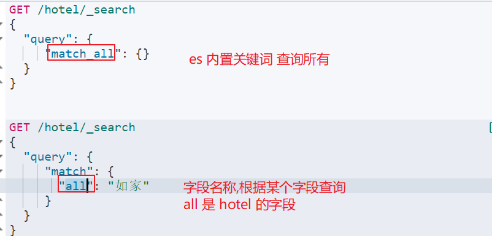

### 9.3 精确匹配

```properties
精确查询一般是查找keyword、数值、日期、boolean等类型字段。所以不会对搜索条件分词。常见的有：
- term：根据词条精确值查询(字符串等于查询)
- range：根据值的范围查询
```

```sh
# term 查询
# 格式
GET /indexName/_search
{
  "query": {
    "term": {
      "FIELD": {
        "value": "VALUE"
      }
    }
  }
}

# term 查询
# 精确查询
GET /hotel/_search
{
  "query": {
    "term": {
      "city": {
        "value": "北京"
      }
    }
  }
}
# 简写方式
GET /hotel/_search
{
  "query": {
     "term": {
       "brand": "7天酒店"
     }
  }
}


# range查询

GET /indexName/_search
{
  "query": {
    "range": {
      "FIELD": {
        "gte": 10, //# 这里的gte代表大于等于，gt则代表大于  great than or equles
        "lte": 20 // # lte代表小于等于，lt则代表小于       less than
      }
    }
  }
}
# 范围查询 ,适用于数字类型
GET /hotel/_search
{
  "query": {
    "range": {
      "price": {
        "gte": 10, //# 这里的gte代表大于等于，gt则代表大于
        "lte": 200 // # lte代表小于等于，lt则代表小于
      }
    }
  }
}

```


### 9.4 地理位置搜索

```sh

# geo_bounding_box 搜附近 (矩形)
GET /indexName/_search
{
  "query": {
    "geo_bounding_box": {
      "FIELD": {
        "top_left": { // 左上点
          "lat": 31.1,
          "lon": 121.5
        },
        "bottom_right": { // 右下点
          "lat": 30.9,
          "lon": 121.7
        }
      }
    }
  }
}


# geo_distance 查询 搜附近 原型
GET /indexName/_search
{
  "query": {
    "geo_distance": {
      "distance": "15km", // 半径
      "FIELD": "31.21,121.5" // 圆心
    }
  }
}

GET /hotel/_search
{
  "query": {
    "geo_distance": {
      "distance": "5km", // 半径 km ,m  mi (英里)
      "location": "31.21,121.5" // 圆心
    }
  }
}
```

### 9.5 相关性算法


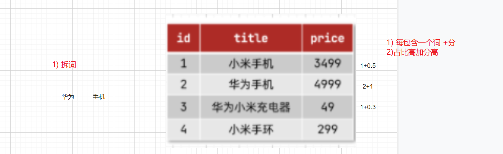

```ABAP
加分逻辑大概意思:
   1) 一个词在 某个文档中出现的次数越多 则 分数越高(对当前文档而言)
   2) 一个词在所有文档中出现的次数越多,说明越不重要 就要降低分数
   	  (比如  :  "或者" 这个词, 如果很多文章中都有,证明这个词越不典型)
```

### 9.6 结果加权

```sh
GET /hotel/_search
{
  "query": {
    "function_score": {
      "query": {
        "match": {
          "all": "外滩"
        }
       }, // 原始查询，可以是任意条件
      "functions": [ // 算分函数
        {
          "filter": { // 满足的条件，品牌必须是如家
            "term": {
              "brand": "如家"
            }
          },
          "weight": 2 // 算分权重为2
        }
      ],
      "boost_mode": "multiply" // 加权模式，sum求和,multiply 乘法
    }
  }
}
```

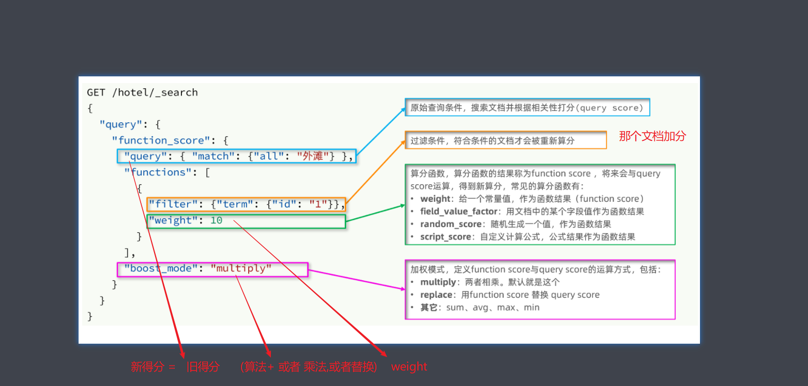

### 9.7 Bool 组合查询

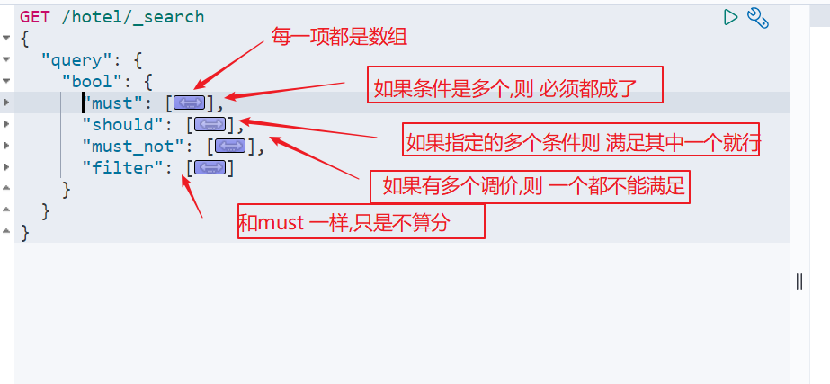

```shell
# 索名字包含“如家”，价格不高于400，在坐标31.21,121.5周围10km范围内的酒店

#  <=400
GET /hotel/_search
{
  "query": {
    "bool": {
      "must": [
        {"match": {"name": "如家" }},
        {"range": {"price": {"lte": 400}}}
       ],
      "filter": [
        { 
          "geo_distance": 
          {
            "distance":"10km",
             "location": {
                 "lat": 31.21,
                 "lon": 121.5
              }
          }
        }
       ]
    }
  }
}
# 索名字包含“如家”，价格不高于400，在坐标31.21,121.5周围10km范围内的酒店
GET /hotel/_search
{
  "query": {
    "bool": {
      "must": [
        {"match": {"name": "如家" }}
       ],
      "must_not": [
        { "range": { "price": { "gt": 400 } }}
       ],
      "filter": [
        { 
          "geo_distance": 
          {
            "distance":"10km",
             "location": {
                 "lat": 31.21,
                 "lon": 121.5
              }
          }
        }
       ]
    }
  }
}
```

## 10 结果处理

### 10.1 排序

```sh
# 排序
GET /hotel/_search
{
  "query": {
    "match_all": {}
  },
  "sort": [
    {
      "score":"desc"
    },
    {
      "price":"asc"
    }
  ]
}


GET /hotel/_search
{
  "query": {
    "match_all": {}
  },
  "sort": [
    {
      "_geo_distance" : {
          "location" : "31.21,121.5",
          "order" : "asc", // 排序方式
          "unit" : "km" // 排序的距离单位
      }
    }
  ]
}
```


### 10.1 分页

```sh
# 分页
GET /hotel/_search
{
  "query": {
    "match_all": {}
  },
  "from": 0, // 分页开始的位置，默认为0
  "size": 10, // 期望获取的文档总数
  "sort": [
    {"price": "asc"}
  ]
}


#  深度分页 问题
# 每次查询 按照 _id 排序 (第一次正常查询)
GET /hotel/_search
{
    "size": 20,
    "query": {
        "match" : {
            "name" : "酒店"
        }
    },
    "sort": [
        {"_id": "asc"}
    ]
}
# 下次查询时 查询 在 id =xxx 之后的10 条
GET /hotel/_search
{
    "size": 10,
    "query": {
        "match" : {
            "name" : "酒店"
        }
    },
    "search_after":[1557997004],
    "sort": [
        {"_id": "asc"}
    ]
}
```


### 10.1 高亮

```
高亮逻辑:
		1) java 代码只负责给关键词增加标签
		2) 样式由前端 拿到文本后 前端代码赋予样式
```

```sh
#高亮
GET /hotel/_search
{
  "query": {
    "match": {
      "all" : "酒店"
    }
  },
  "highlight": {
    "fields": {
      "name": {
        "require_field_match": "false",
         "pre_tags": "<en>",
         "post_tags": "<en>"
      }
    }
  }
}
# 高亮 方式2 
GET /hotel/_search
{
  "query": {
    "match": {
      "all" : "酒店"
    }
  },
  "highlight": {
    "require_field_match": "false",
    "fields": {
       "name": {
        "pre_tags": "<en>",
        "post_tags": "<en>"
      }
    }
  }
}
```

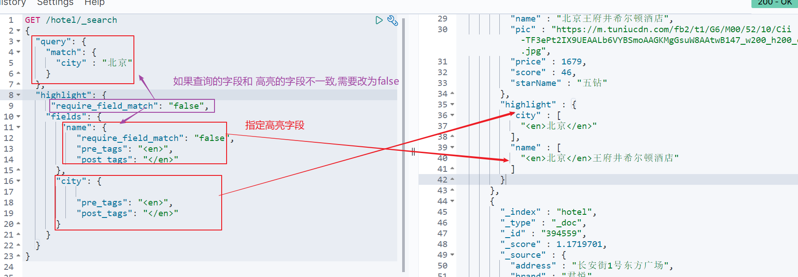

## 11 java 操作

发起请求

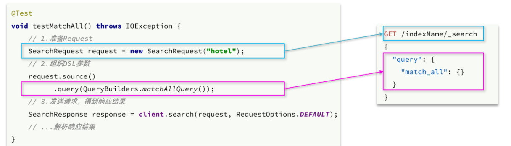

```
- 第一步，创建`SearchRequest`对象，指定索引库名

- 第二步，利用`request.source()`构建DSL，DSL中可以包含查询、分页、排序、高亮等
  - `query()`：代表查询条件，利用`QueryBuilders.matchAllQuery()`构建一个match_all查询的DSL
- 第三步，利用client.search()发送请求，得到响应
```

响应结果的解析：


```java
package cn.itcast.hotel;

import cn.itcast.hotel.pojo.HotelDoc;
import com.alibaba.fastjson.JSON;
import org.apache.http.HttpHost;
import org.elasticsearch.action.search.SearchRequest;
import org.elasticsearch.action.search.SearchResponse;
import org.elasticsearch.client.RequestOptions;
import org.elasticsearch.client.RestClient;
import org.elasticsearch.client.RestHighLevelClient;
import org.elasticsearch.index.query.BoolQueryBuilder;
import org.elasticsearch.index.query.QueryBuilders;
import org.elasticsearch.search.SearchHit;
import org.elasticsearch.search.SearchHits;
import org.elasticsearch.search.fetch.subphase.highlight.HighlightBuilder;
import org.elasticsearch.search.fetch.subphase.highlight.HighlightField;
import org.elasticsearch.search.sort.SortOrder;
import org.junit.jupiter.api.AfterEach;
import org.junit.jupiter.api.BeforeEach;
import org.junit.jupiter.api.Test;
import org.springframework.boot.test.context.SpringBootTest;

import java.io.IOException;
import java.util.Map;

@SpringBootTest
class HotelSearchTest {

    private RestHighLevelClient client;

    @BeforeEach
    void setUp() {
        client = new RestHighLevelClient(RestClient.builder(
                HttpHost.create("http://192.168.136.132:9200")
        ));
    }

    @AfterEach
    void tearDown() throws IOException {
        client.close();
    }


    @Test
    void testMatchAll() throws IOException {
        // 1.准备request
        SearchRequest request = new SearchRequest("hotel");
        // 2.准备请求参数
        request.source().query(QueryBuilders.matchAllQuery());
        // 3.发送请求，得到响应
        SearchResponse response = client.search(request, RequestOptions.DEFAULT);
        // 4.结果解析

        SearchHits searchHits = response.getHits();
        // 4.1.总条数
        long total = searchHits.getTotalHits().value;
        System.out.println("总条数：" + total);
        // 4.2.获取文档数组
        SearchHit[] hits = searchHits.getHits();
        // 4.3.遍历
        for (SearchHit hit : hits) {
            // 4.4.获取source
            String json = hit.getSourceAsString();
            // 4.5.反序列化，非高亮的
            HotelDoc hotelDoc = JSON.parseObject(json, HotelDoc.class);
            // 4.6.打印
            System.out.println(hotelDoc);
        }
    }

    @Test
    void testMatch() throws IOException {
        // 1.准备request
        SearchRequest request = new SearchRequest("hotel");


        // 2.准备请求参数
        // request.source().query(QueryBuilders.matchQuery("all", "外滩如家"));
        request.source().query(QueryBuilders.multiMatchQuery("外滩如家", "name", "brand", "city"));
        // 3.发送请求，得到响应
        SearchResponse response = client.search(request, RequestOptions.DEFAULT);
        // 4.结果解析
        handleResponse(response);

    }

    @Test
    void testBool() throws IOException {
        // 1.准备request
        SearchRequest request = new SearchRequest("hotel");
        // 2.准备请求参数

//         BoolQueryBuilder boolQuery = QueryBuilders.boolQuery();
//        // 2.1.must
//        boolQuery.must(QueryBuilders.termQuery("city", "杭州"));
//        // 2.2.filter
//        boolQuery.filter(QueryBuilders.rangeQuery("price").lte(250));


        request.source().query(QueryBuilders.boolQuery()
                            .must(QueryBuilders.termQuery("city", "杭州"))
                            .filter(QueryBuilders.rangeQuery("price").lte(250))
        );
        // 3.发送请求，得到响应
        SearchResponse response = client.search(request, RequestOptions.DEFAULT);
        // 4.结果解析
        handleResponse(response);
    }

    @Test
    void testSortAndPage() throws IOException {
        int page = 2,size = 5;

        // 1.准备request
        SearchRequest request = new SearchRequest("hotel");
        // 2.准备请求参数
        // 2.1.query
        request.source()
                .query(QueryBuilders.matchAllQuery());
        // 2.2.排序sort
        request.source().sort("price", SortOrder.ASC);
        // 2.3.分页 from\size
        request.source().from((page - 1) * size).size(size);

        // 3.发送请求，得到响应
        SearchResponse response = client.search(request, RequestOptions.DEFAULT);
        // 4.结果解析
        handleResponse(response);
    }

    @Test
    void testHighlight() throws IOException {
        // 1.准备request
        SearchRequest request = new SearchRequest("hotel");
        // 2.准备请求参数
        // 2.1.query
        request.source().query(QueryBuilders.matchQuery("all", "外滩如家"));
        // 2.2.高亮
        request.source().highlighter(new HighlightBuilder().field("name").requireFieldMatch(false));
        // 3.发送请求，得到响应
        SearchResponse response = client.search(request, RequestOptions.DEFAULT);
        // 4.结果解析
        handleResponse(response);
    }

    private void handleResponse(SearchResponse response) {
        SearchHits searchHits = response.getHits();
        // 4.1.总条数
        long total = searchHits.getTotalHits().value;
        System.out.println("总条数：" + total);
        // 4.2.获取文档数组
        SearchHit[] hits = searchHits.getHits();
        // 4.3.遍历
        for (SearchHit hit : hits) {
            // 4.4.获取source
            String json = hit.getSourceAsString();
            // 4.5.反序列化，非高亮的
            HotelDoc hotelDoc = JSON.parseObject(json, HotelDoc.class);
            // 4.6.处理高亮结果
            // 1)获取高亮map
            Map<String, HighlightField> map = hit.getHighlightFields();
            if(map.size()>0){
                // 2）根据字段名，获取高亮结果
                HighlightField highlightField = map.get("name");
                // 3）获取高亮结果字符串数组中的第1个元素
                String hName = highlightField.getFragments()[0].toString();
                // 4）把高亮结果放到HotelDoc中
                hotelDoc.setName(hName);
            }
            // 4.7.打印
            System.out.println(hotelDoc);
        }
    }


}

```

## 12 黑马旅游综合案例

```
由此可以知道，我们这个请求的信息如下：

- 请求方式：POST
- 请求路径：/hotel/list
- 请求参数：JSON对象，包含4个字段：
  - key：搜索关键字
  - page：页码
  - size：每页大小
  - sortBy：排序，目前暂不实现
  - brand
  - city
  -starName
  -minPrice
  - maxPrice
  - location
- 返回值：分页查询，需要返回分页结果PageResult，包含两个属性：
  - `total`：总条数
  -  hotels：[] 当前页的数据
  
```

返回值对象

```java
@Data
public class PageResult {
    private Long total;
    private List<HotelDoc> hotels;
}
@Data
public class HotelDoc {
    private Long id;
    private String name;
    private String address;
    private Integer price;
    private Integer score;
    private String brand;
    private String city;
    private String starName;
    private String business;
    private String location;
    private String pic;
    private Object distance;
    private Boolean isAD;
}
```

请求对象

```java
@Data
public class RequestParams {
    private String key;
    private Integer page;
    private Integer size;
    private String sortBy;
    private String brand;
    private String city;
    private String starName;
    private Integer minPrice;
    private Integer maxPrice;
    private String location;
}
```


## 13 聚合

```
聚合常见的有三类：

- 桶（Bucket）聚合：用来对文档做分组
  - TermAggregation：按照文档字段值分组，例如按照品牌值分组、按照国家分组
  - Date Histogram：按照日期阶梯分组，例如一周为一组，或者一月为一组

- 度量（Metric）聚合：用以计算一些值，比如：最大值、最小值、平均值等
  - Avg：求平均值
  - Max：求最大值
  - Min：求最小值
  - Stats：同时求max、min、avg、sum等
- 管道（pipeline）聚合：其它聚合的结果为基础做聚合

--聚合的字段类型: 必须是keyword、日期、数值、布尔类型

```

### 13.1  桶（Bucket）聚合


```

GET /hotel/_search
{
  "query": {
    "range": {
      "price": {
        "lte": 200 
      }
    }
  }, 
  "from": 0, 
  "size": 0, 
  
  "aggs": {
    "brandAgg": {
      "terms": {
        "field": "brand",
        "order": {
          "_count": "asc"
         },
        "size": 20
      }
    }
  }
}
```

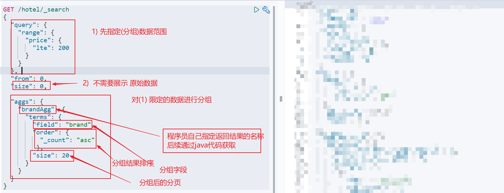

### 13.2 度量聚合 + 管道（pipeline）聚合：

```sql
GET /hotel/_search
{
  "size": 0, 
  "aggs": {
    "brandAgg": { 
      "terms": { 
        "field": "brand", 
        "size": 20
      },
      "aggs": { // 是brands聚合的子聚合，也就是分组后对每组分别计算
        "scoreStats": { // 聚合名称
          "stats": { // 聚合类型，这里stats可以计算min、max、avg等
            "field": "score" // 聚合字段，这里是score
          }
        }
      }
    }
  }
}
```

```sql
GET /hotel/_search
{
  "size": 0, 
  "aggs": {
    "brandAgg": { 
      "terms": { 
        "field": "brand", 
        "size": 20
        , "order": {
          "scoreStats.avg": "desc"
        }
      },
      "aggs": { // 是brands聚合的子聚合，也就是分组后对每组分别计算
        "scoreStats": { // 聚合名称
          "stats": { // 聚合类型，这里stats可以计算min、max、avg等
            "field": "score" // 聚合字段，这里是score
          }
        }
      }
    }
  }
}
```


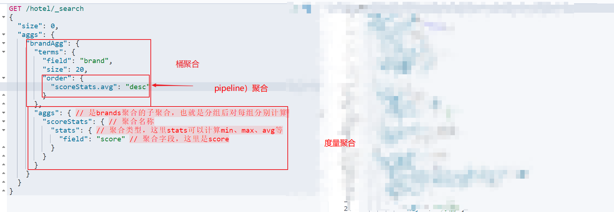

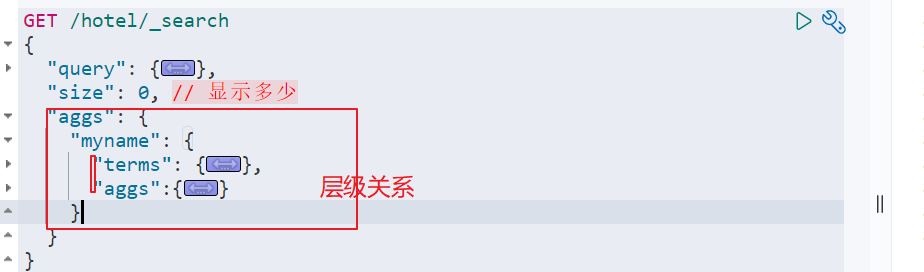

### 13.3 java 代码

聚合条件的语法：


聚合的结果也与查询结果不同，API也比较特殊。不过同样是JSON逐层解析：

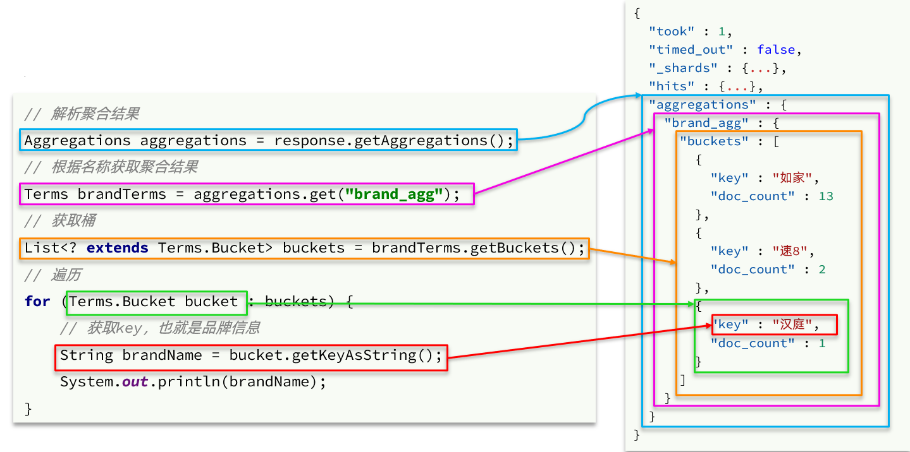

### 13.4 多字段分组

```sql
GET /hotel/_search
{
  "query": {
     "match": {
       "name": "上海如家深圳"
     }
  },
  "size": 5, // 显示多少
  "aggs": {
    "barndAgg": {
      "terms": {
        "field": "brand"
      }
     },
     "cityAgg": {
      "terms": {
        "field": "city"
      }
     },
     "starAgg": {
      "terms": {
        "field": "starName"
      }
     }
  }
}
```


## 13 拼音分词器

```
elasticsearch中分词器（analyzer）的组成包含三部分：
- character filters：在tokenizer之前对文本进行处理。例如删除字符、替换字符
- tokenizer：将文本按照一定的规则切割成词条（term）。例如keyword，就是不分词；还有ik_smart
- tokenizer filter：将tokenizer输出的词条做进一步处理。例如大小写转换、同义词处理、转成拼音等
```


### 13.1 分词器原理

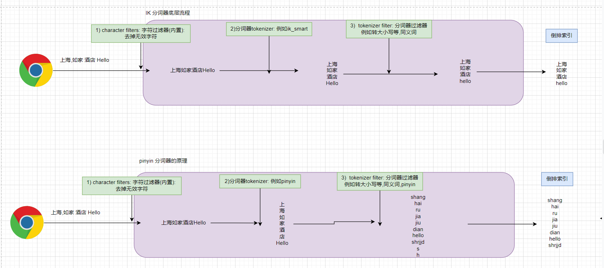

### 13.2 自定义分词器

```sql
PUT /test
{
  "settings": {
    "analysis": {
      "analyzer": { // 自定义分词器
        "my_analyzer": {  // 分词器名称
          "tokenizer": "ik_max_word",
          "filter": "py"
        }
      },
      "filter": { // 自定义tokenizer filter
        "py": { // 过滤器名称
          "type": "pinyin", // 过滤器类型，这里是pinyin
		  "keep_full_pinyin": false,//词语的单个拼音是否保留 例如刘德华 > [liu ,de,hua] 是否保留
          "keep_joined_full_pinyin": true,//词语全拼拼音是否保留例如刘德华>[liudehua,lud]是否保留
          "keep_original": true, // 是否保留原本的汉字
          "limit_first_letter_length": 16,
          "remove_duplicated_term": true, // 移除重复
          "none_chinese_pinyin_tokenize": false // 
        }
      }
    }
  },
  "mappings": {
    "properties": {
      "name": {
        "type": "text",
        "analyzer": "my_analyzer",
        "search_analyzer": "ik_smart"
      }
    }
  }
}
```

````

````


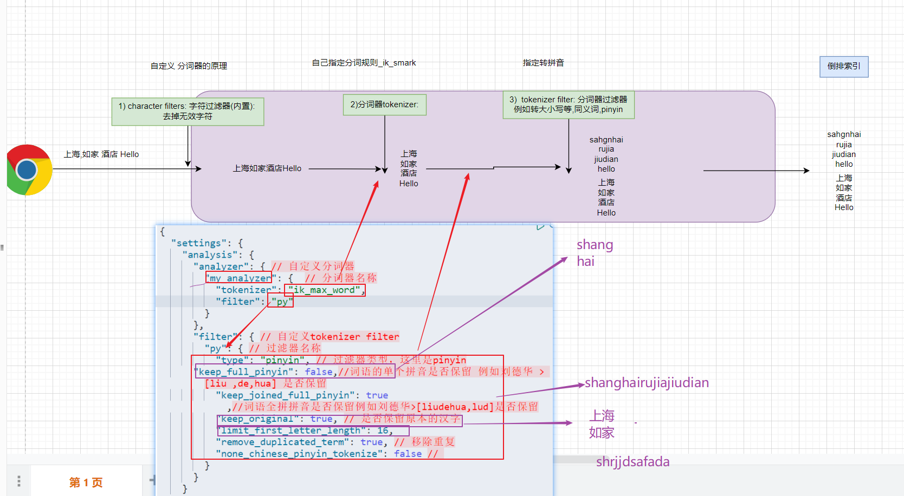

````
拼音分词器注意事项？
	- 为了避免搜索到同音字，搜索时不要使用拼音分词器
````

--------------------

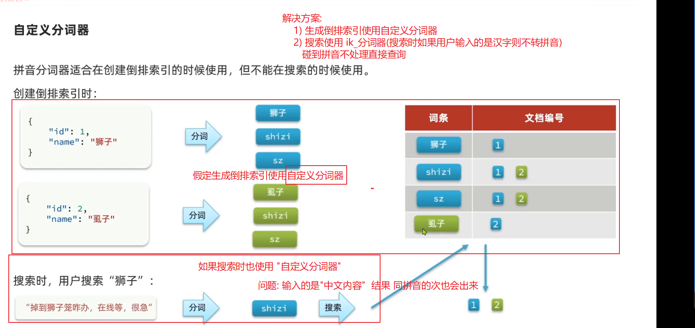


## 14 自动补全

```
1) 字段类型必须是completion 才能进行 自动补全搜索
```


```sh
# 自动补全
PUT test2
{
  "mappings": {
    "properties": {
      "title":{
        "type": "completion"
      }
    }
  }
}


// 自动补全查询
GET /test2/_search
{
  "suggest": {
    "title_suggest": {
      "text": "s", // 关键字
      "completion": {
        "field": "title", // 补全查询的字段
        "skip_duplicates": true, // 跳过重复的
        "size": 10 // 获取前10条结果
      }
    }
  }
}
```

## 15 案例

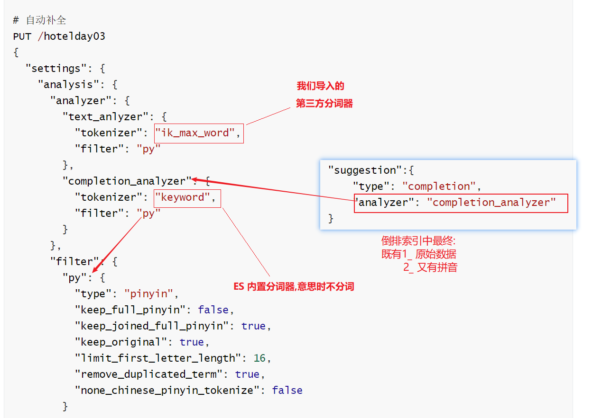

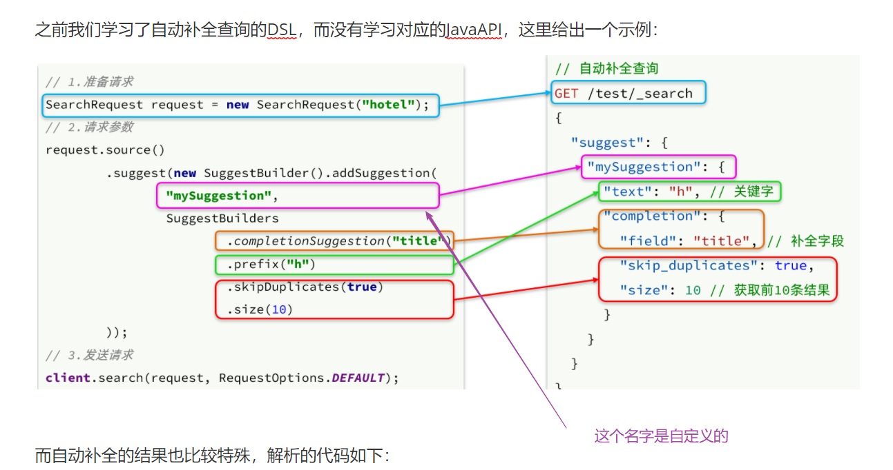

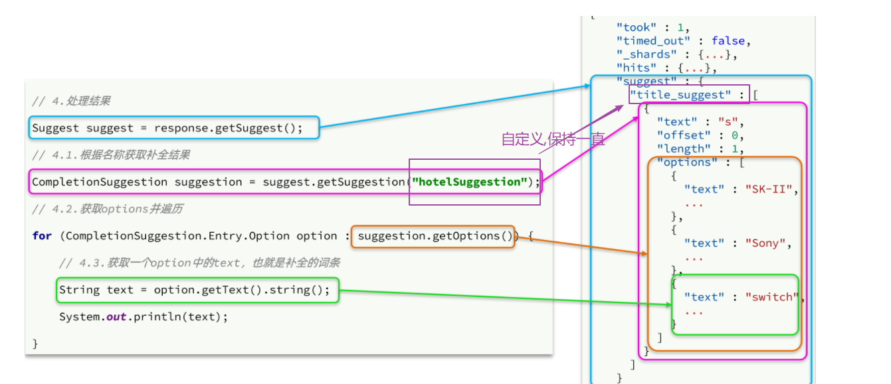

````sql
// 酒店数据索引库
PUT /hotel
{
  "settings": {
    "analysis": {
      "analyzer": {
        "text_anlyzer": {
          "tokenizer": "ik_max_word",
          "filter": "py"
        },
        "completion_analyzer": {
          "tokenizer": "keyword",
          "filter": "py"
        }
      },
      "filter": {
        "py": {
          "type": "pinyin",
          "keep_full_pinyin": false,
          "keep_joined_full_pinyin": true,
          "keep_original": true,
          "limit_first_letter_length": 16,
          "remove_duplicated_term": true,
          "none_chinese_pinyin_tokenize": false
        }
      }
    }
  },
  "mappings": {
    "properties": {
      "id":{
        "type": "keyword"
      },
      "name":{
        "type": "text",
        "analyzer": "text_anlyzer",
        "search_analyzer": "ik_smart",
        "copy_to": "all"
      },
      "address":{
        "type": "keyword",
        "index": false
      },
      "price":{
        "type": "integer"
      },
      "score":{
        "type": "integer"
      },
      "brand":{
        "type": "keyword",
        "copy_to": "all"
      },
      "city":{
        "type": "keyword"
      },
      "starName":{
        "type": "keyword"
      },
      "business":{
        "type": "keyword",
        "copy_to": "all"
      },
      "location":{
        "type": "geo_point"
      },
      "pic":{
        "type": "keyword",
        "index": false
      },
      "all":{
        "type": "text",
        "analyzer": "text_anlyzer",
        "search_analyzer": "ik_smart"
      },
      "suggestion":{
          "type": "completion",
          "analyzer": "completion_analyzer"
      }
    }
  }
}
````


## 16  数据同步

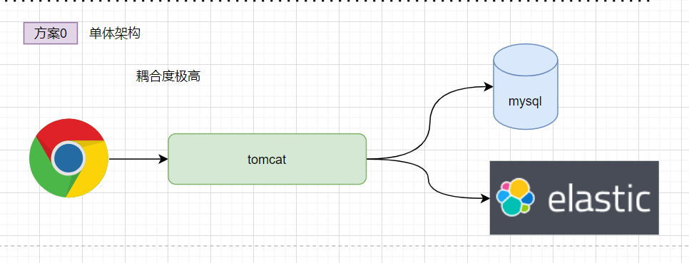

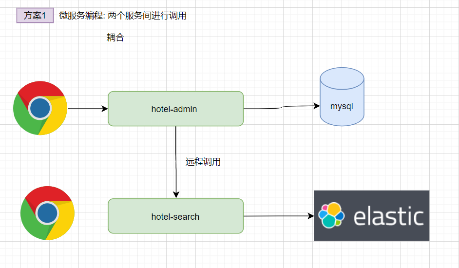

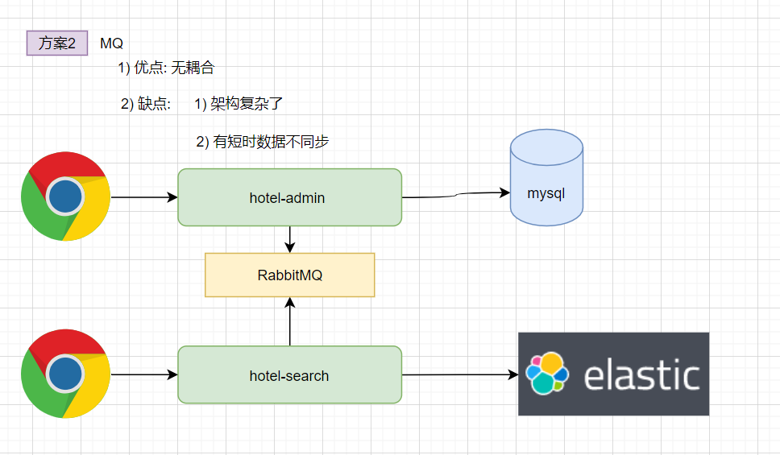

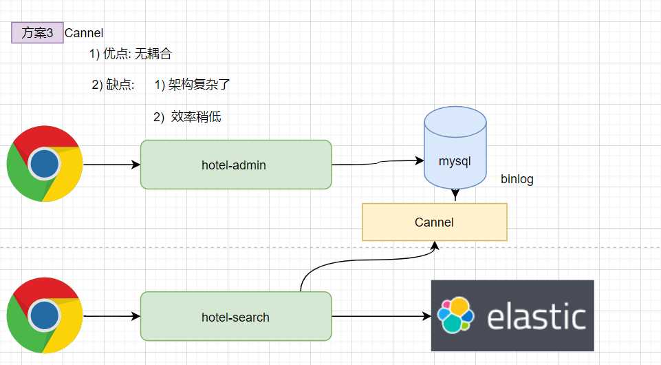

## 17 集群

单机的elasticsearch做数据存储，必然面临两个问题：海量数据存储问题、单点故障问题。

- 海量数据存储问题：将索引库从逻辑上拆分为N个分片（shard），存储到多个节点
- 单点故障问题：将分片数据在不同节点备份（replica ）

**ES集群相关概念**:

* 集群（cluster）：一组拥有共同的 cluster name 的 节点。

* <font color="red">节点（node)</font>   ：集群中的一个 Elasticearch 实例

* <font color="red">分片（shard）</font>：索引可以被拆分为不同的部分进行存储，称为分片。在集群环境下，一个索引的不同分片可以拆分到不同的节点中

  解决问题：数据量太大，单点存储量有限的问题。

* 主分片（Primary shard）：相对于副本分片的定义。

* 副本分片（Replica shard）每个主分片可以有一个或者多个副本，数据和主分片一样。

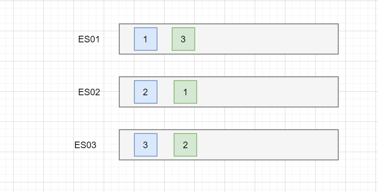


### 17.1 集群职责


但是真实的集群一定要将集群职责分离：

- master节点：对CPU要求高，但是内存要求第
- data节点：对CPU和内存要求都高
- coordinating节点：对网络带宽、CPU要求高

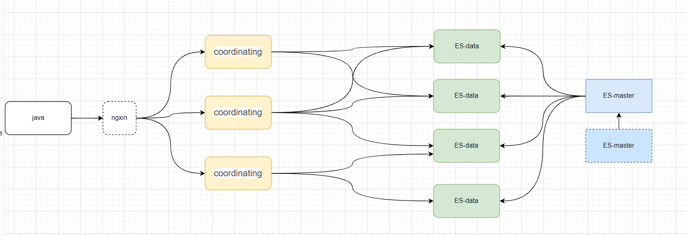

### 17.2 什么是脑裂


```
1) 一般脑裂出现在跨机房部署,短时间断网后恢复
描述: 再初始化时 集群只有一个 master ,但是因为断网, 另一个机房选出来了一个新的master ,
      网络恢复后, 整个集群有两个master (叫脑裂)
```

ES 是 如何解决的

```
过半选举机制: 拿到一半选举投票才能成为master
```


### 17.3  流程

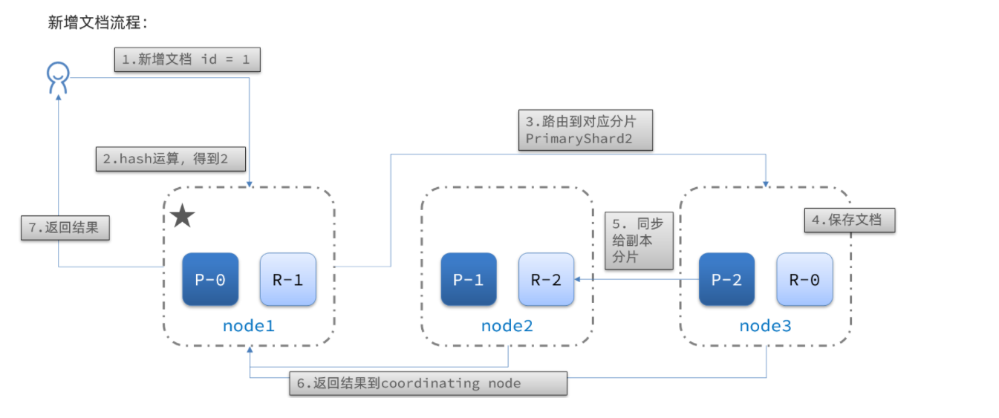

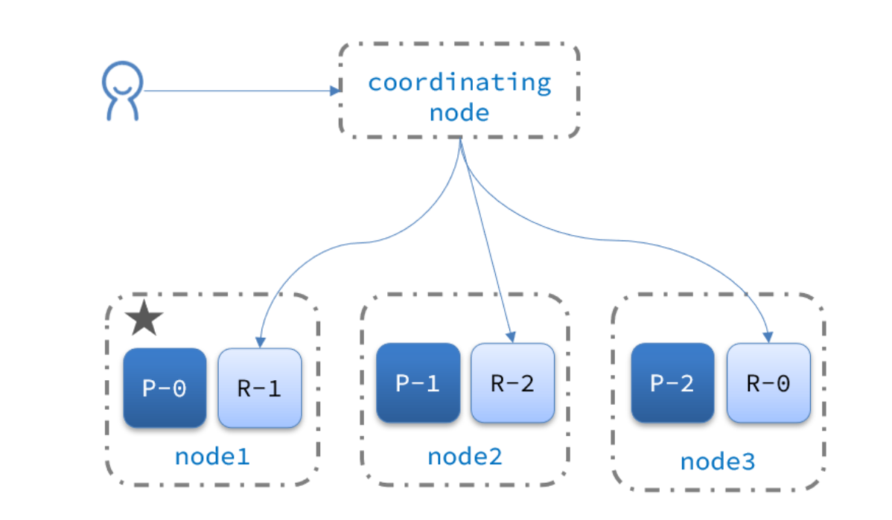

```
重点理解:
1) es 干了啥: 聚合, 智能联想  (理解作用)
2_ es 数据同步问题解决方案
3) ES 集群: 分片+冗余存储
4) 脑裂问题 是什么及解决
```

````

````

