# Redis

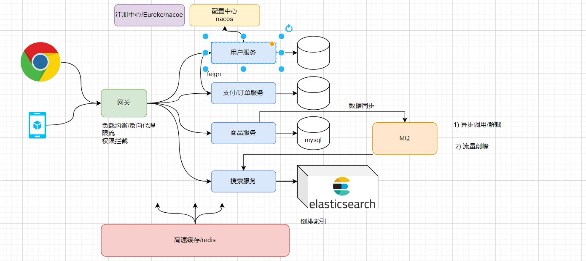

```
1) redis 为啥快? 基于内存
2) redis 几种类型?
	  5种. string,hash .list,set ,zset
			1) 验证码,登录信息 (redis 充当分布式session服务器) 
			2) 缓存(hash,string,set)
			3) 排行榜 zset
```


## 1. 持久化

### 1.1 RDB

```
RDB持久化在四种情况下会执行：
- 执行save命令   (手动执行, 执行备份期间其他所有命令等待)
- 执行bgsave命令 (手动执行, 执行备份期间其他所有命令不等待,开启子进程备份)
- Redis停机时   (正常停机)
- 触发RDB条件时  (根据配置定时触发)
```

```properties
#解析: 例1: 900秒内，如果至少有1个key被修改，则执行bgsave ， 如果是save "" 则表示禁用RDB
save 900 1  
save 300 10  
save 60 10000 
```

```ABAP
说明: 计数器和计时器都满足的情况下会进行持久化(每次持久化后都会重置)
    计时器:0
    计数器:0
```

### 1.2 RDB 原理

```
注意: 一个进程可以包含多个线程
过程:
- fork主进程得到一个子进程，共享内存空间
- 子进程读取内存数据并写入新的RDB文件
- 用新RDB文件替换旧的RDB文件

```

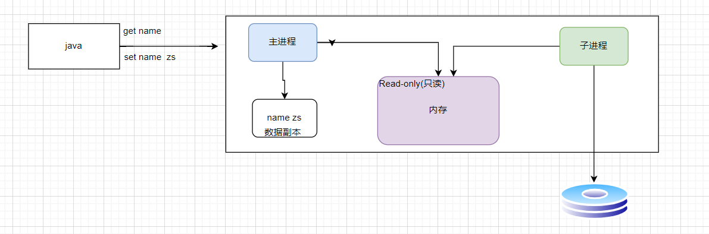

缺点

```
1) 每次RDB 都会删除旧文件,生成新文件 ,比较耗时
2) 两次RDB之间写入数据有丢失的风险
```

优点:

```
恢复快
```

### 1.3AOF

#### 1.3.1  原理 及基本配置

```
备份每一条命令(追加)
```

如何开启

```properties
# 是否开启AOF功能，默认是no
appendonly yes
# AOF文件的名称
appendfilename "appendonly.aof"
```

频率

```properties
# 表示每执行一次写命令，立即记录到AOF文件
appendfsync always 
# 写命令执行完先放入AOF缓冲区，然后表示每隔1秒将缓冲区数据写到AOF文件，是默认方案
appendfsync everysec 
# 写命令执行完先放入AOF缓冲区，由操作系统决定何时将缓冲区内容写回磁盘
appendfsync no
```

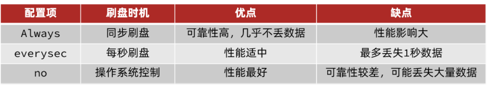

#### 1.3.2  重写

```
aof 是备份每一个命令,导致文件很大(很多历史命令无用),恢复慢,
redis 提供了重写命令 压缩 aof 文件 --->删除无用指令
```

配置

```yaml
# AOF文件比上次文件 增长超过多少百分比则触发重写
auto-aof-rewrite-percentage 100
# AOF文件体积最小多大以上才触发重写 
auto-aof-rewrite-min-size 64mb  
```

#### 13.3 优缺点

优点:

```
1) 备份消耗小,效率高
2) 如果配置成  always 则数据丢失风险小
```

缺点:

```
恢复慢
磁盘占用比RDB大
```

### 1.4 RDB 和AOF 区别(面试题)

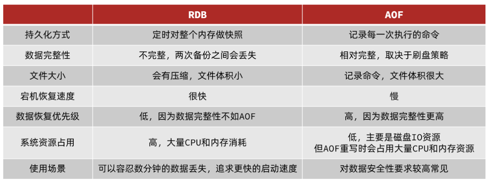

### 1.5 Redis4.0 之后推出的 AOF 和RDB 的混合方式

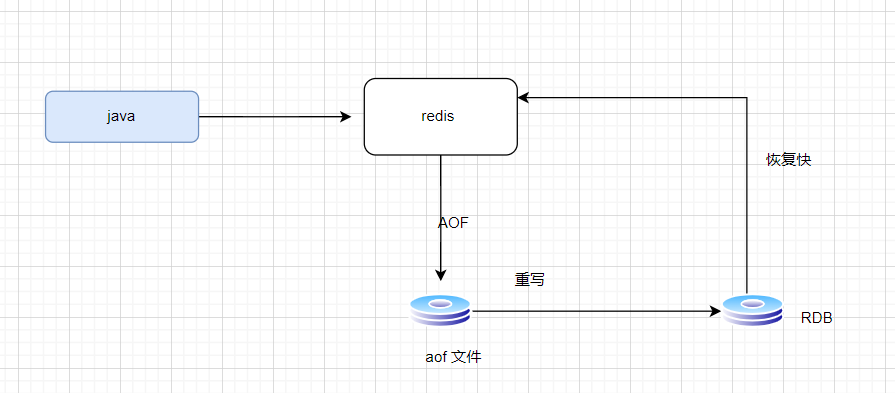


## 2.提升性能: 主从复制

```
单节点Redis的并发能力是有上限的，要进一步提高Redis的并发能力，就需要搭建主从集群，实现读写分离。
```

### 2.1 主从搭建

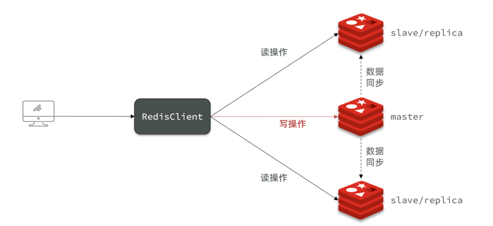

```
1) 启动三个redis 
2) 在从服务器
   执行 > slaveof 192.168.136.132 7001
3) 查看状态
  info replication
```

### 2.2 同步数据过程

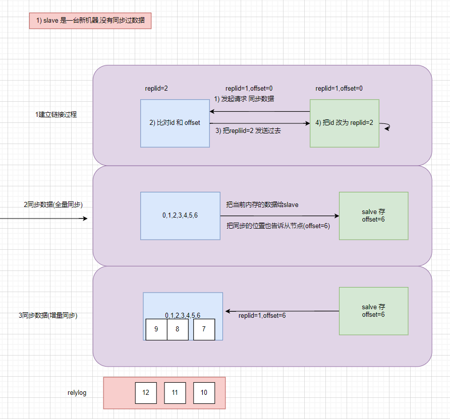

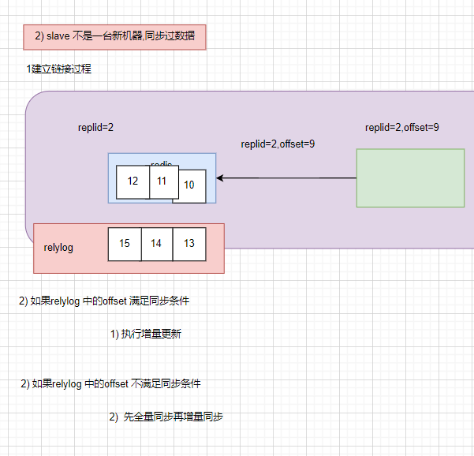

````properties
步骤:
- slave节点请求增量同步
- master节点判断replid，发现不一致，拒绝增量同步
- master将完整内存数据生成RDB，发送RDB到slave
- slave清空本地数据，加载master的RDB
- master将RDB期间的命令记录在repl_baklog，并持续将log中的命令发送给slave
- slave执行接收到的命令，保持与master之间的同步
````


可以从以下几个方面来优化Redis主从就集群：

```properties
- 在master中配置repl-diskless-sync yes启用无磁盘复制，避免全量同步时的磁盘IO。
- Redis单节点上的内存占用不要太大，减少RDB导致的过多磁盘IO
- 适当提高repl_baklog的大小，发现slave宕机时尽快实现故障恢复，尽可能避免全量同步
- 限制一个master上的slave节点数量，如果实在是太多slave，则可以采用主-从-从链式结构，减少master压力
  (如下图)
```

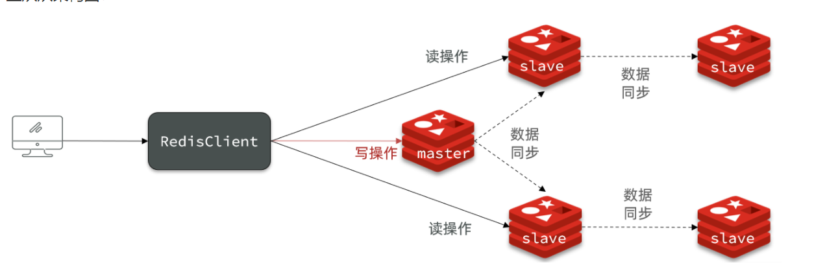

### 2.3 哨兵

```
对 主从结构的补充,主要是完成master 的自动选举
```


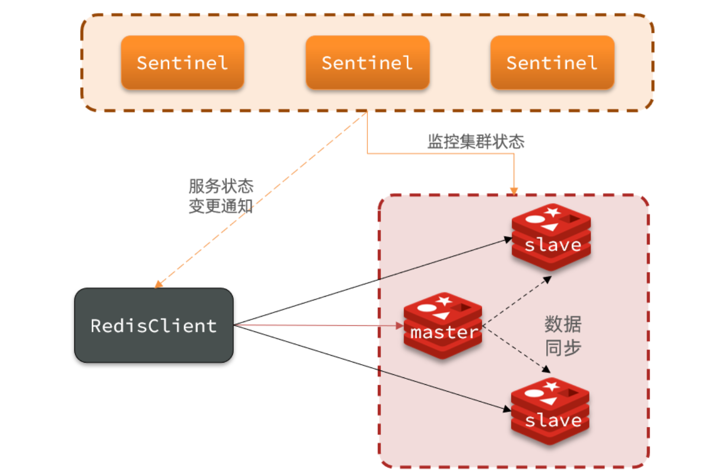

```
哨兵的作用如下：

- 监控：Sentinel 会不断检查您的master和slave是否按预期工作
- 自动故障恢复：如果master故障，Sentinel会将一个slave提升为master。当故障实例恢复后也以新的master为主
- 通知：Sentinel充当Redis客户端的服务发现来源，当集群发生故障转移时，会将最新信息推送给Redis的客户端
```

Sentinel如何判断一个redis实例是否健康？

```
- 每隔1秒发送一次ping命令，如果超过一定时间没有相向则认为是主观下线
- 如果大多数sentinel都认为实例主观下线，则判定服务下线
```

故障转移步骤有哪些？

```
- 首先选定一个slave作为新的master，执行slaveof no one
- 然后让所有节点都执行slaveof 新master
- 修改故障节点配置，添加slaveof 新master
```

### 2.4 主从+哨兵优缺点

优点

```
1) 搭建简单
2) 自动故障转移,master 自动切换
3) 多个slave 防止数据丢失
4) 可以实现读写分离,提高访问效率(读效率)
```

缺点

```
1) 写性能受限于master
2) 存储数据受限于master
```


## 3 .集群

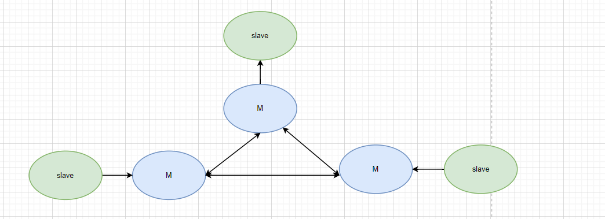


```sh
redis-cli --cluster create --cluster-replicas 1 192.168.150.101:7001 192.168.150.101:7002 192.168.150.101:7003 192.168.150.101:8001 192.168.150.101:8002 192.168.150.101:8003
```

### 数据是如何平均分散到各个节点?

```
1) 把整个集群分成16384个槽
2) 存储数据时按照key hash 取余数 决定放入那个槽中
```

### 数据是那台机器负责计算?

```
java 代码链接任意一台即可, 底层会自动路由
```

### 如果想所有商品数据都存储到同一台机器?

```
通过 {} 把需要相同的部分括起来即可(有效部分)
```

```
set {goods}1  数据
set {goods}2  数据
set {goods}3  数据
set {goods}4  数据
```

### 集群如何连接?

```
redis-cli -c -p 7001
```

### redis 集群扩容

```
1) 需要手动分配插槽给新节点
2) 移除节点时也需要手动分插槽
```

### java 链接redis 集群

```yaml
spring:
  redis:
    cluster:
      nodes:
        - 192.168.136.132:7001
        - 192.168.136.132:7002
        - 192.168.136.132:7003
        - 192.168.136.132:8001
        - 192.168.136.132:8002
        - 192.168.136.132:8003
```


## 4 重点

面试题

```
1) 持久化RDB 方式和AOF 方式 概念
    1) RDB 备份的是 内存的快照
    2) AOF 备份的是 命令

2) 持久化RDB 方式和AOF 方式 区别
	1) RDB 备份慢,消耗CPU 高, 但是恢复块
	2) AOF 备份快,消耗CPU 低, 但是恢复慢
	3) 4.0 RDB+AOF 方式
3) 主从+哨兵 优缺点:
	1) 优点 :
		简单
		实现自动主从切换
		实现读写分离
		slave 防止数据丢失
	2)缺点
      不能扩容,写性能受限
4) 分片集群Cluster(+主从)模式的优缺点:
	1) 实现自动主从切换
	2) 降低服务器压力
	3) slave 防止数据丢失
    缺点:
    	稍复杂
```


