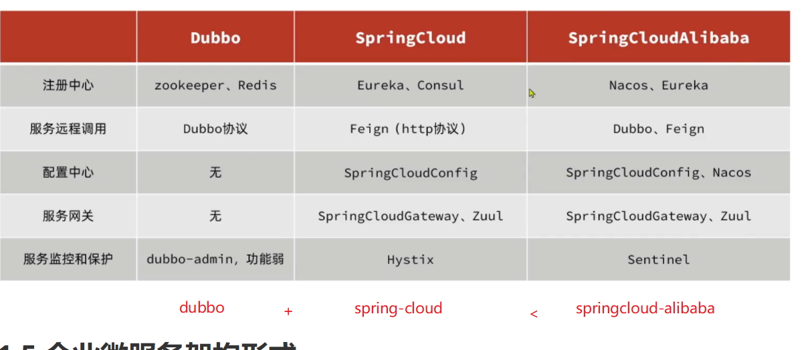
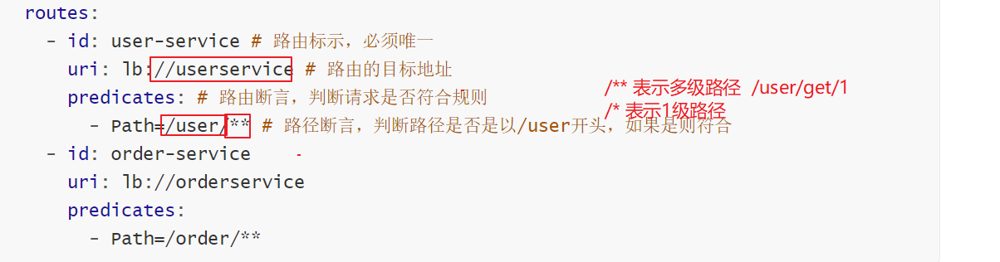

# Spring-Cloud


## 0学习方法

```
服务框架阶段: 
1) 知识变难了,上课更加专注
2) 上课一定要认真听
3) 下课一定要练习,加深印象
4) 概念比代码更重要: 上课一定要先把概念,知识点弄明白,最后再说代码
```


## 1.架构的演变(理解)

```
集群:    一个相同的 功能部署 好几分
分布式:  不同的"功能" 分布到不同的服务器, 系统正常运行需要所有的服务器(服务)启动
```

#### 1 单体架构

```
单体架构:  所有的功能可以通过一个tomcat 运行
```


#### 2 垂直架构

```
垂直架构: 
    一个tomcat 负责 一块业务(可以独立启动), 互不影响,但是整个公司的运营需要 所有服务都启动
```


#### 3 分布式架构

```
分布式架构:  
		不同的"功能" 分布到不同的服务器, 系统正常运行需要所有的服务器(服务)启动
```


```
微服务架构:是分布式架构的一种

微服务的架构特征：(要求)
- 单一职责：微服务拆分粒度更小，每一个服务都对应唯一的业务能力，做到单一职责
- 自治：团队独立、技术独立、数据独立，独立部署和交付
- 面向服务：服务提供统一标准的接口，与语言和技术无关
- 隔离性强：服务调用做好隔离、容错、降级，避免出现级联问题
```


```
分布式架构的两个阶段
1) SOA架构 (面向服务架构)(拆分粒度比较粗,技术相对不成熟,早期)
2) 微服务架构(拆分粒度比较细)
```

## 2.分布式架构 技术演进(了解)




## 3. spring-cloud

```
SpringCloud是目前国内使用最广泛的微服务框架。官网地址：https://spring.io/projects/spring-cloud。
SpringCloud集成了各种微服务功能组件，并基于SpringBoot实现了这些组件的自动装配，从而提供了良好的开箱即用体验。
```

## 4, 服务间调用 RestTemplate

#### 导入初始化项目

```
1)项目导入  open --->pom.xml
2)数据库导入 注意库名称 是 下划线
3)配置文件检查 
```


#### RestTemplate 使用

```java
 @Bean
 public RestTemplate restTemplate() {
 	return new RestTemplate();
 }
```

```java
  @Autowired
    private RestTemplate restTemplate;

    public Order queryOrderById(Long orderId) {

        // 1.查询订单
        Order order = orderMapper.findById(orderId);
        // 2.利用RestTemplate发起http请求，查询用户
        // 2.1.url路径
        String url = "http://localhost:8083/user/" + order.getUserId();
        // 2.2.发送http请求，实现远程调用
        User user = restTemplate.getForObject(url, User.class);

        // 3.封装user到Order
        order.setUser(user);
        // 4.返回
        return order;
    }
```

```properties
缺点:
    1: url 地址 ip 和端口号写死了不方便维护
    2: 无法负载均衡
```

## 5Eureka 注册中心

```properties
服务消费者:\
   单次服务间调用,请求发起方
服务提供者:\
   单次服务间调用,请求接收方
```

### 5.1原理图


### 5.2 环境搭建

父工程

```xml
<dependencyManagement>
        <dependencies>
            <!-- springCloud -->
            <dependency>
                <groupId>org.springframework.cloud</groupId>
                <artifactId>spring-cloud-dependencies</artifactId>
                <version>${spring-cloud.version}</version>
                <type>pom</type>
                <scope>import</scope>
            </dependency>
    </dependencies>
</dependencyManagement>   
```

子工程eureka-server

```xml
  <dependencies>
        <!--eureka服务端-->
        <dependency>
            <groupId>org.springframework.cloud</groupId>
            <artifactId>spring-cloud-starter-netflix-eureka-server</artifactId>
        </dependency>
  </dependencies>
```

子工程eureka-server配置

```yaml
server:
  port: 10086 # 服务端口
spring:
  application:
    name: eurekaserver # eureka的服务名称
eureka:
  client:
    # 当前的 代码 作为 Eureka 的客户端 另外一台eureka 的地址
    service-url:  # eureka的地址信息
      defaultZone: http://127.0.0.1:10086/eureka
```


启动类增加注解

```java
@EnableEurekaServer
@SpringBootApplication
public class EurekaApplication {
    public static void main(String[] args) {
        SpringApplication.run(EurekaApplication.class, args);
    }
}
```

## 6.Eureka 服务注册 (user-demo和order-demo 都要改造)

```xml
<dependency>
            <groupId>org.springframework.cloud</groupId>
            <artifactId>spring-cloud-starter-netflix-eureka-client</artifactId>
</dependency>
```

配置

```yaml
spring:
  application:
      name: userservice
eureka:
  client:
    # 当前的 代码 作为 Eureka 的客户端 另外一台eureka 的地址
    service-url:  # eureka的地址信息
      defaultZone: http://127.0.0.1:10086/eureka
```

## 7.Eureka 服务发现(调用)

### 1.改造代码

```java
//String url = "http://localhost:8081/user/" + order.getUserId();
String url = "http://userservice/user/" + order.getUserId(); // 不区分大小写
        // 2.2.发送http请求，实现远程调用
User user = restTemplate.getForObject(url, User.class);
```

### 2.增加注解

```java
@Bean
@LoadBalanced
public RestTemplate restTemplate() {
    return new RestTemplate();
}
```

### 3.负载均衡原理(Ribbon)


## 8.Ribbon 负载均衡策略及饥饿加载

### 8.1 内置负载均衡策略

| **内置负载均衡规则类**             | **规则描述**                                                 |
| ---------------------------------- | ------------------------------------------------------------ |
| RoundRobinRule                     | 简单轮询服务列表来选择服务器。它是Ribbon默认的负载均衡规则。 |
| AvailabilityFilteringRule          | 对以下两种服务器进行忽略：   （1）在默认情况下，这台服务器如果3次连接失败，这台服务器就会被设置为“短路”状态。短路状态将持续30秒，如果再次连接失败，短路的持续时间就会几何级地增加。  （2）并发数过高的服务器。如果一个服务器的并发连接数过高，配置了AvailabilityFilteringRule规则的客户端也会将其忽略。并发连接数的上限，可以由客户端的<clientName>.<clientConfigNameSpace>.ActiveConnectionsLimit属性进行配置。 |
| WeightedResponseTimeRule           | 为每一个服务器赋予一个权重值。服务器响应时间越长，这个服务器的权重就越小。这个规则会随机选择服务器，这个权重值会影响服务器的选择。 |
| **ZoneAvoidanceRule(默认)** (轮训) | 以区域可用的服务器为基础进行服务器的选择。使用Zone对服务器进行分类，这个Zone可以理解为一个机房、一个机架等。而后再对Zone内的多个服务做轮询。具体策略: 综合判断server所在区域的性能，和server的可用性，轮询选择server并且判断一个AWS Zone的运行性能是否可用，剔除不可用的Zone中的所有server |
| BestAvailableRule                  | 忽略那些短路的服务器，并选择并发数较低的服务器。             |
| RandomRule                         | 随机选择一个可用的服务器。                                   |
| RetryRule                          | 重试机制的选择逻辑                                           |

### 8.2 负载均衡策略配置

通过定义IRule实现可以修改负载均衡规则，有两种方式：

1. 代码方式：在order-service中的OrderApplication类中，定义一个新的IRule： **(全局有效)**

```java
@Bean
public IRule randomRule(){
    return new RandomRule();
}
```

2. 配置文件方式：在order-service的application.yml文件中，添加新的配置也可以修改规则：

```yaml
userservice: # 给某个微服务配置负载均衡规则，这里是userservice服务
  ribbon:
    NFLoadBalancerRuleClassName: com.netflix.loadbalancer.RandomRule # 负载均衡规则 
```


> **注意**，一般用默认的负载均衡规则，不做修改。

### 8.3   饥饿加载

Ribbon默认是采用懒加载，即第一次访问时才会去创建LoadBalanceClient，请求时间会很长。

而饥饿加载则会在项目启动时创建，降低第一次访问的耗时，通过下面配置开启饥饿加载：

```yaml
ribbon:
  eager-load:
    enabled: true  # true 项目启动时加载, 第一次访问快
    clients: userservice
```

## 9nacos 

```
1) 解压(不要有中文)
2) startup.cmd -m standalone
```

### 9.1 nacos   服务注册及发现

父工程

```xml
 <dependencyManagement>
        <dependencies>
            <!-- springCloud -->
            <dependency>
                <groupId>org.springframework.cloud</groupId>
                <artifactId>spring-cloud-dependencies</artifactId>
                <version>${spring-cloud.version}</version>
                <type>pom</type>
                <scope>import</scope>
            </dependency>
            <dependency>
                <groupId>com.alibaba.cloud</groupId>
                <artifactId>spring-cloud-alibaba-dependencies</artifactId>
                <version>2.2.6.RELEASE</version>
                <type>pom</type>
                <scope>import</scope>
            </dependency>
     </dependencies>
</dependencyManagement>
```

子工程

```xml
        <dependency>
            <groupId>com.alibaba.cloud</groupId>
            <artifactId>spring-cloud-starter-alibaba-nacos-discovery</artifactId>
        </dependency>
```

```yaml
 spring:
   cloud:
      nacos:
       server-addr: localhost:8848
```

### 9.2 nacos 的高级特性

#### 9.2.1 分级存储模型


#### 9.2.2 分级存储模型- 同机房优先

所有服务都指定

````yaml
 spring
  cloud:
    nacos:
      server-addr: localhost:8848
      discovery:
         cluster-name: hz
````

消费者指定(order-service)

```yaml
## 负载均衡规则
userservice:
   ribbon:
     NFLoadBalancerRuleClassName: com.alibaba.cloud.nacos.ribbon.NacosRule # 负载均衡规则
```

#### 9.2.3 权重


```
作用1 :  充分利用服务器资源
作用2 :  不停止服务更新(集群环境)
```

#### 9.2.4 nacos 环境隔离namespace

```
两个项目公用一个 nacos 时使用
```


```
spring:
  cloud:
    nacos:
      server-addr: localhost:8848
      discovery:
        cluster-name: HZ
        namespace: 492a7d5d-237b-46a1-a99a-fa8e98e4b0f9 # 命名空间，填ID
```


## 10 naocs 和 Eureka 的区别


```ABAP
- Nacos与eureka的共同点
  - 都支持服务注册和服务拉取
  - 都支持服务提供者心跳方式做健康检测
- Nacos与Eureka的区别
  - Nacos支持服务端主动检测提供者状态：临时实例采用心跳模式，非临时实例采用主动检测模式
  - 临时实例心跳不正常会被剔除，非临时实例则不会被剔除
  - Nacos支持服务列表变更的消息推送模式，服务列表更新更及时
  - Nacos集群默认采用AP方式，当集群中存在非临时实例时，采用CP模式；Eureka采用AP方式
```

Nacos的服务实例分为两种l类型：

```properties
- 临时实例：如果实例宕机超过一定时间，会从服务列表剔除，默认的类型。
- 非临时实例：如果实例宕机，不会从服务列表剔除，也可以叫永久实例。
```

配置一个服务实例为永久实例：
```yaml
spring:
  cloud:
    nacos:
      discovery:
        ephemeral: false # 设置为非临时实例
```

## 11 配置中心

```
作用: 可以实现经常发生变化的配置的动态更新(服务器不重启)
```

```ABAP
注意 : 名称空间
```

### 11.1 nacos配置

每一个服务 都要导入坐标

```xml
  <!--nacos配置管理依赖-->
  <dependency>
      <groupId>com.alibaba.cloud</groupId>
      <artifactId>spring-cloud-starter-alibaba-nacos-config</artifactId>
  </dependency>
```

每一个服务 都要增加配置bootstrap.yml (内容不一样)

```yaml
spring:
  application:
    name: userservice # 服务名称
  profiles:
    active: dev #开发环境，这里是dev
  cloud:
    nacos:
      server-addr: localhost:8848 # Nacos地址
      config:
        file-extension: yaml # 文件后缀名
```


### 11.2 配置热更新

```java
方式1:
   在@Value注入的变量所在类上添加注解@RefreshScope： 缺陷是每个类都要配置
       
   注意： 部分学生不小心把Controller 方法写成私有的，这种方法会失效    
方式2: 
	@ConfigurationProperties
-------------------------------------------------------------   
	@Component
    @Data
    @ConfigurationProperties(prefix = "pattern")
    public class PatternProperties {
        private String dateformat;
    }
```

### 11.3 nacos 多环境配置共享

```
业务场景:
	1) 开发环境和测试环境使用同一个nacos 配置中心
	2) 开发环境和测试环境 某个配置需要同时更新
```


## 12  nacos 集群


## 13 Feign 

```
使用feign   无需配置 restTemplate
feign 底层是对 restTemplate +ribbon 的封装
```

### 13.1 使用步骤

请求发起方服务

```xml
  <dependency>
            <groupId>org.springframework.cloud</groupId>
            <artifactId>spring-cloud-starter-openfeign</artifactId>
  </dependency>
```

配置注解

```java

@MapperScan("cn.itcast.order.mapper")
@SpringBootApplication
@EnableFeignClients(basePackages = "cn.itcast.order.feign")
public class OrderApplication {

    public static void main(String[] args) {
        SpringApplication.run(OrderApplication.class, args);
    }

}
```

编写接口文件 

```java
@FeignClient("userservice")
public interface UserClient {
    //
    @GetMapping("/user/{id}")
    User findById(@PathVariable("id") Long id);


    @GetMapping("/user/now")
    public String now();
}
```

```java
    @Autowired
    private UserClient userClient;
```

### 13.2 基本配置

Feign可以支持很多的自定义配置，如下表所示：

| 类型                   | 作用             | 说明                                                   |
| ---------------------- | ---------------- | ------------------------------------------------------ |
| **feign.Logger.Level** | 修改日志级别     | 包含四种不同的级别：NONE、BASIC、HEADERS、FULL         |
| feign.codec.Decoder    | 响应结果的解析器 | http远程调用的结果做解析，例如解析json字符串为java对象 |
| feign.codec.Encoder    | 请求参数编码     | 将请求参数编码，便于通过http请求发送                   |
| feign. Contract        | 支持的注解格式   | 默认是SpringMVC的注解                                  |
| feign. Retryer         | 失败重试机制     | 请求失败的重试机制，默认是没有，不过会使用Ribbon的重试 |

一般情况下，默认值就能满足我们使用，如果要自定义时，只需要创建自定义的@Bean覆盖默认Bean即可。


基于配置文件修改feign的日志级别可以针对单个服务：

```yaml
feign:  
  client:
    config: 
      userservice: # 针对某个微服务的配置
        loggerLevel: FULL #  日志级别 
```

也可以针对所有服务：

```yaml
feign:  
  client:
    config: 
      default: # 这里用default就是全局配置，如果是写服务名称，则是针对某个微服务的配置
        loggerLevel: FULL #  日志级别 
```

而日志的级别分为四种：

- NONE：不记录任何日志信息，这是默认值。
- BASIC：仅记录请求的方法，URL以及响应状态码和执行时间
- HEADERS：在BASIC的基础上，额外记录了请求和响应的头信息
- FULL：记录所有请求和响应的明细，包括头信息、请求体、元数据。

### 13.3 性能优化

```
Feign底层发起http请求 ,默认使用的是URLConnection,,没有连接池
可以修改底层实现,使用连接池优化

```

```xml
<!--httpClient的依赖 -->
<dependency>
    <groupId>io.github.openfeign</groupId>
    <artifactId>feign-httpclient</artifactId>
</dependency>
```

在order-service的application.yml中添加配置：

```yaml
feign:
  client:
    config:
      default: # default全局的配置
        loggerLevel: BASIC # 日志级别，BASIC就是基本的请求和响应信息
  httpclient:
    enabled: true # 开启feign对HttpClient的支持
    max-connections: 200 # 最大的连接数
    max-connections-per-route: 50 # 每个路径的最大连接数
```

### 13.4 feign 最佳实践: 如何代码可维护性更好

```
结论: 利用maven 的分模块开发,把共有的实体类,接口,配置抽取成一个模块
```


## 14 网关

### 14.1 作用

```
1) 反向代理 (请求的转发)
2) 负载均衡 (如果有多个服务,则 平均分散请求)
3) 权限校验(是否登录)
4) 防止网络攻击服务器
5) 限流
```

### 14.2 技术

```
nginx   
getway  
zuul
可编程能力难易程度: nginx  编程 需要结合 lua 脚本语言 (最难)
nginx  > getway > zuul
性能
nginx  > getway > zuul
```

### 14.3 getway入门


1)新建模块导入坐标

````xml
   <dependencies>
        <!--nacos服务注册发现依赖-->
        <dependency>
            <groupId>com.alibaba.cloud</groupId>
            <artifactId>spring-cloud-starter-alibaba-nacos-discovery</artifactId>
        </dependency>
        <!--网关gateway依赖-->
        <dependency>
            <groupId>org.springframework.cloud</groupId>
            <artifactId>spring-cloud-starter-gateway</artifactId>
        </dependency>
</dependencies>
````

2)配置

```yaml
server:
  port: 10010
spring:
  application:
    name: gateway
  cloud:
    nacos:
      server-addr: localhost:8848 # nacos地址
    gateway:
      routes:
        - id: user-service # 路由标示，必须唯一
          uri: lb://userservice # 路由的目标地址
          predicates: # 路由断言，判断请求是否符合规则
            - Path=/user/** # 路径断言，判断路径是否是以/user开头，如果是则符合
        - id: order-service
          uri: lb://orderservice
          predicates:
            - Path=/order/**
```



### 14.4  断言

```
断言 :"判断的言论"
	  根据配置的规则+传递的参数 断执行什么逻辑,不同的规则有不同的逻辑
```

| After      | 是某个时间点后的请求           | -  After=2037-01-20T17:42:47.789-07:00[America/Denver]       |
| ---------- | ------------------------------ | ------------------------------------------------------------ |
| Before     | 是某个时间点之前的请求         | -  Before=2031-04-13T15:14:47.433+08:00[Asia/Shanghai]       |
| Between    | 是某两个时间点之前的请求       | -  Between=2037-01-20T17:42:47.789-07:00[America/Denver],  2037-01-21T17:42:47.789-07:00[America/Denver] |
| Cookie     | 请求必须包含某些cookie         | - Cookie=chocolate, ch.p                                     |
| Header     | 请求必须包含某些header         | - Header=X-Request-Id, \d+                                   |
| Host       | 请求必须是访问某个host（域名） | -  Host=**.somehost.org,**.anotherhost.org                   |
| Method     | 请求方式必须是指定方式         | - Method=GET,POST                                            |
| Path       | 请求路径必须符合指定规则       | - Path=/red/{segment},/blue/**                               |
| Query      | 请求参数必须包含指定参数       | - Query=name, Jack或者-  Query=name                          |
| RemoteAddr | 请求者的ip必须是指定范围       | - RemoteAddr=192.168.1.1/24                                  |
| Weight     | 权重处理                       |                                                              |

#### 14.5 过滤器

```
断言只能做一些简单的判断,而如果需要执行复杂的业务逻辑判断 ,就需要用到过滤器了,比如限流,权限校验等
springcloud-getway 内置了 很多过滤器(如下): 
```

| AddRequestHeader     | 给当前请求添加一个请求头     |
| -------------------- | ---------------------------- |
| RemoveRequestHeader  | 移除请求中的一个请求头       |
| AddResponseHeader    | 给响应结果中添加一个响应头   |
| RemoveResponseHeader | 从响应结果中移除有一个响应头 |
| RequestRateLimiter   | 限制请求的流量               |

如下配置 :只需要修改gateway服务的application.yml文件，添加路由过滤即可：

```yaml
spring:
  cloud:
    gateway:
      routes:
      - id: user-service 
        uri: lb://userservice 
        predicates: 
        - Path=/user/** 
        filters: # 过滤器
        - AddRequestHeader=Truth, Itcast is freaking awesome! # 添加请求头
```

全局修改

```yaml
spring:
  cloud:
    gateway:
      routes:
      - id: user-service 
        uri: lb://userservice 
        predicates: 
        - Path=/user/**
      default-filters: # 默认过滤项
      - AddRequestHeader=Truth, Itcast is freaking awesome! 
```

### 14.6 自定义过滤器

```java
package cn.itcast.gateway;

import org.springframework.cloud.gateway.filter.GatewayFilterChain;
import org.springframework.cloud.gateway.filter.GlobalFilter;
import org.springframework.core.Ordered;
import org.springframework.http.HttpStatus;
import org.springframework.http.server.reactive.ServerHttpRequest;
import org.springframework.stereotype.Component;
import org.springframework.util.MultiValueMap;
import org.springframework.web.server.ServerWebExchange;
import reactor.core.publisher.Mono;

// @Order(-1)
@Component
public class AuthorizeFilter implements GlobalFilter, Ordered {


    @Override
    public Mono<Void> filter(ServerWebExchange exchange, GatewayFilterChain chain) {
        // 1.获取请求参数
        ServerHttpRequest request = exchange.getRequest();
        MultiValueMap<String, String> params = request.getQueryParams();

        // 2.获取参数中的 authorization 参数
        String auth = params.getFirst("authorization");
        // 3.判断参数值是否等于 admin
        if ("admin".equals(auth)) {
            // 4.是，放行
            return chain.filter(exchange);
        }
        // 5.否，拦截
        // 5.1.设置状态码
        exchange.getResponse().setStatusCode(HttpStatus.UNAUTHORIZED);
        // 5.2.拦截请求
        return exchange.getResponse().setComplete();
    }

    @Override
    public int getOrder() {
        return -1;
    }
}

```

### 14.7过滤器执行顺序

```
order 值越小优先级越高
```


## 15 域名

```
域名是为了不让用户记忆IP而产生的


浏览器认为: 
	1) 下图有一个地方不一样就是不同的域名
	2) 浏览器 不同的域名之间默认不允许 ajax 请求
```


```
跨域:
   什么事跨域: 浏览器当前页面地址(地址栏中的地址)和 ajax 发送请求的 地址不一样叫跨域
   危险:
      有安全隐患,所以 浏览器默认不允许跨域ajax
跨域需求  : 
```

## 16 网关负载均衡


## 17 重点

````
1) 理解: 分布式架构的特点
   1) 一个功能抽取一个服务,功能不应该重复
   2) 服务应该只访问 自己的数据库
   3) 想要访问其他服务的数据,应该通过 http 请求的接口
2) 理解Eureka 流程图   
3) 理解nacos 流程图
4) 理解nacos 常用配置? 能干啥
   1) 环境隔离(通过控制台配置namepace+ 项目中指定)
   2) 权重怎么配置 (控制台配置即可)
5) 理解nacos 可以实现配置的统一管理及热更新   
   (通过控制台配置+项目配置bootstap.yaml)
6) 理解网关的作用:
	1) 负载均衡+反向代理
	2) 权限校验
	3) 限流
	4) 追加信息
	5) 跨域统一处理
7) 常见的技术
       nginx>getway>zuul
````

````
练习
  1) 练习使用 Eureka/nacos + feign(ribbon)  实现远程调用
  2) 练习使用nacos实现 配置的热更新
  3) 练习Feign 配置
  	  日志
  	  httpclient 优化
  4) 练习getway 网关实现  
  			1)负载均衡+反向代理
  			2)权限校验(自定义过滤器)
  	  
````

````
注意
1) 坐标都是复制的不要记忆
2) 配置不要记忆
    1) 理解通过配置能干啥
    2) 见到大体认识即可
----------------
cloud 课程概念是重点
````


## 附件. idea 的Service 窗口


## 附件2 windows terminal

```
win10 应用市场下载 windows terminal
```

## 重点

```

```

```
```

