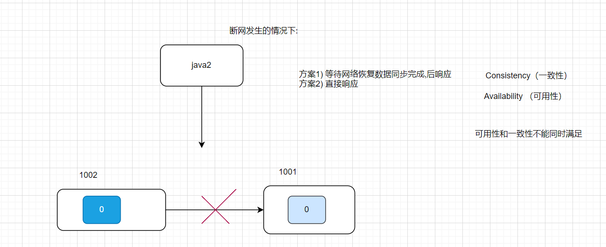

# 分布式事务笔记

## 1.概念

```ABAP
传统事务:
    一个业务需要操作数据库N次, 必须保证业务同时成功同时失败(A), 同时数据必须和和预期一直(C),多个事务不能相互影响(I),完成后数据必须持久化存储到硬盘(D), 

分布式事务:
	在分布式环境下，一个业务的操作要几个服务同时完成,要满足保证“业务”的原子性，要么所有操作全部成功，要么全部失败，不允许出现部分成功部分失败的现象，这就是"分布式系统下的事务"
```

## 2.CAP及BASE



### 2.1CAP

```properties
CAP 理论:
    在考虑断网(断开链接)一定会发生的情况下,系统的可用性和一致性不能同时满足
    如果不考虑分区, AC 的讨论没有意义
```

```
```

分区容错

```
Partition（分区）：因为网络故障或其它原因导致分布式系统中的部分节点与其它节点失去连接，形成独立分区。
Tolerance（容错）：在集群出现分区时，整个系统也要持续对外提供服务
```

可用性

```
Availability （可用性）：用户访问集群中的任意健康节点，必须能得到响应，而不是超时或等待。
```

一致性

```
Consistency（一致性）：用户访问分布式系统中的任意节点，得到的数据必须一致。
```

### 2.2 BASE

```properties
BASE理论是对CAP的一种解决思路，包含三个思想：(分区错误发生的情况下)
- Basically Available （基本可用）：分布式系统在出现故障时，允许损失部分可用性，即保证核心可用。
- Soft State（软状态）：在一定时间内，允许出现中间状态，比如临时的不一致状态。
- Eventually Consistent（最终一致性）：虽然无法保证强一致性，但是在软状态结束后，最终达到数据一致。
```

### 2.3 ES 是AP 还是CP

ES AP 还是CP 应该根据具体的配置来判断

读数据的时候我们可以根据 `Preference`指定读取的分片类型(ES 内部配置,可以修改)


```
Preference的配置选择，实际上是 AP 与 CP 的权衡过程。如果对可用性要求很高，那么_primary这个参数是万万不可用；如果对一致性要求相对较高但可用性也需要保证的场景来说，可以使用_primary_first(AP,牺牲部分一致性)；如果对一致性要求极高的场景，但也就放弃了一定程度的可用性，这样用_primary会更合适一些(此时是CP)。以此类推，需要根据自己的场景选择参数。

```


```
参考:
	https://www.yht7.com/news/18714
```


## 3.Seata

### 3.1 概念

```
Seata事务管理中有三个重要的角色：
- TC (Transaction Coordinator)事务协调者：维护全局和分支事务的状态，协调全局事务提交或回滚。
- TM (Transaction Manager) -事务管理器：定义全局事务的范围、开始全局事务、提交或回滚全局事务。
- RM (Resource Manager) -资源管理器：管理分支事务处理的资源，与TC交谈以注册分支事务和报告分支事务的状态，并驱动分支事务提交或回滚。

```


### 3.1 环境搭建

```
参考搭建文档
nacos> startup.bat -m standalone
```


### 3.2 代码集成

```xml
<!--seata-->
<dependency>
    <groupId>com.alibaba.cloud</groupId>
    <artifactId>spring-cloud-starter-alibaba-seata</artifactId>
    <exclusions>
        <!--版本较低，1.3.0，因此排除--> 
        <exclusion>
            <artifactId>seata-spring-boot-starter</artifactId>
            <groupId>io.seata</groupId>
        </exclusion>
    </exclusions>
</dependency>
<dependency>
    <groupId>io.seata</groupId>
    <artifactId>seata-spring-boot-starter</artifactId>
    <!--seata starter 采用1.4.2版本,该变量在父工程中已定义-->
    <version>${seata.version}</version>
</dependency>
```

配置

```yaml
seata:
  registry: # TC服务注册中心的配置，微服务根据这些信息去注册中心获取tc服务地址
    type: nacos # 注册中心类型 nacos
    nacos:
      server-addr: 127.0.0.1:8848 # nacos地址
      namespace: "" # namespace，默认为空 ①
      group: DEFAULT_GROUP # 分组，默认是DEFAULT_GROUP ②
      application: seata-tc-server # seata服务名称 ⑤
      username: nacos
      password: nacos
  tx-service-group: seata-demo # 事务组名称 ③
  service:
    vgroup-mapping: # 事务组与cluster的映射关系
      seata-demo: SH # ③④
```


```
namespace为空，就是默认的public
结合起来，TC服务的信息就是：public@DEFAULT_GROUP@seata-tc-server@SH，这样就能确定TC服务集群了。然后就可以去Nacos拉取对应的实例信息了。
```


## 4 分布式事务方案:XA: (一致性优先)

```
两阶段提交
一阶段：
    - 事务协调者通知每个事务参与者执行本地事务
    - 本地事务执行完成后报告事务执行状态给事务协调者，此时事务不提交，继续持有数据库锁
二阶段：
    - 事务协调者基于一阶段的报告来判断下一步操作
      - 如果一阶段都成功，则通知所有事务参与者，提交事务
      - 如果一阶段任意一个参与者失败，则通知所有事务参与者回滚事务
```


流程图:


```
XA模式的优点是什么？
    - 事务的强一致性，满足ACID原则。
    - 常用数据库都支持，实现简单，并且没有代码侵入
XA模式的缺点是什么？
    - 因为一阶段需要锁定数据库资源，等待二阶段结束才释放，性能较差
    - 依赖关系型数据库实现事务
```

```yaml
seata:
	data-source-proxy-mode: XA
```

```java
 业务入口增加注解
 @GlobalTransactional
 public Long create(Order order) {}
```


## 5 .分布式事务方案:AT -(优先保证可用性,数据最终一致)

### 5.1 流程

```
阶段一RM的工作：
    - 注册分支事务
    - 记录undo-log（数据快照）
    - 执行业务sql并提交
    - 报告事务状态
阶段二提交时RM的工作：
	- 删除undo-log即可
阶段二回滚时RM的工作：
	- 根据undo-log恢复数据到更新前
```


```
AT模式的优点：
    - 一阶段完成直接提交事务，释放数据库资源，性能比较好
    - 利用全局锁实现读写隔离
    - 没有代码侵入，框架自动完成回滚和提交
AT模式的缺点：
    - 两阶段之间属于软状态，属于最终一致
    - 框架的快照功能会影响性能，但比XA模式要好很多
```

### 5.2 AT 防止脏写设计原理

在多线程并发访问AT模式的分布式事务时，有可能出现脏写问题，如图：


解决思路就是引入了全局锁的概念。在释放DB锁之前，先拿到全局锁。避免同一时刻有另外一个事务来操作当前数据。


## 6.XA 和AT 区别

```
简述AT模式与XA模式最大的区别是什么？
    - XA模式一阶段不提交事务，锁定资源；AT模式一阶段直接提交，不锁定资源。
    - XA模式依赖数据库机制实现回滚；AT模式利用数据快照实现数据回滚。
    - XA模式强一致；AT模式最终一致
```

## 7. TCC 

```
TCC模式与AT模式非常相似，每阶段都是独立事务，不同的是TCC通过人工编码来实现数据恢复。需要实现三个方法：
- Try：资源的检测和预留； 
- Confirm：完成资源操作业务；要求 Try 成功 Confirm 一定要能成功。(即要求Confirm 不能抛异常)
- Cancel：预留资源释放，可以理解为try的反向操作。
```


### 7.1流程图


### 7.2优缺点

```
TCC模式的每个阶段是做什么的？
    - Try：资源检查和预留
    - Confirm：业务执行和提交
    - Cancel：预留资源的释放
TCC的优点是什么？
    - 一阶段完成直接提交事务，释放数据库资源，性能好
    - 相比AT模型，无需生成快照，无需使用全局锁，性能最强
    - 不依赖数据库事务，而是依赖补偿操作，可以用于非事务型数据库
TCC的缺点是什么？
    - 有代码侵入，需要人为编写try、Confirm和Cancel接口，太麻烦
    - 软状态，事务是最终一致
    - 需要考虑Confirm和Cancel的失败情况，做好幂等处理
```

### 7.3 TCC 编码注意:事务悬挂和空回滚

#### 空回滚

```
当某分支事务的try阶段阻塞时，可能导致全局事务超时而触发二阶段的cancel操作。在未执行try操作时先执行了cancel操作，这时我们编码时要保证cancel不能做正常回滚，要保证即使该方法执行了,业务依旧正常,就是"空回滚"。
```

#### 业务悬挂

```
对于已经空回滚的业务，之前被阻塞的try操作恢复，继续执行try，就永远不可能confirm或cancel ,如果此时try成功执行了,事务一直处于中间状态，这就是[业务悬挂]。 写代码时我们要防止事务悬挂
```

### 7.4 转账服务实现TCC 

这里我们定义一张表：

```sql
CREATE TABLE `account_freeze_tbl` (
  `xid` varchar(128) NOT NULL,
  `user_id` varchar(255) DEFAULT NULL COMMENT '用户id',
  `freeze_money` int(11) unsigned DEFAULT '0' COMMENT '冻结金额',
  `state` int(1) DEFAULT NULL COMMENT '事务状态，0:try，1:confirm，2:cancel',
  PRIMARY KEY (`xid`) USING BTREE
) ENGINE=InnoDB DEFAULT CHARSET=utf8 ROW_FORMAT=COMPACT;

```

其中：

- xid：是全局事务id
- freeze_money：用来记录用户冻结金额
- state：用来记录事务状态


那此时，我们的业务开怎么做呢？

- Try业务：
  - 
  - 记录冻结金额和事务状态到account_freeze表
  - 扣减account表可用金额
- Confirm业务
  - 根据xid删除account_freeze表的冻结记录
- Cancel业务
  - 
  - 修改account_freeze表，冻结金额为0，state为2
  - 修改account表，恢复可用金额
- 如何判断是否空回滚？
  - cancel业务中，根据xid查询account_freeze，如果为null则说明try还没做，需要空回滚
- 如何避免业务悬挂？
  - try业务中，根据xid查询account_freeze ，如果已经存在则证明Cancel已经执行，拒绝执行try业务

接下来，我们改造account-service，利用TCC实现余额扣减功能。

```java
@LocalTCC
public interface AccountTCCService {

    @TwoPhaseBusinessAction(name = "deduct", commitMethod = "confirm", rollbackMethod = "cancel")
    void deduct(@BusinessActionContextParameter(paramName = "userId") String userId,
                @BusinessActionContextParameter(paramName = "money")int money);

    boolean confirm(BusinessActionContext ctx);

    boolean cancel(BusinessActionContext ctx);
}
```

```java
package cn.itcast.account.service.impl;

import cn.itcast.account.entity.AccountFreeze;
import cn.itcast.account.mapper.AccountFreezeMapper;
import cn.itcast.account.mapper.AccountMapper;
import cn.itcast.account.service.AccountTCCService;
import io.seata.core.context.RootContext;
import io.seata.rm.tcc.api.BusinessActionContext;
import lombok.extern.slf4j.Slf4j;
import org.springframework.beans.factory.annotation.Autowired;
import org.springframework.stereotype.Service;
import org.springframework.transaction.annotation.Transactional;


@Service
@Slf4j
public class AccountTCCServiceImpl implements AccountTCCService {

    @Autowired
    private AccountMapper accountMapper;
    @Autowired
    private AccountFreezeMapper freezeMapper;

    @Override
    @Transactional
    public void deduct(String userId, int money) {
        // 0.获取事务id
        String xid = RootContext.getXID();
        // 查询freeze，防止业务悬挂
        AccountFreeze oldFreeze = freezeMapper.selectById(xid);
        if (oldFreeze != null) {
            // 拒绝业务
            return;
        }

        // 1.扣减可用余额
        accountMapper.deduct(userId, money);
        // 2.记录冻结金额，事务状态
        AccountFreeze freeze = new AccountFreeze();
        freeze.setUserId(userId);
        freeze.setFreezeMoney(money);
        freeze.setState(AccountFreeze.State.TRY);
        freeze.setXid(xid);
        freezeMapper.insert(freeze);
    }

    @Override
    public boolean confirm(BusinessActionContext ctx) {
        // 1.获取事务id
        String xid = ctx.getXid();
        // 2.根据id删除冻结记录
        int count = freezeMapper.deleteById(xid);
        return count == 1;
    }

    @Override
    @Transactional
    public boolean cancel(BusinessActionContext ctx) {
        // 0.查询冻结记录
        String xid = ctx.getXid();
        String userId = ctx.getActionContext("userId").toString();

        AccountFreeze freeze = freezeMapper.selectById(xid);
        // 空回滚判断
        if (freeze == null) {
            freeze = new AccountFreeze();
            freeze.setUserId(userId);
            freeze.setFreezeMoney(0);
            freeze.setState(AccountFreeze.State.CANCEL);
            freeze.setXid(xid);
            freezeMapper.insert(freeze);
            return true;
        }
        // 幂等判断
        if(freeze.getState() == AccountFreeze.State.CANCEL){
            // 已经处理过了，无需重复cancel
            return true;
        }
        // 1.恢复可用余额
        accountMapper.refund(freeze.getUserId(), freeze.getFreezeMoney());
        // 2.将冻结金额清零，状态改为CANCEL
        freeze.setFreezeMoney(0);
        freeze.setState(AccountFreeze.State.CANCEL);
        int count = freezeMapper.updateById(freeze);
        return count == 1;
    }
}
```

## 8 SAGA 模式

```
可以参考
https://help.aliyun.com/document_detail/172549.html?scm=20140722.S_help%40%40%E6%96%87%E6%A1%A3%40%40172549._.ID_172549-RL_%E6%A1%86%E6%9E%B6webviewandroid-OR_main-V_2-P0_846
```

```
SAGA 模式也是由开发人员实现
1) 需要编写两个方法, try 方法和 cancel 方法 (TCC 是编写三个方法)
	 例如:  try: 正常处理并 插入一条日志
	       cancel: 基于日志 回滚
2) SAGA 模式方法触发由 seata 决定
```

```
优点：
    - 事务参与者可以基于事件驱动实现异步调用，吞吐高
    - 一阶段直接提交事务，无锁，性能好
    - 不用编写TCC中的三个阶段，实现简单(代码简单,配置繁琐)
缺点：
    - 软状态持续时间不确定，时效性差
    - 没有锁，没有事务隔离，会有脏写
```

## 9 对比


## 9 高可用


## 总结


````properties
1) 微服务
   1) 注册中心 流程 (Eureke/Nacos)
   	   
   2) 网关的作用
      	1) 反向代理 (请求的转发)
        2) 负载均衡 (如果有多个服务,则 平均分散请求)
        3) 权限校验(是否登录)
        4) 防止网络攻击服务器
        5) 限流
        6) 跨域
   3) Ribbon 原理/Feign
   
2) docker的作用
    快速部署应用:
3) RabbitMQ 
	0)常见的5种消息模型
   		
    1) MQ 作用
        1)应用解耦---- 1) 发送邮件--短信
                      2) mysql 数据同步值ES

        2) 削峰填谷(瞬时高并发业务 ,抢购,秒杀)
        
        3) 数据同步
    -------------------------------------------------------
    1:RabbitMQmq 如何保证消息的可靠性,即如何保证消息不丢失?
      1) 发送时可靠性
        只是消息错误回调,在回调函数中做业务处理(记录日志或重发)
      2) 存储可靠性
         mq 存储到内存不安全,可以开启持久化(交换机,队列,消息)
      3) 消费可靠性
         1) 默认消费失败(抛异常) 消息回到队列后重复消费, 浪费性能
         2) springamqp: 消息重试, 重试后如果还失败,回复拒绝(mq 会丢弃消息-->死信)
            此时应该配置死信交换机+队列,记录错误消息, 如果有必要: 进行人工干预
         3) springamqp: 消息重试, 重试后如果还失败,回复拒绝(mq 会丢弃消息-->死信)
            此时可以自己定义消息错误队列记录消息(建议使用死信)
    2:什么是死信? : mq 判定消息不会被消费了
       什么是死信？
        当一个队列中的消息满足下列情况之一时，可以成为死信（dead letter）：
        - 消费者使用basic.reject或 basic.nack声明消费失败，并且消息的requeue参数设置为false
        - 消息是一个过期消息，超时无人消费
        - 要投递的队列消息满了，无法投递
    3:RabbitMQ 如何实现消息延时消费,如何实现TTL?
        1) 利用死信实现
        2) 使用插件
    4.MQ 消息堆积问题 如何解决?
        1) 多个消费者
        2) 消费者开启多线程
        3) 开启惰性队列即:消息直接存储到硬盘(影响效率)
    5.MQ的单机故障 如何解决?
        使用镜像集群或仲裁队列
````

```properties
redis:
	1) 1) 持久化RDB 方式和AOF 方式 概念
   		 1) RDB 备份的是 内存的快照
    	2) AOF 备份的是 命令

    2) 持久化RDB 方式和AOF 方式 区别
        1) RDB 备份慢,消耗CPU 高, 但是恢复块
        2) AOF 备份快,消耗CPU 低, 但是恢复慢
        3) 4.0 RDB+AOF 方式
    3) 主从+哨兵 优缺点:
        1) 优点 :
            简单
            实现自动主从切换
            实现读写分离
            slave 防止数据丢失
        2)缺点
          不能扩容,写性能受限
    4) 分片集群Cluster(+主从)模式的优缺点:
        1) 实现自动主从切换
        2) 降低服务器压力
        3) slave 防止数据丢失
        缺点:
            稍复杂
```

```properties
redis在项目中是怎么用的:
    项目中用了那种类型?
       1.验证码用到了String , (设置5分钟超时)
       2.缓存活动数据用的是 set 
       3.分布式session, string
    为啥快?
      基于内存的   
    redis 是单线程还是多线程:
        1) 单线程( 没有线程安全问题) 
        2) redis 高版本提供了多线程机制 (也保证了没有线程安全问题)
```

```properties
分布式事务: XA,AT ,TCC 的区别
	:简述AT模式与XA模式最大的区别是什么？
    - XA模式一阶段不提交事务，锁定资源；AT模式一阶段直接提交，不锁定资源。
    - XA模式依赖数据库机制实现回滚；AT模式利用数据快照实现数据回滚。
    - XA模式强一致；AT模式最终一致
```

```properties
CAP 理论: 口头阐述
	在考虑断网(分区错误)发生的情况下,系统的可用性和一致性不能同时满足,要么考虑可用性一致性
	AP,CP
    如果不考虑分区, AC 的讨论没有意义
    
  1) 分布式环境下:
   1.1)配置热更新解决方案?   nacos 配置中心
   1.2)微服务之间远程访问方案?   feign 
   1.3)如何实现限流?  网关
   1.4)负载均衡解决方案? getway , nginx
   1.5) 服务如何快速部署?  docker +dockerfile + docker-compose
   1.6) 微服务之间如何降低耦合?  MQ 
   1.7) 秒杀服务中的抢购如何防止服务器单机?  MQ 
   1.8) 订单如何实现定时回退?  MQ 延时
   1.9) 海量数据搜索方案? ES
   1.0) 拼音搜索,自动补全 ? ES
   1.11) 搜附近如何实现: ES ,redis
   1.11) 数据同步方案?  MQ , cancal 
   1.12)  分布式事务解决方案 ? seata > XA,AT,TCC
-----------------------------------------------------   
    
```


