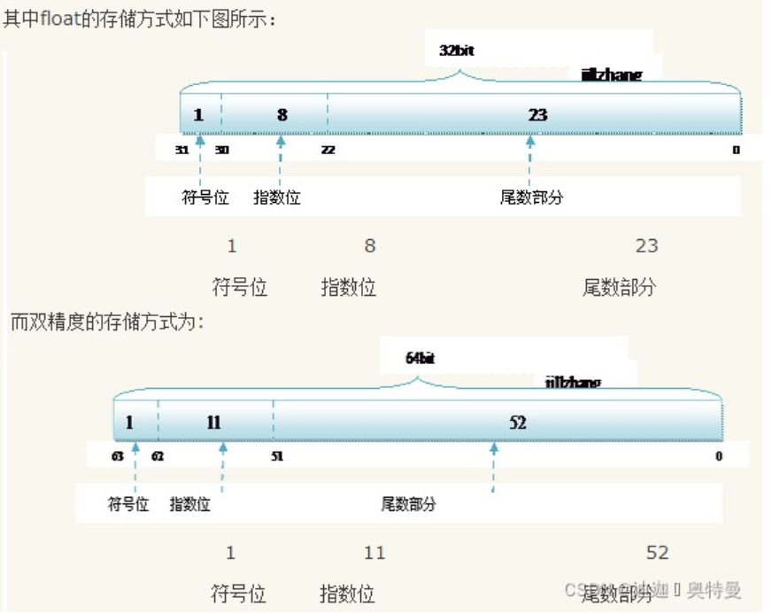
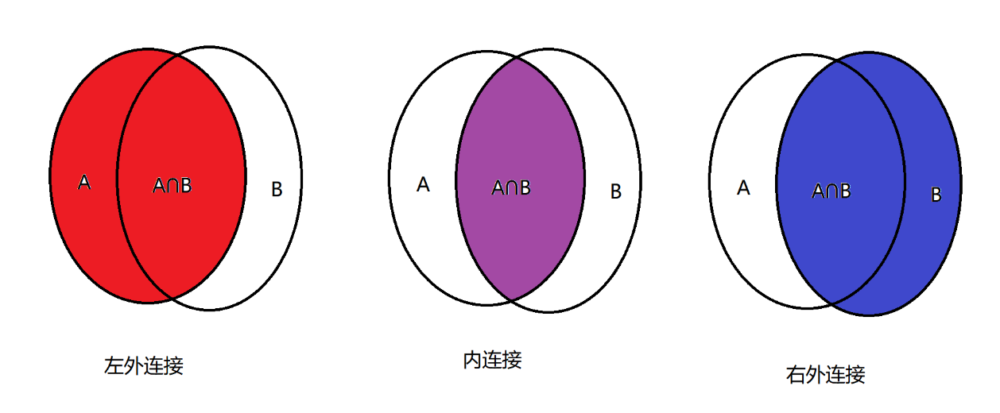

# 复习笔记

## 1. jdk  和jre 区别

````
JRE是java运行时环境而JDK是java开发工具包(JDK包含JRE)

JDK：java development kit (java开发工具)，JDK 是用于开发 Java 程序的最小环境。

JRE：java runtime environment (java运行时环境)，是提供给 Java 程序运行的最小环境。
````

## 2. jdk 如何安装

```
1.解压/ 直接安装
2. 配置环境变量
   配置JAVA_HOME
   配置Path

```

## 3 变量/常量

```
byte  2^8-1  ~  -2^8 
short  2^16-1  ~  -2^16 
int     2^32-1  ~  -2^32 
long     2^64-1  ~  -2^64 
float    浮点型, 4 个字节,小数点后 能精确6-7 位  3.4* 10^38 
double   浮点型, 8 个字节,小数点后 能精确15-16 位  1.79* 10^308 
char  
boolean 
```

```
https://blog.csdn.net/qwq1503/article/details/122519349
```




## 4  if / 三元运算符

```
短路运算符&&,|| 
```

## 5 数组


## 6 for while

## 7 继承/多态


## 8 final 

```
final 修饰变量，是常量常量。
final 修饰方法，表示方法不能被子类重写
```

## 9 抽象类和接口的区别(自行百度,很多)

```
1) 都可以定义抽象方法
2) 抽象类可以定义非抽象方法
```

什么情况下使用抽象类或接口

```
抽象类:
	一般开发不用,框架的底层使用: 一般都是定义一个类,大部分方法是提前写好的,但是关键的方法需要子类实现,例如HttpServlet ,
接口:
	主要用于模块间的解耦
```

## 10 集合

```
set(去重无序) ,list(不去重,有序), hashmap

```

## 11 IO 流

```
能看懂工具类即可
```

## 12 多线程

创建线程的方式

### 方式1 

```java
new Thread(){
            @Override
            public void run() {
                System.out.println("子线程....");
            }java
}.start();
```

### 方式2

```java
 new Thread(new Runnable() {
            @Override
            public void run() {
                System.out.println("2线程....");
            }
  }).start();
```


上面2种方式都是创建线程的方式,也是我们过去创建线程的方式但是 我们主线程是否能获取子线程的执行结果呢?

答案是不行

jdk 还有另外一种方式能够创建线程,同时可以获取子线程的 执行结果

### 方式3 实现Callable 接口

```java
  // Callable 接口  (主线程可以获取子线程执行结果)
    FutureTask futureTask = new FutureTask(new Callable() {
        @Override
        public Object call() throws Exception {
            System.out.println("子线程执行了");
            return 1;
        }
    });

new Thread(futureTask).start();

Object o = futureTask.get();
System.out.println("主线程"+o);
```

### https://cuizb.top/myblog/article/1638890023


## 13: MySql 复习

### 1.1  数据类型

```assembly
- 数值
      tinyint : 小整数型，占一个字节
      int	： 大 整数类型，占四个字节
      bigint :  整数类型，占八个字节
      double ： 浮点类型 (最大为16位)
      	使用格式： 字段名 double(总长度,小数点后保留的位数)
      	
      	例如： score double(5,2)  
      	
- 日期
      date ： 日期值。只包含年月日yyyy-mm-dd
      	eg ：birthday date ： 
      datetime ： 混合日期和时间值。包含年月日时分秒
- 字符串
      char ： 定长字符串。
      	优点：查询性能高
      	缺点：浪费空间
      	eg ： name char(10)  如果存储的数据字符个数不足10个，也会占10个的空间
      varchar ： 变长字符串。
      	优点：节约空间
      	缺点：查询性能底
      	eg ： name varchar(10) 如果存储的数据字符个数不足10个，那就数据字符个数是几就占几个的空间
```

### 1.2 增删改

```sql
-- 给指定列添加数据
INSERT INTO stu (id, NAME) VALUES (1, '张三');
-- -- 给所有列添加数据，列名的列表可以省略的
INSERT INTO stu VALUES (3,'李四','男','1999-11-11',88.88,'lisi@itcast.cn','13888888888',1);

-- 批量添加数据
INSERT INTO stu VALUES 
	(2,'李四','男','1999-11-11',88.88,'lisi@itcast.cn','13888888888',1),
	(2,'李四','男','1999-11-11',88.88,'lisi@itcast.cn','13888888888',1),
	(2,'李四','男','1999-11-11',88.88,'lisi@itcast.cn','13888888888',1);
-- 删除
delete  from stu where name = '张三' where id=1
-- 更新
update stu set birthday = '1999-12-12', score = 99.99 where name = '张三';

```

### 1.3 基础查询

```sql
-- 查询所有列的数据，列名的列表可以使用*替代
-- 简单 ,但是一般不用
select * from stu ;
-- 复杂,但是 灵活性高 ;
select id,name,age,sex,address,math,english,hire_date from stu ;


-- 查询name、age两列
select name  ,age from stu ;
-- 查询地址信息
select address from stu;
-- 去除重复记录

select distinct address from stu;


-- 1.查询年龄大于20岁的学员信息
select * from stu where age = 20;


-- 2.查询年龄大于等于20岁的学员信息
select * from stu where age >= 20;


-- 3.查询年龄大于等于20岁 并且 年龄 小于等于 30岁 的学员信息
select * from stu where age >= 20 &&  age <= 30;
-- and 多
select * from stu where age >= 20 and  age <= 30  ;
-- 或者
select * from stu where age >= 20 or  age <= 10  ;


select * from stu where age BETWEEN 20 and 30; 

-- 4.查询入学日期在'1998-09-01' 到 '1999-09-01'  之间的学员信息

select * from stu where hire_date BETWEEN '1998-09-01' and '1999-09-01';


-- 5. 查询年龄等于18岁的学员信息

select * from stu where age = 18;

-- 6. 查询年龄不等于18岁的学员信息
select * from stu where age != 18;
-- <> 不等于
select * from stu where age <> 18;

-- 7. 查询年龄等于18岁 或者 年龄等于20岁 或者 年龄等于22岁的学员信息
select * from stu where age = 18   or age = 20 or age = 22;

select * from stu where age in (18,20 ,22);

select * from stu where age not in (18,20 ,22);

-- 8. 查询英语成绩为 null的学员信息  
-- 注意： null值的比较不能使用 = != 。需要使用 is  is not
 
select * from stu where english = null; -- 不行的

select * from stu where english is null;

select * from stu where english is not null;


-- 思考 查询年龄 在 20-30 之间 或 数学成绩 >60  的 人
-- 通过增加 () 提高可读性
select * from stu where (age >= 20 and  age <= 30) or math > 60 ;
-- 思考 应怎么用
/*
 *  _ 一般不用,因为几乎没有这个需求
 *  %马 很少用
 * 
 *  %马% 经常用
 * */
select * from stu where name like '马_'    -- =
select * from stu where name like '马%'  
select * from stu where name like '%马%'  
select * from stu where name not like '%马' 

```

### 1.4 复杂查询

聚合函数

```sql
-- 总数
   select count(*) from stu;
-- 查询数学成绩的最高分
   select max(math) from stu;
-- 查询数学成绩的最低分
   select min(math) from stu;
-- 查询数学成绩的总分
   select sum(math) from stu;
-- 查询数学成绩的平均分
   select avg(math) from stu;   
```

分组

```sql
-- 分组 为了干啥 : 为了统计计算
/*
1. 分组一定和聚合函数(count,avg,max,min,sum) 一起出现
2, 书写原则
    slect  后面的字段 要么 出现在 group  by  后面,要么出现在 聚合函数中,否则报错(没有意义)
3, 过程     
   1) 先确定按照那个字段分组
   2) 再确定要那些字段
*/
--  查询男同学和女同学各自的数学平均分
select sex, avg(math)  from  stu  group by sex 

select sex, avg(math)  from  stu where math>50    group by sex  having avg(math)>90;

-- 求工资>4000 人的平均工资, 按照性别分组 , 分组后如果平均工资 <4800 不显示
-- 1) 先打架子 select *  from emp 
-- 2) 确定分组条件 写group 
-- 3) 那些数据参与分组写到 where 后 (分组前)
-- 4) 确定返回数据
-- 5) 对分组后的数据卷进行筛选 having

select  avg(salary),gender  from emp where salary >4000 group by gender having  avg(salary)>=4800
```

排序

```sql
order by :  desc 倒序,asc  :正序   (从上往下)
```

分页

```sql
select * from stu limit 0 , 3;   --  开始索引, 查询多少条

```

### 1.5 约束及自增

```properties
常用的四个规则
 	-非空约束:  not null  
    -唯一约束:  unique    
    -主键约束:  PRIMARY KEY  非空+唯一 
    -默认约束:  default 给定一个默认值 
```

```properties
自动增长:
	不是约束, 是一个额外的功能, 用于主键字段,为了保证 主键字段的唯一和非空
	1) id 不给值,则自动赋值,从1 开始
	2) id 给值0 ,则则自动赋值
	3) 自增底层是一个自增序列数,每次使用后都加一(不管是否插入成功)
	4) 自增底层是一个自增序列数, 删除数据不会回退
	5) 如果插入时指定id>0  则已指定的为主, 
	6) 如果插入时指定id > 自增序列数, 则自增序列 改为 指定的值
```

### 1.6 表关系

```properties
一对一: 把一张大表 拆分成两张表 (用户---用户详情表)
一对多:  用户--部门
多对多: 描述的是两个表数据之间的关系(通过中间表描述) : 学生和课程 ,商品和订单
```

### 1.7 多表查询(重点)

````
-笛卡尔集: 笛卡尔定义的一种数学运算, 计算集合相乘:
--
(1,2) * (3,4,5) = [(1,3)},(1,4),(1,5),(2,3)},(2,4),(2,5)]
select *from emp ,dept -- 结果是笛卡尔集
````

### 1.8 多表关联查询

```
内连接: 查询的结果是两张表都有的数据(能通过外键列关联上的数据)
左外连接: 查询的是 左边表所有的数据 以及右表表中 关联的数据
右外连接: 查询的是 右边表所有的数据 以及左表表中 关联的数据
```



写法

```sql
-- 笛卡尔积
(A,B) * (1,2) =(A,1) ,(A,2),(B,1),(B,2)
-- 内连接查询: 只有所有关联的数据才能查询出来
select * from emp e ,dept d where e.dept_id =d.id 
select * from emp e inner join dept d on e.dept_id =d.id 


-- 左 外连接: 左表的所有数据即右表关联的数据
select * from emp e left join  dept d on e.dept_id =d.id 
-- 右 外连接: 右表的所有数据即左表关联的数据
select * from emp e right join  dept d on e.dept_id =d.id  
```

### 1.9  子查询 

```
先拆分写sql 再合并
```

```sql
 -- 查询研发部所有员工
-- 子查询
select  did from dept  where dname ='研发部'
select * from emp where dep_id =  1

-- 改造成子查询 
-- 当子sql  返回值是 单行单列时 用= 
select * from emp where dep_id = (select  did from dept  where dname ='研发部')

-- 查询 研发部,市场部 所有员工
-- 当子sql  返回值是 多行单列时 用 in 

select * from emp where dep_id in (select  did from dept  where dname ='研发部' or dname ='市场部')
-- 当子sql  返回值是 多行多列时 当做表使用
select  * from emp e, (select  *  from dept  where dname ='研发部' or dname ='市场部') d where e.dep_id  =d.did

```

多表查询练习 (重点)

```java
DROP TABLE IF EXISTS emp;
DROP TABLE IF EXISTS dept;
DROP TABLE IF EXISTS job;
DROP TABLE IF EXISTS salarygrade;

-- 部门表
CREATE TABLE dept (
  id INT PRIMARY KEY PRIMARY KEY, -- 部门id
  dname VARCHAR(50), -- 部门名称
  loc VARCHAR(50) -- 部门所在地
);

-- 职务表，职务名称，职务描述
CREATE TABLE job (
  id INT PRIMARY KEY,
  jname VARCHAR(20),
  description VARCHAR(50)
);

-- 员工表
CREATE TABLE emp (
  id INT PRIMARY KEY, -- 员工id
  ename VARCHAR(50), -- 员工姓名
  job_id INT, -- 职务id
  mgr INT , -- 上级领导
  joindate DATE, -- 入职日期
  salary DECIMAL(7,2), -- 工资
  bonus DECIMAL(7,2), -- 奖金
  dept_id INT, -- 所在部门编号
  CONSTRAINT emp_jobid_ref_job_id_fk FOREIGN KEY (job_id) REFERENCES job (id),
  CONSTRAINT emp_deptid_ref_dept_id_fk FOREIGN KEY (dept_id) REFERENCES dept (id)
);
-- 工资等级表
CREATE TABLE salarygrade (
  grade INT PRIMARY KEY,   -- 级别
  losalary INT,  -- 最低工资
  hisalary INT -- 最高工资
);
				
-- 添加4个部门
INSERT INTO dept(id,dname,loc) VALUES 
(10,'教研部','北京'),
(20,'学工部','上海'),
(30,'销售部','广州'),
(40,'财务部','深圳');

-- 添加4个职务
INSERT INTO job (id, jname, description) VALUES
(1, '董事长', '管理整个公司，接单'),
(2, '经理', '管理部门员工'),
(3, '销售员', '向客人推销产品'),
(4, '文员', '使用办公软件');


-- 添加员工
INSERT INTO emp(id,ename,job_id,mgr,joindate,salary,bonus,dept_id) VALUES 
(1001,'孙悟空',4,1004,'2000-12-17','8000.00',NULL,20),
(1002,'卢俊义',3,1006,'2001-02-20','16000.00','3000.00',30),
(1003,'林冲',3,1006,'2001-02-22','12500.00','5000.00',30),
(1004,'唐僧',2,1009,'2001-04-02','29750.00',NULL,20),
(1005,'李逵',4,1006,'2001-09-28','12500.00','14000.00',30),
(1006,'宋江',2,1009,'2001-05-01','28500.00',NULL,30),
(1007,'刘备',2,1009,'2001-09-01','24500.00',NULL,10),
(1008,'猪八戒',4,1004,'2007-04-19','30000.00',NULL,20),
(1009,'罗贯中',1,NULL,'2001-11-17','50000.00',NULL,10),
(1010,'吴用',3,1006,'2001-09-08','15000.00','0.00',30),
(1011,'沙僧',4,1004,'2007-05-23','11000.00',NULL,20),
(1012,'李逵',4,1006,'2001-12-03','9500.00',NULL,30),
(1013,'小白龙',4,1004,'2001-12-03','30000.00',NULL,20),
(1014,'关羽',4,1007,'2002-01-23','13000.00',NULL,10);
-- 添加5个工资等级
INSERT INTO salarygrade(grade,losalary,hisalary) VALUES 
(1,7000,12000),
(2,12010,14000),
(3,14010,20000),
(4,20010,30000),
(5,30010,99990);
```

```sql
-- 一.查询所有员工信息。查询员工编号，员工姓名，工资，职务名称，职务描述

-- 1 搭架子
   select * from 
-- 2  确定数据来源于那几张表   
   select * from emp e, job j  
-- 3 确定关联关系,把有意义的数据筛选出来
   select * from emp e, job j   where e.job_id =j.id 
-- 4. 确定要那些字段

-- 查询员工编号，员工姓名，工资，职务名称，职务描述，部门名称，部门位置   
   

-- 1 搭架子
   select * from 
-- 2  确定数据来源于那几张表   
   select * from emp e, job j  ,dept d
-- 3 确定关联关系,把有意义的数据筛选出来
   select * from emp e, job j ,dept d  where e.job_id =j.id  and e.dept_id =d.id 
-- 4. 确定要那些字段   
   
   
-- 内连接
 select * from emp e inner join  job j  on   e.job_id =j.id 
                     inner join  dept d on   e.dept_id =d.id   
```

```sql
--二. 查询员工姓名，工资，工资等级
                     
-- 1 搭架子
   select * from 
-- 2  确定数据来源于那几张表   
   select * from emp e, salarygrade s
-- 3 确定关联关系,把有意义的数据筛选出来   
    --  如果有关联字段使用关联字段
    --  如果没有管理字段: 找规律 
    select * from emp e, salarygrade s 
          where e.salary between  s.losalary  and s.hisalary 
-- 4. 确定字段                  
     --  技巧1 表别名.*         
       select e.ename name ,s.*  from emp e, salarygrade s 
       							where e.salary between  s.losalary  and s.hisalary 
     --  技巧2  可以给字段起别名 
```

```sql
--三. 查询出部门编号、部门名称、部门位置、部门人数 
  -- 多表 + 分组          
  -- 先多表,再分组                   
-- 1 搭架子             
    select * from 
-- 2  确定数据来源于那几张表
  select * from emp e, dept d
  
-- 3 确定关联关系,把有意义的数据筛选出来
  select * from emp e, dept d where  d.id =e.dept_id 
    
-- 4 确定 字段 : 
   select d.id ,d.dname,e.id eid  from emp e, dept d where  d.id =e.dept_id 

-- 5,分组  

  select t.id,t.dname,count(*) from (
  	select d.id ,d.dname,e.id eid  from emp e, dept d where  d.id =e.dept_id) t
  group by  t.id,t.dname
```

### 
