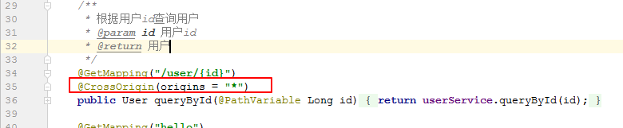

# 跨域请求

## 1. 域名是什么

```
域名（英语：Domain Name），又称网域，是由一串用点分隔的名字组成的Internet上某一台计算机或计算机组的名称，用于在数据传输时对计算机的定位标识（有时也指地理位置）。 [1] 
由于IP地址具有不方便记忆并且不能显示地址组织的名称和性质等缺点，人们设计出了域名，并通过网域名称系统（DNS，Domain Name System）来将域名和IP地址相互映射，使人更方便地访问互联网，而不用去记住能够被机器直接读取的IP地址数串。 [1]
```


```
https://www.baidu.com,  http://www.itheima.com  就是一个域名
```

## 2. 什么是不同的域名


## 3. 什么是跨域请求

  通俗的讲,a 网站请求b 网站的资源叫做跨域

```
www.baidu.com  请求---->map.baidu.com  就是跨域请求
```

## 4. 跨域会有什么问题? 有安全隐患

```
案例
	1)用户A访问www.aaa.com 进行登陆(开启了7天免密登陆,其实就是存储了一个cookies)然后支付,(开通了免密支付),
	2)黑客B 开发了一个网站 www.bbb.com,
	3) 如果www.aaa.com 不做跨域限制,则 当用户在同一个个浏览器同时访问 aaa,bbb (两个tab)  可能会导致 bbbb网站能窃取到用于A 在aaa 网站的信息(例如购物车等信息) 

```

注意: 浏览器不允许 js 的ajax 请求跨域访问

​        但是可以在\ 或者\<a href="www.baidu.com">


## 5. 既然有安全问题，那为什么又要跨域呢？

```
 有时公司内部有多个不同的子域，比如一个是location.company.com ,而应用是放在app.company.com , 这时想从 app.company.com去访问 location.company.com 的资源就属于跨域。
```

## 6 跨域 解决方案

在前端js中如果发送异步请求的话，请求的地址与当前服务器的ip或者端口号不同都是跨域请求，可以使用如下方式在服务器端进行配置：




```
也可以只允许指定域名访问域名:
  @CrossOrigin(origins = {"http://localhost","http://localhost"})
```


## 7. 跨域访问流程

`CORS (Cross-Origin Resource Sharing)`是由 W3C 制定的一种跨域资源共享技术标准，其目的就是为了解决前端的跨域请求。在 Java EE 开发中，最常见的前端跨域请求解决方案是 `JSONP`，但是 `JSONP` 只支持 GET 请求，这是一个很大的缺陷，而 CORS 则支持多种 HTTP 请求方法。以 CORS 中的 GET 请求为例，当浏览器发起请求时，请求头中携带了如下信息：

```http
...
Host: localhost:8080 
Origin: http://localhost:8081 
Referer: http://localhost:8081/index.html
...
12345
```

假如服务端支持 CORS，则服务端给出的响应信息如下：

```http
...
Access-Control-Allow-Origin: http://localhost:8081 
Content-Length: 20 
Content-Type : text/plain;charset=UTF-8 
Date: Thu, 12 Jul 2018 12:51:14 GMT
...
123456
```

响应头中有一个 `Access-Control-Allow-Origin` 字段，用来记录可以访问该资源的域。当浏览 器收到这样的响应头信息之后，提取出 `Access-Control-Allow-Origin` 字段中的值，发现该值包含当前页面所在的域，就知道这个跨域是被允许的，因此就不再对前端的跨域请求进行限制。这就是 GET 请求的整个跨域流程，在这个过程中，前端请求的代码不需要修改，主要是后端进行处理。这个流程主要是针对 **GET**、 **POST** 以及 **HEAD** 请求，并且**没有自定义请求头**，如果用户发起一个 **DELETE** 请求、 **PUT** 请求或者**自定义请求头**，流程就会稍微复杂一些。

以 DELETE 请求为例，当前端发起一个 DELETE 请求时，这个请求的处理会经过两个步骤。

1. 发送一个 OPTIONS 请求。代码如下：

```http
...
Access-Control-Request-Method DELETE 
Connection keep-alive 
Host localhost:BOBO 
Origin http://localhost: 8081
...
123456
```

这个请求将向服务端询问是否具备该资源的 DELETE 权限，服务端会给浏览器一个响应，代码如下：

```http
...
HTTP/1.1 200
Access-Control-Allow-Origin: http://localhost:8081 
Access-Control-Allow-Methods: DELETE
Access-Control-Max-Age: 1800 
Allow: GET, HEAD, POST, PUT, DELETE, OPTIONS, PATCH 
Content-Length: 0 
Date: Thu, 12 Jul 2018 13:20:26 GMT
...
123456789
```

服务端给浏览器的响应， Allow 头信息表示服务端支持的请求方法，这个请求相当于一个探测请求，当浏览器分析了请求头宇段之后，知道服务端支持本次请求， 则进入第二步。

1. 发送 DELETE 请求。接下来浏览器就会发送一个跨域的 DELETE 请求，代码如下：

```http
...
Host: localhost:8080 
Origin: http://localhost:8081 
Connection: keep-alive 
...
12345
```

服务端给一个响应：

```http
...
HTTP/1.1 200
Access-Control-Allow-Origin: http://localhost:8081
Content-Type: text/plain;charset=UTF-8
Date: Thu, 12 Jul 2018 13:20:26 GMT
...
123456
```

至此， 一个跨域的 DELETE 请求完成。 无论是简单请求还是需要先进行探测的请求，前端的写法都是不变的，额外的处理都是在服务端来完成的。

