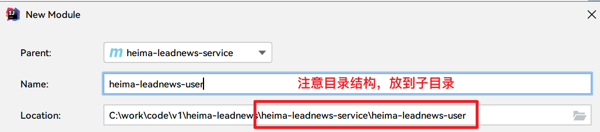

# 01-环境搭建&SpringCloud微服务

## 1)今日菜单

1. 项目概述
2. 基础环境搭建（Nacos+项目脚手架）
3. **登录功能实现（重点）**
4. 接口测试+文档
5. **集成网关（重点）**
6. 集成前端


## 2)项目介绍

  

### 2.1)项目背景

随着智能手机的普及，人们更加习惯于通过手机来看新闻。由于生活节奏的加快，很多人只能利用碎片时间来获取信息，因此，对于移动资讯客户端的需求也越来越高。黑马头条项目正是在这样背景下开发出来。黑马头条项目采用当下火热的微服务+大数据技术架构实现。本项目主要着手于获取最新最热新闻资讯，通过大数据分析用户喜好精确推送咨询新闻


### 2.2)术语说明


### 2.3)业务功能


项目演示地址：

> 用户端：http://heima-app-java.itheima.net/（手机模式）
>
> 自媒体端：http://heima-wemedia-java.itheima.net/
>
> 管理端：http://heima-admin-java.itheima.net

平台管理与自媒体为PC端，用电脑浏览器打开即可。

其中app端为移动端，打开方式有两种：                                                 

- 谷歌浏览器打开，调成移动端模式                      

- **手机浏览器打开**

   


### 2.4)技术栈


- Spring-Cloud-Gateway : 微服务之前架设的网关服务，实现服务注册中的API请求路由，以及控制流速控制和熔断处理都是常用的架构手段，而这些功能Gateway天然支持
- 运用Spring Boot快速开发框架，构建项目工程；并结合Spring Cloud全家桶技术，实现后端个人中心、自媒体、管理中心等微服务。
- 运用Spring Cloud Alibaba Nacos作为项目中的注册中心和配置中心
- 运用mybatis-plus作为持久层提升开发效率
- 运用Kafka完成内部系统消息通知；与客户端系统消息通知；以及实时数据计算
- 运用Redis缓存技术，实现热数据的计算，提升系统性能指标
- 使用Mysql存储用户数据，以保证上层数据查询的高性能
- 使用Mongo存储用户热数据，以保证用户热数据高扩展和高性能指标
- 使用MinIO作为静态资源存储器，在其上实现热静态资源缓存、淘汰等功能
- 运用ES搜索技术，完成文章的搜索，提升搜索查询的性能


## 3)课程介绍


部署架构图如下： 


## 4)Nacos环境搭建

### 4.1)虚拟机镜像准备

1)打开当天资料文件中的镜像，拷贝到一个地方，然后解压

2)导入VMware（双击CentOS7.vmx；如果打开无效，可以尝试使用**扫描虚拟机**的功能）

3)重置网络

```asciiarmor
1.选中VMware中的编辑
2.选择虚拟网络编辑器
```


```asciiarmor
3.为了避免之前的虚拟机配置影响，需要重置网络。选择NAT网卡，获取管理员权限，还原默认配置。【可选】
```

 

4）修改虚拟网络地址（NAT）

```asciiarmor
1、把除了NAT模式，其他的网络配置都删掉【重要】
2、找到NAT网卡，把子网IP改为200（当前挂载的虚拟机已固定ip地址）
192.168.200.0
```

                       

修改虚拟机的网络模式为NAT【可选】

 

5)启动虚拟机

```json
#虚拟机的ip已手动固定（静态IP）, 地址为：192.168.200.130
#用户名：root  密码：itcast
```

6)使用SecureCRT或FinalShell客户端链接

 

 

### 4.2)nacos安装

```
nacos：
1、注册中心（所有的微服务把自己的ip端口放到nacos）
2、配置中心（把项目中的一些配置由本地application.yml放到nacos上）
```

```asciiarmor
#1、检查容器是否已启动
docker ps
#2、如果没启动，手动启动nacos
docker start nacos
#3、设置自动启动nacos容器
docker update --restart=always nacos
```

启动Nacos容器后，直接访问 http://192.168.200.130:8848/nacos   nacos/nacos

> ```asciiarmor
> # 虚拟机中已安装nacos，下列步骤浏览下即可
> ```
>
> ①：docker拉取镜像 
>
> ```shell
> docker pull nacos/nacos-server:1.2.0
> ```
>
> ②：创建容器
>
> ```shell
> docker run --env MODE=standalone --name nacos --restart=always -d -p 8848:8848 nacos/nacos-server:1.2.0
> ```
>
> - MODE=standalone 单机版
>
> - --restart=always 开机启动
>
> - -p 8848:8848  映射端口
>
> - -d 创建一个守护式容器在后台运行
>
> ③：访问地址：http://192.168.200.130:8848/nacos 
>
>  
>
> ```json
> 如果是用云服务器(使用root用户，密码设置复杂一点)，需要开放端口：
> #1、关掉系统的防火墙：
> #关掉防火墙
> systemctl stop firewalld 
> #禁用开机自启动
> systemctl disable firewalld
> 
> #2、云服务平台还有一个防火墙：需要通过web界面指定开放端口8848
> ```
>


## 5)初始工程搭建

### 5.1)环境准备

①：项目依赖环境（需提前安装好）

- JDK1.8

- Intellij Idea（Eclipse 免费）

- maven-3.6.1

- Git1

- **MySQL 5.7（不能低于5.7）【重要】**

- 设置项目编码格式：改成UTF-8

  
  
- Maven配置

  ```asciiarmor
  1、将资料中的maven本地仓库复制到你的本地仓库
  2、检查自己的Maven本地仓库
  ```

  

②：在当天资料中解压heima-leadnews.zip文件，拷贝到一个**没有中文和空格**的目录

③：使用Idea的open打开项目

 

④：设置JDK为1.8

- 工程配置：


- 模块配置：


⑤：验证是否导入成功：对父工程heima-leadnews执行compile


### 5.2)主体结构


### 5.3)全局异常

```
AOP(面向切面编程)：
三个名词：通知Advice（方法中的共性功能），切入点Pointcut（哪些方法）, 切面Aspect（描述切入点和通知位置关系） 通知类型（方法前边加后边加）
1、找到项目中的异常处理类：idea中文件内容搜索的快捷键：ctrl + shift + f(输入法占用：简繁切换) ：ControllerAdvice
2、两下shift：根据文件名称来查找
ResponseResult（Resutl, R）：表现层数据封装
```


全局异常处理类：heima-leadnews-common模块中的ExceptionCatch

```java
@ControllerAdvice  //Controller增强类
//@RestControllerAdvice // == @ControllerAdvice + @ResponseBody
@Slf4j
public class ExceptionCatch {

    /**
     * 处理可控异常  自定义异常
     */
    @ExceptionHandler(CustomException.class)
    @ResponseBody
    public ResponseResult exception(CustomException e){
        log.error("catch exception:{}",e.getMessage());
        return ResponseResult.errorResult(e.getAppHttpCodeEnum());
    }
    
    /**
     * 处理不可控异常
     */
    @ExceptionHandler(Exception.class)
    @ResponseBody
    public ResponseResult exception(Exception e){
        e.printStackTrace();
        log.error("catch exception:{}",e.getMessage());
        return ResponseResult.errorResult(AppHttpCodeEnum.SERVER_ERROR);
    }
}
```

**利用SpringBoot自动配置原理，启动时加载ExceptionCatch类：**

```
自动配置：引入一个jar坐标，ioc容器中就会多一些对象
spring-boot-data-redis -> RedisTemplate对象直接在ioc容器
```

heima-leadnews-common\src\main\resources\META-INF\spring.factories

```properties
org.springframework.boot.autoconfigure.EnableAutoConfiguration=\
  com.heima.common.exception.ExceptionCatch
```


## 6)登录【重点】

### 6.1)需求分析

 

- 用户点击**开始使用**

  登录后的用户权限较大，可以查看，也可以操作（点赞，关注，评论）

- 用户点击**不登录，先看看**

​       游客只有查看的权限

### 6.2)表结构分析

关于app端用户相关的内容较多，单独设置一个库**leadnews_user**

| **表名称**       | **说明**                          |
| ---------------- | --------------------------------- |
| ap_user          | APP用户信息表                     |
| ap_user_fan      | APP用户粉丝信息表（课程中不使用） |
| ap_user_follow   | APP用户关注信息表（课程中不使用） |
| ap_user_realname | APP实名认证信息表（课程中不使用） |

从当前资料中找到对应数据库并导入到mysql中

登录需要用到的是ap_user表，表结构如下：


项目中的持久层使用的mybatis-plus，一般都使用mybais-plus逆向生成对应的实体类

在**heima-leadnews-model模块**下创建app_user表对应的实体类如下：

```java
package com.heima.model.user.pojos;

/**
 * <p>
 * APP用户信息表
 * </p>
 *
 * @author itheima
 */
@Data
@TableName("ap_user")
public class ApUser implements Serializable {

    private static final long serialVersionUID = 1L;

    /**
     * 主键
     */
    @TableId(value = "id", type = IdType.AUTO)
    private Integer id;

    /**
     * 密码、通信等加密盐
     */
    @TableField("salt")
    private String salt;

    /**
     * 用户名
     */
    @TableField("name")
    private String name;

    /**
     * 密码,md5加密
     */
    @TableField("password")
    private String password;

    /**
     * 手机号
     */
    @TableField("phone")
    private String phone;

    /**
     * 头像
     */
    @TableField("image")
    private String image;

    /**
     * 0 男
            1 女
            2 未知
     */
    @TableField("sex")
    private Boolean sex;

    /**
     * 0 未
            1 是
     */
    @TableField("is_certification")
    private Boolean certification;

    /**
     * 是否身份认证
     */
    @TableField("is_identity_authentication")
    private Boolean identityAuthentication;

    /**
     * 0正常
            1锁定
     */
    @TableField("status")
    private Boolean status;

    /**
     * 0 普通用户
            1 自媒体人
            2 大V
     */
    @TableField("flag")
    private Short flag;

    /**
     * 注册时间
     */
    @TableField("created_time")
    private Date createdTime;

}
```

### 6.3)密码加解密【理解】

#### 1、注册流程

md5是不可逆加密，但md5相同的密码每次加密都一样，因此单纯的MD5加密不太安全。黑客可以把常用的密码进行md5加密，然后和用户的md5加密后密码进行碰撞测试，这样就知道用户的原始密码。

````json
# 因此在用户原始密码基础上手动加盐（salt）后再进行MD5加密，由于每个用户的slat都不一致，因此大大增加了破解难度：MD5(用户密码+随机盐)
````

**下述流程为注册流程，课程中并不涉及，同学们可以认为数据库里的数据就是按照这个流程执行的。**

 

在注册过程中，后台系统会自动生成随机字符串-这个字符串称为盐，比如a1kjd91，然后使用前端传过来的密码，比如123456，组成和一个新的字符串123456a1kjd91（密码后边紧跟盐值）

使用spring的工具类进行加密，获得最终密码6afe3a16ab576db19c1946db56622e55：

```java
public static void main(String[] args) {
    //用户密码：123456，盐salt: a1kjd91
    //加密密码：MD5(明文密码+salt)
    String s = DigestUtils.md5DigestAsHex("123456a1kjd91".getBytes(StandardCharsets.UTF_8));
    System.out.println(s);
}
```


#### 2、密码校验流程

登录时，前端传递**手机号和密码**到后端

```sql
-- 错误方法
select * from ap_user 
where phone = ? and password = md5(?+slat)

-- 正确做法
select * from ap_user 
where phone = ? limit 1
```

 


#### 3、登录流程


1，用户输入了用户名和密码进行登录，校验成功后返回jwt(基于当前用户的id生成)

2，用户游客登录，生成jwt返回(基于默认值0生成)


### 6.4)搭建用户微服务

#### 1、父工程介绍

```
heima-leadnews-service：已创建好了
```


  ````xml
<parent>
    <artifactId>heima-leadnews</artifactId>
    <groupId>com.heima</groupId>
    <version>1.0-SNAPSHOT</version>
</parent>
<modelVersion>4.0.0</modelVersion>

<artifactId>heima-leadnews-service</artifactId>
<packaging>pom</packaging>
<modules>
    <module>heima-leadnews-user</module>
</modules>

<properties>
    <maven.compiler.source>8</maven.compiler.source>
    <maven.compiler.target>8</maven.compiler.target>
</properties>

<!--<dependencyManagement>只是依赖的声明：子工程如果要用，还要去添加坐标（只是不用写version）-->
<!--<dependencies>所有的子工程相当于已经导入这些坐标，什么都不用再写</dependencies>-->
<dependencies>
    <!-- 引入依赖模块 -->
    <dependency>
        <groupId>com.heima</groupId>
        <artifactId>heima-leadnews-model</artifactId>
    </dependency>
    <dependency>
        <groupId>com.heima</groupId>
        <!--通过配置：比如说全局异常处理-->
        <artifactId>heima-leadnews-common</artifactId>
    </dependency>
    <dependency>
        <groupId>com.heima</groupId>
        <artifactId>heima-leadnews-feign-api</artifactId>
    </dependency>
    <!-- Spring boot starter web : SpringMVC+tomcat -->
    <dependency>
        <groupId>org.springframework.boot</groupId>
        <artifactId>spring-boot-starter-web</artifactId>
    </dependency>
    <dependency>
        <groupId>org.springframework.boot</groupId>
        <artifactId>spring-boot-starter-test</artifactId>
        <scope>test</scope>
    </dependency>
    <dependency>
        <groupId>com.alibaba.cloud</groupId>
        <artifactId>spring-cloud-starter-alibaba-nacos-discovery</artifactId>
    </dependency>
    <dependency>
        <groupId>com.alibaba.cloud</groupId>
        <artifactId>spring-cloud-starter-alibaba-nacos-config</artifactId>
    </dependency>
</dependencies>
  ````

#### 2、创建用户服务

在heima-leadnews-service下创建子工程heima-leadnews-user




```xml
<!--指定下编译版本-->
<properties>
    <maven.compiler.source>8</maven.compiler.source>
    <maven.compiler.target>8</maven.compiler.target>
</properties>
```

创建引导类

```java
package com.heima.user;

@SpringBootApplication
@MapperScan("com.heima.user.mapper")
public class UserApplication {

    public static void main(String[] args) {
        SpringApplication.run(UserApplication.class,args);
    }
}
```

SpringCloud配置文件：bootstrap.yml

```yaml
#bootstrap.yml（启动先加载）: SpringCloud配置文件
#application.yml: SpringBoot配置文件
server:
  port: 51801
spring:
  application:
    name: leadnews-user
  cloud:
    nacos:
      discovery: #注册中心
        server-addr: 192.168.200.130:8848
      config: #配置中心
        server-addr: 192.168.200.130:8848
        file-extension: yml
```

在nacos中创建配置文件：http://192.168.200.130:8848/nacos/#/configurationManagement


Data ID：leadnews-user

```yaml
spring:
  datasource:
    driver-class-name: com.mysql.jdbc.Driver
    url: jdbc:mysql://localhost:3306/leadnews_user?useUnicode=true&useSSL=false&characterEncoding=UTF-8&serverTimezone=UTC
    username: root
    password: root
# 设置Mapper接口所对应的XML文件位置，如果你在Mapper接口中有自定义方法，需要进行该配置
mybatis-plus:
  mapper-locations: classpath*:mapper/*.xml
  # 设置实体类扫描路径，通过该属性可以给包中的类注册别名
  # 所有的实体类已经放到heima-leadnews-model模块中
  type-aliases-package: com.heima.model.user.pojos
```

logback.xml

```xml
<?xml version="1.0" encoding="UTF-8"?>

<configuration>
    <property name="LOG_HOME" value="logs"/>

    <!-- Console 输出设置 -->
    <appender name="CONSOLE" class="ch.qos.logback.core.ConsoleAppender">
        <encoder>
            <!--格式化输出：%d表示日期，%thread表示线程名，%-5level：级别从左显示5个字符宽度%msg：日志消息，%n是换行符-->
            <pattern>%d{yyyy-MM-dd HH:mm:ss.SSS} [%thread] %-5level %logger{36} - %msg%n</pattern>
            <charset>utf8</charset>
        </encoder>
    </appender>

    <!-- 按照每天生成日志文件 -->
    <appender name="FILE" class="ch.qos.logback.core.rolling.RollingFileAppender">
        <rollingPolicy class="ch.qos.logback.core.rolling.TimeBasedRollingPolicy">
            <!--日志文件输出的文件名-->
            <fileNamePattern>${LOG_HOME}/leadnews.%d{yyyy-MM-dd}.log</fileNamePattern>
        </rollingPolicy>
        <encoder>
            <pattern>%d{yyyy-MM-dd HH:mm:ss.SSS} [%thread] %-5level %logger{36} - %msg%n</pattern>
        </encoder>
    </appender>

    <!-- 异步输出 -->
    <appender name="ASYNC" class="ch.qos.logback.classic.AsyncAppender">
        <!-- 不丢失日志.默认的,如果队列的80%已满,则会丢弃TRACT、DEBUG、INFO级别的日志 -->
        <discardingThreshold>0</discardingThreshold>
        <!-- 更改默认的队列的深度,该值会影响性能.默认值为256 -->
        <queueSize>512</queueSize>
        <!-- 添加附加的appender,最多只能添加一个 -->
        <appender-ref ref="FILE"/>
    </appender>


    <logger name="org.apache.ibatis.cache.decorators.LoggingCache" level="INFO" additivity="false">
        <appender-ref ref="CONSOLE"/>
    </logger>
    <logger name="org.springframework.boot" level="info"/>
    <root level="info">
        <!--<appender-ref ref="ASYNC"/>-->
        <appender-ref ref="FILE"/>
        <appender-ref ref="CONSOLE"/>
    </root>
</configuration>
```


### 6.5)登录功能实现

#### 1、准备工作

> 前置说明：响应结果封装类ResponseResult
>


> 提示：
>
> 接受前端传递的参数一般使用VO【更规范】，view object：LoginVO（在表现层使用）
>
> DTO: 数据传输对象（在业务层使用）
>
> pojo, entity:实体类 （在数据库层使用）

①：接口定义

```java
package com.heima.user.controller.v1;

import org.springframework.web.bind.annotation.PostMapping;
import org.springframework.web.bind.annotation.RequestBody;
import org.springframework.web.bind.annotation.RequestMapping;
import org.springframework.web.bind.annotation.RestController;
import com.heima.model.common.dtos.ResponseResult;
import com.heima.model.user.dtos.LoginDto;

@RestController
@RequestMapping("/api/v1/login")
public class ApUserLoginController {

    @PostMapping("/login_auth")
    public ResponseResult login(@RequestBody LoginDto dto) {
        return null;
    }
}
```

②：持久层mapper

> 代码生成工具自动生成

```java
package com.heima.user.mapper;

//@Mapper //可以不写，启动类上已经写了扫描包：@MapperScan("com.heima.user.mapper")
public interface ApUserMapper extends BaseMapper<ApUser> {
}
```

③：业务层接口

```java
package com.heima.user.service;

public interface ApUserService extends IService<ApUser>{

    /**
     * app端登录
     */
    public ResponseResult login(LoginDto dto);
    
}
```


```java
package com.heima.user.service.impl;

import org.springframework.stereotype.Service;

@Service
public class ApUserServiceImpl extends ServiceImpl<ApUserMapper, ApUser> implements ApUserService {

    @Override
    public ResponseResult login(LoginDto dto) {
        return null;
    }
}
```


#### 2、回顾JWT

> #### 传统的session认证
>
> 我们知道，http协议本身是一种**无状态的协议**，而这就意味着如果用户向我们的应用提供了用户名和密码来进行用户认证，那么下一次请求时，用户还要再一次进行用户认证才行，因为根据http协议，我们并不能知道是哪个用户发出的请求，所以为了让我们的应用能识别是哪个用户发出的请求，我们只能在服务器存储一份用户登录的信息，这份登录信息会在响应时传递给浏览器，告诉其保存为cookie,以便下次请求时发送给我们的应用，这样我们的应用就能识别请求来自哪个用户了,这就是传统的基于session认证。
>

##### 1、什么是JWT

JWT（JSON Web Token）是一个非常轻巧的规范。这个规范允许我们使用JWT在用户和服务器之间传递安全可靠的信息。


##### 2、JWT的作用

一般使用在授权认证的过程中，一旦用户登录，后端返回一个token给前端，相当于后端给了前端返回了一个授权码，之后前端向后端发送的每一个请求都需要包含这个token，后端在执行方法前会校验这个token（安全校验），校验通过才执行具体的业务逻辑。


##### 3、JWT的组成

由Header（头信息），PayLoad （载荷）, Signature（签名）三个部分组成：

- Header头信息主要声明加密算法：通常直接使用 HMAC HS256这样的算法

```json
{
  "typ":"jwt", //令牌类型
  "alg":"HS256" //加密算法
}
```

然后将头信息进行base64编码（该加密是可以对称解密的),构成了第一部分.

```
eyJ0eXAiOiJKV1QiLCJhbGciOiJIUzI1NiJ91
```

- PayLoad(载荷)：保存一些当前用户的**非敏感数据**，比如用户ID，昵称等

```json
{
  "id", 234234,
  "username":"zhangsan",
  "name":"张三",
  ...
}
```

对其进行base64加密（编码），得到Jwt的第二部分。

```
eyJ1c2VybmFtZSI6InpoYW5nc2FuIiwibmFtZSI6IuW8oOS4iSIsImFnZSI6MTgsInNleCI6IuWlsyIsImV4cCI6MTY0NzE0NTA1MSwianRpIjoiMTIxMjEyMTIxMiJ9
```

- Signature 签证信息，这个签证信息由三部分组成（由加密后的Header，加密后的PayLoad，加密后的签名三部分组成）
  - header (base64后的)
  - payload (base64后的)
  - secret（服务端保存的，一定不能泄漏）

base64加密后的header和base64加密后的payload使用`.`连接组成的字符串，然后通过header中声明的加密方式进行加盐加密，然后就构成了jwt的第三部分，每个部分直接使用"."来进行拼接

 

#### 3、具体实现

```asciiarmor
写代码时，对照如下流程图开发（提供思路）：
设计阶段产出：数据库设计、接口设计、概要设计，详细设计（业务功能实现的流程图）
```


**业务层实现类：**

```java
package com.heima.user.service.impl;

@Service
public class ApUserServiceImpl extends ServiceImpl<ApUserMapper, ApUser> implements ApUserService {

    @Override
    public ResponseResult login(LoginDto dto) {
        //1.正常登录 用户名和密码
        if (StringUtils.isNotBlank(dto.getPhone()) && StringUtils.isNotBlank(dto.getPassword())) {
            //1.1 根据手机号查询用户信息
            ApUser dbUser = getOne(Wrappers.<ApUser>lambdaQuery()
                    .eq(ApUser::getPhone, dto.getPhone()));
            if (dbUser == null) {
                return ResponseResult.errorResult(AppHttpCodeEnum.DATA_NOT_EXIST,
                        "用户信息不存在");
            }

            //1.2 比对密码
            String salt = dbUser.getSalt(); //从数据库中获取用户的盐
            String password = dto.getPassword(); //获取用户输入的密码

            //根据用户输入的明文密码进行加
            String pswd = DigestUtils.md5DigestAsHex((password + salt).getBytes());
            //比对密码
            if (!pswd.equals(dbUser.getPassword())) {
                //用户密码错误
                return ResponseResult.errorResult(AppHttpCodeEnum.LOGIN_PASSWORD_ERROR);
            }

            //1.3 返回数据  jwt  user
            String token = AppJwtUtil.getToken(dbUser.getId().longValue());
            Map<String, Object> map = new HashMap<>();
            map.put("token", token);
            dbUser.setSalt("");
            dbUser.setPassword("");

            //将用户信息存储到map中，一块返回给前端
            map.put("user", dbUser);
            return ResponseResult.okResult(map);
        } else {
            //2.游客登录
            Map<String, Object> map = new HashMap<>();
            map.put("token", AppJwtUtil.getToken(0L));
            return ResponseResult.okResult(map);
        }
    }
}
```

④：控制层controller

```java
package com.heima.user.controller.v1;

@RestController
@RequestMapping("/api/v1/login")
public class ApUserLoginController {

    @Autowired
    private ApUserService apUserService;

    @PostMapping("/login_auth")
    public ResponseResult login(@RequestBody LoginDto dto) {
        return apUserService.login(dto);
    }
}
```

#### 4、接口测试

启动UserApplication：

```json
# 检查虚拟机中的nacos是否已启动
# 检查是否配置用户微服务：leadnews-user的配置信息
```

http://192.168.200.130:8848/nacos/#/configurationManagement


**使用Postman测试登录接口：**

```json
#POST: http://localhost:51801/api/v1/login/login_auth
#Body -> raw -> JSON :
{
    "phone": "13511223456",
    "password": "admin"
}
```


## 7)接口测试工具


### 7.1)postman

Postman是一款功能强大的网页调试与发送网页HTTP请求的Chrome插件。postman被500万开发者和超100,000家公司用于每月访问1.3亿个API。

官方网址：https://www.postman.com/

解压资料文件夹中的软件，安装即可


通常的接口测试查看请求和响应，下面是登录请求的测试


### 7.2)Swagger

> 接口设计：在详细设计阶段（数据库设计+接口设计）完成
> 前后端开发人员都需要根据接口文档进行开发

#### 1、前后端分离开发

项目基于前后端分离的架构进行开发，前后端分离架构总体上包括前端和服务端，通常是多人协作开发。


Swagger 是一个规范和完整的框架，用于生成、描述、调用和可视化 RESTful 风格的 Web 服务(<https://swagger.io/>)。 它的主要作用是：

1. 使得前后端分离开发更加方便，有利于团队协作

2. 接口的文档在线自动生成，降低后端开发人员编写接口文档的负担

3. 功能测试 

   Spring已经将Swagger纳入自身的标准，建立了Spring-swagger项目，现在叫Springfox。通过在项目中引入Springfox ，即可非常简单快捷的使用Swagger。

#### 2、SpringBoot集成Swagger

- 检查是否引入swagger依赖：在heima-leadnews-model和heima-leadnews-common模块中引入该依赖

  ```xml
  <dependency>
      <groupId>io.springfox</groupId>
      <artifactId>springfox-swagger2</artifactId>
  </dependency>
  <dependency>
      <groupId>io.springfox</groupId>
      <artifactId>springfox-swagger-ui</artifactId>
  </dependency>
  ```
  
  ````json
  #只需要在heima-leadnews-common中配置即可，其他微服务工程都直接或间接依赖了（Maven依赖传递）
  ````

- 在heima-leadnews-common工程中添加一个配置类：SwaggerConfiguration

  ```java
  package com.heima.common.swagger;
  
  import org.springframework.context.annotation.Bean;
  import org.springframework.context.annotation.Configuration;
  import springfox.documentation.builders.ApiInfoBuilder;
  import springfox.documentation.builders.PathSelectors;
  import springfox.documentation.builders.RequestHandlerSelectors;
  import springfox.documentation.service.ApiInfo;
  import springfox.documentation.service.Contact;
  import springfox.documentation.spi.DocumentationType;
  import springfox.documentation.spring.web.plugins.Docket;
  import springfox.documentation.swagger2.annotations.EnableSwagger2;
  
  @EnableSwagger2
  public class SwaggerConfiguration {
  
     @Bean
     public Docket buildDocket() {
        return new Docket(DocumentationType.SWAGGER_2)
                .apiInfo(buildApiInfo())
                .select()
                // 要扫描的API(Controller)基础包
                .apis(RequestHandlerSelectors.basePackage("com.heima"))
                .paths(PathSelectors.any())
                .build();
     }
  
     private ApiInfo buildApiInfo() {
        Contact contact = new Contact("黑马程序员","","");
        return new ApiInfoBuilder()
                .title("黑马头条-平台管理API文档")
                .description("黑马头条后台api")
                .contact(contact)
                .version("1.0.0").build();
     }
  }
  ```
  
- 在heima-leadnews-common模块中的resources/META-INF/spring.factories添加此配置类

  ```properties
  org.springframework.boot.autoconfigure.EnableAutoConfiguration=\
    com.heima.common.exception.ExceptionCatch,\
    com.heima.common.swagger.SwaggerConfiguration
  ```

#### 3、Swagger常用注解

在Java类中添加Swagger的注解即可生成Swagger接口文档，常用Swagger注解如下：

@Api：修饰整个类，描述Controller的作用  

@ApiOperation：描述一个类的一个方法，或者说一个接口  

@ApiParam：单个参数的描述信息  

@ApiModel：用对象来接收参数  

@ApiModelProperty：用对象接收参数时，描述对象的一个字段  

@ApiResponse：HTTP响应其中1个描述  

@ApiResponses：HTTP响应整体描述  

@ApiIgnore：使用该注解忽略这个API  

@ApiError ：发生错误返回的信息  

@ApiImplicitParam：一个请求参数  

@ApiImplicitParams：多个请求参数的描述信息


 @ApiImplicitParam属性：

| 属性         | 取值   | 作用                                          |
| ------------ | ------ | --------------------------------------------- |
| paramType    |        | 查询参数类型                                  |
|              | path   | 以地址的形式提交数据                          |
|              | query  | 直接跟参数完成自动映射赋值                    |
|              | body   | 以流的形式提交 仅支持POST                     |
|              | header | 参数在request headers 里边提交                |
|              | form   | 以form表单的形式提交 仅支持POST               |
| dataType     |        | 参数的数据类型 只作为标志说明，并没有实际验证 |
|              | Long   |                                               |
|              | String |                                               |
| name         |        | 接收参数名                                    |
| value        |        | 接收参数的意义描述                            |
| required     |        | 参数是否必填                                  |
|              | true   | 必填                                          |
|              | false  | 非必填                                        |
| defaultValue |        | 默认值                                        |

我们在ApUserLoginController中添加Swagger注解，代码如下所示：

```java
@RestController
@RequestMapping("/api/v1/login")
@Api(tags = "ap_user", description = "app端用户API")
public class ApUserLoginController {

    @Autowired
    private ApUserService apUserService;

    @PostMapping("/login_auth")
    @ApiOperation("用户登录")
    public ResponseResult login(@RequestBody LoginDto dto){
        return apUserService.login(dto);
    }
}
```

LoginDto

```java
@Data
@ApiModel("用户登录DTO")
public class LoginDto {

    /**
     * 手机号
     */
    @ApiModelProperty(value="手机号",requ1ired = true)
    private String phone;

    /**
     * 密码
     */
    @ApiModelProperty(value="密码",required = true)
    private String password;
}
```

启动user微服务，访问地址：http://localhost:51801/swagger-ui.html


### 7.3)knife4j

(1)简介

knife4j是为Java MVC框架集成Swagger生成Api文档的增强解决方案,前身是swagger-bootstrap-ui,取名kni4j是希望它能像一把匕首一样小巧,轻量,并且功能强悍!

gitee地址：https://gitee.com/xiaoym/knife4j

官方文档：https://doc.xiaominfo.com/

效果演示：http://knife4j.xiaominfo.com/doc.html

(2)核心功能

该UI增强包主要包括两大核心功能：文档说明 和 在线调试

- 文档说明：根据Swagger的规范说明，详细列出接口文档的说明，包括接口地址、类型、请求示例、请求参数、响应示例、响应参数、响应码等信息，使用swagger-bootstrap-ui能根据该文档说明，对该接口的使用情况一目了然。
- 在线调试：提供在线接口联调的强大功能，自动解析当前接口参数,同时包含表单验证，调用参数可返回接口响应内容、headers、Curl请求命令实例、响应时间、响应状态码等信息，帮助开发者在线调试，而不必通过其他测试工具测试接口是否正确,简介、强大。
- 个性化配置：通过个性化ui配置项，可自定义UI的相关显示信息
- 离线文档：根据标准规范，生成的在线markdown离线文档，开发者可以进行拷贝生成markdown接口文档，通过其他第三方markdown转换工具转换成html或pdf，这样也可以放弃swagger2markdown组件
- 接口排序：自1.8.5后，ui支持了接口排序功能，例如一个注册功能主要包含了多个步骤,可以根据swagger-bootstrap-ui提供的接口排序规则实现接口的排序，step化接口操作，方便其他开发者进行接口对接

(3)快速集成

- 在heima-leadnews-common模块中的`pom.xml`文件中引入`knife4j`的依赖,如下：

```xml
<dependency>
     <groupId>com.github.xiaoymin</groupId>
     <artifactId>knife4j-spring-boot-starter</artifactId>
</dependency>
```

- 创建Swagger配置文件

在heima-leadnews-common模块中新建knife4j的配置文件，创建springfox提供的Docket分组对象,代码如下：

```java
package com.heima.common.knife4j;

@Configuration
@EnableSwagger2
@EnableKnife4j
@Import(BeanValidatorPluginsConfiguration.class)
public class Swagger2Configuration {

    @Bean(value = "defaultApi2")
    public Docket defaultApi2() {
        Docket docket=new Docket(DocumentationType.SWAGGER_2)
                .apiInfo(apiInfo())
                //分组名称
                .groupName("1.0")
                .select()
                //这里指定Controller扫描包路径
                .apis(RequestHandlerSelectors.basePackage("com.heima"))
                .paths(PathSelectors.any())
                .build();
        return docket;
    }
    private ApiInfo apiInfo() {
        return new ApiInfoBuilder()
                .title("黑马头条API文档")
                .description("黑马头条API文档")
                .version("1.0")
                .build();
    }
}
```

以上有两个注解需要特别说明，如下表：

| 注解              | 说明                                                         |
| ----------------- | ------------------------------------------------------------ |
| `@EnableSwagger2` | 该注解是Springfox-swagger框架提供的使用Swagger注解，该注解必须加 |
| `@EnableKnife4j`  | 该注解是`knife4j`提供的增强注解,Ui提供了例如动态参数、参数过滤、接口排序等增强功能,如果你想使用这些增强功能就必须加该注解，否则可以不用加 |

- 添加配置：在spring.factories中新增配置

```properties
org.springframework.boot.autoconfigure.EnableAutoConfiguration=\
  com.heima.common.exception.ExceptionCatch,\
  com.heima.common.swagger.SwaggerConfiguration,\
  com.heima.common.swagger.Swagger2Configuration
```

- 在浏览器输入地址：http://localhost:51801/doc.html


## 8)网关【重点】

### 8.1) 网关概述

网关的作用如下所示：


网关的工程结构：


### 8.2) 搭建APP端网关

（1）检查：在heima-leadnews-gateway导入以下依赖

```xml
<dependencies>
    <!-- 网关(netty) -->
    <dependency>
        <groupId>org.springframework.cloud</groupId>
        <artifactId>spring-cloud-starter-gateway</artifactId>
    </dependency>
    <dependency>
        <groupId>com.alibaba.cloud</groupId>
        <artifactId>spring-cloud-starter-alibaba-nacos-discovery</artifactId>
    </dependency>
    <dependency>
         <groupId>com.alibaba.cloud</groupId>
         <artifactId>spring-cloud-starter-alibaba-nacos-config</artifactId>
    </dependency>
    <dependency>
        <groupId>io.jsonwebtoken</groupId>
        <artifactId>jjwt</artifactId>
    </dependency>
</dependencies>
```

（2）在heima-leadnews-gateway下创建子工程：heima-leadnews-app-gateway微服务

```xml
<parent>
    <artifactId>heima-leadnews-gateway</artifactId>
    <groupId>com.heima</groupId>
    <version>1.0-SNAPSHOT</version>
</parent>
<modelVersion>4.0.0</modelVersion>

<artifactId>heima-leadnews-app-gateway</artifactId>

<properties>
    <maven.compiler.source>8</maven.compiler.source>
    <maven.compiler.target>8</maven.compiler.target>
</properties>
```

引导类：

```java
package com.heima.app.gateway;

@SpringBootApplication
//@EnableDiscoveryClient  //开启注册中心
public class AppGatewayApplication {

    public static void main(String[] args) {
        SpringApplication.run(AppGatewayApplication.class,args);
    }
}
```

bootstrap.yml

```yaml
server:
  port: 51601 #netty服务器
spring:
  application:
    name: leadnews-app-gateway
  cloud:
    nacos:
      discovery:
        server-addr: 192.168.200.130:8848
      config:
        server-addr: 192.168.200.130:8848
        file-extension: yml
```

在nacos的配置中心创建dataid为leadnews-app-gateway的yml配置


Data ID：leadnews-app-gateway

```yaml
#CROS：跨域配置
spring:
  application:
    name: leadnews-app-gateway
  cloud:
    gateway:
      globalcors: # 全局的跨域处理
        add-to-simple-url-handler-mapping: true # 解决options请求被拦截问题
        corsConfigurations:
          '[/**]':
            allowedOrigins: "*"
            allowedMethods: # 允许的跨域ajax的请求方式
              - "GET"
              - "POST"
              - "DELETE"
              - "PUT"
              - "OPTIONS"
            allowedHeaders: "*" # 允许在请求中携带的头信息
            allowCredentials: true # 是否允许携带cookie
            maxAge: 360000 # 这次跨域检测的有效期 
      routes:
        # 用户服务
        - id: leadnews-user
          #lb: loadbalancer
          uri: lb://leadnews-user
          predicates: #断言
            - Path=/user/**
          # userservice -> /api/v1/login/login_auth
          # app-gateway -> /user/api/v1/login/login_auth
          # 需要网关将URL前边的/user截取掉：使用通用过滤：stripPrefix(跳过前缀)
          filters:
            - StripPrefix= 1 #跳过前缀
```

环境搭建完成以后，启动网关和用户两个服务，使用postman**通过网关进行登录测试**：


```json
#注意端口号：使用的是网关微服务的端口,51601
#POST: http://localhost:51601/user/api/v1/login/login_auth
#Body -> raw -> JSON :
{
    "phone": "13511223456",
    "password": "admin"
}
```


### 8.3) 全局过滤器实现JWT校验

#### 8.3.1) 思路分析 


1. 用户进入网关开始登陆，网关过滤器进行判断，如果是登录，则路由到后台管理微服务进行登录
2. 用户登录成功，后台管理微服务签发JWT TOKEN信息返回给用户
3. 用户再次进入网关开始访问，网关过滤器接收用户携带的TOKEN
4. 网关过滤器解析TOKEN ，判断是否有权限，如果有，则放行，如果没有则返回未认证错误


#### 8.3.2) 具体实现

第一：在认证过滤器中需要用到jwt的解析，所以需要把工具类AppJwtUtil拷贝一份到网关微服务

从heima-leadnews-utils模块中复制：


第二：在网关微服务heima-leadnews-app-gateway中新建全局过滤器：

```java
package com.heima.app.gateway.filter;

@Component
//简写方式@Order(-1)
@Slf4j
public class AuthorizeFilter implements Ordered, GlobalFilter {
    @Override
    public Mono<Void> filter(ServerWebExchange exchange, GatewayFilterChain chain) {
        //1.获取request和response对象
        ServerHttpRequest request = exchange.getRequest();
        ServerHttpResponse response = exchange.getResponse();

        //2.判断是否是登录请求: 正在登录还没有生成token，因此不用校验
        //URI: user/api/v1/login/login_auth
        if(request.getURI().getPath().contains("/login")){
            //放行
            return chain.filter(exchange); //直接路由到具体的微服务中
        }


        //3.获取token：登录的时候已经将token返回给前端了，前端每次发送请求都会在header中添加token
        String token = request.getHeaders().getFirst("token");

        //4.判断token是否存在
        if(StringUtils.isBlank(token)){
            log.error("token 不能为空");
            response.setStatusCode(HttpStatus.UNAUTHORIZED); //http状态码
            return response.setComplete(); //请求直接结束，返回给前端
        }

        //5.判断token是否有效
        try {
            Claims claimsBody = AppJwtUtil.getClaimsBody(token);
            //校验token有效性和是否过期
            int result = AppJwtUtil.verifyToken(claimsBody);
            if(result == 1 || result  == 2){ //token过期
                response.setStatusCode(HttpStatus.UNAUTHORIZED);
                return response.setComplete();
            }

            //TODO 从token中获取当前用户的ID，放到某个地方让下游的微服务可以直接使用
        } catch (Exception e){
            e.printStackTrace();
            log.error("无效token");
            response.setStatusCode(HttpStatus.UNAUTHORIZED);
            return response.setComplete();
        }

        //6.放行
        return chain.filter(exchange); //网关：路由到具体的微服务中
    }

    /**
     * 优先级设置  值越小  优先级越高
     * @return
     */
    @Override
    public int getOrder() {
        return -1;
    }
}
```

#### 8.3.3) 测试

1、在user服务中新增测试方法：/hello

```java
package com.heima.user.controller.v1;


@RestController
public class TestController {

    @RequestMapping("/hello")
    //http://localhost:51801/hello
    public String test() {
        return "test success";
    }

}
```

2、启动网关、user服务


````asciiarmor
#验证结果
#1.user服务的登录请求可以正常访问：http://localhost:51601/user/api/v1/login/login_auth
#2.user服务的/hello访问会提示401（未授权）: http://localhost:51601/user/hello
````


````asciiarmor
#3.user服务的/hello访问时通过header设置token，可以正常访问：使用登录获取可用的token
````


## 9)前端集成

### 9.1)前端项目部署思路


通过nginx来进行配置，功能如下

- 通过nginx的反向代理功能访问后台的网关资源
- 通过nginx的静态服务器功能访问前端静态页面

### 9.2)配置nginx

①：解压资料文件夹中的nginx压缩包

```ABAP
1、解压到没有中文，没有空格的目录
```

> ②，③两个步骤已经完成，可以忽略

~~②：解压资料文件夹中的前端项目app-web.zip~~

~~③：配置nginx.conf文件~~

在nginx安装的conf目录下新建文件夹`leadnews.conf`,在当前文件夹中新建`heima-leadnews-app.conf`文件

heima-leadnews-app.conf配置如下：**将root后的前端项目地址改成自己放置的目录**

```nginx
#3、做负载均衡，从下边列表中选择一个
upstream  heima-app-gateway{
    server localhost:51601; 
    #server localhost:51602; 
    #server localhost:51603; 
}

server {
	listen 8801;
	location / {
        #路径不能使用\（是转义符）, 必须手动换成左斜杠/
		root D:/workspace/app-web/; #1、配置静态资源的位置
		index index.html;
	}
	
	location ~/app/(.*) {
        #2、反向代理
		proxy_pass http://heima-app-gateway/$1; 
		proxy_set_header HOST $host;  # 不改变源请求头的值
		proxy_pass_request_body on;  #开启获取请求体
		proxy_pass_request_headers on;  #开启获取请求头
		proxy_set_header X-Real-IP $remote_addr;   # 记录真实发出请求的客户端IP
		proxy_set_header X-Forwarded-For $proxy_add_x_forwarded_for;  #记录代理信息
	}
}
```

修改nginx.conf：把里面注释的内容和静态资源配置相关删除，引入heima-leadnews-app.conf文件加载

```nginx
#user  nobody;
worker_processes  1;

events {
    worker_connections  1024;
}
http {
    include       mime.types;
    default_type  application/octet-stream;
    sendfile        on;
    keepalive_timeout  65;
	# 引入自定义配置文件
	include leadnews.conf/*.conf;
}
```

④ ：启动nginx

​    在nginx安装包中使用命令提示符打开，输入命令nginx启动项目

​    可查看进程，检查nginx是否启动

​	重新加载配置文件：`nginx -s reload`

⑤：打开前端项目进行测试  -- >  http://localhost:8801

​     用谷歌浏览器打开，调试移动端模式进行访问