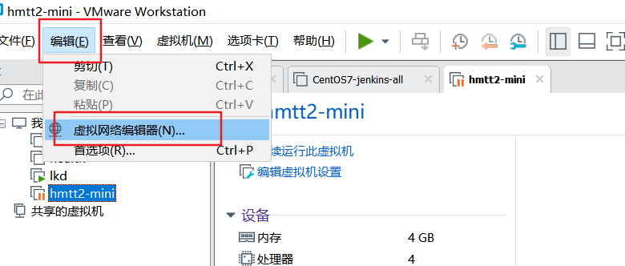
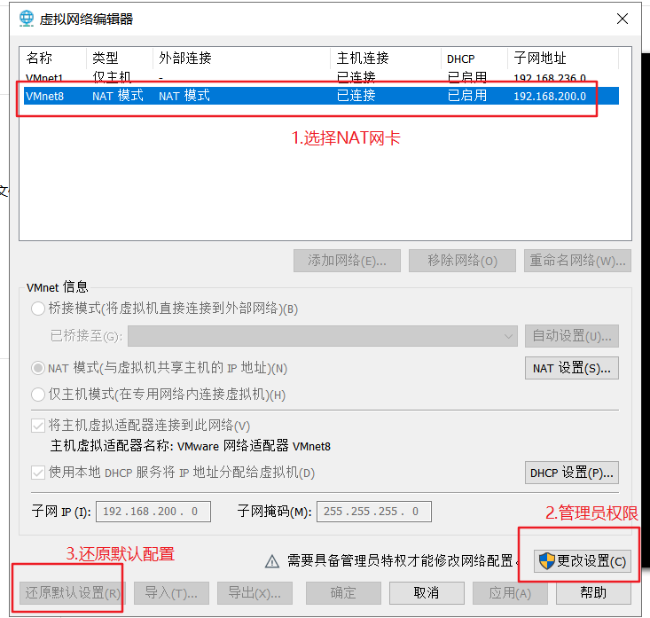
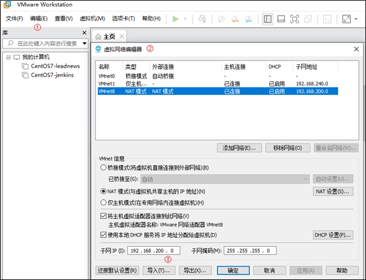

### 虚拟机使用说明

1)打开当天资料文件中的镜像，拷贝到一个地方，然后解压

2)导入VMware（双击CentOS7.vmx；如果打开无效，可以尝试使用扫描虚拟机的功能）

3)重置网络

```asciiarmor
1.选中VMware中的编辑
2.选择虚拟网络编辑器
```




```asciiarmor
3.为了避免之前的虚拟机配置影响，需要重置网络。选择NAT网卡，获取管理员权限，还原默认配置。
```

 

4）修改虚拟网络地址（NAT）

```asciiarmor
1、把除了NAT模式，其他的网络配置都删掉【重要】
2、找到NAT网卡，把网段改为200（当前挂载的虚拟机已固定ip地址）
```

                       

修改虚拟机的网络模式为NAT

 

5)启动虚拟机

```json
#虚拟机的ip已手动固定（静态IP）, 地址为：192.168.200.130
#用户名：root  密码：itcast
```

6)使用SecureCRT或FinalShell客户端链接

 

 