---
typora-copy-images-to:assets
---

# day02-文章列表&详情页静态化

## 0.今日菜单

1. 文章列表加载
2. **模板引擎FreeMarker（重点）**
3. 分布式文件系统MinIO
4. **文章详情（重点）**

## 1. 文章列表加载【重点】

### 1)需求分析

文章布局展示


### 2)表结构分析

leadnews_article数据库概览：

由于文章表的字段比较多，因此使用三张表来记录：ap_article，ap_article_config，ap_article_content 

> 分表方案主要有两种：
>
> 垂直分表：把一张表中的不同字段拆分放到多张表中
>
> - 把不常用的字段单独放在一张表
> - 把text，blob等大字段拆分出来单独放在一张表
> - 经常组合查询的字段单独放在一张表中
>
> 水平分表：根据ID将数据存储到不到的表中（ap_article1（id为奇数的）, ap_article2（id为偶数的））

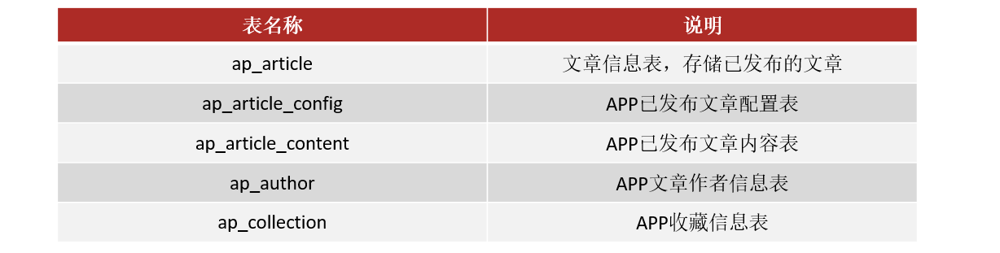 

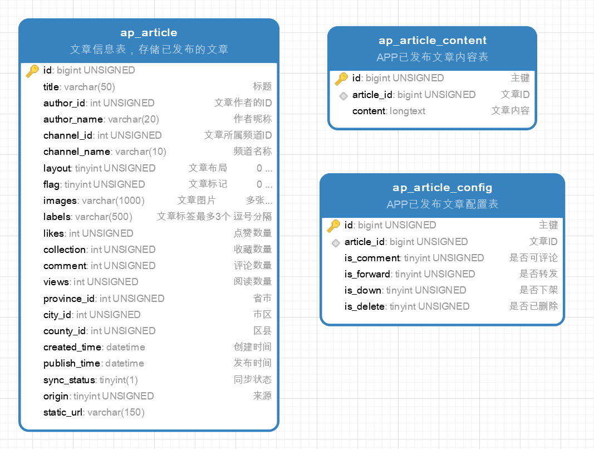 

三张表关系分析


**文章表的垂直拆分**

垂直分表：将一个字段比较多的表中字段分散到多个表中，每个表存储其中一部分字段。

优势：

1. 减少IO争抢，减少锁表的几率，查看文章概述与文章详情互不影响

2. 充分发挥高频数据的操作效率，对文章概述数据操作的高效率不会被操作文章详情数据的低效率所拖累。


### 3)导入文章数据库

#### 3.1)导入数据库

查看当天资料文件夹，在数据库连接工具中执行leadnews_article.sql

#### 3.2)导入对应的实体类

ap_article文章表对应实体（从资料中复制）

```json
#企业开发中，可以使用MyBatis Plus的代码生成
```

```java
package com.heima.model.article.pojos;

/**
 * <p>
 * 文章信息表，存储已发布的文章
 * </p>
 *
 * @author itheima
 */

@Data
@TableName("ap_article")
public class ApArticle implements Serializable {

    @TableId(value = "id",type = IdType.ID_WORKER)
    private Long id;


    /**
     * 标题
     */
    private String title;

    /**
     * 作者id
     */
    @TableField("author_id")
    private Long authorId;

    /**
     * 作者名称
     */
    @TableField("author_name")
    private String authorName;

    /**
     * 频道id
     */
    @TableField("channel_id")
    private Integer channelId;

    /**
     * 频道名称
     */
    @TableField("channel_name")
    private String channelName;

    /**
     * 文章布局  0 无图文章   1 单图文章    2 多图文章
     */
    private Short layout;

    /**
     * 文章标记  0 普通文章   1 热点文章   2 置顶文章   3 精品文章   4 大V 文章
     */
    private Byte flag;

    /**
     * 文章封面图片 多张逗号分隔
     */
    private String images;

    /**
     * 标签
     */
    private String labels;

    /**
     * 点赞数量
     */
    private Integer likes;

    /**
     * 收藏数量
     */
    private Integer collection;

    /**
     * 评论数量
     */
    private Integer comment;

    /**
     * 阅读数量
     */
    private Integer views;

    /**
     * 省市
     */
    @TableField("province_id")
    private Integer provinceId;

    /**
     * 市区
     */
    @TableField("city_id")
    private Integer cityId;

    /**
     * 区县
     */
    @TableField("county_id")
    private Integer countyId;

    /**
     * 创建时间
     */
    @TableField("created_time")
    private Date createdTime;

    /**
     * 发布时间
     */
    @TableField("publish_time")
    private Date publishTime;

    /**
     * 同步状态
     */
    @TableField("sync_status")
    private Boolean syncStatus;

    /**
     * 来源
     */
    private Boolean origin;

    /**
     * 静态页面地址
     */
    @TableField("static_url")
    private String staticUrl;
}
```

ap_article_config文章配置对应实体类

```java
package com.heima.model.article.pojos;

/**
 * <p>
 * APP已发布文章配置表
 * </p>
 *
 * @author itheima
 */

@Data
@TableName("ap_article_config")
public class ApArticleConfig implements Serializable {

    @TableId(value = "id",type = IdType.ID_WORKER)
    private Long id;

    /**
     * 文章id
     */
    @TableField("article_id")
    private Long articleId;

    /**
     * 是否可评论
     * true: 可以评论   1
     * false: 不可评论  0
     */
    @TableField("is_comment")
    private Boolean isComment;

    /**
     * 是否转发
     * true: 可以转发   1
     * false: 不可转发  0
     */
    @TableField("is_forward")
    private Boolean isForward;

    /**
     * 是否下架
     * true: 下架   1
     * false: 没有下架  0
     */
    @TableField("is_down")
    private Boolean isDown;

    /**
     * 是否已删除
     * true: 删除   1
     * false: 没有删除  0
     */
    @TableField("is_delete")
    private Boolean isDelete;
}
```

ap_article_content 文章内容对应的实体类

```java
package com.heima.model.article.pojos;

@Data
@TableName("ap_article_content")
public class ApArticleContent implements Serializable {

    @TableId(value = "id",type = IdType.ID_WORKER)
    private Long id;

    /**
     * 文章id
     */
    @TableField("article_id")
    private Long articleId;

    /**
     * 文章内容
     */
    private String content;
}
```

### 4)实现思路


1,在默认频道展示10条文章信息

```sql
SELECT
	aa.title, aa.publish_time
FROM
	ap_article aa 
ORDER BY
	aa.publish_time DESC 
	LIMIT 10;
```

2,可以指定频道ID查看不同种类文章

```sql
SELECT
	aa.title, aa.publish_time 
FROM
	ap_article aa 
WHERE
	aa.channel_id = 1 
ORDER BY
	aa.publish_time DESC 
	LIMIT 10;
```

3,当用户**下拉**可以加载最新的文章（上一页）：以本页文章列表中第一条数据的发表时间为依据

查看最新发表的文章 == **上一页**

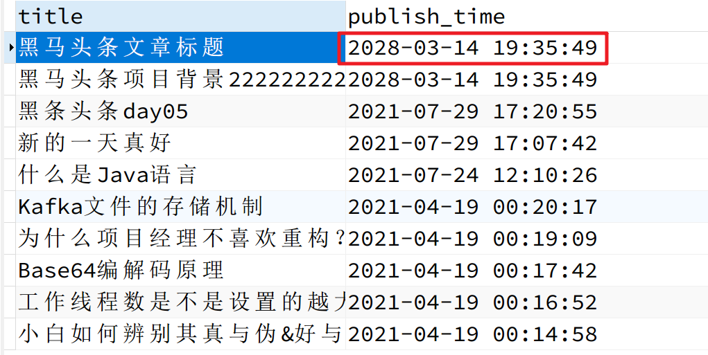 

```sql
WHERE aa.publish_time > '2028-03-14 19:35:49'
```

4,当用户**上拉**可以加载更多的文章信息（按照发布时间）本页文章列表中发布时间最小的时间为依据

查看更早的文章 == **下一页功能**

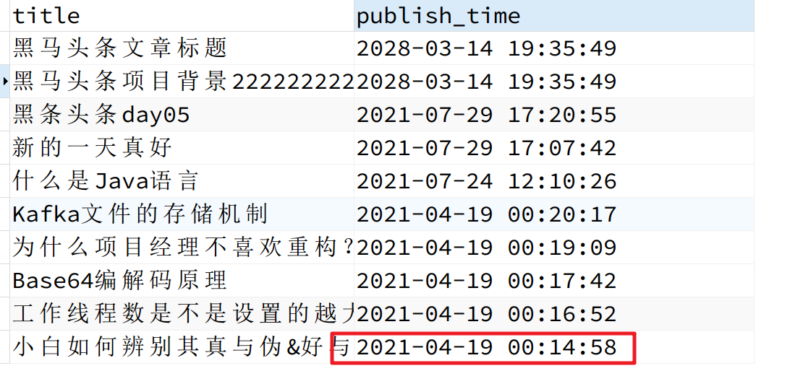 

```sql
WHERE aa.publish_time < '2021-04-19 00:14:58'
```

5，过滤删除和下架文章

```sql
SELECT
	* 
FROM
	ap_article aa
	LEFT JOIN ap_article_config aac ON aa.id = aac.article_id 
WHERE
	aa.channel_id = 1 
	-- 过滤掉下架的
	AND aac.is_down = 0
	-- 过滤掉删除的
	AND aac.is_delete = 0
ORDER BY
	aa.publish_time DESC 
	LIMIT 10;
```

  

### 5)接口定义

https://console-docs.apipost.cn/preview/edaf45651478f649/15bff00cbc0abfac?target_id=698ad425-ed33-419d-bd53-3bec1a9c1588

|          | **加载首页**         | **加载更多(下一页)**     | **加载最新(上一页)**    |
| -------- | -------------------- | ------------------------ | ----------------------- |
| 接口路径 | /api/v1/article/load | /api/v1/article/loadmore | /api/v1/article/loadnew |
| 请求方式 | POST                 | POST                     | POST                    |
| 参数     | ArticleHomeDto       | ArticleHomeDto           | ArticleHomeDto          |
| 响应结果 | ResponseResult       | ResponseResult           | ResponseResult          |

在heima-leadnews-model中封装请求参数：ArticleHomeDto

```java
package com.heima.model.article.dtos;

@Data
public class ArticleHomeDto {

    // 最大时间：上一页
    Date maxBehotTime;
    // 最小时间: 下一页
    Date minBehotTime;
    // 分页size
    Integer size;
    // 频道ID: 所有(--all--)
    String tag;
}
```

### 6)功能实现

分为如下6步来实现：

#### 6.1)：导入文章微服务

1. 解压资料中的heima-leadnews-article.zip到heima-leadnews\heima-leadnews-service目录下

 

2. 注意：需要在heima-leadnews-service的pom文件夹中添加子模块信息，如下：

```xml
<modules>
    <module>heima-leadnews-user</module>
    <!-- 添加 -->
    <module>heima-leadnews-article</module>
</modules>
```

在idea中的maven中更新一下，如果工程还是灰色的，需要在重新添加文章微服务的pom文件，操作步骤如下：


3. 需要在nacos中添加对应的配置，Data ID: leadnews-article

   ```yml
   spring:
     datasource:
       driver-class-name: com.mysql.jdbc.Driver
       url: jdbc:mysql://localhost:3306/leadnews_article?useUnicode=true&useSSL=false&characterEncoding=UTF-8&serverTimezone=UTC
       username: root
       password: root
   # 设置Mapper接口所对应的XML文件位置，如果你在Mapper接口中有自定义方法，需要进行该配置
   mybatis-plus:
     mapper-locations: classpath*:mapper/*.xml
     # 设置别名包扫描路径，通过该属性可以给包中的类注册别名
     type-aliases-package: com.heima.model.article.pojos
   ```

   

#### 6.2)：定义表现层接口

ArticleHomeController

```java
package com.heima.article.controller.v1;

@RestController
@RequestMapping("/api/v1/article")
public class ArticleHomeController {

    /**
     * 加载首页
     */
    @PostMapping("/load")
    public ResponseResult load(@RequestBody ArticleHomeDto dto) {
        return null;
    }

    /**
     * 加载更多
     */
    @PostMapping("/loadmore")
    public ResponseResult loadMore(@RequestBody ArticleHomeDto dto) {
        return null;
    }

    /**
     * 加载更新
     */
    @PostMapping("/loadnew")
    public ResponseResult loadNew(@RequestBody ArticleHomeDto dto) {
        return null;
    }
}
```

#### 6.3)：编写mapper文件

```java
package com.heima.article.mapper;

import org.apache.ibatis.annotations.Param;

//@Mapper
public interface ApArticleMapper extends BaseMapper<ApArticle> {

    /**
     * 根据参数加载文章列表
     * @param type 1为加载更多  2为加载最新
     */
    public List<ApArticle> loadArticleList(@Param("dto") ArticleHomeDto dto, @Param("type") Short type);

}
```

```json
#MyBatis Plus: 简化单表的数据库数据
#多表查询：直接使用MyBatis，自己编写SQL来完成
```

对应的映射文件，在resources中新建mapper/ApArticleMapper.xml，如下配置：

```xml
<?xml version="1.0" encoding="UTF-8"?>
<!DOCTYPE mapper PUBLIC "-//mybatis.org//DTD Mapper 3.0//EN" "http://mybatis.org/dtd/mybatis-3-mapper.dtd">
<mapper namespace="com.heima.article.mapper.ApArticleMapper">

    <select id="loadArticleList" resultType="apArticle">
        SELECT
        aa.*
        FROM
        `ap_article` aa
        LEFT JOIN ap_article_config aac ON aa.id = aac.article_id
        <where>
            and aac.is_delete != 1
            and aac.is_down != 1
            <!-- loadmore:下一页 -->
            <if test="type != null and type == 1">
                <!--转义，在xml中，大于小于号是有特殊作用,&lt;  &gt;可以进行转义-->
                and aa.publish_time <![CDATA[<]]> #{dto.minBehotTime}
                <!--AND aa.publish_time &lt; #{dto.minBehotTime}-->
            </if>
            <!-- loadnew:上一页 -->
            <if test="type != null and type == 2">
                and aa.publish_time <![CDATA[>]]> #{dto.maxBehotTime}
                <!--AND aa.publish_time &gt; #{dto.maxBehotTime}-->
            </if>
            <if test="dto.tag != '__all__'">
                and aa.channel_id = #{dto.tag}
            </if>
        </where>
        order by aa.publish_time desc
        limit #{dto.size}
    </select>

</mapper>
```

```asciiarmor
idea控制台报错：mybatis invalid bound statement 
原因：通过接口无法找到sql语句，查看xml映射文件中的namespace和方法名
```


#### 6.4)：编写业务层代码

heima-leadnews-article

```java
package com.heima.article.service;

public interface ApArticleService extends IService<ApArticle> {

    /**
     * 根据参数加载文章列表
     * @param loadtype 1为加载更多  2为加载最新
     * @param dto
     * @return
     */
    ResponseResult load(Short loadtype, ArticleHomeDto dto);

}
```

heima-leadnews-common将不同加载类型定义成产量：

```java
package com.heima.common.constants;

public class ArticleConstants {
    public static final Short LOADTYPE_LOAD_MORE = 1; //1为加载更多 
    public static final Short LOADTYPE_LOAD_NEW = 2; //2为加载最新
    public static final String DEFAULT_TAG = "__all__"; //all为所有

}
```

实现类：

```java
package com.heima.article.service.impl;

@Service
@Slf4j
public class ApArticleServiceImpl extends ServiceImpl<ApArticleMapper,ApArticle> implements ApArticleService {

    @Autowired
    private ApArticleMapper apArticleMapper;

    /**
     * 根据参数加载文章列表
     * @param loadtype 1为加载更多  2为加载最新
     */
    @Override
    public ResponseResult load(Short loadtype, ArticleHomeDto dto) {

        //1.校验分页参数
        if(dto.getSize() == null || dto.getSize() <= 0 || dto.getSize() > 50){
            dto.setSize(10);
        }

        //文章频道校验
        if(StringUtils.isBlank(dto.getTag())){
            dto.setTag(ArticleConstants.DEFAULT_TAG);
        }
        
        //时间校验
        if (dto.getMaxBehotTime() == null) {
            dto.setMaxBehotTime(new Date());
        }
        if (dto.getMinBehotTime() == null) {
            dto.setMinBehotTime(new Date());
        }

        //2.查询数据
        List<ApArticle> apArticles = apArticleMapper.loadArticleList(dto, loadtype);
        return ResponseResult.okResult(apArticles);
    }
    
}
```


#### 6.5)：完善控制器代码

```java
package com.heima.article.controller.v1;

@RestController
@RequestMapping("/api/v1/article")
public class ArticleHomeController {


    @Autowired
    private ApArticleService apArticleService;

    @PostMapping("/load") //首页默认查询，前端会传递一个2603年的日期：小于这个未来日期就行
    public ResponseResult load(@RequestBody ArticleHomeDto dto) {
        return apArticleService.load(ArticleConstants.LOADTYPE_LOAD_MORE,dto);
    }

    @PostMapping("/loadmore")//下一页
    public ResponseResult loadMore(@RequestBody ArticleHomeDto dto) {
        return apArticleService.load(ArticleConstants.LOADTYPE_LOAD_MORE,dto);
    }

    @PostMapping("/loadnew")//上一页
    public ResponseResult loadNew(@RequestBody ArticleHomeDto dto) {
        return apArticleService.load(ArticleConstants.LOADTYPE_LOAD_NEW,dto);
    }
}
```

#### 6.6)：前后端联调测试

第一：在app网关的微服务的nacos的配置中心添加文章微服务的路由：

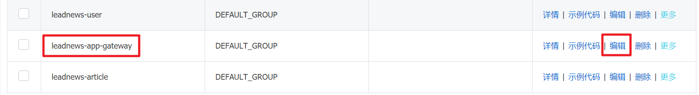

```yaml
        # 文章微服务
        - id: leadnews-article
          uri: lb://leadnews-article
          predicates:
            - Path=/article/**
          filters:
            - StripPrefix= 1
```

第二：启动nginx，直接使用前端项目测试，**启动文章微服务+用户微服务+app网关微服务**

```json
#保证3个服务全部启动成功
```

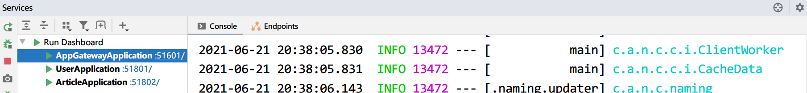

使用调试模式（手机）：http://localhost:8801/#/home

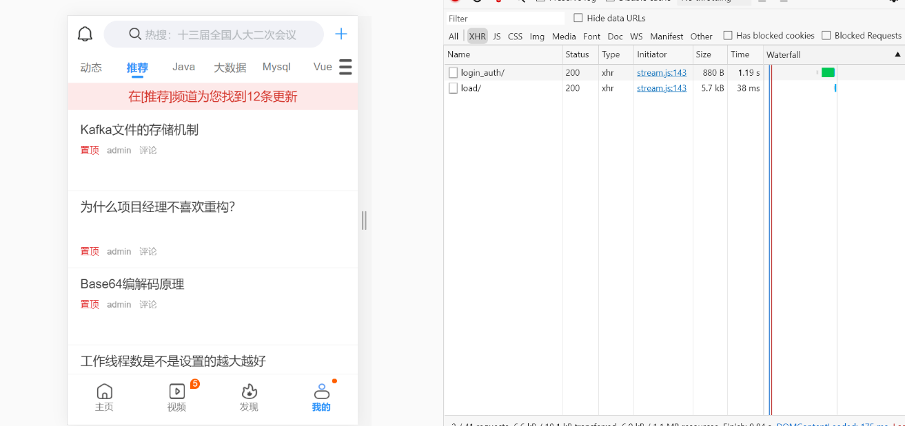

>
>提示：前端页面往上拉可能没有发请求，前端页面组件问题，用POSTMAN测试
>
>```json
>POST: http://localhost:51802/api/v1/article/loadmore
>参数：{"tag": "__all__", "size": 10, "minBehotTime": 1634281505000}
>```
>
>毫秒和日期转换工具：https://www.toolscat.com/convert/timestamp


## 2.文章详情Freemaker【重点】

### 2.0) 需求分析


**实现方案**

方案一

用户某一条文章，根据文章的id去查询文章内容表，返回渲染页面


方案二


### 2.1) freemarker 介绍

​	FreeMarker 是一款 模板引擎： 即一种基于模板和要改变的数据， 并用来生成输出文本(HTML网页，电子邮件，配置文件，源代码等)的通用工具。 它不是面向最终用户的，而是一个Java类库，是一款程序员可以嵌入他们所开发产品的组件。

​	模板编写为FreeMarker Template Language (FTL)。它是简单的，专用的语言， *不是* 像PHP那样成熟的编程语言。 那就意味着要准备数据在真实编程语言中来显示，比如数据库查询和业务运算， 之后模板显示已经准备好的数据。在模板中，你可以专注于如何展现数据， 而在模板之外可以专注于要展示什么数据。 


常用的java模板引擎还有哪些？

Jsp、Freemarker、Thymeleaf 、Velocity 等。

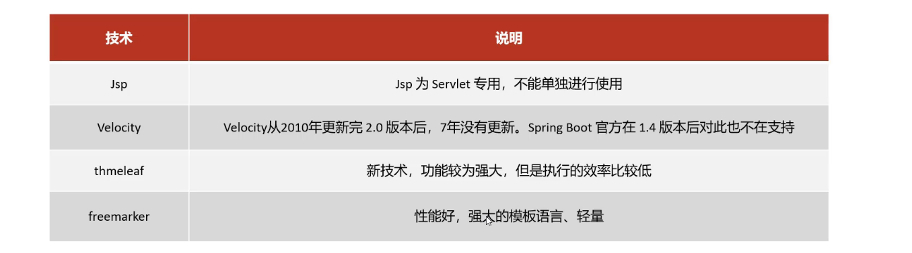


### 2.2) 环境搭建&&快速入门

freemarker作为springmvc一种视图格式，默认情况下SpringMVC支持freemarker视图格式。

需要创建Spring Boot+Freemarker工程用于测试模板。

#### 2.2.1) 创建测试工程

在heima-leadnews-test工程下创建一个freemarker-demo：专门用于freemarker的功能测试与模板的测试。

```xml
<properties>
    <maven.compiler.source>8</maven.compiler.source>
    <maven.compiler.target>8</maven.compiler.target>
</properties>

<dependencies>
    <dependency>
        <groupId>org.springframework.boot</groupId>
        <artifactId>spring-boot-starter-web</artifactId>
    </dependency>
    <dependency>
        <groupId>org.springframework.boot</groupId>
        <artifactId>spring-boot-starter-freemarker</artifactId>
    </dependency>

    <dependency>
        <groupId>org.springframework.boot</groupId>
        <artifactId>spring-boot-starter-test</artifactId>
    </dependency>
    <!-- lombok -->
    <dependency>
        <groupId>org.projectlombok</groupId>
        <artifactId>lombok</artifactId>
    </dependency>

    <!-- apache 对 java io 的封装工具库 -->
    <dependency>
        <groupId>commons-io</groupId>
        <artifactId>commons-io</artifactId>
    </dependency>
</dependencies>
```
#### 2.2.2) 配置文件

application.yml

```yml
server:
  port: 8881 #服务端口
spring:
  application:
    name: freemarker-demo #指定服务名
  freemarker:
    cache: false  #关闭模板缓存，方便测试
    settings:
      template_update_delay: 0  #检查模板更新延迟时间，设置为0表示立即检查，如果时间大于0会有缓存不方便进行模板测试
    suffix: .ftl #指定Freemarker模板文件的后缀名
    #template-loader-path: classpath:/templates   #模板存放位置
```


#### 2.2.3) 创建模型类

在freemarker的测试工程下创建模型类型用于测试

```java
package com.heima.freemarker.entity;

import lombok.Data;

import java.util.Date;

@Data
public class Student {
    private String name;//姓名
    private int age;//年龄
    private Date birthday;//生日
    private Float money;//钱包
}
```


#### 2.2.4) 创建模板

1、在resources下创建templates，此目录为freemarker的默认模板存放目录。

2、在templates下创建模板文件 01-basic.ftl ，模板中的插值表达式最终会被freemarker替换成具体的数据。

```html
<!DOCTYPE html>
<html>
<head>
    <meta charset="utf-8">
    <title>Hello World!</title>
</head>
<body>
<b>普通文本 String 展示：</b><br><br>
Hello ${name} <br>
<hr>
<b>对象Student中的数据展示：</b><br/>
姓名：${stu.name}<br/>
年龄：${stu.age}
<hr>
</body>
</html>
```

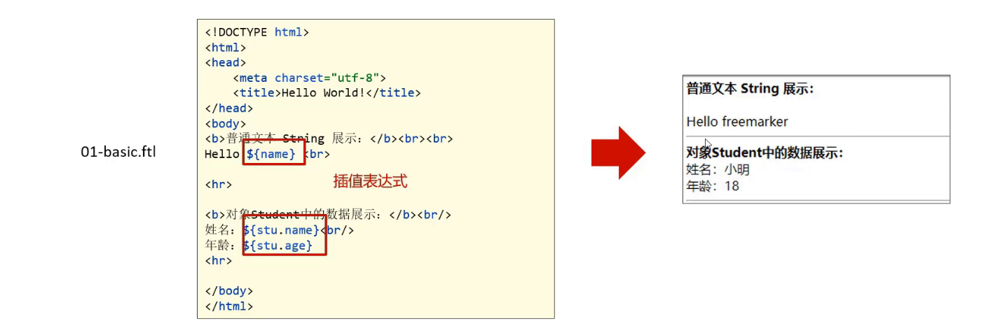

#### 2.2.5) 创建controller

创建Controller类，向Map中添加name，最后返回模板文件。

```java
package com.heima.freemarker.controlller;

import org.springframework.beans.factory.annotation.Autowired;
import org.springframework.stereotype.Controller;
import org.springframework.web.bind.annotation.RequestMapping;
import org.springframework.web.client.RestTemplate;

import java.util.Map;

@Controller //返回的数据不是JSON格式，所以不能写RestController
public class HelloController {

    @GetMapping("/basic")
    public String test(Model model) {

        //1.纯文本形式的参数
        model.addAttribute("name", "freemarker");
        //2.实体类相关的参数
        
        Student student = new Student();
        student.setName("小明");
        student.setAge(18);
        
        //Student student = studentService.getById(id);
        
        model.addAttribute("stu", student);

        return "01-basic";
    }
}
```

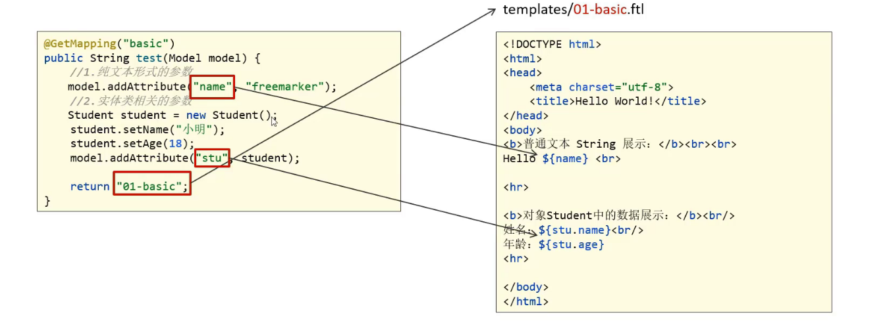

#### 2.2.6) 创建启动类

```java
package com.heima.freemarker;

import org.springframework.boot.SpringApplication;
import org.springframework.boot.autoconfigure.SpringBootApplication;

@SpringBootApplication
public class FreemarkerDemotApplication {
    public static void main(String[] args) {
        SpringApplication.run(FreemarkerDemotApplication.class,args);
    }
}
```

#### 2.2.7) 测试

请求：http://localhost:8881/basic


### 2.3) freemarker基础

#### 2.3.1) 基础语法种类

  1、注释，即<#--  -->，介于其之间的内容会被freemarker忽略：

```velocity
<#--我是一个freemarker注释，只有开发人员能看到-->
```

  2、文本，仅文本信息，这些不是freemarker的注释、插值、FTL指令的内容会被freemarker忽略解析，直接输出内容。

```velocity
<!--看到你了哦，任何人都可以看到-->
```

3、插值（Interpolation）：即 **`${..}`** 部分,freemarker会用真实的值代替**`${..}`**

```velocity
Hello ${name}
```

  3、FTL指令：和HTML标记类似，名字前加#予以区分，Freemarker会解析标签中的表达式或逻辑。

```jsp
<# >FTL指令</#> 
```

#### 2.3.2) 集合指令(List和Map)

1、数据模型：

在HelloController中新增如下方法：

```java
@GetMapping("/list")
public String list(Model model){

    //------------------------------------
    Student stu1 = new Student();
    stu1.setName("小强");
    stu1.setAge(18);
    stu1.setMoney(1000.86f);
    stu1.setBirthday(new Date());

    //小红对象模型数据
    Student stu2 = new Student();
    stu2.setName("小红");
    stu2.setMoney(200.1f);
    stu2.setAge(19);

    //将两个对象模型数据存放到List集合中
    List<Student> stus = new ArrayList<>();
    stus.add(stu1);
    stus.add(stu2);

    //向model中存放List集合数据
    model.addAttribute("stus",stus);

    //------------------------------------

    //创建Map数据
    HashMap<String,Student> stuMap = new HashMap<>();
    stuMap.put("stu1",stu1);
    stuMap.put("stu2",stu2);
    // 3.1 向model中存放Map数据
    model.addAttribute("stuMap", stuMap);

    return "02-list";
}
```

2、模板：

在templates中新增`02-list.ftl`文件

```html
<!DOCTYPE html>
<html>
<head>
    <meta charset="utf-8">
    <title>Hello World!</title>
</head>
<body>
    
<#-- list 数据的展示 -->
<b>展示list中的stu数据:</b>
<br>
<br>
<table>
    <tr>
        <td>序号</td>
        <td>姓名</td>
        <td>年龄</td>
        <td>钱包</td>
    </tr>
</table>
<hr>
    
<#-- Map 数据的展示 -->
<b>map数据的展示：</b>
<br/><br/>
<a href="###">方式一：通过map['keyname'].property</a><br/>
输出stu1的学生信息：<br/>
姓名：<br/>
年龄：<br/>
<br/>
<a href="###">方式二：通过map.keyname.property</a><br/>
输出stu2的学生信息：<br/>
姓名：<br/>
年龄：<br/>

<br/>
<a href="###">遍历map中两个学生信息：</a><br/>
<table>
    <tr>
        <td>序号</td>
        <td>姓名</td>
        <td>年龄</td>
        <td>钱包</td> 
    </tr>
</table>
<hr>
 
</body>
</html>
```

**List指令格式：**

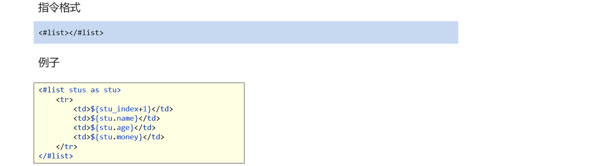

````json
# ${k_index}：得到循环的下标，使用方法是在stu后边加"_index"，它的值是从0开始
````

```velocity
<#list stus as stu>
    <tr>
        <td>${stu_index+1}</td>
        <td>${stu.name}</td>
        <td>${stu.age}</td>
        <td>${stu.money}</td>
    </tr>
</#list>
```
**Map指令格式：**

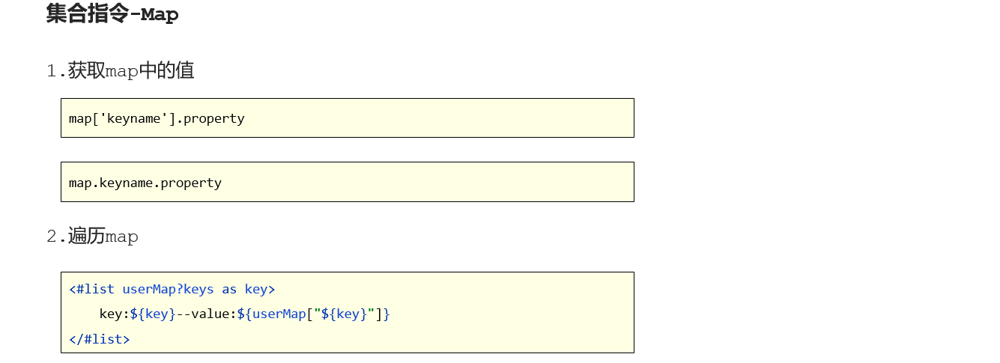

实例代码：

```html
<#-- Map 数据的展示 -->
<b>map数据的展示：</b>
<br/><br/>
<a href="###">方式一：通过map['keyname'].property</a><br/>
输出stu1的学生信息：<br/>
姓名：${stuMap['stu1'].name}<br/>
年龄：${stuMap['stu1'].age}<br/>
<br/>
<a href="###">方式二：通过map.keyname.property</a><br/>
输出stu2的学生信息：<br/>
姓名：${stuMap.stu2.name}<br/>
年龄：${stuMap.stu2.age}<br/>

<br/>
<a href="###">遍历map中两个学生信息：</a><br/>
<table>
    <tr>
        <td>序号</td>
        <td>姓名</td>
        <td>年龄</td>
        <td>钱包</td>
    </tr>
    <#list stuMap?keys as key >
        <tr>
            <td>${key_index + 1}</td>
            <td>${stuMap[key].name}</td>
            <td>${stuMap[key].age}</td>
            <td>${stuMap[key].money}</td>
        </tr>
    </#list>
</table>
```


#### 2.3.3) if指令

if 指令即判断指令，是常用的FTL指令，freemarker在解析时遇到if会进行判断，条件为真则输出if中间的内容，否则跳过内容不输出。

```html
<#if name='wangwu'>

<#elseif name='zhangsan'>

<#elseif name='lisi'>

<#else>
```

1、数据模型：

使用list指令中测试数据模型，判断名称为小红的数据字体显示为红色。

2、模板：

````json
#在freemarker中，判断是否相等：=与==是一样的
````

```html
<table>
    <tr>
        <td>姓名</td>
        <td>年龄</td>
        <td>钱包</td>
    </tr>
    <#list stus as stu >
        <#if stu.name == "小红">
            <tr style="color: red">
                <td>${stu_index}</td>
                <td>${stu.name}</td>
                <td>${stu.age}</td>
                <td>${stu.money}</td>
            </tr>
         <#else >
            <tr>
                <td>${stu_index}</td>
                <td>${stu.name}</td>
                <td>${stu.age}</td>
                <td>${stu.money}</td>
            </tr>
        </#if>
    </#list>
</table>
```

3、输出：

姓名为“小强”则字体颜色显示为红色。


#### 2.3.4)  运算符

**1、算数运算符**

FreeMarker表达式中完全支持算术运算,FreeMarker支持的算术运算符包括:

- 加法： `+`
- 减法： `-`
- 乘法： `*`
- 除法： `/`
- 求模 (求余)： `%`

模板代码

```html
<b>算数运算符</b>
<br/><br/>
    100+5 运算：  ${100 + 5 }<br/>
    100 - 5 * 5运算：${100 - 5 * 5}<br/>
    5 / 2运算：${5 / 2}<br/>
    12 % 10运算：${12 % 10}<br/>
<hr>
```

除了 + 运算以外，其他的运算只能和 number 数字类型的计算。


**2、比较运算符**

```
gt>: greater than
lt<: less than
gte>=: greater than or equal
```

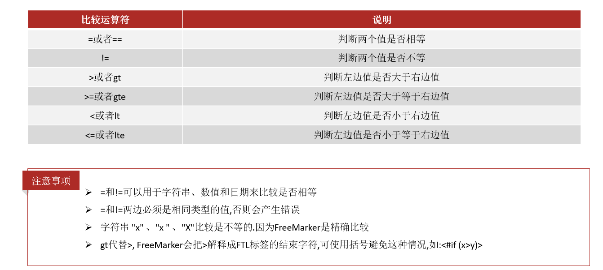

创建03-operation.ftl

```html
<!DOCTYPE html>
<html>
<head>
    <meta charset="utf-8">
    <title>Hello World!</title>
</head>
<body>

    <b>比较运算符</b>
    <br/>
    <br/>

    <dl>
        <dt> =/== 和 != 比较：</dt>
        <dd>
            <#if "xiaoming" == "xiaoming">
                字符串的比较 "xiaoming" == "xiaoming"
            </#if>
        </dd>
        <dd>
            <#if 10 != 100>
                数值的比较 10 != 100
            </#if>
        </dd>
    </dl>

    <dl>
        <dt>其他比较</dt>
        <dd>
            <#if 10 gt 5 >
                形式一：使用特殊字符比较数值 10 gt 5
            </#if>
        </dd>
    </dl>

    <br/>
<hr>
</body>
</html>
```

Controller 的 数据模型代码

```java
@GetMapping("operation")
public String testOperation(Model model) {
    
    return "03-operation";
}
```


**3、逻辑运算符**

- 逻辑与:&& 
- 逻辑或:|| 
- 逻辑非:! 

逻辑运算符只能作用于布尔值,否则将产生错误 。

模板代码

```html
<b>逻辑运算符</b>
    <br/>
    <br/>
    <#if (10 lt 12 )&&( 10  gt  5 )  >
        (10 lt 12 )&&( 10  gt  5 )  显示为 true
    </#if>
    <br/>
    <br/>
    <#if !false>
        false 取反为true
    </#if>
<hr>
```


#### 2.3.5) 空值处理

**1、判断某变量是否存在使用 “??”**

用法为:variable??,如果该变量存在,返回true,否则返回false 

例：为防止stus为空报错可以加上判断如下：

```html
<#if stus??>
    <#list stus as stu>
        遍历list
    </#list>
</#if>
```


**2、缺失变量默认值使用 “!”**

- 使用!要以指定一个默认值，当变量为空时显示默认值

  例：  ${name!}表示如果name为空显示空字符串，也可以自定义默认值：`${name!'老王'}`
  
- 如果是嵌套对象则建议使用（）括起来

  例： ${(stu.name)!''}表示，如果stu或name为空默认显示空字符串。


#### 2.3.6) 内建函数

内建函数语法格式： **`变量+?+函数名称`**  

**1、集合的大小**

**`${集合名?size}`**

```html
<b>获得集合大小</b><br>

集合大小：${stus?size}
<hr>
```
**2、日期格式化**

显示年月日: **`${today?date}`** 
显示时分秒：**`${today?time}`**   
显示日期+时间：**`${today?datetime}`**   
自定义格式化：  **`${today?string("yyyy年MM月")}`**

```java
@GetMapping("/operation")
public String testOperation(Model model) {
    model.addAttribute("today", new Date());
    return "03-operation";
}
```

```html
<b>获得日期</b><br>

显示年月日: ${today?date}<br>

显示时分秒：${today?time}<br>

显示日期+时间：${today?datetime}<br>

自定义格式化：  ${today?string("yyyy年MM月")}<br>

<hr>
```
**3、内建函数`c`**

model.addAttribute("point", 102920122);

```
102,920,122
```

point是数字型，使用${point}会显示这个数字的值，每三位使用逗号分隔。

如果不想显示为每三位分隔的数字，可以使用c函数将数字型转成字符串输出

**`${point?c}`**


**4、eval: 将json字符串转成对象**

一个例子：

其中用到了 assign标签，assign的作用是定义一个变量。

```html
<br />
<#assign text="{'bank':'工商银行','account':'10101920201920212'}" />
<#assign data=text?eval />
开户行：${data.bank}  账号：${data.account}
```


### 2.4) 静态化测试

之前的测试都是SpringMVC将Freemarker作为视图解析器（ViewReporter）来集成到项目中，工作中，有的时候需要使用Freemarker原生Api来生成静态内容，下面一起来学习下原生Api生成文本文件。

#### 2.4.1) 需求分析

使用freemarker原生Api将页面生成html文件，本节测试html文件生成的方法：


#### 2.4.2) 静态化测试 

根据模板文件生成html文件，在test目录下下创建测试类

```java
package com.heima.freemarker.test;

import com.heima.freemarker.FreemarkerDemotApplication;
import com.heima.freemarker.entity.Student;
import freemarker.template.Configuration;
import freemarker.template.Template;
import freemarker.template.TemplateException;
import org.junit.jupiter.api.Test;
import org.springframework.beans.factory.annotation.Autowired;
import org.springframework.boot.test.context.SpringBootTest;

import java.io.FileWriter;
import java.io.IOException;
import java.util.*;

@SpringBootTest(classes = FreemarkerDemoApplication.class)
public class FreemarkerTest {

    @Autowired
    //注意导包：import freemarker.template.Configuration;
    private Configuration configuration;

    @Test //注意导包：import org.junit.jupiter.api.Test;
    public void test() throws IOException, TemplateException {
        //freemarker的模板对象，获取模板
        Template template = configuration.getTemplate("02-list.ftl");
        Map params = getData();
        //合成
        //第一个参数 数据模型
        //第二个参数  输出流
        template.process(params, new FileWriter("list.html"));
    }

    private Map getData() {
        Map<String, Object> map = new HashMap<>();

        //小强对象模型数据
        Student stu1 = new Student();
        stu1.setName("小强");
        stu1.setAge(18);
        stu1.setMoney(1000.86f);
        stu1.setBirthday(new Date());

        //小红对象模型数据
        Student stu2 = new Student();
        stu2.setName("小红");
        stu2.setMoney(200.1f);
        stu2.setAge(19);

        //将两个对象模型数据存放到List集合中
        List<Student> stus = new ArrayList<>();
        stus.add(stu1);
        stus.add(stu2);

        //向map中存放List集合数据
        map.put("stus", stus);


        //创建Map数据
        HashMap<String, Student> stuMap = new HashMap<>();
        stuMap.put("stu1", stu1);
        stuMap.put("stu2", stu2);
        //向map中存放Map数据
        map.put("stuMap", stuMap);

        //返回Map
        return map;
    }
}
```


## 3.分布式文件系统MinIO

### 文件存储方式对比

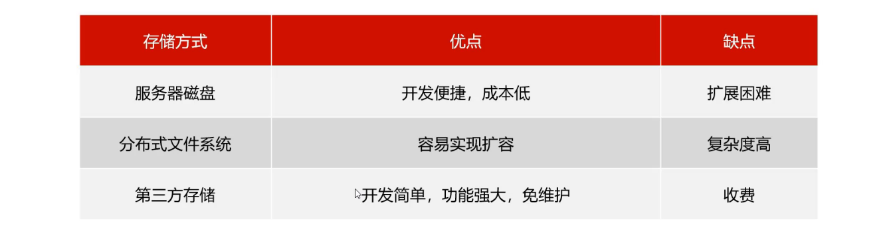 

### 常见的分布式文件系统

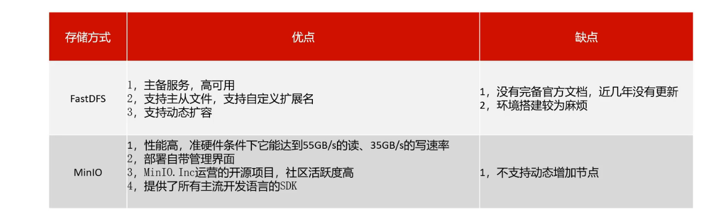 

### 3.1 MinIO简介   

MinIO基于Apache License v2.0开源协议的对象存储服务，可以做为云存储的解决方案用来保存海量的图片，视频，文档。

- 由于采用Golang实现，服务端可以工作在Windows,Linux, OS X和FreeBSD上。配置简单，基本是复制可执行程序，单行命令可以运行起来。
- MinIO兼容亚马逊S3（ Simple Storage Service简单存储服务）云存储服务接口，非常适合于存储大容量非结构化的数据，例如图片、视频、日志文件、备份数据和容器/虚拟机镜像等，而一个对象文件可以是任意大小，从几kb到最大5T不等。
- 官网文档：http://docs.minio.org.cn/docs/

### 3.2 MinIO特点 

- 数据保护

  Minio使用Minio Erasure Code（纠删码）来防止硬件故障。即便损坏一半以上的driver，但是仍然可以从中恢复。

- 高性能

  作为高性能对象存储，在标准硬件条件下它能达到55GB/s的读、35GB/s的写速率

- 可扩容

  不同MinIO集群可以组成联邦，并形成一个全局的命名空间，并跨越多个数据中心

- SDK支持

  基于Minio轻量的特点，它得到类似Java、Python或Go等语言的sdk支持

- 有操作页面

  面向用户友好的简单操作界面，非常方便的管理Bucket及里面的文件资源

- 功能简单

  这一设计原则让MinIO不容易出错、更快启动

- 丰富的API

  支持文件资源的分享连接及分享链接的过期策略、存储桶操作、文件列表访问及文件上传下载的基本功能等。

- 文件变化主动通知

  存储桶（Bucket）如果发生改变,比如上传对象和删除对象，可以使用存储桶事件通知机制进行监控，并通过以下方式发布出去:AMQP、MQTT、Elasticsearch、Redis、NATS、MySQL、Kafka、Webhooks等。


### 3.3 开箱使用 

#### 3.3.1 安装启动【已经安装】

```asciiarmor
虚拟机中已安装，下边操作浏览即可：
启动容器：docker start minio
```

方式一：通过压缩包导入镜像

```shell
# 上传minio.tar到虚拟机
docker load -i minio.tar
#检查是否导入成功
docker images

#多次创建容器，需要清理挂载的目录
#rm -rf /home/data /home/config

docker run -p 9000:9000 --name minio -d --restart=always -e "MINIO_ACCESS_KEY=minio" -e "MINIO_SECRET_KEY=minio123" -v /home/data:/data -v /home/config:/root/.minio minio/minio server /data
```

~~方式二：自行下载minio镜像~~

```json
#自行下载比较慢，建议使用上述方式导入
docker pull minio/minio:RELEASE.2021-04-18T19-26-29Z

#多次创建容器，需要清理挂载的目录
#rm -rf /home/data /home/config

docker run -p 9000:9000 --name minio2 -d --restart=always \
-e "MINIO_ROOT_USER=minio" -e "MINIO_ROOT_PASSWORD=minio123" \
-v /home/data:/data -v /home/config:/root/.minio \
minio/minio:RELEASE.2021-04-18T19-26-29Z server /data
```

#### 3.3.2 管理控制台   

我们在地址栏输入：http://192.168.200.130:9000/即可进入登录界面。


> Access Key为minio，Secret_key 为minio123

进入系统后可以看到主界面


**基本概念**

- bucket – 类比于文件系统的目录
- Object – 类比文件系统的文件，对象存储
- Keys – 类比文件名

**点击右下角的“+”号 ，点击下面的图标，创建一个桶：leadnews**


### 3.4 快速入门

#### 3.4.1 创建工程，导入依赖

在heima-leadnews-test下创建子模块minio-demo,对应pom如下

```xml
<properties>
    <maven.compiler.source>8</maven.compiler.source>
    <maven.compiler.target>8</maven.compiler.target>
</properties>

<dependencies>

    <dependency>
        <groupId>io.minio</groupId>
        <artifactId>minio</artifactId>
        <version>7.1.0</version>
    </dependency>
    <dependency>
        <groupId>org.springframework.boot</groupId>
        <artifactId>spring-boot-starter-web</artifactId>
    </dependency>

    <dependency>
        <groupId>org.springframework.boot</groupId>
        <artifactId>spring-boot-starter-test</artifactId>
    </dependency>
</dependencies>
```


#### 3.4.2 上传文件

SpringBoot引导类：

```java
package com.heima.minio;

import org.springframework.boot.SpringApplication;
import org.springframework.boot.autoconfigure.SpringBootApplication;


@SpringBootApplication
public class MinIOApplication {

    public static void main(String[] args) {
        SpringApplication.run(MinIOApplication.class,args);
    }
}
```

创建测试类，上传html文件

```java
package com.heima.minio.test;

import io.minio.MinioClient;
import io.minio.PutObjectArgs;

import java.io.FileInputStream;

public class MinIOTest {


    public static void main(String[] args) {

        FileInputStream fileInputStream = null;
        try {

            fileInputStream =  new FileInputStream("D:\\list.html");;

            //1.创建minio链接客户端
            MinioClient minioClient = MinioClient.builder()
                .credentials("minio", "minio123")
                .endpoint("http://192.168.200.130:9000")
                .build();
            //2.上传
            PutObjectArgs putObjectArgs = PutObjectArgs.builder()
                    .object("list.html")//文件名
                    .contentType("text/html")//文件类型
                    .bucket("leadnews")//确保已经创建了leadnews桶
                    .stream(fileInputStream, fileInputStream.available(), -1) //文件流
                    .build();
            minioClient.putObject(putObjectArgs);

            System.out.println("http://192.168.200.130:9000/leadnews/list.html");

            //上传一个文件，指定是文件路径
            UploadObjectArgs uploadObjectArgs = UploadObjectArgs.builder()
                    .object("nba.jpg")//指定上传之后文件名
                    .bucket("leadnews")
                    .filename("C:\\Users\\Yuan\\Pictures\\nba.jpg")
                    .build();
            minioClient.uploadObject(uploadObjectArgs);
        } catch (Exception ex) {
            ex.printStackTrace();
        }
    }

}
```

访问上传页面：http://192.168.200.130:9000/leadnews/list.html

````asciiarmor
1. 如果文件上传成功后不能访问，则需要设置bucket的访问权限
````

如果不能直接访问，添加读取权限：

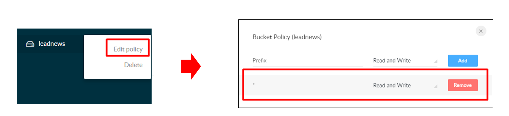

```asciiarmor
2. idea控制台报错：ErrorResponse(code = RequestTimeTooSkewed, message = The difference between the request time
解决方案修改服务器时间为当前时间：date -s "2022-06-23 17:02:00"
```


### 3.5 封装为starter【已提供】

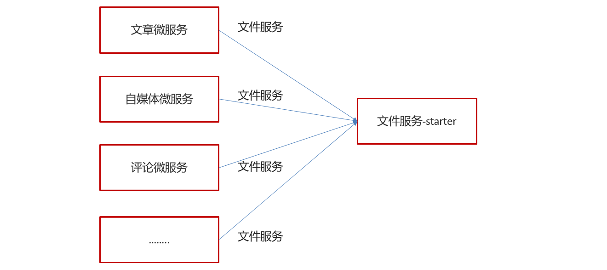

#### 3.5.1 导入basic模块

1.从资料中将heima-leadnews-basic.zip解压到父工程heima-leadnews下：

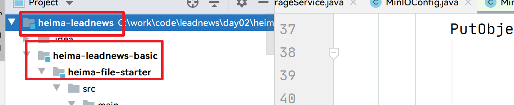 

2.将heima-leadnews-basic也交由父模块heima-leadnews管理：

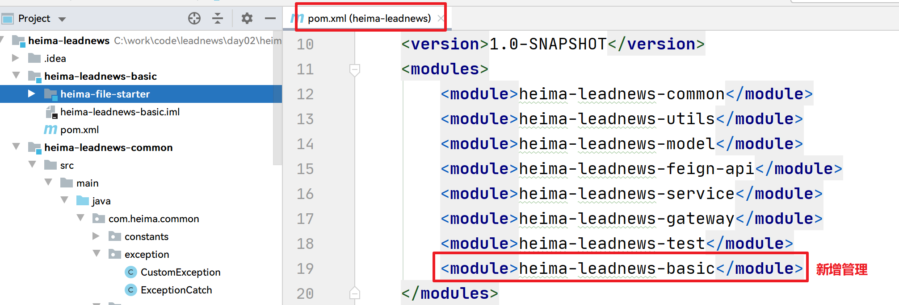

3.检查heima-file-starter依赖：

```xml
<dependencies>
    <dependency>
        <groupId>io.minio</groupId>
        <artifactId>minio</artifactId>
        <version>7.1.0</version>
    </dependency>
    <dependency>
        <groupId>org.springframework.boot</groupId>
        <artifactId>spring-boot-starter</artifactId>
    </dependency>
    
    <!-- 编写提示: minio.accessKey等自定义配置 -->
    <dependency>
        <groupId>org.springframework.boot</groupId>
        <artifactId>spring-boot-configuration-processor</artifactId>
        <optional>true</optional>
    </dependency>
</dependencies>
```

#### 3.5.2 配置类

MinIOConfigProperties: 服务器地址，端口，凭证等信息

```java
package com.heima.file.config;

import lombok.Data;
import org.springframework.boot.context.properties.ConfigurationProperties;

import java.io.Serializable;

@Data
@ConfigurationProperties(prefix = "minio")  // 文件上传 配置前缀file.oss
public class MinIOConfigProperties implements Serializable {

    private String accessKey; //minio.accessKey = minio
    private String secretKey;
    private String bucket;
    private String endpoint;
    private String readPath;
}
```

MinIOConfig：创建MinIO客户端

```java
package com.heima.file.config;

import com.heima.file.service.FileStorageService;
import io.minio.MinioClient;
import org.springframework.beans.factory.annotation.Autowired;
import org.springframework.boot.autoconfigure.condition.ConditionalOnClass;
import org.springframework.boot.context.properties.EnableConfigurationProperties;
import org.springframework.context.annotation.Bean;
import org.springframework.context.annotation.Configuration;


@EnableConfigurationProperties({MinIOConfigProperties.class})
public class MinIOConfig {

   @Autowired
   private MinIOConfigProperties minIOConfigProperties;

    @Bean
    public MinioClient buildMinioClient(){
        return MinioClient
                .builder()
                .credentials(minIOConfigProperties.getAccessKey(), minIOConfigProperties.getSecretKey())
                .endpoint(minIOConfigProperties.getEndpoint())
                .build();
    }
}
```

#### 3.5.3 封装操作minIO类

FileStorageService

```java
package com.heima.file.service;

import java.io.InputStream;

/**
 * @author itheima
 */
public interface FileStorageService {


    /**
     *  上传图片文件
     * @param prefix  文件前缀
     * @param filename  文件名
     * @param inputStream 文件流
     * @return  文件全路径
     */
    public String uploadImgFile(String prefix, String filename,InputStream inputStream);

    /**
     *  上传html文件
     * @param prefix  文件前缀
     * @param filename   文件名
     * @param inputStream  文件流
     * @return  文件全路径
     */
    public String uploadHtmlFile(String prefix, String filename,InputStream inputStream);

    /**
     * 删除文件
     * @param pathUrl  文件全路径
     */
    public void delete(String pathUrl);

    /**
     * 下载文件
     * @param pathUrl  文件全路径
     * @return
     *
     */
    public byte[]  downLoadFile(String pathUrl);

}
```

MinIOFileStorageService

```java
package com.heima.file.service.impl;


import com.heima.file.config.MinIOConfig;
import com.heima.file.config.MinIOConfigProperties;
import com.heima.file.service.FileStorageService;
import io.minio.GetObjectArgs;
import io.minio.MinioClient;
import io.minio.PutObjectArgs;
import io.minio.RemoveObjectArgs;
import lombok.extern.slf4j.Slf4j;
import org.springframework.beans.factory.annotation.Autowired;
import org.springframework.boot.context.properties.EnableConfigurationProperties;
import org.springframework.context.annotation.Import;
import org.springframework.util.StringUtils;

import java.io.ByteArrayOutputStream;
import java.io.IOException;
import java.io.InputStream;
import java.text.SimpleDateFormat;
import java.util.Date;

@Slf4j
@Import(MinIOConfig.class)
public class MinIOFileStorageService implements FileStorageService {

    @Autowired
    private MinioClient minioClient;

    @Autowired
    private MinIOConfigProperties minIOConfigProperties;

    private final static String separator = "/";

    /**
     * @param dirPath
     * @param filename  yyyy/mm/dd/file.jpg
     * @return
     */
    public String builderFilePath(String dirPath,String filename) {
        StringBuilder stringBuilder = new StringBuilder(50);
        if(!StringUtils.isEmpty(dirPath)){
            stringBuilder.append(dirPath).append(separator);
        }
        SimpleDateFormat sdf = new SimpleDateFormat("yyyy/MM/dd");
        String todayStr = sdf.format(new Date());
        stringBuilder.append(todayStr).append(separator);
        stringBuilder.append(filename);
        return stringBuilder.toString();
    }

    /**
     *  上传图片文件
     * @param prefix  文件前缀
     * @param filename  文件名
     * @param inputStream 文件流
     * @return  文件全路径
     */
    @Override
    public String uploadImgFile(String prefix, String filename,InputStream inputStream) {
        String filePath = builderFilePath(prefix, filename);
        try {
            PutObjectArgs putObjectArgs = PutObjectArgs.builder()
                    .object(filePath)
                    .contentType("image/jpg")
                    .bucket(minIOConfigProperties.getBucket()).stream(inputStream,inputStream.available(),-1)
                    .build();
            minioClient.putObject(putObjectArgs);
            StringBuilder urlPath = new StringBuilder(minIOConfigProperties.getReadPath());
            urlPath.append(separator+minIOConfigProperties.getBucket());
            urlPath.append(separator);
            urlPath.append(filePath);
            return urlPath.toString();
        }catch (Exception ex){
            log.error("minio put file error.",ex);
            throw new RuntimeException("上传文件失败");
        }
    }

    /**
     *  上传html文件
     * @param prefix  文件前缀
     * @param filename   文件名
     * @param inputStream  文件流
     * @return  文件全路径
     */
    @Override
    public String uploadHtmlFile(String prefix, String filename,InputStream inputStream) {
        String filePath = builderFilePath(prefix, filename);
        try {
            PutObjectArgs putObjectArgs = PutObjectArgs.builder()
                    .object(filePath)
                    .contentType("text/html")
                    .bucket(minIOConfigProperties.getBucket()).stream(inputStream,inputStream.available(),-1)
                    .build();
            minioClient.putObject(putObjectArgs);
            StringBuilder urlPath = new StringBuilder(minIOConfigProperties.getReadPath());
            urlPath.append(separator+minIOConfigProperties.getBucket());
            urlPath.append(separator);
            urlPath.append(filePath);
            return urlPath.toString();
        }catch (Exception ex){
            log.error("minio put file error.",ex);
            ex.printStackTrace();
            throw new RuntimeException("上传文件失败");
        }
    }

    /**
     * 删除文件
     * @param pathUrl  文件全路径
     */
    @Override
    public void delete(String pathUrl) {
        String key = pathUrl.replace(minIOConfigProperties.getEndpoint()+"/","");
        int index = key.indexOf(separator);
        String bucket = key.substring(0,index);
        String filePath = key.substring(index+1);
        // 删除Objects
        RemoveObjectArgs removeObjectArgs = RemoveObjectArgs.builder().bucket(bucket).object(filePath).build();
        try {
            minioClient.removeObject(removeObjectArgs);
        } catch (Exception e) {
            log.error("minio remove file error.  pathUrl:{}",pathUrl);
            e.printStackTrace();
        }
    }


    /**
     * 下载文件
     * @param pathUrl  文件全路径
     * @return  文件流
     *
     */
    @Override
    public byte[] downLoadFile(String pathUrl)  {
        String key = pathUrl.replace(minIOConfigProperties.getEndpoint()+"/","");
        int index = key.indexOf(separator);
        String bucket = key.substring(0,index);
        String filePath = key.substring(index+1);
        InputStream inputStream = null;
        try {
            inputStream = minioClient.getObject(GetObjectArgs.builder().bucket(minIOConfigProperties.getBucket()).object(filePath).build());
        } catch (Exception e) {
            log.error("minio down file error.  pathUrl:{}",pathUrl);
            e.printStackTrace();
        }

        ByteArrayOutputStream byteArrayOutputStream = new ByteArrayOutputStream();
        byte[] buff = new byte[100];
        int rc = 0;
        while (true) {
            try {
                if (!((rc = inputStream.read(buff, 0, 100)) > 0)) break;
            } catch (IOException e) {
                e.printStackTrace();
            }
            byteArrayOutputStream.write(buff, 0, rc);
        }
        return byteArrayOutputStream.toByteArray();
    }
}
```

#### 3.5.4 对外加入自动配置

在resources中新建`META-INF/spring.factories`

```properties
org.springframework.boot.autoconfigure.EnableAutoConfiguration=\
  com.heima.file.service.impl.MinIOFileStorageService
```


#### 3.5.5 其他微服务使用【理解】

第一，minio-demo模块中导入heima-file-starter的依赖

```xml
<dependency>
    <groupId>com.heima</groupId>
    <artifactId>heima-file-starter</artifactId>
    <version>1.0-SNAPSHOT</version>
</dependency>
```

第二，在微服务中添加minio所需要的配置：application.yml

```yaml
minio:
  accessKey: minio
  secretKey: minio123
  bucket: leadnews
  endpoint: http://192.168.200.130:9000
  readPath: http://192.168.200.130:9000
```

第三，在对应使用的业务类中注入FileStorageService，样例如下：

```java
package com.heima.minio.test;

import com.heima.file.service.FileStorageService;
import org.junit.jupiter.api.Test;
import org.springframework.beans.factory.annotation.Autowired;
import org.springframework.boot.test.context.SpringBootTest;

import java.io.FileInputStream;
import java.io.FileNotFoundException;

@SpringBootTest
public class MinioStarterTest {

    @Autowired
    private FileStorageService fileStorageService;

    @Test //注意导包：import org.junit.jupiter.api.Test;
    public void testUpdateImgFile() {
        try {
            FileInputStream fileInputStream = new FileInputStream("E:\\tmp\\ak47.jpg");
            String filePath = fileStorageService.uploadImgFile("", "ak47.jpg", fileInputStream);
            System.out.println(filePath);
        } catch (FileNotFoundException e) {
            e.printStackTrace();
        }
    }
}
```

## 4)文章详情【重点】

### 4.1)需求分析


### 4.2)实现方案


### 4.3)实现步骤

#### 4.3.1)准备工作-11:17

1.在**heima-leadnews-article微服务**中添加MinIO和freemarker的支持: 打开[Nacos](http://192.168.200.130:8848/nacos/#/configeditor?serverId=center&dataId=leadnews-article&group=DEFAULT_GROUP&namespace=&edasAppName=&edasAppId=&searchDataId=&searchGroup=)，添加配置：

```yml
spring:
  freemarker:
    template-loader-path: classpath:\templates #模版文件默认位置

minio:
  accessKey: minio
  secretKey: minio123
  bucket: leadnews
  endpoint: http://192.168.200.130:9000
  readPath: http://192.168.200.130:9000
```

在**文章微服务**中导入依赖

```xml
<dependencies>
    <dependency>
        <groupId>org.springframework.boot</groupId>
        <artifactId>spring-boot-starter-freemarker</artifactId>
    </dependency>
    <dependency>
        <groupId>com.heima</groupId>
        <artifactId>heima-file-starter</artifactId>
        <version>1.0-SNAPSHOT</version>
    </dependency>
</dependencies>
```

2.资料中找到模板文件（article.ftl）拷贝到article微服务下

 

文章内容数据格式：

```json
[
  {
    "type": "text",
    "value": "央视曝光境..."
  },
  {
    "type": "image",
    "value": "http://192.168.200.130/group1/M00/00/00/wKjIgl892wqAANwOAAJW8oQUlAc087.jpg"
  }
    
  //...
]
```

Freemaker模版：

```html
<div class="content">
    <#if content??>
        <#list content as item>
            <#if item.type="text">
                <p class="text">
                    ${item.value}
                </p>
            <#else>
                
            </#if>
        </#list>
    </#if>
</div>
```

**3.资料中找到模板文件中plugins目录，手动上传到MinIO中**

> 直接使用管理端上传：共6个文件
>
> http://192.168.200.130:9000/minio/leadnews

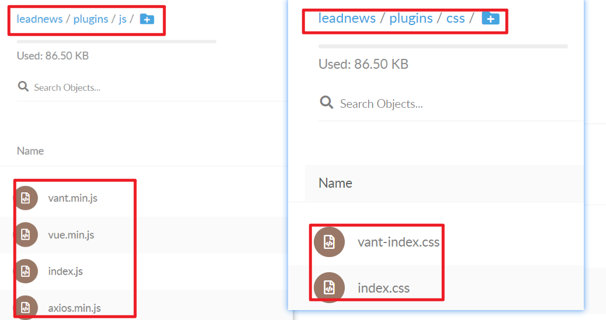 


#### 4.3.2)代码编写-12:09

5.新建ApArticleContentMapper

```java
package com.heima.article.mapper;

import com.baomidou.mybatisplus.core.mapper.BaseMapper;
import com.heima.model.article.pojos.ApArticleContent;
import org.apache.ibatis.annotations.Mapper;

//@Mapper
public interface ApArticleContentMapper extends BaseMapper<ApArticleContent> {
}
```

6.在artile微服务中新增测试类

> 后期发布文章后创建文章详情静态页面，目前暂时手动生成

```java
package com.heima.article.test;

import freemarker.template.Configuration;
import org.junit.jupiter.api.Test;


@SpringBootTest(classes = ArticleApplication.class)
public class ArticleFreemarkerTest {

    @Autowired
    private Configuration configuration;

    @Autowired
    private FileStorageService fileStorageService;

    @Autowired
    private ApArticleMapper apArticleMapper;
    
    @Autowired
    private ApArticleService apArticleService;

    @Autowired
    private ApArticleContentMapper apArticleContentMapper;

    @Test
    public void createStaticUrlTest() throws Exception {
        //1.获取文章内容
        ApArticleContent apArticleContent = apArticleContentMapper.selectOne(Wrappers.<ApArticleContent>lambdaQuery().eq(ApArticleContent::getArticleId, 1302862387124125698L));
        if(apArticleContent != null && StringUtils.isNotBlank(apArticleContent.getContent())){
            //2.文章内容通过freemarker生成html文件
            Template template = configuration.getTemplate("article.ftl");

            Map<String, Object> params = new HashMap<>();
            //把内容json字符串转换成对象集合
            params.put("content", JSONArray.parseArray(apArticleContent.getContent()));

            //将文件短暂存放在内存中 StringWriter存放在内存中而且是字符串的方式存放
            StringWriter out = new StringWriter();
            template.process(params, out);
            InputStream is = new ByteArrayInputStream(out.toString().getBytes());

            //3.把html文件上传到minio中
            String path = fileStorageService.uploadHtmlFile("", apArticleContent.getArticleId() + ".html", is);

            //4.修改ap_article表，保存static_url字段和发布时间
            ApArticle article = new ApArticle();
            article.setId(apArticleContent.getArticleId());
            article.setStaticUrl(path);
            article.setPublishTime(new Date());
            apArticleMapper.updateById(article);
            
            //其他更新方式
            //apArticleService.lambdaUpdate()
            //        .eq(ApArticle::getId, apArticleContent.getArticleId())
            //        .set(ApArticle::getStaticUrl, path)
            //        .set(ApArticle::getPublishTime, new Date())
            //        .update();
            
            //apArticleService.update(Wrappers.<ApArticle>lambdaUpdate()
            //        .eq(ApArticle::getId, apArticleContent.getArticleId())
            //        .set(ApArticle::getStaticUrl, path)
            //        .set(ApArticle::getPublishTime, new Date())
            //);
        }
    }
}
```

7.打开MinIO查看是否上传成功：[MinIO Browser](http://192.168.200.130:9000/minio/leadnews/)

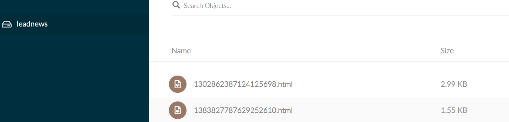

8.启动heima-leadnews-app-gateway，heima-leadnews-user，heima-leadnews-article服务和Nginx：

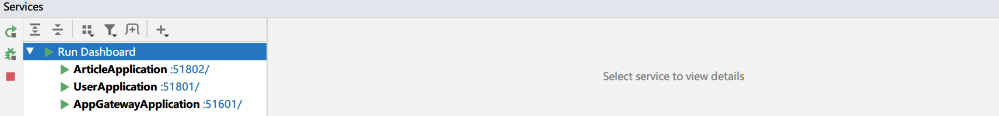

访问[黑马头条](http://localhost:8801/#/home)，查看生成的静态文件

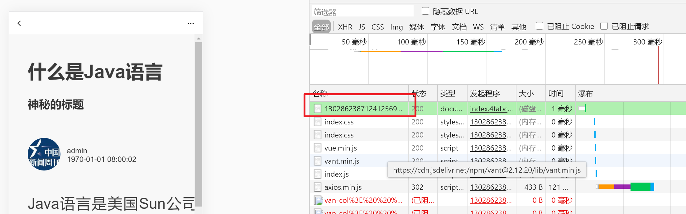