## day03-自媒体文章发布

### 0)今日菜单

1. 自媒体微服务搭建
2. **自媒体素材管理（重点）**
3. **自媒体文章发布（重点）**

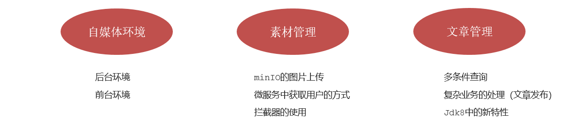

### 1)自媒体环境搭建

#### 1.1)后台搭建


①：基础环境和数据准备

- 创建自媒体数据库：执行资料中的leadnews-wemedia.sql脚本

- 【已完成】拷贝wemedia文件夹（dtos和pojos）到heima-leadnews-model模块下的com.heima.model

  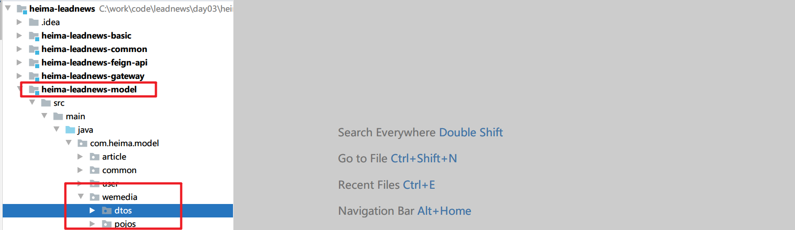

②：将资料中的heima-leadnews-wemedia.zip解压

- 拷贝到heima-leadnews-service工程下，修改pom.xml：指定子模块为其子模块

  ```xml
  <modules>
      <module>heima-leadnews-user</module>
      <module>heima-leadnews-article</module>
      <module>heima-leadnews-wemedia</module>
  </modules>
  ```

  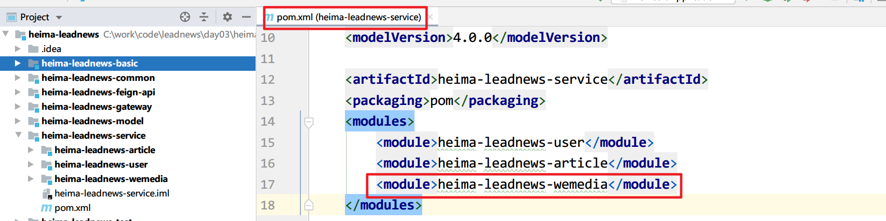

- 添加对应的nacos配置，Data ID：leadnews-wemedia

  ```yaml
  spring:
    datasource:
      driver-class-name: com.mysql.jdbc.Driver
      url: jdbc:mysql://localhost:3306/leadnews_wemedia?useUnicode=true&useSSL=false&characterEncoding=UTF-8&serverTimezone=UTC
      username: root
      password: root
  # 设置Mapper接口所对应的XML文件位置，如果你在Mapper接口中有自定义方法，需要进行该配置
  mybatis-plus:
    mapper-locations: classpath*:mapper/*.xml
    # 设置别名包扫描路径，通过该属性可以给包中的类注册别名
    type-aliases-package: com.heima.model.media.pojos
  ```

③：将资料中的heima-leadnews-wemedia-gateway.zip解压

- 拷贝到heima-leadnews-gateway工程下，并指定子模块

  ```xml
  <modules>
      <module>heima-leadnews-app-gateway</module>
      <module>heima-leadnews-wemedia-gateway</module>
  </modules>
  ```

  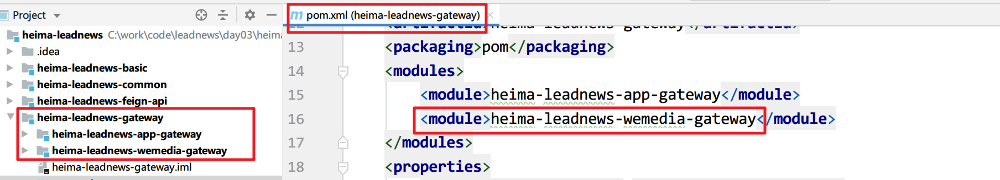

-  添加对应的nacos配置，Data ID：leadnews-wemedia-gateway

  ````yaml
  spring:
    cloud:
      gateway:
        globalcors:
          cors-configurations:
            '[/**]': # 匹配所有请求
              allowedOrigins: "*" #跨域处理 允许所有的域
              allowedMethods: # 支持的方法
                - GET
                - POST
                - PUT
                - DELETE
        routes:
          - id: wemedia
            uri: lb://leadnews-wemedia
            predicates:
              - Path=/wemedia/**
            filters:
              - StripPrefix= 1
  ````
  
- 启动自媒体服务和自媒体网关服务

#### 1.2)前端搭建【已完成】

**通过nginx的虚拟主机功能，使用同一个nginx访问多个项目**


搭建步骤：

①：资料中找到wemedia-web.zip解压

②：在nginx中leadnews.conf目录中新增heima-leadnews-wemedia.conf文件

- 网关地址修改（localhost:51602）
- 访问端口修改(8802)
- **前端项目目录修改（wemedia-web解压的目录）：改成自己解压后的目录（使用左斜杠/）**

```javascript
upstream  heima-wemedia-gateway{
    server localhost:51602;
}

server {
	listen 8802;
	location / {
        #路径中不能使用右斜杠\，手动换成左斜杠/
		root D:/workspace/wemedia-web/;
		index index.html;
	}
	
	location ~/wemedia/MEDIA/(.*) {
		proxy_pass http://heima-wemedia-gateway/$1;
		proxy_set_header HOST $host;  # 不改变源请求头的值
		proxy_pass_request_body on;  #开启获取请求体
		proxy_pass_request_headers on;  #开启获取请求头
		proxy_set_header X-Real-IP $remote_addr;   # 记录真实发出请求的客户端IP
		proxy_set_header X-Forwarded-For $proxy_add_x_forwarded_for;  #记录代理信息
	}
}
```

③：重启nginx，**启动自媒体服务和自媒体网关服务**

```sh
#关闭之前启动的nginx
taskkill /f /im nginx.exe
```


④：联调测试登录功能：http://localhost:8802/


### 2)自媒体素材管理

#### 2.1)素材上传【重点】

##### 2.2.1)需求分析

图片上传页面：首先是展示素材信息，可以点击图片上传，弹窗后可以上传图片


##### 2.2.2)图片上传-表结构

媒体图文素材信息表wm_material


##### 2.2.3)实现思路


①：网关进行token解析后，把解析后的用户信息存储到header中

heima-leadnews-wemedia-gateway微服务中的AuthorizeFilter：

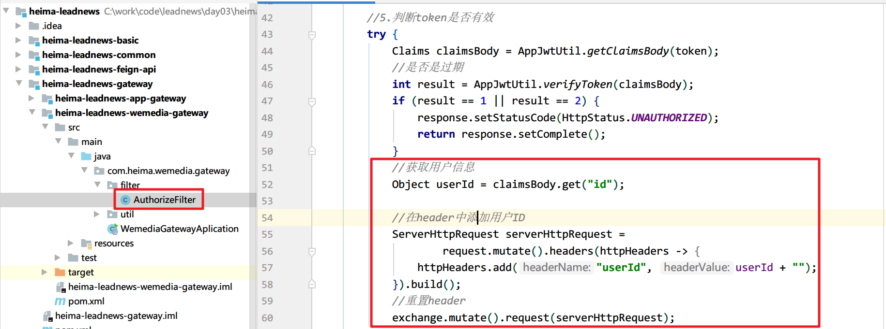

核心代码：

```java
//获得token解析后中的用户信息
Object userId = claimsBody.get("id");
 //简写形式
ServerHttpRequest serverHttpRequest =
        request.mutate().header("userId", userId + "").build();
//重置header
exchange.mutate().request(serverHttpRequest).build();
```

②：自媒体微服务使用拦截器获取到header中的的用户信息，并放入到threadlocal中

> **思考：为什么不用Session存储登录用户信息？**
>
> 如果想在Service或Dao需要获取用户信息的话，则需要将用户信息作为参数一直传递
>
> **使用ThreadLocal的好处：可以在同一线程（同一次请求）中很方便的获取用户信息，不需要频繁的传递用户信息。**

在heima-leadnews-utils中新增工具类

```java
package com.heima.utils.thread;

public class WmThreadLocalUtils {

    private final static ThreadLocal<WmUser> WM_USER_THREAD_LOCAL = new ThreadLocal<>();

    /**
     * 添加用户
     * @param wmUser
     */
    public static void setUser(WmUser wmUser){
        WM_USER_THREAD_LOCAL.set(wmUser);
    }

    /**
     * 获取用户
     */
    public static WmUser getUser(){
        return WM_USER_THREAD_LOCAL.get();
    }

    /**
     * 清理用户
     */
    public static void clear(){
        WM_USER_THREAD_LOCAL.remove();
    }
}
```

```asciiarmor
在heima-leadnews-wemedia中新增拦截器Interceptor（SpringMVC）:
```

```java
package com.heima.wemedia.interceptor;

@Slf4j
public class WmTokenInterceptor implements HandlerInterceptor {
    @Override
    public boolean preHandle(HttpServletRequest request, HttpServletResponse response, Object handler) throws Exception {
        //得到header中的信息
        String userId = request.getHeader("userId");
         //传统方式：存储用户登录信息到session中
        //request.getSession().setAttribute("userId", userId);

        //第二种方式：使用ThreadLocal保存登录用户信息
        if (userId != null) {
            //存入到当前线程中
            WmUser wmUser = new WmUser();
            wmUser.setId(Integer.valueOf(userId));
            //wmUser.setName("xxx");
            WmThreadLocalUtils.setUser(wmUser); //保存到当前线程：每一个请求都是一个线程
            log.info("wmTokenFilter设置用户信息到threadlocal中...");
        }

        //返回false，请求结束直接返回给前端
        //返回true，正常到达Controller的方法中
        return true;
    }
    
    //@Override //如果后续的Controller中方法执行出现异常，此方法不再执行
    //public void postHandle(HttpServletRequest request, HttpServletResponse response,
    //                       Object handler, ModelAndView modelAndView) throws Exception 

    /**
     * 清理线程中的数据
     */
    @Override
    public void afterCompletion(HttpServletRequest request,
                                HttpServletResponse response, Object handler,
                                Exception ex) throws Exception {
        WmThreadLocalUtils.clear();
    }
}
```

**配置使拦截器生效，拦截所有的请求：**

```java
package com.heima.wemedia.config;

@Configuration
public class WebMvcConfig implements WebMvcConfigurer {

    @Override
    public void addInterceptors(InterceptorRegistry registry) {
        //等同于<mvc:mapping path="/**"/>
        registry.addInterceptor(new WmTokenInterceptor()).addPathPatterns("/**");
    }
}
```

##### 2.2.4)接口定义

|          | **说明**                                                     |
| -------- | ------------------------------------------------------------ |
| 接口路径 | /api/v1/material/upload_picture                              |
| 请求方式 | POST                                                         |
| 参数     | MultipartFile **multipartFile**：Springmvc指定的文件接收类型 |
| 响应结果 | ResponseResult                                               |

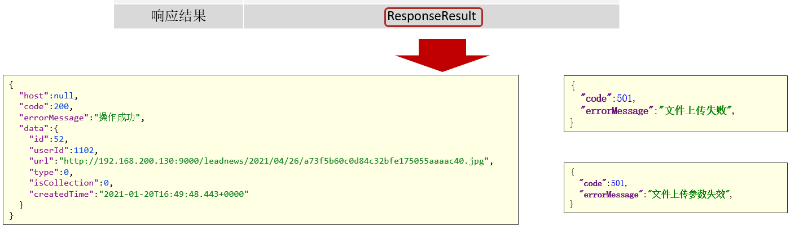


##### 2.2.5)具体实现

①：创建WmMaterialController

```java
package com.heima.wemedia.controller.v1;

@RestController
@RequestMapping("/api/v1/material")
public class WmMaterialController {

    @PostMapping("/upload_picture")
    public ResponseResult uploadPicture(MultipartFile multipartFile){
        return null;
    }

}
```

如果上传图片太大，需要调整默认配置：

```yml
  #不是顶头的，位于spring层级下
  servlet:
    multipart:
      max-file-size: 20MB #注意事项：默认最大上传文件大小为1MB
      max-request-size: 100MB #最大请求文件的大小
```

nginx配置：nginx.conf

```shell
http {
    include       mime.types;
    default_type  application/octet-stream;
	client_max_body_size 20M;  #上传文件大小限制
    sendfile        on;
    keepalive_timeout  65;
	# 引入自定义配置文件
	include leadnews.conf/*.conf;
}
```

②：mapper

```java
package com.heima.wemedia.mapper;

//@Mapper
public interface WmMaterialMapper extends BaseMapper<WmMaterial> {
}
```

③：业务层：

```java
package com.heima.wemedia.service;

public interface WmMaterialService extends IService<WmMaterial> {

    /**
     * 图片上传
     * @param multipartFile
     * @return
     */
    public ResponseResult uploadPicture(MultipartFile multipartFile);

}
```

业务层实现类：

```java
package com.heima.wemedia.service.impl;

import org.springframework.stereotype.Service;

@Service
@Transactional
public class WmMaterialServiceImpl extends ServiceImpl<WmMaterialMapper, WmMaterial> implements WmMaterialService {

    /*
     * 图片上传
     */
    @Override
    public ResponseResult uploadPicture(MultipartFile multipartFile) {

        //1.检查参数
        if(multipartFile == null || multipartFile.getSize() == 0){
            return ResponseResult.errorResult(AppHttpCodeEnum.PARAM_INVALID);
        }

        //2.上传图片到minIO中， 返回url

        //3.保存图片在minIO中的地址到数据库中：wm_material

        //4.返回结果

        return null;
    }

}
```

##### 2.2.6)集成文件上传starter

①：打开heima-leadnews-wemedia服务的pom.xml，导入heima-file-starter

```xml
<dependencies>
    <dependency>
        <groupId>com.heima</groupId>
        <artifactId>heima-file-starter</artifactId>
        <version>1.0-SNAPSHOT</version>
    </dependency>
</dependencies>
```

②：在自媒体微服务的Nacos配置中心添加以下配置：[Nacos配置地址](http://192.168.200.130:8848/nacos/#/configeditor?serverId=center&dataId=leadnews-wemedia&group=DEFAULT_GROUP&namespace=&edasAppName=&edasAppId=&searchDataId=&searchGroup=)

Data ID: leadnews-wemedia

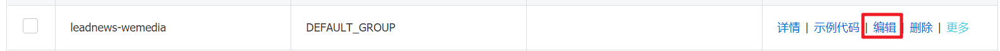

```yaml
minio:
  accessKey: minio
  secretKey: minio123
  bucket: leadnews
  endpoint: http://192.168.200.130:9000
  readPath: http://192.168.200.130:9000
```


##### 2.2.7)完成图片保存

①：完善业务层实现类WmMaterialServiceImpl：

```java
/**
 * 图片上传
 * @param multipartFile
 * @return
 */
@Override
public ResponseResult uploadPicture(MultipartFile multipartFile) {

    //1.检查参数
    if(multipartFile == null || multipartFile.getSize() == 0){
        return ResponseResult.errorResult(AppHttpCodeEnum.PARAM_INVALID);
    }

    //2.上传图片到minIO中
    String fileName = UUID.randomUUID().toString().replace("-", "");
   //根据文件原始名称获取文件格式：logo.png
    String originalFilename = multipartFile.getOriginalFilename();
    //截取后缀名
    String suffix = originalFilename.substring(originalFilename.lastIndexOf("."));
    String fileId = null;
    try {
        fileId = fileStorageService.uploadImgFile("", fileName + suffix, multipartFile.getInputStream());
        log.info("上传图片到MinIO中，fileId:{}",fileId);
    } catch (IOException e) {
        e.printStackTrace();
        log.error("WmMaterialServiceImpl-上传文件失败");
    }

    //3.保存到数据库中
    WmMaterial wmMaterial = new WmMaterial();
    wmMaterial.setUserId(WmThreadLocalUtils.getUser().getId());
    wmMaterial.setUrl(fileId);
    wmMaterial.setIsCollection((short)0);
    wmMaterial.setType((short)0);
    wmMaterial.setCreatedTime(new Date());
    save(wmMaterial);

    //4.返回结果
    return ResponseResult.okResult(wmMaterial);
}
```
②：控制器WmMaterialController

```java
@RestController
@RequestMapping("/api/v1/material")
public class WmMaterialController {

    @Autowired
    private WmMaterialService wmMaterialService;

    @PostMapping("/upload_picture")
    public ResponseResult uploadPicture(MultipartFile multipartFile){
        return wmMaterialService.uploadPicture(multipartFile);
    }

}
```

③：测试：启动自媒体微服务和自媒体网关

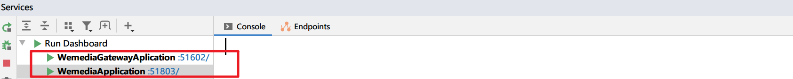

启动Nginx使用前端项目进行测试 http://localhost:8802/

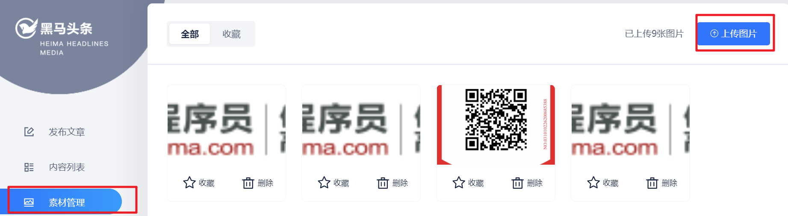


#### 2.2)素材列表查询

##### 2.2.1)接口定义

|          | **说明**              |
| -------- | --------------------- |
| 接口路径 | /api/v1/material/list |
| 请求方式 | POST                  |
| 参数     | WmMaterialDto         |
| 响应结果 | PageResponseResult    |

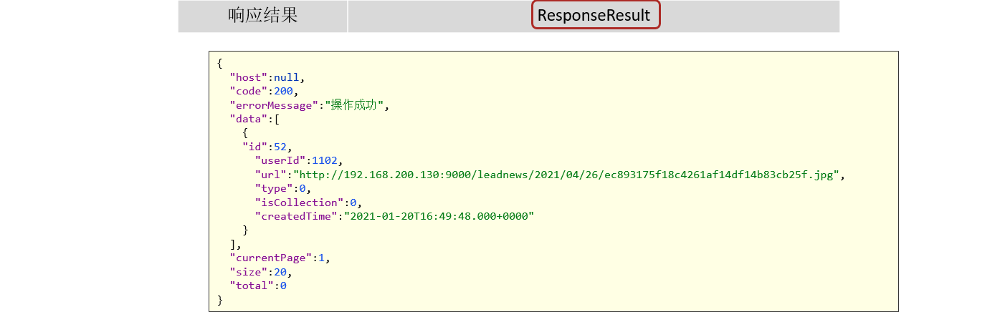
WmMaterialDto  ：

```java
package com.heima.model.wemedia.dtos;

@Data
public class WmMaterialDto extends PageRequestDto {

    /**
     * 1 收藏
     * 0 未收藏
     */
    private Short isCollection; 
    
    //page, size 继承来的属性
}
```

##### 2.2.2)功能实现

①：在WmMaterialController类中新增方法

```java
@PostMapping("/list")
public ResponseResult findList(@RequestBody WmMaterialDto dto){
    return null;
}
```

②：mapper已定义

③：业务层，在WmMaterialService中新增方法

```java
/**
     * 素材列表查询
     * @param dto
     * @return
     */
public ResponseResult findList(WmMaterialDto dto);
```

WmMaterialServiceImpl中实现方法：

```java
/**
 * 素材列表查询
 *
 * @param dto
 * @return
 */
@Override
public ResponseResult findList(WmMaterialDto dto) {

    //1.检查参数
    dto.checkParam();

    //2.分页查询
    IPage<WmMaterial> page = new Page<>(dto.getPage(), dto.getSize());
    //2.1构建查询条件
    LambdaQueryWrapper<WmMaterial> lambdaQueryWrapper = new LambdaQueryWrapper<>();
    //2.2判断是否只查询收藏的
    if (dto.getIsCollection() != null && dto.getIsCollection() == 1) {
        lambdaQueryWrapper.eq(WmMaterial::getIsCollection, dto.getIsCollection());
    }
    
    //简写方式
    //lambdaQueryWrapper.eq(
    //        dto.getIsCollection() != null && dto.getIsCollection() == 1,
    //        WmMaterial::getIsCollection,
    //        dto.getIsCollection());
    
    //2.3只查询当前登录用户的素材
    lambdaQueryWrapper.eq(WmMaterial::getUserId, WmThreadLocalUtils.getUser().getId());

    //2.4按照时间倒序
    lambdaQueryWrapper.orderByDesc(WmMaterial::getCreatedTime);

    page(page, lambdaQueryWrapper);
    //3.结果返回
    ResponseResult responseResult = new PageResponseResult(dto.getPage(),
            dto.getSize(), (int) page.getTotal());
    responseResult.setData(page.getRecords());
    return responseResult;
}
```

④：完善控制器

```java
@PostMapping("/list")
public ResponseResult findList(@RequestBody WmMaterialDto dto){
    return wmMaterialService.findList(dto);
}
```

⑤：添加MP的分页插件

```java
@SpringBootApplication
@MapperScan("com.heima.wemedia.mapper")
public class WemediaApplication {

    public static void main(String[] args) {
        SpringApplication.run(WemediaApplication.class,args);
    }

    @Bean
    public MybatisPlusInterceptor mybatisPlusInterceptor() {
        MybatisPlusInterceptor interceptor = new MybatisPlusInterceptor();
        //添加分页拦截器
        interceptor.addInnerInterceptor(new PaginationInnerInterceptor(DbType.MYSQL));
        return interceptor;
    }
}
```

⑥：启动自媒体微服务和自媒体网关


启动Nginx：http://localhost:8802/#/material/list


### 3)自媒体文章查询

#### 3.1)查询所有频道

##### 3.1.1)需求分析


##### 3.1.2)表结构

wm_channel 频道信息表

 


##### 3.1.3)接口定义

|          | **说明**                 |
| -------- | ------------------------ |
| 接口路径 | /api/v1/channel/channels |
| 请求方式 | GET                      |
| 参数     | 无                       |
| 响应结果 | ResponseResult           |

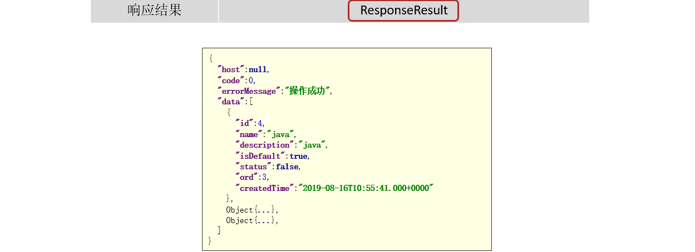

##### 3.1.4)功能实现

mapper

```java
package com.heima.wemedia.mapper;

public interface WmChannelMapper extends BaseMapper<WmChannel> {
}
```

service

```java
package com.heima.wemedia.service;

public interface WmChannelService extends IService<WmChannel> {

}
```

实现类

```java
package com.heima.wemedia.service.impl;

import org.springframework.stereotype.Service;

@Service
@Slf4j
public class WmChannelServiceImpl extends ServiceImpl<WmChannelMapper, WmChannel> implements WmChannelService {
}
```

完善控制层调用：

```java
package com.heima.wemedia.controller.v1;


@RestController
@RequestMapping("/api/v1/channel")
public class WmchannelController {

    @Autowired
    private WmChannelService wmChannelService;

    @GetMapping("/channels")
    public ResponseResult findAll(){
        //因为实现比较简单，可以不在业务层单独定义方法，直接调用MP默认提供的方法就行
        return ResponseResult.okResult(wmChannelService.list());
    }
}
```

##### 3.1.5)测试

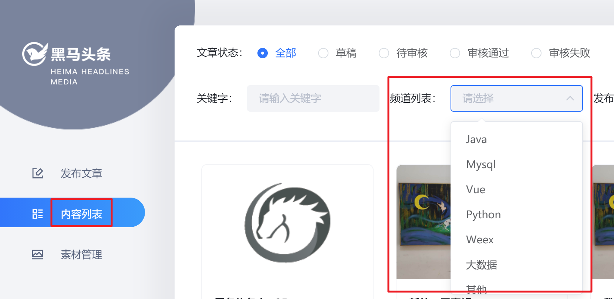


#### 3.2)查询自媒体文章

##### 3.2.1)需求说明


````json
#注意：隐含查询条件-》只能查询自己发布的文章(where userId = 登录用户ID)
````


##### 3.2.2)表结构分析

wm_news 自媒体文章表

 


##### 3.2.3)接口定义

|          | **说明**           |
| -------- | ------------------ |
| 接口路径 | /api/v1/news/list  |
| 请求方式 | POST               |
| 参数     | WmNewsPageReqDto   |
| 响应结果 | PageResponseResult |

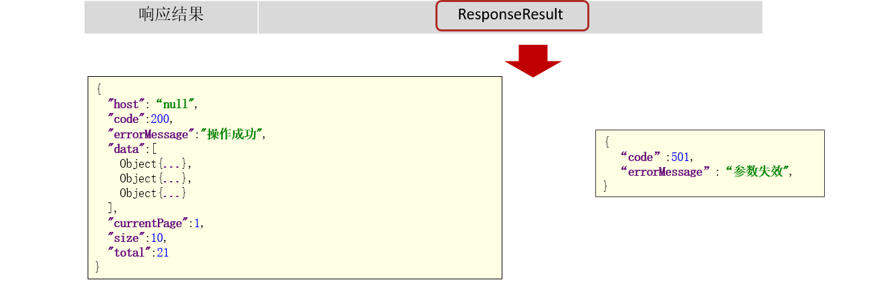

WmNewsPageReqDto  :

```java
package com.heima.model.wemedia.dtos;


@Data
public class WmNewsPageReqDto extends PageRequestDto {

    /**
     * 状态
     */
    private Short status;
    /**
     * 开始时间
     */
    private Date beginPubDate;
    /**
     * 结束时间
     */
    private Date endPubDate;
    /**
     * 所属频道ID
     */
    private Integer channelId;
    /**
     * 关键字
     */
    private String keyword;
    
    /**
     * 用户ID
     */
    private String userId;
}
```

##### 3.2.4)功能实现

①：新增WmNewsController

```java
package com.heima.wemedia.controller.v1;

@RestController
@RequestMapping("/api/v1/news")
public class WmNewsController {


    @PostMapping("/list")
    public ResponseResult findList(@RequestBody WmNewsPageReqDto dto){
        return  null;
    }

}
```

②：新增WmNewsMapper

```java
package com.heima.wemedia.mapper;

public interface WmNewsMapper extends BaseMapper<WmNews> {
    
}
```

③：新增WmNewsService

```java
package com.heima.wemedia.service;


public interface WmNewsService extends IService<WmNews> {

    /**
     * 查询文章
     * @param dto
     * @return
     */
    public ResponseResult findList(WmNewsPageReqDto dto);

}
```

实现类：

```java
package com.heima.wemedia.service.impl;

import org.springframework.stereotype.Service;
import com.baomidou.mybatisplus.extension.plugins.pagination.Page;
import org.apache.commons.lang3.StringUtils;

@Service
@Slf4j
public class WmNewsServiceImpl  extends ServiceImpl<WmNewsMapper, WmNews> implements WmNewsService {

    /**
     * 查询文章
     * @param dto
     * @return
     */
    @Override
    public ResponseResult findList(WmNewsPageReqDto dto) {
        return null;
    }
   
}
```

实现方法：

```java
/**
 * 查询文章
 * @param dto
 * @return
 */
@Override
public ResponseResult findList(WmNewsPageReqDto dto) {

    //1.检查参数
    if(dto == null){
        return ResponseResult.errorResult(AppHttpCodeEnum.PARAM_INVALID);
    }

    //分页参数检查
    dto.checkParam();

    //获取当前登录人的信息
    WmUser user = WmThreadLocalUtils.getUser();
    if(user == null){
        return ResponseResult.errorResult(AppHttpCodeEnum.NEED_LOGIN);
    }

    //2.分页条件查询
    IPage page = new Page(dto.getPage(),dto.getSize());
    LambdaQueryWrapper<WmNews> lambdaQueryWrapper = new LambdaQueryWrapper<>();
    //状态精确查询
    if(dto.getStatus() != null){
        lambdaQueryWrapper.eq(WmNews::getStatus,dto.getStatus());
    }

    //频道精确查询
    if(dto.getChannelId() != null){
        lambdaQueryWrapper.eq(WmNews::getChannelId,dto.getChannelId());
    }

    //时间范围查询
    if(dto.getBeginPubDate()!=null && dto.getEndPubDate()!=null){
        lambdaQueryWrapper.between(WmNews::getPublishTime,dto.getBeginPubDate(),dto.getEndPubDate());
    }

    //关键字模糊查询
    if(StringUtils.isNotBlank(dto.getKeyword())){
        lambdaQueryWrapper.like(WmNews::getTitle,dto.getKeyword());
    }

    //查询当前登录用户的文章
    lambdaQueryWrapper.eq(WmNews::getUserId,user.getId());

    //发布时间倒序查询
    lambdaQueryWrapper.orderByDesc(WmNews::getCreatedTime);

    page(page,lambdaQueryWrapper);

    //3.结果返回
    ResponseResult responseResult = new PageResponseResult(dto.getPage(),dto.getSize(),(int)page.getTotal());
    responseResult.setData(page.getRecords());

    return responseResult;
}
```

④：完善控制器

```java
package com.heima.wemedia.controller.v1;

@RestController
@RequestMapping("/api/v1/news")
public class WmNewsController {

    @Autowired
    private WmNewsService wmNewsService;

    @PostMapping("/list")
    public ResponseResult findList(@RequestBody WmNewsPageReqDto dto){
        return wmNewsService.findList(dto);
    }

}
```

##### 3.2.5)测试

启动后端自媒体微服务和自媒体网关微服务


启动Nginx：测试文章列表查询

http://localhost:8802/#/article/list


### 4)文章发布【重点】

#### 4.1)需求分析


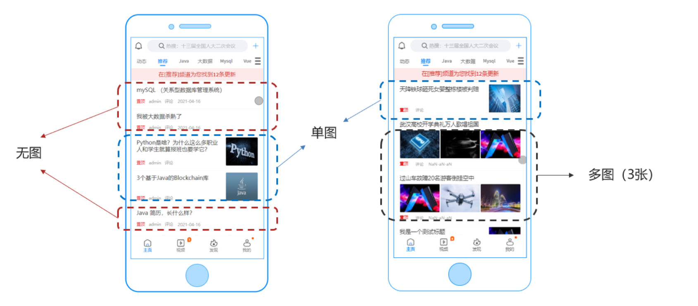

#### 4.2)表结构分析

保存文章，除了需要**wm_news**表以外，还需要另外两张表

wm_material 素材表


wm_news_material 文章素材关系表


#### 4.3)实现思路分析

需求：使用一个接口完成3个业务功能：

- 发表文章
- 修改文章**（根据是否存在id判断是哪种操作行为）**
- 保存草稿，暂时不发布**（通过status=0判断是否是草稿）**

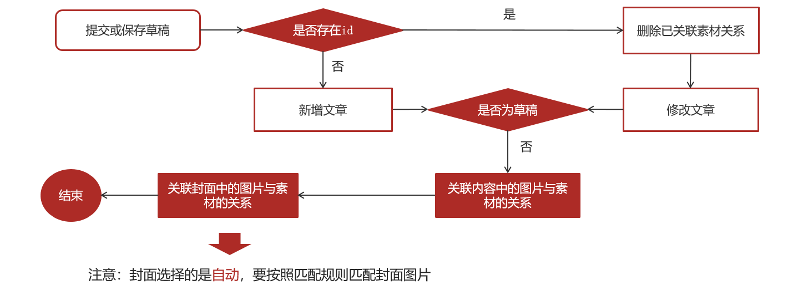

1.前端提交发布或保存为草稿请求

2.后台判断请求中是否包含了文章id

3.如果不包含id,则为新增

​	3.1 执行新增文章的操作

​	3.2 关联文章内容图片与素材的关系

​	3.3 关联文章封面图片与素材的关系

4.如果包含了id，则为修改请求

​	4.1 删除该文章与素材的所有关系

​	4.2 执行修改操作

​	4.3 关联文章内容图片与素材的关系

​	4.4 关联文章封面图片与素材的关系

#### 4.4)接口定义

https://console-docs.apipost.cn/preview/981b6ea57970a5a3/9431ffd8b6e6b905

|          | **说明**               |
| -------- | ---------------------- |
| 接口路径 | /api/v1/channel/submit |
| 请求方式 | POST                   |
| 参数     | WmNewsDto              |
| 响应结果 | ResponseResult         |

```json
{
  "title": "黑马头条项目背景",
  "type": "1",//这个 0 是无图 1 是单图 3 是多图 -1 是自动
  "labels": "黑马头条",
  "publishTime": "2020-03-14T11:35:49.000Z",
  "channelId": 1,
  "images": [ //封面图片，可能是多张
    "http://192.168.200.130/group1/M00/00/00/1133.png",
    "http://192.168.200.130/group1/M00/00/00/2356.png"
  ],
  "status": 1, //是否保存为草稿
  "content": "[
    {
      "type": "text", //标识文章文本内容
      "value": "随着智能手机的普及，人们更加习惯于通过手机来看新闻..."
    },
    {
      "type": "image", //标识文章图片内容
      "value": "http://192.168.200.130/group1/M00/00/00/3344.png"
    }
  ]"
}
```

```java
package com.heima.model.wemedia.dtos;


@Data
public class WmNewsDto {
    
    private Integer id;
     /**
     * 标题
     */
    private String title;
     /**
     * 频道id
     */
    private Integer channelId;
     /**
     * 标签
     */
    private String labels;
     /**
     * 发布时间
     */
    private Date publishTime;
     /**
     * 文章内容
     */
    private String content;
     /**
     * 文章封面类型  0 无图 1 单图 3 多图 -1 自动
     */
    private Short type;
     /**
     * 提交时间
     */
    private Date submitedTime; 
     /**
     * 状态 提交为1  草稿为0
     */
    private Short status;
     
     /**
     * 封面图片列表 多张图以逗号隔开
     */
    private List<String> images;
}
```

ResponseResult:

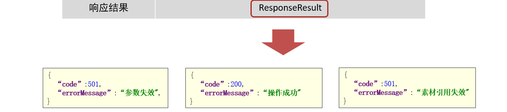

#### 4.5)功能实现

##### 0、准备工作

①：在新增WmNewsController中新增方法

```java
@PostMapping("/submit")
public ResponseResult submitNews(@RequestBody WmNewsDto dto){
    return null;
}
```

②：新增WmNewsMaterialMapper类，文章与素材的关联关系需要批量保存，索引需要定义mapper文件和对应的映射文件

```java
package com.heima.wemedia.mapper;

import org.apache.ibatis.annotations.Param;

public interface WmNewsMaterialMapper extends BaseMapper<WmNewsMaterial> {

    void saveRelations(@Param("materialIds") List<Integer> materialIds,
                       @Param("newsId") Integer newsId, 
                       @Param("type") Short type);
}
```

在resources目录下新建mapper/WmNewsMaterialMapper.xml

```sql
-- 一次插入多条数据
INSERT INTO wm_news_material ( material_id, news_id, type, ord )
VALUES 
(#{mid},#{newsId},#{type},#{ord}),
(#{mid},#{newsId},#{type},#{ord}),
(#{mid},#{newsId},#{type},#{ord})
```

```xml
<?xml version="1.0" encoding="UTF-8"?>
<!DOCTYPE mapper PUBLIC "-//mybatis.org//DTD Mapper 3.0//EN" "http://mybatis.org/dtd/mybatis-3-mapper.dtd">
<mapper namespace="com.heima.wemedia.mapper.WmNewsMaterialMapper">

    <insert id="saveRelations">
        insert into wm_news_material (material_id,news_id,type,ord)
        values
        <foreach collection="materialIds" index="ord" item="mid" separator=",">
            (#{mid},#{newsId},#{type},#{ord})
        </foreach>
    </insert>

</mapper>
```

③：常量类准备

```java
package com.heima.common.constants;

public class WemediaConstants {

    public static final Short COLLECT_MATERIAL = 1;//收藏

    public static final Short CANCEL_COLLECT_MATERIAL = 0;//取消收藏

    public static final String WM_NEWS_TYPE_IMAGE = "image";

    //封面-》无图
    public static final Short WM_NEWS_NONE_IMAGE = 0;
    //封面-》单图single
    public static final Short WM_NEWS_SINGLE_IMAGE = 1;
    //封面-》三图many
    public static final Short WM_NEWS_MANY_IMAGE = 3;
    //封面-》自动auto（使用文章内容的图片做为封面）
    public static final Short WM_NEWS_TYPE_AUTO = -1;

    //文章内容中的素材
    public static final Short WM_CONTENT_REFERENCE = 0;
    //封面中的素材
    public static final Short WM_COVER_REFERENCE = 1;
}
```

④：在WmNewsService中新增方法

```java
/**
 *  发布文章或保存草稿
 * @param dto
 * @return
 */
public ResponseResult submitNews(WmNewsDto dto);
```

实现类，主要分为如下4步：

```java
@Override
public ResponseResult submitNews(WmNewsDto dto) {
	//1.保存或修改文章 -》 wm_news
    
 	//2.判断是否为草稿(status == 0)  如果为草稿结束当前方法: return success
    
 	//3.不是草稿，保存文章内容图片与素材的关系 -> wm_news_material
    
 	//4.不是草稿，保存文章封面图片与素材的关系 ->wm_news_material
    
    return null;
}
```

⑤从文章内容中提取图片

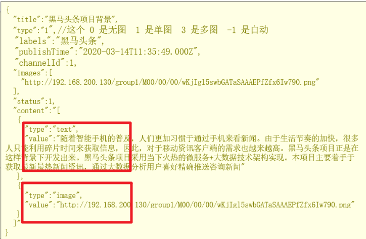 

```java
/**
 * 提取文章内容中的图片信息
 *
 * @param content
 * @return
 */
private List<String> ectractUrlInfo(String content) {
    //图片集合
    List<String> materials = new ArrayList<>();

    //从content中解析出图片
    List<Map> maps = JSON.parseArray(content, Map.class);
    
    for (Map map : maps) {
        if (map.get("type").equals("image")) {
            String imgUrl = (String) map.get("value");
            materials.add(imgUrl);
        }
    }
    
    //使用stream流操作
    //materials = maps.stream()
    //        .filter(map -> Objects.equals(map.get("type"), WemediaConstants.WM_NEWS_TYPE_IMAGE))
    //        .map(map -> (String) map.get("value")) //从map中取出url做为集合元素
    //        .distinct() //去重
    //        .collect(Collectors.toList()); //转成list

    return materials;
}
```

 

发布文章流程图：https://www.processon.com/view/link/62b7da851efad40851aa6682

##### 1、保存或修改文章

```asciiarmor
如果当前封面类型为自动，则从内容的图片中获取
    # 匹配规则：
    # 1，如果内容图片>=3  多图  type设为3：3图
    # 2，如果内容图片 >0  单图  type设为1：单图
    # 3，如果内容图片 =0  无图  type设为0
```

```java
@Override
@Transactional
public ResponseResult submitNews(WmNewsDto dto) {

    //0.判断登录状态 网关拿到token解析userId -> 微服务 拦截器将userId -> ThreadLocal
    WmUser user = WmThreadLocalUtils.getUser();
    if (user == null) {
        //用户未登录
        throw new CustomException(AppHttpCodeEnum.NEED_LOGIN);
    }

    //1.保存或修改文章 -》 wm_news
    WmNews wmNews = new WmNews();
    BeanUtils.copyProperties(dto, wmNews);
    //提取内容中的图片
    List<String> contentImageUrls = extractUrlInfo(dto.getContent());

    //处理自动选择封面
    if (Objects.equals(dto.getType(), WemediaConstants.WM_NEWS_TYPE_AUTO)) {
        int size = contentImageUrls.size();
        if (size >= 3) {
            //3.图片数量>=3 多图 选择前三张
            dto.setImages(contentImageUrls.subList(0, 3));
            wmNews.setType(WemediaConstants.WM_NEWS_MANY_IMAGE);
        } else if (size > 0) {
            //2.图片数量1-2 单图 选择第一张图片
            dto.setImages(contentImageUrls.subList(0, 1));
            wmNews.setType(WemediaConstants.WM_NEWS_SINGLE_IMAGE);
        } else {
            //1.图片数量0 无图
            dto.setImages(null);
            wmNews.setType(WemediaConstants.WM_NEWS_NONE_IMAGE);
        }
    }

    //处理图片集合为字符串，用,分割
    if (!CollectionUtils.isEmpty(dto.getImages())) {
        wmNews.setImages(StringUtils.join(dto.getImages(), ","));
    }

    //设置提交时间
    wmNews.setSubmitedTime(new Date());
    if (wmNews.getId() == null) { //新增
        wmNews.setUserId(WmThreadLocalUtils.getUser().getId());
        wmNews.setCreatedTime(new Date());
        wmNews.setEnable((short) 1);
        //新增
        save(wmNews);
    } else { //修改
        wmNewsMaterialMapper.delete(
                Wrappers.<WmNewsMaterial>lambdaQuery()
                        .eq(WmNewsMaterial::getNewsId, wmNews.getId())
        );
        updateById(wmNews);
    }

    //2.判断是否为草稿(status == 0)  如果为草稿结束当前方法: return success
    if (dto.getStatus().equals(WmNews.Status.NORMAL.getCode())) {
        return ResponseResult.okResult(AppHttpCodeEnum.SUCCESS);
    }
    
 	//3.不是草稿，保存文章内容图片与素材的关系
 	//4.不是草稿，保存文章封面图片与素材的关系，如果当前布局是自动，需要匹配封面图片
     return ResponseResult.okResult(AppHttpCodeEnum.SUCCESS);
}
```

##### 2、保存素材和文章关联关系

新增私有方法saveMaterialAndNews()：

```java
/**
 * 保存素材和文章关联关系
 */
private void saveMaterialAndNews(List<String> urls, Integer newsId, Short type) {
    //校验是否包含图片
    if (!CollectionUtils.isEmpty(urls)) {
        //通过图片的url查询素材的id： url -》 id
        //http://192.168.200.130:9000/leadnews/2021/07/23/ak47.jpg
        //http://192.168.200.130:9000/leadnews/2021/07/23/ak47.jpg
        //http://192.168.200.130:9000/leadnews/2021/07/23/ak47.jpg
        //SELECT* FROM wm_material WHERE url IN (xx,xx)
        List<WmMaterial> wmMaterials = wmMaterialMapper
                .selectList(Wrappers.<WmMaterial>lambdaQuery().select(WmMaterial::getId)
                        .in(WmMaterial::getUrl, urls));

        //素材IDs:[76, 79, 81]
        List<Integer> ids =
                wmMaterials.stream().map(WmMaterial::getId).collect(Collectors.toList());

        //判断id集合和图片集合数量是否一致
        if (ids.size() != urls.size()) {
            //有部分图片被删除
            log.error("图片数据被删除!");
            throw new CustomException(AppHttpCodeEnum.DATA_NOT_EXIST);
        }

        //批量保存 : wm_news_material
        wmNewsMaterialMapper.saveRelations(ids, newsId, type);
    }
}
```


##### 3、保存内容&封面图片和素材关联

完善submitNews方法：

```java
//3.不是草稿，保存文章内容图片与素材的关系 -> wm_news_material
saveMaterialAndNews(contentImageUrls, wmNews.getId(), WemediaConstants.WM_CONTENT_REFERENCE);

//4.不是草稿，保存文章封面图片与素材的关系，
saveMaterialAndNews(dto.getImages(), wmNews.getId(),WemediaConstants.WM_COVER_REFERENCE);

return ResponseResult.okResult(AppHttpCodeEnum.SUCCESS);
```

控制器

```java
@PostMapping("/submit")
public ResponseResult submitNews(@RequestBody WmNewsDto dto){
    return  wmNewsService.submitNews(dto);
}
```


#### 4.6)测试

1. 启动后端自媒体微服务和自媒体网关微服务

   
   
2. 启动Nginx：测试发布文章 http://localhost:8802/#/article/publish
