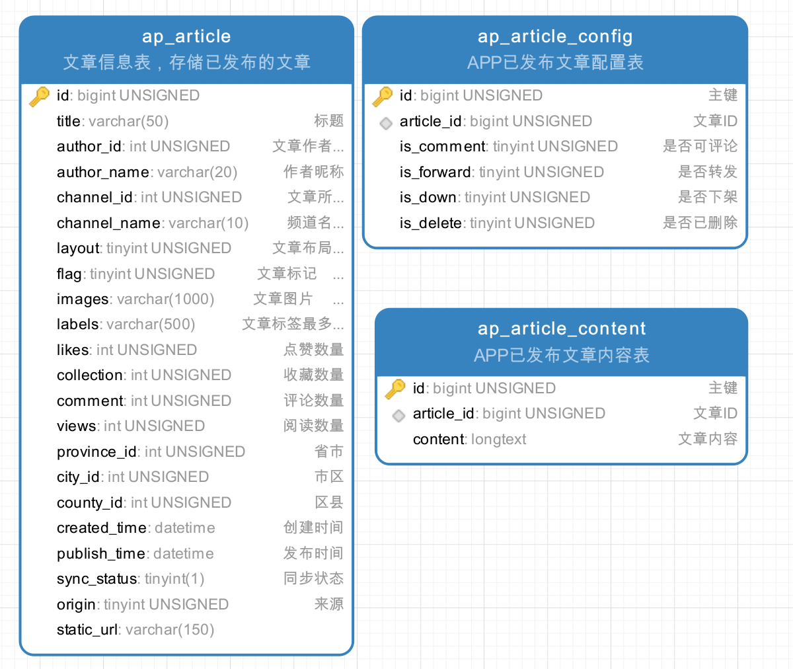
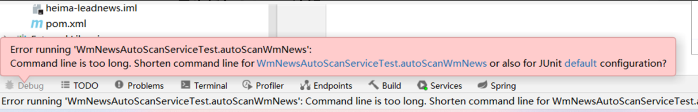

## day04-自媒体文章审核

### 0)今日菜单

1. 文章内容（文本和图片）审核
3. **文章审核通过（重点）**
3. 自管理敏感词过滤
4.  **静态文件生成（重点）**


### 1)自动审核流程【理解】

文章发布之后，系统自动审核，主要是通过第三方接口对文章内容进行审核（成功、失败、不确定）。

时序图：


> 1 自媒体端发布文章后，开始审核文章
>
> 2 审核的主要是审核文章的内容（文本内容和图片）
>
> 3 借助第三方提供的接口审核文本
>
> 4 借助第三方提供的接口审核图片，由于图片存储到minIO中，需要先下载才能审核
>
> 5 如果审核失败，则需要修改自媒体文章的状态，status:2  审核失败    status:3  转到人工审核
>
> 6 如果审核成功，则需要在文章微服务中创建app端需要的文章

 

### 2)内容安全产品

#### 2.1)概述

内容安全是识别服务，支持对图片、视频、文本、语音等对象进行多样化场景检测，有效降低内容违规风险。

目前很多平台都支持内容检测，如阿里云、腾讯云、百度AI、网易云等国内大型互联网公司都对外提供了API。

按照性能和收费来看，黑马头条项目使用的就是**阿里云的内容安全接口**，使用到了图片和文本的审核。

#### 2.2)准备工作

您在使用内容检测API之前，需要先注册阿里云账号，添加Access Key并签约云盾内容安全。

**操作步骤**

1. 前往[阿里云官网](https://www.aliyun.com/)注册账号。如果已有注册账号，请跳过此步骤。

   进入阿里云首页后，如果没有阿里云的账户需要先进行注册，才可以进行登录。

   ```asciiarmor
   需要实名认证后，才能使用（需要实名认证和活体认证）
   ```

2. 打开内容安全产品首页，点击“产品控制台”：https://www.aliyun.com/product/lvwang

   

   

#### 2.3)文本内容审核接口

文本垃圾内容检测：https://help.aliyun.com/document_detail/70439.html?spm=a2c4g.11186623.6.659.35ac3db3l0wV5k 


文本垃圾内容Java SDK: https://help.aliyun.com/document_detail/53427.html?spm=a2c4g.11186623.6.717.466d7544QbU8Lr 

#### 2.4)图片审核接口

图片垃圾内容检测：https://help.aliyun.com/document_detail/70292.html?spm=a2c4g.11186623.6.616.5d7d1e7f9vDRz4 


图片垃圾内容Java SDK: https://help.aliyun.com/document_detail/53424.html?spm=a2c4g.11186623.6.715.c8f69b12ey35j4 

#### 2.5)项目集成

前置准备：**检查**是否阿里云SDK已添加到heima-leadnews-common模块中

```xml
<dependency>
    <groupId>com.aliyun</groupId>
    <artifactId>aliyun-java-sdk-core</artifactId>
</dependency>
<dependency>
    <groupId>com.aliyun</groupId>
    <artifactId>aliyun-java-sdk-green</artifactId>
</dependency>
```

①：拷贝资料文件夹中的类到common模块下面，并添加到自动配置

 包括了GreenImageScan和GreenTextScan及对应的工具类

 

添加到SpringBoot自动配置中，启动时将工具类生成对象放到IoC容器中：spring.factories

```properties
org.springframework.boot.autoconfigure.EnableAutoConfiguration=\
  com.heima.common.exception.ExceptionCatch,\
  com.heima.common.swagger.SwaggerConfiguration,\
  com.heima.common.swagger.Swagger2Configuration,\
  com.heima.common.aliyun.GreenTextScan,\
  com.heima.common.aliyun.GreenImageScan
```


②： accessKeyId和secret：通过https://ram.console.aliyun.com/manage/ak获取自己的信息


管理自己的AccessKey,可以新建和删除AccessKey


查看自己的AccessKey，默认是隐藏的，第一次申请的时候可以保存AccessKey，

点击显示，通过验证手机号后也可以查看


在heima-leadnews-wemedia中的nacos配置中心添加以下配置，Data ID: leadnews-wemedia

```yaml
aliyun:
  accessKeyId: LTAI5tCWHCcfvqQzu8k2oKmX
  secret: auoKUFsghimbfVQHpy7gtRy342R4vc
  scenes: terrorism #指定图片检测场景
  #可选址porn智能鉴黄,terrorism暴恐涉政,ad,qrcode,live不良场景,logo
```

③：在自媒体微服务中测试类中注入审核文本和图片的bean进行测试

```java
package com.heima.wemedia;

import org.junit.jupiter.api.Test;
import java.util.Arrays;

@SpringBootTest(classes = WemediaApplication.class)
public class AliyunTest {

    @Autowired
    private GreenTextScan greenTextScan;

    @Autowired
    private GreenImageScan greenImageScan;

    @Autowired
    private FileStorageService fileStorageService;

    @Test
    public void testScanText() throws Exception {
        Map map = greenTextScan.greeTextScan("我是一个好人");
        System.out.println(map);
    }

    @Test
    public void testScanImage() throws Exception {
        byte[] bytes = fileStorageService.downLoadFile("http://192.168.200.130:9000/leadnews/ak47.jpg");
        Map map = greenImageScan.imageScan(Arrays.asList(bytes));
        System.out.println(map);
    }
}
```

**文本审核响应中的关键信息：**


**图片审核响应中的关键信息：**


### 3)app端文章保存【重点】

#### 3.1)表结构说明

 

垂直分表：将文章表拆分成了3个（ap_article, ap_article_config, ap_article_content）

**水平分表**：将相同的表多创建几个，根据不同的ID把数据存储到不同的表中(ap_article1, ap_article2...)，能不能使用自增做为主键

#### 3.2)分布式ID

##### 3.2.1)为什么不使用自增

随着业务的增长，文章表可能要占用很大的物理存储空间，为了解决该问题，后期使用数据库分片技术。将一个数据库进行拆分，通过数据库中间件连接。如果数据库中该表选用ID自增策略，则可能产生重复的ID，此时应该使用分布式ID生成策略来生成ID。


##### 3.2.2)技术选型


Redis的自增：

```
set id 10000
incr id
```


##### 3.2.3)雪花算法

Snowflake是Twitter开源的分布式ID生成算法（scala），结果是一个long型的ID。其核心思想是：使用41bit作为毫秒数，10bit作为机器的ID（5个bit是数据中心，5个bit的机器ID），12bit作为毫秒内的流水号（意味着每个节点在每毫秒可以产生 4096 个 ID），最后还有一个符号位，永远是0


````asciiarmor
缺点：雪花算法依赖当前毫秒数，因此如果时钟回拨（服务器都会进行时间校准），则可能出现生成重复的ID
````

> 开源实现：
> 美团：Leaf
> 百度：id-generator

文章端相关的表都使用雪花算法生成id,包括ap_article、 ap_article_config、 ap_article_content


##### 3.2.4)项目应用

mybatis-plus已经集成了雪花算法，完成以下两步即可在项目中集成雪花算法

第一：在实体类中的id上加入如下配置，指定类型为id_worker

- ApArticle
- ApArticleConfig
- ApArticleContent

```java
@TableId(value = "id", type = IdType.ASSIGN_ID)
//@TableId(value = "id",type = IdType.ID_WORKER)
private Long id;
```

第二：修改Nacos中leadnews-article的配置：


```yaml
mybatis-plus:
  mapper-locations: classpath*:mapper/*.xml
  # 设置别名包扫描路径，通过该属性可以给包中的类注册别名
  type-aliases-package: com.heima.model.article.pojos
  global-config: #全局设置
    datacenter-id: 1 #数据中心id(取值范围：0-31), 不同的机房使用不用的datacenter-id
    workerId: 1 #机器id(取值范围：0-31)，同一机房的不同服务器使用不同的workerId
```


#### 3.3)思路分析

在文章审核成功以后需要在app的article库中新增文章数据

1.保存文章信息 ap_article

2.保存文章配置信息 ap_article_config（是否上架，是否删除，是否可以评论）

3.保存文章内容 ap_article_content（文章内容）

实现思路：


#### 3.4)实现步骤

##### 3.4.1)feign接口

|          | **说明**             |
| -------- | -------------------- |
| 接口路径 | /api/v1/article/save |
| 请求方式 | POST                 |
| 参数     | ArticleDto           |
| 响应结果 | ResponseResult       |

参数 ArticleDto：


 返回值 ResponseResult：


##### 3.4.2)功能实现

①：在heima-leadnews-feign-api中新增接口

第一：先导入feign的依赖

```xml
<dependency>
    <groupId>org.springframework.cloud</groupId>
    <artifactId>spring-cloud-starter-openfeign</artifactId>
</dependency>
```

第二：定义远程调用文章服务的接口

**在heima-leadnews-feign-api模块中添加 IArticleClient：**

```java
package com.heima.apis.article;

//必须导入spring-cloud-starter-openfeign
@FeignClient("leadnews-article")
public interface IArticleClient {

    @PostMapping("/api/v1/article/save")
    public ResponseResult saveArticle(@RequestBody ArticleDto dto) ;
}
```

②：在**heima-leadnews-article**中实现该方法

```java
package com.heima.article.feign;

@RestController
public class ArticleClient implements IArticleClient {

    @Autowired
    private ApArticleService apArticleService;

    @Override
    @PostMapping("/api/v1/article/save")
    public ResponseResult saveArticle(@RequestBody ArticleDto dto) {
        return apArticleService.saveArticle(dto);
    }

}
```

③：新建ApArticleConfigMapper

```JAVA
package com.heima.article.mapper;

public interface ApArticleConfigMapper extends BaseMapper<ApArticleConfig> {
}
```

同时，修改ApArticleConfig类，**添加如下构造函数**：设置一些默认值

```java
package com.heima.model.article.pojos;

/**
 * <p>
 * APP已发布文章配置表
 * </p>
 *
 * @author itheima
 */
@Data
@NoArgsConstructor // == public ApArticleConfig() {}
@TableName("ap_article_config")
public class ApArticleConfig implements Serializable {
    
    public ApArticleConfig(Long articleId){
        this.articleId = articleId;
        this.isComment = true; //默认可以评论
        this.isForward = true; //默认可以转发
        this.isDelete = false; //默认未删除
        this.isDown = false; //默认未下架
    }
    
   	@TableId(value = "id",type = IdType.ID_WORKER)
    private Long id;

    //...
}
```

④：在ApArticleService中新增方法

```java
/**
     * 保存app端相关文章
     * @param dto
     * @return
     */
ResponseResult saveArticle(ArticleDto dto) ;
```

实现类：

```JAVA
/**
 * 保存app端相关文章
 * @param dto
 * @return
 */
@Override
@Transactional
public ResponseResult saveArticle(ArticleDto dto) {
    //1.检查参数
    //2.判断是否存在id
        //2.1 不存在id，则保存文章、文章配置、文章内容
        //2.2 存在id，则修改文章、文章内容
    //3.结果返回  文章的id
}
```

```java
@Autowired
private ApArticleConfigMapper apArticleConfigMapper;

@Autowired
private ApArticleContentMapper apArticleContentMapper;

/**
     * 保存app端相关文章
     * @param dto
     * @return
     */
@Override
@Transactional
public ResponseResult saveArticle(ArticleDto dto) {
    //1.检查参数
    if(dto == null){
        return ResponseResult.errorResult(AppHttpCodeEnum.PARAM_INVALID);
    }

    ApArticle apArticle = new ApArticle();
    BeanUtils.copyProperties(dto,apArticle);

    //2.判断是否存在id
    if(dto.getId() == null){
        //2.1 不存在id  保存  文章  文章配置  文章内容

        //保存文章
        save(apArticle);

        //保存配置
        ApArticleConfig apArticleConfig = new ApArticleConfig(apArticle.getId());
        apArticleConfigMapper.insert(apArticleConfig);

        //保存 文章内容
        ApArticleContent apArticleContent = new ApArticleContent();
        apArticleContent.setArticleId(apArticle.getId());
        apArticleContent.setContent(dto.getContent());
        apArticleContentMapper.insert(apArticleContent);

    }else {
        //2.2 存在id   修改  文章  文章内容

        //修改  文章
        updateById(apArticle);

        //修改文章内容
        //select * from ap_article_content where article_id = ?
        ApArticleContent apArticleContent = apArticleContentMapper.selectOne(Wrappers.<ApArticleContent>lambdaQuery().eq(ApArticleContent::getArticleId, dto.getId()));
        apArticleContent.setContent(dto.getContent());
        //update ...
        apArticleContentMapper.updateById(apArticleContent);

        //update ap_article_content set content = ? where article_id = ?
        //apArticleContentMapper.update(null,
        //        Wrappers.<ApArticleContent>lambdaUpdate()
        //                //set content = ?
        //                .set(ApArticleContent::getContent, dto.getContent())
        //                //where article_id = ?
        //                .eq(ApArticleContent::getArticleId, apArticle.getId()));
    }


    //3.结果返回  文章的id
    return ResponseResult.okResult(apArticle.getId());
}
```

⑤：启动ArticleApplication后，使用postman测试：


```
POST: http://localhost:51802/api/v1/article/save
```

```json
{
    "title":"黑马头条项目背景22222222222222",
    "authorId":1102,
    "layout":1,
    "labels":"黑马头条",
    "channelId": 1,
    "createdTime": "2022-01-14T11:35:49.000Z",
    "publishTime":"2028-03-14T11:35:49.000Z",
    "images": "http://192.168.200.130:9000/leadnews/2021/04/26/5ddbdb5c68094ce393b08a47860da275.jpg",
    "content":"22222222222222222黑马头条项目背景,黑马头条项目背景,黑马头条项目背景,黑马头条项目背景，黑马头条项目背景"
}
```


### 4)自动审核【重点】

#### 4.1)表结构说明

wm_news 自媒体文章表

 

#### 4.2)实现步骤


在**heima-leadnews-wemedia**中新增service类实现自动审核：

```java
package com.heima.wemedia.service;

public interface WmNewsAutoScanService {

    /**
     * 自媒体文章审核
     */
    public void autoScanWmNews(WmNews wmNews);
}
```

实现类：

```java
package com.heima.wemedia.service.impl;

import com.heima.wemedia.service.WmNewsAutoScanService;
import org.springframework.stereotype.Service;
import org.apache.commons.lang.StringUtils;

@Service
@Slf4j
public class WmNewsAutoScanServiceImpl implements WmNewsAutoScanService {
    
    /**
     * 自媒体文章审核
     */
    @Override
    public void autoScanWmNews(WmNews wmNews) {

        //TODO 1.查询自媒体文章，提取出文本和图片
        //TODO 2.审核文本内容  阿里云接口
        //TODO 3.审核图片  阿里云接口
        //TODO 4.审核成功，远程调用文章微服务保存app端用户相关的文章数据
    }
}
```

##### 1、查询自媒体文章

从内容中提取纯文本内容和图片

 

```java
@Autowired
private WmNewsMapper wmNewsMapper;

/**
 * 自媒体文章审核
 */
@Override
@Transactional
public void autoScanWmNews(WmNews wmNews) {

    //TODO 1.查询自媒体文章，提取出文本和图片
    if (wmNews.getStatus().equals(WmNews.Status.SUBMIT.getCode())) {
        //从内容中提取纯文本内容和图片
        Map<String, Object> textAndImages = handleTextAndImages(wmNews);
    }

    //TODO 2.审核文本内容  阿里云接口
    //TODO 3.审核图片  阿里云接口
    //TODO 4.审核成功，远程调用文章微服务保存app端用户相关的文章数据
}

/**
 * 1.从自媒体文章的内容中提取文本和图片
 * 2.提取文章的封面图片
 */
private Map<String, Object> handleTextAndImages(WmNews wmNews) {
    //存储纯文本内容，文章标题也需要审核，因此也加进去
    StringBuilder stringBuilder = new StringBuilder(wmNews.getTitle());
    //存储文章中内容的图片和封面图片
    List<String> images = new ArrayList<>();

    //1。从自媒体文章的内容中提取文本和图片
    if (StringUtils.isNotBlank(wmNews.getContent())) {
        List<Map> maps = JSONArray.parseArray(wmNews.getContent(), Map.class);
        for (Map map : maps) {
            if (map.get("type").equals("text")) {
                stringBuilder.append(map.get("value"));
            }

            if (map.get("type").equals("image")) {
                images.add((String) map.get("value"));
            }
        }
    }
    //2.提取文章的封面图片
    if (StringUtils.isNotBlank(wmNews.getImages())) {
        String[] split = wmNews.getImages().split(",");
        images.addAll(Arrays.asList(split));
    }

    Map<String, Object> resultMap = new HashMap<>();
    resultMap.put("content", stringBuilder.toString());
    resultMap.put("images", images);
    return resultMap;
}
```


##### 2、审核文本内容


```java
@Override
public void autoScanWmNews(WmNews wmNews) {
    //TODO 1.查询自媒体文章，提取出文本和图片
    if (wmNews.getStatus().equals(WmNews.Status.SUBMIT.getCode())) {
        //从内容中提取纯文本内容和图片
        Map<String, Object> textAndImages = handleTextAndImages(wmNews);
        
        //2.审核文本内容  阿里云接口
        boolean isTextScan = handleTextScan((String) textAndImages.get("content"),
                                            wmNews);
        if (!isTextScan) return;
    }
    
}

@Autowired
private GreenTextScan greenTextScan;

/**
     * 审核纯文本内容
     *
     */
private boolean handleTextScan(String content, WmNews wmNews) {
    boolean flag = true;
    //判断文章标题或者内容是否为空
    if (StringUtils.isBlank(content) || StringUtils.isBlank(wmNews.getTitle())) {
        return false;
    }
    try {
        Map map = greenTextScan.greeTextScan(content);
        if (map != null) {
            //审核失败
            if (map.get("suggestion").equals("block")) {
                flag = false;
                updateWmNews(wmNews, (short) 2, "当前文章中存在违规内容");
            } else if (map.get("suggestion").equals("review")) { //不确定信息  需要人工审核
                flag = false;
                updateWmNews(wmNews, (short) 3, "当前文章中存在不确定内容");
            }
        }
    } catch (Exception e) {
        flag = false;
        log.error("调用阿里云失败", e);
        updateWmNews(wmNews, WmNews.Status.ADMIN_AUTH.getCode(), "审核接口调用失败，转人工处理");
    }
    
    return flag;
}

/**
 * 修改文章内容
 */
private void updateWmNews(WmNews wmNews, short status, String reason) {
    wmNews.setStatus(status);
    wmNews.setReason(reason);
    wmNewsMapper.updateById(wmNews);
}
```


##### 3、审核图片

autoScanWmNews()：

```java
//3.审核图片  阿里云接口
boolean isImageScan = handleImageScan((List<String>) textAndImages.get("images"), wmNews);
if (!isImageScan) return;
```


```java
@Autowired
private FileStorageService fileStorageService;

@Autowired
private GreenImageScan greenImageScan;


/**
 * 审核图片
 *
 * @param images
 * @param wmNews
 * @return
 */
private boolean handleImageScan(List<String> images, WmNews wmNews) {

    boolean flag = true;

    if (CollectionUtils.isEmpty(images)) {
        return flag;
    }

    //下载图片 minIO
    //图片去重
    images = images.stream().distinct().collect(Collectors.toList());
    List<byte[]> imageList = new ArrayList<>();
    for (String image : images) {
        byte[] bytes = fileStorageService.downLoadFile(image);
        imageList.add(bytes);
    }
    
    //使用stream流简化代码
    //List<byte[]> bytes = images.stream()
    //        .distinct() //去重
    //        .map(url -> fileStorageService.downLoadFile(url)) //到minio下载图片
    //        .collect(Collectors.toList());


    //审核图片
    try {
        Map map = greenImageScan.imageScan(imageList);
        if (map != null) {
            //审核失败
            if (map.get("suggestion").equals("block")) {
                flag = false;
                updateWmNews(wmNews, (short) 2, "当前文章中存在违规内容");
            }

            //不确定信息  需要人工审核
            if (map.get("suggestion").equals("review")) {
                flag = false;
                updateWmNews(wmNews, (short) 3, "当前文章中存在不确定内容");
            }
        }

    } catch (Exception e) {
        flag = false;
        log.error("调用阿里云失败", e);
        updateWmNews(wmNews, WmNews.Status.ADMIN_AUTH.getCode(), "审核接口调用失败，转人工处理");
    }
    
    return flag;
}
```


##### 4、feign远程调用配置

````json
#文章审核成功后，需要远程调用文章微服务保存文章信息
````


在heima-leadnews-wemedia服务中已经依赖了heima-leadnews-feign-apis工程，只需要在自媒体的引导类中开启feign的远程调用即可


```java
@EnableFeignClients(basePackages = "com.heima.apis")
//@EnableFeignClients(clients = {IArticleClient.class})
public class WemediaApplication {
}
```


##### 5、审核成功&远程调用

> 审核通过后，远程调用文章服务提供的接口：
>
> 将发表的自媒体文章由自媒体数据库的wm_news表 ——》文章数据库的ap_article表
>
> ```
> 调用前，需要组装一些基础数据：
> 1、封面布局:type -> layout
> 2、频道名称:channel_id -> channel_name
> 3、作者名称:id -> name
> 4、如果是修改，携带文章ID: article_id
> 5、创建时间
> ```

远程调用文章服务：

```java
@Autowired
private IArticleClient articleClient;

/**
 * 保存app端相关的文章数据
 *
 * @param wmNews
 */
private ResponseResult saveAppArticle(WmNews wmNews) {

    ArticleDto dto = new ArticleDto();
    //属性的拷贝
    BeanUtils.copyProperties(wmNews, dto);
    //文章的布局
    dto.setLayout(wmNews.getType());
    //频道
    WmChannel wmChannel = wmChannelMapper.selectById(wmNews.getChannelId());
    if (wmChannel != null) {
        dto.setChannelName(wmChannel.getName());
    }

    //作者
    dto.setAuthorId(wmNews.getUserId().longValue());
    WmUser wmUser = wmUserMapper.selectById(wmNews.getUserId());
    if (wmUser != null) {
        dto.setAuthorName(wmUser.getName());
    }

    //设置文章id
    if (wmNews.getArticleId() != null) {
        dto.setId(wmNews.getArticleId());
    } else {
        dto.setCreatedTime(new Date());
    }

    //通过feign发起远程调用（自媒体服务 - 》文章服务）
    ResponseResult responseResult = articleClient.saveArticle(dto);
    return responseResult;
}
```

完善autoScanWmNews()：

```java
//4.审核成功，远程调用文章微服务保存app端用户相关的文章数据
ResponseResult responseResult = saveAppArticle(wmNews);
if (!responseResult.getCode().equals(AppHttpCodeEnum.SUCCESS.getCode())) {
    //远程调用失败
    System.out.println(responseResult.getErrorMessage());
    throw new RuntimeException(
            "WmNewsAutoScanServiceImpl-文章审核，保存app端相关文章数据失败");
}
//文章服务保存成功，将文章ID保存到wm_news表中
wmNews.setArticleId((Long) responseResult.getData());
updateWmNews(wmNews, (short) 9, "审核成功");
```


#### 4.3)单元测试

````asciiarmor
#需要远程调用文章服务，因此启动ArticleApplication服务
````


```java
package com.heima.wemedia;

import org.junit.jupiter.api.Test;

@SpringBootTest(classes = WemediaApplication.class)
public class AutoScanTest {

    @Autowired
    private WmNewsAutoScanService wmNewsAutoScanService;

    @Autowired
    private WmNewsService wmNewsService;

    @Test
    public void autoScanWmNews() {
        wmNewsAutoScanService.autoScanWmNews(wmNewsService.getById(6309));
    }
}
```

查看数据库，确认是否审核成功

 


**执行单元测试报错：**



> 解决方法：
>
> 在该项目文件夹.idea/workspace.xml中，搜索PropertiesComponent，添加:
>
> ```xml
> <property name="dynamic.classpath" value="true" />
> ```

 


#### 4.4)服务降级处理


- 服务降级是服务自我保护的一种方式，或者保护下游服务的一种方式，用于确保服务不会受请求突增影响变得不可用，确保服务不会崩溃

- 服务降级虽然会导致请求失败，但是不会导致阻塞。

  ```
  微服务中降级处理通过Hystrix来实现：Hystrix是SpringCloud Netflix 开源的一个延迟和容错库，用于隔离访问远程服务、第三方库，防止出现级联失败（雪崩：一个服务失败，导致整条链路的服务都失败的情形）。
  ```

实现步骤：

①：在heima-leadnews-feign-api编写降级逻辑

```java
package com.heima.apis.article.fallback;

/**
 * feign失败配置
 * @author itheima
 */
@Component
@Slf4j
public class IArticleClientFallback implements IArticleClient {
    @Override
    public ResponseResult saveArticle(ArticleDto dto) {
        log.error("远程调用文章微服务失败，服务降级！");
        //TODO Redis，微信，短信 ——》 推送错误消息给运维人员，尽快检查服务器
        return ResponseResult.errorResult(AppHttpCodeEnum.SERVER_ERROR,"保存文章失败");
    }
    
    //每个远程接口都有自己的降级逻辑
    
}
```

在**自媒体微服务**中添加类，扫描降级代码类的包

```java
package com.heima.wemedia.config;

@Configuration
@ComponentScan("com.heima.apis.article.fallback")
public class InitConfig {
}
```

②：远程接口中指向降级代码

```java
package com.heima.apis.article;

//远程调用失败后，使用fallback = IArticleClientFallback.class的返回值
@FeignClient(value = "leadnews-article", fallback = IArticleClientFallback.class)
public interface IArticleClient {

    @PostMapping("/api/v1/article/save")
    public ResponseResult saveArticle(@RequestBody ArticleDto dto);
}
```

③：**自媒体微服务heima-leadnews-wemedia**开启熔断降级

在wemedia的nacos配置中心里添加如下内容，开启服务降级，也可以指定服务响应的超时的时间

Data ID: leadnews-wemedia

```yaml
feign:
  # 开启feign对hystrix熔断降级的支持
  hystrix:
    enabled: true
```

④：测试

在**heima-leadnews-article模块**的ApArticleServiceImpl类中saveArticle方法添加代码

```java
/**
 * 保存app端相关文章
 */
@Override
@Transactional
public ResponseResult saveArticle(ArticleDto dto) {

    //测试服务熔断降级
    try {
        Thread.sleep(20000);
    } catch (InterruptedException e) {
        e.printStackTrace();
    }
    
    //省略原有代码...
    
}
```

```json
#重启文章微服务
```

在自媒体端AutoScanTest进行审核测试，会出现服务降级的现象


### 5)发布文章集成自动审核

#### 5.1)同步调用与异步调用

同步：就是在发出一个调用后，在没有得到结果之前（等待结果）， 该调用就不返回（实时处理）

异步：调用在发出之后，这个调用就直接返回了，没有返回结果（分时处理）


#### 5.2)Springboot集成异步调用

①：在自动审核的方法上加上@Async注解（标明要异步调用）: WmNewsAutoScanServiceImpl

```java
@Override
@Async  //标明当前方法是一个异步方法
public void autoScanWmNews(WmNews wmNews) {
	//代码略
}
```

**基本等同于：自己new一个新线程来完成文章审核**

```java
new Thread(new Runnable() {
    @Override
    public void run() {
        wmNewsAutoScanService.autoScanWmNews(wmNews);
    }
}).start();
```

②：在文章发布成功后调用审核的方法：WmNewsServiceImpl

```java
@Autowired
private WmNewsAutoScanService wmNewsAutoScanService;

/**
 * 发布修改文章或保存为草稿
 * @param dto
 * @return
 */
@Override
public ResponseResult submitNews(WmNewsDto dto) {

    //代码略

    //异步调用：新增审核文章调用
    //1、审核比较花费时间，所以用新线程执行
    //2、及时给用户一个反馈，保存成功（后续在通知审核结果）
    wmNewsAutoScanService.autoScanWmNews(wmNews.getId());

    return ResponseResult.okResult(AppHttpCodeEnum.SUCCESS);

}
```

③：在自媒体引导类中使用@EnableAsync注解开启异步调用

```java
@EnableAsync  //开启异步调用
public class WemediaApplication {
}
```


### 6)文章审核功能-集成测试

#### 0、准备工作

- 需要把熔断降级测试时的线程休眠注释掉

````asciiarmor
/**
 * 保存app端相关文章
 */
@Override
@Transactional
public ResponseResult saveArticle(ArticleDto dto) {

    //测试服务熔断降级
    //try {
    //    Thread.sleep(11000);
    //} catch (InterruptedException e) {
   //     e.printStackTrace();
    //}
    
    //省略原有代码...
    
}
````

- 在**自媒体服务中**配置：如果电脑运行比较慢，远程调用会花费更长的时间，需要将feign超时时间调大一点，不然就直接降级了


```yml
feign:
  # 开启feign对hystrix熔断降级的支持
  hystrix:
    enabled: true
  # 修改调用超时时间
  client:
    config:
      default:
        connectTimeout: 10000
        readTimeout: 10000
ribbon:
  ConnectTimeout: 60000
  ReadTimeout: 30000
```


#### 1、服务启动列表

1，nacos服务端：注册和配置中心

2，article微服务

3，wemedia微服务

4，wemedia网关微服务

5，启动Nginx：前端项目wemedia

#### 2、测试情况列表

访问http://localhost:8802/#/login，发布文章进行如下测试：

1，自媒体前端发布一篇正常的文章

   审核成功后，app端的article相关数据是否可以正常保存，自媒体文章状态和app端文章id是否回显

2，自媒体前端发布一篇包含敏感词的文章

   正常是审核失败， wm_news表中的状态是否改变，成功和失败原因正常保存

3，自媒体前端发布一篇包含敏感图片的文章

   正常是审核失败， wm_news表中的状态是否改变，成功和失败原因正常保存

```asciiarmor
测试中如果出现问题，使用idea调试时需要先把异步调用注释掉：
//@Async  //标明当前方法是一个异步方法
public void autoScanWmNews(WmNews wmNews) {
```


### 7)新需求-自管理敏感词

#### 7.1)需求分析

文章审核功能已经交付了，文章也能正常发布审核。突然，产品经理过来说要开会。

会议的内容核心有以下内容：

- 文章审核不能过滤一些敏感词：

    私人侦探、针孔摄象、信用卡提现、广告代理、代开发票、刻章办、出售答案、小额贷款…

需要完成的功能：**需要自己维护一套敏感词，在文章审核的时候，需要验证文章是否包含这些敏感词**

#### 7.2)技术选型

where content like '%广告代理%'

| **方案**               | **说明**                     |
| ---------------------- | ---------------------------- |
| 数据库模糊查询         | 效率太低                     |
| String.indexOf("")查找 | 数据库量大的话也是比较慢     |
| 全文检索ES             | 分词再匹配                   |
| DFA算法                | 确定有穷自动机(一种数据结构) |

#### 7.3)DFA实现原理

DFA全称为：Deterministic Finite Automaton，**确定有穷自动机**。

存储：一次性的把所有的敏感词存储到了多个map中，就是下图表示这种结构

敏感词：冰毒、大麻、大坏蛋


检索的过程


#### 7.4)集成自管理敏感词

**①：创建敏感词表**，导入资料中wm_sensitive到leadnews_wemedia库中

 

②：拷贝对应的wm_sensitive的mapper到项目中

```java
package com.heima.wemedia.mapper;

public interface WmSensitiveMapper extends BaseMapper<WmSensitive> {
}
```

③：在文章审核的代码中添加自管理敏感词审核

1、WmNewsAutoScanServiceImpl中添加初始化敏感词库的方法：

```asciiarmor
为了避免每次都从数据库查询敏感词列表，在项目启动对象初始化时加载到内存中
```

```java
@Autowired
private WmSensitiveMapper wmSensitiveMapper;

@PostConstruct //初始化时执行 缓存预热
public void initSensitives(){
    //获取所有的敏感词
    List<WmSensitive> wmSensitives = wmSensitiveMapper.selectList(Wrappers.<WmSensitive>lambdaQuery().select(WmSensitive::getSensitives));
    List<String> sensitiveList = wmSensitives.stream().map(WmSensitive::getSensitives).collect(Collectors.toList());

    //初始化敏感词库
    SensitiveWordUtil.initMap(sensitiveList);
}
```


2、在WmNewsAutoScanServiceImpl中的autoScanWmNews方法上添加如下代码

> 提示：在调用阿里云审核文本之前，先在本地进行自管理敏感词审核

```java
//从内容中提取纯文本内容和图片
//.....省略

//自管理的敏感词过滤
boolean isSensitive = handleSensitiveScan((String) textAndImages.get("content"), wmNews);
if(!isSensitive) return;

//2.审核文本内容  阿里云接口
//.....省略
```

新增自管理敏感词审核代码

```java
/**
     * 自管理的敏感词审核
     * @param content
     * @param wmNews
     * @return
     */
private boolean handleSensitiveScan(String content, WmNews wmNews) {
    //查看文章中是否包含敏感词
    Map<String, Integer> map = SensitiveWordUtil.matchWords(content);
    if(map.size() > 0){
        updateWmNews(wmNews,(short) 2,"当前文章中存在违规内容"+map);
        return false;
    }

    return true;
}
```

#### 7.5)测试

> 使用敏感词表中的数据来发表文章，验证是否通过审核


### 8)图片中文字的敏感词审核

#### 8.1)需求分析

产品经理召集开会，文章审核功能已经交付了，文章也能正常发布审核。对于上次提出的自管理敏感词也很满意，这次会议核心的内容如下：

- 文章中包含的图片要识别文字，过滤掉图片文字的敏感词

 


#### 8.2)图片文字识别OCR

什么是OCR?

OCR （Optical Character Recognition，光学字符识别）是指电子设备（例如扫描仪或数码相机）检查纸上打印的字符，通过检测暗、亮的模式确定其形状，然后用字符识别方法将形状翻译成计算机文字的过程

| **方案**      | **说明**                                            |
| ------------- | --------------------------------------------------- |
| 百度OCR       | 收费                                                |
| Tesseract-OCR | Google维护的开源OCR引擎，支持Java，Python等语言调用 |
| Tess4J        | 封装了Tesseract-OCR  ，支持Java调用                 |

> 4: for(for java: 4J)
>
> 2: to(save2db, redis2db)

#### 8.3)Tess4j案例

①：在heima-leadnews-test模块下创建tess4j-demo项目导入tess4j对应的依赖

```xml
<dependencies>
    <dependency>
        <groupId>net.sourceforge.tess4j</groupId>
        <artifactId>tess4j</artifactId>
        <version>4.1.1</version>
    </dependency>
</dependencies>
```

②：导入中文字体库， 把资料中的tessdata文件夹拷贝到自己的工作空间下（固定一个位置）

```asciiarmor
放置目录中不能有中文：比如C:\work\code\tessdata
```

 

③：编写测试类进行测试

```java
package com.heima.tess4j;

public class Application {

    public static void main(String[] args) {
        try {
            //获取本地图片
            File file = new File("D:\\26.png");
            //创建Tesseract对象
            ITesseract tesseract = new Tesseract();
            //设置字体库路径
            tesseract.setDatapath("D:\\workspace\\tessdata");
            //中文识别
            tesseract.setLanguage("chi_sim");
            //执行ocr识别
            String result = tesseract.doOCR(file);
            //使用正则替换：\r回车 \n换行, \s任何空白字符
            result = result.replaceAll("\\r|\\n","-").replaceAll(" ","");
            System.out.println("识别的结果为："+result);
        } catch (Exception e) {
            e.printStackTrace();
        }
    }
}
```

#### 8.4)管理敏感词和图片文字识别集成到文章审核

①：【已完成】在heima-leadnews-common中创建工具类，简单封装一下tess4j

```java
package com.heima.common.tess4j;

import lombok.Getter;
import lombok.Setter;
import net.sourceforge.tess4j.ITesseract;
import net.sourceforge.tess4j.Tesseract;
import net.sourceforge.tess4j.TesseractException;
import org.springframework.boot.context.properties.ConfigurationProperties;
import org.springframework.stereotype.Component;

import java.awt.image.BufferedImage;

@Getter
@Setter
@Component
@ConfigurationProperties(prefix = "tess4j")
public class Tess4jClient {

    //tess4j.dataPath
    private String dataPath; //字体库放置的目录：不能有中文，空格
    private String language; //使用字体库的文件名

    public String doOCR(BufferedImage image) throws TesseractException {
        //创建Tesseract对象
        ITesseract tesseract = new Tesseract();
        //设置字体库路径
        tesseract.setDatapath(dataPath);
        //中文识别
        tesseract.setLanguage(language);
        //执行ocr识别
        String result = tesseract.doOCR(image);
        //替换回车和tal键  使结果为一行
        result = result.replaceAll("\\r|\\n", "-").replaceAll(" ", "");
        return result;
    }

}
```

在spring.factories配置中添加该类,完整如下：

```properties
org.springframework.boot.autoconfigure.EnableAutoConfiguration=\
  com.heima.common.exception.ExceptionCatch,\
  com.heima.common.swagger.SwaggerConfiguration,\
  com.heima.common.swagger.Swagger2Configuration,\
  com.heima.common.aliyun.GreenTextScan,\
  com.heima.common.aliyun.GreenImageScan,\
  com.heima.common.tess4j.Tess4jClient
```

②：在**heima-leadnews-wemedia**中bootstrap.yml的配置中添加两个属性；也可以配置在Nacos中

```yaml
tess4j:
  data-path: C:\work\code\tessdata #改成自己的
  language: chi_sim
```

③：在WmNewsAutoScanServiceImpl中的handleImageScan方法上添加如下代码

```java
@Autowired
private Tess4jClient tess4jClient;
```


```java
try {
    for (String image : images) {
        //从MinIO下载图片
        byte[] bytes = fileStorageService.downLoadFile(image);

        //图片识别文字审核---begin-----
        //从byte[]转换为bufferedImage
        ByteArrayInputStream in = new ByteArrayInputStream(bytes);
        BufferedImage imageFile = ImageIO.read(in);
        //识别图片的文字
        String result = tess4jClient.doOCR(imageFile);

        //审核是否包含自管理的敏感词
        boolean isSensitive = handleSensitiveScan(result, wmNews);
        if(!isSensitive){
            return false;
        }
        //图片识别文字审核---end-----
        
        imageList.add(bytes);
    } 
} catch (Exception e){
    e.printStackTrace();
}
```


8.5)测试

> 重启自媒体服务：
>
> 发表一篇图片中包含敏感词的文章


### 9)审核通过生成文章详情静态页面

#### 9.1)思路分析

文章端创建app相关文章时，生成文章详情静态页上传到MinIO中


#### 9.2)实现步骤

1.在文章服务中新建ArticleFreemarkerService创建静态文件并上传到minIO中

```java
package com.heima.article.service;

import com.heima.model.article.pojos.ApArticle;

public interface ArticleFreemarkerService {

    /**
     * 生成静态文件上传到minIO中
     * @param apArticle
     * @param content
     */
    public void buildArticleToMinIO(ApArticle apArticle,String content);
}
```

实现：@Async //异步调用

```java
package com.heima.article.service.impl;

@Service
@Slf4j
@Transactional
public class ArticleFreemarkerServiceImpl implements ArticleFreemarkerService {

    @Autowired
    private Configuration configuration;

    @Autowired
    private FileStorageService fileStorageService;

    @Autowired
    private ApArticleService apArticleService;

    /**
     * 生成静态文件上传到minIO中
     * @param apArticle
     * @param content
     */
    @Override
    @Async //异步调用
    public void buildArticleToMinIO(ApArticle apArticle, String content) {
        //4.1 校验文章内容
        if(StringUtils.isNotBlank(content)) {
            //4.2 文章内容通过freemarker生成html文件
            Template template = null;
            StringWriter out = new StringWriter();
            try {
                //resources/templates/article.ftl
                template = configuration.getTemplate("article.ftl");
                //数据模型
                Map<String,Object> contentDataModel = new HashMap<>();
                contentDataModel.put("content", JSONArray.parseArray(content));
                //合成
                template.process(contentDataModel,out);
            } catch (Exception e) {
                e.printStackTrace();
            }

            //4.3 把html文件上传到minio中
            InputStream in = new ByteArrayInputStream(out.toString().getBytes());
            String path = fileStorageService.uploadHtmlFile("", apArticle.getId() + ".html", in);

            //4.4 修改ap_article表，保存static_url字段
            apArticleService.update(Wrappers.<ApArticle>lambdaUpdate().eq(ApArticle::getId,apArticle.getId())
                    .set(ApArticle::getStaticUrl,path));
            
            //apArticleService.lambdaUpdate()
            //        .eq(ApArticle::getId, apArticle.getId()) //where article_id =?
            //        .set(ApArticle::getStaticUrl, path) //set static_url = ?
            //        .update();
            
        }
    }

}
```

2.在ApArticleService的saveArticle实现方法中添加调用生成静态文件的方法

 

```java
/**
 * 保存app端相关文章
 */
@Override
@Transactional
public ResponseResult saveArticle(ArticleDto dto) {

    //省略代码...

    //异步调用 生成静态文件上传到minio中
    articleFreemarkerService.buildArticleToMinIO(apArticle,dto.getContent());

    //3.结果返回  文章的id
    return ResponseResult.okResult(apArticle.getId());
}
```

3.文章微服务开启异步调用：@EnableAsync

 

```java
@EnableAsync
public class ArticleApplication {
}
```


#### 9.3)集成测试

1. 启动自媒体网关、自媒体、文章微服务

   

2. 启动Nginx

3. 登录自媒体管理系统，发布文章：http://localhost:8802/#/article/publish

4. 确保已经将plugins目录下的index.js, index.css上传到MinIO中

   

5. 根据当前日期找到MinIO中的对应目录，查看静态页面：

   

   