## day05-延迟任务精准发布文章

### 0)今日菜单

1. 延迟任务概述
2. **延迟任务服务实现（重点）**
3. **延迟任务集成发布审核（重点）**

### 1) 文章定时发布

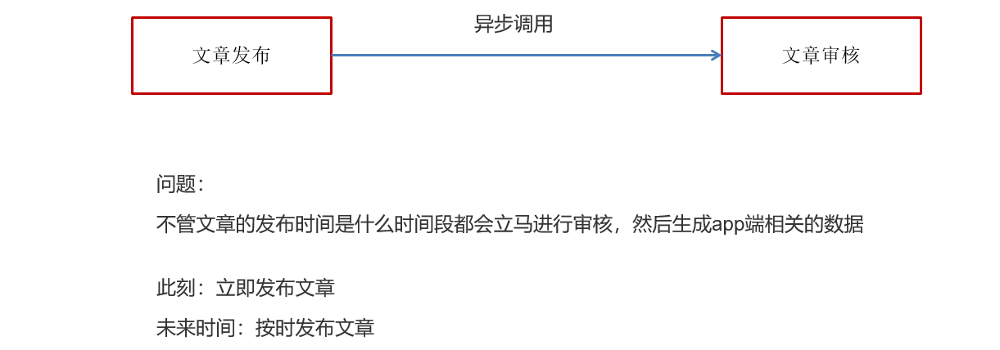  

文章定时发布：需要在未来一个指定的时间发布文章

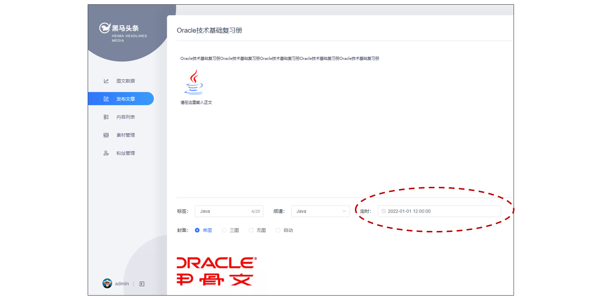    

### 2) 延迟任务概述

#### 2.1)什么是延迟任务

- 定时任务：有固定周期的，有明确的触发时间。**比如每天凌晨一点执行**
- 延迟任务：没有固定的开始时间，它常常是由一个事件触发的，而在**这个事件触发之后的一段时间内**触发另一个事件，任务可以立即执行，也可以延迟


应用场景：

订单下单成功后创建一个取消订单的任务：30分钟后，如果用户没有付钱，则执行任务取消订单；如果期间付款成功，取消任务即可

#### 2.2)技术对比

##### 2.2.1)DelayQueue【了解】

JDK自带DelayQueue 是一个支持延时获取元素的阻塞队列， 内部采用优先队列 PriorityQueue 存储元素，同时元素必须实现 Delayed 接口；在创建元素时可以指定多久才可以从队列中获取当前元素，只有在延迟期满时才能从队列中提取元素


````asciiarmor
优点：使用简单，不用引入任何第三方技术
缺点：使用DelayQueue作为延迟任务，如果程序挂掉之后，由于任务都是放在内存中因此任务会丢失
使用场景：小型单体项目，为了实现延迟功能没有必要引入第三方技术
````

> DelayQueue属于排序队列，它的特殊之处在于队列的元素必须实现Delayed接口，该接口需要实现compareTo和getDelay方法
>
> getDelay方法：获取元素在队列中的剩余时间，只有当剩余时间为0时元素才可以出队列。
>
> compareTo方法：用于排序，确定元素出队列的顺序。

**实现：**

1：在测试包jdk下创建延迟任务元素对象DelayedTask，实现compareTo和getDelay方法，

2：在main方法中创建DelayQueue并向延迟队列中添加三个延迟任务，

3：循环的从延迟队列中拉取任务

```java
public class DelayedTask implements Delayed {
    
    // 任务的执行时间
    private int executeTime = 0;
    
    public DelayedTask(int delay){
        Calendar calendar = Calendar.getInstance();
        calendar.add(Calendar.SECOND,delay);
        this.executeTime = (int)(calendar.getTimeInMillis() /1000 );
    }

    /**
     * 元素在队列中的剩余时间
     * @param unit
     * @return
     */
    @Override
    public long getDelay(TimeUnit unit) {
        Calendar calendar = Calendar.getInstance();
        return executeTime - (calendar.getTimeInMillis()/1000);
    }

    /**
     * 元素排序
     * @param o
     * @return
     */
    @Override
    public int compareTo(Delayed o) {
        long val = this.getDelay(TimeUnit.NANOSECONDS) - o.getDelay(TimeUnit.NANOSECONDS);
        return val == 0 ? 0 : ( val < 0 ? -1: 1 );
    }


    public static void main(String[] args) {
        DelayQueue<DelayedTask> queue = new DelayQueue<DelayedTask>();
        
        queue.add(new DelayedTask(5));
        queue.add(new DelayedTask(10));
        queue.add(new DelayedTask(15));

        System.out.println(System.currentTimeMillis()/1000+" start consume ");
        while(queue.size() != 0){
            DelayedTask delayedTask = queue.poll();
            if(delayedTask !=null ){
                System.out.println(System.currentTimeMillis()/1000+" cosume task");
            }
            //每隔一秒消费一次
            try {
                Thread.sleep(1000);
            } catch (InterruptedException e) {
                e.printStackTrace();
            }
        }     
    }
}
```

##### 2.2.2)RabbitMQ延迟消息

```
高级服务框架：MQ高级-day02
消息中间件：RabbitMQ，RocketMQ（alibaba），Kafka（Apache）,EMQ
```

延时队列顾名思义，即放置在该队列里面的消息是不需要立即消费的，而是等待一段时间之后取出消费。

**实现延时队列方式：**

- 方式一：TTL（Time To Live）+DLX（Dead Letter Exchanges）（**太麻烦，不实用**）

  

  针对Queue设置x-message-ttl 或者 针对Message设置setExpiration ，来控制消息的生存时间，如果超时，则消息变为dead letter(死信)。当消息成为Dead message后，可以重新发送另一个交换机（死信交换机）

  - TTL：Time To Live (消息存活时间)
  - DLX：Dead Letter Exchange(死信交换机)

- **方式二：rabbitmq-delayed-message-exchange插件【简单】**

##### 2.2.3)Redis

```
五种最常用的数据类型：
zset：有序的set集合
set
list
string
hash: java中hashmap
```

利用redis的zset,  有序集合，每一个元素(member)都关联了一个score,通过score排序来取集合中的值。

**回顾Redis中的zset：**

```shell
#添加元素:ZADD key score member [[score member] [score member] …]

#score: 10, member: 10001
zadd order 10 10001

zadd order 10 10002 9 10003

#按顺序查询元素:ZRANGE key start stop [WITHSCORES]
#其中成员的位置按分数值递增(从小到大)来排序。
#下标参数 start 和 stop 都以 0 为底，也就是说，以 0 表示有序集第一个成员
#也可以使用负数下标，以 -1 表示最后一个成员
zrange order 0 -1 withscores
# 输出结果如下：
# 1)  "10003"
# 2)  "9"
# 3)  "10001"
# 4)  "10"
# 5)  "10002"
# 6)  "10"

#如果值递减(从大到小)来排列，使用zrevrange
#reverse: 反转
zrevrange order 0 -1 withscores
# 输出结果如下：
#1) "10002"
#2) "10"
#3) "10001"
#4) "10"
#5) "10003"
#6) "9"

#查询元素score:ZSCORE key member
zscore order 10001
# "10"

#移除元素:ZREM key member [member …]
zrem order 10001
#"1"
```


例如：生产者添加到4个任务到延迟队列中，时间毫秒值分别为97、98、99、100。

当前时间的毫秒值为90，消费者端进行监听，如果当前时间的毫秒值匹配到了延迟队列中的毫秒值就立即消费

**优点：**

实现简单：Redis已经设置好了数据结构zset，保证了顺序

异常恢复：由于使用Redis做为消息通道，消息都存储在Redis中。如果发送程序或者任务处理程序挂了，还有重新处理数据的可能性。

```
Redis如果宕机了，数据还可以恢复（持久化：redis内存中的数据-》持久化硬盘: rdb, aof）
```


#### 2.3)总结

延迟任务的实现方式：

DelayQueue，基于JVM内存

RabbitMQ：延迟交换机插件

**Redis：zset特性（常用，本项目实现）**


### 3) Redis实现延迟任务

#### 3.1)实现思路


#### 3.2)思考

- 为什么任务需要存储在数据库中？

  延迟任务是一个通用的服务，公司里所有项目中需要延迟的任务都可以调用该服务，需要考虑数据持久化

- 为什么redis中使用两种数据类型，list和zset？

  原因一：**list存储立即执行的任务，zset存储未来一段时间要执行的任务**

  原因二：任务量过大以后，zset的性能会下降，**因此只存储未来5分钟要执行的任务**

  时间复杂度：执行时间（次数）随着数据规模增长的变化趋势

  - 操作redis中的list命令LPUSH：时间复杂度： O(1)

  - 操作redis中的zset命令zadd：时间复杂度：O(M*log(n)), M为执行次数，n是成员个数

   

- 在添加zset数据的时候，为什么需要预加载？

  任务模块是一个通用的模块，项目中任何需要延迟队列的地方，都可以调用这个接口，要考虑到数据量的问题，如果数据量特别大，为了防止阻塞，只需要把未来几分钟要执行的数据存入缓存即可。


### 4) 延迟任务服务实现【重点】

#### 4.1)搭建延迟服务

leadnews-schedule是一个通用的服务，单独创建模块来管理任何类型的延迟任务

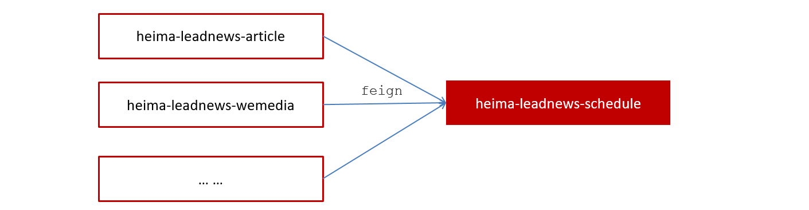

①：导入资料文件夹下的heima-leadnews-schedule模块到heima-leadnews-service下，如下图所示：

 <module>heima-leadnews-schedule</module>

②：添加bootstrap.yml

```yaml
server:
  port: 51701
spring:
  application:
    name: leadnews-schedule
  cloud:
    nacos:
      discovery:
        server-addr: 192.168.200.130:8848
      config:
        server-addr: 192.168.200.130:8848
        file-extension: yml
```

③：在nacos中添加对应配置，并添加数据库及mybatis-plus的配置

Data ID：leadnews-schedule

```yaml
spring:
  datasource:
    driver-class-name: com.mysql.jdbc.Driver
    url: jdbc:mysql://localhost:3306/leadnews_schedule?useUnicode=true&useSSL=false&characterEncoding=UTF-8&serverTimezone=UTC&useSSL=false
    username: root
    password: root
    
# 设置Mapper接口所对应的XML文件位置，如果你在Mapper接口中有自定义方法，需要进行该配置
mybatis-plus:
  mapper-locations: classpath*:mapper/*.xml
  # 设置别名包扫描路径，通过该属性可以给包中的类注册别名
  type-aliases-package: com.heima.model.schedule.pojos
```

#### 4.2)数据库准备

导入资料中leadnews_schedule数据库：

taskinfo 任务表**：保存还未执行的任务（执行过的任务会记录到taskinfo_logs 表中）**

 

````json
#MySQL中，BLOB是一个二进制大型对象，是一个可以存储大量数据的容器；LongBlob 最大存储 4G 
````

taskinfo_logs 任务日志表


#### 并发问题

**数据库自身解决并发两种策略：**

- 悲观锁(Pessimistic Lock)

  每次去拿数据的时候都认为别人会修改，所以每次在拿数据的时候都会上锁

  ```sql
  比如说：准备修改任务id=101数据
  1、select * from taskinfo where task_id = 101 for update;（给这行数据加行级锁）
  2、update taskinfo where task_id = 101 set ....
  3、unlock
  ```

  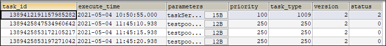 

- 乐观锁(Optimistic Lock)

  每次去拿数据的时候都认为别人不会修改，所以不会上锁，但是在更新的时候会判断一下在此期间别人有没有去更新这个数据，可以使用版本号等机制

  
  
  ```sql
  1、select version from taskinfo where task_id = 101
  2、update taskinfo 
  where task_id = 101 and version=我查询出来的version 
  set status =1, version+=1
  3、更新失败（告知用户，重试）
  ```
  
   

**开启MyBatis Plus乐观锁支持：**

1. 在实体类中TaskinfoLogs使用@Version标明是一个版本的字段

   ```java
   /**
    * 版本号,用乐观锁
    */
   @Version
   private Integer version;
   ```

2. mybatis-plus对乐观锁的支持，在启动类中向容器中放入乐观锁的拦截器

   ```java
   @SpringBootApplication
   @MapperScan("com.heima.schedule.mapper")
   public class ScheduleApplication {
   
       public static void main(String[] args) {
           SpringApplication.run(ScheduleApplication.class,args);
       }
   
       /**
            * mybatis-plus乐观锁支持
            * @return
            */
       @Bean
       public MybatisPlusInterceptor optimisticLockerInterceptor(){
           MybatisPlusInterceptor interceptor = new MybatisPlusInterceptor();
           //乐观锁支持
           interceptor.addInnerInterceptor(new OptimisticLockerInnerInterceptor());
           return interceptor;
       }
   }
   ```
   
3. 测试乐观锁：

   ```java
   package com.heima.schedule.mapper;
   
   import org.junit.jupiter.api.Test;
   import java.util.Date;
   
   @SpringBootTest(classes = ScheduleApplication.class)
   public class TaskinfoLogsMapperTest {
   
       @Autowired
       private TaskinfoLogsMapper taskinfoLogsMapper;
   
       @Test
       public void testInsert() {
           TaskinfoLogs taskinfoLogs = new TaskinfoLogs();
           taskinfoLogs.setExecuteTime(new Date());
           taskinfoLogs.setPriority(1);
           taskinfoLogs.setTaskType(1);
           taskinfoLogs.setVersion(1);
   
           taskinfoLogsMapper.insert(taskinfoLogs);
       }
   
       @Test
       //测试乐观锁
       public void testOptimisticLocker() throws InterruptedException {
           //1.先把要修改的数据查询出来
           TaskinfoLogs taskinfoLogs = taskinfoLogsMapper.selectById(1420369799178907649L);
           System.out.println("当前版本：" + taskinfoLogs.getVersion());
   
           //2.1 准备修改数据，
           taskinfoLogs.setExecuteTime(new Date());
           taskinfoLogs.setPriority(1000);
   
           //准备修改数据时，有其他线程修改了此行数据，相当于version发生了变化
           Thread.sleep(1000 * 15); //通过客户端修改了version
   
           //2.2 执行修改，如果此时数据库中version的值等于第一步查出来的值，则可以修改成功
           //实际执行SQL：
           //UPDATE taskinfo_logs SET execute_time=?, priority=?, version=? WHERE task_id=? AND version=?
           System.out.println("开始执行修改");
           int count = taskinfoLogsMapper.updateById(taskinfoLogs);
           System.out.print(count > 0 ? "修改成功！" : "修改失败！");
           if (count == 0) {
               //1.重试 testLock();
   
               //2.告知调用方：任务修改失败，请重试
           }
       }
   }
   ```
   
   ```asciiarmor
   乐观锁的使用注意事项：
   1、必须在更新之前，先进行查询（更新的时候需要where version =?）
   2、处理更新的结果（成功？失败（有其他人在咱们查询和修改之间改动了这一行数据）？）
   ```
   
   

#### 4.3)安装redis

①拉取镜像

```shell
#删除redis容器
docker rm redis
#docker pull redis #虚拟机中已经有redis的镜像
```

② 创建容器

```shell
#没有设置密码
docker run -d --name redis --restart=always -p 6379:6379 redis

#【可选】创建容器时，设置密码
#docker run -d --name redis --restart=always -p 6379:6379 redis --requirepass "leadnews"
```

③链接测试

通过Redis客户端，输入host、port、password链接测试 


#### 4.4)项目集成redis

heima-leadnews-schedule延迟微服务：

① **检查heima-leadnews-common中导入redis相关依赖**

```xml
<dependency>
    <groupId>org.springframework.boot</groupId>
    <artifactId>spring-boot-starter-data-redis</artifactId>
</dependency>
<!-- redis依赖commons-pool 这个依赖一定要添加 -->
<dependency>
    <groupId>org.apache.commons</groupId>
    <artifactId>commons-pool2</artifactId>
</dependency>
```

② 在heima-leadnews-schedule中集成redis,添加以下nacos配置，链接上redis

Data ID: leadnews-schedule

```yaml
#spring: 放到spring层级下边
  redis: 
    host: 192.168.200.130
    port: 6379
    #password: leadnews
```

③ 拷贝资料文件夹下的类：CacheService到heima-leadnews-common模块下，**并添加自动配置**


④：在heima-leadnews-schedule中测试

```java
package com.heima.schedule.test;

import org.junit.jupiter.api.Test;

@SpringBootTest(classes = ScheduleApplication.class)
public class RedisTest {

    @Autowired
    private CacheService cacheService;
    
    @Test
    public void testList(){
        //在list的左边添加元素
        //cacheService.lLeftPush("list_001","hello,redis1");
        //cacheService.lLeftPush("list_001","hello,redis2");
        //cacheService.lLeftPush("list_001","hello,redis3");

        //在list的右边获取元素，并删除
        String list_001 = cacheService.lRightPop("list_001");
        System.out.println(list_001);
    }

    @Test
    public void testZset(){
        //添加数据到zset中  分值
        /*cacheService.zAdd("zset_key_001","hello zset 001",1000);
        cacheService.zAdd("zset_key_001","hello zset 002",8888);
        cacheService.zAdd("zset_key_001","hello zset 003",7777);
        cacheService.zAdd("zset_key_001","hello zset 004",999999);*/

        //按照分值获取数据：zrange zset_key_001 0 8888 withscores
        Set<String> zset_key_001 = cacheService.zRangeByScore("zset_key_001", 0, 8888);
        System.out.println(zset_key_001);
    }
}
```


#### 4.5)添加任务


##### 0、准备工作

①：拷贝资料中TaskinfoMapper 和TaskinfoLogsMapper到项目中

②：创建task类（Task），用于接收添加任务的参数

③：创建TaskService

```java
package com.heima.schedule.service;

import com.heima.model.schedule.dtos.Task;

/**
 * 对外访问接口
 */
public interface TaskService {

    /**
     * 添加任务
     * @param task   任务对象
     * @return       任务id
     */
    public long addTask(Task task) ;

}
```

④：业务层实现

```java
package com.heima.schedule.service.impl;

import org.springframework.stereotype.Service;

@Service
@Slf4j
public class TaskServiceImpl implements TaskService {
    
    @Autowired
	private CacheService cacheService;
    
	@Autowired
    private TaskinfoMapper taskinfoMapper;

    @Autowired
    private TaskinfoLogsMapper taskinfoLogsMapper;
    
    @Override
    public long addTask(Task task) {
        
        //1.添加任务到数据库中： taskinfo, taskinfo_logs
		//2.添加任务到redis中
        //2.1  如果任务的执行时间小于等于当前时间  存入list
        //2.2  如果任务的执行时间小于等于预设时间（未来5分钟）存入zset中
        
        return 1L;
    }
    
}
```

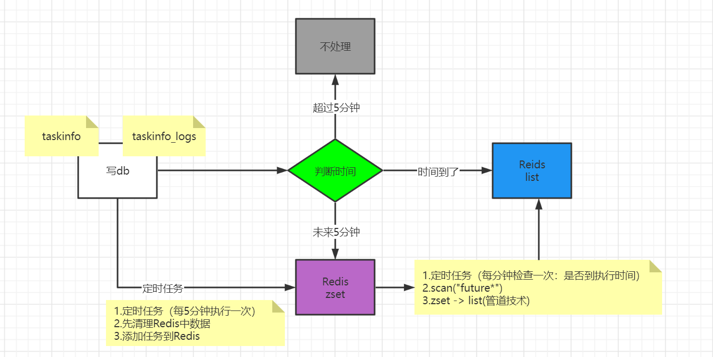

##### 1、添加到数据库-12:06

> 常量类：ScheduleConstants（记录任务状态）
>
> 0=初始化状态
>
> 1=EXECUTED 
>
> 2=CANCELLED

```java
/**
 * 添加到任务到数据库
 */
private long addTaskToDb(Task task) {
    //1.task表
    Taskinfo taskinfo = new Taskinfo();
    BeanUtils.copyProperties(task, taskinfo);
    taskinfo.setExecuteTime(new Date(task.getExecuteTime()));
    
    //1970年1月1号0点0分 -》 现在 == 时间差（当前时间毫秒值）
    taskinfoMapper.insert(taskinfo);
    
    //给task对象赋值id
    task.setTaskId(taskinfo.getTaskId());

    //2.记录任务的日志
    TaskinfoLogs taskinfoLogs = new TaskinfoLogs();
    BeanUtils.copyProperties(taskinfo,taskinfoLogs);
    //taskinfoLogs.setVersion(1); //有默认值
    taskinfoLogs.setStatus(ScheduleConstants.SCHEDULED);
    taskinfoLogsMapper.insert(taskinfoLogs);

    return taskinfo.getTaskId();
}
```

##### 2、添加到Redis-11:14

```java
   /**
    * 添加任务到缓存中
    * @param task
    */
private void addTaskCache(Task task) {

    String key = task.getTaskType()+"_"+task.getPriority();

    //获取5分钟之后的时间  毫秒值
    Calendar calendar = Calendar.getInstance();
    calendar.add(Calendar.MINUTE,5);
    long nextScheduleTime = calendar.getTimeInMillis();

    //2.1  如果任务的执行时间小于等于当前时间  存入list
    if(task.getExecuteTime() <= System.currentTimeMillis()){
        cacheService.lLeftPush("topic_"+key, JSON.toJSONString(task));
    }else if(task.getExecuteTime() <= nextScheduleTime){
        //2.2  如果任务的执行时间大于当前时间，小于等于预设时间（未来5分钟）存入zset中
        cacheService.zAdd("future_"+key,JSON.toJSONString(task),task.getExecuteTime());
    }
}
```


##### 3、完善整体实现

```java
/**
 * 添加任务
 * @param task
 * @return
 */
@Override
@Transactional
public long addTask(Task task) {
    //1.存放到数据库
    long taskId = addTaskToDb(task);
    //2.存放到redis | list 和 zset
    task.setTaskId(taskId);
    addTaskCache(task);
    return taskId;
}
```

##### 4、测试

```java
package com.heima.schedule.service.impl;

import com.heima.model.schedule.dtos.Task;
import org.junit.jupiter.api.Test;
import java.util.Date;

@SpringBootTest(classes = ScheduleApplication.class)
public class TaskServiceImplTest {

    @Autowired
    private TaskService taskService;

    @Test
    public void addTask() {
        Task task = new Task();
        task.setTaskType(100);
        task.setPriority(50);
        task.setParameters("task test".getBytes());
        task.setExecuteTime(new Date().getTime());
        //设置未来5分钟内执行
        //task.setExecuteTime(new Date().getTime() + 4 * 60 * 1000);

        long taskId = taskService.addTask(task);
        System.out.println(taskId);
    }
}
```


#### 4.6)取消任务【可选】

场景：第三接口网络不通，使用延迟任务进行重试，当达到阈值以后，取消任务。

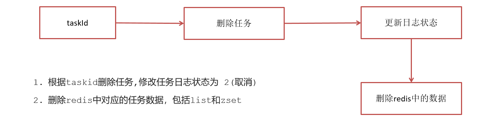

在TaskService中添加方法

```java
/**
     * 取消任务
     * @param taskId        任务id
     * @return              取消结果
     */
public boolean cancelTask(long taskId);
```

TaskServiceImp中实现

```java
/**
     * 取消任务
     * @param taskId
     * @return
     */
@Override
@Transactional
public boolean cancelTask(long taskId) {

   boolean flag = false;
    
    try {
         //删除任务，更新日志: set status = 2
       Task task = updateDb(taskId, ScheduleConstants.CANCELLED);

        //删除redis的数据
        if(task != null){
            removeTaskFromCache(task);
            flag = true;
        }
    } catch(Exception e) {
		log.error(e.getMessage(), e);
        throw e;
    }

    return flag;
}

/**
 * 1.删除任务taskinfo
 * 2.使用乐观锁更新任务日志taskinfo_logs
 */
private Task updateDb(long taskId, int status) {
    //删除任务
    taskinfoMapper.deleteById(taskId);

    //更新任务日志
    //1、使用乐观锁，必须先查询处理
    TaskinfoLogs taskinfoLogs = taskinfoLogsMapper.selectById(taskId);
    taskinfoLogs.setStatus(status);
    //2、修改时，必须保证把原有的version传递过去(所以必须先查询)
    int count = taskinfoLogsMapper.updateById(taskinfoLogs);
    //乐观锁接收返回值
    if(count == 0){
        log.error("当前数据已经被修改" + taskId);
        throw new CustomException(AppHttpCodeEnum.SERVER_ERROR);
    }

    //从Redis中删除数据，不能把整个key删除，因此里边保存了很多任务，
    //删除需要根据两个内容：1.key，2.value
    Task task = new Task();
    BeanUtils.copyProperties(taskinfoLogs, task);
    task.setExecuteTime(taskinfoLogs.getExecuteTime().getTime());

    return task;
}

/**
 * 删除redis中的数据
 */
private void removeTaskFromCache(Task task) {
    String key = task.getTaskType() + "_" + task.getPriority();
    if (task.getExecuteTime() <= System.currentTimeMillis()) {
        //从list中删除
        cacheService.lRemove(ScheduleConstants.TOPIC + key, 0, JSON.toJSONString(task));
    } else {
        //从zset中删除
        cacheService.zRemove(ScheduleConstants.FUTURE + key, JSON.toJSONString(task));
    }
}
```

测试TaskServiceImplTest：

```java
@Test
public void cancelTest() {
    taskService.cancelTask(1393402270461292545L);
}
```


#### 4.7)拉取任务-06:42

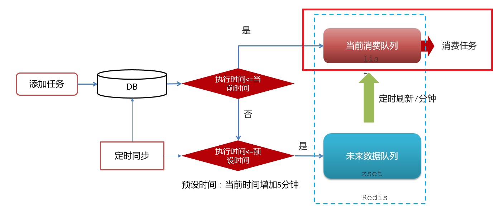

具体执行流程如下：

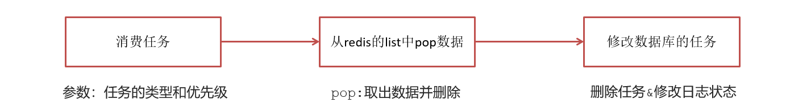

在TaskService中添加方法

```java
/**
 * 按照类型和优先级来拉取任务
 * @param type
 * @param priority
 * @return
 */
public Task poll(int type, int priority);
```

实现

```java
/**
     * 按照类型和优先级拉取任务
     * @return
     */
@Override
public Task poll(int type,int priority) {
    Task task = null;
    try {
        String key = type+"_"+priority;
        //pop = get + delete
        String task_json = cacheService.lRightPop(ScheduleConstants.TOPIC + key);
        if(StringUtils.isNotBlank(task_json)){
            task = JSON.parseObject(task_json, Task.class);
            //更新数据库信息
            updateDb(task.getTaskId(),ScheduleConstants.EXECUTED);
        }
    } catch (Exception e){
        e.printStackTrace();
        log.error("poll task exception");
    }

    return task;
}
```

测试TaskServiceImplTest：

```java
@Test
public void testPoll() {
    Task task = taskService.poll(100, 50);
    System.out.println(task);
}
```

> 1、Redis的list中是否删除了这个任务
>
> 2、taskinfo表数据是否被删除
>
> 3、taskinfo_logs的状态是否更新

#### 4.8)未来数据定时刷新

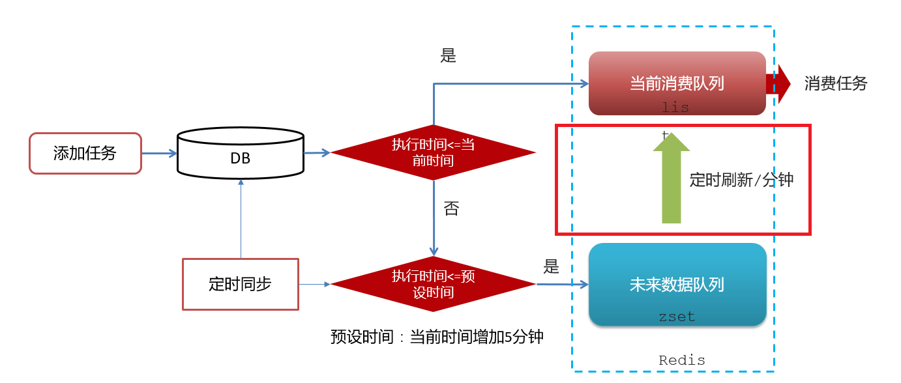

**实现思路：**

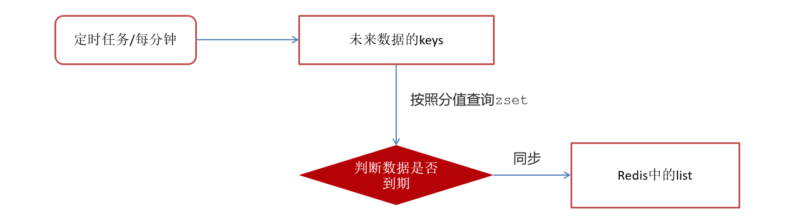

##### 4.8.1)获取未来数据的keys

方案1：keys 模糊匹配**（不实用）**

keys的模糊匹配功能很方便也很强大，但是在生产环境需要慎用！开发中使用keys的模糊匹配却发现redis的CPU使用率极高，所以公司的redis生产环境将keys命令禁用了！redis是单线程，会被堵塞

生产环境一般都会禁用keys *


**方案2：scan （常用）**

SCAN 命令是一个基于游标的迭代器，SCAN命令每次被调用之后， 都会向用户返回一个新的游标， 用户在下次迭代时需要使用这个新游标作为SCAN命令的游标参数， 以此来延续之前的迭代过程。


代码案例：

```java
@Test
public void testKeys(){
    //不使用
    Set<String> keys = cacheService.keys("future_*");
    System.out.println(keys);

    //常用: scan
    Set<String> scan = cacheService.scan("future_*");
    //[future_115_50, future_130_50, future_110_50, future_120_50]
    System.out.println(scan);
}
```

##### 4.8.2)zset数据同步到list

可以分两步完成：

第一：从zset中查出数据，并删除：zrange key

第二：把数据存入到list中: set key

**上述操作中包含3个命令：从zset查询、从zset删除、保存到list**

```
有5个zset的数据到期了需要存到list中：
3个命令() * 5 ==15个命令
```

```sh
1.data = zget("future_110_50")
2.zremove("future_110_50")
3.lpush(data)

1.data = zget("future_120_50")
2.zremove("future_120_50")
3.lpush(data)

1.data = zget("future_130_50")
2.zremove("future_130_50")
3.lpush(data)

1.data = zget("future_140_50")
2.zremove("future_140_50")
3.lpush(data)

1.data = zget("future_150_50")
2.zremove("future_150_50")
3.lpush(data)
```

普通redis客户端和服务器交互模式


单条命令执行过程：

- 客户端把命令发送到服务器，然后阻塞客户端，等待着从socket读取服务器的返回结果
- 服务器处理命令并将结果返回给客户端

**Pipeline管道技术**：是客户端提供的一种批处理技术，用于一次处理多个Redis命令，从而提高整个交互的性能。


官方测试结果数据对比


测试案例对比：

```java
@Test //耗时6151
public void testPiple1(){
    long start =System.currentTimeMillis();
    for (int i = 0; i <10000 ; i++) {
        Task task = new Task();
        task.setTaskType(1001);
        task.setPriority(1);
        task.setExecuteTime(new Date().getTime());
        cacheService.lLeftPush("1001_1", JSON.toJSONString(task));
    }
    System.out.println("耗时"+(System.currentTimeMillis()- start));
}

@Test //耗时1788
public void testPiple2(){
    long start  = System.currentTimeMillis();
    //使用管道技术
    List<Object> objectList = cacheService.getstringRedisTemplate().executePipelined(new RedisCallback<Object>() {
        @Override
        public Object doInRedis(RedisConnection redisConnection) throws DataAccessException {
            for (int i = 0; i <10000 ; i++) {
                Task task = new Task();
                task.setTaskType(1001);
                task.setPriority(1);
                task.setExecuteTime(new Date().getTime());
                redisConnection.lPush("1001_1".getBytes(), JSON.toJSONString(task).getBytes());
            }
            return null;
        }
    });
    System.out.println("使用管道技术执行10000次自增操作共耗时:"+(System.currentTimeMillis()-start)+"毫秒");
}
```


##### 4.8.3)代码实现-08:20

Cron表达式：是一个字符串, 用来设置定时规则, 由七部分组成, 每部分中间用空格隔开, 每部分的含义如下表所示:

| **组成部分** |     **含义**      |       **取值范围**        |
| :----------: | :---------------: | :-----------------------: |
|   第一部分   |   Seconds (秒)    |           0－59           |
|   第二部分   |    Minutes(分)    |           0－59           |
|   第三部分   |     Hours(时)     |           0-23            |
|   第四部分   | Day-of-Month(天)  |           1-31            |
|   第五部分   |     Month(月)     |       0-11或JAN-DEC       |
|   第六部分   | Day-of-Week(星期) | 1-7(1表示星期日)或SUN-SAT |
|   第七部分   |   Year(年) 可选   |         1970-2099         |

详细介绍见：Cron表达式.md

[quartz/Cron/Crontab表达式在线生成工具-BeJSON.com](https://www.bejson.com/othertools/cron/)

在TaskService中添加方法

```java
@Scheduled(cron = "0 */1 * * * ?") //每分钟执行一次
public void refresh() {
    log.info("未来数据定时刷新---定时任务");
    //获取所有未来数据的集合key
    Set<String> futureKeys = cacheService.scan(ScheduleConstants.FUTURE + "*");
    for (String futureKey : futureKeys) {//future_100_50
        //按照key和分值查询符合条件的数据
        Set<String> tasks = cacheService.zRangeByScore(futureKey, 0,
                System.currentTimeMillis());
        //同步数据
        if (!tasks.isEmpty()) { //到时间执行的任务，添加到list中
            //获取当前数据的key：topic开头  
            //future_100_50 -> topic_100_50
            String topicKey = futureKey.replace(ScheduleConstants.FUTURE, ScheduleConstants.TOPIC);

            cacheService.refreshWithPipeline(futureKey, topicKey, tasks);
            log.info("成功的将" + futureKey + "刷新到了" + topicKey);
        }
    }
}
```

在引导类中添加开启任务调度注解：`@EnableScheduling`

```java
@SpringBootApplication
@MapperScan("com.heima.schedule.mapper")
@EnableScheduling  //开启调度任务
public class ScheduleApplication {
}
```

#### 4.9)集群下的方法抢占执行-09:16

##### 4.9.1)问题描述

启动两台heima-leadnews-schedule服务，每台服务都会去执行refresh定时任务方法


##### 4.9.2)分布式锁

分布式锁：控制分布式系统有序的去对共享资源进行操作，通过互斥来保证数据的一致性。

解决方案：


##### 4.9.3)Redis分布式锁

```
setnx: set if not exist(如果不存在再执行)
```

setnx（SET if Not eXists） 命令在指定的 key 不存在时，为 key 设置指定的值。

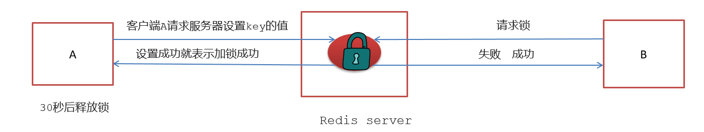

这种加锁的思路是，如果 key 不存在则为 key 设置 value，如果 key 已存在则 SETNX 命令不做任何操作

- 客户端A请求服务器设置key的值，如果设置成功就表示加锁成功
- 客户端B也去请求服务器设置key的值，如果返回失败，那么就代表加锁失败
- 客户端A执行代码完成，删除锁
- 客户端B在等待一段时间后再去请求设置key的值，设置成功
- 客户端B执行代码完成，删除锁

##### 4.9.4)实现分布式锁

在工具类CacheService中添加方法

```java
/**
 * 加锁
 *
 * @param name
 * @param expire
 * @return
 */
public String tryLock(String name, long expire) {
    name = name + "_lock";
    String token = UUID.randomUUID().toString();
    RedisConnectionFactory factory = stringRedisTemplate.getConnectionFactory();
    RedisConnection conn = factory.getConnection();
    try {
        //参考redis命令：
        //set key value [EX seconds] [PX milliseconds] [NX|XX]
        Boolean result = conn.set(
                name.getBytes(), //key
                token.getBytes(), //value
                Expiration.from(expire, TimeUnit.MILLISECONDS), //设置过期时间
                RedisStringCommands.SetOption.SET_IF_ABSENT //sexnx:set if not exist
        );
        if (result != null && result) {
            return token;
        }
    } finally {
        RedisConnectionUtils.releaseConnection(conn, factory,false);
    }
    return null;
}
```

修改未来数据定时刷新的方法，如下：

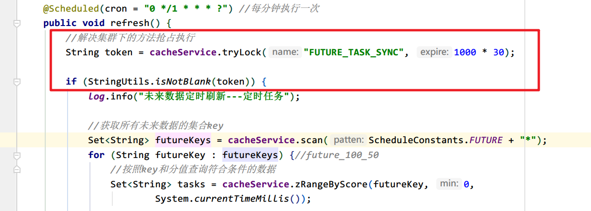

```java
/**
 * 未来数据定时刷新
 */
@Scheduled(cron = "0 */1 * * * ?")
public void refresh(){

    String token = cacheService.tryLock("FUTURE_TASK_SYNC", 1000 * 30);
    if(StringUtils.isNotBlank(token)){
       //省略原有代码...
    }
}
```


#### 4.10)数据库同步到redis-14:39

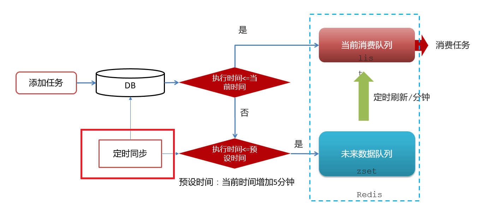

在TaskServiceImpl中添加方法

```java
@Scheduled(cron = "0 */5 * * * ?") //每五分钟同步一次
@PostConstruct //项目启动，Spring初始化对象时执行
public void reloadData() {
    // 清除缓存中原有的数据
    clearCache();
    
    log.info("数据库数据同步到缓存");
    Calendar calendar = Calendar.getInstance();
    calendar.add(Calendar.MINUTE, 5);

    //查看小于未来5分钟的所有任务
    List<Taskinfo> allTasks = taskinfoMapper.selectList(
            Wrappers.<Taskinfo>lambdaQuery().lt(Taskinfo::getExecuteTime, calendar.getTime()));
    if (allTasks != null && allTasks.size() > 0) {
        for (Taskinfo taskinfo : allTasks) {
            Task task = new Task();
            BeanUtils.copyProperties(taskinfo, task);
            task.setExecuteTime(taskinfo.getExecuteTime().getTime());
            addTaskToCache(task);
        }
    }
}

/**
 * 清理缓存中的数据
 */
private void clearCache() {
    // 删除缓存中未来数据集合和当前消费者队列的所有key
    // topic_
    Set<String> topickeys = cacheService.scan(ScheduleConstants.TOPIC + "*");
    // future_
    Set<String> futurekeys = cacheService.scan(ScheduleConstants.FUTURE + "*");

    cacheService.delete(futurekeys);
    cacheService.delete(topickeys);
}
```


### 5)集成到文章审核

#### 5.1)延迟任务接口定义

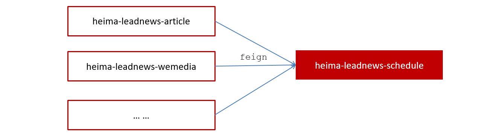

提供远程的feign接口，在**heima-leadnews-feign-api**编写接口如下：

```java
package com.heima.apis.schedule;

@FeignClient("leadnews-schedule")
public interface IScheduleClient {

    /**
     * 添加任务
     * @param task   任务对象
     * @return       任务id
     */
    @PostMapping("/api/v1/task/add")
    public ResponseResult addTask(@RequestBody Task task);

    /**
     * 取消任务
     * @param taskId        任务id
     * @return              取消结果
     */
    @GetMapping("/api/v1/task/cancel/{taskId}")
    public ResponseResult cancelTask(@PathVariable("taskId") long taskId);

    /**
     * 消费任务：按照类型和优先级来拉取任务
     * @param type
     * @param priority
     * @return
     */
    @GetMapping("/api/v1/task/poll/{type}/{priority}")
    public ResponseResult poll(@PathVariable("type") int type,@PathVariable("priority")  int priority);
}
```

在**heima-leadnews-schedule**微服务下提供对应的实现

```java
package com.heima.schedule.feign;

@RestController
public class ScheduleClient implements IScheduleClient {

    @Autowired
    private TaskService taskService;

    /**
     * 添加任务
     * @param task 任务对象
     * @return 任务id
     */
    @PostMapping("/api/v1/task/add")
    @Override
    public ResponseResult addTask(@RequestBody Task task) {
        return ResponseResult.okResult(taskService.addTask(task));
    }

    /**
     * 取消任务
     * @param taskId 任务id
     * @return 取消结果
     */
    @GetMapping("/api/v1/task/cancel/{taskId}")
    @Override
    public ResponseResult cancelTask(@PathVariable("taskId") long taskId) {
        return ResponseResult.okResult(taskService.cancelTask(taskId));
    }

    /**
     * 按照类型和优先级来拉取任务
     * @param type
     * @param priority
     * @return
     */
    @GetMapping("/api/v1/task/poll/{type}/{priority}")
    @Override
    public ResponseResult poll(@PathVariable("type") int type, @PathVariable("priority") int priority) {
        return ResponseResult.okResult(taskService.poll(type,priority));
    }
}
```


#### 5.2)文章审核添加延迟任务-15:56

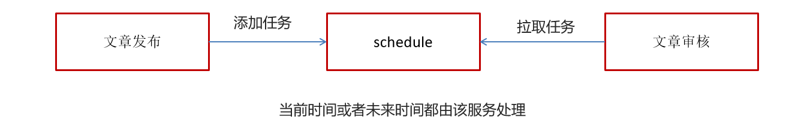

在**heima-leadnews-wemedia**中创建WmNewsTaskService

```java
package com.heima.wemedia.service;

import com.heima.model.wemedia.pojos.WmNews;


public interface WmNewsTaskService {

    /**
     * 添加任务到延迟队列中
     * @param wmNews
     */
    public void addNewsToTask(WmNews wmNews);

}
```

枚举类：

```java
package com.heima.model.common.enums;

import lombok.AllArgsConstructor;
import lombok.Getter;

@Getter
@AllArgsConstructor
public enum TaskTypeEnum {

    NEWS_SCAN_TIME(1001, 1,"文章定时审核"),
    REMOTEERROR(1002, 2,"第三方接口调用失败，重试");
    
    private final int taskType; //对应具体业务
    private final int priority; //业务不同级别
    private final String desc; //描述信息
}
```

序列化工具对比

- JdkSerialize：java内置的序列化能将实现了Serilazable接口的对象进行序列化和反序列，ObjectOutputStream的writeObject()方法可序列化对象生成字节数组
- Protostuff：google开源的protostuff采用更为紧凑的二进制数组，表现更加优异，然后使用protostuff的编译工具生成pojo类

拷贝资料中的两个类到heima-leadnews-utils下，并且添加Protostuff依赖：

```xml
<dependency>
    <groupId>io.protostuff</groupId>
    <artifactId>protostuff-core</artifactId>
    <version>1.6.0</version>
</dependency>

<dependency>
    <groupId>io.protostuff</groupId>
    <artifactId>protostuff-runtime</artifactId>
    <version>1.6.0</version>
</dependency>
```

性能对比测试：

```java
/**
 * jdk序列化与protostuff序列化对比
 * @param args
 */
public static void main(String[] args) {
    long start =System.currentTimeMillis();
    for (int i = 0; i <100000 ; i++) {
        WmNews wmNews =new WmNews();
        JdkSerializeUtil.serialize(wmNews);
    }
    System.out.println(" jdk 花费 "+(System.currentTimeMillis()-start));

    start =System.currentTimeMillis();
    for (int i = 0; i <100000 ; i++) {
        WmNews wmNews =new WmNews();
        ProtostuffUtil.serialize(wmNews);
    }
    System.out.println(" protostuff 花费 "+(System.currentTimeMillis()-start));
}
```

实现：

```java
package com.heima.wemedia.service.impl;

@Service
@Slf4j
public class WmNewsTaskServiceImpl  implements WmNewsTaskService {

    @Autowired
    private IScheduleClient scheduleClient;

    /**
     * 添加任务到延迟队列中
     * @param wmNews
     */
    @Override
    public void addNewsToTask(WmNews wmNews) {
        log.info("---------添加任务到延迟队列中------begin--------");
        Task task = new Task();
        task.setExecuteTime(wmNews.getPublishTime().getTime());
        task.setTaskType(TaskTypeEnum.NEWS_SCAN_TIME.getTaskType());
        task.setPriority(TaskTypeEnum.NEWS_SCAN_TIME.getPriority());
        //二进制大对象：将Java对象序列化成二进制数组
        task.setParameters(ProtostuffUtil.serialize(wmNews));

        scheduleClient.addTask(task);
        log.info("----------添加任务到延迟队列中------end-------------");
    }
    
}
```

测试：

1. 修改发布文章实现：使用延迟队列发布文章

   WmNewsServiceImpl.submitNews方法

   ```java
   //审核文章
   //wmNewsAutoScanService.autoScanWmNews(wmNews);
   
   //审核做为延迟任务
   wmNewsTaskService.addNewsToTask(wmNews);
   ```

2. 添加任务设置成异步执行：@Async

   ```java
   /**
    * 添加任务到延迟队列中
    * @param wmNews
    */
   @Async
   @Override
   public void addNewsToTask(WmNews wmNews) {
   }
   ```

   


#### 5.3)消费任务审核文章-08:27

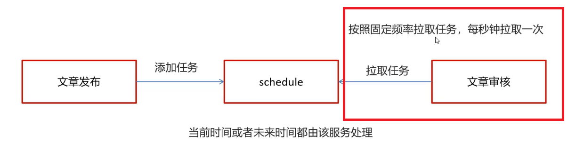

WmNewsTaskService中添加方法

```java
/**
 * 消费延迟队列数据
 */
public void scanNewsByTask();
```

实现

```java
@Autowired
private WemediaNewsAutoScanService wemediaNewsAutoScanService;

/**
 * 消费延迟队列数据
 */
@Scheduled(fixedRate = 1000) //每隔一秒执行一次
@Override
public void scanNewsByTask() {
    log.info("消费任务，审核文章");
    //自媒体微服务 -》 远程调用 -》延迟微服务 -> Redis的List集合中拉取任务
    ResponseResult responseResult = scheduleClient.poll(
            TaskTypeEnum.NEWS_SCAN_TIME.getTaskType(), TaskTypeEnum.NEWS_SCAN_TIME.getPriority());
    if(responseResult.getCode().equals(AppHttpCodeEnum.SUCCESS.getCode())
            && responseResult.getData() != null){
        Task task = JSON.parseObject(JSON.toJSONString(responseResult.getData()), Task.class);
        //将数据库中存储的二进制文章内容反序列化成Java对象
        WmNews wmNews = ProtostuffUtil.deserialize(task.getParameters(), WmNews.class);
        log.info("执行任务ID：" + task.getTaskId() + ", 审核文章ID：" + wmNews.getId());
        //自媒体微服务 -》 远程调用 -》文章微服务 -》 完成文章审核（文本+图片阿里云审核）
        wmNewsAutoScanService.autoScanWmNews(wmNews.getId());
    }
}
```

在WemediaApplication自媒体的引导类中添加开启任务调度注解`@EnableScheduling`

```java
@SpringBootApplication
@EnableDiscoveryClient
@MapperScan("com.heima.wemedia.mapper")
@EnableFeignClients(basePackages = "com.heima.apis")
@EnableAsync  //开启异步调用
@EnableScheduling  //开启调度任务
public class WemediaApplication {
}
```


#### 5.4集成测试

1. 启动服务
   - 延迟服务：ScheduleApplication
   
  ```asciiarmor
     注意顺序：审核需要调用文章服务，因此先启动文章服务
  ```

- 自媒体网关服务：WemediaGatewayAplication
  
   - 文章服务：ArticleApplication
- 自媒体服务：WemediaApplication
  

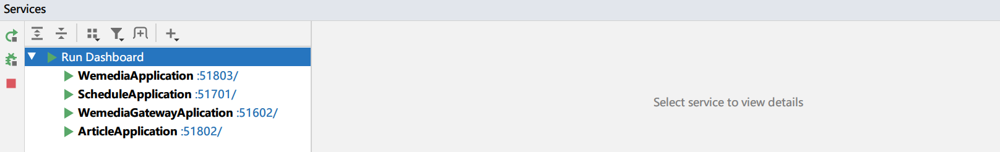

2. 检查是否启动Nginx

3. 测试发布文章：（选择不同的时间发布：）

   > 1、此刻：立即发布（Redis的list）
   >
   > 2、未来5分钟之内（Reids的zset --> list-->删除）
   >
   > 3、大于5分钟（只存在于MySQL）

4. 查看任务表数据：leadnews_schedule的taskinfo表、taskinfo_logs表

5. 打开Redis客户端查看任务数据

6. 拉取之后，就是文章审核：到文章列表中观察审核结果：http://localhost:8802/#/article/list

     

   

