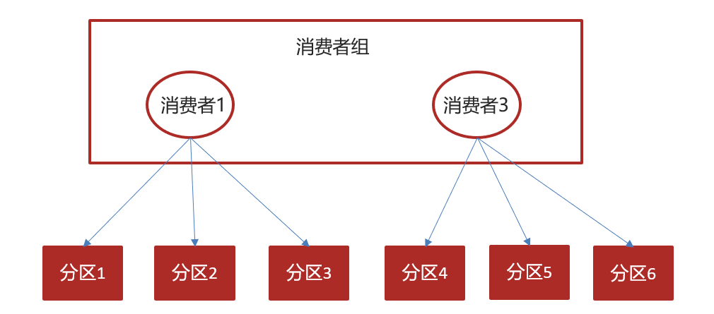

## day06-自媒体文章上下架

### 0)今日菜单

1.  消息中间件kafka
2.  **SpringBoot集成Kafka（重点）**
3.  **文章上下架（重点）**

### 1)自媒体文章上下架

需求分析：


实现方式：

```
通讯方式：
1、同步：feign
2、异步：发消息
消息中间件：rabbitmq, rockemq(alibaba), kafka(apache)
```


消息通知的其他需求：


### 2)kafka概述

#### 2.1)消息中间件对比 

                             

#### 2.2)选择建议

| **消息中间件** | **建议**                                                     |
| -------------- | ------------------------------------------------------------ |
| Kafka          | 追求高吞吐量，适合产生大量数据的互联网服务的数据收集业务     |
| RocketMQ       | 可靠性要求很高的金融互联网领域,稳定性高，经历了多次阿里双11考验 |
| RabbitMQ       | 性能较好，社区活跃度高，数据量没有那么大，优先选择功能比较完备的RabbitMQ |

#### 2.3)kafka介绍

Kafka 是一个分布式流媒体平台,类似于消息队列或企业消息传递系统。kafka官网：http://kafka.apache.org/  


名词解释

- producer：发布消息的对象称之为消息生产者
- consumer：订阅消息并处理发布的消息的对象称之为主题消费者
- topic：Kafka将消息分门别类，每一类的消息称之为一个主题
- broker：已发布的消息保存在一组服务器中，称之为Kafka集群。集群中的每一个服务器都是一个代理（Broker）。 消费者可以订阅一个或多个主题（topic），并从Broker拉数据，从而消费这些已发布的消息。


### 3)kafka安装配置

Kafka（3.0以下）对于zookeeper(注册中心)是强依赖，保存kafka相关的节点数据，所以安装Kafka之前必须先安装zookeeper

```
注册中心：naocs, eureka, zookeeper
```

- 删除之前的容器

    ```
docker rm zookeeper kafka
    ```
    
- Docker安装zookeeper

    ```shell
#下载镜像：
    #docker pull zookeeper:3.4.14
    
    #创建容器
    docker run -d --name zookeeper -p 2181:2181 zookeeper:3.4.14
    
    #等一会，需要保证zookeeper启动成功
    #查看日志
    docker logs zookeeper
    #看到：binding to port 0.0.0.0/0.0.0.0:2181，代表启动成功
    ```
    
- Docker安装kafka

    ```shell
#下载镜像：
    #docker pull wurstmeister/kafka:2.12-2.3.1
    
    #创建容器
    docker run -d --name kafka \
        --env KAFKA_ADVERTISED_HOST_NAME=192.168.200.130 \
        --env KAFKA_ZOOKEEPER_CONNECT=192.168.200.130:2181 \
        --env KAFKA_ADVERTISED_LISTENERS=PLAINTEXT://192.168.200.130:9092 \
        --env KAFKA_LISTENERS=PLAINTEXT://0.0.0.0:9092 \
        --env KAFKA_HEAP_OPTS="-Xmx256M -Xms256M" \
        --net=host wurstmeister/kafka:2.12-2.3.1
        
    #--net=host，直接使用容器宿主机的网络命名空间， 即没有独立的网络环境。它使用宿主机的ip和端口
    
    #查看kafka日志
    docker logs --tail 10 -f kafka
    #启动成功：INFO [KafkaServer id=1001] started (kafka.server.KafkaServer)
    ```
    

### 4)kafka入门【原生】【了解】


#### 4.1)生产者发送消息-09:21

在heima-leadnews-test模块下创建kafka-demo项目，导入依赖

```xml
<dependencies>
    <dependency>
        <groupId>org.apache.kafka</groupId>
        <artifactId>kafka-clients</artifactId>
    </dependency>
</dependencies>
```

在resources下创建logback.xml：

```xml
<?xml version="1.0" encoding="UTF-8"?>

<configuration>

    <!-- Console 输出设置 -->
    <appender name="CONSOLE" class="ch.qos.logback.core.ConsoleAppender">
        <encoder>
            <!--格式化输出：%d表示日期，%thread表示线程名，%-5level：级别从左显示5个字符宽度%msg：日志消息，%n是换行符-->
            <pattern>%d{yyyy-MM-dd HH:mm:ss.SSS} [%thread] %-5level %logger{36} - %msg%n</pattern>
            <charset>utf8</charset>
        </encoder>
    </appender>

    <logger name="org.apache.ibatis.cache.decorators.LoggingCache" level="DEBUG" additivity="false">
        <appender-ref ref="CONSOLE"/>
    </logger>
    <logger name="org.springframework.boot" level="info"/>
    <root level="info">
        <appender-ref ref="CONSOLE"/>
    </root>
</configuration>
```

编写代码：


```java
package com.heima.kafka.sample;

import org.apache.kafka.clients.producer.KafkaProducer;
import org.apache.kafka.clients.producer.ProducerConfig;
import org.apache.kafka.clients.producer.ProducerRecord;

import java.util.Properties;

/**
 * 生产者
 */
public class ProducerQuickStart {

    public static void main(String[] args) {
        //1.kafka的配置信息
        Properties properties = new Properties();
        //kafka的连接地址
        properties.put(ProducerConfig.BOOTSTRAP_SERVERS_CONFIG,"192.168.200.130:9092");
        //发送失败，失败的重试次数
        properties.put(ProducerConfig.RETRIES_CONFIG,5);
        //消息key的序列化器
        properties.put(ProducerConfig.KEY_SERIALIZER_CLASS_CONFIG,"org.apache.kafka.common.serialization.StringSerializer");
        //消息value的序列化器
        properties.put(ProducerConfig.VALUE_SERIALIZER_CLASS_CONFIG,"org.apache.kafka.common.serialization.StringSerializer");

        //2.生产者对象
        KafkaProducer<String,String> producer = new KafkaProducer<String, String>(properties);

        //封装发送的消息
        ProducerRecord<String,String> record = 
            new ProducerRecord<String, String>("itheima-topic","100001","hello kafka");

        //3.发送消息
        producer.send(record);

        //4.关闭消息通道，必须关闭，否则消息发送不成功
        producer.close();
    }

}
```


#### 4.2)消费者接收消息-11:47

 

```java
package com.heima.kafka.sample;

import org.apache.kafka.clients.consumer.ConsumerConfig;
import org.apache.kafka.clients.consumer.ConsumerRecord;
import org.apache.kafka.clients.consumer.ConsumerRecords;
import org.apache.kafka.clients.consumer.KafkaConsumer;

import java.time.Duration;
import java.util.Collections;
import java.util.Properties;

/**
 * 消费者
 */
public class ConsumerQuickStart {

    public static void main(String[] args) {
        //1.添加kafka的配置信息
        Properties properties = new Properties();
        //kafka的连接地址
        properties.put(ConsumerConfig.BOOTSTRAP_SERVERS_CONFIG, "192.168.200.130:9092");
        //消费者组
        properties.put(ConsumerConfig.GROUP_ID_CONFIG, "group2");
        //消息的反序列化器
        properties.put(ConsumerConfig.KEY_DESERIALIZER_CLASS_CONFIG, "org.apache.kafka.common.serialization.StringDeserializer");
        properties.put(ConsumerConfig.VALUE_DESERIALIZER_CLASS_CONFIG, "org.apache.kafka.common.serialization.StringDeserializer");

        //2.消费者对象
        KafkaConsumer<String, String> consumer = new KafkaConsumer<String, String>(properties);

        //3.订阅主题
        consumer.subscribe(Collections.singletonList("itheima-topic"));

        while (true) {
            //4.获取消息：每秒钟拉取一次消息
            ConsumerRecords<String, String> consumerRecords = consumer.poll(Duration.ofMillis(1000));
            for (ConsumerRecord<String, String> consumerRecord : consumerRecords) {
                System.out.println(consumerRecord.key());
                System.out.println(consumerRecord.value());
            }
        }

    }

}
```

#### 4.3)多消费者

- 生产者发送消息，多个消费者组订阅同一个主题，只能有一个消费者收到消息（一对一）

  ```java
  //设置相同的消费者组
  prop.put(ConsumerConfig.GROUP_ID_CONFIG, "group1");
  ```

  

- 生产者发送消息，多个消费者的多个组订阅同一个主题，**所有消费者都能收到消息（广播）**

  测试：每个消费者设置不同的消费组
  
  第一个消费者设置 group1：
  
  ```
  //设置相同的消费者组
  prop.put(ConsumerConfig.GROUP_ID_CONFIG, "group1");
  ```
  
  第二个消费者设置 group2：
  
  ```
  //设置相同的消费者组
  prop.put(ConsumerConfig.GROUP_ID_CONFIG, "group2");
  ```
  
  


### 5)kafka高可用设计

#### 5.1)分区机制(Partition)


Kafka 中的分区机制指的是将每个主题划分成多个分区（Partition），和分片类似

**优势：可以处理更多的消息，不受单台服务器的限制，可以不受限的处理更多的数据**

##### 5.1.1)topic剖析

一个 topic 可以包含多个分区partition，topic 消息保存在各个 partition 上；

由于一个 topic 能被分到多个分区上，给 kafka 提供给了并行的处理能力，这也正是 kafka 高吞吐的原因之一。

 

**每一个分区都是一个顺序的、不可变的消息队列， 并且可以持续的添加**。

分区中的消息都被分了一个序列号，称之为偏移量(offset)，在每个分区中此偏移量都是唯一的。

> 分区数量默认为1，可以在config/server.properties中num.partitions=n配置
>

##### 5.1.2)分区策略

> 默认采用轮询策略，如果发送消息时指定了key则采用按键保存策略


按键保存策略：


直接指定分区：（不建议使用）


#### 5.2)集群


- Kafka 的服务器端由被称为 Broker 的服务进程构成，即一个 Kafka 集群由多个 Broker 组成

- 这样如果集群中某一台机器宕机，其他机器上的 Broker 也依然能够对外提供服务。

- **既然集群中有多个broker，那就必须在集群之间进行数据同步**

#### 5.3)备份机制


Kafka 中消息的备份又叫做副本（Replica），其中副本又分为两种类型：

- 领导者副本（Leader Replica）

- 追随者副本（Follower Replica）（follow: 跟随）

##### 5.3.1)数据同步

在 Kafka 中的 Partition 有一个 leader 与多个 follower，producer 往某个 Partition 中写入数据时，只会往 leader 中写入数据，然后数据会被同步进其他的 follower中。而每一个 follower 可以理解成一个消费者，定期去 leader 拉取消息。而只有数据同步之后，kafka 才会给生产者返回一个 ACK 告知消息已经存储落地了。


##### 5.3.2)同步方式

kafka不是完全同步，也不是完全异步，是一种特殊的ISR（In Sync Replica）；为了保证性能，Kafka 不会采用强一致性的方式来同步主从的数据。

- 在 Kafka 中维护了一个：in-sync Replica 的列表，Leader 不需要等待所有 Follower 都完成同步，只要在 ISR 中的 Follower 完成数据同步就可以发送 ack 给生产者即可认为**消息同步完成**
- 同时如果发现 ISR 里面某一个 follower 落后太多的话，就会把它剔除。
- 要保证kafka不丢失message，就要保证ISR这组集合存活（至少有一个存活），并且消息commit成功。

##### 5.3.3)故障恢复

如果leader宕机后，需要选出新的leader，选举的原则如下：

第一：选举时优先从ISR中选定，因为这个列表中follower的数据是与leader同步的

第二：如果ISR列表中的follower都不行了，就只能从其他follower中选取

> 极端情况，就是所有副本都失效了，这时有两种方案
>
> 第一：等待ISR中的一个活过来，选为Leader，数据可靠，但活过来的时间不确定
>
> 第二：选择第一个活过来的Replication，不一定是ISR中的，选为leader，以最快速度恢复可用性，但数据不一定完整


### 6)kafka生产者详解

#### 6.1)发送类型

- 同步发送：调用send(ProducerRecord<K, V> record)，会返回一个Future对象，调用get()方法进行等待，就可以知道消息是否发送成功 

   ```java
   RecordMetadata recordMetadata = producer.send(record).get();
   System.out.println(recordMetadata.offset());
   ```
   
- 异步发送，调用send(ProducerRecord<K, V> record, Callback callback)，指定一个回调函数，服务器在返回响应时调用函数

   ```java
   //异步消息发送
   producer.send(record, new Callback() {
       @Override
       public void onCompletion(RecordMetadata recordMetadata, Exception e) {
           if(e != null){
               System.out.println("记录异常信息到日志表中");
           }
           System.out.println(recordMetadata.offset());
       }
   });
   ```
   
   

#### 6.2)参数详解-08:30

##### 6.2.1)消息确认机制ack


代码的配置方式：

```java
//ack配置  消息确认机制
properties.put(ProducerConfig.ACKS_CONFIG,"1");
```

参数的选择说明

| **确认机制**     | **说明**                                                     |
| ---------------- | ------------------------------------------------------------ |
| acks=0           | 生产者在成功写入消息之前不会等待任何来自服务器的响应,消息有丢失的风险，但是速度最快 |
| acks=1（默认值） | 只要集群首领节点收到消息，生产者就会收到一个来自服务器的成功响应 |
| acks=all         | 只有当所有参与赋值的节点全部收到消息时，生产者才会收到一个来自服务器的成功响应 |

##### 6.2.2)重试机制retries


生产者从服务器收到的错误有可能是临时性错误，在这种情况下，retries参数的值决定了生产者可以重发消息的次数，如果达到这个次数，生产者会放弃重试返回错误，默认情况下，生产者会在每次重试之间等待100ms

代码中配置方式：

```java
//重试次数
properties.put(ProducerConfig.RETRIES_CONFIG, 10);
```

##### 6.2.3)消息压缩

**默认情况下， 消息发送时不会被压缩。**

代码中配置方式：

```java
//数据压缩
properties.put(ProducerConfig.COMPRESSION_TYPE_CONFIG,"lz4");
```

| **压缩算法** | **说明**                                                     |
| ------------ | ------------------------------------------------------------ |
| snappy       | 占用较少的  CPU，  却能提供较好的性能和相当可观的压缩比， 如果看重性能和网络带宽，建议采用 |
| lz4          | 占用较少的 CPU， 压缩和解压缩速度较快，压缩比也很客观        |
| gzip         | 占用较多的  CPU，但会提供更高的压缩比，网络带宽有限，可以使用这种算法 |

使用压缩可以降低网络传输开销和存储开销，而这往往是向 Kafka 发送消息的瓶颈所在。


### 7)kafka消费者详解【了解】

#### 7.1)消费者组


- 消费者组（Consumer Group） ：指的就是由一个或多个消费者组成的群体

- 一个发布在Topic上消息被分发给此消费者组中的一个消费者

  ```
 //消费者组
  properties.put(ConsumerConfig.GROUP_ID_CONFIG, "group2");
  ```
  
  - 所有消费者都在**一个组中**，那么这就变成了queue模型（一个消息只能被一个消费者获取到，分工合作）
  
  - 所有的消费者都在**不同的组中**，那么就完全变成了发布-订阅模型（广播）

#### 7.2)消息有序性

应用场景：

- 即时消息中的单对单聊天和群聊，保证发送方消息发送顺序与接收方的顺序一致
- 充值转账两个渠道在同一个时间进行余额变更，短信通知必须要有顺序
- ......


topic分区中消息只能由消费者组中的唯一一个消费者处理，所以消息肯定是按照先后顺序进行处理的。但是它也

仅仅是保证Topic的一个分区顺序处理，不能保证跨分区的消息先后处理顺序。

**所以 Kafka 要保证消息的消费顺序，可以有2种方法：**

**一、1个Topic（主题）只创建1个Partition(分区)，这样生产者的所有数据都发送到了一个Partition(分区)，保证了消息的消费顺序。**(不实用)

**二、生产者在发送消息的时候指定要发送到哪个Partition(分区)。**

 

1）指明 partition 的情况下，直接将指明的值直接作为 partiton 值；


2）指定key：具有同1个 key 的所有消息，会发往同1个 partition。也是有序的。


```java
ProducerRecord<String,String> record =
        new ProducerRecord<>("itheima-topic","zhangsan-chat","hello kafka");
```


#### 7.3)消费者提交消息的偏移量

kafka不会像其他JMS队列那样需要得到消费者的确认，消费者可以使用kafka来追踪消息在分区的位置（偏移量）

消费者会往一个叫做_consumer_offset的特殊主题发送消息，消息里包含了每个分区的偏移量。如果消费者发生崩溃或有新的消费者加入群组，就会触发再均衡。

- 正常的情况：


- 如果消费者2挂掉以后，会发生再均衡，消费者2负责的分区会被其他消费者进行消费，再均衡后不可避免会出现一些问题




问题一：如果提交偏移量小于客户端处理的最后一个消息偏移量，那么处于两个偏移量之间的消息就会被重复处理

问题二：如果提交的偏移量大于客户端的最后一个消息的偏移量，那么处于两个偏移量之间的消息将会丢失。

因此消费者**提交消息的偏移量**就变得尤其重要，Kafka提交偏移量的方式有两种：

- **自动提交偏移量（默认方式）**

  当enable.auto.commit被设置为true，提交方式就是让消费者自动提交偏移量，每隔5秒消费者会自动把从

  poll()方法接收的最大偏移量提交上去

  ```
  注意：Kafka 自动提交消费位移的方式非常简便，它免去了复杂的位移提交逻辑，但并没有为开发者留有余地来处理重复消费和消息丢失的问题。自动位移提交无法做到精确的位移管理
  ```

- 手动提交偏移量：**将消费者客户端参数 enable.auto.commit 配置为 false 。**

  ```java
properties.put(ConsumerConfig.ENABLE_AUTO_COMMIT_CONFIG, false);
  ```

  - 同步提交commitSync()
  
  - 异步提交 commitAsync() 
  
  - 同步和异步组合提交


**1.同步提交commitSync()**

把`enable.auto.commit`设置为false,让应用程序决定何时提交偏移量。使用commitSync()提交偏移量，commitSync()将会提交poll返回的最新的偏移量，所以在处理完所有记录后要确保调用了commitSync()方法。否则还是会有消息丢失的风险。

```java
props.put(ConsumerConfig.ENABLE_AUTO_COMMIT_CONFIG, false);
```

只要没有发生不可恢复的错误，commitSync()方法会一直尝试直至提交成功，如果提交失败也可以记录错误日志

```java
while (true){
    ConsumerRecords<String, String> records = consumer.poll(Duration.ofMillis(1000));
    for (ConsumerRecord<String, String> record : records) {
        System.out.println(record.value());
        System.out.println(record.key());
        try {
            //编写业务逻辑，处理消息
            //处理完成后，同步提交当前最新的偏移量
            consumer.commitSync();
        }catch (CommitFailedException e){
            System.out.println("记录提交失败的异常："+e);
        }
    }
}
```

上述提交有一个缺点，那就是当发起提交调用时应用会阻塞。当然我们可以减少手动提交的频率，但这个会增加消息重复的概率（和自动提交一样）。另外一个解决办法是，使用异步提交的API。

**2.异步提交commitAsync()**

异步提交的方式在执行的时候消费者线程不会被阻塞，可以在提交消费位移的结果还未返回之前就开始新一次的拉取操作。异步提交可以使消费者的性能得到一定的增强。

```java
while (true){
    ConsumerRecords<String, String> records = consumer.poll(Duration.ofMillis(1000));
    for (ConsumerRecord<String, String> record : records) {
        System.out.println(record.value());
        System.out.println(record.key());
    }
    consumer.commitAsync(new OffsetCommitCallback() {
        @Override
        public void onComplete(Map<TopicPartition, OffsetAndMetadata> map, 
                               Exception e) {
            if(e!=null){
                System.out.println("记录错误的提交偏移量："+ map+",异常信息"+e);
            }
        }
    });
    
}
```

异步提交也有个缺点，那就是如果服务器返回提交失败，异步提交不会进行重试。相比较起来，同步提交会进行重试直到成功或者最后抛出异常给应用。异步提交没有实现重试是因为，如果同时存在多个异步提交，进行重试可能会导致位移覆盖。

举个例子，假如我们发起了一个异步提交commitA，此时的提交位移为2000，随后又发起了一个异步提交commitB且位移为3000；commitA提交失败但commitB提交成功，此时commitA进行重试并成功的话，会将实际上将已经提交的位移从3000回滚到2000，导致消息重复消费。

**3.同步和异步组合提交**

因此，在消费者关闭前一般会组合使用 commitAsync() 和 commitSync() 。使用 commitAsync() 方式来做每条消费信息的提交（因为该种方式速度更快），最后再使用 commitSync() 方式来做位移提交最后的保证。

```java
try {
    while (true){
        ConsumerRecords<String, String> records = consumer.poll(Duration.ofMillis(1000));
        for (ConsumerRecord<String, String> record : records) {
            System.out.println(record.value());
            System.out.println(record.key());
        }
        consumer.commitAsync(); //异步提交
    }
}catch (Exception e){
    e.printStackTrace();
    System.out.println("记录错误信息："+e);
}finally {
    try {
        consumer.commitSync();//出问题，有兜底方法：同步提交(重试)
    }finally {
        consumer.close();
    }
}
```


### 8)springboot集成kafka(重点)

#### 8.1)入门-10:27

1.导入spring-kafka依赖信息

```xml
<dependency>
    <groupId>org.springframework.boot</groupId>
    <artifactId>spring-boot-starter-web</artifactId>
</dependency>
<!-- kafkfa -->
<dependency>
    <groupId>org.springframework.kafka</groupId>
    <artifactId>spring-kafka</artifactId>
</dependency>
<dependency>
    <groupId>com.alibaba</groupId>
    <artifactId>fastjson</artifactId>
</dependency>
```
2.在resources下创建文件application.yml

```yaml
server:
  port: 9991
spring:
  application:
    name: kafka-demo
  kafka:
    bootstrap-servers: 192.168.200.130:9092
    producer:
      retries: 10
      key-serializer: org.apache.kafka.common.serialization.StringSerializer
      value-serializer: org.apache.kafka.common.serialization.StringSerializer
    consumer:
      group-id: ${spring.application.name}-group
      key-deserializer: org.apache.kafka.common.serialization.StringDeserializer
      value-deserializer: org.apache.kafka.common.serialization.StringDeserializer
```

3.消息生产者

```java
package com.heima.kafka.controller;

import org.springframework.beans.factory.annotation.Autowired;
import org.springframework.kafka.core.KafkaTemplate;
import org.springframework.web.bind.annotation.GetMapping;
import org.springframework.web.bind.annotation.RestController;

@RestController
public class HelloController {

    @Autowired
    private KafkaTemplate<String,String> kafkaTemplate;

    @GetMapping("/hello")
    public String hello(){
        kafkaTemplate.send("itcast-topic","黑马程序员");
        return "ok";
    }
}
```

4.消息消费者

```java
package com.heima.kafka.listener;

import org.springframework.kafka.annotation.KafkaListener;
import org.springframework.stereotype.Component;
import org.springframework.util.StringUtils;

@Component
public class HelloListener {

    @KafkaListener(topics = "itcast-topic")
    public void onMessage(String message){
        if(!StringUtils.isEmpty(message)){
            System.out.println(message);
        }
    }
    
    //@KafkaListener(topics = "itcast-topic")
    public void onMessage2(ConsumerRecord<String, String> record) {
        System.out.println("正在接收消息...");
        System.out.println(record.key());
        System.out.println(record.value());
        System.out.println(record.offset());
        //record.partition();
        //record.topic()
    }
}
```

5.添加启动类

```java
package com.heima.kafka;

import org.springframework.boot.SpringApplication;
import org.springframework.boot.autoconfigure.SpringBootApplication;

@SpringBootApplication
public class KafkaApplication {

    public static void main(String[] args) {
        SpringApplication.run(KafkaApplication.class, args);
    }
}
```

#### 8.2)传递消息为对象

目前springboot整合后的kafka，因为序列化器是StringSerializer，这个时候如果需要传递对象可以有两种方式

方式一：可以自定义序列化器，对象类型众多，这种方式通用性不强，本章节不介绍

**方式二（常用）：可以把要传递的对象进行转json字符串，接收消息后再转为对象即可**

```xml
<dependency>
    <groupId>com.alibaba</groupId>
    <artifactId>fastjson</artifactId>
</dependency>
```

- 发送消息

  ```java
  package com.heima.kafka.pojo;
  
  import lombok.Data;
  
  @Data
  public class User {
  
      private String username;
      private int age;
  }
  ```
  
  ```java
  @GetMapping("/hello")
  public String hello(){
      User user = new User();
      user.setUsername("xiaowang");
      user.setAge(18);
  
      kafkaTemplate.send("user-topic", JSON.toJSONString(user));
  
      return "ok";
  }
  ```

- 接收消息

```java
package com.heima.kafka.listener;

import com.alibaba.fastjson.JSON;
import com.heima.kafka.pojo.User;
import org.springframework.kafka.annotation.KafkaListener;
import org.springframework.stereotype.Component;
import org.springframework.util.StringUtils;

@Component
public class HelloListener {

    @KafkaListener(topics = "user-topic")
    public void onMessage(String message){
        if(!StringUtils.isEmpty(message)){
            User user = JSON.parseObject(message, User.class);
            System.out.println(user);
        }

    }
}
```

### 9)自媒体文章上下架（重点）

#### 9.1)需求分析

1. 已发表且已上架的文章可以下架


2. 已发表且已下架的文章可以上架


#### 9.2)流程说明

操作表：wm_news: enable（0下架，1上架）和 ap_article_config: is_down(0上架，1下架)


```sql
自媒体数据库wm_news:update wm_news set enable=? where id = ?

文章数据库ap_article_config: update ap_article_config set is_down =? where article_id =?
```


#### 9.3)接口定义

|          | **说明**                |
| -------- | ----------------------- |
| 接口路径 | /api/v1/news/down_or_up |
| 请求方式 | POST                    |
| 参数     | DTO                     |
| 响应结果 | ResponseResult          |

 查看DTO  

```java
@Data
public class WmNewsDto {
    
    //文章ID
    private Integer id;
    
    //省略了其他属性
    
    /**
    * 是否上架  0 下架  1 上架
    */
    private Short enable;
                       
}
```

ResponseResult  


#### 9.4)功能实现-09:31

##### 9.4.1)接口定义

在heima-leadnews-wemedia工程下的WmNewsController新增方法

```java
@PostMapping("/down_or_up")
public ResponseResult downOrUp(@RequestBody WmNewsDto dto){
    return null;
}
```

在WmNewsDto中新增enable属性：

```java
@Data
public class WmNewsDto {
    
    //...

    /**
     * 上下架 0 下架  1 上架
     */
    private Short enable;
}
```

##### 9.4.2)业务层编写

在WmNewsService新增方法

```java
/**
 * 文章的上下架
 * @param dto
 * @return
 */
public ResponseResult downOrUp(WmNewsDto dto);
```

实现方法

```java
/**
 * 文章的上下架
 * @param dto
 * @return
 */
@Override
public ResponseResult downOrUp(WmNewsDto dto) {
    //1.检查参数
    if(dto.getId() == null){
        return ResponseResult.errorResult(AppHttpCodeEnum.PARAM_INVALID);
    }

    //2.查询文章
    WmNews wmNews = getById(dto.getId());
    if(wmNews == null){
        return ResponseResult.errorResult(AppHttpCodeEnum.DATA_NOT_EXIST,"文章不存在");
    }

    //3.判断文章是否已发布
    if(!wmNews.getStatus().equals(WmNews.Status.PUBLISHED.getCode())){
        return ResponseResult.errorResult(AppHttpCodeEnum.PARAM_INVALID,"当前文章不是发布状态，不能上下架");
    }

    //4.修改文章enable
    boolean update = update(Wrappers.<WmNews>lambdaUpdate()
                            .eq(WmNews::getId, dto.getId())
                            .set(WmNews::getEnable, dto.getEnable())
                            .eq(WmNews::getUserId, WmThreadLocalUtil.getUser().getId()));
    if(!update){
        throw new CustomException(AppHttpCodeEnum.NO_OPERATOR_AUTH);
    }
    
    //TODO 更新成功，发送消息
    
    return ResponseResult.okResult(AppHttpCodeEnum.SUCCESS);
}
```


##### 9.4.3)控制器

```java
@PostMapping("/down_or_up")
public ResponseResult downOrUp(@RequestBody WmNewsDto dto){
    return wmNewsService.downOrUp(dto);
}
```

##### 9.4.4)测试

1. 启动延迟队列服务、自媒体服务、自媒体网关服务

   ```java
   //如果不想启动延迟服务，可以把自媒体中定时拉取任务的注解注释掉：WmNewsTaskServiceImpl
   //@Scheduled(fixedRate = 1000 ) //每秒执行一次
   public void scanNewsByTask() {
   }
   ```

2. 启动自媒体前端

3. 访问内容列表，进行上下架测试：http://localhost:8802/#/login


#### 9.5)发送&接受消息完成上下架-16:42

##### 9.5.1)在heima-leadnews-common模块下导入kafka依赖

```xml
<!-- kafkfa -->
<dependency>
    <groupId>org.springframework.kafka</groupId>
    <artifactId>spring-kafka</artifactId>
</dependency>
<dependency>
    <groupId>org.apache.kafka</groupId>
    <artifactId>kafka-clients</artifactId>
</dependency>
```

##### 9.5.2)在自媒体端的nacos配置中心配置kafka的生产者

Data ID: leadnews-wemedia

```yaml
spring:
  kafka:
    bootstrap-servers: 192.168.200.130:9092
    producer:
      retries: 10
      key-serializer: org.apache.kafka.common.serialization.StringSerializer
      value-serializer: org.apache.kafka.common.serialization.StringSerializer
```

##### 9.5.3)在自媒体端文章上下架后发送消息

定义常量类：heima-leadnews-common模块中，指定消息的topic

```java
package com.heima.common.constants;

public class WmNewsMessageConstants {

    //topic: TP_NEWS_UP_DOWN
    public static final String WM_NEWS_UP_OR_DOWN_TOPIC="wm.news.up.or.down.topic";
    
}
```

WmNewsServiceImpl中downOrUp() 发送消息：

```java
//发送消息，通知article端修改文章配置
if(wmNews.getArticleId() != null){
    Map<String,Object> map = new HashMap<>();
    map.put("articleId",wmNews.getArticleId());
    map.put("enable",dto.getEnable());
    kafkaTemplate.send(WmNewsMessageConstants.WM_NEWS_UP_OR_DOWN_TOPIC,JSON.toJSONString(map));
}
```


##### 9.5.4)在article端的nacos配置中心配置kafka的消费者

Data ID: leadnews-article

```yaml
spring:
  kafka:
    bootstrap-servers: 192.168.200.130:9092
    consumer:
      group-id: ${spring.application.name}-group-id #必须指定消费组ID
      key-deserializer: org.apache.kafka.common.serialization.StringDeserializer
      value-deserializer: org.apache.kafka.common.serialization.StringDeserializer
```

##### 9.5.5)在article端编写监听，接收数据

```java
package com.heima.article.listener;

import com.alibaba.fastjson.JSON;
import com.heima.article.service.ApArticleConfigService;
import lombok.extern.slf4j.Slf4j;
import org.apache.commons.lang3.StringUtils;
import org.springframework.beans.factory.annotation.Autowired;
import org.springframework.kafka.annotation.KafkaListener;
import org.springframework.stereotype.Component;

import java.util.Map;

@Component
@Slf4j
public class ArtilceIsDownListener {

    @Autowired
    private ApArticleConfigService apArticleConfigService;

    @KafkaListener(topics = WmNewsMessageConstants.WM_NEWS_UP_OR_DOWN_TOPIC)
    public void onMessage(String message){
        if(StringUtils.isNotBlank(message)){
            Map map = JSON.parseObject(message, Map.class);
            apArticleConfigService.updateByMap(map);
            log.info("article端文章配置修改，articleId={}",map.get("articleId"));
        }
    }
}
```

##### 9.5.6)修改ap_article_config表数据

新建ApArticleConfigService

```java
package com.heima.article.service;

import com.baomidou.mybatisplus.extension.service.IService;
import com.heima.model.article.pojos.ApArticleConfig;

import java.util.Map;

public interface ApArticleConfigService extends IService<ApArticleConfig> {

    /**
     * 修改文章配置
     * @param map
     */
    public void updateByMap(Map map);
}
```

实现类：

```java
package com.heima.article.service.impl;

import com.baomidou.mybatisplus.core.toolkit.Wrappers;
import com.baomidou.mybatisplus.extension.service.impl.ServiceImpl;
import com.heima.article.mapper.ApArticleConfigMapper;
import com.heima.article.service.ApArticleConfigService;
import com.heima.model.article.pojos.ApArticleConfig;
import lombok.extern.slf4j.Slf4j;
import org.springframework.stereotype.Service;
import org.springframework.transaction.annotation.Transactional;

import java.util.Map;

@Service
@Slf4j
@Transactional
public class ApArticleConfigServiceImpl extends ServiceImpl<ApArticleConfigMapper, ApArticleConfig> implements ApArticleConfigService {


    /**
     * 修改文章配置
     * @param map
     */
    @Override
    public void updateByMap(Map map) {
        //0 下架 1 上架
        Object enable = map.get("enable");
        boolean isDown = true;
        if(enable.equals(1)){
            isDown = false;
        }
        //修改文章配置
        update(Wrappers<ApArticleConfig>lambdaUpdate()
               .eq(ApArticleConfig::getArticleId,map.get("articleId"))
               .set(ApArticleConfig::getIsDown,isDown));
    }
}
```

##### 9.5.6)集成测试

1. 启动自媒体服务、自媒体网关服务、文章微服务

   ````json
   #1.自媒体服务【Producer】发送上下架的消息
   
   #2.文章服务【Consumer】接受消息，对数据库进行修改
   
   #因此都需要启动
   ````

   

2. 启动自媒体前端

3. 访问内容列表，进行上下架测试：http://localhost:8802/#/login

4. 点击上下架操作后

   - 查看wm_news表的enable字段(1：上架，0：下架)
   - 查看ap_article_config表的is_down字段(1：下架，0：上架)

