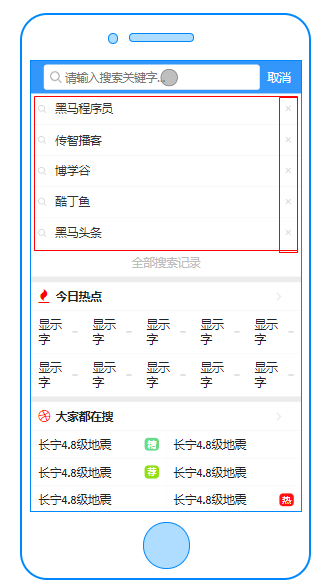
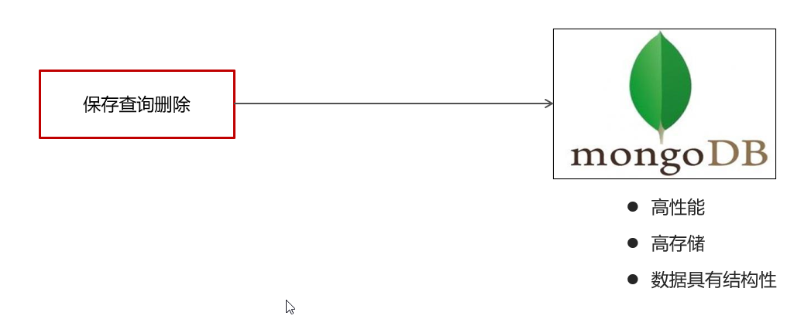
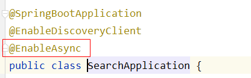
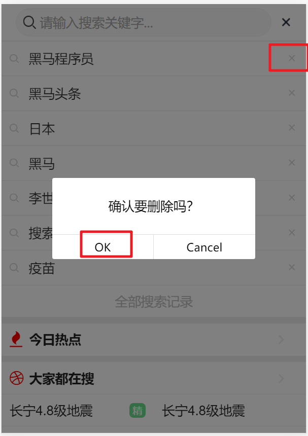

# day07-app端文章搜索

## 0 今日菜单

1. 搭建ES环境
2. **文章搜索（重点）**
3. 搜索记录保存
4. **关键词联想（自动补全）（重点）**

   


## 1 搭建ES&Kibana【已安装】

```asciiarmor
虚拟机中已安装es，kibana容器，直接启动：
docker start es
```

访问：http://192.168.200.130:9200

```sh
#kibana: es的客户端（基于WEB可视化界面）
docker start kibana
#启动比较慢，等待一两分钟

#看日志
docker logs --tail 10 -f kibana
```

访问：http://192.168.200.130:5601/app/kibana#/dev_tools/console?_g=()


### 1.1 拉取镜像

```shell
docker pull elasticsearch:7.4.0
```

### 1.2 配置中文分词器 ik

> 华为手机：华为，手机
>
> i love china: i, love, china

因为在创建elasticsearch容器的时候，映射了目录，所以可以在宿主机上进行配置ik中文分词器

在去选择ik分词器的时候，需要与elasticsearch的版本好对应上

把资料中的`elasticsearch-analysis-ik-7.4.0.zip`上传到服务器上,放到对应目录（plugins）解压

```shell
#切换目录
cd /usr/share/elasticsearch/plugins
#新建目录
mkdir analysis-ik
cd analysis-ik
#root根目录中拷贝文件
mv elasticsearch-analysis-ik-7.4.0.zip /usr/share/elasticsearch/plugins/analysis-ik
#解压文件
cd /usr/share/elasticsearch/plugins/analysis-ik
unzip elasticsearch-analysis-ik-7.4.0.zip
```

### 1.3 创建容器

```shell
docker run -id --name es -d --restart=no -p 9200:9200 -p 9300:9300 -e "ES_JAVA_OPTS=-Xms256m -Xmx256m" \
-v /tmp/es-plugins:/usr/share/elasticsearch/plugins \
-e "discovery.type=single-node" elasticsearch:7.4.0
```

### 1.4 测试

http://192.168.200.130:9200

 


### 1.5 设置开机启动【可选】

```shell
docker update --restart=always es
```


### 1.6 安装kibana

拉取镜像

```shell
docker pull kibana:7.4.0
```

创建容器

```shell
docker run -d --name kibana -p 5601:5601 --link es -e "ELASTICSEARCH_URL=http://192.168.200.130:9200" kibana:7.4.0
```

测试:http://192.168.200.130:5601/app/kibana#/dev_tools/console?_g=() 

验证中文分词器ik：

```json
GET /_analyze
{
  "analyzer": "ik_max_word",
  "text": "乒乓球明年总冠军"
}
```


### 1.7 复习ElasticSearch

> ES: 对海量数据的搜索

#### 1.7.1 倒排索引

正向索引：由《静夜思》-->床前明月光--->“前”字

 

**倒排索引(反向索引)**：**插入文档数据时**，将文档进行分词，形成词条和id的对应关系即为反向索引。

1. 先对“床前明月光”--> 分词

   将一段文本按照一定的规则，拆分为不同的词条（每一个词条被称为term） 

2. 所有的分词结果都记录对应的诗句内容


#### 1.7.2 ES和MySQL的区别

•MySQL有事务性,而ElasticSearch没有事务性,所以你删了的数据是无法恢复的。

•ElasticSearch没有物理外键这个特性，,如果你的数据强一致性要求比较高,还是建议慎用

•ElasticSearch和MySql分工不同，MySQL负责**存储（增删改）数据**，ElasticSearch负责**搜索数据**。


MySQL同步数据到ES常用工具：

- 通过JavaAPI写入ES（代码耦合比较高）
- 异步通知：MQ
- **第三方组件：logstash(es官方推荐的), **canal(阿里开源的)

## 2 文章搜索（重点）

### 2.1 需求分析


- 用户输入关键可搜索文章列表
- 关键词高亮显示
- 文章列表展示与home展示一样，当用户点击某一篇文章，可查看文章详情

### 2.2 思路分析

为了加快检索的效率，在查询的时候不会直接从数据库中查询文章，需要在elasticsearch中进行高速检索。


实现思路

- 需要把文章相关的数据存储到es索引库中
- 在搜索微服务中进行检索，查询的是es库，展示文章列表，需要根据关键字进行查询
- 在搜索的时候，用户输入了关键字，需要对当前用户记录搜索历史

### 2.3 功能实现

#### 2.3.1 创建索引和映射


(1)在kibana中手动创建索引和映射

```json
#删除
DELETE app_info_article

#创建索引库index，指定映射mappings
PUT app_info_article
{
    "mappings":{
        "properties":{
            "id":{
                "type":"long"
            },
            "publishTime":{
                "type":"date"
            },
            "layout":{
                "type":"integer"
            },
            "images":{
                "type":"keyword",
                "index": false
            },
            "staticUrl":{
                "type":"keyword",
                "index": false
            },
            "authorId": {
                "type": "long"
            },
            "authorName": {
                "type": "text"
            },
            "title":{
                "type":"text",
                "analyzer":"ik_max_word"
            },
            "content":{
                "type":"text",
                "analyzer":"ik_smart"
            }
        }
    }
}
```

 

创建成功后：

可查询当前索引库，只需要把put请求改为get请求即可。

```java
GET app_info_article
```

 

(2)使用postman添加映射和查询【了解】

创建索引库并且添加映射

put请求 ： http://192.168.200.130:9200/app_info_article


GET请求查询映射：http://192.168.200.130:9200/app_info_article

DELETE请求，删除索引及映射：http://192.168.200.130:9200/app_info_article

GET请求，查询所有文档：http://192.168.200.130:9200/app_info_article/_search

#### 2.3.2 索引库初始化-10:50

1. 导入es-init到heima-leadnews-test工程下

    

2. 查询所有的文章信息，批量导入到es索引库中

   ````json
   #检查数据源和es配置：application.yml
   ````

   ```yaml
   server:
     port: 9999
   spring:
     application:
       name: es-article
   
     datasource:
       driver-class-name: com.mysql.jdbc.Driver
       url: jdbc:mysql://localhost:3306/leadnews_article?useUnicode=true&useSSL=false&characterEncoding=UTF-8&serverTimezone=UTC
       username: root
       password: root
   # 设置Mapper接口所对应的XML文件位置，如果你在Mapper接口中有自定义方法，需要进行该配置
   mybatis-plus:
     mapper-locations: classpath*:mapper/*.xml
     # 设置别名包扫描路径，通过该属性可以给包中的类注册别名
     type-aliases-package: com.heima.es.pojo
   
   
   #自定义elasticsearch连接配置
   elasticsearch:
     host: 192.168.200.130
     port: 9200
   ```

   ApArticleMapper.xml：将es中需要的文章数据查询出来

   ```xml
   <?xml version="1.0" encoding="UTF-8"?>
   <!DOCTYPE mapper PUBLIC "-//mybatis.org//DTD Mapper 3.0//EN" "http://mybatis.org/dtd/mybatis-3-mapper.dtd">
   <mapper namespace="com.heima.es.mapper.ApArticleMapper">
   
       <resultMap id="resultMap" type="com.heima.es.pojo.SearchArticleVo">
           <id column="id" property="id"/>
           <result column="title" property="title"/>
           <result column="author_id" property="authorId"/>
           <result column="author_name" property="authorName"/>
           <result column="layout" property="layout"/>
           <result column="images" property="images"/>
           <result column="publish_time" property="publishTime"/>
           <result column="static_url" property="staticUrl"/>
           <result column="content" property="content"/>
       </resultMap>
       
   <!--<select id="loadArticleList" resultType="com.heima.es.pojo.SearchArticleVo">-->
       <select id="loadArticleList" resultMap="resultMap">
           SELECT
               aa.*, aacon.content
           FROM
               `ap_article` aa,
               ap_article_config aac,
               ap_article_content aacon
           WHERE
               aa.id = aac.article_id
             AND aa.id = aacon.article_id
             AND aac.is_delete != 1
             AND aac.is_down != 1
       </select>
   
   </mapper>
   ```

   ```java
   package com.heima.es;
   
   @SpringBootTest
   public class ApArticleTest {
   
       @Autowired
       private ApArticleMapper apArticleMapper;
   
       @Autowired
       private RestHighLevelClient restHighLevelClient;
   
   
       /**
        * 注意：数据量的导入，如果数据量过大，需要分页导入
        *
        * @throws Exception
        */
       @Test
       public void init() throws Exception {
   
           //1.查询所有符合条件的文章数据
           List<SearchArticleVo> searchArticleVos = apArticleMapper.loadArticleList();
   
           //2.批量导入到es索引库
           BulkRequest bulkRequest = new BulkRequest("app_info_article");
   
           for (SearchArticleVo searchArticleVo : searchArticleVos) {
               IndexRequest indexRequest =
                       new IndexRequest().id(searchArticleVo.getId().toString())
                       .source(JSON.toJSONString(searchArticleVo), XContentType.JSON);
               //批量添加数据
               bulkRequest.add(indexRequest);
           }
           restHighLevelClient.bulk(bulkRequest, RequestOptions.DEFAULT);
       }
   }
   ```
   
3. 检查数据是否导入成功，[Console - Kibana](http://192.168.200.130:5601/app/kibana#/dev_tools/console?_g=())

   ```json
   GET app_info_article/_search
   #默认查询10行
   ```
   
   

#### 2.3.2 搜索微服务搭建

（1）导入资料中的工程heima-leadnews-search到idea中

 

（2）检查es需要的依赖

```xml
<!--elasticsearch-->
<dependency>
    <groupId>org.elasticsearch.client</groupId>
    <artifactId>elasticsearch-rest-high-level-client</artifactId>
    <version>7.4.0</version>
</dependency>
<dependency>
    <groupId>org.elasticsearch.client</groupId>
    <artifactId>elasticsearch-rest-client</artifactId>
    <version>7.4.0</version>
</dependency>
<dependency>
    <groupId>org.elasticsearch</groupId>
    <artifactId>elasticsearch</artifactId>
    <version>7.4.0</version>
</dependency>
```

（3）nacos配置中心，新建Data ID：leadnews-search

```yaml
spring:
  autoconfigure:
    exclude: org.springframework.boot.autoconfigure.jdbc.DataSourceAutoConfiguration
elasticsearch:
  host: 192.168.200.130
  port: 9200
```

(4) 搜索微服务没有使用MySQL和Redis等技术，**因此在引导类中排除**

```java
package com.heima.search;

//如果不想加载某些类（产生某些对象）：需要将自动配置的类排除掉
@SpringBootApplication(exclude =
        {DataSourceAutoConfiguration.class, CacheService.class})
@EnableDiscoveryClient
@EnableAsync
public class SearchApplication {

    public static void main(String[] args) {
        SpringApplication.run(SearchApplication.class,args);
    }
}
```


#### 2.3.4 搜索接口定义

需求说明：


接口定义：


```
补充说明，高亮的标题放到: h_title
```

查询条件：UserSearchDto

```java
package com.heima.model.search.dtos;

import lombok.Data;

import java.util.Date;


@Data
public class UserSearchDto {

    /**
    * 搜索关键字
    */
    String searchWords;
    
    /**
    * 当前页
    */
    int pageNum;
    
    /**
    * 分页条数
    */
    int pageSize;
    
    /**
    * 最小时间
    */
    Date minBehotTime;

    public int getFromIndex(){
        if(this.pageNum<1) return 0;
        if(this.pageSize<1) this.pageSize = 10;
        return this.pageSize * (pageNum-1);
    }
}
```

表现层Controller：ArticleSearchController

```java
package com.heima.search.controller.v1;

@RestController
@RequestMapping("/api/v1/article/search")
public class ArticleSearchController {

    @PostMapping("/search")
    public ResponseResult search(@RequestBody UserSearchDto dto) throws IOException {
        return null;
    }
}
```


#### 2.3.5 业务层实现-09:50

创建业务层接口：ApArticleSearchService

```java
package com.heima.search.service;

import com.heima.model.search.dtos.UserSearchDto;
import com.heima.model.common.dtos.ResponseResult;

import java.io.IOException;

public interface ArticleSearchService {

    /**
     ES文章分页搜索
     @return
     */
    ResponseResult search(UserSearchDto userSearchDto) throws IOException;
}
```

实现类：

```java
package com.heima.search.service.impl;

import org.springframework.stereotype.Service;

@Service
@Slf4j
public class ArticleSearchServiceImpl implements ArticleSearchService {

    @Autowired
    private RestHighLevelClient restHighLevelClient;

    @Override
    public ResponseResult search(UserSearchDto userSearchDto) throws IOException {

        //1.检查参数
        //2.设置查询条件
                //关键字的分词之后查询
                //查询小于mindate的数据
                //分页查询
                //按照发布时间倒序查询
                //设置高亮  title
        //3.结果封装返回

        return null;
    }
}
```

脚本验证：

```json
GET app_info_article/_search
{
  "query": {
    "bool": {
      "must": [
        {
          "query_string": {
            "fields": ["title", "content"],
            "query": "测试",
            "default_operator": "OR"
          }
        }
      ],
      "filter": {
        "range": {
          "publishTime": {
            "lt": "1628592100672"
          }
        }
      }
    }
  },
  "from": 0,
  "size": 20,
  "sort": [
    {
      "publishTime": {
        "order": "desc"
      }
    }
  ],
  "highlight": {
    "fields": {
      "title": {
        "pre_tags": "<font style='color: red; font-size: inherit;'>",
        "post_tags": "</font>"
      }
    }
  }
}
```

高亮的标题需要单独处理下：

 

```java
/**
 * ES文章分页搜索
 */
@Override
public ResponseResult search(UserSearchDto userSearchDto) {
    //1 参数检查
    if (userSearchDto == null ||
            StringUtils.isBlank(userSearchDto.getSearchWords())) {
        return ResponseResult.errorResult(AppHttpCodeEnum.PARAM_REQUIRE);
    }

    //2 构建查询执行查询
    SearchRequest searchRequest = new SearchRequest("app_info_article");
    SearchSourceBuilder searchSourceBuilder = new SearchSourceBuilder();

    // 构建查询条件和过滤等
    BoolQueryBuilder boolQueryBuilder = new BoolQueryBuilder();

    // 关键词查询
    QueryStringQueryBuilder queryStringQueryBuilder =
            QueryBuilders.queryStringQuery(userSearchDto.getSearchWords())
                    .field("title")
                    .field("content")
                    .defaultOperator(Operator.OR);
    boolQueryBuilder.must(queryStringQueryBuilder);

    // 查询小于mindate的数据
    RangeQueryBuilder rangeQueryBuilder = QueryBuilders.rangeQuery("publishTime")
        .lt(userSearchDto.getMinBehotTime().getTime());
    boolQueryBuilder.filter(rangeQueryBuilder);

    // 分页
    searchSourceBuilder.from(0);
    searchSourceBuilder.size(userSearchDto.getPageSize());

    // 按照发布时间倒序
    searchSourceBuilder.sort("publishTime", SortOrder.DESC);
    
    // 高亮 三要素
    HighlightBuilder highlightBuilder = new HighlightBuilder();
    highlightBuilder.field("title");
    highlightBuilder.preTags("<font style='color: red; font-size: inherit;'>");
    highlightBuilder.postTags("</font>");
    searchSourceBuilder.highlighter(highlightBuilder);

    //将boolQuery放到查询请求中
    searchSourceBuilder.query(boolQueryBuilder);
    searchRequest.source(searchSourceBuilder);
    try {
        SearchResponse searchResponse =
                restHighLevelClient.search(searchRequest, RequestOptions.DEFAULT);

        //3 解析结果 封装结果
        SearchHits searchHits = searchResponse.getHits();
        List<Map> resultList = new ArrayList<>();
        // 总记录数
        long total = searchHits.getTotalHits().value;
        log.info("search result total:{}",total);
        SearchHit[] hits = searchHits.getHits();
        for (SearchHit hit : hits) {
            String json = hit.getSourceAsString();
            Map map = JSON.parseObject(json, Map.class);
            //处理高亮
            if(hit.getHighlightFields() != null && hit.getHighlightFields().size() > 0){
                Text[] titles = hit.getHighlightFields().get("title").getFragments();
                //["标题前边", "标题后边" ... ]
                String title = StringUtils.join(titles);
                //高亮标题
                map.put("h_title", title);
            } else {
                //原始标题
                map.put("h_title",map.get("title"));
            }
            resultList.add(map);
        }

        return ResponseResult.okResult(resultList);
    } catch (IOException e) {
        e.printStackTrace();
        log.error("search result error:{}", e.getMessage());
    }

    return ResponseResult.errorResult(AppHttpCodeEnum.SERVER_ERROR);
}
```

#### 2.3.6 控制层实现

新建控制器ArticleSearchController

```java
package com.heima.search.controller.v1;

@RestController
@RequestMapping("/api/v1/article/search")
public class ArticleSearchController {

    @Autowired
    private ArticleSearchService articleSearchService;

    @PostMapping("/search")
    public ResponseResult search(@RequestBody UserSearchDto dto) {
        return articleSearchService.search(dto);
    }
}
```

#### 2.3.7 测试

需要在app的网关中添加搜索微服务的路由配置，Data ID：leadnews-app-gateway

```yaml
        - id: leadnews-search
          uri: lb://leadnews-search
          predicates:
            - Path=/search/**
          filters:
            - StripPrefix= 1
```

启动文章微服务，用户微服务，搜索微服务，app网关微服务，app前端工程


访问http://localhost:8801/#/search，搜索测试


## 3 发布文章后数据同步-16:41

### 3.1 思路分析


还可以使用其他工具自动完成：


### 3.2 实现步骤

1. **文章微服务heima-leadnews-article**：审核成功使用kafka发送消息

   - ArticleFreemarkerServiceImpl完善 buildArticleToMinIO方法，发送消息

     

     ```java
     //发送消息，创建索引
     createArticleESIndex(apArticle, content, path);
     ```

   - ArticleFreemarkerServiceImpl新增createArticleESIndex()

     ```java
     public class ArticleConstants {
         public static final Short LOADTYPE_LOAD_MORE = 1;
         public static final Short LOADTYPE_LOAD_NEW = 2;
         public static final String DEFAULT_TAG = "__all__";
     
         //新增同步数据的topic
         public static final String ARTICLE_ES_SYNC_TOPIC 
             = "article.es.sync.topic";
     
     }
     ```

     ```java
     @Autowired
     private KafkaTemplate<String,String> kafkaTemplate;
     
     /**
      * 发送消息，创建索引
      * @param apArticle
      * @param content
      * @param path
      */
     private void createArticleESIndex(ApArticle apArticle, String content, String path) {
         SearchArticleVo vo = new SearchArticleVo();
         BeanUtils.copyProperties(apArticle,vo);
         vo.setContent(content);
         vo.setStaticUrl(path);
     
         kafkaTemplate.send(ArticleConstants.ARTICLE_ES_SYNC_TOPIC, JSON.toJSONString(vo));
     }
     ```

   - 文章微服务中添加kafka生产者配置，Data ID：leadnews-article

     ```yml
         producer:
           retries: 10
           key-serializer: org.apache.kafka.common.serialization.StringSerializer
           value-serializer: org.apache.kafka.common.serialization.StringSerializer
     ```

2. **搜索微服务heima-leadnews-search**接收消息，添加数据到索引库

   - 添加KafkaListener，接收消息

     ```java
     package com.heima.search.listener;
     
     import java.io.IOException;
     
     @Component
     @Slf4j
     public class SyncArticleListener {
     
         @Autowired
         private RestHighLevelClient restHighLevelClient;
     
         @KafkaListener(topics = ArticleConstants.ARTICLE_ES_SYNC_TOPIC)
         public void onMessage(String message){
             if(StringUtils.isNotBlank(message)){
     
                 log.info("SyncArticleListener,message={}",message);
     
                 SearchArticleVo searchArticleVo = JSON.parseObject(message, SearchArticleVo.class);
                 IndexRequest indexRequest = new IndexRequest("app_info_article");
                 indexRequest.id(searchArticleVo.getId().toString());
                 indexRequest.source(message, XContentType.JSON);
                 try {
                     restHighLevelClient.index(indexRequest, RequestOptions.DEFAULT);
                 } catch (IOException e) {
                     e.printStackTrace();
                     log.error("sync es error={}", e.getMessage());
                 }
             }
     
         }
     }
     ```

   - 搜索微服务中添加kafka消费者配置，Data ID：leadnews-search

     ```yaml
     spring: 
       kafka: #位于spring层级下
         bootstrap-servers: 192.168.200.130:9092
         consumer:
           group-id: ${spring.application.name}
           key-deserializer: org.apache.kafka.common.serialization.StringDeserializer
           value-deserializer: org.apache.kafka.common.serialization.StringDeserializer
     ```

### 3.3 集成测试

启动自媒体服务，延迟任务微服务，自媒体网关微服务，文章微服务，用户微服务，搜索微服务，app网关微服务

```json
#1.查看自媒体服务发布文章，是否添加对发布时间的校验
if (dto.getPublishTime() == null) {
    dto.setPublishTime(new Date());
}
```

 

```asciiarmor
#2.检查zk, kafka, es的启动状态：虚拟机docker中
```


启动Nginx：

- 使用自媒体端发布文章
- 使用app端搜索文章


## 4) 搜索记录

### 4.1) 需求分析



- 展示用户的搜索记录10条，按照搜索关键词的时间倒序
- 可以删除搜索记录
- 保存历史记录，保存10条，多余的则删除最久的历史记录

### 4.2) 数据存储说明

用户的搜索记录，需要给**每一个用户都保存一份**，数据量较大，要求加载速度快，通常这样的数据存储到mongodb更合适，不建议直接存储到关系型数据库中

 

#### 4.2.1）MongoDB简介

https://db-engines.com/en/ranking

MongoDB：是一个高效的非关系型数据库（不支持表关系：只能操作单表）


MongoDB是一个基于分布式文件存储的数据库。由C++语言编写。旨在为WEB应用提供可扩展的高性能数据存储解决方案。

MongoDB是一个介于关系数据库和非关系数据库之间的产品，是非关系数据库当中功能最丰富，最像关系数据库的，它支持的数据结构非常松散，是类似json的bson格式，因此可以存储比较复杂的数据类型。

MongoDB最大的特点是它支持的查询语言非常强大，其语法有点类似于面向对象的查询语言，几乎可以实现类似关系数据库单表查询的绝大部分功能，而且还支持对数据建立索引。

官网：https://www.mongodb.com


#### 4.2.2）MongoDB的特点

MongoDB 最大的特点是他支持的查询语言非常强大，其语法有点类似于面向对象的查询语言，几乎可以实现类似关系数据库单表查询的绝大部分功能，而且还支持对数据建立索引。它是一个面向集合的,模式自由的文档型数据库。具体特点总结如下： 

1. 面向集合存储，易于存储对象类型的数据 
2. 模式自由 
3. 支持动态查询 
4. 支持完全索引，包含内部对象 
5. 支持复制和故障恢复 
6. 使用高效的二进制数据存储，包括大型对象（如视频等） 
7. 自动处理碎片，以支持云计算层次的扩展性 
8. 支持 Python，PHP，Ruby，Java，C，C#，Javascript，Perl及C++语言的驱动程 序， 社区中也提供了对Erlang及.NET 等平台的驱动程序 
9. 文件存储格式为 BSON（一种 JSON 的扩展）

#### 4.2.3）区别

1.事务上，mysql支持事务更加完善，比mongodb成熟。

2.数据结构上，mysql表结构不够灵活（研发人员不便修改表结构，高并发和数据量比较大的时候锁定表影响其他用户操作）；mongodb文档型数据库，BSON类似于JSON，不用提前设计表结构。

3.高可用和性能上，mongodb高可用和分片集群方案优于mysql。

> MYSQL : 用于存储安全性要求比较高的数据，事务支持比较好
>
> REDIS : 存储数据格式简单 , 数据量有限，访问频率比较高（使用内存存储）
>
> MONGODB : 用户存储海量数据（一般不会分词搜索）, 并且数据的安全性要求不高

### 4.3) MongoDB安装及集成

#### 4.3.1)安装MongoDB

```asciiarmor
虚拟机中已创建，直接启动即可
docker start mongo
```

拉取镜像

```shell
docker pull mongo:4.4
```

创建容器

```shell
docker run -di --name mongo --restart=always -p 27017:27017 -v ~/data/mongodata:/data mongo:4.4
```

**使用Navicat15（高版本才行）连接设置：**

> 如果没有安装navicat，可以使用idea的Database进行连接测试

 

```
host: 192.168.200.130
port: 27017
```

新建leadnews-history数据库，然后执行资料中的leadnews-history.js


#### 4.3.2)MongoDB体系结构

MongoDB 的逻辑结构是一种层次结构。主要由： 文档(document) 集合(collection) 数据库(database)这三部分组成的。逻辑结构是面 向用户的，用户使用 MongoDB 开发应用程序使用的就是逻辑结构。 

1. MongoDB 的文档（document），相当于关系数据库中的一行记录。 
2. 多个文档组成一个集合（collection），相当于关系数据库的表。 
3. 多个集合（collection），逻辑上组织在一起，就是数据库（database）。 
4. 一个 MongoDB 实例支持多个数据库（database）。 文档(document) 集合(collection) 数据库(database)的层次结构如下图:


为了更好的理解，下面与SQL中的概念进行对比：

| SQL术语/概念 | MongoDB术语/概念 | 解释/说明                           |
| ------------ | ---------------- | ----------------------------------- |
| database     | database         | 数据库                              |
| table        | collection       | 数据库表/集合                       |
| row          | document         | 表中的一条数据                      |
| column       | field            | 数据字段/域                         |
| index        | index            | 索引                                |
| table joins  |                  | 表连接,MongoDB不支持                |
| primary key  | primary key      | 主键,MongoDB自动将_id字段设置为主键 |

 


#### 4.3.3)数据类型

* 数据格式：BSON  {aa:bb}

- null：用于表示空值或者不存在的字段，{“x”:null} 

- 布尔型：布尔类型有两个值true和false，{“x”:true} 

- 数值：shell默认使用64为浮点型数值。{“x”：3.14}或{“x”：3}。对于整型值，可以使用 NumberInt（4字节符号整数）或NumberLong（8字节符号整数）， {“x”:NumberInt(“3”)}{“x”:NumberLong(“3”)} 

- 字符串：UTF-8字符串都可以表示为字符串类型的数据，{“x”：“呵呵”} 

- 日期：日期被存储为自新纪元依赖经过的毫秒数，不存储时区，{“x”:new Date()}

- 正则表达式：查询时，使用正则表达式作为限定条件，语法与JavaScript的正则表达式相 同，{“x”:/[abc]/} 

- 数组：数据列表或数据集可以表示为数组，{“x”： [“a“，“b”,”c”]} 

- 内嵌文档：文档可以嵌套其他文档，被嵌套的文档作为值来处理，{“x”:{“y”:3 }} 

- 对象Id：对象id是一个12字节的字符串，是文档的唯一标识，{“x”: objectId() } 

- 二进制数据：二进制数据是一个任意字节的字符串。它不能直接在shell中使用。如果要 将非utf-字符保存到数据库中，二进制数据是唯一的方式。

  

#### 4.3.4)SpringBoot集成mongodb

**导入资料中的mongo-demo项目到heima-leadnews-test中**

其中有三项配置比较关键：

第一：mongodb依赖

```xml
<dependency>
    <groupId>org.springframework.boot</groupId>
    <artifactId>spring-boot-starter-data-mongodb</artifactId>
</dependency>
```

第二：mongo配置

```yaml
server:
  port: 9998
spring:
  data:
    mongodb:
      host: 192.168.200.130
      port: 27017
      database: leadnews-history
```

第三：映射

```java
package com.itheima.mongo.pojo;

/**
 * <p>
 * 自动补全：联想词表
 * </p>
 *
 * @author itheima
 */
@Data
@Document("ap_associate_words")
public class ApAssociateWords implements Serializable {

    private static final long serialVersionUID = 1L;

    private String id;

    /**
     * 联想词
     */
    private String associateWords;

    /**
     * 创建时间
     */
    private Date createdTime;

}
```

#### 4.3.3)核心方法


```java
package com.itheima.mongo.test;


@SpringBootTest(classes = MongoApplication.class)
public class MongoTest {


    @Autowired
    private MongoTemplate mongoTemplate;

    //保存
    @Test
    public void saveTest(){
        /*for (int i = 0; i < 10; i++) {
            ApAssociateWords apAssociateWords = new ApAssociateWords();
            apAssociateWords.setAssociateWords("黑马头条");
            apAssociateWords.setCreatedTime(new Date());
            mongoTemplate.save(apAssociateWords);
        }*/
        ApAssociateWords apAssociateWords = new ApAssociateWords();
        apAssociateWords.setAssociateWords("黑马直播");
        apAssociateWords.setCreatedTime(new Date());
        mongoTemplate.save(apAssociateWords);

    }

    //查询一个
    @Test
    public void saveFindOne(){
        ApAssociateWords apAssociateWords = mongoTemplate.findById("60bd973eb0c1d430a71a7928", ApAssociateWords.class);
        System.out.println(apAssociateWords);
    }

    //条件查询
    @Test
    public void testQuery(){
        Query query = Query.query(Criteria.where("associateWords").is("黑马头条"))
                .with(Sort.by(Sort.Direction.DESC,"createdTime"));
        List<ApAssociateWords> apAssociateWordsList = mongoTemplate.find(query, ApAssociateWords.class);
        System.out.println(apAssociateWordsList);
    }

    @Test
    public void testDel(){
        mongoTemplate.remove(Query.query(Criteria.where("associateWords").is("黑马头条")),ApAssociateWords.class);
    }
}
```

### 4.4) 保存搜索记录

#### 4.4.1)实现思路

用户输入关键字进行搜索的**异步记录关键字**


详细实现流程如下：

> 产品经理需求：一个用户最多保存10条搜索记录


#### 4.4.2)实现步骤-13:06

1.搜索微服务heima-leadnews-search集成mongodb

①：pom依赖

```xml
<dependency>
    <groupId>org.springframework.boot</groupId>
    <artifactId>spring-boot-starter-data-mongodb</artifactId>
</dependency>
```

②：nacos配置，Data ID: leadnews-search

```yaml
spring:
  data:
   mongodb:
    host: 192.168.200.130
    port: 27017
    database: leadnews-history
```

③：在当天资料中找到对应的实体类拷贝到搜索微服务下

```java
package com.heima.search.pojos;

import lombok.Data;
import org.springframework.data.mongodb.core.mapping.Document;

import java.io.Serializable;
import java.util.Date;

/**
 * <p>
 * APP用户搜索信息表
 * </p>
 * @author itheima
 */
@Data
@Document("ap_user_search")
public class ApUserSearch implements Serializable {

    private static final long serialVersionUID = 1L;

    /**
     * 主键
     */
    private String id;

    /**
     * 用户ID
     */
    private Integer userId;

    /**
     * 搜索词
     */
    private String keyword;

    /**
     * 创建时间
     */
    private Date createdTime;

}
```

2.创建ApUserSearchServiceImpl新增insert方法


```java
package com.heima.search.service;

public interface ApUserSearchService {

    /**
     * 保存用户搜索历史记录
     * @param keyword
     * @param userId
     */
    public void insert(String keyword, Integer userId);
}
```

实现类：

```java
package com.heima.search.service.impl;

@Service
@Slf4j
public class ApUserSearchServiceImpl implements ApUserSearchService {

    @Autowired
    private MongoTemplate mongoTemplate;
    /**
     * 保存用户搜索历史记录
     * @param keyword
     * @param userId
     */
    @Override
    @Async
    public void insert(String keyword, Integer userId) {
		//为什么要传递userId，而不是直接获取？AppThreadLocalUtils.getUser();
        //这个方法是在新的线程中执行的，所以无法获取到主线程ThreadLocal中设置的userId
        
        //1.查询当前用户的搜索关键词
        Query query = Query.query(Criteria.where("userId").is(userId).and("keyword").is(keyword));
        ApUserSearch apUserSearch = mongoTemplate.findOne(query, ApUserSearch.class);

        //2.存在 更新创建时间
        if(apUserSearch != null){
            apUserSearch.setCreatedTime(new Date());
            mongoTemplate.save(apUserSearch);
            return;
        }

        //3.不存在，判断当前历史记录总数量是否超过10
        apUserSearch = new ApUserSearch();
        apUserSearch.setUserId(userId);
        apUserSearch.setKeyword(keyword);
        apUserSearch.setCreatedTime(new Date());

        //where userId = ? order by createdTime desc
        Query query1 = Query.query(Criteria.where("userId").is(userId));
        query1.with(Sort.by(Sort.Direction.DESC,"createdTime"));
        List<ApUserSearch> apUserSearchList = 
            mongoTemplate.find(query1, ApUserSearch.class);

        //单个用户最多保存10条
        if(apUserSearchList == null || apUserSearchList.size() < 10){
            mongoTemplate.save(apUserSearch); //少于10条，直接新增
        } else { //删除最早的记录，替换成现在搜索的
            //升序取第一条：apUserSearchList.get(0)
            //降序取最后一条：apUserSearchList.get(apUserSearchList.size() - 1)
            ApUserSearch lastUserSearch = 
                apUserSearchList.get(apUserSearchList.size() - 1);
            //先删除掉query条件指定的数据，然后将第二个参数中的数据进行新增
            mongoTemplate.findAndReplace(
                Query.query(Criteria.where("id").is(lastUserSearch.getId())), 
                apUserSearch);
            
            //另外一种实现方式：
             //1.删除最早的搜索记录，
            				//mongoTemplate.remove(Query.query(Criteria.where("id").is(lastUserSearch.getId())),
            //        ApUserSearch.class);
            // 2.新增本次的搜索记录
            //mongoTemplate.save(apUserSearch);
        }
    }
}
```

**3.参考自媒体相关微服务，在搜索微服务中获取当前登录的用户-11:57**

①：在app网关微服务heima-leadnews-app-gateway中保存用户ID：AuthorizeFilter


```java
//获取用户信息
Object userId = claimsBody.get("id");
//存储header中
ServerHttpRequest serverHttpRequest = request.mutate().header("userId", userId + "").build();
//重置请求
exchange.mutate().request(serverHttpRequest);
```

②：在搜索微服务heima-leadnews-search中添加拦截器获取用户ID：AppTokenInterceptor

```java
package com.heima.search.interceptor;

public class AppTokenInterceptor implements HandlerInterceptor {

    @Override
    public boolean preHandle(HttpServletRequest request, HttpServletResponse response, Object handler) throws Exception {
        //在app网关中，校验token后将登录用户ID放到了header
        String userId = request.getHeader("userId");
        if(userId != null){
            //存入到当前线程中
            ApUser apUser = new ApUser();
            apUser.setId(Integer.valueOf(userId));
            AppThreadLocalUtils.setUser(apUser);
        }
        return true;
    }

    @Override
    public void afterCompletion(HttpServletRequest request, HttpServletResponse response, Object handler, Exception ex) throws Exception {
        AppThreadLocalUtils.clear();
    }
}
```

③：在搜索微服务heima-leadnews-search中配置拦截器：WebMvcConfig

```java
package com.heima.search.config;

@Configuration
public class WebMvcConfig implements WebMvcConfigurer {
    @Override
    public void addInterceptors(InterceptorRegistry registry) {
        registry.addInterceptor(new AppTokenInterceptor()).addPathPatterns("/**");
    }
}
```

4.在ArticleSearchService的search方法中调用保存历史记录

```java
/**
 * es文章分页检索
 */
@Override
public ResponseResult search(UserSearchDto dto) throws IOException {

    //1.检查参数
    if(dto == null || StringUtils.isBlank(dto.getSearchWords())){
        return ResponseResult.errorResult(AppHttpCodeEnum.PARAM_INVALID);
    }
    
    //浏览器发送请求到达Tomcat，会自动创建一个新的线程来执行代码
    //主线程：拦截器-》controller-》service
    ApUser user = AppThreadLocalUtil.getUser();

    //异步调用 保存搜索记录
	//添加一个判断，如果是游客不保存搜索记录
     if(user != null && user.getId() != 0 && dto.getFromIndex() == 0) {
         //@Async就会创建子线程，因此在这个方法内部无法获取到用户ID
        apUserSearchService.insert(dto.getSearchWords(), user.getId());
         
         //new Thread(new Runnable() {
         //    @Override
         //    public void run() {
         //        apUserSearchService.insert(dto.getSearchWords(), user.getId());
         //    }
         //}).start();
    }
    
    //省略代码...
}
```

5.保存历史记录中开启异步调用，添加注解@Async

```java
/**
 * 保存用户搜索历史记录
 * @param keyword
 * @param userId
 */
@Override
@Async
public void insert(String keyword, Integer userId) {
}
```

6.在搜索微服务引导类上开启异步调用

 

```java
package com.heima.search;

@SpringBootApplication
@EnableDiscoveryClient
@EnableAsync
public class SearchApplication {

    public static void main(String[] args) {
        SpringApplication.run(SearchApplication.class,args);
    }
}
```


#### 4.4.3)测试

1. 启动搜索服务、用户服务、APP网关服务、文章服务

   

2. 启动APP前端

3. 搜索测试：http://localhost:8801/#/home

   

### 4.5) 加载搜索记录列表

#### 4.5.1) 思路分析

按照当前用户，按照时间倒序查询

|          | **说明**             |
| -------- | -------------------- |
| 接口路径 | /api/v1/history/load |
| 请求方式 | POST                 |
| 参数     | 无                   |
| 响应结果 | ResponseResult       |


#### 4.5.2) 接口定义

```java
package com.heima.search.controller.v1;

/**
 * <p>
 * APP用户搜索信息表 前端控制器
 * </p>
 *
 * @author itheima
 */
@Slf4j
@RestController
@RequestMapping("/api/v1/history")
public class ApUserSearchController{


    @PostMapping("/load")
    public ResponseResult findUserSearch() {
        return null;
    }

}
```

#### 4.5.3) mapper

不需要

#### 4.5.4) 业务层

在ApUserSearchService中新增方法

```java
/**
     查询搜索历史
     @return
     */
ResponseResult findUserSearch();
```

实现方法

```java
 /**
     * 查询搜索历史
     *
     * @return
     */
@Override
public ResponseResult findUserSearch() {
    //获取当前用户
    ApUser user = AppThreadLocalUtil.getUser();
    //游客登录也不加载
    if(user == null || user.getId() == 0){
        return ResponseResult.errorResult(AppHttpCodeEnum.NEED_LOGIN);
    }

    //根据用户查询数据，按照时间倒序
    List<ApUserSearch> apUserSearches = 
    // where userId = ? order by createdTime desc
        mongoTemplate.find(Query.query(Criteria.where("userId").is(user.getId())).with(Sort.by(Sort.Direction.DESC, "createdTime")), ApUserSearch.class);
    return ResponseResult.okResult(apUserSearches);
}
```

#### 4.5.5) 控制器

```java
/**
 * <p>
 * APP用户搜索信息表 前端控制器
 * </p>
 * @author itheima
 */
@Slf4j
@RestController
@RequestMapping("/api/v1/history")
public class ApUserSearchController{

    @Autowired
    private ApUserSearchService apUserSearchService;

    @PostMapping("/load")
    public ResponseResult findUserSearch() {
        return apUserSearchService.findUserSearch();
    }

}
```

#### 4.5.6) 测试

打开app的搜索页面，可以查看搜索记录列表


### 4.6) 删除搜索记录

#### 4.6.1) 思路分析

按照搜索历史id删除

|          | **说明**            |
| -------- | ------------------- |
| 接口路径 | /api/v1/history/del |
| 请求方式 | POST                |
| 参数     | HistorySearchDto    |
| 响应结果 | ResponseResult      |


#### 4.6.2) 接口定义

在ApUserSearchController接口新增方法

```java
@PostMapping("/del")
public ResponseResult delUserSearch(@RequestBody HistorySearchDto historySearchDto) {
    return null;
}
```

HistorySearchDto

```java
@Data
public class HistorySearchDto {
    /**
    * 接收搜索历史记录id
    */
    String id;
}
```

#### 4.6.3) 业务层

在ApUserSearchService中新增方法

```java
 /**
     删除搜索历史
     @param historySearchDto
     @return
     */
ResponseResult delUserSearch(HistorySearchDto dto);
```

实现方法

```java
/**
     * 删除历史记录
     *
     * @param dto
     * @return
     */
@Override
public ResponseResult delUserSearch(HistorySearchDto dto) {
    //1.检查参数
    if(dto.getId() == null){
        return ResponseResult.errorResult(AppHttpCodeEnum.PARAM_INVALID);
    }

    //2.判断是否登录
    ApUser user = AppThreadLocalUtils.getUser();
    if(user == null){
        return ResponseResult.errorResult(AppHttpCodeEnum.NEED_LOGIN);
    }

    //3.删除: where id=?
    mongoTemplate.remove(Query.query(Criteria.where("id").is(dto.getId())),ApUserSearch.class);
    return ResponseResult.okResult(AppHttpCodeEnum.SUCCESS);
}
```

#### 4.6.4) 控制器

修改ApUserSearchController，补全方法

```java
@PostMapping("/del")
public ResponseResult delUserSearch(@RequestBody HistorySearchDto historySearchDto) {
    return apUserSearchService.delUserSearch(historySearchDto);
}
```

#### 4.6.5) 测试

打开app可以删除搜索记录



## 5) 关键字联想词-09:57

### 5.1 需求分析


对应实体类

```java
package com.heima.search.pojos;

import lombok.Data;
import org.springframework.data.mongodb.core.mapping.Document;

import java.io.Serializable;
import java.util.Date;

/**
 * <p>
 * 联想词表
 * </p>
 *
 * @author itheima
 */
@Data
@Document("ap_associate_words")
public class ApAssociateWords implements Serializable {

    private static final long serialVersionUID = 1L;

    private String id;

    /**
     * 联想词
     */
    private String associateWords;

    /**
     * 创建时间
     */
    private Date createdTime;

}
```

### 5.2)搜索词-数据来源

通常是网上搜索频率比较高的一些词，通常在企业中有两部分来源：

第一：自己维护搜索词

通过分析用户搜索频率较高的词，按照排名作为搜索词

第二：第三方获取

关键词规划师（百度）、5118、爱站网

> [5118营销大数据 - 智能原创改写,长尾词挖掘,营销情报,站长工具](https://www.5118.com/)
>
> 买过很多长尾词，管理平台上可以批量导入excel到mongodb（EeayExcel）

导入资料中的ap_associate_words.js脚本到mongo中

### 5.3 功能实现

#### 5.3.1 接口定义

|          | **说明**                 |
| -------- | ------------------------ |
| 接口路径 | /api/v1/associate/search |
| 请求方式 | POST                     |
| 参数     | UserSearchDto            |
| 响应结果 | ResponseResult           |

新建表现层接口

```java
package com.heima.search.controller.v1;

@RestController
@RequestMapping("/api/v1/associate")
public class ApAssociateWordsController {

    @PostMapping("/search")
    public ResponseResult search(@RequestBody UserSearchDto userSearchDto) {
        return null;
    }
}

```

#### 5.3.3 业务层

新建联想词业务层接口

```java
package com.heima.search.service;

import com.heima.model.common.dtos.ResponseResult;
import com.heima.model.search.dtos.UserSearchDto;

/**
 * <p>
 * 联想词表 服务类
 * </p>
 *
 * @author itheima
 */
public interface ApAssociateWordsService {

    /**
     联想词
     @param userSearchDto
     @return
     */
    ResponseResult findAssociate(UserSearchDto userSearchDto);

}
```

实现类：

```
模糊查询： 
mysql(like '%黑马%')

mongodb(.*黑马.*)
```

正则表达式说明：


```java
package com.heima.search.service.impl;

/**
 * @Description:
 * @Version: V1.0
 */
@Service
public class ApAssociateWordsServiceImpl implements ApAssociateWordsService {

    @Autowired
    MongoTemplate mongoTemplate;

    /**
     * 联想词
     * @param userSearchDto
     * @return
     */
    @Override
    public ResponseResult findAssociate(UserSearchDto userSearchDto) {
        //1 参数检查
        if(userSearchDto == null 
           || StringUtils.isBlank(userSearchDto.getSearchWords())){
            return ResponseResult.errorResult(AppHttpCodeEnum.PARAM_INVALID);
        }
        //分页检查
        if (userSearchDto.getPageSize() > 10) {
            userSearchDto.setPageSize(10);
        }

        //3 执行查询 模糊查询
        Query query = Query.query(Criteria.where("associateWords").regex(".*" + userSearchDto.getSearchWords() + ".*"));
        query.limit(userSearchDto.getPageSize());
        List<ApAssociateWords> wordsList = mongoTemplate.find(query, ApAssociateWords.class);

        return ResponseResult.okResult(wordsList);
    }
}
```

#### 5.3.4  控制器

新建联想词控制器

```java
package com.heima.search.controller.v1;

/**
 * <p>
 * 联想词表 前端控制器
 * </p>
 * @author itheima
 */
@Slf4j
@RestController
@RequestMapping("/api/v1/associate")
public class ApAssociateWordsController{

    @Autowired
    private ApAssociateWordsService apAssociateWordsService;

    @PostMapping("/search")
    public ResponseResult findAssociate(@RequestBody UserSearchDto userSearchDto) {
        return apAssociateWordsService.findAssociate(userSearchDto);
    }
}
```

#### 5.3.5 测试

同样，打开前端联调测试效果


