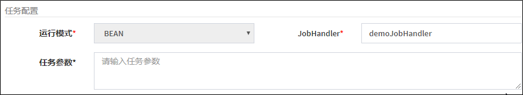
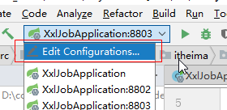
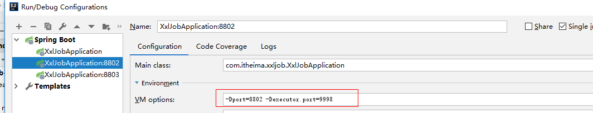
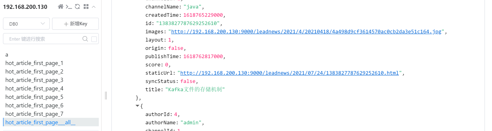

# 定时计算热点文章

## 0.今日菜单

1. 任务调度概述
2. XXL-JOB入门
3. **定时计算热点文章（重点）**

## 1.任务调度概述

### 1.1 热点文章需求分析

> 目前黑马头条APP首页实现：从MySQL数据库直接按照发布时间倒序查询
>

**存在的问题：**

- 问题1：如何访问量较大，直接查询数据库，压力较大
- 问题2：新发布的文章会展示在前面，并不是热点文章

**解决方案：将热门文章列表存入redis进行展示**


### 1.2 定时计算


- 根据文章的行为（点赞、评论、阅读、收藏）计算文章的分值，利用定时任务每天完成一次计算
- 把分值较大的文章数据存入到redis中
- App端用户查询文章列表的时候，优先从redis中查询热度较高的文章数据

### 1.3 什么是任务调度

我们可以先思考一下业务场景的解决方案：

- 某电商系统需要在每天上午10点，下午3点，晚上8点发放一批优惠券。
- 某银行系统需要在信用卡到期还款日的前三天进行短信提醒。
- 某财务系统需要在每天凌晨0:10结算前一天的财务数据，统计汇总。
- 12306会根据车次的不同，设置某几个时间点进行分批放票。

以上业务场景的解决方案就是任务调度。

**任务调度是指系统为了自动完成特定任务，在约定的特定时刻去执行任务的过程。有了任务调度即可解放更多的人力，而是由系统自动去执行任务。**

如何实现任务调度？

- 多线程方式，结合sleep
- JDK提供的API，例如：Timer、ScheduledExecutor
- **【常用】**框架，例如Quartz ， xxl-job,  elastic-job它是一个功能强大的任务调度框架，可以满足更多更复杂的调度需求
- spring task

**入门案例**

spring框架中默认就支持了一个任务调度，spring-task

（1）创建一个工程：spring-task-demo

pom文件

```xml
<!-- 继承Spring boot工程 -->
<parent>
    <groupId>org.springframework.boot</groupId>
    <artifactId>spring-boot-starter-parent</artifactId>
    <version>2.1.5.RELEASE</version>
</parent>

<dependencies>
    <dependency>
        <groupId>org.springframework.boot</groupId>
        <artifactId>spring-boot-starter-web</artifactId>
    </dependency>
</dependencies>
```

（2）引导类：

```java
package com.itheima.task;

import org.springframework.boot.SpringApplication;
import org.springframework.boot.autoconfigure.SpringBootApplication;
import org.springframework.scheduling.annotation.EnableScheduling;

@SpringBootApplication
@EnableScheduling
public class TaskApplication {

    public static void main(String[] args) {
        SpringApplication.run(TaskApplication.class,args);
    }
}
```

(3)编写案例

```java
package com.itheima.task.job;

import org.springframework.scheduling.annotation.Scheduled;
import org.springframework.stereotype.Component;

import java.util.Date;

@Component
public class HelloJob {

    @Scheduled(cron = "0/5 * * * * ?")
    public void eat(){
        System.out.println("5秒种吃一次饭，我想成为一个胖子"+new Date());
    }
}
```

测试：启动项目，每隔5秒中会执行一次eat方法

### 1.4 什么是分布式任务调度

当前软件的架构已经开始向分布式架构转变，将单体结构拆分为若干服务，服务之间通过网络交互来完成业务处理。在分布式架构下，一个服务往往会部署多个实例来运行我们的业务，如果在这种分布式系统环境下运行任务调度，我们称之为**分布式任务调度**。


将任务调度程序分布式构建，这样就可以具有分布式系统的特点，并且提高任务的调度处理能力：

1、并行任务调度

并行任务调度实现靠多线程，如果有大量任务需要调度，此时光靠多线程就会有瓶颈了，因为一台计算机CPU的处理能力是有限的。

如果将任务调度程序分布式部署，每个结点还可以部署为集群，这样就可以让多台计算机共同去完成任务调度，我们可以将任务分割为若干个分片，由不同的实例并行执行，来提高任务调度的处理效率。

2、高可用

若某一个实例宕机，不影响其他实例来执行任务。

3、弹性扩容

当集群中增加实例就可以提高并执行任务的处理效率。

4、任务管理与监测

对系统中存在的所有定时任务进行统一的管理及监测。让开发人员及运维人员能够时刻了解任务执行情况，从而做出快速的应急处理响应。

**分布式任务调度面临的问题：**

当任务调度以集群方式部署，同一个任务调度可能会执行多次，例如：电商系统定期发放优惠券，就可能重复发放优惠券，对公司造成损失，信用卡还款提醒就会重复执行多次，给用户造成烦恼，所以我们需要控制相同的任务在多个运行实例上只执行一次。常见解决方案：

- 分布式锁，多个实例在任务执行前首先需要获取锁，如果获取失败那么就证明有其他服务已经在运行，如果获取成功那么证明没有服务在运行定时任务，那么就可以执行。
- ZooKeeper选举，利用ZooKeeper对Leader实例执行定时任务，执行定时任务的时候判断自己是否是Leader，如果不是则不执行，如果是则执行业务逻辑，这样也能达到目的。

### 1.5 XXL-JOB简介

针对分布式任务调度的需求，市场上出现了很多的产品：

1） TBSchedule：淘宝推出的一款非常优秀的高性能分布式调度框架，目前被应用于阿里、京东、支付宝、国美等很多互联网企业的流程调度系统中。但是已经多年未更新，文档缺失严重，缺少维护。

2） XXL-Job：大众点评的分布式任务调度平台，是一个轻量级分布式任务调度平台, 其核心设计目标是开发迅速、学习简单、轻量级、易扩展。现已开放源代码并接入多家公司线上产品线，开箱即用。

3）Elastic-job：当当网借鉴TBSchedule并基于quartz 二次开发的弹性分布式任务调度系统，功能丰富强大，采用zookeeper实现分布式协调，具有任务高可用以及分片功能。

4）Saturn： 唯品会开源的一个分布式任务调度平台，基于Elastic-job，可以全域统一配置，统一监
控，具有任务高可用以及分片功能。 

XXL-JOB是一个分布式任务调度平台，其核心设计目标是开发迅速、学习简单、轻量级、易扩展。现已开放源代码并接入多家公司线上产品线，开箱即用。

源码地址：https://gitee.com/xuxueli0323/xxl-job

文档地址：https://www.xuxueli.com/xxl-job/

**特性**

- **简单灵活**
  提供Web页面对任务进行管理，管理系统支持用户管理、权限控制；
  支持容器部署；
  支持通过通用HTTP提供跨平台任务调度；
- **丰富的任务管理功能**
  支持页面对任务CRUD操作；
  支持在页面编写脚本任务、命令行任务、Java代码任务并执行；
  支持任务级联编排，父任务执行结束后触发子任务执行；
  支持设置指定任务执行节点路由策略，包括轮询、随机、广播、故障转移、忙碌转移等；
  支持Cron方式、任务依赖、调度中心API接口方式触发任务执行
- **高性能**
  任务调度流程全异步化设计实现，如异步调度、异步运行、异步回调等，有效对密集调度进行流量削峰；
- **高可用**
  任务调度中心、任务执行节点均 集群部署，支持动态扩展、故障转移
  支持任务配置路由故障转移策略，执行器节点不可用是自动转移到其他节点执行
  支持任务超时控制、失败重试配置
  支持任务处理阻塞策略：调度当任务执行节点忙碌时来不及执行任务的处理策略，包括：串行、抛弃、覆盖策略
- **易于监控运维**
  支持设置任务失败邮件告警，预留接口支持短信、钉钉告警；
  支持实时查看任务执行运行数据统计图表、任务进度监控数据、任务完整执行日志；

## 2.XXL-JOB入门

在分布式架构下，通过XXL-Job实现定时任务


调度中心：负责管理调度信息，按照调度配置发出调度请求，自身不承担业务代码。

任务执行器：负责接收调度请求并执行任务逻辑。

任务：专注于任务的处理。

调度中心会发出调度请求，任务执行器接收到请求之后会去执行任务，任务则专注于任务业务的处理。

### 2.1 环境搭建-07:50

#### 2.1.1 调度中心环境要求

- Maven3+
- Jdk1.8+
- Mysql5.7+

#### 2.1.2 源码仓库地址

| 源码仓库地址                         | Release Download                                          |
| :----------------------------------- | :-------------------------------------------------------- |
| https://github.com/xuxueli/xxl-job   | [Download](https://github.com/xuxueli/xxl-job/releases)   |
| http://gitee.com/xuxueli0323/xxl-job | [Download](http://gitee.com/xuxueli0323/xxl-job/releases) |

也可以使用资料文件夹中的源码

#### 2.1.3 初始化调度数据库

请下载项目源码并解压，获取 “调度数据库初始化SQL脚本” 并执行即可。

位置：`/xxl-job/doc/db/tables_xxl_job.sql`  共8张表


```java
- xxl_job_lock：任务调度锁表；
- xxl_job_group：执行器信息表，维护任务执行器信息；
- xxl_job_info：调度扩展信息表： 用于保存XXL-JOB调度任务的扩展信息，如任务分组、任务名、机器地址、执行器、执行入参和报警邮件等等；
- xxl_job_log：调度日志表： 用于保存XXL-JOB任务调度的历史信息，如调度结果、执行结果、调度入参、调度机器和执行器等等；
- xxl_job_logglue：任务GLUE日志：用于保存GLUE更新历史，用于支持GLUE的版本回溯功能；
- xxl_job_registry：执行器注册表，维护在线的执行器和调度中心机器地址信息；
- xxl_job_user：系统用户表；
```

调度中心支持集群部署，集群情况下各节点务必连接同一个mysql实例;

如果mysql做主从,调度中心集群节点务必强制走主库;

#### 2.1.4 编译源码

解压源码,按照maven格式将源码导入IDE, 使用maven进行编译即可，源码结构如下：


#### 2.1.5 配置部署“调度中心”

调度中心项目：xxl-job-admin

作用：统一管理任务调度平台上调度任务，负责触发调度执行，并且提供任务管理平台。

步骤一：调度中心配置

调度中心配置文件地址：`/xxl-job/xxl-job-admin/src/main/resources/application.properties`

数据库的连接信息修改为自己的数据库

```properties
### web
server.port=8080
server.servlet.context-path=/xxl-job-admin

### actuator
management.server.servlet.context-path=/actuator
management.health.mail.enabled=false

### resources
spring.mvc.servlet.load-on-startup=0
spring.mvc.static-path-pattern=/static/**
spring.resources.static-locations=classpath:/static/

### freemarker
spring.freemarker.templateLoaderPath=classpath:/templates/
spring.freemarker.suffix=.ftl
spring.freemarker.charset=UTF-8
spring.freemarker.request-context-attribute=request
spring.freemarker.settings.number_format=0.##########

### mybatis
mybatis.mapper-locations=classpath:/mybatis-mapper/*Mapper.xml
#mybatis.type-aliases-package=com.xxl.job.admin.core.model

### xxl-job, datasource
spring.datasource.url=jdbc:mysql://127.0.0.1:3306/xxl_job?Unicode=true&serverTimezone=Asia/Shanghai&characterEncoding=UTF-8
spring.datasource.username=root
spring.datasource.password=root
spring.datasource.driver-class-name=com.mysql.cj.jdbc.Driver

### datasource-pool
spring.datasource.type=com.zaxxer.hikari.HikariDataSource
spring.datasource.hikari.minimum-idle=10
spring.datasource.hikari.maximum-pool-size=30
spring.datasource.hikari.auto-commit=true
spring.datasource.hikari.idle-timeout=30000
spring.datasource.hikari.pool-name=HikariCP
spring.datasource.hikari.max-lifetime=900000
spring.datasource.hikari.connection-timeout=10000
spring.datasource.hikari.connection-test-query=SELECT 1

### xxl-job, email
spring.mail.host=smtp.qq.com
spring.mail.port=25
spring.mail.username=xxx@qq.com
spring.mail.password=xxx
spring.mail.properties.mail.smtp.auth=true
spring.mail.properties.mail.smtp.starttls.enable=true
spring.mail.properties.mail.smtp.starttls.required=true
spring.mail.properties.mail.smtp.socketFactory.class=javax.net.ssl.SSLSocketFactory

### xxl-job, access token
xxl.job.accessToken=

### xxl-job, i18n (default is zh_CN, and you can choose "zh_CN", "zh_TC" and "en")
xxl.job.i18n=zh_CN

## xxl-job, triggerpool max size
xxl.job.triggerpool.fast.max=200
xxl.job.triggerpool.slow.max=100

### xxl-job, log retention days
xxl.job.logretentiondays=30
```

步骤二：部署项目

如果已经正确进行上述配置，可将项目编译打包部署。

~~启动方式一：这是一个springboot项目，可以在idea中直接启动，不推荐使用~~

启动方式二：

- 执行maven打包命令：package
- 打完包以后，从项目的target目录中找到jar包拷贝到不带空格和中文的目录下
- 执行以下命令，启动项目

```shell
java -jar xxl-job-admin-2.3.0.jar
```

调度中心访问地址：http://localhost:8888/xxl-job-admin (该地址执行器将会使用到，作为回调地址)

> 用户名和密码：admin/123456


#### 2.1.6 使用docker部署【常用】

```asciiarmor
虚拟机中已安装MySQL和XXL-JOB容器，直接启动即可：
docker start mysql
#MySQL: 192.168.200.130, 用户名密码：root/root
#连接后，创建XXL-job数据库

docker start xxl-job-admin
```

> 访问地址：http://192.168.200.130:8888/xxl-job-admin
> admin/123456

启动方式三：docker部署微服务

1. 创建mysql容器

   ```shell
   docker run -p 3306:3306 --name mysql \
   -v /opt/mysql/conf:/etc/mysql \
   -v /opt/mysql/logs:/var/log/mysql \
   -v /opt/mysql/data:/var/lib/mysql \
   -e MYSQL_ROOT_PASSWORD=root \
   --restart=always \
   -d mysql:5.7.25
   ```

> ```SH
> #如果无法在Windows上远程连接，可做如下配置：
> 
> #1、进入mysql容器
> docker exec -it mysql bash
> 
> #2、进入mysql客户端
> mysql -uroot -p root
> #必须保证进入到mysql命令行：
> #mysql>:
> 
> #3、启远程访问权限
> grant all on . to 'root'@'%' identified by 'root';
> flush privileges;
> 
> #====回车键
> 
> #退出mysql客户端
> exit
> 
> ```

   Windows10连接上docker中的MySQL：root/root

   

   初始化xxl-job的SQL脚本

   

2. 拉群镜像

   ```
   docker pull xuxueli/xxl-job-admin:2.3.0
   ```

3. 创建容器

   ```powershell
   docker run -e PARAMS="--spring.datasource.url=jdbc:mysql://192.168.200.130:3306/xxl_job?Unicode=true&characterEncoding=UTF-8 --spring.datasource.username=root --spring.datasource.password=root" \
   -e JAVA_OPTS="-Xms256m -Xmx256m" \
   -p 8888:8080 -v /tmp:/data/applogs \
   --name xxl-job-admin -d xuxueli/xxl-job-admin:2.3.0
   ```

4. 访问测试：http://192.168.200.130:8888/xxl-job-admin

默认登录账号 “**admin/123456”**, 登录后运行界面如下图所示。


至此“调度中心”项目已经部署成功。


### 2.2 入门案例编写-11:48


#### 2.2.1  配置执行器

在任务调度中心，点击进入"执行器管理"界面, 如下图:


1、此处的AppName,会在创建任务时被选择，每个任务必然要选择一个执行器。

2、"执行器列表" 中显示在线的执行器列表, 支持编辑删除。

 以下是执行器的属性说明：

| 属性名称 | 说明                                                         |
| -------- | ------------------------------------------------------------ |
| AppName  | 是每个执行器集群的唯一标示AppName, 执行器会周期性以AppName为对象进行自动注册。可通过该配置自动发现注册成功的执行器, 供任务调度时使用; |
| 名称     | 执行器的名称, 因为AppName限制字母数字等组成,可读性不强, 名称为了提高执行器的可读性; |
| 排序     | 执行器的排序, 系统中需要执行器的地方,如任务新增, 将会按照该排序读取可用的执行器列表; |
| 注册方式 | 调度中心获取执行器地址的方式；                               |
| 机器地址 | 注册方式为"手动录入"时有效，支持人工维护执行器的地址信息；   |

**具体操作：**

（1）新增执行器： 指定AppName（也可以直接用默认自带的执行器）


（2）注册方式配置：**选择自动注册**

#### 2.2.2 在调度中心新建任务

在**任务管理->新建**，填写以下内容：

```asciiarmor
注意：先设置新增的任务属于哪一个执行器
```

Cron表达式：0/1 * * * * ? （每秒执行一次）

每隔1秒钟执行一次：[quartz/Cron/Crontab表达式在线生成工具-BeJSON.com](https://www.bejson.com/othertools/cron/)


#### 2.2.3 搭建springboot项目

新建项目：在heima-leadnews-test模块下新建xxl-job-demo子模块继承heima-leadnews-test

（1）pom文件

```xml
<properties>
    <maven.compiler.source>8</maven.compiler.source>
    <maven.compiler.target>8</maven.compiler.target>
</properties>

<dependencies>
    <dependency>
        <groupId>org.springframework.boot</groupId>
        <artifactId>spring-boot-starter-web</artifactId>
    </dependency>

    <!--xxl-job-->
    <dependency>
        <groupId>com.xuxueli</groupId>
        <artifactId>xxl-job-core</artifactId>
        <version>2.3.0</version>
    </dependency>
</dependencies>
```

(2)配置有两个，一个是application.yml，另外一个是日志配置:logback.xml

application.yml

```yml
server:
  port: 8881
xxl:
  job:
    admin:
      addresses: http://127.0.0.1:8888/xxl-job-admin #调度中心的地址
    executor:
      appname: xxl-job-executor-sample
      port: 9999
```

```json
# 检查执行器中appname是否为： xxl-job-executor-sample
```


logback.xml

```xml
<?xml version="1.0" encoding="UTF-8"?>
<configuration debug="false" scan="true" scanPeriod="1 seconds">

    <contextName>logback</contextName>
    <property name="log.path" value="logs/xxl-job/xxl-job-executor-sample-springboot.log"/>

    <appender name="console" class="ch.qos.logback.core.ConsoleAppender">
        <encoder>
            <pattern>%d{HH:mm:ss.SSS} %contextName [%thread] %-5level %logger{36} - %msg%n</pattern>
        </encoder>
    </appender>

    <appender name="file" class="ch.qos.logback.core.rolling.RollingFileAppender">
        <file>${log.path}</file>
        <rollingPolicy class="ch.qos.logback.core.rolling.TimeBasedRollingPolicy">
            <fileNamePattern>${log.path}.%d{yyyy-MM-dd}.zip</fileNamePattern>
        </rollingPolicy>
        <encoder>
            <pattern>%date %level [%thread] %logger{36} [%file : %line] %msg%n
            </pattern>
        </encoder>
    </appender>

    <root level="info">
        <appender-ref ref="console"/>
        <appender-ref ref="file"/>
    </root>

</configuration>
```

(3)引导类：

```java
package com.itheima.xxljob;

import org.springframework.boot.SpringApplication;
import org.springframework.boot.autoconfigure.SpringBootApplication;

@SpringBootApplication
public class XxlJobApplication {

    public static void main(String[] args) {
        SpringApplication.run(XxlJobApplication.class,args);
    }
}
```

#### 2.2.4 添加xxl-job配置

添加配置类：这个类主要是创建了任务执行器，参考官方案例编写，无须改动

```java
package com.itheima.xxljob.config;

import com.xxl.job.core.executor.impl.XxlJobSpringExecutor;
import org.slf4j.Logger;
import org.slf4j.LoggerFactory;
import org.springframework.beans.factory.annotation.Value;
import org.springframework.context.annotation.Bean;
import org.springframework.context.annotation.Configuration;

/**
 * xxl-job config
 */
@Configuration
public class XxlJobConfig {
    private Logger logger = LoggerFactory.getLogger(XxlJobConfig.class);

    @Value("${xxl.job.admin.addresses}")
    private String adminAddresses;

    @Value("${xxl.job.executor.appname}")
    private String appname;

    @Value("${xxl.job.executor.port}")
    private int port;


    @Bean
    public XxlJobSpringExecutor xxlJobExecutor() {
        logger.info(">>>>>>>>>>> xxl-job config init.");
        XxlJobSpringExecutor xxlJobSpringExecutor = new XxlJobSpringExecutor();
        xxlJobSpringExecutor.setAdminAddresses(adminAddresses);
        xxlJobSpringExecutor.setAppname(appname);
        xxlJobSpringExecutor.setPort(port);
        return xxlJobSpringExecutor;
    }

}
```

#### 2.2.5 创建任务

```java
package com.itheima.xxljob.job;

import com.xxl.job.core.handler.annotation.XxlJob;
import org.springframework.stereotype.Component;

import java.util.Date;


@Component
public class HelloJob {

    @XxlJob("demoJobHandler") //指定任务的名称，必须和调度中心上的一致
    public void helloJob() {
		System.out.println(new Date() + "简单任务执行了。。。。");
    }
}

```

```json
#@XxlJob("demoJobHandler")这个一定要与调度中心新建任务的JobHandler的值保持一致,如下图：
```


#### 2.2.6 测试

（1）首先启动调度中心，保证docker已启动了xxl-job-admin容器

（2）启动xxl-job-demo项目

（3）启动任务：[任务调度中心](http://192.168.200.130:8888/xxl-job-admin/jobinfo)


（4）打开idea控制台，查看任务执行情况：


#### 2.2.7 任务详解-07:15

##### 1、执行器

执行器：任务的绑定的执行器，任务触发调度时将会自动发现注册成功的执行器, 实现任务自动发现功能; 

另一方面也可以方便的进行任务分组。每个任务必须绑定一个执行器


##### 2、任务管理

- **执行器**：每个任务必须绑定一个执行器, 方便给任务进行分组。任务触发调度时将会自动发现注册成功的执行器, 实现任务自动发现功能; 另一方面也可以方便的进行任务分组。每个任务必须绑定一个执行器, 可在 "执行器管理" 进行设置

- 任务描述：任务的描述信息，便于任务管理

- 报警邮件：任务调度失败时邮件通知的邮箱地址，支持配置多邮箱地址，配置多个邮箱地址时用逗号分隔；

- 负责人：任务的负责人；

  

  

- **调度类型**

  - 无：该类型不会主动触发调度；
  - **CRON：该类型将会通过CRON，触发任务调度；**
  - 固定速度：该类型将会以固定速度，触发任务调度；按照固定的间隔时间，周期性触发；

  

 

- **运行模式**
  
  

  - **BEAN模式：以JobHandler方式维护在执行器端；需要结合 "JobHandler" 属性匹配执行器中任务；**
    
  - GLUE模式(Java)：任务以源码方式维护在调度中心；该模式的任务实际上是一段继承自IJobHandler的Java类代码并 "groovy" 源码方式维护，它在执行器项目中运行，可使用@Resource/@Autowire注入执行器里中的其他服务；
    
  - GLUE模式(Shell)：任务以源码方式维护在调度中心；该模式的任务实际上是一段 "shell" 脚本；
    
  - GLUE模式(Python)：任务以源码方式维护在调度中心；该模式的任务实际上是一段 "python" 脚本；
    
  - GLUE模式(PHP)：任务以源码方式维护在调度中心；该模式的任务实际上是一段 "php" 脚本；
    
    - GLUE模式(NodeJS)：任务以源码方式维护在调度中心；该模式的任务实际上是一段 "nodejs" 脚本；
    
    - GLUE模式(PowerShell)：以源码方式维护在调度中心；该模式的任务实际上是一段 "PowerShell" 脚本；
  
- **JobHandler**：运行模式为 "BEAN模式" 时生效，对应执行器中新开发的JobHandler类“@XxlJob”注解自定义的value值；

- 执行参数：任务执行所需的参数；

- 阻塞处理策略：调度过于密集执行器来不及处理时的处理策略；
  - **单机串行（默认）：调度请求进入单机执行器后，调度请求进入FIFO队列并以串行方式运行；**

  - 丢弃后续调度：调度请求进入单机执行器后，发现执行器存在运行的调度任务，本次请求将会被丢弃并标记为失败；

  - 覆盖之前调度：调度请求进入单机执行器后，发现执行器存在运行的调度任务，将会终止运行中的调度任务并清空队列，然后运行本地调度任务；


- **路由策略**：当执行器集群部署时，提供丰富的路由策略

  

- 子任务：每个任务都拥有一个唯一的任务ID(任务ID可以从任务列表获取)，当本任务执行结束并且执行成功时，将会触发子任务ID所对应的任务的一次主动调度。

- 任务超时时间：支持自定义任务超时时间，任务运行超时将会主动中断任务；

- 失败重试次数；支持自定义任务失败重试次数，当任务失败时将会按照预设的失败重试次数主动进行重试；


#### 2.2.8 路由策略(轮询)-案例

- 修改任务为轮询

  

- 启动多个微服务

  在启动多个项目的时候，端口需要切换，连接xxl-job的执行器端口不同相同，动态配置端口：

  ```yaml
  server:
    port: ${port:8881}
  
  xxl:
    job:
      admin:
        addresses: http://192.168.200.130:8888/xxl-job-admin
      executor:
        appname: xxl-job-executor-sample
        port: ${executor.port:9999}
  ```

  服务一：默认启动8881端口，执行器端口为9999

  idea中不用其他配置，直接启动项目即可

  服务二：项目端口：8882，执行器端口：9998

  idea配置如下：

  - 编辑配置，Edit Configurations...

   

  - 选中XxlJobApplication，点击复制

  

  - 修改参数

    ```
  -Dport=8882 -Dexecutor.port=9998
    ```

    
  
  - 启动新创建的服务
  
  

  **测试效果**

  两个项目启动后，可以查看到是轮询的方式分别去执行当前调度任务。

  ```java
  @Component
  public class HelloJob {
  
      @Value("${server.port}") //tomcat运行端口
    private String port;
  
      @XxlJob("demoJobHandler")
      public void helloJob() {
          System.out.println(new Date() + "简单任务执行了。。。。" + port);
      }
  }
  ```
  
   XxlJobApplication
  
  
  
   XxlJobApplication:8882
  
   


#### 2.2.9 路由策略（分片广播）-10:24

执行器集群部署时，任务路由策略选择”分片广播”情况下，一次任务调度将会广播触发对应集群中所有执行器执行一次任务。


内部实现方式：如果有n=3个实例，那用任务项ID % n，总会得到 0 - (n-1)个数，由此来选择实例

```
如果有3个实例，分位3片：0, 1, 2，任务划分时：根据子任务ID将他分配给某一个分片：
id % 3 = 0，1，2
```


#### 2.2.10 分片广播-案例

需求：**让两个节点同时执行10000个任务，每个节点分别执行5000个任务**

1. 创建分片执行器：xxl-job-sharding-sample

   

2. 创建任务，路由策略指定为**分片广播**：shardingJobHandler

   

3. 分片广播代码

- 配置执行器的名称

   ```yaml
   server:
     port: ${port:8881}
   
   xxl:
     job:
       admin:
         addresses: http://192.168.200.130:8888/xxl-job-admin
       executor:
         appname: xxl-job-sharding-sample #改成分片广播的执行器
         port: ${executor.port:9999}
   ```

- 创建任务，分片参数有两个：

     - index：当前分片序号(从0开始)，执行器集群列表中当前执行器的序号；**当前服务器的序号**
     - total：总分片数，执行器集群的总机器数量；total = 2


- 在HelloJob中添加分片广播任务

  ```java
  @XxlJob("shardingJobHandler")
  public void shardingJobHandler() {
      //分片的参数
      //1.当前分片序号(从0开始)，执行器集群列表中当前执行器的序号；
      int shardIndex = XxlJobHelper.getShardIndex(); //服务器的标识：0, 1 （从0开始的）
      //2.总分片数，执行器集群的总机器数量； total = 2
      int shardTotal = XxlJobHelper.getShardTotal(); //服务器的总数量
  
      //业务逻辑
      List<Integer> list = getList(); //拉取1w个任务
      
      //如果查询数据库，不要查询所有的数据，只查询自己需要执行的分片数据
      //select * from ap_user where id % shardTotal==shardIndex
      
      for (Integer id : list) { // 任务ID：integer = 0 - 9999
          //任意数字 % 2 -》 0，1
          if (id % shardTotal==shardIndex) { //判断当前ID的任务是否由当前分片服务器执行
              System.out.println(new Date() + "当前第" + shardIndex + "分片（服务器）执行了，任务项为：" + id);
          }
      }
  }
  
  //创建1W个任务
  public List<Integer> getList() {
      List<Integer> list = new ArrayList<>();
      for (int i = 0; i < 10000; i++) {
          list.add(i);
      }
      return list;
  }
  ```
  
- 启动多个实例，进行测试

- 在调度中心，让分片任务执行一次即可


通过idea控制台，查看执行情况：


**结论**：通过调度日志可以看出，同一个任务在给定的时间点、给定的时间间隔被多个进程不断调用，实
现了任务的分片，体现了分布式任务调度的并行任务调度的特点。


## 3.热点文章定时计算【重点】

### 3.1 需求分析


热度判断标注的数据来源：

 


具体实现思路：


### 3.2 热点文章计算

1. 查询前5天的文章数据
2. 计算文章的分值
3. 为每个频道缓存30条分值较高的数据

#### 3.2.1 查询前5天的文章

1. 在heima-leadnews-article中定义热文章业务类

   ```java
   package com.heima.article.service;
   
   
   /**
    * <p>
    * 热文章表 服务类
    * </p>
    *
    * @author itheima
    */
   public interface HotArticleService {
   
       /**
        * 计算热文章
        */
       public void computeHotArticle();
   
   }
   ```
   
2. 在ApArticleMapper中添加查询前5天文章的数据层实现

   ```java
   //now()=2023/07/05 14:21 -> 2023/06/30 14:21
   //where publish_time >= '2023/06/30 14:21'
   public List<ApArticle> findArticleListByLast5days(@Param("dayParam") Date dayParam);
   ```
   ```xml
   <select id="findArticleListByLast5days" resultType="apArticle">
       SELECT
       aa.*
       FROM
       `ap_article` aa
       LEFT JOIN ap_article_config aac ON aa.id = aac.article_id
       <where>
           and aac.is_delete != 1
           and aac.is_down != 1
           <if test="dayParam != null">
               and aa.publish_time <![CDATA[>=]]> #{dayParam}
           </if>
    </where>
   </select>
   ```
   
3. 编写业务层实现
   
      ```java
      package com.heima.article.service.impl;
      
      import org.springframework.stereotype.Service;
      
      @Service
      @Slf4j
      public class HotArticleServiceImpl implements HotArticleService {
      
          @Autowired
          private ApArticleMapper apArticleMapper;
      
          /**
           * 计算热点文章
           */
          @Override
          public void computeHotArticle() {
              //1.查询前5天的文章数据
              Date dateParam = DateTime.now().minusDays(5).toDate();
              //Date dateParam = DateTime.parse("2020-05-05T07:19:21Z").toDate();
              List<ApArticle> apArticleList =
                  apArticleMapper.findArticleListByLast5days(dateParam);
      
              //TODO 2.计算文章的分值
      
              //TODO 3.为每个频道缓存30条分值较高的文章
       }
      }
      ```

   

#### 3.2.2 计算文章分值-07:18

1. heima-leadnews-model中创建一个vo接收计算分值后的对象

   ```java
   package com.heima.model.article.vo;
   
   import com.heima.model.article.pojos.ApArticle;
   import lombok.Data;
   
   @Data
   public class HotArticleVo extends ApArticle {
   
       /**
        * 分值
        */
       private Integer score;
   }
   ```

2. 在heima-leadnews-common中添加分值常量

   ```java
   package com.heima.common.constans.article;
   
   public class ArticleConstants {
       
       public static final Short LOADTYPE_LOAD_MORE = 1;
       public static final Short LOADTYPE_LOAD_NEW = 2;
       public static final String DEFAULT_TAG = "__all__";
   
       public static final Integer HOT_ARTICLE_VIEW_WEIGHT = 1; //阅读
       public static final Integer HOT_ARTICLE_LIKE_WEIGHT = 3; //点赞
       public static final Integer HOT_ARTICLE_COMMENT_WEIGHT = 5; //评论
       public static final Integer HOT_ARTICLE_COLLECTION_WEIGHT = 8; //收藏
   
       public static final String HOT_ARTICLE_FIRST_PAGE = "hot_article_first_page_";
   
   }
   ```

3. 在heima-leadnews-article模块的HotArticleServiceImpl中根据规则计算指定文章的分值

   ```java
   /**
    * 计算指定文章的具体分值
    */
   private Integer computeScore(ApArticle apArticle) {
       Integer scere = 0;
       if (apArticle.getLikes() != null) {
           scere += apArticle.getLikes() * ArticleConstants.HOT_ARTICLE_LIKE_WEIGHT;
       }
       if (apArticle.getViews() != null) {
           scere += apArticle.getViews() * ArticleConstants.HOT_ARTICLE_VIEW_WEIGHT;
       }
       if (apArticle.getComment() != null) {
           scere += apArticle.getComment() * ArticleConstants.HOT_ARTICLE_COMMENT_WEIGHT;
       }
       if (apArticle.getCollection() != null) {
           scere += apArticle.getCollection() * ArticleConstants.HOT_ARTICLE_COLLECTION_WEIGHT;
       }
   
       return scere;
   }
   ```

4. 对前5天的文章集合计算分值

   ```java
   /**
    * 计算文章分值
    */
   private List<HotArticleVo> computeHotArticle(List<ApArticle> apArticleList) {
       List<HotArticleVo> hotArticleVoList = new ArrayList<>();
   
       if (apArticleList != null && apArticleList.size() > 0) {
           for (ApArticle apArticle : apArticleList) {
               HotArticleVo hot = new HotArticleVo();
               BeanUtils.copyProperties(apArticle, hot);
               Integer score = computeScore(apArticle);
               hot.setScore(score);
               hotArticleVoList.add(hot);
           }
       }
       return hotArticleVoList;
   }
   ```

5. 完善业务层实现

   ```java
   /**
    * 计算热点文章
    */
   @Override
   public void computeHotArticle() {
       //1.查询前5天的文章数据
       Date dateParam = DateTime.now().minusDays(5).toDate();
       List<ApArticle> apArticleList =
               apArticleMapper.findArticleListByLast5days(dateParam);
   
       //2.计算文章的分值
       List<HotArticleVo> hotArticleVoList = computeHotArticle(apArticleList);
   
       //3.为每个频道缓存30条分值较高的文章
   }
   ```

   

#### 3.2.3 缓存分值较高的数据-13:09


分为如下 4 步完成：

1. 查询所有的频道（**远程调用自媒体微服务**）

   ```
   其他方法：
   1、启动自媒体服务时，将所有频道信息存入到Redis中
   2、在文章服务中，使用的时候直接从Redis获取就行
   ```

2. 检索出每个频道的文章

3. 按照分值排序

4. 存入Redis中


> ##### 复习Redis
>
> 5种数据类型：
>
> 1.string 存放key value类型的数据，数量不宜太多
>
> 2.set 可以去重，但是无序。适合做集合交集、并集等操作
>
> 3.hash 存放大量的key value类型的数据，和java中的hashmap类似
>
> 4.list 实现队列、栈
>
> 5.zset 有序的集合，适合实现排行榜 


##### 3.2.3.1 查询所有的频道

1. 在heima-leadnews-feign-api中添加Feign接口：IWemediaClient

   ```java
   package com.heima.apis.wemedia;
   
   import com.heima.model.common.dtos.ResponseResult;
   import org.springframework.cloud.openfeign.FeignClient;
   import org.springframework.web.bind.annotation.GetMapping;
   
   @FeignClient("leadnews-wemedia")
   public interface IWemediaClient {
   
       @GetMapping("/api/v1/channel/list")
       public ResponseResult getChannels();
   }
   ```

2. 在heima-leadnews-wemedia编写实现：WemediaClient

   ```java
   package com.heima.wemedia.feign;
   
   @RestController
   public class WemediaClient implements IWemediaClient {
   
       @Autowired
       private WmChannelService wmChannelService;
   
       @GetMapping("/api/v1/channel/list")
       @Override
       public ResponseResult getChannels() {
           return ResponseResult.okResult(wmChannelService.list());
       }
   }
   ```

3. 在heima-leadnews-article的HotArticleServiceImpl中添加缓存实现（远程调用自媒体服务）

   > 在启动类中ArticleApplication中启用远程调用：
   >
   > ```
   > @EnableFeignClients(basePackages = "com.heima.apis.wemedia")
   > public class ArticleApplication {
   > }
   > ```
   
   ```java
   @Autowired
   private IWemediaClient wemediaClient;
   
   /**
    * 为每个频道缓存30条分值较高的文章
    */
   private void cacheTagToRedis(List<HotArticleVo> hotArticleVoList) {
    //1.远程调用自媒体微服务查询所有的频道
       ResponseResult responseResult = wemediaClient.getChannels();
       if (responseResult.getCode().equals(200)) {
           String channelJson = JSON.toJSONString(responseResult.getData());
           List<WmChannel> wmChannels = JSON.parseArray(channelJson, WmChannel.class);
       }
   }
   ```
   
   

##### 3.2.3.2 检索出每个频道的文章

heima-leadnews-article的HotArticleServiceImp

```java
/**
 * 为每个频道缓存30条分值较高的文章
 */
private void cacheTagToRedis(List<HotArticleVo> hotArticleVoList) {
    //1.远程调用自媒体微服务查询所有的频道
    ResponseResult responseResult = wemediaClient.getChannels();
    if (responseResult.getCode().equals(200)) {
        String channelJson = JSON.toJSONString(responseResult.getData());
        List<WmChannel> wmChannels = JSON.parseArray(channelJson, WmChannel.class);
        //2.检索出每个频道的文章
        if (wmChannels != null && wmChannels.size() > 0) {
            for (WmChannel wmChannel : wmChannels) {
                //本次循环为java频道
                List<HotArticleVo> hotArticleVos =
                        hotArticleVoList.stream().filter(hotArticleVo -> {
                            if (hotArticleVo.getChannelId() == null) {
                                return false; //没有频道信息，舍弃数据
                            }
                            return hotArticleVo.getChannelId().equals(wmChannel.getId());
                        }).collect(Collectors.toList());
                //TODO 3.给文章进行排序，取每个频道中30条分值较高的文章存入redis
                //key：频道id，value：30条分值较高的文章
            }
        }
    }
}
```


##### 3.2.3.3 按照分值排序

1. 排序实现：heima-leadnews-article的HotArticleServiceImp

   ```java
   @Autowired
   private CacheService cacheService;
   
   /**
    * 排序并且缓存数据
    *
    * @param hotArticleVos
    * @param key
    */
   private void sortAndCache(List<HotArticleVo> hotArticleVos, String key) {
       hotArticleVos = hotArticleVos.stream()
               .sorted(Comparator.comparing(HotArticleVo::getScore).reversed()) //反转
               .collect(Collectors.toList());
       if (hotArticleVos.size() > 30) {
           hotArticleVos = hotArticleVos.subList(0, 30);
       }
       cacheService.set(key, JSON.toJSONString(hotArticleVos));
   }
   ```

   在Nacos中对leadnews-article添加Redis配置：

   ```yaml
   spring:
     redis:
       host: 192.168.200.130
       #password: leadnews
       port: 6379
   ```

2. 完善调用

   ```java
   public class ArticleConstants {
       
   	//在Redis中存储热门文章的key
       public static final String HOT_ARTICLE_FIRST_PAGE = "hot_article_first_page_";
   }
   ```
   
   heima-leadnews-article的HotArticleServiceImpl：

   ```java
/**
    * 为每个频道缓存30条分值较高的文章
    */
   private void cacheTagToRedis(List<HotArticleVo> hotArticleVoList) {
       //1.远程调用自媒体微服务查询所有的频道
       ResponseResult responseResult = wemediaClient.getChannels();
       if (responseResult.getCode().equals(200)) {
           String channelJson = JSON.toJSONString(responseResult.getData());
           List<WmChannel> wmChannels = JSON.parseArray(channelJson, WmChannel.class);
           //2.检索出每个频道的文章
           if (wmChannels != null && wmChannels.size() > 0) {
               for (WmChannel wmChannel : wmChannels) {
                   List<HotArticleVo> hotArticleVos = hotArticleVoList.stream()
                           .filter(hotArticleVo -> hotArticleVo.getChannelId().equals(wmChannel.getId()))
                           .collect(Collectors.toList());
                   //3.给文章进行排序，取每个频道中30条分值较高的文章存入redis
                   //key：频道id，value：30条分值较高的文章
                   sortAndCache(hotArticleVos,
                           ArticleConstants.HOT_ARTICLE_FIRST_PAGE + wmChannel.getId());
               }
           }
       }
   }
   ```
   
   

##### 3.2.3.4 设置推荐数据

```java
/**
 * 为每个频道缓存30条分值较高的文章
 */
private void cacheTagToRedis(List<HotArticleVo> hotArticleVoList) {
    
    //省略……

    //4.设置推荐数据
    //对所有频道中的文章进行排序，取30条分值较高的文章存入redis
    sortAndCache(hotArticleVoList,
            ArticleConstants.HOT_ARTICLE_FIRST_PAGE + ArticleConstants.DEFAULT_TAG);
}
```


#### 3.2.4 功能测试

**启动自媒体服务：**

```asciiarmor
#1.计算热点文章时，需要远程调用自媒体服务-》获取所有的频道，因此必须保证自媒体服务处于启动状态
#2.如果最近5天没有发布文章，测试就需要指定时间： DateTime.parse("2020-05-05T07:19:21Z").toDate();
#3.启动Redis容器
#4.手动到ap_article表给文章数据添加一些用户行为：likes, comment, views，collection
#5.检查文章服务启动类，把之前排除Redis的配置删掉
@SpringBootApplication //(exclude = CacheService.class)
```

```java
Date dateParam = DateTime.parse("2020-05-05T07:19:21Z").toDate();
```


```java
package com.heima.article.test;

import org.junit.jupiter.api.Test;

@SpringBootTest(classes = ArticleApplication.class)
public class HotArticleServiceTest {

    @Autowired
    private HotArticleService hotArticleService;

    @Test
    public void testComputeHotArticle(){
        hotArticleService.computeHotArticle();
    }
}
```

检查Redis中是否有数据：




### 3.3 定时计算任务-07:31

1. 在xxl-job-admin中新建执行器和任务

   - 新建执行器：leadnews-hot-article-executor

     

   - 新建任务：每天2点执行计算任务

     - Cron表达式：0 0 2 * * ? 
     - JobHandle: computeHotArticleJob
     
   - **路由策略为轮询**
     
     
     
     > 如果采用分片，则需要在查询文章时就分开：
     >
     > ```sql
     > select * from ap_article
     > where id % 服务器数量(XxlJobHelper.getShardTotal()) = 当前服务器标识(XxlJobHelper.getShardIndex())
     > ```
     >
     > 假设有两台服务器：
     >
     > ```sql
     > 第一台服务器执行：SELECT * FROM ap_article WHERE id % 2 = 0
     > 
     > 第二台服务器执行：SELECT * FROM ap_article WHERE id % 2 = 1
     > ```
     >
     > 问题：如何合并多台服务器计算的热门文章
     >
     > 思路：zset
     >
     > ```sh
     > #zadd key score value
     > zadd hot_article_first_page_all_ score articlJson 
     > 第一台服务器计算热门文章：
     > zadd hot_article_first_page_all_ 120 json1
     > zadd hot_article_first_page_all_ 60 json2
     > 
     > 第一台服务器计算热门文章：
     > zadd hot_article_first_page_all_ 200 json3
     > zadd hot_article_first_page_all_ 22 json4
     > ```

2. leadnews-article中集成xxl-job

   - 在heima-leadnews-article中的pom文件中新增依赖

     ```xml
     <!--xxl-job-->
     <dependency>
         <groupId>com.xuxueli</groupId>
         <artifactId>xxl-job-core</artifactId>
         <version>2.3.0</version>
     </dependency>
     ```

   - 配置xxl-job

     ```java
     package com.heima.article.config;
     
     import com.xxl.job.core.executor.impl.XxlJobSpringExecutor;
     import org.slf4j.Logger;
     import org.slf4j.LoggerFactory;
     import org.springframework.beans.factory.annotation.Value;
     import org.springframework.context.annotation.Bean;
     import org.springframework.context.annotation.Configuration;
     
     @Configuration
     public class XxlJobConfig {
         private Logger logger = LoggerFactory.getLogger(XxlJobConfig.class);
     
         @Value("${xxl.job.admin.addresses}")
         private String adminAddresses;
     
         @Value("${xxl.job.executor.appname}")
         private String appname;
     
         @Value("${xxl.job.executor.port}")
         private int port;
     
     
         @Bean
         public XxlJobSpringExecutor xxlJobExecutor() {
             logger.info(">>>>>>>>>>> xxl-job config init.");
             XxlJobSpringExecutor xxlJobSpringExecutor = new XxlJobSpringExecutor();
             xxlJobSpringExecutor.setAdminAddresses(adminAddresses);
             xxlJobSpringExecutor.setAppname(appname);
             xxlJobSpringExecutor.setPort(port);
             return xxlJobSpringExecutor;
         }
     
     }
     ```
     
   - 在nacos配置新增配置，Data ID：leadnews-article
   
     ```yaml
     xxl:
    job:
         admin:
        addresses: http://127.0.0.1:8080/xxl-job-admin
         executor:
           appname: leadnews-hot-article-executor
           port: 9999
     ```
   
   - 在article微服务中新建任务类
   
     ```java
     package com.heima.article.job;
  
     import com.heima.article.service.HotArticleService;
  import com.xxl.job.core.handler.annotation.XxlJob;
     import lombok.extern.slf4j.Slf4j;
     import org.springframework.beans.factory.annotation.Autowired;
     import org.springframework.stereotype.Component;
     
     @Component
     @Slf4j
     public class ComputeHotArticleJob {
     
         @Autowired
         private HotArticleService hotArticleService;
     
         @XxlJob("computeHotArticleJob")
         public void handle(){
             log.info("热文章分值计算调度任务开始执行...");
             hotArticleService.computeHotArticle();
             log.info("热文章分值计算调度任务结束...");
     
         }
     }
     ```
   
3. 测试

   - 保证xxl-job-admin启动：[任务调度中心](http://192.168.200.130:8888/xxl-job-admin/jobinfo)
   - **启动自媒体、文章微服务**
   - 
   
   

## 4.查询文章接口改造-06:52

### 4.1 思路分析


### 4.2 功能实现

#### 4.2.1 业务层新增方法

```java
/**
 * 根据参数加载文章列表  v2
 * @param loadtype  1 加载更多   2 加载最新
 * @param dto
 * @param firstPage  是否是首页
 * @return
 */
public ResponseResult load2(Short loadtype, ArticleHomeDto dto, boolean firstPage);
```

实现方法

```java
/**
 * 根据参数加载文章列表  v2
 * @param loadType  1 加载更多   2 加载最新
 * @param dto
 * @param firstPage  是否是首页
 * @return
 */
@Override
public ResponseResult load2(Short loadType, ArticleHomeDto dto, boolean firstPage) {
    if (firstPage) {
        String jsonStr = cacheService.get(ArticleConstants.HOT_ARTICLE_FIRST_PAGE + dto.getTag());
        if (StringUtils.isNotBlank(jsonStr)) {
            List<HotArticleVo> hotArticleVoList = JSON.parseArray(jsonStr, HotArticleVo.class);
            return ResponseResult.okResult(hotArticleVoList);
        }
    }
    return load(loadType, dto);
}
```

#### 4.2.2 修改表现层

```java
 /**
     * 加载首页
     * @param dto
     * @return
     */
@PostMapping("/load")
public ResponseResult load(@RequestBody ArticleHomeDto dto){
    //return apArticleService.load(dto, ArticleConstants.LOADTYPE_LOAD_MORE);
    return apArticleService.load2(ArticleConstants.LOADTYPE_LOAD_MORE,dto,true);
}
```


### 4.3 测试

启动自媒体、文章、App端网关、用户微服务、延迟服务


启动Nginx：


