# 热点文章-实时计算

## 1 今日内容

### 1.1 定时计算与实时计算对比


相比而言：**实时计算热点文章能保证热点内容的及时性**

> 今天学习内容与大数据有关，大家工作中很少能用到这个框架，主要是拓展下知识面
>
> 学习目标：以理解大数据计算思路为主，代码是次要的，不建议大家课后花过多时间去练代码。


### 1.2 今日内容

- 实时流式计算入门


- 实时计算热点文章


## 2 实时流式计算

大数据的计算模式主要分为批量计算(batch computing)、流式计算(stream computing)、交互计算(interactive computing)、图计算(graph computing)等。

其中，流式计算和批量计算是两种主要的大数据计算模式，分别适用于不同的大数据应用场景。

### 2.1 概念

一般流式计算会与批量计算相比较。在流式计算模型中，输入是持续的，可以认为在时间上是无界的，也就意味着，永远拿不到全量数据去做计算。同时，计算结果是持续输出的，也即计算结果在时间上也是无界的。流式计算一般对实时性要求较高，同时一般是先定义目标计算，然后数据到来之后将计算逻辑应用于数据。同时为了提高计算效率，往往尽可能采用增量计算代替全量计算。


流式计算就相当于上图的右侧扶梯，是**可以源源不断的产生数据，源源不断的接收数据，没有边界。**

### 2.2 应用场景

- 日志分析

  网站的用户访问日志进行实时的分析，计算访问量，用户画像，留存率等等，实时的进行数据分析，帮助企业进行决策

- 大屏看板统计（双11）

  可以实时的查看网站注册数量，订单数量，购买数量，金额等。

- 公交实时数据

  可以随时更新公交车方位，计算多久到达站牌等

- 实时文章分值计算

  头条类文章的分值计算，通过用户的行为实时文章的分值，分值越高就越被推荐。

### 2.3 技术方案选型

> 大数据：python

- Hadoop 

  

- Apche Storm

  Storm 是一个分布式实时大数据处理系统，可以帮助我们方便地处理海量数据，具有高可靠、高容错、高扩展的特点。是流式框架，有很高的数据吞吐能力。

- Apache Spark

  Spark Streaming，即核心Spark API的扩展，不像Storm那样一次处理一个数据流。相反，它在处理数据流之前，会按照时间间隔对数据流进行分段切分。Spark针对连续数据流的抽象，我们称为DStream（Discretized Stream）。 DStream是小批处理的RDD（弹性分布式数据集）， RDD则是分布式数据集，可以通过任意函数和滑动数据窗口（窗口计算）进行转换，实现并行操作。

- Kafka Stream 

  可以轻松地将其嵌入任何Java应用程序中，并与用户为其流应用程序所拥有的任何现有打包，部署和操作工具集成。

- **Apache Flink（大数据主流使用）**

  针对流数据+批数据的计算框架。把批数据看作流数据的一种特例，延迟性较低(毫秒级)，且能够保证消息传输不丢失不重复。

## 3 Kafka Stream 

### 3.1 概述

Kafka Stream是Apache Kafka从0.10版本引入的一个新Feature。它提供了对存储于Kafka内的数据进行**流式处理和分析的功能。**

Kafka Stream的特点如下：

- Kafka Stream提供了一个非常简单而轻量的Library，它可以非常方便地嵌入任意Java应用中，也可以任意方式打包和部署
- 除了Kafka外，无任何外部依赖
- 充分利用Kafka分区机制实现水平扩展和顺序性保证
- 通过可容错的state store实现高效的状态操作（如windowed join和aggregation）
- 支持正好一次处理语义
- 提供记录级的处理能力，从而实现毫秒级的低延迟
- 支持基于事件时间的窗口操作，并且可处理晚到的数据（late arrival of records）
- 同时提供底层的处理原语Processor（类似于Storm的spout和bolt），以及高层抽象的DSL（类似于Spark的map/group/reduce）


### 3.2 Kafka Stream的关键概念

- **源处理器（Source Processor）**：源处理器是一个没有任何上游处理器的特殊类型的流处理器。它从一个或多个kafka主题生成输入流。通过消费这些主题的消息并将它们转发到下游处理器。
- **Sink处理器**：是一个没有下游流处理器的特殊类型的流处理器。它接收上游流处理器的消息发送到一个指定的**Kafka主题**。


### 3.3 KStream介绍

（1）数据结构类似于map,如下图，key-value键值对


（2）KStream


**KStream**数据流，即是一段顺序的，可以无限长，不断更新的数据集。
数据流中比较常记录的是事件，这些事件可以是一次鼠标点击（click），一次交易，或是传感器记录的位置数据。

KStream负责抽象的，就是数据流。与Kafka自身topic中的数据一样，类似日志，每一次操作都是**向其中插入（insert）新数据。**

为了说明这一点，让我们想象一下以下两个数据记录正在发送到流中：

（“ alice”，1）->（“alice“，3）

如果您的流处理应用是要总结每个用户的价值，它将返回`4`了`alice`。为什么？因为第二条数据记录将不被视为先前记录的更新。（insert）新数据

### 3.4入门案例编写

1、需求分析：统计各个单词出现次数


2、引入依赖，在之前的kafka-demo工程的pom文件中引入

```xml
<dependency>
    <groupId>org.apache.kafka</groupId>
    <artifactId>kafka-streams</artifactId>
    <exclusions>
        <exclusion>
            <groupId>org.apache.kafka</groupId>
            <artifactId>connect-json</artifactId>
        </exclusion>
        <exclusion>
            <groupId>org.apache.kafka</groupId>
            <artifactId>kafka-clients</artifactId>
        </exclusion>
    </exclusions>
</dependency>
```

3、创建原生的kafka staream入门案例

```java
package com.heima.kafka.sample;

import org.apache.kafka.common.serialization.Serdes;
import org.apache.kafka.streams.KafkaStreams;
import org.apache.kafka.streams.KeyValue;
import org.apache.kafka.streams.StreamsBuilder;
import org.apache.kafka.streams.StreamsConfig;
import org.apache.kafka.streams.kstream.KStream;
import org.apache.kafka.streams.kstream.TimeWindows;
import org.apache.kafka.streams.kstream.ValueMapper;

import java.time.Duration;
import java.util.Arrays;
import java.util.Properties;

/**
 * 流式处理
 */
public class KafkaStreamQuickStart {

    public static void main(String[] args) {

        //kafka的配置信息
        Properties prop = new Properties();
        prop.put(StreamsConfig.BOOTSTRAP_SERVERS_CONFIG,"192.168.200.130:9092");
        prop.put(StreamsConfig.DEFAULT_KEY_SERDE_CLASS_CONFIG,
                 Serdes.String().getClass());
        prop.put(StreamsConfig.DEFAULT_VALUE_SERDE_CLASS_CONFIG,
                 Serdes.String().getClass());
        prop.put(StreamsConfig.APPLICATION_ID_CONFIG,"streams-quickstart");

        //stream 构建器
        StreamsBuilder streamsBuilder = new StreamsBuilder();

        //流式计算：指定计算规则
        streamProcessor(streamsBuilder);


        //创建kafkaStream对象
        KafkaStreams kafkaStreams = new KafkaStreams(streamsBuilder.build(), prop);
        //开启流式计算
        kafkaStreams.start();
    }

    /**
     * 流式计算
     * 消息的内容：hello kafka  hello itcast
     * @param streamsBuilder
     */
    private static void streamProcessor(StreamsBuilder streamsBuilder) {
        //创建kstream对象，同时指定从那个topic中接收消息
        KStream<String, String> stream = streamsBuilder.stream("itcast-topic-input");
        /**
         * 处理消息的value
         */
        stream.flatMapValues(new ValueMapper<String, Iterable<String>>() {
            @Override
            public Iterable<String> apply(String value) {
                return Arrays.asList(value.split(" "));
            }
        })
                //按照value进行聚合处理
                .groupBy((key,value)->value)
                //时间窗口
                .windowedBy(TimeWindows.of(Duration.ofSeconds(10)))
                //统计单词的个数
                .count()
                //转换为kStream
                .toStream()
                .map((key,value)->{
                    System.out.println("key:"+key+",vlaue:"+value);
                    return new KeyValue<>(key.key().toString(),value.toString());
                })
                //发送消息
                .to("itcast-topic-output");
    }
}
```

4、测试

- 使用之前的生产者ProducerQuickStart在topic为：**itcast_topic_input中发送多条消息**

  ```java
  package com.heima.kafka.sample;
  
  import java.util.Properties;
  
  
  /**
   * 生产者
   */
  public class ProducerQuickStart {
  
      public static void main(String[] args) throws Exception{
  
  		//省略...
          
          //3.发送消息
          /**
           * 第一个参数 ：topic
           * 第二个参数：消息的key
           * 第三个参数：消息的value
           */
          ProducerRecord<String,String> kvProducerRecord =
                  new ProducerRecord<String,String>("itcast-topic-input", 
                                                    "hello kafka");
          producer.send(kvProducerRecord);
          kvProducerRecord =
                  new ProducerRecord<String,String>("itcast-topic-input", 
                                                    "hello itcast");
          producer.send(kvProducerRecord);
          
          //省略...
      }
  
  }
  ```

- 启动流处理器：KafkaStreamQuickStart

  > 通过流式计算，会把生产者的多条消息汇总成一条发送到消费者中输出

- 启动之前的消费者ConsumerQuickStart，接收处理后的消息，topic为：itcast_topic_out

  ```java
  package com.heima.kafka.sample;
  
  import java.util.Properties;
  
  
  /**
   * 消费者
   */
  public class ConsumerQuickStart {
  
      public static void main(String[] args) {
          
          //省略...
  
          //3.订阅主题
          consumer.subscribe(Collections.singletonList("itcast-topic-out"));
  
         //省略...
      }
  
  }
  ```
  
- 查看消费者控制台，输出统计结果

  ```
  kafka
  1
  hello
  2
  itcast
  1
  ```

  

### 3.5 集成SpringBoot简化-09:03

（1）在kafka-demo中自定义配置类：KafkaStreamConfig

```java
package com.heima.kafka.config;

/**
 * 通过重新注册KafkaStreamsConfiguration对象，设置自定配置参数
 */
@Setter
@Getter
@Configuration
@EnableKafkaStreams
@ConfigurationProperties(prefix="kafka")
public class KafkaStreamConfig {
    private static final int MAX_MESSAGE_SIZE = 16* 1024 * 1024;
    private String hosts;
    private String group;
    
    @Bean(name = KafkaStreamsDefaultConfiguration.DEFAULT_STREAMS_CONFIG_BEAN_NAME)
    public KafkaStreamsConfiguration defaultKafkaStreamsConfig() {
        Map<String, Object> props = new HashMap<>();
        props.put(StreamsConfig.BOOTSTRAP_SERVERS_CONFIG, hosts);
        props.put(StreamsConfig.APPLICATION_ID_CONFIG, this.getGroup()+"_stream_aid");
        props.put(StreamsConfig.CLIENT_ID_CONFIG, this.getGroup()+"_stream_cid");
        props.put(StreamsConfig.RETRIES_CONFIG, 10);
        props.put(StreamsConfig.DEFAULT_KEY_SERDE_CLASS_CONFIG,
                  Serdes.String().getClass());
        props.put(StreamsConfig.DEFAULT_VALUE_SERDE_CLASS_CONFIG,
                  Serdes.String().getClass());
        return new KafkaStreamsConfiguration(props);
    }
}
```

修改application.yml文件，在最下方添加自定义配置

```yaml
kafka:
  hosts: 192.168.200.130:9092
  group: ${spring.application.name}
```

(2)新增配置类，创建KStream对象，进行聚合

```java
package com.heima.kafka.stream;

import lombok.extern.slf4j.Slf4j;
import org.apache.kafka.streams.KeyValue;
import org.apache.kafka.streams.StreamsBuilder;
import org.apache.kafka.streams.kstream.KStream;
import org.apache.kafka.streams.kstream.TimeWindows;
import org.apache.kafka.streams.kstream.ValueMapper;
import org.springframework.context.annotation.Bean;
import org.springframework.context.annotation.Configuration;

import java.time.Duration;
import java.util.Arrays;

@Configuration
@Slf4j
public class KafkaStreamHelloListener {

    @Bean
    public KStream<String,String> kStream(StreamsBuilder streamsBuilder){
        //创建kstream对象，同时指定从那个topic中接收消息
        KStream<String, String> stream = streamsBuilder.stream("itcast-topic-input");
        stream.flatMapValues(new ValueMapper<String, Iterable<String>>() {
            @Override
            public Iterable<String> apply(String value) {
                return Arrays.asList(value.split(" "));
            }
        })
                //根据value进行聚合分组
                .groupBy((key,value)->value)
                //聚合计算时间间隔
                .windowedBy(TimeWindows.of(Duration.ofSeconds(10)))
                //求单词的个数
                .count()
                .toStream()
                //处理后的结果转换为string字符串
                .map((key,value)->{
                    System.out.println("key:"+key+",value:"+value);
                    return new KeyValue<>(key.key().toString(),value.toString());
                })
                //发送消息
                .to("itcast-topic-out");
        return stream;
    }
}
```

测试：

- 启动kafka-demo

  ```java
  package com.heima.kafka;
  
  import org.springframework.boot.SpringApplication;
  import org.springframework.boot.autoconfigure.SpringBootApplication;
  
  @SpringBootApplication
  public class KafkaDemoApplication {
  
      public static void main(String[] args) {
          SpringApplication.run(KafkaDemoApplication.class,args);
      }
  }
  ```

- 正常发送消息，运行ProducerQuickStart

  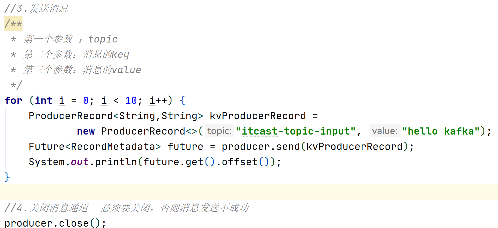

- 运行ConsumerQuickStart，接受Kafka Stream处理之后的消息：

  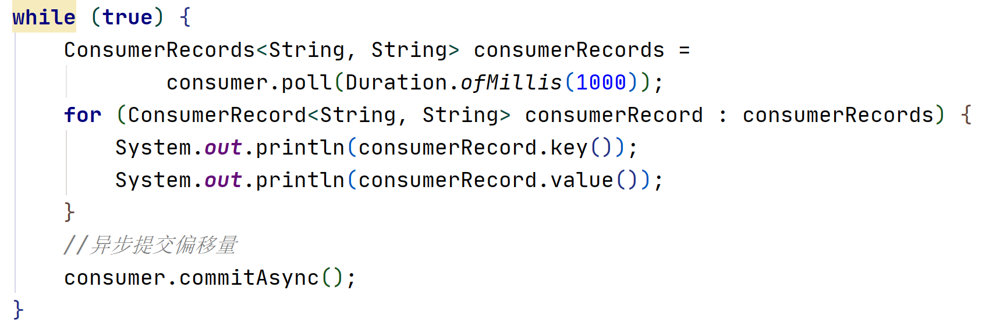

- 控制台输出：

  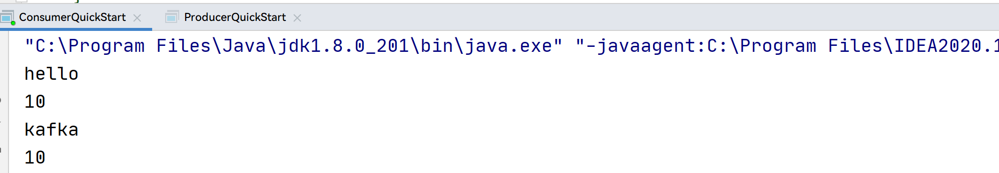

  

## 3 热点文章计算

### 3.1 思路说明-07:12

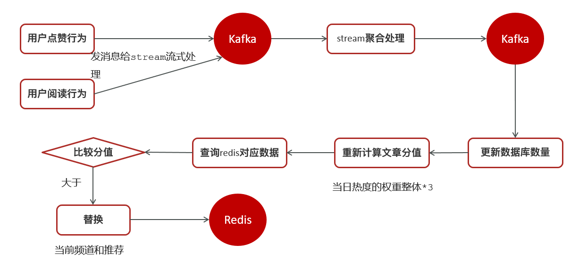

### 3.2 功能实现

#### 3.2.1 用户行为收集-07:51

用户操作（阅读量，评论，点赞，收藏）等后发送消息。

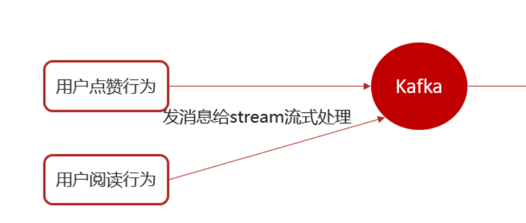

以阅读和点赞为例：

**①在heima-leadnews-behavior微服务中集成kafka生产者配置**

修改nacos新增内容，Data ID：leadnews-behavior

```yaml
spring:
  kafka:
    bootstrap-servers: 192.168.200.130:9092
    producer:
      retries: 10
      key-serializer: org.apache.kafka.common.serialization.StringSerializer
      value-serializer: org.apache.kafka.common.serialization.StringSerializer
```

**②在ApLikesBehaviorServiceImpl中新增发送消息**

定义消息发送封装类：UpdateArticleMess

```java
package com.heima.model.mess;

import lombok.Data;

@Data
public class UpdateArticleMess {

    /**
     * 修改文章的字段类型
      */
    private UpdateArticleType type;
    
    /**
     * 文章ID
     */
    private Long articleId;
    
    /**
     * 修改数据的增量，可为正负
     */
    private Integer add;

    public enum UpdateArticleType{
        COLLECTION,COMMENT,LIKES,VIEWS;
    }
}
```

topic常量类：

```java
package com.heima.common.constants;

public class HotArticleConstants {

    //接受用户行为消息的topic
    public static final String HOT_ARTICLE_SCORE_TOPIC="hot.article.score.topic";
    
    //流式计算之后发送消息的topic
    public static final String HOT_ARTICLE_INCR_HANDLE_TOPIC="hot.article.incr.handle.topic";
   
}
```

修改点赞like()：新增发送消息代码

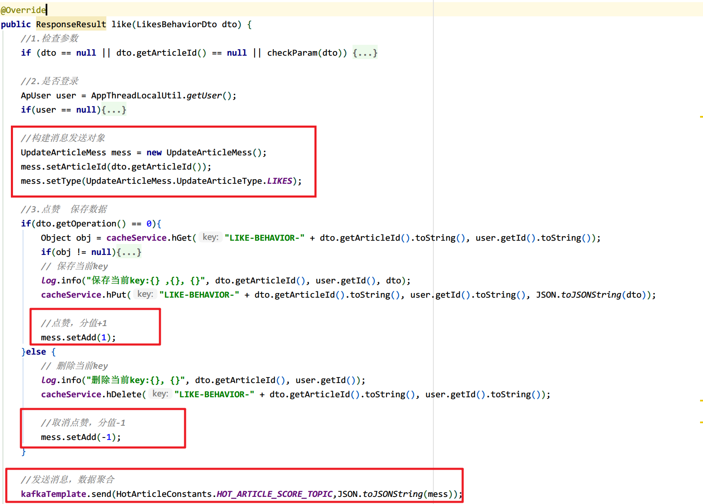

```java
@Autowired
private KafkaTemplate<String,String> kafkaTemplate;

@Override
public ResponseResult like(LikesBehaviorDto dto) {

    //1.检查参数
    //省略...

    //2.是否登录
    ApUser user = AppThreadLocalUtil.getUser();
    //省略...

    //构建消息发送对象
    UpdateArticleMess mess = new UpdateArticleMess();
    mess.setArticleId(dto.getArticleId());
    mess.setType(UpdateArticleMess.UpdateArticleType.LIKES);

    //3.点赞  保存数据
    if (dto.getOperation() == 0) {
        //省略...
        
        //点赞，分值+1
        mess.setAdd(1);
    } else {
		//省略...
        
        //取消点赞，分值-1
        mess.setAdd(-1);
    }

    //发送消息，数据聚合
	kafkaTemplate.send(HotArticleConstants.HOT_ARTICLE_SCORE_TOPIC,JSON.toJSONString(mess));
    
    return ResponseResult.okResult(AppHttpCodeEnum.SUCCESS);
}
```

**③修改阅读行为的类ApReadBehaviorServiceImpl发送消息**

修改阅读readBehavior()：

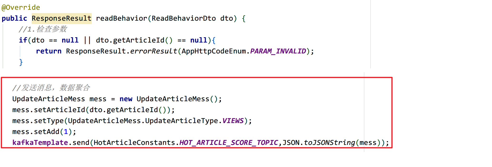

```java
@Autowired
private KafkaTemplate<String,String> kafkaTemplate;

@Override
public ResponseResult readBehavior(ReadBehaviorDto dto) {
    //省略...

    //发送消息，数据聚合
    UpdateArticleMess mess = new UpdateArticleMess();
    mess.setArticleId(dto.getArticleId());
    mess.setType(UpdateArticleMess.UpdateArticleType.VIEWS);
    mess.setAdd(1);
    kafkaTemplate.send(HotArticleConstants.HOT_ARTICLE_SCORE_TOPIC,JSON.toJSONString(mess));
    return ResponseResult.okResult(AppHttpCodeEnum.SUCCESS);
}
```


**④在用户网关服务中添加路由**

leadnews-app-gateway

```yml
         #行为微服务
        - id: behavior
          uri: lb://leadnews-behavior
          predicates:
            - Path=/behavior/**
          filters:
            - StripPrefix= 1
```


#### 3.2.2 文章服务聚合消息内容

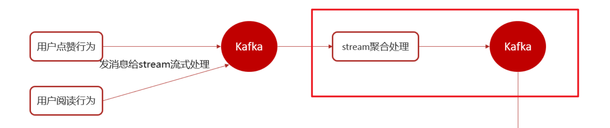

##### 3.2.2.1 集成kafkaStreams-11:32

在leadnews-article微服务中集成kafkaStream（参考kafka-demo）

```xml
<dependency>
    <groupId>org.apache.kafka</groupId>
    <artifactId>kafka-streams</artifactId>
    <exclusions>
        <exclusion>
            <groupId>org.apache.kafka</groupId>
            <artifactId>connect-json</artifactId>
        </exclusion>
        <exclusion>
            <groupId>org.apache.kafka</groupId>
            <artifactId>kafka-clients</artifactId>
        </exclusion>
    </exclusions>
</dependency>
```

1. 自定义配置类：KafkaStreamConfig

   ```java
   package com.heima.article.config;
   
   /**
    * 通过重新注册KafkaStreamsConfiguration对象，设置自定配置参数
    */
   @Setter
   @Getter
   @Configuration
   @EnableKafkaStreams
   @ConfigurationProperties(prefix="kafka")
   public class KafkaStreamConfig {
       private static final int MAX_MESSAGE_SIZE = 16* 1024 * 1024;
       private String hosts;
       private String group;
       
       
       @Bean(name = KafkaStreamsDefaultConfiguration.DEFAULT_STREAMS_CONFIG_BEAN_NAME)
       public KafkaStreamsConfiguration defaultKafkaStreamsConfig() {
           Map<String, Object> props = new HashMap<>();
           props.put(StreamsConfig.BOOTSTRAP_SERVERS_CONFIG, hosts);
           props.put(StreamsConfig.APPLICATION_ID_CONFIG, this.getGroup()+"_stream_aid");
           props.put(StreamsConfig.CLIENT_ID_CONFIG, this.getGroup()+"_stream_cid");
           props.put(StreamsConfig.RETRIES_CONFIG, 10);
           props.put(StreamsConfig.DEFAULT_KEY_SERDE_CLASS_CONFIG,
                     Serdes.String().getClass());
           props.put(StreamsConfig.DEFAULT_VALUE_SERDE_CLASS_CONFIG, 
                     Serdes.String().getClass());
           return new KafkaStreamsConfiguration(props);
       }
   }
   ```
   
2. 在Nacos中添加kafkaStream配置，Data ID: leadnews-article

   ```yaml
   kafka:
     hosts: 192.168.200.130:9092
     group: ${spring.application.name}
   ```

3. 创建HotArticleStreamHandler，完成消息聚合

   ```java
   @Configuration
   @Slf4j
   public class HotArticleStreamHandler {
   
    @Bean
       public KStream<String, String> kStream(StreamsBuilder streamsBuilder) {
           //1.接收消息
           //2.聚合流式处理
           //3.发送消息
           return null;
       }
   }
   ```

##### 3.2.2.2 接受&发送消息

2. 接受消息，完成聚合后法从消息

   ```java
   @Bean
   public KStream<String, String> kStream(StreamsBuilder streamsBuilder) {
       //1.接收消息
       KStream<String, String> stream =
               streamsBuilder.stream(HotArticleConstants.HOT_ARTICLE_SCORE_TOPIC);
   
       //2.聚合流式处理
       stream.map((key, value) -> {
           //将json字符串转成对象
           UpdateArticleMess mess = JSON.parseObject(value, UpdateArticleMess.class);
   
           //重置消息的key和value: likes:1
           //key = 文章的ID， value = 操作类型:likes
           return new KeyValue<>(
                   mess.getArticleId().toString(), //key
                   mess.getType().name() + ":" + mess.getAdd()); //value
       }).groupBy((key, value) -> key) //按照文章id进行聚合
               .windowedBy(TimeWindows.of(Duration.ofSeconds(10))) //时间窗口
               .aggregate(
                       //初始方法，返回值是消息的value
                       new Initializer<String>() {
                           @Override
                           public String apply() {
                               return null;
                           }
                       },
                       //真正的聚合操作，返回值是消息的value
                       new Aggregator<String, String, String>() {
                           @Override
                           public String apply(String key, String value,
                                               String aggValue) {
                               return null;
                           }
                       }, Materialized.as("hot-atricle-stream-count-001"))
               .toStream()
           	//3.发送消息
               .to(HotArticleConstants.HOT_ARTICLE_INCR_HANDLE_TOPIC); 
       return stream;
   }
   ```

##### 3.2.2.3 聚合流式处理-16:44

将用户的行为进行收集，并计算分值

```java
@Bean
public KStream<String, String> kStream(StreamsBuilder streamsBuilder) {
    //1.接收消息
    KStream<String, String> stream =
            streamsBuilder.stream(HotArticleConstants.HOT_ARTICLE_SCORE_TOPIC);

    //2.聚合流式处理
    stream.map((key, value) -> {
        System.out.println("接收到消息:" + value);
        //将json字符串转成对象
        UpdateArticleMess mess = JSON.parseObject(value, UpdateArticleMess.class);

        //重置消息的key和value: likes:1
        //key = 文章的ID， value = 操作类型:1
        return new KeyValue<>(
                mess.getArticleId().toString(), //文章的ID
                mess.getType().name() + ":" + mess.getAdd()); //LIKES:1
    }).groupBy((key, value) -> key) //按照文章id进行聚合
            .windowedBy(TimeWindows.of(Duration.ofSeconds(30))) //时间窗口
            .aggregate(
                    //初始方法，返回值是消息的value
                    () -> "COLLECTION:0,COMMENT:0,LIKES:0,VIEWS:0",
                    //真正的聚合操作，返回值是消息的value
                    (key, value, aggValue) -> {
                        if (StringUtils.isBlank(value)) {
                            return aggValue;
                        }
                        String[] aggAry = aggValue.split(",");
                        int collect = 0, comment = 0, like = 0, view = 0;
                        for (String agg : aggAry) {
                            String[] split = agg.split(":");
                            /*
                              获得初始值，也是时间窗口内计算之后的值
                             */
                            switch (UpdateArticleMess.UpdateArticleType.valueOf(split[0])) {
                                case COLLECTION:
                                    collect = Integer.parseInt(split[1]);
                                    break;
                                case COMMENT:
                                    comment = Integer.parseInt(split[1]);
                                    break;
                                case LIKES:
                                    like = Integer.parseInt(split[1]);
                                    break;
                                case VIEWS:
                                    view = Integer.parseInt(split[1]);
                                    break;
                            }
                        }
                        /*
                          累加操作
                         */
                        String[] valAry = value.split(":");
                        switch (UpdateArticleMess.UpdateArticleType.valueOf(valAry[0])) {
                            case COLLECTION:
                                collect += Integer.parseInt(valAry[1]);
                                break;
                            case COMMENT:
                                comment += Integer.parseInt(valAry[1]);
                                break;
                            case LIKES:
                                like += Integer.parseInt(valAry[1]);
                                break;
                            case VIEWS:
                                view += Integer.parseInt(valAry[1]);
                                break;
                        }

                        String formatStr =
                                String.format("COLLECTION:%d,COMMENT:%d,LIKES:%d,VIEWS:%d",
                                        collect, comment, like, view);
                        System.out.println("文章的id:" + key);
                        System.out.println("当前时间窗口内的消息处理结果：" + formatStr);
                        return formatStr;
                    }, Materialized.as("hot-atricle-stream-count-001"))
            .toStream()
            .to(HotArticleConstants.HOT_ARTICLE_INCR_HANDLE_TOPIC); //3.发送消息
    return stream;
}
```

##### 3.2.2.4 集成测试

```asciiarmor
#由于文章详情页面是提前生成上传到MinIO中的，地址为http://192.168.200.130:9000/minio/xxxx.html
#因此文章详情页面中进行阅读、点赞等操作时需要配置自己服务器的网关地址
#跨域访问：http://192.168.200.130:9000 -》 本机app网关（http://192.168.75.25:51601/）
#在app-gateway中配置：允许跨域访问
```

```yml
#CROS：跨域配置
spring:
  application:
    name: leadnews-app-gateway
  cloud:
    gateway:
      globalcors: # 全局的跨域处理
        add-to-simple-url-handler-mapping: true # 解决options请求被拦截问题
        corsConfigurations:
          '[/**]':
            allowedOrigins: "*"
            allowedMethods: # 允许的跨域ajax的请求方式
              - "GET"
              - "POST"
              - "DELETE"
              - "PUT"
              - "OPTIONS"
            allowedHeaders: "*" # 允许在请求中携带的头信息
            allowCredentials: true # 是否允许携带cookie
            maxAge: 360000 # 这次跨域检测的有效期 
```

**启动app端网关微服务AppGatewayApplication：**

访问http://yourIp:51601，进行测试如果能看到如下信息则说明配置正确：

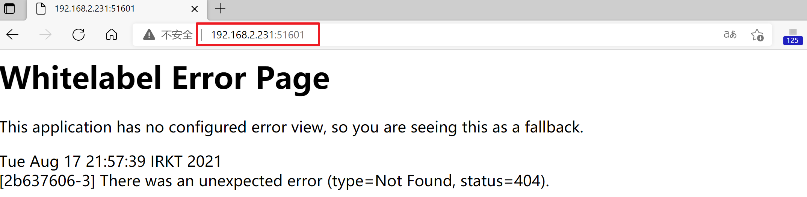

```asciiarmor
#在文章详情模板的article.ftl中是通过引入index.js来指定网关，因此需要修改index.js中的配置
#minio上的plugins/js/index.js
```

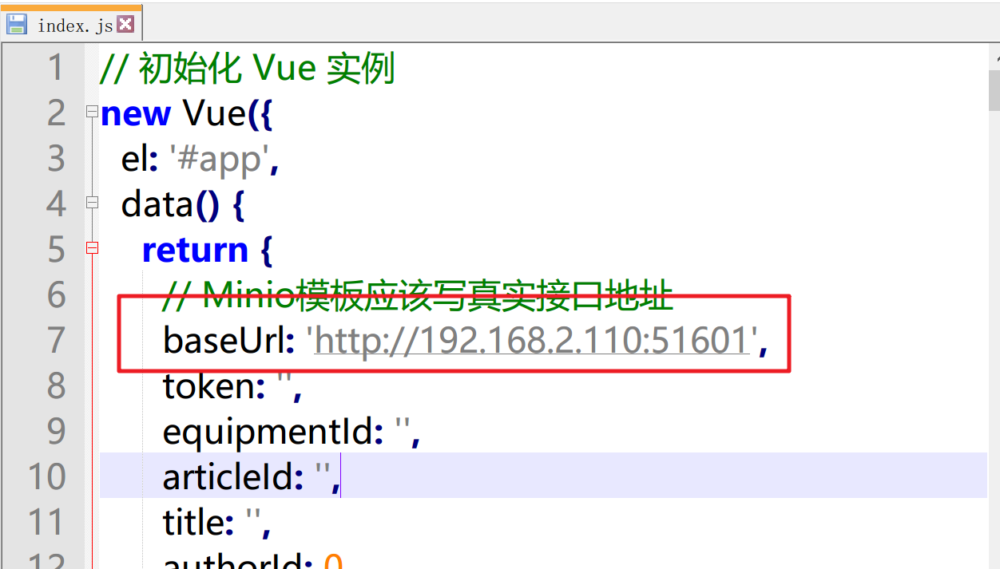 

```js
// 初始化 Vue 实例
new Vue({
  el: '#app',
  data() {
    return {
      // Minio模板应该写自己的网关IP地址和端口
      baseUrl: 'http://yourIp:51601',
```

````json
#修改完成后，重新上传index.js
````

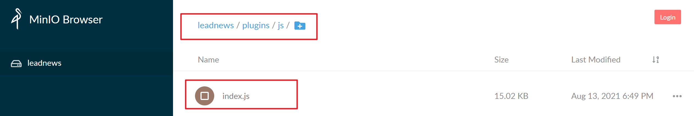

````asciiarmor
#1.通过minio-demo的单元测试重新上传index.js
#2.清除浏览器缓存后重新访问app端首页
````

启动如下几个微服务：

- app网关微服务
- 文章微服务
- 行为微服务
- 用户微服务

查看文章详情或者点击喜欢，都会触发用户行为收集

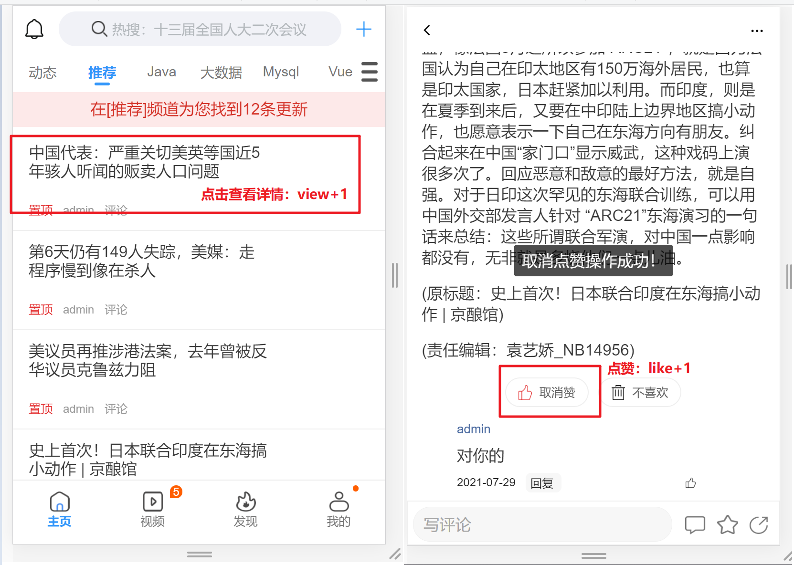

访问文章详情，看后台消息聚合：

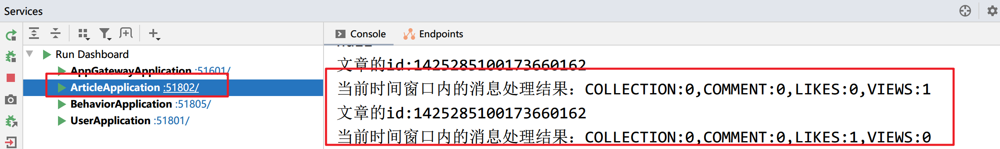


##### 3.2.2.5 组装消息内容-07:58

将文章ID和聚合后的分值组装起来：

①定义实体类，用于聚合之后的分值封装

```java
package com.heima.model.article.mess;

import lombok.Data;

@Data
public class ArticleVisitStreamMess {
    /**
     * 文章id
     */
    private Long articleId;
    /**
     * 阅读
     */
    private int view;
    /**
     * 收藏
     */
    private int collect;
    /**
     * 评论
     */
    private int comment;
    /**
     * 点赞
     */
    private int like;
}
```

②封装消息内容

```java
/**
 * 格式化消息的value数据
 *
 * @param articleId
 * @param value
 * @return
 */
public String formatObj(String articleId, String value) {
    ArticleVisitStreamMess mess = new ArticleVisitStreamMess();
    mess.setArticleId(Long.valueOf(articleId));
    //COLLECTION:0,COMMENT:0,LIKES:0,VIEWS:0
    String[] valAry = value.split(",");
    for (String val : valAry) {
        String[] split = val.split(":");
        switch (UpdateArticleMess.UpdateArticleType.valueOf(split[0])) {
            case COLLECTION:
                mess.setCollect(Integer.parseInt(split[1]));
                break;
            case COMMENT:
                mess.setComment(Integer.parseInt(split[1]));
                break;
            case LIKES:
                mess.setLike(Integer.parseInt(split[1]));
                break;
            case VIEWS:
                mess.setView(Integer.parseInt(split[1]));
                break;
        }
    }
    log.info("聚合消息处理之后的结果为:{}", JSON.toJSONString(mess));
    return JSON.toJSONString(mess);
}
```

③ 完成消息组装

```java
@Bean
public KStream<String, String> kStream(StreamsBuilder streamsBuilder) {
    //1.接收消息
    KStream<String, String> stream =
            streamsBuilder.stream(HotArticleConstants.HOT_ARTICLE_SCORE_TOPIC);

    //2.聚合流式处理
    stream.map((key, value) -> {
        //将json字符串转成对象
        UpdateArticleMess mess = JSON.parseObject(value, UpdateArticleMess.class);

        //重置消息的key和value: likes:1
        //key = 文章的ID， value = 操作类型:likes
        return new KeyValue<>(
                mess.getArticleId().toString(),
                mess.getType().name() + ":" + mess.getAdd());
    }).groupBy((key, value) -> key) //按照文章id进行聚合
            .windowedBy(TimeWindows.of(Duration.ofSeconds(10))) //时间窗口
            .aggregate(
                    //初始方法，返回值是消息的value
                    () -> "COLLECTION:0,COMMENT:0,LIKES:0,VIEWS:0",
                    //真正的聚合操作，返回值是消息的value
                    (key, value, aggValue) -> {
                        if (StringUtils.isBlank(value)) {
                            return aggValue;
                        }
                        String[] aggAry = aggValue.split(",");
                        int collect = 0, comment = 0, like = 0, view = 0;
                        for (String agg : aggAry) {
                            String[] split = agg.split(":");
                            /*
                              获得初始值，也是时间窗口内计算之后的值
                             */
                            switch (UpdateArticleMess.UpdateArticleType.valueOf(split[0])) {
                                case COLLECTION:
                                    collect = Integer.parseInt(split[1]);
                                    break;
                                case COMMENT:
                                    comment = Integer.parseInt(split[1]);
                                    break;
                                case LIKES:
                                    like = Integer.parseInt(split[1]);
                                    break;
                                case VIEWS:
                                    view = Integer.parseInt(split[1]);
                                    break;
                            }
                        }
                        /*
                          累加操作
                         */
                        String[] valAry = value.split(":");
                        switch (UpdateArticleMess.UpdateArticleType.valueOf(valAry[0])) {
                            case COLLECTION:
                                collect += Integer.parseInt(valAry[1]);
                                break;
                            case COMMENT:
                                comment += Integer.parseInt(valAry[1]);
                                break;
                            case LIKES:
                                like += Integer.parseInt(valAry[1]);
                                break;
                            case VIEWS:
                                view += Integer.parseInt(valAry[1]);
                                break;
                        }

                        String formatStr =
                                String.format("COLLECTION:%d,COMMENT:%d,LIKES:%d,VIEWS:%d",
                                        collect, comment, like, view);
                        System.out.println("文章的id:" + key);
                        System.out.println("当前时间窗口内的消息处理结果：" + formatStr);
                        return formatStr;
                    }, Materialized.as("hot-atricle-stream-count-001"))
            .toStream()
            .map((key, value) -> {
                return new KeyValue<>(
                        key.key().toString(),
                        formatObj(key.key().toString(), value));
            })
            .to(HotArticleConstants.HOT_ARTICLE_INCR_HANDLE_TOPIC); //3.发送消息
    return stream;
}
```


##### 3.2.2.6 另一种简单写法

```java
@Bean
public KStream<String, String> kStream(StreamsBuilder streamsBuilder) {
    //1.接收消息
    KStream<String, String> stream =
            streamsBuilder.stream(HotArticleConstants.HOT_ARTICLE_SCORE_TOPIC);

    //2.聚合流式处理
    stream.map((key, value) -> {
        //将json字符串转成对象
        UpdateArticleMess mess = JSON.parseObject(value, UpdateArticleMess.class);

        //重置消息的key和value: likes:1
        //key = 文章的ID， value = 操作类型(LIKES)
        return new KeyValue<>(
                //key = 1302862387124125698
                mess.getArticleId().toString(),
                //value = LIKES:1 or value = VIEWS:1
                mess.getType().name() + ":" + mess.getAdd());
    })
            .groupBy((key, value) -> key) //按照文章id进行聚合
            .windowedBy(TimeWindows.of(Duration.ofSeconds(30))) //时间窗口
            .aggregate(
                    //初始方法，返回值是消息的value
                    new Initializer<String>() {
                        @Override
                        public String apply() {
                            ArticleVisitStreamMess init = new ArticleVisitStreamMess();
                            return JSON.toJSONString(init);
                        }
                    },
                    //真正的聚合操作，返回值是消息的value
                    (key, value, aggValue) -> {
                        //没有用户行为，直接返回上次聚合结果
                        if (StringUtils.isBlank(value)) {
                            return aggValue;
                        }
                        //取出上次聚合结果
                        ArticleVisitStreamMess mess =
                                JSON.parseObject(aggValue, ArticleVisitStreamMess.class);

                        if(mess.getArticleId() == null){
                            //第一次给文章ID赋值
                            mess.setArticleId(Long.valueOf(key));
                        }
                        /*
                          累加操作
                         */
                        //COLLECTION:0 --> [COLLECTION, 0]
                        String[] valAry = value.split(":");
                        switch (UpdateArticleMess.UpdateArticleType.valueOf(valAry[0])) {
                            case COLLECTION:
                                mess.setCollect(mess.getCollect() + Integer.parseInt(valAry[1]));
                                break;
                            case COMMENT:
                                mess.setComment(mess.getComment() + Integer.parseInt(valAry[1]));
                                break;
                            case LIKES:
                                mess.setLike(mess.getLike() + Integer.parseInt(valAry[1]));
                                break;
                            case VIEWS:
                                mess.setView(mess.getView() + Integer.parseInt(valAry[1]));
                                break;
                        }
                        return JSON.toJSONString(mess);
                    },
                    Materialized.as("hot-atricle-stream-count-001"))
            .toStream()
            .map((key, value) -> {
                System.out.println("key: " + key.key() + ", value: " + value);
                return new KeyValue<>(key.key(), value);
            })
            .to(HotArticleConstants.HOT_ARTICLE_INCR_HANDLE_TOPIC); //3.发送消息
    return stream;
}
```

#### 3.2.3 接收聚合后的数据

在heima-leadnews-article中：定义监听，接收聚合之后的数据，文章的分值重新进行计算

```java
package com.heima.article.listener;

@Component
@Slf4j
public class ArticleIncrHandleListener {

    @Autowired
    private ApArticleService apArticleService;

    //指定接受的是流式计算之后的消息
    //{"articleId":1425285100173660162,"collect":0,"comment":0,"like":-1,"view":1}
	//{"articleId":1425285100173660777,"collect":0,"comment":0,"like":3,"view":4}
    @KafkaListener(topics = HotArticleConstants.HOT_ARTICLE_INCR_HANDLE_TOPIC)
    public void onMessage(String mess){
        System.out.println(mess);
        
        //TODO 根据消息内容更新文章分值
    }
}
```

#### 3.2.4 更新文章分值

```json
{"articleId":1425285100173660162,"collect":0,"comment":0,"like":-1,"view":1}

{"articleId":1425285100173660777,"collect":0,"comment":0,"like":3,"view":4}
```

重新计算文章的分值，更新到数据库和缓存中，在ApArticleService添加方法，用于更新数据库中的文章分值：

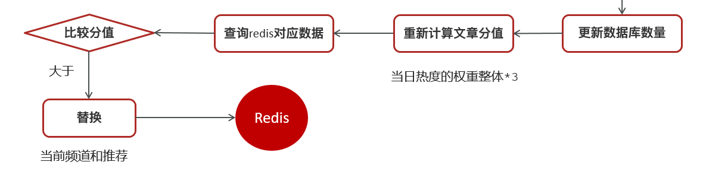

```java
/**
     * 更新文章的分值  同时更新缓存中的热点文章数据
     * @param mess
     */
public void updateScore(ArticleVisitStreamMess mess);
```

实现步骤：

```java
/**
     * 更新文章的分值  同时更新缓存中的热点文章数据
     * @param mess
     */
@Override
public void updateScore(ArticleVisitStreamMess mess) {
    //1.更新文章表的阅读、点赞、收藏、评论的数量
    //2.计算文章的分值
    //3.替换当前文章对应频道的热点数据
    //4.替换推荐对应的热点数据
}
```

##### 1、更新文章行为数量

在ApArticleServiceImpl中新增updateArticle()

```java
/**
 * 更新文章行为数量
 * @param mess
 */
private ApArticle updateArticle(ArticleVisitStreamMess mess) {
    ApArticle apArticle = getById(mess.getArticleId());
    
    apArticle.setCollection((apArticle.getCollection()==null ?
                             0 : apArticle.getCollection()) + mess.getCollect());
    apArticle.setComment((apArticle.getComment()==null?0:apArticle.getComment())+mess.getComment());
    apArticle.setLikes((apArticle.getLikes()==null?0:apArticle.getLikes())+mess.getLike());
    apArticle.setViews((apArticle.getViews()==null?0:apArticle.getViews())+mess.getView());
    updateById(apArticle);
    return apArticle;
}
```

实现类方法

```java
/**
     * 更新文章的分值  同时更新缓存中的热点文章数据
     * @param mess
     */
@Override
public void updateScore(ArticleVisitStreamMess mess) {
    //1.更新文章的阅读、点赞、收藏、评论的数量
    ApArticle apArticle = updateArticle(mess);
    //2.计算文章的分值
    Integer score = computeScore(apArticle);
    score = score * 3; //当日操作，热点值*3
    HotArticleVo hotArticleVo = new HotArticleVo();
    BeanUtils.copyProperties(apArticle,hotArticleVo);
    hotArticleVo.setScore(score);

    //3.替换当前文章对应频道的热点数据

    //4.替换推荐对应的热点数据

}

    /**
     * 根据用户行为计算文章的热点值
     */
    private Integer computeScore(ApArticle apArticle) {
        Integer score = 0;

        //按照需求上定义，不用的行为有不同的权重
        if (apArticle.getViews() != null) {
            score += apArticle.getViews() * ArticleConstants.HOT_ARTICLE_VIEW_WEIGHT;
        }

        if (apArticle.getLikes() != null) {
            score += apArticle.getLikes() * ArticleConstants.HOT_ARTICLE_LIKE_WEIGHT;
        }

        if (apArticle.getComment() != null) {
            score += apArticle.getComment() * ArticleConstants.HOT_ARTICLE_COMMENT_WEIGHT;
        }

        if (apArticle.getCollection() != null) {
            score += apArticle.getCollection() * ArticleConstants.HOT_ARTICLE_COLLECTION_WEIGHT;
        }

        return score;
    }
```


##### 2、替换Redis中的热点数据

```java
/**
 * 替换数据并且存入到redis
 */
private void replaceDataToRedis(HotArticleVo hotArticleVo, String redisKey) {
    //1.获取Redis中存储的当前频道下的热点文章
    String articleListStr = cacheService.get(redisKey);

    if (StringUtils.isNotBlank(articleListStr)) {
        List<HotArticleVo> hotArticleVoListInRedis =
                JSON.parseArray(articleListStr, HotArticleVo.class);

        boolean flag = true; //缓存中不存在此文章的热点值

        //2.1 缓存中存在该文章，只更新分值
        for (HotArticleVo vo : hotArticleVoListInRedis) {
            if (hotArticleVo.getId().equals(vo.getId())) {
                //找到了更新分值
                vo.setScore(hotArticleVo.getScore()); 
                flag = false;
                break;
            }
        }

        //2.2 缓存中不存在，直接加进去
        if (flag) {
            hotArticleVoListInRedis.add(hotArticleVo)
        }
        
        //加进去之后，需要重新按照分值排序
        List<HotArticleVo> list = hotArticleVoListInRedis.stream()
            .sorted(Comparator.comparing(HotArticleVo::getScore).reversed())
            .limit(30)
            .collect(Collectors.toList());
        
        //放入redis
        String s = JSON.toJSONString(list);
        //判断处理完的数据和一开始数据是否一样，如果不一样才保存
        if(!articleListStr.equals(s)){
            cacheService.set(redisKey, s);
        }
       
    }
}
```


##### 3、替换指定频道&推荐

```java
/**
 * 更新文章的分值  同时更新缓存中的热点文章数据
 */
@Override
public void updateScore(ArticleVisitStreamMess mess) {
    //1.更新文章的阅读、点赞、收藏、评论的数量
    ApArticle apArticle = updateArticle(mess);
    //2.计算文章的分值
    Integer score = computeScore(apArticle);
    HotArticleVo hotArticleVo = new HotArticleVo();
    BeanUtils.copyProperties(apArticle,hotArticleVo);
    hotArticleVo.setScore(score);
    
    //3.替换当前文章对应频道的热点数据
    replaceDataToRedis(hotArticleVo,ArticleConstants.HOT_ARTICLE_FIRST_PAGE + apArticle.getChannelId());

    //4.替换推荐对应的热点数据
    replaceDataToRedis(hotArticleVo,ArticleConstants.HOT_ARTICLE_FIRST_PAGE + ArticleConstants.DEFAULT_TAG);
}
```


##### 4、完善接收消息调用

 ArticleIncrHandleListener

```java
//指定接受的是流式计算之后的消息
//{"articleId":1425285100173660162,"collect":0,"comment":0,"like":-1,"view":1}
//{"articleId":1425285100173660777,"collect":0,"comment":0,"like":3,"view":4}
@KafkaListener(topics = HotArticleConstants.HOT_ARTICLE_INCR_HANDLE_TOPIC)
public void onMessage(String msg) {
    log.info("接收到聚合的消息：" + msg);

    //{"articleId":1425285100173660777,"collect":0,"comment":0,"like":3,"view":4}
    //根据本次聚合结果，更新数据库+缓存
    apArticleService.updateScore(JSON.parseObject(msg, ArticleVisitStreamMess.class));
}
```

### 3.3 综合测试

1. 启动如下微服务

   - app端网关
   - 用户
   - 文章
   - 用户行为
   - 自媒体
   

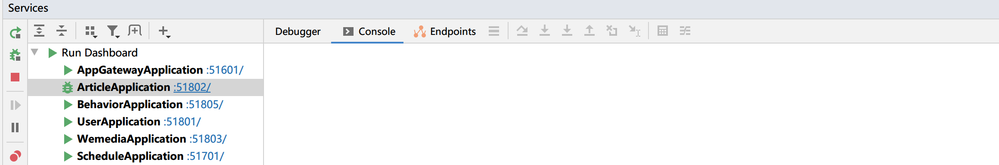

2. 登录XXL-Job管理平台：http://192.168.200.130:8888/xxl-job-admin/

   执行热点文章计算任务

   ````json
   #必须保证Redis中存在热点文章的数据记录
   ````

   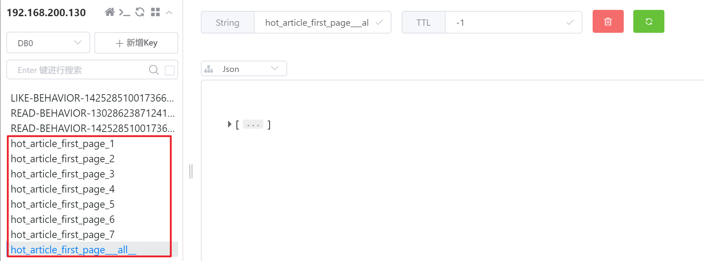

3. 访问app端首页，进行文章浏览和点赞等操作：http://localhost:8801/#/home

   操作后，观察Redis中文章score的变化：

   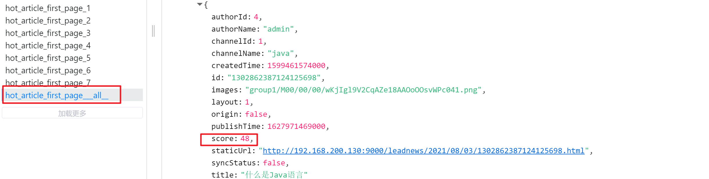


