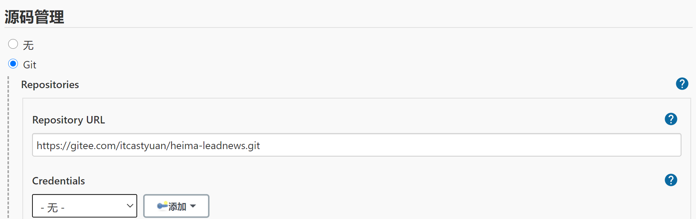
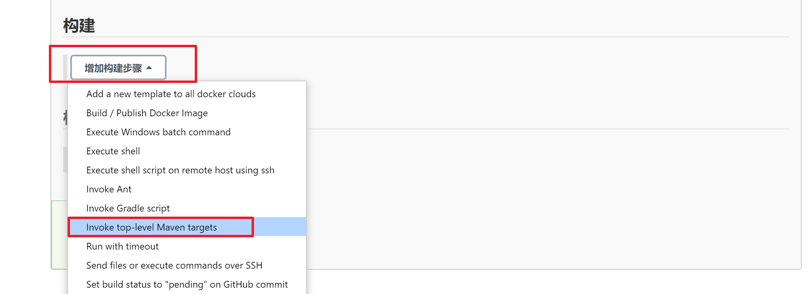

# 项目部署_持续集成【运维】

## 1 今日内容介绍

### 1.1 什么是持续集成

持续集成（ Continuous integration ， 简称 CI ）指的是，频繁地（一天多次）将代码集成到主干


**持续集成的组成要素**

一个自动构建过程， 从检出代码、 编译构建、 运行测试、 结果记录、 测试统计等都是自动完成的， 无需人工干预。

一个代码存储库，即需要版本控制软件来保障代码的可维护性，同时作为构建过程的素材库，一般使用SVN或Git。

一个持续集成服务器， Jenkins 就是一个配置简单和使用方便的持续集成服务器。

### 1.2 持续集成的好处

1、降低风险，由于持续集成不断去构建，编译和测试，可以很早期发现问题，所以修复的代价就少； 

2、对系统健康持续检查，减少发布风险带来的问题；

3、减少重复性工作；

4、持续部署，提供可部署单元包；

5、持续交付可供使用的版本；

6、增强团队信心；


### 1.3 今日内容


## 2 软件开发模式

### 2.1 软件开发生命周期

软件开发生命周期又叫做SDLC（Software Development Life Cycle），它是集合了计划、开发、测试和部署过程的集合。如下图所示 ：


- 需求分析

  这是生命周期的第一阶段，根据项目需求，团队执行一个可行性计划的分析。项目需求可能是公司内部或者客户提出的。这阶段主要是对信息的收集，也有可能是对现有项目的改善和重新做一个新的项目。还要分析项目的预算多长，可以从哪方面受益及布局，这也是项目创建的目标。

- 设计

  第二阶段就是设计阶段，系统架构和满意状态（就是要做成什么样子，有什么功能），和创建一个项目计划。计划可以使用图表，布局设计或者文字的方式呈现。

- 开发实现

  第三阶段就是实现阶段，项目经理创建和分配工作给开者，开发者根据任务和在设计阶段定义的目标进行开发代码。依据项目的大小和复杂程度，可以需要数月或更长时间才能完成。1

- 测试

  测试人员进行代码测试 ，包括功能测试、代码测试、压力测试等。

- 进化

  最后进阶段就是对产品不断的进化改进和维护阶段，根据用户的使用情况，可能需要对某功能进行修改，bug修复，功能增加等。

### 2.2 软件开发瀑布模型

瀑布模型是最著名和最常使用的软件开发模型。瀑布模型就是一系列的软件开发过程。它是由制造业繁衍出来的。一个高度化的结构流程在一个方向上流动，有点像生产线一样。在瀑布模型创建之初，没有其它开发的模型，有很多东西全靠开发人员去猜测，去开发。这样的模型仅适用于那些简单的软件开发， 但是已经不适合现在的开发了。

下图对软件开发模型的一个阐述。


| 优势                                       | 劣势                                                         |
| ------------------------------------------ | ------------------------------------------------------------ |
| 简单易用和理解                             | 各个阶段的划分完全固定，阶段之间产生大量的文档，极大地增加了工作量。 |
| 当前一阶段完成后，您只需要去关注后续阶段。 | 由于开发模型是线性的，用户只有等到整个过程的末期才能见到开发成果，从而增加了开发风险。 |
| 为项目提供了按阶段划分的检查节点           | 瀑布模型的突出缺点是不适应用户需求的变化。                   |

### 2.3 软件的敏捷开发

- 什么是敏捷开发？

  敏捷开发（Agile Development） 的核心是迭代开发（Iterative Development） 与 增量开发（Incremental Development）。

- 何为迭代开发？

  对于大型软件项目，传统的开发方式是采用一个大周期（比如一年）进行开发，整个过程就是一次"大开发"；迭代开发的方式则不一样，它将开发过程拆分成多个小周期，即一次"大开发"变成多次"小开发"，每次小开发都是同样的流程，所以看上去就好像重复在做同样的步骤。

  举例来说，SpaceX 公司想造一个大推力火箭，将人类送到火星。但是，它不是一开始就造大火箭，而是先造一个最简陋的小火箭 Falcon 1。结果，第一次发射就爆炸了，直到第四次发射，才成功进入轨道。然后，开发了中型火箭 Falcon 9，九年中发射了70次。最后，才开发 Falcon 重型火箭。如果SpaceX 不采用迭代开发，它可能直到现在还无法上天。

- 何为增量开发？

  软件的每个版本，都会新增一个用户可以感知的完整功能。也就是说，按照新增功能来划分迭代。

  举例来说，房产公司开发一个10栋楼的小区。如果采用增量开发的模式，该公司第一个迭代就是交付一号楼，第二个迭代交付二号楼......每个迭代都是完成一栋完整的楼。而不是第一个迭代挖好10栋楼的地基，第二个迭代建好每栋楼的骨架，第三个迭代架设屋顶......

- 敏捷开发如何迭代？

  虽然敏捷开发将软件开发分成多个迭代，但是也要求，每次迭代都是一个完整的软件开发周期，必须按照软件工程的方法论，进行正规的流程管理。
  
- TDD（测试test驱动driveer开发dev）

  先写单元测试，把所有的测试用例写出来，然后再来实现功能，执行单元测试


- 敏捷开发有什么好处？

  - 早期交付

    敏捷开发的第一个好处，就是早期交付，从而大大降低成本。 还是以上一节的房产公司为例，如果按照传统的"瀑布开发模式"，先挖10栋楼的地基、再盖骨架、然后架设屋顶，每个阶段都等到前一个阶段完成后开始，可能需要两年才能一次性交付10栋楼。也就是说，如果不考虑预售，该项目必须等到两年后才能回款。 敏捷开发是六个月后交付一号楼，后面每两个月交付一栋楼。因此，半年就能回款10%，后面每个月都会有现金流，资金压力就大大减轻了。

  - 降低风险

    敏捷开发的第二个好处是，及时了解市场需求，降低产品不适用的风险。 请想一想，哪一种情况损失比较小：10栋楼都造好以后，才发现卖不出去，还是造好第一栋楼，就发现卖不出去，从而改进或停建后面9栋楼？

## 3 Jenkins安装配置

### 3.1 Jenkins介绍


Jenkins  是一款流行的开源持续集成（Continuous Integration）工具，广泛用于项目开发，具有自动化构建、测试和部署等功能。官网：  http://jenkins-ci.org/。

Jenkins的特征：

- 开源的 Java语言开发持续集成工具，支持持续集成，持续部署。
- 易于安装部署配置：可通过 yum安装,或下载war包以及通过docker容器等快速实现安装部署，可方便web界面配置管理。
- 消息通知及测试报告：集成 RSS/E-mail通过RSS发布构建结果或当构建完成时通过e-mail通知，生成JUnit/TestNG测试报告。
- 分布式构建：支持 Jenkins能够让多台计算机一起构建/测试。
- 文件识别： Jenkins能够跟踪哪次构建生成哪些jar，哪次构建使用哪个版本的jar等。
- 丰富的插件支持：支持扩展插件，你可以开发适合自己团队使用的工具，如 git，svn，maven，docker等。


Jenkins安装和持续集成环境配置


1 ）首先，开发人员每天进行代码提交，提交到Git仓库

2）然后，Jenkins作为持续集成工具，使用Git工具到Git仓库拉取代码到集成服务器，再配合JDK，Maven等软件完成代码编译，代码测试与审查，测试，打包等工作，在这个过程中每一步出错，都重新再执行一次整个流程。

3）最后，Jenkins把生成的jar或war包分发到测试服务器或者生产服务器，测试人员或用户就可以访问应用。

### 3.2 Jenkins环境搭建

#### 3.2.1  Jenkins安装配置

1. 采用YUM方式安装

   ```sh
   #卸载之前的版本
   yum remove jenkins
   ```

   加入jenkins安装源：

   ```sh
   sudo wget -O /etc/yum.repos.d/jenkins.repo https://pkg.jenkins.io/redhat-stable/jenkins.repo --no-check-certificate
   
   sudo rpm --import https://pkg.jenkins.io/redhat-stable/jenkins.io.key
   ```

   删除之前的配置：

   ```
   rm -rf /etc/sysconfig/jenkins
   ```

   执行yum命令安装：

   ```sh
   yum -y install jenkins
   ```

2. 配置：

   ```sh
   vi /etc/sysconfig/jenkins
   #底行模式输入/_USER，回车搜索
   ```

   **修改已有的内容，不是新增：**

   ```sh
   # 修改为对应的目标用户， 这里使用的是root
   JENKINS_USER="root"
   # 服务监听端口
   JENKINS_PORT="16060"
   ```

   目录权限：

   ```sh
   chown -R root:root /var/lib/jenkins
   chown -R root:root /var/cache/jenkins
   chown -R root:root /var/log/jenkins
   ```

   重启：

   ```sh
   systemctl restart jenkins
   ```

   如果启动失败， 出现错误信息：

   ```sh
   Starting Jenkins bash: /usr/bin/java: No such file or directory
   ```

   创建JAVA环境的软链接：

   ```sh
   ln -s /usr/local/jdk/bin/java /usr/bin/java
   ```

3. 管理后台初始化设置

   http://192.168.200.130:16060/login

   需要输入管理密码， 在以下位置查看：

   ```sh
   cat /var/lib/jenkins/secrets/initialAdminPassword
   ```

    

   按默认设置，把建议的插件都安装上

    

   这一步等待时间较长， 安装完成之后， 创建管理员用户：

   ```
   用户名：itcast   
   密码：itcast
   ```

    

配置访问地址：http://192.168.200.130:16060/

配置完成之后， 会进行重启， 之后可以看到管理后台：


#### 3.2.2  Jenkins插件安装

在实现持续集成之前， 需要确保以下插件安装成功。

- Maven Integration plugin： Maven 集成管理插件。
- Docker plugin： Docker集成插件。
- GitLab Plugin： GitLab集成插件。
- Publish Over SSH：远程文件发布插件。
- SSH: 远程脚本执行插件。

安装方法：

1. 进入【系统管理】-【插件管理】

2. 点击标签页的【可选插件】

   在过滤框中搜索插件名称

   

3. 勾选插件， 点击直接安装即可。

>注意，如果没有安装按钮，需要更改配置
>
>在安装插件的高级配置中，修改升级站点的连接为：http://updates.jenkins.io/update-center.json   保存
>
> 
>
>

#### 3.2.3  Git安装配置

1. yum 安装方式

   ```sh
   yum -y install git
   ```

3. 检查git版本

   ```sh
   git version
   #git version 1.8.3.1
   ```


#### 3.2.4  Maven安装配置

1. 上传资料中的安装包apache-maven-3.6.1.zip到Linux中

2. 解压安装包

   ```sh
   mkdir -p /usr/local/maven
   cd /usr/local/maven
   unzip -o apache-maven-3.6.1.zip 
   
   #如果解压报错，说明没装unzip，安装后再解压
   yum install -y unzip
   ```

   上传本地Maven仓库并解压：

   ```sh
   mkdir /usr/local/maven/apache-maven-3.6.1/repository_new
   ```

   

3. 配置

   环境变量配置

   ```sh
   vi /etc/profile
   ```

   增加Maven配置：

   ```sh
   export MAVEN_HOME=/usr/local/maven/apache-maven-3.6.1
   export PATH=$PATH:$MAVEN_HOME/bin
   ```

   如果权限不够，则需要增加当前目录的权限

   ```shell
   chmod 777 /usr/local/maven/apache-maven-3.6.1/bin/mvn
   #chmod u+x /usr/local/maven/apache-maven-3.6.1/bin/mvn
   ```
   
   修改镜像仓库配置：
   
   ```sh
   vi /usr/local/maven/apache-maven-3.6.1/conf/settings.xml
   ```
   
   ```xml
      <localRepository>/usr/local/maven/apache-maven-3.6.1/repository_new</localRepository>
   ```

   需要把本机的仓库打包上传到服务器上（不上传会自动下载，花费不少时间），然后指定上传后的仓库配置

   

#### 3.2.5  Docker安装配置

> **虚拟机中已安装docker，不用重复安装**
>
> 1. ~~更新软件包版本~~
>
>    ```sh
>    yum -y update
>    ```
>
> 2. ~~卸载旧版本~~
>
>    ```sh
>    yum -y remove docker  docker-common docker-selinux docker-engine
>    ```
>
> 3. ~~安装软件依赖包~~
>
>    ```sh
>    yum install -y yum-utils device-mapper-persistent-data lvm2
>    ```
>
> 4. ~~设置yum源为阿里云~~
>
>    ```sh
>    sudo yum-config-manager --add-repo http://mirrors.aliyun.com/docker-ce/linux/centos/docker-ce.repo
>    ```


5. 安装后查看docker版本

   ```sh
   docker -v
   ```

6. 启动

   设置开机启动：

   ```sh
   systemctl enable docker
   ```

   启动docker

   ```sh
   systemctl start docker
   ```


###  3.3 Jenkins工具配置

1. 进入【系统管理】--> 【全局工具配置】

   

2. MAVEN配置全局设置

   

3. 指定JDK配置

   


4. 指定MAVEN 目录

   ```
   /usr/local/maven/apache-maven-3.6.1
   ```

   

5. 指定DOCKER目录

   ```
   /usr/local/docker
   ```

   

   如果不清楚docker的安装的目录，可以使用`whereis docker` 命令查看docker的安装的目录


## 4 后端项目部署

### 4.1 多环境切换

在项目开发部署的过程中，一般都会有三套项目环境

- Development ：开发环境, dev

- Production ：生产环境, prod

- Test ：测试环境, test

例如：开发环境的mysql连接的是本地，生产环境需要连接线上的mysql环境


### 4.2 微服务中多环境配置

**以用户微服务进行演示：**

1.在微服务中的bootstrap.yml中新增配置

```yaml
server:
  port: 51801
spring:
  application:
    name: leadnews-user
  cloud:
    nacos:
      discovery:
        server-addr: 192.168.200.130:8848
      config:
        server-addr: 192.168.200.130:8848
        file-extension: yml
  profiles:
    active: dev #使用dev开发环境, test测试，prod生产
```

2.在nacos的配置中心中新增各个环境的配置文件，例如user微服务中新增开发环境dev和生产环境prod

 

```yml
spring:
  datasource:
    driver-class-name: com.mysql.jdbc.Driver
    url: jdbc:mysql://192.168.200.130:3306/leadnews_user?useUnicode=true&characterEncoding=UTF-8&serverTimezone=UTC&useSSL=false
    username: root
    password: root
# 设置Mapper接口所对应的XML文件位置，如果你在Mapper接口中有自定义方法，需要进行该配置
mybatis-plus:
  mapper-locations: classpath*:mapper/*.xml
  # 设置别名包扫描路径，通过该属性可以给包中的类注册别名
  type-aliases-package: com.heima.model.user.pojos
  configuration:
    log-impl: org.apache.ibatis.logging.stdout.StdOutImpl
```

注意事项：

其中DataID属性命名有规范：

- prefix，默认使用${spring.application.name}，也可以通过spring.cloud.nacos.config.prefix来配置。
- spring.profile.active，即为当前环境对应的 profile，详情可以参考 Spring Boot文档。 注意：当 spring.profile.active 为空时，对应的连接符 - 也将不存在，dataId 的拼接格式变成 ${prefix}.${file-extension}
- file-exetension，为配置内容的数据格式，可以通过配置项 spring.cloud.nacos.config.file-extension 来配置。目前只支持 properties 和 yaml 类型。

### 4.3 整体思路

目标：把黑马头条的app端相关的微服务部署到192.168.200.100这台服务器上

```
任务：把自己的黑马头条项目推送到远程仓库（码云创建一个仓库）
```


### 4.4 服务集成Docker配置

目标：部署的每一个微服务都是先创建docker镜像后创建对应容器启动

方式一：本地微服务打包以后上传到服务器，编写Dockerfile文件完成。

**方式二：使用dockerfile-maven-plugin插件，可以直接把微服务创建为镜像使用（更省事）**

**服务集成Docker配置**


每个微服务都引入该依赖,以heima-leadnews-user微服务为例

```xml
<?xml version="1.0" encoding="UTF-8"?>
<project xmlns="http://maven.apache.org/POM/4.0.0"
         xmlns:xsi="http://www.w3.org/2001/XMLSchema-instance"
         xsi:schemaLocation="http://maven.apache.org/POM/4.0.0 http://maven.apache.org/xsd/maven-4.0.0.xsd">
    <parent>
        <artifactId>heima-leadnews-service</artifactId>
        <groupId>com.heima</groupId>
        <version>1.0-SNAPSHOT</version>
    </parent>
    <modelVersion>4.0.0</modelVersion>

    <artifactId>heima-leadnews-user</artifactId>

    <properties>
        <maven.compiler.source>8</maven.compiler.source>
        <maven.compiler.target>8</maven.compiler.target>
        <docker.image>docker_storage</docker.image>
    </properties>

    <build>
        <finalName>heima-leadnews-user</finalName>
        <plugins>
            <plugin>
                <groupId>org.springframework.boot</groupId>
                <artifactId>spring-boot-maven-plugin</artifactId>
                <executions>
                    <execution>
                        <goals>
                            <goal>repackage</goal>
                        </goals>
                    </execution>
                </executions>
            </plugin>
            <plugin>
                <groupId>org.apache.maven.plugins</groupId>
                <artifactId>maven-compiler-plugin</artifactId>
                <version>3.7.0</version>
                <configuration>
                    <source>${java.version}</source>
                    <target>${java.version}</target>
                </configuration>
            </plugin>
            <plugin>
                <groupId>com.spotify</groupId>
                <artifactId>dockerfile-maven-plugin</artifactId>
                <version>1.3.6</version>
                <configuration>
                    <repository>${docker.image}/${project.artifactId}</repository>
                    <buildArgs>
                        <JAR_FILE>target/${project.build.finalName}.jar</JAR_FILE>
                    </buildArgs>
                </configuration>
            </plugin>
        </plugins>
    </build>

</project>
```

**服务集成Dockerfile文件**：heima-leadnews-user\Dockerfile

```dockerfile
# 设置JAVA版本
FROM java:8
# 指定存储卷, 任何向/tmp写入的信息都不会记录到容器存储层
VOLUME /tmp
# 拷贝运行JAR包
ARG JAR_FILE
COPY ${JAR_FILE} app.jar
# 设置JVM运行参数， 这里限定下内存大小，减少开销
ENV JAVA_OPTS="\
-server \
-Xms256m \
-Xmx512m \
-XX:MetaspaceSize=256m \
-XX:MaxMetaspaceSize=512m"
#空参数，方便创建容器时传参
ENV PARAMS=""
# 入口点， 执行JAVA运行命令
ENTRYPOINT ["sh","-c","java -jar $JAVA_OPTS /app.jar $PARAMS"]
```

### 4.5 jenkins基础依赖打包配置

在微服务运行之前需要在本地仓库中先去install所依赖的jar包，所以第一步应该是从git中拉取代码，并且把基础的依赖部分安装到仓库中

1，新建父工程：

```
heima-leadnews
```


2，找到自己指定的git仓库，设置用户名和密码

```
https://gitee.com/itcastyuan/heima-leadnews
```



```
#git clone https://gitee.com/itcastyuan/heima-leadnews
```


3，把基础依赖信息安装到服务器上的本地仓库



```
#clean install -Dmaven.test.skip=true
clean compile
```

 

4，执行

执行日志，部分截图，下面是从git中拉取代码


执行日志，部分截图，编译打包


执行日志，部分截图，执行成功

 


### 4.6 jenkins微服务打包配置

所有微服务打包的方式类似，以heima-leadnews-user微服务为例

1，新建任务：

```
heima-leadnews-user
```


2，找到自己指定的git仓库，设置用户名和密码


3，执行maven命令

 


```java
clean install -Dmaven.test.skip=true dockerfile:build -f heima-leadnews-service/heima-leadnews-user/pom.xml
```

-Dmaven.test.skip=true  跳过测试

dockerfile:build 启动dockerfile插件构建容器

-f heima-leadnews-service/heima-leadnews-user/pom.xml 指定需要构建的文件（必须是pom）

```json
#注意：根据自己的实际代码路径配置pom.xml:  heima-leadnews-service/heima-leadnews-user/pom.xml
```

4，并执行shell脚本

 


```shell
if [ -n  "$(docker ps -a -f  name=$JOB_NAME  --format '{{.ID}}' )" ]
 then
 #删除之前的容器
 docker rm -f $(docker ps -a -f  name=$JOB_NAME  --format '{{.ID}}' )
fi
 # 清理镜像
docker image prune -f 
 # 启动docker服务
docker run -d --net=host -e PARAMS="--spring.profiles.active=dev"  --name $JOB_NAME docker_storage/$JOB_NAME
```

5，执行日志

- 拉取代码
- 编译打包
- 构建镜像
- 清理容器，创建新的容器

6, 访问测试

- 在docker中的MySQL创建leadnews_user数据库：192.168.200.130:3306

  ```
  1、启动docker中mysql容器
  2、创建用户服务的数据库
  ```

- 使用Postman测试：

  ```json
  POST: http://192.168.200.130:51801/api/v1/login/login_auth
  JSON: 
  {
      "phone": "13511223456",
      "password": "admin"
  }
  ```

- 查看容器日志

  ```sh
  docker logs -f --tail 10 heima-leadnews-user
  ```


### 4.7 部署服务到远程服务器上

目标：使用jenkins（192.168.200.100）把微服务打包部署到192.168.200.130服务器上


#### 4.7.1 安装配置私有仓库

对于持续集成环境的配置，Jenkins会发布大量的微服务， 要与多台机器进行交互， 可以采用docker镜像的保存与导出功能结合SSH实现， 但这样交互繁琐，稳定性差， 而且不便管理， 这里我们通过搭建Docker的私有仓库来实现， 这个有点类似GIT仓库， 集中统一管理资源， 由客户端拉取或更新。

1. 下载最新Registry镜像

   ```sh
   docker pull registry:latest
   ```

2. 创建私有仓库的容器

   ```sh
   docker run -d -p 5000:5000 --name registry -v /usr/local/docker/registry:/var/lib/registry registry:latest
   ```

   映射5000端口； -v是将Registry内的镜像数据卷与本地文件关联， 便于管理和维护Registry内的数据。

3. 查看仓库资源

   访问地址：http://192.168.200.130:5000/v2/_catalog

   启动正常， 可以看到返回：

   ```json
   {"repositories":[]}
   ```

   目前并没有上传镜像， 显示空数据。

   如果上传成功， 可以看到数据:
   

4. 配置Docker客户端

   正常生产环境中使用， 要配置HTTPS服务， 确保安全，内部开发或测试集成的局域网环境，可以采用简便的方式， 不做安全控制。

   有两种解决方法：

   - ~~第一种：先确保持续集成环境的机器已安装好Docker客户端， 然后做以下修改：~~

     ```
     vi /lib/systemd/system/docker.service
     ```

     修改内容：

     ```
     ExecStart=/usr/bin/dockerd --insecure-registry 192.168.200.100:5000
     ```

   - **第二种（常用）：修改/etc/docker/daemon.json**

     ```
     vi /etc/docker/daemon.json
     ```

     添加信任的私服地址：

     ```json
     {
     "registry-mirrors": ["https://docker.mirrors.ustc.edu.cn"],
     "insecure-registries":["192.168.200.130:5000"]
     }
     ```

   重启生效：

   ```sh
   systemctl daemon-reolad
   systemctl restart docker.service
   ```

#### 4.7.2 jenkins中安装插件


#### 4.7.3 jenkins系统配置远程服务器链接

位置：Manage Jenkins-->Configure System


需要添加凭证

位置：Manage Jenkins-->Manage CreDentials


添加链接到130服务器的用户名和密码


#### 4.7.4 jenkins项目创建与其他微服务相同

创建项目参考之前创建过的用户微服务: heima-leadnews-article

#### 4.7.5 设置参数

```
名称：docker_registry
默认值：192.168.200.130:5000
```


#### 4.7.6 构建Maven任务和执行Execute shell


1、maven命令

```
clean install -Dmaven.test.skip=true dockerfile:build -f heima-leadnews-service/heima-leadnews-article/pom.xml
```

2、增加构建步骤：Execute shell

```shell
image_tag=$docker_registry/docker_storage/$JOB_NAME
echo '================docker镜像清理================'
if [ -n  "$(docker ps -a -f  name=$JOB_NAME  --format '{{.ID}}' )" ]
 then
 #删除之前的容器
 docker rm -f $(docker ps -a -f  name=$JOB_NAME  --format '{{.ID}}' )
fi
 # 清理镜像
docker image prune -f 

# 创建TAG
docker tag docker_storage/$JOB_NAME $image_tag
echo '================docker镜像推送================'
# 推送镜像
docker push $image_tag
# 删除TAG
docker rmi $image_tag
echo '================docker tag 清理 ================'
```

#### 4.7.7 在远程服务器上执行脚本

增加构建步骤-》


远程服务器执行的shell脚本

```
root@192.168.200.130:22
```

```shell
echo '================拉取最新镜像================'
docker pull $docker_registry/docker_storage/$JOB_NAME

echo '================删除清理容器镜像================'
if [ -n  "$(docker ps -a -f  name=$JOB_NAME  --format '{{.ID}}' )" ]
 then
 #删除之前的容器
 docker rm -f $(docker ps -a -f  name=$JOB_NAME  --format '{{.ID}}' )
fi
 # 清理镜像
docker image prune -f 

echo '===============启动容器================'
docker run -d --net=host -e PARAMS="--spring.profiles.active=prod" --name $JOB_NAME $docker_registry/docker_storage/$JOB_NAME
```

#### 4.7.8 构建完成以后，可以登录130服务器，查看是否有相关的镜像和容器

镜像


容器


### 4.8 联调测试

1.参考jenkins中heima-leadnews-user微服务把app端网关部署起来

2.修改本地nginx中的配置反向代理地址为100这台服务器：heima-leadnews-app.conf

```html
upstream heima-app-gateway{
	server 192.168.200.100:51601;
}
```

3.启动nginx，打开页面进行测试


## 5 jenkins触发器配置

### 5.1 URL触发远程构建

触发远程构建，修改jenkins的配置，如下：88888888


触发构建url： [192.168.200.130:16060/job/heima-leadnews-user/build?token=88888888](http://192.168.200.130:16060/job/heima-leadnews-user/build?token=88888888)


### 5.2 其他工程构建后触发

配置需要触发的工程


### 5.3 定时构建

定时构建（ Build periodically）


定时字符串从左往右分别为： 分 时 日 月 周


**定时构建-定时表达式**

定时字符串从左往右分别为： 分 时 日 月 周

| 组成部分 | 含义        | 取值范围                   |
| -------- | ----------- | -------------------------- |
| 第一部分 | minute (分) | 0~59                       |
| 第二部分 | hour(小时)  | 0~23                       |
| 第三部分 | day(天)     | 1~31                       |
| 第四部分 | month(月)   | 1~12                       |
| 第五部分 | week(周)    | 0~7，0 和 7 都是表示星期天 |

- 符号H 表示一个随机数

- 符号*  取值范围的任意值

案例：

- 每30分钟构建一次：H/30 * * * * 10:02 10:32

- 每2个小时构建一次: H H/2 * * *

- 每天的8点，12点，22点，一天构建3次： (多个时间点中间用逗号隔开) 0 8,12,22 * * *

- 每天中午12点定时构建一次 H 12 * * *

- 每天下午18点定时构建一次 H 18 * * *


### 5.4 轮询

轮询 SCM（Poll SCM）

轮询SCM，是指定时扫描本地代码仓库的代码是否有变更，如果代码有变更就触发项目构建。


Jenkins会定时扫描本地整个项目的代码，增大系统的开销，不建议使用。


